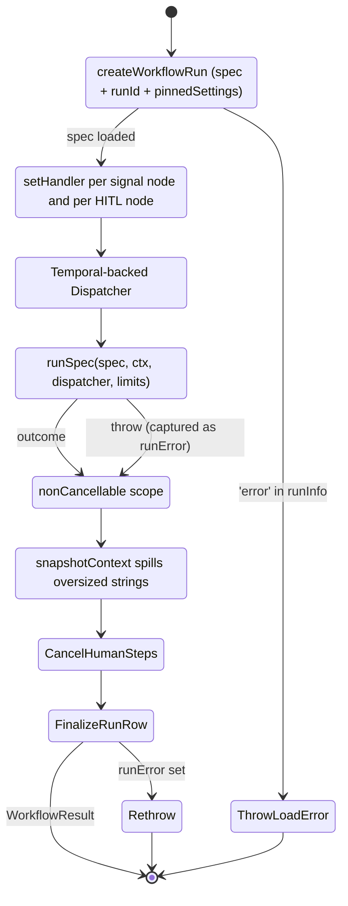

# Temporal Workflow Definitions

> Indexed at commit `ae416937` on 2026-10-03 · [view on GitHub](https://github.com/yorch/auto-swe/tree/ae416937)

## Relevant source files

- [packages/worker/src/workflows/index.ts](https://github.com/yorch/auto-swe/blob/ae416937/packages/worker/src/workflows/index.ts)
- [packages/worker/src/workflows/runnable.ts](https://github.com/yorch/auto-swe/blob/ae416937/packages/worker/src/workflows/runnable.ts)
- [packages/worker/src/workflows/proxyOptions.ts](https://github.com/yorch/auto-swe/blob/ae416937/packages/worker/src/workflows/proxyOptions.ts)
- [packages/worker/src/workflows/nodeTag.ts](https://github.com/yorch/auto-swe/blob/ae416937/packages/worker/src/workflows/nodeTag.ts)
- [packages/worker/src/workflows/nodeTagScope.ts](https://github.com/yorch/auto-swe/blob/ae416937/packages/worker/src/workflows/nodeTagScope.ts)
- [packages/worker/src/workflows/nodeTagInterceptor.ts](https://github.com/yorch/auto-swe/blob/ae416937/packages/worker/src/workflows/nodeTagInterceptor.ts)
- [packages/worker/src/workflows/traceContextInterceptor.ts](https://github.com/yorch/auto-swe/blob/ae416937/packages/worker/src/workflows/traceContextInterceptor.ts)
- [packages/worker/src/workflows/taskChild.ts](https://github.com/yorch/auto-swe/blob/ae416937/packages/worker/src/workflows/taskChild.ts)
- [packages/worker/src/workflows/epicOrchestrator.ts](https://github.com/yorch/auto-swe/blob/ae416937/packages/worker/src/workflows/epicOrchestrator.ts)
- [packages/worker/src/workflows/channelAssistant.ts](https://github.com/yorch/auto-swe/blob/ae416937/packages/worker/src/workflows/channelAssistant.ts)
- [packages/worker/src/workflows/channelScheduledTask.ts](https://github.com/yorch/auto-swe/blob/ae416937/packages/worker/src/workflows/channelScheduledTask.ts)
- [packages/worker/src/workflows/channelAmbient.ts](https://github.com/yorch/auto-swe/blob/ae416937/packages/worker/src/workflows/channelAmbient.ts)
- [packages/worker/src/workflows/channelReactive.ts](https://github.com/yorch/auto-swe/blob/ae416937/packages/worker/src/workflows/channelReactive.ts)
- [packages/worker/src/workflows/workflowAuthorJob.ts](https://github.com/yorch/auto-swe/blob/ae416937/packages/worker/src/workflows/workflowAuthorJob.ts)
- [packages/worker/src/workflows/workflowAuthor.ts](https://github.com/yorch/auto-swe/blob/ae416937/packages/worker/src/workflows/workflowAuthor.ts)
- [packages/worker/src/workflows/workflowExplain.ts](https://github.com/yorch/auto-swe/blob/ae416937/packages/worker/src/workflows/workflowExplain.ts)
- [packages/worker/src/workflows/scheduledConsolidation.ts](https://github.com/yorch/auto-swe/blob/ae416937/packages/worker/src/workflows/scheduledConsolidation.ts)
- [packages/worker/src/workflows/scheduledEval.ts](https://github.com/yorch/auto-swe/blob/ae416937/packages/worker/src/workflows/scheduledEval.ts)
- [packages/worker/src/workflows/scheduledRevalidation.ts](https://github.com/yorch/auto-swe/blob/ae416937/packages/worker/src/workflows/scheduledRevalidation.ts)
- [packages/worker/src/workflows/scheduledRepoDependencyScan.ts](https://github.com/yorch/auto-swe/blob/ae416937/packages/worker/src/workflows/scheduledRepoDependencyScan.ts)
- [packages/worker/src/workflows/scheduledRepoAccessSync.ts](https://github.com/yorch/auto-swe/blob/ae416937/packages/worker/src/workflows/scheduledRepoAccessSync.ts)
- [packages/worker/src/workflows/scheduledModelDiscovery.ts](https://github.com/yorch/auto-swe/blob/ae416937/packages/worker/src/workflows/scheduledModelDiscovery.ts)
- [packages/worker/src/workflows/consolidateLessons.ts](https://github.com/yorch/auto-swe/blob/ae416937/packages/worker/src/workflows/consolidateLessons.ts)
- [packages/worker/src/workflows/evalRun.ts](https://github.com/yorch/auto-swe/blob/ae416937/packages/worker/src/workflows/evalRun.ts)
- [packages/worker/src/workflows/inferRepoDependencies.ts](https://github.com/yorch/auto-swe/blob/ae416937/packages/worker/src/workflows/inferRepoDependencies.ts)
- [packages/worker/src/workflows/reembedMemory.ts](https://github.com/yorch/auto-swe/blob/ae416937/packages/worker/src/workflows/reembedMemory.ts)
- [packages/worker/src/lib/workflowEngine.ts](https://github.com/yorch/auto-swe/blob/ae416937/packages/worker/src/lib/workflowEngine.ts)
- [packages/shared/src/workflow/interpreter.ts](https://github.com/yorch/auto-swe/blob/ae416937/packages/shared/src/workflow/interpreter.ts)
- [packages/shared/src/workflow/signalSlots.ts](https://github.com/yorch/auto-swe/blob/ae416937/packages/shared/src/workflow/signalSlots.ts)
- [packages/worker/src/workflows/runnable.replay.test.ts](https://github.com/yorch/auto-swe/blob/ae416937/packages/worker/src/workflows/runnable.replay.test.ts)
- [packages/worker/src/workflows/runnable.workflow.test.ts](https://github.com/yorch/auto-swe/blob/ae416937/packages/worker/src/workflows/runnable.workflow.test.ts)
- [packages/worker/scripts/recordReplayHistory.ts](https://github.com/yorch/auto-swe/blob/ae416937/packages/worker/scripts/recordReplayHistory.ts)

## Overview

`packages/worker/src/workflows/` holds every Temporal workflow definition in the platform. Nineteen workflow functions are exported from the barrel at [packages/worker/src/workflows/index.ts](https://github.com/yorch/auto-swe/blob/ae416937/packages/worker/src/workflows/index.ts), which is the module the worker points `workflowsPath` at so Temporal can bundle them all into one V8 isolate. The barrel also re-exports two non-workflow values that callers need by name: `epicCancelSignal` and `authorJobProgressQuery`.

Only one of them contains real business logic. `RunnableWorkflow` is a generic interpreter that executes any versioned JSON workflow spec; everything a run does (implement, review, gate, open a pull request, wait for a human, run a library agent against a repository) is a node in that spec rather than a branch in workflow code. The other eighteen are orchestration shells: fan-out parents, schedule targets, thin durable wrappers around a single activity, and channel-assistant turn handlers. No workflow exists per feature: a run of the Agent Run system template and a model-catalog refresh are both `RunnableWorkflow` executions of a different spec, covered in [Agent Runs and Implementer Runtimes](./4.6-agent-runs-and-implementer-runtimes.md) and [Model Catalog and Pricing](./4.7-model-catalog-and-pricing.md).

The directory mixes five kinds of file, and only the first kind is registered as a workflow:

| Kind | Files |
| ---- | ----- |
| Workflow definitions (19, one per exported workflow) | `runnable.ts`, `epicOrchestrator.ts`, `channelAssistant.ts`, `channelScheduledTask.ts`, `channelAmbient.ts`, `channelReactive.ts`, `scheduledConsolidation.ts`, `consolidateLessons.ts`, `scheduledEval.ts`, `evalRun.ts`, `scheduledRevalidation.ts`, `scheduledRepoDependencyScan.ts`, `scheduledRepoAccessSync.ts`, `scheduledModelDiscovery.ts`, `inferRepoDependencies.ts`, `reembedMemory.ts`, `workflowAuthor.ts`, `workflowAuthorJob.ts`, `workflowExplain.ts` |
| Isolate-safe support modules (4) | `index.ts` (barrel), `proxyOptions.ts` (retry and timeout presets), `taskChild.ts` (shared child-launch contract), `nodeTag.ts` and `nodeTagScope.ts` (the node-attribution contract and its async-local store) |
| Workflow interceptor modules (2) | `nodeTagInterceptor.ts` and `traceContextInterceptor.ts`, loaded through `interceptors.workflowModules`, not through the barrel |
| Test files (11; never exported from the barrel) | `runnable.workflow.test.ts`, `runnable.replay.test.ts`, `runnable.nodeTag.workflow.test.ts`, `runnable.nodeTag.replay.test.ts`, `runnable.traceContext.replay.test.ts`, `traceContext.workflow.test.ts`, `ciFixLoop.workflow.test.ts`, `channelAssistant.workflow.test.ts`, `epicOrchestrator.workflow.test.ts`, `epicOrchestrator.test.ts`, `proxyOptions.agentRun.test.ts` |
| Test-only workflow bundles (2) and recorded fixtures | `testing/epicCancelWorkflows.ts` and `testing/traceContextWorkflows.ts` define stand-in workflows for tests; `__fixtures__/` holds nineteen `.bin` histories |

Tests, bundles and fixtures are covered in the last two sections.

Sources: [packages/worker/src/workflows/index.ts:L1-L21](https://github.com/yorch/auto-swe/blob/ae416937/packages/worker/src/workflows/index.ts#L1-L21) [packages/worker/src/index.ts:L80-L117](https://github.com/yorch/auto-swe/blob/ae416937/packages/worker/src/index.ts#L80-L117)

## Workflow Inventory

| Workflow | Input | Output | Role |
| -------- | ----- | ------ | ---- |
| `RunnableWorkflow` | `RunnableWorkflowInput` (`templateId`, `templateVersion`, `request`) | `WorkflowResult` | Generic spec interpreter; the platform's main run |
| `EpicOrchestratorWorkflow` | `EpicRequest` | `EpicResult` | Multi-repo epic; starts one child run per repo in dependency order |
| `ChannelAssistantWorkflow` | `ChannelAssistantTurnInput` | `void` | One Slack @mention, one reply; may launch a task child |
| `ChannelScheduledTaskWorkflow` | `ChannelScheduledTaskInput` | `void` | Sleeps until `runAt`, then starts a deferred task child |
| `ChannelAmbientWorkflow` | `{ channelId }` | `void` | Per-channel proactive digest, memory consolidation, sweeps |
| `ChannelReactiveWorkflow` | `{ channelId }` | `void` | Per-channel reactive interjection evaluation |
| `ScheduledConsolidationWorkflow` | `ScheduledConsolidationInput` | `ScheduledConsolidationResult` | Fan-out to one `ConsolidateLessonsWorkflow` child per repo |
| `ConsolidateLessonsWorkflow` | `ConsolidateLessonsInput` | `ConsolidateLessonsResult` | Single-activity lesson consolidation for one repo |
| `ScheduledEvalWorkflow` | `ScheduledEvalInput` | `void` | Nightly benchmark; prepare then run the eval harness |
| `EvalRunWorkflow` | `EvalRunWorkflowInput` | `void` | Durable wrapper around one offline eval harness run |
| `ScheduledRevalidationWorkflow` | `ScheduledRevalidationInput` | `ScheduledRevalidationResult` | Per-dataset re-validation fan-out |
| `ScheduledRepoDependencyScanWorkflow` | none | `ScheduledRepoDependencyScanResult` | Per-repo dependency detection fan-out |
| `ScheduledRepoAccessSyncWorkflow` | none | `ScheduledRepoAccessSyncResult` | One activity call that refreshes cached GitHub permission answers |
| `ScheduledModelDiscoveryWorkflow` | none | `ScheduledModelDiscoveryResult` (the `discoverModels` return type) | One activity call that asks each configured provider which models it lists |
| `InferRepoDependenciesWorkflow` | `{ repoId }` | `{ autoPromoted, proposed }` | One-shot LLM dependency inference for one repo |
| `ReembedMemoryWorkflow` | `{ memoryId }` | `void` | Regenerates a stale pgvector embedding out of band |
| `WorkflowAuthorWorkflow` | `GenerateWorkflowSpecInput` | `GenerateWorkflowSpecResult` | Synchronous spec generation the gateway awaits |
| `WorkflowAuthorJobWorkflow` | `WorkflowAuthorJobInput` | `WorkflowAuthorJobResult` | Async spec generation job with a progress query |
| `WorkflowExplainWorkflow` | `ExplainWorkflowSpecInput` | `ExplainWorkflowSpecResult` | One fast LLM call explaining a spec in plain language |

Every workflow runs on the single `engineering-workflow` task queue: the worker polls it, and the gateway's Temporal plugin starts workflows by name on it, either directly or as the action of a named Temporal Schedule. The schedule actions in the plugin name each workflow type as a string, so the exported function name is part of the schedule contract. Six system-wide schedules have fixed ids: lesson consolidation, eval regression, eval re-validation, repo dependency scan, repo access sync and model discovery.

Two groups of those schedules are configured differently. The consolidation, eval and re-validation schedules read their cron expression and enabled flag from database-backed config resolvers when the gateway boots. The repo dependency scan, repo access sync and model discovery schedules come from `resolveScheduledSweeps()`, which reads six environment variables (`REPO_ACCESS_SYNC_ENABLED` and `_CRON`, `REPO_DEPENDENCY_SCAN_ENABLED` and `_CRON`, `MODEL_DISCOVERY_ENABLED` and `_CRON`) once at start-up. Access sync defaults to disabled because its cost grows with team members times repositories; discovery defaults to enabled because it only lists models. A disabled sweep still has its schedule, paused. The gateway refuses to boot on a set-but-unusable value rather than silently substituting a default, because for an `ENABLED` flag the default can be the opposite of what was meant.

`ScheduledRepoAccessSyncWorkflow` is deliberately a single activity call rather than a per-repository fan-out like the dependency scan. Its cost is GitHub API quota against one shared credential, so running repositories concurrently would spend the same quota in a burst; the activity's inner loop already leaves a pair's previous answer in place when that pair fails. Webhook invalidation keeps revocation fast, and the schedule only bounds how long a missed webhook can hide one. `ScheduledModelDiscoveryWorkflow` has the same single-call shape for a related reason: the provider calls run in parallel inside the activity and each already survives its own failure.

Sources: [packages/worker/src/workflows/index.ts:L1-L21](https://github.com/yorch/auto-swe/blob/ae416937/packages/worker/src/workflows/index.ts#L1-L21) [packages/worker/src/workflows/runnable.ts:L261-L269](https://github.com/yorch/auto-swe/blob/ae416937/packages/worker/src/workflows/runnable.ts#L261-L269) [packages/worker/src/workflows/epicOrchestrator.ts:L92](https://github.com/yorch/auto-swe/blob/ae416937/packages/worker/src/workflows/epicOrchestrator.ts#L92) [packages/worker/src/workflows/scheduledRepoAccessSync.ts:L1-L29](https://github.com/yorch/auto-swe/blob/ae416937/packages/worker/src/workflows/scheduledRepoAccessSync.ts#L1-L29) [packages/worker/src/workflows/scheduledModelDiscovery.ts:L1-L21](https://github.com/yorch/auto-swe/blob/ae416937/packages/worker/src/workflows/scheduledModelDiscovery.ts#L1-L21) [packages/gateway/src/plugins/temporal.ts:L28-L33](https://github.com/yorch/auto-swe/blob/ae416937/packages/gateway/src/plugins/temporal.ts#L28-L33) [packages/gateway/src/plugins/temporal.ts:L312-L336](https://github.com/yorch/auto-swe/blob/ae416937/packages/gateway/src/plugins/temporal.ts#L312-L336) [packages/gateway/src/plugins/temporal.ts:L867-L935](https://github.com/yorch/auto-swe/blob/ae416937/packages/gateway/src/plugins/temporal.ts#L867-L935) [packages/gateway/src/index.ts:L91-L94](https://github.com/yorch/auto-swe/blob/ae416937/packages/gateway/src/index.ts#L91-L94) [packages/gateway/src/index.ts:L155-L188](https://github.com/yorch/auto-swe/blob/ae416937/packages/gateway/src/index.ts#L155-L188) [packages/shared/src/lib/systemConfig.ts:L907-L960](https://github.com/yorch/auto-swe/blob/ae416937/packages/shared/src/lib/systemConfig.ts#L907-L960)

## RunnableWorkflow

### Lifecycle

`RunnableWorkflow` runs in five stages and never inspects the spec's semantics itself. It materializes the run row, registers signal handlers, builds a dispatcher, hands both to the shared interpreter, and finalizes.

```mermaid
stateDiagram-v2
    [*] --> CreateRun
    CreateRun: createWorkflowRun (spec + runId + pinnedSettings)
    CreateRun --> RegisterSignals: spec loaded
    CreateRun --> ThrowLoadError: 'error' in runInfo
    RegisterSignals: setHandler per signal node and per HITL node
    RegisterSignals --> BuildDispatcher
    BuildDispatcher: Temporal-backed Dispatcher
    BuildDispatcher --> RunSpec
    RunSpec: runSpec(spec, ctx, dispatcher, limits)
    RunSpec --> Finalize: outcome
    RunSpec --> Finalize: throw (captured as runError)
    Finalize: nonCancellable scope
    Finalize --> Snapshot
    Snapshot: snapshotContext spills oversized strings
    Snapshot --> CancelHumanSteps
    CancelHumanSteps --> FinalizeRunRow
    FinalizeRunRow --> Rethrow: runError set
    FinalizeRunRow --> [*]: WorkflowResult
    Rethrow --> [*]
    ThrowLoadError --> [*]
```

The first activity, `createWorkflowRun`, receives the template id and version, the workflow id, the work-request id, the canary agent key and version, and the request's `launchedById`. When the request carries a `parentWorkflowId` (an epic child), it also receives that id and the `repoId`, so the child gets its own ledger row; every other run sends neither. It returns the parsed spec, the run id, and a pinned-settings snapshot in one round trip. A load failure throws a non-retryable `ApplicationFailure` of type `WORKFLOW_RUN_SETUP_FAILED`; a plain `Error` from workflow code would fail the workflow task, which Temporal retries indefinitely, so the run would hang instead of failing once. Interpreter bounds come from the snapshot through `readInterpreterLimits`, not from a live config read, so a mid-run settings edit cannot change the ceiling a replay was recorded under. When the snapshot is missing entirely, which is what a run row created before the column existed carries, the interpreter defaults apply instead of an error.

`launchedById` is the run's identity for per-user credentials. `EpicOrchestratorWorkflow` copies it onto each child request only when the epic carries one, so a child of an epic that has no launcher receives exactly the input it always did.

The run's workspace defaults are derived on the workflow side: `connectionId` falls back from the request's `connectionId` to `repoId`, and an absent `workspaceProvider` becomes `git_repo`, which is what makes a software-engineering run a special case of the generic one rather than a separate code path.

Finalization is wrapped in `CancellationScope.nonCancellable`. Without it, every activity started after the root scope was cancelled would throw `CancelledFailure` immediately, leaving cancelled runs stuck at `RUNNING` with their pending human steps still in the inbox. Inside that scope the workflow snapshots the context, cancels lingering `PENDING` human steps best-effort, and writes the terminal status. A cancellation surfaces from `runSpec` as a `CancelledFailure` and is classified `CANCELLED` rather than `FAILED`.

The returned object spreads the terminate node's result first and then the real status, so a `status` key inside a spec-authored result cannot overwrite the run's actual outcome.

Sources: [packages/worker/src/workflows/runnable.ts:L269-L503](https://github.com/yorch/auto-swe/blob/ae416937/packages/worker/src/workflows/runnable.ts#L269-L503) [packages/worker/src/workflows/epicOrchestrator.ts:L162-L173](https://github.com/yorch/auto-swe/blob/ae416937/packages/worker/src/workflows/epicOrchestrator.ts#L162-L173) [packages/worker/src/lib/workflowEngine.ts:L1-L19](https://github.com/yorch/auto-swe/blob/ae416937/packages/worker/src/lib/workflowEngine.ts#L1-L19)

### Activity proxies and timeout tiers

Nineteen `proxyActivities` groups sit at module scope, each pairing a retry policy with a timeout tier drawn from [packages/worker/src/workflows/proxyOptions.ts](https://github.com/yorch/auto-swe/blob/ae416937/packages/worker/src/workflows/proxyOptions.ts). Retry presets are named by role and timeout constants by their literal duration string, so a reviewer can confirm at a glance that a refactor changed no effective value. Two groups spell their retry policy inline (merge and GitHub), and the CI-polling group spells its timeout inline; those are marked below.

| Proxy group | Activities | Retry | Start-to-close | Heartbeat |
| ----------- | ---------- | ----- | -------------- | --------- |
| state | run rows, human steps, domain state, context spill | `RETRY_STATE` (5 attempts, 1s to 30s) | `30s` | none |
| generic | `resolveWorkspace`, `readSource`, `writeOutcome`, `publishOutcome`, `runTool` | `RETRY_STANDARD` (3 attempts, 5s to 1m) | `1m` | none |
| agent | implementation, the three fix variants, `planDecomposition`, `runChannelSubtasks`, `runReviewNetwork` | `RETRY_AGENT` (2 attempts, 30s to 2m) | `30m` | `5m` |
| merge | `mergeBranches` | inline, 2 attempts, 5s to 1m | `15m` | `5m` |
| conflict | `resolveMergeConflict` | `RETRY_AGENT` | `30m` | `5m` |
| shell | `runShellStep` | `RETRY_SANDBOX` (2 attempts, 5s to 30s) | `60m` | `5m` |
| container step | `runContainerStep` | `RETRY_SANDBOX` | `60m` | `5m` |
| quality gates | lint, typecheck, tests, build, vuln scan, perf bench | `RETRY_SANDBOX` | `15m` | `2m` |
| GitHub | `createOrUpdatePullRequest`, `fetchCILogs` | inline, 4 attempts, coefficient 3, 5s to 2m | `2m` | none |
| catalog | `listProviderModels` | `RETRY_STANDARD` | `5m` | none |
| context | `validateContext` | `RETRY_STANDARD` | `5m` | `2m` |
| memory | `commitToMemory` | `RETRY_STANDARD` | `5m` | none |
| declarative agent | `runAgentNode`, `planChannelTask` | `RETRY_STANDARD` | `10m` | `2m` |
| agent task | `runAgentTask` | `RETRY_SINGLE_ATTEMPT` | `T_AGENT_RUN_ACTIVITY` (21,600 s) | `5m` |
| eval node | `runEvalNode` | `RETRY_STANDARD` | `10m` | `2m` |
| MCP node | `mcpCallTool` | `RETRY_STANDARD` | `10m` | `2m` |
| CI config | `resolveCiWaitConfig` | `RETRY_STANDARD` | `1m` | none |
| CI polling | `waitForCiByPolling` | `RETRY_SINGLE_ATTEMPT` | `6h` (inline literal) | `2m` |
| PRD decomposition | `analyzePrd`, `decomposePrd`, `createTrackerItems`, `submitPrdWorkRequests` | `RETRY_LLM_LIGHT` (2 attempts, 10s to 1m) | `15m` | `5m` |

Three choices in that table carry load. Gate activities keep Temporal-level retries low on purpose, because retry, warn, and block semantics belong to the spec's `onFail` policy and are handled by the interpreter, not the proxy. `waitForCiByPolling` gets exactly one attempt and a six-hour cap, since the activity owns its own poll loop and bounds itself by the `deadlineSec` input; the cap only has to exceed the largest configurable deadline. And the shell and container-step groups carry a five-minute heartbeat timeout: it lets Temporal notice a worker that died mid-step instead of waiting out the full hour, and it is also how a cancellation request reaches the running step.

The agent-task timeout is derived rather than chosen. `T_AGENT_RUN_ACTIVITY_SECONDS` is the setting's hard maximum wall clock (14,400 s, mirrored in `AGENT_RUN_CEILING_SECONDS` because workflow code cannot import the setting) plus 7,200 s of headroom for the clones, export, scan and push around the agent loop. It is only a backstop; the real bound is the per-run deadline inside the activity, and a test pins the mirror to the setting. The step is single-attempt because a retry would re-spend and could re-publish. See [Agent Runs and Implementer Runtimes](./4.6-agent-runs-and-implementer-runtimes.md) for what the activity does.

The two eval workflows set `retry: { maximumAttempts: 1 }` on the harness activity for a related reason: the activity is the whole benchmark, and Temporal's default policy retries without limit, which would re-run every Docker-plus-LLM case from the start.

Sources: [packages/worker/src/workflows/runnable.ts:L60-L257](https://github.com/yorch/auto-swe/blob/ae416937/packages/worker/src/workflows/runnable.ts#L60-L257) [packages/worker/src/workflows/proxyOptions.ts:L27-L147](https://github.com/yorch/auto-swe/blob/ae416937/packages/worker/src/workflows/proxyOptions.ts#L27-L147) [packages/worker/src/workflows/proxyOptions.ts:L182-L202](https://github.com/yorch/auto-swe/blob/ae416937/packages/worker/src/workflows/proxyOptions.ts#L182-L202) [packages/worker/src/workflows/evalRun.ts:L14-L25](https://github.com/yorch/auto-swe/blob/ae416937/packages/worker/src/workflows/evalRun.ts#L14-L25) [packages/worker/src/workflows/scheduledEval.ts:L25-L36](https://github.com/yorch/auto-swe/blob/ae416937/packages/worker/src/workflows/scheduledEval.ts#L25-L36)

### Step dispatch

The interpreter asks the dispatcher to run a step by name. `dispatchStepImpl` does one `Map` lookup against `STEP_EXECUTORS` and throws `unknown step` on a miss, so there is no `switch` and adding a step never changes control flow.

Thirty-eight executors are registered, covering domain-state updates, context validation, the declarative agent, the internal `runAgentTask` step of the Agent Run template, eval, MCP and container nodes, implementation and its three fix variants, the review network, the six quality gates, pull-request creation, provider model listing, CI log fetch, CI wait-config resolution and polling, memory commits, branch merges and conflict resolution, the general-route channel planner and subtask runner, the four PRD steps, and the generic connector steps that resolve a workspace, read a source, write an outcome, publish, or run a tool. The six quality gates share a single `gateExecutor` that indexes the activity by the step name, because all six take the same input shape.

Executors resolve their arguments in tiers, but no single order is imposed on all 38; each executor takes only the tiers that make sense for it. The common order is:

1. An explicit `inputs` binding resolved by the interpreter, for example `inputs.branch`, `inputs.codeResult`, `inputs.subtasks`, `inputs.guidance`.
2. The node's `config`, for example `config.branch`, `config.command`, `config.systemPrompt`, `config.allowedPaths`, `config.draft`.
3. A `lookupPath` read from the run context, for example `context.currentCodeResult`, `context.lastCILogs`, `context.lastRejectionSummary`, `context.successCriteria`, `context.lastGateOutput`.
4. A request field or a hard default, for example `request.description`, `request.repoId`, the `auto` branch prefix, `git_repo` as the workspace provider, or an empty string.

`gateExecutor` runs tiers 1 to 3 for the branch. The review-fix and CI-fix steps read their failure text from tiers 1, 3 and 4. `validateContext` reads only `config`. `pickCodeResult` centralizes the common fallback to `context.currentCodeResult` and throws when nothing is bound, and `resolveConnectionId` throws when neither `inputs.connectionId` nor a resolved workspace connection exists. `resolveMergeBindings` is stricter: `sourceBranches` must be an explicit `string[]` input and is never defaulted. A step inside a fan-out branch reads its per-branch element through the interpreter-named `fanOut.itemKey`, defaulting to `subtask`.

Several optional arguments are forwarded only when set, so a step that does not set them calls the activity with exactly the arguments it always had. A non-blank `inputs.guidance` (free text, or the field map a `humanInput` node stores) is appended to the implementer request's description under a heading, and blank fields are dropped. A non-empty `config.allowedPaths` string array becomes a trailing argument of `executeImplementation` and `executeReviewFixImplementation`. `config.draft === true` opens the pull request as a draft. The `runAgentTask` executor passes only the request, and the activity re-checks that it is running for the Agent Run template, so nothing in the workflow is trusted to have checked.

Tool selection is deliberately excluded from this path: an executor derives `config.systemPrompt` but never forwards a tools override, because tool access is resolved from the database through the agent cascade.

Sources: [packages/worker/src/workflows/runnable.ts:L505-L591](https://github.com/yorch/auto-swe/blob/ae416937/packages/worker/src/workflows/runnable.ts#L505-L591) [packages/worker/src/workflows/runnable.ts:L592-L1040](https://github.com/yorch/auto-swe/blob/ae416937/packages/worker/src/workflows/runnable.ts#L592-L1040) [packages/worker/src/workflows/runnable.ts:L1042-L1105](https://github.com/yorch/auto-swe/blob/ae416937/packages/worker/src/workflows/runnable.ts#L1042-L1105)

### Node attribution and trace context

Two workflow interceptors, registered together in the worker's `interceptors.workflowModules`, add headers to what the workflow schedules. They add nothing else, so the command stream Temporal compares on replay (type and order) is unchanged.

The node-tag interceptor stamps each activity the interpreter dispatches with the spec node it runs for, so persisted `AgentTrace` rows can be attributed to a node. `dispatchShell` and `dispatchStep` wrap their call in `runWithNodeTag`, which stores a `NodeTag` (`specNodeId`, `recordingId`, `stepAttempt`) in an `AsyncLocalStorage`. A store rather than a module variable is required because a fan-out runs several branches concurrently, each awaiting between choosing its node and scheduling its activity; a shared slot would hand one branch's tag to another's activity. `recordingId` is the interpreter's recording id (branch-prefixed inside a fan-out, such as `fan[0]/impl`), and `stepAttempt` increments each time `onFail.retry` dispatches again. An activity scheduled outside a dispatch (state bookkeeping, finalization) gets no header. The worker reads the header back on the activity side before the activity body runs.

The trace-context interceptor reads the header the workflow was started with and forwards it, undecoded, to every activity, local activity, child workflow and continue-as-new it schedules, so a gateway request and every activity of the run it started share one trace. The header name is duplicated in the isolate because the shared module that owns it loads OpenTelemetry; a test asserts the two agree. See [Observability and Cost](./4.5-observability-and-cost.md) for how traces are consumed.

Sources: [packages/worker/src/workflows/nodeTag.ts:L1-L36](https://github.com/yorch/auto-swe/blob/ae416937/packages/worker/src/workflows/nodeTag.ts#L1-L36) [packages/worker/src/workflows/nodeTagScope.ts:L1-L20](https://github.com/yorch/auto-swe/blob/ae416937/packages/worker/src/workflows/nodeTagScope.ts#L1-L20) [packages/worker/src/workflows/nodeTagInterceptor.ts:L1-L29](https://github.com/yorch/auto-swe/blob/ae416937/packages/worker/src/workflows/nodeTagInterceptor.ts#L1-L29) [packages/worker/src/workflows/traceContextInterceptor.ts:L1-L47](https://github.com/yorch/auto-swe/blob/ae416937/packages/worker/src/workflows/traceContextInterceptor.ts#L1-L47) [packages/worker/src/workflows/runnable.ts:L373-L407](https://github.com/yorch/auto-swe/blob/ae416937/packages/worker/src/workflows/runnable.ts#L373-L407) [packages/worker/src/workflows/runnable.ts:L1107-L1116](https://github.com/yorch/auto-swe/blob/ae416937/packages/worker/src/workflows/runnable.ts#L1107-L1116) [packages/worker/src/index.ts:L93-L108](https://github.com/yorch/auto-swe/blob/ae416937/packages/worker/src/index.ts#L93-L108)

### Signals and human-in-the-loop suspension

Signal handlers are registered up front for every name the spec mentions statically: a `signal` node's `name`, and `hitl_<nodeId>` for each of the four human node types. `SignalSlots` owns the buffering and consume-once semantics so the dispatcher stays a thin wrapper.

Static registration is not sufficient. A human node reached inside a fan-out branch waits on a branch-unique name such as `hitl_fan[0]/gate`, which only exists once the interpreter walks there, so `waitSignal` registers any unseen name lazily on first use. That is replay-safe because Temporal buffers a signal that arrives before its handler is set and handler registration emits no command.

```mermaid
sequenceDiagram
    participant I as Interpreter (runHumanNode)
    participant D as Dispatcher
    participant T as Temporal
    participant G as Gateway / inbox
    I->>D: recordStep(PENDING)
    I->>D: notifyHumanStep(kind, options, timeout, requiredApprovers)
    D->>T: createHumanStep activity
    T-->>G: row appears in the inbox
    I->>D: waitSignal("hitl_<nodeId>", node.timeout)
    D->>D: ensureSignalHandler(name)
    D->>T: condition(() => slots.hasPending(name), timeout)
    Note over T: workflow parks; no activity in flight
    G->>T: signal hitl_<nodeId> {action, value}
    T-->>D: slots.deliver -> condition resolves
    D-->>I: slots.take(payload)
    I->>I: route on approve / reject / option / onSubmit
```

The wait is a plain `condition` with the node's timeout as its duration. On timeout the interpreter records the step `SKIPPED`, resolves the database row as `TIMED_OUT`, and takes the node's `onTimeout` edge. Deliberately, `waitSignal` performs no stale-payload reset: a signal that lands before the interpreter reaches its wait node, which is what happens when a continuous-integration webhook races the pull-request step, is kept and satisfies that wait, and `take()` consumes it so no later wait can see it twice.

Three details of the human path matter for correctness. A `humanApproval` node with `approverCount` resolves it to a positive integer (anything else means one) and hands it to the human-step row as `requiredApprovers`, so the gateway can hold the signal until that many distinct people have approved. A `humanDecision` signal whose value is not one of the node's options is treated as a malformed signal rather than a choice: the step is recorded `FAILED` with the offending value and the run takes the `onTimeout` edge, never `PASSED`. The recorded `human-decision` history walks exactly that path, so it must stay a record and a route rather than a throw. And inside a fan-out branch the wait is cancellable (see below), so a sibling's failure cannot leave the join waiting on a human for the rest of the timeout.

A second signal, the channel steering signal, appends to a plain in-workflow array. Its buffer is drained by `drainSteering()` so each agent node consumes only the guidance that arrived since the previous one. Steering reaches `agent` nodes only, so a code-route task running the software-engineering template buffers steering that is never consumed.

Sources: [packages/worker/src/workflows/runnable.ts:L312-L363](https://github.com/yorch/auto-swe/blob/ae416937/packages/worker/src/workflows/runnable.ts#L312-L363) [packages/worker/src/workflows/runnable.ts:L408-L431](https://github.com/yorch/auto-swe/blob/ae416937/packages/worker/src/workflows/runnable.ts#L408-L431) [packages/shared/src/workflow/interpreter.ts:L1014-L1155](https://github.com/yorch/auto-swe/blob/ae416937/packages/shared/src/workflow/interpreter.ts#L1014-L1155) [packages/shared/src/workflow/signalSlots.ts:L22-L67](https://github.com/yorch/auto-swe/blob/ae416937/packages/shared/src/workflow/signalSlots.ts#L22-L67)

### Fan-out and cancellation

The workflow does not implement fan-out; the shared interpreter runs branches through a bounded worker pool and calls back into the dispatcher for each step. What the workflow contributes is cancellation. Every dispatch inside a branch receives a `cancellation` sink. `runWithCancellation` wraps the activity await in a per-call `CancellationScope` and writes a `cancel()` callback into the sink, so a fan-out running in `onBranchFail: 'block'` mode can cancel every sibling's in-flight call. Both `dispatchShell` and `dispatchStep` go through it.

Cancelling a scope has a narrower effect than aborting the activity. The workflow stops waiting immediately and a cancel request is recorded, but the request reaches the worker only through the activity's next heartbeat, and the activity stops only if it then observes its cancellation signal. The implementer, fix and merge-resolver loops and `runAgent` do, aborting the in-flight LLM call and refusing to push; an activity that neither heartbeats nor checks the signal runs to completion in the background and its result is discarded.

A cancelled call is rethrown as `BranchCancelledError` rather than the raw `CancelledFailure`. That distinction matters: the interpreter's retry wrapper recognizes the branch error and bypasses `onError` and `onFail` policies, so a sibling with `onFail: 'warn'` cannot swallow a cancellation raised on it by block mode and keep running. The interpreter tags the class with a property as well as an `instanceof` check, because the class identity can drift across the isolate boundary. The token is cleared in a `finally`, because leaving it behind would let a later cancel target a scope that already settled.

The interpreter extends the same mechanism beyond activities. A branch's sink carries a `shouldAbort` predicate as well as the token; a signal or human wait inside the branch points the token at itself through `waitCancellable`, which races the wait against a cancellation promise, and a branch between activities checks `shouldAbort` before its next node and before each retry attempt. A nested fan-out inherits its parent's predicate, so aborting the outer branch stops the inner pool too.

Sources: [packages/worker/src/workflows/runnable.ts:L1118-L1162](https://github.com/yorch/auto-swe/blob/ae416937/packages/worker/src/workflows/runnable.ts#L1118-L1162) [packages/shared/src/workflow/interpreter.ts:L57-L99](https://github.com/yorch/auto-swe/blob/ae416937/packages/shared/src/workflow/interpreter.ts#L57-L99) [packages/shared/src/workflow/interpreter.ts:L1157-L1184](https://github.com/yorch/auto-swe/blob/ae416937/packages/shared/src/workflow/interpreter.ts#L1157-L1184) [packages/shared/src/workflow/interpreter.ts:L1199-L1340](https://github.com/yorch/auto-swe/blob/ae416937/packages/shared/src/workflow/interpreter.ts#L1199-L1340)

### Run state and the context spill

Run state is surfaced through the database, not through Temporal queries. `RunnableWorkflow` defines no query handler: it reports progress by calling `recordWorkflowStep` on every step transition, `createHumanStep` and `resolveHumanStep` around human nodes, and `finalizeWorkflowRun` at the end, and the dashboard reads those rows. Exactly one query handler exists in the directory, `authorJobProgress` on `WorkflowAuthorJobWorkflow`. Signal handlers are the only handlers `RunnableWorkflow`, `EpicOrchestratorWorkflow`, and `ChannelScheduledTaskWorkflow` register.

The final snapshot is size-managed by `snapshotContext`. It walks the context recording the path of every string longer than the 4,000-character inline limit (`CONTEXT_INLINE_LIMIT`), then writes those values to workflow artifacts in batches, each batch sized by an accumulated one-million-unit budget (`SPILL_CHUNK_BUDGET`), and substitutes an artifact reference by path so two identical strings at different paths cannot collide. A single value larger than the chunk budget occupies a chunk by itself. A total ceiling of eight million units (`SPILL_TOTAL_BUDGET`) bounds how much one run may spill, because activity inputs are themselves recorded in workflow history. The ceiling is applied in encounter order, and a value that does not fit in what remains is skipped while later, smaller values can still spill. That skip is guarded by `patched('spill-budget-skip-oversized')`: a history recorded before it stopped at the first value that did not fit, and its replay must spill exactly what it spilled then. A skipped value, or one whose artifact write fails, degrades to a truncated placeholder whose note says which case applied.

Sources: [packages/worker/src/workflows/runnable.ts:L1164-L1325](https://github.com/yorch/auto-swe/blob/ae416937/packages/worker/src/workflows/runnable.ts#L1164-L1325) [packages/worker/src/workflows/runnable.ts:L476-L493](https://github.com/yorch/auto-swe/blob/ae416937/packages/worker/src/workflows/runnable.ts#L476-L493) [packages/worker/src/workflows/workflowAuthorJob.ts:L42-L67](https://github.com/yorch/auto-swe/blob/ae416937/packages/worker/src/workflows/workflowAuthorJob.ts#L42-L67)

## Child-Workflow Relationships

Four workflows start children, and each launch site pins its own parent-close and reuse policy.

`EpicOrchestratorWorkflow` loops while unfinished repos remain, selecting repos whose dependencies have all succeeded and starting one `RunnableWorkflow` child per ready repo under `PARENT_CLOSE_POLICY_REQUEST_CANCEL` and a workflow id of `<epicWorkflowId>-<repoId>`. Each child resolves its own template from its repo's team default, so repos in one epic can run different workflows, and each child request carries the epic's `launchedById` when there is one and the epic's id as `parentWorkflowId`. When a repo finishes without success, `computeTransitiveDependents` walks the dependency graph and marks every downstream repo `SKIPPED`; the seed set includes the failed repo itself so a cycle cannot re-add it and overwrite its terminal verdict.

A single `epicCancelSignal` cancels the epic in two ways. It sets a flag the loop checks each iteration, and it cancels a `CancellationScope` inside which every child is started and awaited, so Temporal requests cancellation of the children already in flight rather than letting them run on to a pull request. The cancel call is guarded by `patched('epic-cancel-children')`, because a history recorded before children were cancelled contains no cancel commands and its replay must not issue them. A child that ends because the epic was cancelled is recorded `FAILED` with `skippedReason: 'epic cancelled'`, and the epic's own result is `CANCELLED`.

`ChannelAssistantWorkflow` launches a task child but never awaits it, because the task must outlive the short turn that posted the acknowledgement. Both its task routes go through `startTaskChild`, which calls `startThreadTaskChild` and so centralizes three invariants: the abandon parent-close policy, the `engineering-workflow` task queue, and `REJECT_DUPLICATE` on a deterministic per-thread workflow id. That id is single-use because the run record is upserted by workflow id, so reusing it would silently misattribute a second task's traces and cost to the first, closed run. A rejected duplicate surfaces as `WorkflowExecutionAlreadyStartedError` and becomes an honest "already a task in this thread" reply rather than a false acknowledgement. A code-route launch can also come back refused on access. That outcome, carried as `refusal`, is a distinct case from "no repository resolved": the workflow posts the refusal text in place of the agent's acknowledgement and does not fall through to the general route, which would answer the question conversationally and never mention the refusal. The requester's Slack id is passed to the preparer so access can be decided there.

`ChannelScheduledTaskWorkflow` is the deferred variant. It holds the same per-thread id, sleeps until `runAt`, folds any steering that arrived before launch into the task description, then starts `RunnableWorkflow` under a private `<id>-run` child id. It then awaits the child purely to hold the steering bridge open, forwarding each later reply to the running child and swallowing a signal rejection from an already-closed run. An unparseable `runAt` yields `NaN` and is treated as run-now rather than hanging.

`ScheduledConsolidationWorkflow` is the only pure fan-out parent: it starts one `ConsolidateLessonsWorkflow` child per opted-in repo with a thirty-minute execution timeout, then awaits each handle individually inside a try/catch so one repo's failure never discards another repo's result. The two other fan-out sweeps, re-validation and the dependency scan, use the same isolation shape with plain activity calls instead of children.

Sources: [packages/worker/src/workflows/epicOrchestrator.ts:L52-L255](https://github.com/yorch/auto-swe/blob/ae416937/packages/worker/src/workflows/epicOrchestrator.ts#L52-L255) [packages/worker/src/workflows/taskChild.ts:L24-L36](https://github.com/yorch/auto-swe/blob/ae416937/packages/worker/src/workflows/taskChild.ts#L24-L36) [packages/worker/src/workflows/channelAssistant.ts:L383-L540](https://github.com/yorch/auto-swe/blob/ae416937/packages/worker/src/workflows/channelAssistant.ts#L383-L540) [packages/worker/src/workflows/channelScheduledTask.ts:L58-L166](https://github.com/yorch/auto-swe/blob/ae416937/packages/worker/src/workflows/channelScheduledTask.ts#L58-L166) [packages/worker/src/workflows/scheduledConsolidation.ts:L22-L63](https://github.com/yorch/auto-swe/blob/ae416937/packages/worker/src/workflows/scheduledConsolidation.ts#L22-L63)

## Channel and Scheduled Workflows

The three channel-triggered workflows share a run-record lifecycle: `startChannelRun` runs first so the agent traces produced inside can resolve a run id and persist, then the body runs, then `finalizeChannelRun` writes the terminal status. Every one of those three calls is wrapped in its own try/catch, because observability must never block the user-visible outcome.

`ChannelAmbientWorkflow` fires five activities in sequence on each schedule tick (digest, memory consolidation, open-item sweep, passive ingestion, and cross-channel signal flagging), each independently best-effort so a failure in one never blocks the rest, and only the digest failure flips the run status. `ChannelReactiveWorkflow` runs a single interjection evaluation on the channel's reactive cron. `ChannelAssistantWorkflow` posts a placeholder message, runs the turn, and edits the placeholder in place with the answer, falling back to a fresh post when the placeholder has no timestamp and to friendly error text when the turn throws. Its turn can return a delegate, generate, or refine intent, and all three are gated on the channel budget before any expensive work starts. A follow-up turn posts no placeholder, because the agent may decide the message was not addressed to it and post nothing at all.

The remaining workflows are thin. `ConsolidateLessonsWorkflow`, `EvalRunWorkflow`, `InferRepoDependenciesWorkflow`, `ReembedMemoryWorkflow`, `ScheduledRepoAccessSyncWorkflow`, `ScheduledModelDiscoveryWorkflow`, `WorkflowAuthorWorkflow`, and `WorkflowExplainWorkflow` each proxy exactly one activity and return its result; they exist so the work is durable, observable in the Temporal UI, and resumable. `ScheduledEvalWorkflow` adds one step: it prepares an eval run and returns early, logging a warning, when the configured dataset does not exist, so the schedule is harmless before the benchmark is seeded. `WorkflowAuthorJobWorkflow` is the one thin-looking workflow with real structure: it exposes an `authorJobProgress` query returning a phase of `generating`, `persisting`, `done`, or `failed`, so the gateway can start it without blocking an HTTP request and let the browser poll. Its persist activity gets exactly one attempt, because a retry after a committed-but-unacknowledged create would leave a second draft template behind.

Sources: [packages/worker/src/workflows/channelAmbient.ts:L89-L173](https://github.com/yorch/auto-swe/blob/ae416937/packages/worker/src/workflows/channelAmbient.ts#L89-L173) [packages/worker/src/workflows/channelReactive.ts:L37-L77](https://github.com/yorch/auto-swe/blob/ae416937/packages/worker/src/workflows/channelReactive.ts#L37-L77) [packages/worker/src/workflows/channelAssistant.ts:L142-L371](https://github.com/yorch/auto-swe/blob/ae416937/packages/worker/src/workflows/channelAssistant.ts#L142-L371) [packages/worker/src/workflows/scheduledEval.ts:L33-L45](https://github.com/yorch/auto-swe/blob/ae416937/packages/worker/src/workflows/scheduledEval.ts#L33-L45) [packages/worker/src/workflows/workflowAuthorJob.ts:L42-L101](https://github.com/yorch/auto-swe/blob/ae416937/packages/worker/src/workflows/workflowAuthorJob.ts#L42-L101)

## Determinism Discipline

Workflow files execute in a V8 isolate, not in Node.js. The isolate has no filesystem, no network, and no Node built-ins, and Temporal's bundler treats a runtime import from an outside package as a determinism hazard. The rule the codebase enforces is therefore mechanical: from an external package, only `import type`, which the TypeScript compiler erases entirely. The sole exceptions are the Temporal SDK packages themselves.

Four categories of module-level import are legal in a workflow file:

| Import kind | Example | Why it is safe |
| ----------- | ------- | -------------- |
| Runtime values from `@temporalio/workflow` | `proxyActivities`, `condition`, `setHandler`, `startChild`, `log`, `CancellationScope`, `patched`, `AsyncLocalStorage` | The SDK is the isolate's own runtime |
| Runtime values from `@temporalio/common` | `CancelledFailure` and `ApplicationFailure` in `runnable.ts` | Temporal's own shared types package, also part of the isolate's runtime |
| `import type` from anywhere | `import type * as activitiesType from '../activities/index.js'` | Erased at compile time; carries no runtime value |
| Runtime imports from pure local modules | `./proxyOptions.js`, `./taskChild.js`, `./nodeTagScope.js`, `../lib/workflowEngine.js` | Object and string literals plus Temporal-only imports, or a re-export of shared code that has no Node dependency |

`packages/worker/src/lib/workflowEngine.ts` exists solely to make the last category work for shared code. It re-exports `runSpec`, `readInterpreterLimits`, `lookupPath`, `SignalSlots`, `BranchCancelledError`, and the steering-signal constant from `@auto-swe/shared`, so workflow files import from a worker-internal path while the implementation stays shared. The same discipline explains why the trace-context interceptor copies its header name instead of importing it: the shared module that owns the name loads OpenTelemetry, which the isolate cannot.

Three subtler rules follow from the same constraint. The activity proxies at module scope perform no input/output, so building `STEP_EXECUTORS` once at module load is safe. `Date.now()` and `new Date()` are deterministic inside a workflow, because the SDK patches them against the replay clock, which is what lets `ChannelScheduledTaskWorkflow` compute a sleep from a wall-clock timestamp. And any change that makes a recorded history take a different path must be gated by `patched(...)`: the workflow directory has two such gates, `epic-cancel-children` in the epic orchestrator and `spill-budget-skip-oversized` in the run snapshot.

Sources: [packages/worker/src/lib/workflowEngine.ts:L1-L19](https://github.com/yorch/auto-swe/blob/ae416937/packages/worker/src/lib/workflowEngine.ts#L1-L19) [packages/worker/src/workflows/proxyOptions.ts:L1-L25](https://github.com/yorch/auto-swe/blob/ae416937/packages/worker/src/workflows/proxyOptions.ts#L1-L25) [packages/worker/src/workflows/runnable.ts:L1-L50](https://github.com/yorch/auto-swe/blob/ae416937/packages/worker/src/workflows/runnable.ts#L1-L50) [packages/worker/src/workflows/nodeTagScope.ts:L1-L20](https://github.com/yorch/auto-swe/blob/ae416937/packages/worker/src/workflows/nodeTagScope.ts#L1-L20) [packages/worker/src/workflows/traceContextInterceptor.ts:L1-L12](https://github.com/yorch/auto-swe/blob/ae416937/packages/worker/src/workflows/traceContextInterceptor.ts#L1-L12) [packages/worker/src/workflows/channelScheduledTask.ts:L94-L99](https://github.com/yorch/auto-swe/blob/ae416937/packages/worker/src/workflows/channelScheduledTask.ts#L94-L99)

## Testing Strategy

Eleven files in this directory are tests, not workflow definitions, and none of them is exported from the barrel. All run in Node under Vitest and none is bundled into the isolate; the Temporal harness suites start a real worker that bundles workflows separately. The two files under `testing/` are not tests either: they define stand-in workflows (a child that blocks until cancelled; workflows that start an activity and a child) that the epic and trace-context suites bundle in place of the barrel.

[runnable.workflow.test.ts](https://github.com/yorch/auto-swe/blob/ae416937/packages/worker/src/workflows/runnable.workflow.test.ts) runs the real workflow code forward inside Temporal's time-skipping `TestWorkflowEnvironment` with every activity replaced by an in-process fake. It covers a plain run to `SUCCESS`, the seeded default-engineering template, a single non-retried failure when run setup reports an error, a missing pinned-settings snapshot, signal delivery, a signal that arrives before the interpreter reaches its wait node, the timeout route under time skipping, finalization as `FAILED` after a blocking step exhausts its retries, the recorded failure type and message on a failed step, the branch item reaching `executeImplementation` under a custom `itemKey`, guidance appended to the implementer request, `allowedPaths` and the draft flag forwarded only when set, a human node answered separately inside each fan-out branch, cancellation, workspace defaulting and the `inputs.connectionId` override, and four context-spill behaviours: spilling one large value, spilling past the old twenty-value cap, splitting spill across activities by payload size, and leaving small values inline. No case asserts what `createWorkflowRun` receives, so the `launchedById` and epic-child arguments are untested there.

[ciFixLoop.workflow.test.ts](https://github.com/yorch/auto-swe/blob/ae416937/packages/worker/src/workflows/ciFixLoop.workflow.test.ts) runs the real seeded `four-eyes` and `consensus-review` specs through `RunnableWorkflow`, with fakes that keep the production split of duties: fix sessions push a new head and start CI, pull-request creation only re-arms, and a fake of the CI webhook looks the row up by head sha and drops a verdict for a head not yet armed. It guards that CI runs, and a failing CI is fixed, before any human sign-off or reviewer runs, that a fix that changes nothing never waits for a CI event that cannot come, that rejections loop through fix, CI and both gates again, and that the attempt budgets stay separate. [runnable.nodeTag.workflow.test.ts](https://github.com/yorch/auto-swe/blob/ae416937/packages/worker/src/workflows/runnable.nodeTag.workflow.test.ts) drives the whole attribution path with fake activities that persist traces like a real one: every dispatch kind, two nodes sharing a step, concurrent fan-out branches, and retries. [traceContext.workflow.test.ts](https://github.com/yorch/auto-swe/blob/ae416937/packages/worker/src/workflows/traceContext.workflow.test.ts) checks that a starter's span parents every activity and a child workflow, that a start outside any span gets separate traces, and that a history carrying the header replays with or without the interceptor.

[epicOrchestrator.workflow.test.ts](https://github.com/yorch/auto-swe/blob/ae416937/packages/worker/src/workflows/epicOrchestrator.workflow.test.ts) runs the real orchestrator against the stand-in child and asserts that `epicCancelSignal` cancels both in-flight children and starts the dependent one never. [epicOrchestrator.test.ts](https://github.com/yorch/auto-swe/blob/ae416937/packages/worker/src/workflows/epicOrchestrator.test.ts) is a plain unit test of `computeTransitiveDependents` over chains, diamonds, cycles, and dangling dependency ids. [channelAssistant.workflow.test.ts](https://github.com/yorch/auto-swe/blob/ae416937/packages/worker/src/workflows/channelAssistant.workflow.test.ts) uses the harness for the Slack turn: placeholder editing, both fallback paths, run-record create and finalize, budget refusal, workflow refinement, the code-route fallback to a general task when no repository resolves, and the access refusal. [proxyOptions.agentRun.test.ts](https://github.com/yorch/auto-swe/blob/ae416937/packages/worker/src/workflows/proxyOptions.agentRun.test.ts) pins the agent-run timeout constants to the setting's hard maximum and to a headroom of at least 90 minutes. `ChannelScheduledTaskWorkflow`, `ChannelAmbientWorkflow`, `ChannelReactiveWorkflow`, and the scheduled sweeps have no test file of their own in this directory.

Sources: [packages/worker/src/workflows/runnable.workflow.test.ts:L260-L942](https://github.com/yorch/auto-swe/blob/ae416937/packages/worker/src/workflows/runnable.workflow.test.ts#L260-L942) [packages/worker/src/workflows/ciFixLoop.workflow.test.ts:L1-L40](https://github.com/yorch/auto-swe/blob/ae416937/packages/worker/src/workflows/ciFixLoop.workflow.test.ts#L1-L40) [packages/worker/src/workflows/ciFixLoop.workflow.test.ts:L346-L778](https://github.com/yorch/auto-swe/blob/ae416937/packages/worker/src/workflows/ciFixLoop.workflow.test.ts#L346-L778) [packages/worker/src/workflows/runnable.nodeTag.workflow.test.ts:L191-L379](https://github.com/yorch/auto-swe/blob/ae416937/packages/worker/src/workflows/runnable.nodeTag.workflow.test.ts#L191-L379) [packages/worker/src/workflows/traceContext.workflow.test.ts:L79-L141](https://github.com/yorch/auto-swe/blob/ae416937/packages/worker/src/workflows/traceContext.workflow.test.ts#L79-L141) [packages/worker/src/workflows/epicOrchestrator.workflow.test.ts:L73-L133](https://github.com/yorch/auto-swe/blob/ae416937/packages/worker/src/workflows/epicOrchestrator.workflow.test.ts#L73-L133) [packages/worker/src/workflows/testing/epicCancelWorkflows.ts:L1-L31](https://github.com/yorch/auto-swe/blob/ae416937/packages/worker/src/workflows/testing/epicCancelWorkflows.ts#L1-L31) [packages/worker/src/workflows/channelAssistant.workflow.test.ts:L251-L464](https://github.com/yorch/auto-swe/blob/ae416937/packages/worker/src/workflows/channelAssistant.workflow.test.ts#L251-L464) [packages/worker/src/workflows/epicOrchestrator.test.ts:L1-L80](https://github.com/yorch/auto-swe/blob/ae416937/packages/worker/src/workflows/epicOrchestrator.test.ts#L1-L80) [packages/worker/src/workflows/proxyOptions.agentRun.test.ts:L1-L26](https://github.com/yorch/auto-swe/blob/ae416937/packages/worker/src/workflows/proxyOptions.agentRun.test.ts#L1-L26)

## Replay Testing

Running forward against fakes catches logic errors. It cannot catch the failure Temporal is hardest to debug: a change that makes the workflow take a different path when replaying an execution that already happened, which surfaces in production as a stuck run long after the deploy that caused it.

[runnable.replay.test.ts](https://github.com/yorch/auto-swe/blob/ae416937/packages/worker/src/workflows/runnable.replay.test.ts) closes that gap for `RunnableWorkflow`. It discovers every `.bin` file under `__fixtures__/`, decodes it as binary protobuf, and replays it against the current bundle with `Worker.runReplayHistory`. Fixtures are discovered rather than listed, because a fixture nobody replays is worse than no fixture: it looks like coverage. Binary protobuf is used rather than JSON because the proto3-JSON converters mangle timestamps and payload metadata on round trip. Only `RunnableWorkflow` has fixtures; the other eighteen workflows have no replay guard. The epic orchestrator's `patched` gate is exercised forward by `epicOrchestrator.workflow.test.ts` but no recorded epic history exists.

The same nineteen histories are replayed three times. [runnable.replay.test.ts](https://github.com/yorch/auto-swe/blob/ae416937/packages/worker/src/workflows/runnable.replay.test.ts) replays them with no interceptors. `runnable.nodeTag.replay.test.ts` replays them with the node-tag interceptor, and `runnable.traceContext.replay.test.ts` with both interceptors as the worker registers them. Most fixtures predate the interceptors, so the second and third suites prove that adding headers to scheduled activities leaves the command stream untouched, which is the failure that would strand an in-flight run on deploy.

Nineteen fixtures exist, one per control-flow shape, because replay only guards the paths a recorded history actually walked. Thirteen are the original set; six were added and none of the thirteen was re-recorded. Changing the recorder to accept scenario names on the command line, and to take per-scenario activity overrides, is what let the six be recorded without touching the rest.

| Fixture | Shape it covers | Set |
| ------- | --------------- | --- |
| `linear` | `step` dispatch, a `cond` branch, an explicit `terminate` | original |
| `fan-out` | Bounded-concurrency branch scheduling and the join | original |
| `signal` | Signal-handler registration and the park/resume boundary | original |
| `human-approval` | Human park on `hitl_<nodeId>`, routed on approve/reject | original |
| `human-decision` | Routing on which option came back | original |
| `human-input` | A structured payload folded back into context | original |
| `human-review` | Routing on `onSubmit` rather than approve/reject | original |
| `agent-node` | The declarative agent node | original |
| `eval` | The eval node's scorers and judge threshold | original |
| `mcp` | A single external tool call node | original |
| `shell` | A user-authored command in an ephemeral container | original |
| `container-step` | The container-contract coded capability | original |
| `context-spill` | A `set` node plus the finalization spill path, which no other fixture walks | original |
| `agent-run` | The Agent Run system template's own graph: the `runAgentTask` step on its own proxy feeding a terminate | added |
| `cond-loop` | A `cond` that points back at an earlier node, walking the same nodes three times: the loop shape every review and CI retry is built from | added |
| `on-fail-retry` | `onFail: { retry }`: a gate that fails once, is re-run by the interpreter rather than Temporal, and passes | added |
| `on-error-continue` | `onError: 'continue'`: a step that throws is recorded `SKIPPED` and the run moves on, bypassing retry and `onFail` | added |
| `nested-fan-out` | A fan-out whose branches each run a fan-out, sharing the run-wide transition cap and branch-index allocation | added |
| `fan-out-block-cancel` | Block-mode: one branch fails while its sibling is parked on a 24 hour human approval, which must be interrupted | added |

Six guard tests protect the fixture set itself. One asserts the exact list of nineteen names, so silently losing a fixture would fail rather than quietly narrow the guard. One, run once per fixture, asserts each history has more than ten events and more than one completed workflow task, since a truncated fixture would replay vacuously. One asserts the five parking fixtures (`signal` and the four human ones) actually recorded a signal event, proving they parked and resumed rather than timing out. One asserts the `fan-out` fixture scheduled more than three activities. One asserts that fourteen named fixtures are present, which stands in for coverage of the spec's node types, so adding a node type without a fixture is a visible choice. One asserts the spill fixture actually called `storeContextOverflowBatch`.

The test file names its own blind spot: Temporal compares command type and sequence, not activity arguments, so permuting same-type branch activities replays clean. Reversing the fan-out worker pool's iteration order passes. Replay guards the shape of the command stream, not the data flowing through it.

**A failing replay test must not be fixed by re-recording the fixture.** Regenerating a history to make a red replay go green defeats the entire purpose of the test, because a determinism violation is exactly what it was written to catch. The recorder at [packages/worker/scripts/recordReplayHistory.ts](https://github.com/yorch/auto-swe/blob/ae416937/packages/worker/scripts/recordReplayHistory.ts) is run only when the workflow's own structure changed intentionally, and a new shape is recorded by naming only its scenario. Each fixture is a binary file, so the do-not-edit warning lives in the recorded spec's description (`Replay fixture — do not edit by hand.`) rather than in a file header. The recorder runs each scenario against fake activities in a time-skipping environment, and drives the parking scenarios by watching the domain-state log for a marker step before signalling, because a signal sent before the interpreter reaches its wait node is deliberately dropped.

Sources: [packages/worker/src/workflows/runnable.replay.test.ts:L1-L175](https://github.com/yorch/auto-swe/blob/ae416937/packages/worker/src/workflows/runnable.replay.test.ts#L1-L175) [packages/worker/src/workflows/runnable.nodeTag.replay.test.ts:L1-L56](https://github.com/yorch/auto-swe/blob/ae416937/packages/worker/src/workflows/runnable.nodeTag.replay.test.ts#L1-L56) [packages/worker/src/workflows/runnable.traceContext.replay.test.ts:L1-L58](https://github.com/yorch/auto-swe/blob/ae416937/packages/worker/src/workflows/runnable.traceContext.replay.test.ts#L1-L58) [packages/worker/scripts/recordReplayHistory.ts:L1-L70](https://github.com/yorch/auto-swe/blob/ae416937/packages/worker/scripts/recordReplayHistory.ts#L1-L70) [packages/worker/scripts/recordReplayHistory.ts:L190-L214](https://github.com/yorch/auto-swe/blob/ae416937/packages/worker/scripts/recordReplayHistory.ts#L190-L214) [packages/worker/scripts/recordReplayHistory.ts:L348-L479](https://github.com/yorch/auto-swe/blob/ae416937/packages/worker/scripts/recordReplayHistory.ts#L348-L479) [packages/worker/scripts/recordReplayHistory.ts:L592-L610](https://github.com/yorch/auto-swe/blob/ae416937/packages/worker/scripts/recordReplayHistory.ts#L592-L610)

## Related Pages

- Parent: [Temporal Worker](./4-temporal-worker.md)
- Sibling: [Activities](./4.2-activities.md)
- Sibling: [Agent Layer](./4.3-agent-layer.md)
- Sibling: [Docker Workspaces](./4.4-docker-workspaces.md)
- Sibling: [Observability and Cost](./4.5-observability-and-cost.md)
- Sibling: [Agent Runs and Implementer Runtimes](./4.6-agent-runs-and-implementer-runtimes.md), the `runAgentTask` step and the Agent Run template
- Sibling: [Model Catalog and Pricing](./4.7-model-catalog-and-pricing.md), the discovery schedule and the `listProviderModels` step
- The spec format and the interpreter this workflow drives: [Workflow Spec and Interpreter](./2.2-workflow-spec-and-interpreter.md)
- Who may reach a repository, which the permission sweep keeps fresh: [Repository Access and Credentials](./3.4-repository-access-and-credentials.md)
