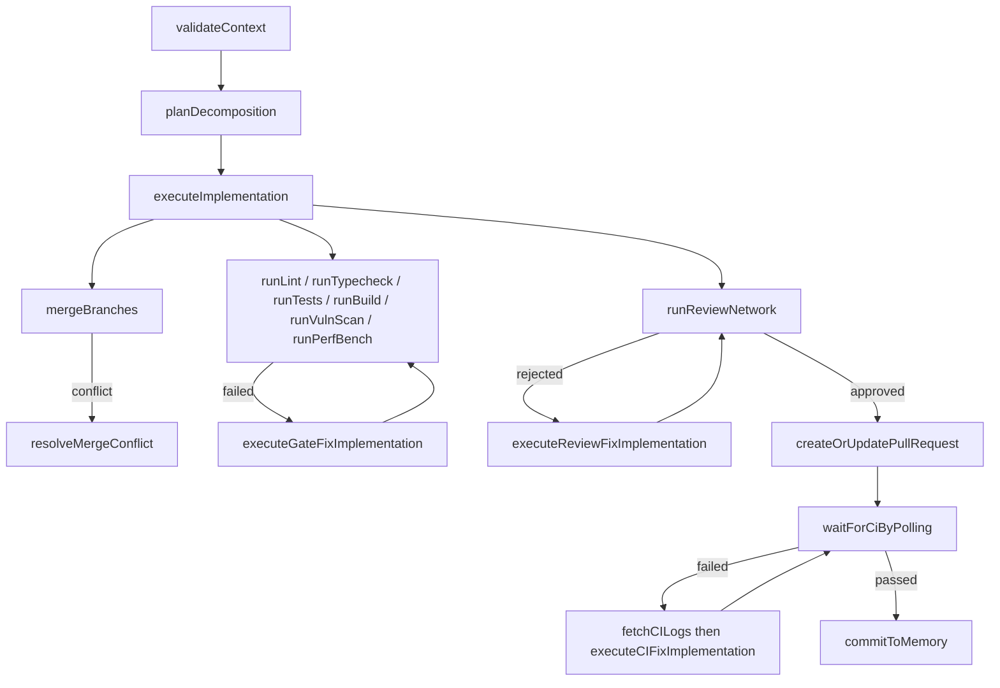

# Activity Catalog

> Indexed at commit `b1d8930` on 2026-09-08 · [view on GitHub](https://github.com/yorch/auto-swe/tree/b1d8930)

## Relevant source files

- [packages/worker/src/activities/index.ts](https://github.com/yorch/auto-swe/blob/b1d8930/packages/worker/src/activities/index.ts)
- [packages/worker/src/activities/executeImplementation.ts](https://github.com/yorch/auto-swe/blob/b1d8930/packages/worker/src/activities/executeImplementation.ts)
- [packages/worker/src/activities/implementerSession.ts](https://github.com/yorch/auto-swe/blob/b1d8930/packages/worker/src/activities/implementerSession.ts)
- [packages/worker/src/activities/ciFixLoop.ts](https://github.com/yorch/auto-swe/blob/b1d8930/packages/worker/src/activities/ciFixLoop.ts)
- [packages/worker/src/activities/qualityGates.ts](https://github.com/yorch/auto-swe/blob/b1d8930/packages/worker/src/activities/qualityGates.ts)
- [packages/worker/src/activities/runReviewNetwork.ts](https://github.com/yorch/auto-swe/blob/b1d8930/packages/worker/src/activities/runReviewNetwork.ts)
- [packages/worker/src/agents/reviewNetwork.ts](https://github.com/yorch/auto-swe/blob/b1d8930/packages/worker/src/agents/reviewNetwork.ts)
- [packages/worker/src/agents/securityReviewProcessor.ts](https://github.com/yorch/auto-swe/blob/b1d8930/packages/worker/src/agents/securityReviewProcessor.ts)
- [packages/worker/src/activities/decomposition.ts](https://github.com/yorch/auto-swe/blob/b1d8930/packages/worker/src/activities/decomposition.ts)
- [packages/worker/src/activities/createOrUpdatePullRequest.ts](https://github.com/yorch/auto-swe/blob/b1d8930/packages/worker/src/activities/createOrUpdatePullRequest.ts)
- [packages/worker/src/activities/waitForCiByPolling.ts](https://github.com/yorch/auto-swe/blob/b1d8930/packages/worker/src/activities/waitForCiByPolling.ts)
- [packages/worker/src/activities/commitToMemory.ts](https://github.com/yorch/auto-swe/blob/b1d8930/packages/worker/src/activities/commitToMemory.ts)
- [packages/worker/src/activities/evalHarness.ts](https://github.com/yorch/auto-swe/blob/b1d8930/packages/worker/src/activities/evalHarness.ts)
- [packages/worker/src/activities/runEvalNode.ts](https://github.com/yorch/auto-swe/blob/b1d8930/packages/worker/src/activities/runEvalNode.ts)
- [packages/worker/src/activities/templates.ts](https://github.com/yorch/auto-swe/blob/b1d8930/packages/worker/src/activities/templates.ts)
- [packages/worker/src/activities/channelAssistant.ts](https://github.com/yorch/auto-swe/blob/b1d8930/packages/worker/src/activities/channelAssistant.ts)

## Overview

Activities are the deterministic boundary of the Temporal worker. Everything the workflow isolate cannot do — call a language model, drive Docker, talk to GitHub or Slack, read and write PostgreSQL — happens inside an activity, and the interpreter reaches them only through proxies. The directory holds roughly 95 files including co-located tests, and every activity a workflow may invoke is re-exported from one barrel at [packages/worker/src/activities/index.ts](https://github.com/yorch/auto-swe/blob/b1d8930/packages/worker/src/activities/index.ts).

The catalog below groups those modules by concern. Two conventions recur across all of them: an `AgentTracer` is persisted in a `finally` block so a failed attempt still leaves trace rows, and any workspace a module provisions is destroyed in the same `finally`. Workspace mechanics, agent and model resolution, and tracing and cost accounting are boundaries this page cites and does not cross — see [Docker Workspaces](./4.4-docker-workspaces.md), [Agent Layer](./4.3-agent-layer.md), and [Observability and Cost](./4.5-observability-and-cost.md).

Sources: [packages/worker/src/activities/index.ts:L1-L211](https://github.com/yorch/auto-swe/blob/b1d8930/packages/worker/src/activities/index.ts#L1-L211)

## The software-engineering path

The diagram shows the activities the built-in engineering template wires together; the routing between them is the interpreter's, not an agent's. Every fix arrow re-enters through the same shared session described below, so a gate fix, a review fix, and a continuous-integration fix push through identical scanners.

Sources: [packages/worker/src/activities/index.ts:L1-L211](https://github.com/yorch/auto-swe/blob/b1d8930/packages/worker/src/activities/index.ts#L1-L211) [packages/worker/src/activities/qualityGates.ts:L1-L30](https://github.com/yorch/auto-swe/blob/b1d8930/packages/worker/src/activities/qualityGates.ts#L1-L30)

## Context gathering and validation

| Activity | Does | Inputs → outputs |
| --- | --- | --- |
| `validateContext` | Runs the tool-free `validateContext` agent to extract success criteria, then upserts a `ContextSnapshot`. An LLM failure degrades to empty criteria rather than failing the run. | `RunRequest`, optional prompt override → `{ contextSnapshotId, successCriteria }` |
| `resolveWorkspace` | Materialises the workspace context for a run by connection type: git repository identity, document or record locator, issue-tracker handle, or an empty `api_only` context. | `{ workspaceProvider, connectionId, payload }` → tagged `WorkspaceContext` union |
| `readSource` | Connection-parameterised read over an issue tracker, Notion page, Zendesk ticket, or Slack channel. | `{ connectionId, query }` → `ReadSourceResult` |
| `detectRepoDependencies` | Deterministic cross-repo edge detection from manifests, `CODEOWNERS` and `.gitmodules`; writes resolved edges plus unresolved suggestions. | `{ repoId }` → `{ edgesUpserted, scanned, suggestions }` |
| `inferRepoDependencies` | Language model proposes likely cross-repo edges from repo metadata, written as `proposed` unless confidence clears the auto-promote threshold. | `{ repoId }` → `{ proposed, autoPromoted }` |
| `getReposForDependencyScan` | Deployment-wide sweep listing active git connections for the scheduled dependency scan. | none → `RepoForDependencyScan[]` |

Sources: [packages/worker/src/activities/validateContext.ts:L39-L85](https://github.com/yorch/auto-swe/blob/b1d8930/packages/worker/src/activities/validateContext.ts#L39-L85) [packages/worker/src/activities/resolveWorkspace.ts:L15-L60](https://github.com/yorch/auto-swe/blob/b1d8930/packages/worker/src/activities/resolveWorkspace.ts#L15-L60) [packages/worker/src/activities/detectRepoDependencies.ts:L16-L40](https://github.com/yorch/auto-swe/blob/b1d8930/packages/worker/src/activities/detectRepoDependencies.ts#L16-L40) [packages/worker/src/activities/inferRepoDependencies.ts:L14-L60](https://github.com/yorch/auto-swe/blob/b1d8930/packages/worker/src/activities/inferRepoDependencies.ts#L14-L60) [packages/worker/src/activities/getReposForDependencyScan.ts:L1-L27](https://github.com/yorch/auto-swe/blob/b1d8930/packages/worker/src/activities/getReposForDependencyScan.ts#L1-L27)

## Planning and decomposition

| Activity | Does | Inputs → outputs |
| --- | --- | --- |
| `planDecomposition` | Calls the decomposer agent with its resolved skill fragments and returns the subtask list for per-branch fan-out. | `RepoWorkRequest` → `DecompositionResult` |
| `planEpic` | Decomposes a multi-repository epic into per-repo entries, then unions the planner's guessed ordering with the durable dependency graph, dropping any edge that would close a cycle. | `EpicPlanRequest` → `EpicRepoEntry[]` |
| `analyzePrd` | Judges a product requirements document for engineering readiness and lists gaps. | `RepoWorkRequest` → `PrdAnalysis` |
| `decomposePrd` | Breaks the document into epics and stories with acceptance criteria and story points. | `RepoWorkRequest` → `PrdDecomposition` |
| `createTrackerItems` | Best-effort creation of tracker epics and stories from the decomposition. | decomposition → `{ createdItems, failedCount }` |
| `submitPrdWorkRequests` | Starts one runnable workflow per approved story. | decomposition → `{ workRequestIds }` |
| `planChannelTask` | Splits a general channel task into at most four parallel subtasks. | `{ task, … }` → `{ subtasks, subtaskCount }` |
| `runChannelSubtasks` | Executes those subtasks with bounded concurrency and synthesises one answer. | subtasks → synthesised text |

Sources: [packages/worker/src/activities/decomposition.ts:L38-L62](https://github.com/yorch/auto-swe/blob/b1d8930/packages/worker/src/activities/decomposition.ts#L38-L62) [packages/worker/src/activities/planEpic.ts:L38-L107](https://github.com/yorch/auto-swe/blob/b1d8930/packages/worker/src/activities/planEpic.ts#L38-L107) [packages/worker/src/activities/prdWorkflow.ts:L1-L120](https://github.com/yorch/auto-swe/blob/b1d8930/packages/worker/src/activities/prdWorkflow.ts#L1-L120) [packages/worker/src/activities/channelTaskPlan.ts:L12-L113](https://github.com/yorch/auto-swe/blob/b1d8930/packages/worker/src/activities/channelTaskPlan.ts#L12-L113)

## Implementation and the test-driven loop

| Activity | Does | Inputs → outputs |
| --- | --- | --- |
| `executeImplementation` | The flagship activity: provisions a workspace, builds the implementer, runs the test-driven loop, commits and pushes, scans the diff, and gates on critical security findings. | `RepoWorkRequest`, optional `Subtask`, prompt override, cross-repo options → `CodeResult` |
| `runImplementerFixSession` | Shared engine behind all three fix modes; not exported through the barrel, but every fix activity is a thin wrapper over it. | `FixSessionInput` → `CodeResult` |
| `runAgent` | Generic Mastra loop over a resolved agent specification. An in-process helper, not an activity boundary. | `AgentSpec`, user message → `{ object, text, usage, costUsd }` |
| `runAgentNode` | Activity backing the declarative `agent` node: resolves an agent reference, binds MCP tools when enabled, prepends any steering messages. | `RunAgentNodeInput` → `{ text, object }` |
| `mcpCallTool` | Activity backing the declarative `mcp` node: one named tool call against an MCP connection, always disconnected in `finally`. | `{ connectionRef, tool, inputs }` → `{ result }` |
| `runShellStep` | Runs an author-supplied command in a locked-down ephemeral container, auto-commits and pushes the result. | `ShellStepInput` → `ShellStepResult` |
| `runContainerStep` | Runs a container-contract step over the stdout, newline-delimited JSON, or sidecar transport. | `ContainerStepInput` → `{ result, events }` |
| `runTool` / `writeOutcome` | Connection-parameterised tool invocation and outcome write for non-engineering templates. | `RunToolInput` / `WriteOutcomeInput` → structured result |

Sources: [packages/worker/src/activities/executeImplementation.ts:L97-L120](https://github.com/yorch/auto-swe/blob/b1d8930/packages/worker/src/activities/executeImplementation.ts#L97-L120) [packages/worker/src/activities/implementerSession.ts:L85-L120](https://github.com/yorch/auto-swe/blob/b1d8930/packages/worker/src/activities/implementerSession.ts#L85-L120) [packages/worker/src/activities/runAgent.ts:L38-L129](https://github.com/yorch/auto-swe/blob/b1d8930/packages/worker/src/activities/runAgent.ts#L38-L129) [packages/worker/src/activities/runAgentNode.ts:L45-L110](https://github.com/yorch/auto-swe/blob/b1d8930/packages/worker/src/activities/runAgentNode.ts#L45-L110) [packages/worker/src/activities/mcpCallTool.ts:L20-L65](https://github.com/yorch/auto-swe/blob/b1d8930/packages/worker/src/activities/mcpCallTool.ts#L20-L65) [packages/worker/src/activities/shellStep.ts:L1-L70](https://github.com/yorch/auto-swe/blob/b1d8930/packages/worker/src/activities/shellStep.ts#L1-L70) [packages/worker/src/activities/containerStep.ts:L10-L57](https://github.com/yorch/auto-swe/blob/b1d8930/packages/worker/src/activities/containerStep.ts#L10-L57)

## Quality gates

Six gate activities share one runner. Command resolution is strictly first-match: the step node's `config.command`, then the connection's `gateCommands` override, then the built-in default. The runner never throws on a non-zero exit; it returns `passed: false` and lets the interpreter apply the node's failure policy.

| Activity | Default command | Artifact kind |
| --- | --- | --- |
| `runLint` | `yarn lint` | `gate.lint` |
| `runTypecheck` | `yarn typecheck` | `gate.typecheck` |
| `runTests` | `yarn test` | `gate.tests` |
| `runBuild` | `yarn build` | `gate.build` |
| `runVulnScan` | `yarn npm audit --severity high` | `gate.vuln` |
| `runPerfBench` | none; operators must supply one | `gate.perf` |

Each returns `{ passed, summary, artifactId, exitCode, signal? }`. Full output goes to a `WorkflowArtifact`; the inline summary is truncated to four kilobytes on character boundaries so it fits the metadata cap on `workflow_steps`. `runGateStandalone` in [packages/worker/src/activities/standaloneGateRunner.ts](https://github.com/yorch/auto-swe/blob/b1d8930/packages/worker/src/activities/standaloneGateRunner.ts) is the same execution without the Temporal or work-request coupling, used by the offline evaluation harness against a pinned commit.

Sources: [packages/worker/src/activities/qualityGates.ts:L1-L110](https://github.com/yorch/auto-swe/blob/b1d8930/packages/worker/src/activities/qualityGates.ts#L1-L110) [packages/worker/src/activities/qualityGates.ts:L178-L250](https://github.com/yorch/auto-swe/blob/b1d8930/packages/worker/src/activities/qualityGates.ts#L178-L250) [packages/worker/src/activities/standaloneGateRunner.ts:L37-L96](https://github.com/yorch/auto-swe/blob/b1d8930/packages/worker/src/activities/standaloneGateRunner.ts#L37-L96)

## Fix loops

| Activity | Mode | What it injects | Agent key |
| --- | --- | --- | --- |
| `executeCIFixImplementation` | `CI_FIX` | Continuous-integration failure logs plus the previous test results | `ciFixer` |
| `executeReviewFixImplementation` | `REVIEW_FIX` | The review network's rejection summary | `reviewFixer` |
| `executeGateFixImplementation` | `GATE_FIX` | The failed gate name, exit code, and up to fifty kilobytes of gate logs read back from the artifact store | `gateFixer` |
| `resolveMergeConflict` | — | The conflicted files, replayed through the implementer to rewrite conflict markers | `mergeConflictResolver` |
| `fetchCILogs` | — | Fetches and truncates provider logs before the fix session runs | — |

The gate-fix path is the only one with an `afterGenerate` hook: it re-runs the failed gate inside the workspace and folds the outcome into the implementation notes, while tests still run afterwards as a regression check so a fix that silences the gate but breaks tests is caught.

Sources: [packages/worker/src/activities/ciFixLoop.ts:L11-L73](https://github.com/yorch/auto-swe/blob/b1d8930/packages/worker/src/activities/ciFixLoop.ts#L11-L73) [packages/worker/src/activities/qualityGates.ts:L259-L325](https://github.com/yorch/auto-swe/blob/b1d8930/packages/worker/src/activities/qualityGates.ts#L259-L325) [packages/worker/src/activities/decomposition.ts:L202-L260](https://github.com/yorch/auto-swe/blob/b1d8930/packages/worker/src/activities/decomposition.ts#L202-L260)

## Review network

| Activity | Does | Inputs → outputs |
| --- | --- | --- |
| `runReviewNetwork` | Resolves the four reviewer agents, loads cross-repo context, fans out three personas, aggregates verdicts, and records an evaluation signal. | `CodeResult`, success criteria, prompt override, cross-repo options → `AggregatedReviewResult` |

Sources: [packages/worker/src/activities/runReviewNetwork.ts:L20-L76](https://github.com/yorch/auto-swe/blob/b1d8930/packages/worker/src/activities/runReviewNetwork.ts#L20-L76)

## Version control and pull requests

| Activity | Does | Inputs → outputs |
| --- | --- | --- |
| `createOrUpdatePullRequest` | Opens a pull request or updates the existing open one, re-arming the continuous-integration wait by resetting `ciStatus` to pending and stamping the new head commit. Never merges. | `RepoWorkRequest`, `CodeResult` → `{ prNumber, prUrl }` |
| `mergeBranches` | Merges subtask branches into the parent feature branch in order, aborting at the first conflict and exposing the unmerged tail. | `MergeBranchesInput` → `MergeBranchesResult` |
| `subtaskBranchName` | Derives the subtask branch name from the feature branch and subtask identifier. | `(featureBranch, subtask)` → branch name |
| `formatPRTitle` / `formatPRBody` / `renderTemplate` | Render the configured pull-request templates. | template plus values → string |
| `publishOutcome` | Resolves the autonomy policy for a risk class and records an `AutonomyDecision` row, returning `auto` or `require_approval` with the approver count. | `{ workflowId, action }` → `PublishOutcomeResult` |

Resetting `ciStatus` to pending on every update is load-bearing: it is the freshness token the continuous-integration webhook guards on, so a verdict for the previous head cannot suppress the verdict for the current one.

Sources: [packages/worker/src/activities/createOrUpdatePullRequest.ts:L17-L80](https://github.com/yorch/auto-swe/blob/b1d8930/packages/worker/src/activities/createOrUpdatePullRequest.ts#L17-L80) [packages/worker/src/activities/decomposition.ts:L64-L178](https://github.com/yorch/auto-swe/blob/b1d8930/packages/worker/src/activities/decomposition.ts#L64-L178) [packages/worker/src/activities/publishOutcome.ts:L29-L71](https://github.com/yorch/auto-swe/blob/b1d8930/packages/worker/src/activities/publishOutcome.ts#L29-L71)

## Continuous-integration handling

| Activity | Does | Inputs → outputs |
| --- | --- | --- |
| `resolveCiWaitConfig` | Reads the wait strategy and poll timings from workflow defaults so the specification can route between the signal and polling paths. | none → `{ mode, intervalSec, graceSec, deadlineSec }` |
| `waitForCiByPolling` | Long-running poll until the status resolves, the no-checks grace window elapses, or the deadline is exceeded. A deadline raises a non-retryable `CI_POLL_DEADLINE`. | `WaitForCiByPollingInput` → `{ ciPassed, logsUrl }` |
| `fetchCILogs` | Retrieves provider logs for the fix loop, truncated to fit the model context. | logs URL → string |

The result key is `ciPassed`, not `passed`. The interpreter treats any step output with a top-level `passed === false` as a failed quality gate and terminates the run, which would bypass the continuous-integration condition and its fix loop entirely.

Sources: [packages/worker/src/activities/waitForCiByPolling.ts:L20-L82](https://github.com/yorch/auto-swe/blob/b1d8930/packages/worker/src/activities/waitForCiByPolling.ts#L20-L82) [packages/worker/src/activities/ciFixLoop.ts:L11-L22](https://github.com/yorch/auto-swe/blob/b1d8930/packages/worker/src/activities/ciFixLoop.ts#L11-L22)

## Memory and lessons

| Activity | Does | Inputs → outputs |
| --- | --- | --- |
| `commitToMemory` | Summarises a completed workflow into a reusable lesson and persists it with a vector embedding. Fails non-retryably when the run is not scoped to a connection. | `(temporalWorkflowId, repoId)` → memory item identifier |
| `recordLessonDirectly` / `recordLessonBackground` | Write a lesson without a summarising model call; the background variant never blocks its caller. | lesson fields → identifier or void |
| `consolidateLessons` | Clusters active lessons for a repository by cosine similarity within one embedding space, synthesises one or two generalised lessons per qualifying cluster, and soft-deletes the sources. | `{ repoId, minClusterSize, similarityThreshold }` → counts |
| `getReposForConsolidation` | Lists active repositories that opted in to scheduled consolidation. | none → `RepoForConsolidation[]` |
| `reembedMemoryItemActivity` | Regenerates a memory item's embedding after an administrator edits its text. | `{ memoryId }` → void |
| `consolidateChannelMemory` | The channel-scoped counterpart of lesson consolidation. | `{ channelId, … }` → counts |
| `passiveIngestChannelMemory` | Silently extracts durable facts from recent channel history and writes them as memory items. | `{ channelId }` → counts |
| `storeContextOverflowBatch` | Spills every oversized context value into artifacts in one activity call, isolating per-value failure. | `{ runId, values }` → refs or nulls |

Cosine clustering is deliberately scoped to the current embedding space, because similarity across different embedding models is meaningless and would merge unrelated lessons.

Sources: [packages/worker/src/activities/commitToMemory.ts:L60-L120](https://github.com/yorch/auto-swe/blob/b1d8930/packages/worker/src/activities/commitToMemory.ts#L60-L120) [packages/worker/src/activities/consolidateLessons.ts:L38-L80](https://github.com/yorch/auto-swe/blob/b1d8930/packages/worker/src/activities/consolidateLessons.ts#L38-L80) [packages/worker/src/activities/contextOverflow.ts:L42-L68](https://github.com/yorch/auto-swe/blob/b1d8930/packages/worker/src/activities/contextOverflow.ts#L42-L68) [packages/worker/src/activities/reembedMemory.ts:L1-L27](https://github.com/yorch/auto-swe/blob/b1d8930/packages/worker/src/activities/reembedMemory.ts#L1-L27)

## Evaluation

| Activity | Does | Inputs → outputs |
| --- | --- | --- |
| `runEvalHarnessActivity` | Candidate-versus-baseline comparison over a frozen benchmark: per case, per arm, a binary floor outcome, then a paired regression verdict marking the run successful or regressed. | `HarnessInput` → void |
| `runCaseDefault` | The expensive per-case path: provision the fixture at its pinned commit, run the version-pinned implementer up to `maxEvalIterations` times, score the golden test. | `(caseRow, ref)` → `0` or `1` |
| `runEvalNode` | Backs the declarative `eval` node. Evaluates non-judge scorers first, short-circuits the judge when the floor fails, combines scores, and writes one result row per scorer. | `{ targetValue, scorers, judgeAdvisory }` → `{ score, floorPassed, perAxis, decision }` |
| `revalidateDatasetActivity` | Re-runs each case's reference against current repository state, quarantining stale cases and restoring recovered ones. | dataset identifier → `{ checked, quarantined, restored }` |
| `prepareScheduledEvalRun` | Per-fire setup for the scheduled regression workflow; returns null when the dataset slug does not exist so the workflow can no-op. | `ScheduledEvalInput` → `HarnessInput` or null |
| `getDatasetsForRevalidation` | Deployment-wide dataset sweep for the re-validation schedule. | optional slug filter → `DatasetForRevalidation[]` |

Two rules keep benchmark numbers comparable. Infrastructure failures — Docker provisioning, agent or model resolution, transport — throw so the whole run is marked failed, rather than being scored as a floor failure that would read as a false regression. And the evaluation workspace pins its own base image at `EVAL_WORKSPACE_IMAGE`, the one `createWorkspace` call in the codebase that deliberately ignores the operator's configured image, because a score is comparable against its own history only if the environment did not move.

Sources: [packages/worker/src/activities/evalHarness.ts:L1-L56](https://github.com/yorch/auto-swe/blob/b1d8930/packages/worker/src/activities/evalHarness.ts#L1-L56) [packages/worker/src/activities/evalHarness.ts:L128-L200](https://github.com/yorch/auto-swe/blob/b1d8930/packages/worker/src/activities/evalHarness.ts#L128-L200) [packages/worker/src/activities/runEvalNode.ts:L276-L313](https://github.com/yorch/auto-swe/blob/b1d8930/packages/worker/src/activities/runEvalNode.ts#L276-L313) [packages/worker/src/activities/evalRevalidate.ts:L1-L99](https://github.com/yorch/auto-swe/blob/b1d8930/packages/worker/src/activities/evalRevalidate.ts#L1-L99) [packages/worker/src/activities/prepareScheduledEvalRun.ts:L1-L42](https://github.com/yorch/auto-swe/blob/b1d8930/packages/worker/src/activities/prepareScheduledEvalRun.ts#L1-L42)

## Channel and Slack activities

| Activity | Does | Inputs → outputs |
| --- | --- | --- |
| `runChannelAssistantTurn` | One assistant turn: memory and thread context, budget hold, tool-driven intents for delegating tasks and authoring workflows. | turn input → reply plus intents |
| `postChannelPlaceholder` / `updateChannelReply` / `postChannelReply` | Live-progress posting: a placeholder message updated in place, or a direct reply. | Slack coordinates and text → message identifiers |
| `startChannelRun` / `finalizeChannelRun` / `touchChannelThreadSession` | Give each turn a lightweight run record so its agent traces are visible in the run viewer, and keep the thread session alive. | run inputs → void |
| `createChannelTaskRun` / `createChannelCodeTaskRun` | Prepare the database side of a thread-bound task run and return what the workflow needs to start a child workflow. | task input → run identifiers |
| `resolveChannelRepo` / `isChannelOverBudgetForTask` | Resolve the target repository for a code task and refuse when the channel is over budget. | channel identifiers → repository or boolean |
| `evaluateReactiveInterjection` | Decides whether to interject unprompted, honouring cooldown, budget, and a skip sentinel. | `{ channelId }` → `{ posted, reason }` |
| `runChannelAmbientDigest` | Posts a proactive digest of recent channel memory, or nothing when the agent answers with the skip sentinel. | `{ channelId }` → void |
| `flagOrgSignals` | Surfaces organisation-wide signals relevant to this channel's interests. | `{ channelId }` → `{ posted, reason }` |
| `sweepChannelOpenItems` | Detects, resolves, and nudges open commitments found in recent messages. | `{ channelId }` → counts |
| `createChannelWorkflowDraft` / `refineChannelWorkflowDraft` | Generate a draft workflow template from a description, or refine the draft the same thread produced earlier. | description or change → template identifier |

Sources: [packages/worker/src/activities/channelAssistant.ts:L792-L860](https://github.com/yorch/auto-swe/blob/b1d8930/packages/worker/src/activities/channelAssistant.ts#L792-L860) [packages/worker/src/activities/channelRun.ts:L1-L60](https://github.com/yorch/auto-swe/blob/b1d8930/packages/worker/src/activities/channelRun.ts#L1-L60) [packages/worker/src/activities/channelTask.ts:L11-L110](https://github.com/yorch/auto-swe/blob/b1d8930/packages/worker/src/activities/channelTask.ts#L11-L110) [packages/worker/src/activities/channelReactive.ts:L18-L126](https://github.com/yorch/auto-swe/blob/b1d8930/packages/worker/src/activities/channelReactive.ts#L18-L126) [packages/worker/src/activities/channelAmbient.ts:L13-L80](https://github.com/yorch/auto-swe/blob/b1d8930/packages/worker/src/activities/channelAmbient.ts#L13-L80) [packages/worker/src/activities/channelWorkflowDraft.ts:L1-L40](https://github.com/yorch/auto-swe/blob/b1d8930/packages/worker/src/activities/channelWorkflowDraft.ts#L1-L40)

## Run lifecycle and human steps

| Activity | Does | Inputs → outputs |
| --- | --- | --- |
| `createWorkflowRun` | Creates the run row and snapshots the template specification onto it, so later template edits cannot affect this run. Supports pinning a canary agent version. | `CreateWorkflowRunInput` → `{ runId, spec, pinnedSettings }` or `{ error }` |
| `recordWorkflowStep` | Records one step outcome and notifies Slack on a first-attempt failure. | `RecordStepInput` → void |
| `finalizeWorkflowRun` | Denormalises cost and token totals onto the run, accrues channel usage, and posts the completion message. | `(runId, status, contextSnapshot)` → void |
| `resolveTemplateForRepo` | Picks the team default template, falling back to the global default; throws when neither exists. | `repoId` → `{ templateId, templateVersion }` |
| `createHumanStep` | Creates the pending human step and sends a best-effort Slack notification with resolve buttons, tolerating the retry-time unique-constraint collision. | `CreateHumanStepInput` → void |
| `resolveHumanStep` / `cancelPendingHumanSteps` | Mark a step timed out, or cancel everything still pending at finalisation. | identifiers → void |
| `updateDomainState` | Upserts the run's current status, self-registering rows for workflows the gateway did not create. | `(temporalWorkflowId, status)` → void |
| `generateWorkflowSpec` / `explainWorkflowSpec` / `persistDraftTemplate` | Natural-language workflow authoring: generate and repair a specification against the real building-block catalog, explain an existing one, and persist a draft while refusing shell nodes. | prompt or specification → specification, prose, or template identifier |

Sources: [packages/worker/src/activities/templates.ts:L21-L60](https://github.com/yorch/auto-swe/blob/b1d8930/packages/worker/src/activities/templates.ts#L21-L60) [packages/worker/src/activities/templates.ts:L238-L260](https://github.com/yorch/auto-swe/blob/b1d8930/packages/worker/src/activities/templates.ts#L238-L260) [packages/worker/src/activities/templates.ts:L615-L646](https://github.com/yorch/auto-swe/blob/b1d8930/packages/worker/src/activities/templates.ts#L615-L646) [packages/worker/src/activities/state.ts:L16-L148](https://github.com/yorch/auto-swe/blob/b1d8930/packages/worker/src/activities/state.ts#L16-L148) [packages/worker/src/activities/generateWorkflowSpec.ts:L1-L60](https://github.com/yorch/auto-swe/blob/b1d8930/packages/worker/src/activities/generateWorkflowSpec.ts#L1-L60) [packages/worker/src/activities/persistDraftTemplate.ts:L36-L89](https://github.com/yorch/auto-swe/blob/b1d8930/packages/worker/src/activities/persistDraftTemplate.ts#L36-L89)

## Deep dive: executeImplementation

The activity provisions a workspace on `<branchPrefix>/<ticketId>`, or on `<featureBranch>/<subtaskId>` when a subtask is supplied, and captures the base commit for the historical-replay tier before any work begins. On a Temporal retry it first fetches and hard-resets to whatever the previous attempt pushed. This matters because the activity can fail after its push — during the diff read, the scanners, or the security gate — and workspace creation always cuts a fresh branch from the default branch, so an unsynchronised retry would rebuild the change from scratch and have its push rejected as non-fast-forward.

Before the loop it assembles the implementer's system prompt from four best-effort blocks, each wrapped so a failure degrades to an empty string rather than blocking implementation: skill fragments resolved for the agent, lessons retrieved from past workflows by semantic similarity, a bounded rendering of any referenced Figma design, and the active one-hop cross-repo dependency graph. Only the cross-repo block has an optional second tier that also clones upstream repositories into the workspace, and it is opt-in.

The test-driven loop runs at most `maxTddIterations` times. That bound is not a constant in this file: it comes from the `WorkflowDefaults` singleton resolved at the top of the activity, which falls back to five when unset, so an operator raises or lowers it from the administration interface without a deployment. Each iteration checks the budget, calls the agent with the previous iteration's test result folded into the user message, records the call, then runs the detected test command. The loop breaks on the first passing run; otherwise it exhausts the bound and the implementation notes say so.

After the loop the activity stages everything, commits only when something is staged, and pushes. It then reads the diff against the default branch, always quoting the operator-editable default branch name so it cannot smuggle shell syntax into the container. Two scans follow, and their behaviour differs by design. The static code-security scan is advisory: its findings ride along on `CodeResult.codeSecurityFindings` for the security reviewer to weigh, and a scanner that cannot run degrades to no findings rather than aborting a run that has already pushed. The model-driven security gate is blocking, and is covered below. The `finally` block closes any MCP client, persists the trace, best-effort stamps the baseline commit, and destroys the workspace.

Sources: [packages/worker/src/activities/executeImplementation.ts:L97-L152](https://github.com/yorch/auto-swe/blob/b1d8930/packages/worker/src/activities/executeImplementation.ts#L97-L152) [packages/worker/src/activities/executeImplementation.ts:L160-L280](https://github.com/yorch/auto-swe/blob/b1d8930/packages/worker/src/activities/executeImplementation.ts#L160-L280) [packages/worker/src/activities/executeImplementation.ts:L281-L360](https://github.com/yorch/auto-swe/blob/b1d8930/packages/worker/src/activities/executeImplementation.ts#L281-L360) [packages/worker/src/activities/executeImplementation.ts:L380-L459](https://github.com/yorch/auto-swe/blob/b1d8930/packages/worker/src/activities/executeImplementation.ts#L380-L459)

## Deep dive: the shared fix session

The three fix activities are wrappers around one function, `runImplementerFixSession`. Each supplies a mode, an agent key, a default system prompt, a commit message, a cost-event name, a notes builder, and a mode-specific payload merged into the user message alongside the last twenty kilobytes of the previous diff.

The shared session does what the copies used to get wrong. It resolves the target repository from the identifier stamped on the previous result, falling back to a branch-name lookup only for runs that predate that field. It fetches and hard-resets to the remote branch head, because workspace creation clones the default branch and does not carry the implementer's pushed commits — previously only the gate-fix path did this and the other two operated on a stale tree. It runs the agent once rather than in a loop, then runs tests as a regression check. And it applies the same two diff scanners and the same blocking security gate as the initial implementation path, which the fix paths formerly skipped entirely, letting unscanned commits reach the pull request.

Sources: [packages/worker/src/activities/implementerSession.ts:L27-L104](https://github.com/yorch/auto-swe/blob/b1d8930/packages/worker/src/activities/implementerSession.ts#L27-L104) [packages/worker/src/activities/implementerSession.ts:L105-L200](https://github.com/yorch/auto-swe/blob/b1d8930/packages/worker/src/activities/implementerSession.ts#L105-L200) [packages/worker/src/activities/implementerSession.ts:L240-L289](https://github.com/yorch/auto-swe/blob/b1d8930/packages/worker/src/activities/implementerSession.ts#L240-L289)

## Deep dive: the review network

`runReviewNetwork` resolves four agents in parallel: `reviewer` for the shared base prompt and the model, and the three personas `securityReviewer`, `domainLogicReviewer`, and `performanceReviewer`, each of which inherits the reviewer's model and carries its own skills. It then loads the cross-repo dependency block, whose primary consumer this is — a breaking-change verdict needs the downstream consumer list — and hands everything to the orchestrator in the agent layer.

Prompt assembly differs per persona. The domain-logic prompt gains the run's success criteria with an instruction to report any unmet one as an `UNMET_SUCCESS_CRITERION` finding. The security prompt gains the advisory static-scan findings carried on the code result. All three gain the cross-repo block and their own skill fragments.

The budget is asserted once before the fan-out, not once per reviewer, so three concurrent reads of the same ledger row cannot disagree. The three reviewers then run under `Promise.allSettled`. A reviewer that crashes is not dropped and does not fail the activity: it is converted into a critical verdict with a `REVIEWER_CRASH` finding whose suggested fix is manual review. Approval is unanimous — the aggregate is approved only when every verdict is approved — and the rejection summary flattens every finding from every dissenting reviewer into the exact string the review-fix activity consumes.

Each verdict is structured output constrained by a schema with a reviewer enumeration and a severity of pass, informational, warning, or critical. This is workflow-driven fan-out with structured results: the interpreter decides to run the network, and only the typed verdicts cross the boundary back.

Sources: [packages/worker/src/activities/runReviewNetwork.ts:L20-L76](https://github.com/yorch/auto-swe/blob/b1d8930/packages/worker/src/activities/runReviewNetwork.ts#L20-L76) [packages/worker/src/agents/reviewNetwork.ts:L22-L114](https://github.com/yorch/auto-swe/blob/b1d8930/packages/worker/src/agents/reviewNetwork.ts#L22-L114) [packages/worker/src/agents/reviewNetwork.ts:L146-L237](https://github.com/yorch/auto-swe/blob/b1d8930/packages/worker/src/agents/reviewNetwork.ts#L146-L237)

## Deep dive: the security gate

`scanDiffForSecurityIssues` is the post-diff gate, and it is a different mechanism from the review network. The network gives three personas an opinion on the whole change and routes on their verdicts; this scans the diff alone with the `securityReview` agent and can fail the activity outright.

The agent returns structured output: a list of findings with category, file, optional line, severity, and a suggested fix, plus a boolean. The processor then overrides that boolean — any finding at critical severity forces `passed` to false regardless of what the model claimed. Both `executeImplementation` and the shared fix session inspect the result immediately after reading the pushed diff, and on failure raise a non-retryable `ApplicationFailure` with the type `SECURITY_GATE_FAILURE`, carrying the findings on the failure details and a rendered summary in the message. Non-retryable is the point: retrying would re-run the same scan against the same diff.

Because the gate runs on the initial implementation and on all three fix paths, removing the `securityReview` agent row breaks every implementation run wherever those steps are installed.

Sources: [packages/worker/src/agents/securityReviewProcessor.ts:L18-L125](https://github.com/yorch/auto-swe/blob/b1d8930/packages/worker/src/agents/securityReviewProcessor.ts#L18-L125) [packages/worker/src/activities/executeImplementation.ts:L413-L429](https://github.com/yorch/auto-swe/blob/b1d8930/packages/worker/src/activities/executeImplementation.ts#L413-L429) [packages/worker/src/activities/implementerSession.ts:L253-L272](https://github.com/yorch/auto-swe/blob/b1d8930/packages/worker/src/activities/implementerSession.ts#L253-L272)

## Related Pages

- Parent: [Temporal Worker](./4-temporal-worker.md)
- Sibling: [Temporal Workflows](./4.1-temporal-workflows.md)
- Sibling: [Agent Layer](./4.3-agent-layer.md)
- Sibling: [Docker Workspaces](./4.4-docker-workspaces.md)
- Sibling: [Observability and Cost](./4.5-observability-and-cost.md)
