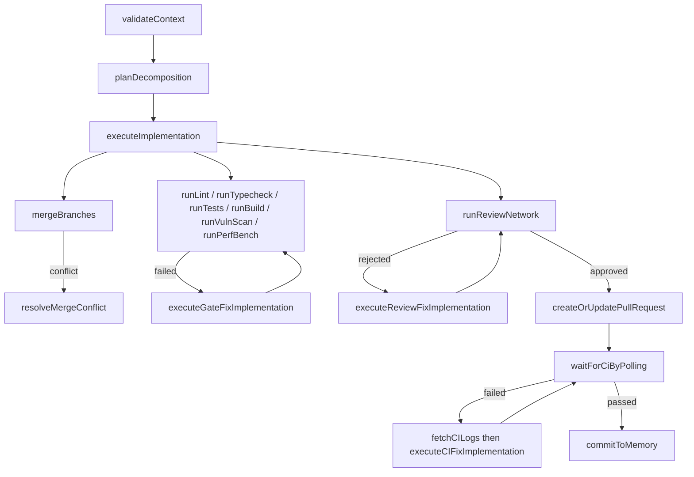

# Activity Catalog

> Indexed at commit `ae416937` on 2026-10-03 · [view on GitHub](https://github.com/yorch/auto-swe/tree/ae416937)

## Relevant source files

- [packages/worker/src/activities/index.ts](https://github.com/yorch/auto-swe/blob/ae416937/packages/worker/src/activities/index.ts)
- [packages/worker/src/activities/executeImplementation.ts](https://github.com/yorch/auto-swe/blob/ae416937/packages/worker/src/activities/executeImplementation.ts)
- [packages/worker/src/activities/implementerSession.ts](https://github.com/yorch/auto-swe/blob/ae416937/packages/worker/src/activities/implementerSession.ts)
- [packages/worker/src/activities/allowedPaths.ts](https://github.com/yorch/auto-swe/blob/ae416937/packages/worker/src/activities/allowedPaths.ts)
- [packages/worker/src/agents/implementerRuntime.ts](https://github.com/yorch/auto-swe/blob/ae416937/packages/worker/src/agents/implementerRuntime.ts)
- [packages/worker/src/activities/ciFixLoop.ts](https://github.com/yorch/auto-swe/blob/ae416937/packages/worker/src/activities/ciFixLoop.ts)
- [packages/worker/src/activities/qualityGates.ts](https://github.com/yorch/auto-swe/blob/ae416937/packages/worker/src/activities/qualityGates.ts)
- [packages/worker/src/activities/runReviewNetwork.ts](https://github.com/yorch/auto-swe/blob/ae416937/packages/worker/src/activities/runReviewNetwork.ts)
- [packages/worker/src/agents/reviewNetwork.ts](https://github.com/yorch/auto-swe/blob/ae416937/packages/worker/src/agents/reviewNetwork.ts)
- [packages/worker/src/agents/securityReviewProcessor.ts](https://github.com/yorch/auto-swe/blob/ae416937/packages/worker/src/agents/securityReviewProcessor.ts)
- [packages/worker/src/activities/decomposition.ts](https://github.com/yorch/auto-swe/blob/ae416937/packages/worker/src/activities/decomposition.ts)
- [packages/worker/src/activities/createOrUpdatePullRequest.ts](https://github.com/yorch/auto-swe/blob/ae416937/packages/worker/src/activities/createOrUpdatePullRequest.ts)
- [packages/worker/src/activities/waitForCiByPolling.ts](https://github.com/yorch/auto-swe/blob/ae416937/packages/worker/src/activities/waitForCiByPolling.ts)
- [packages/worker/src/activities/commitToMemory.ts](https://github.com/yorch/auto-swe/blob/ae416937/packages/worker/src/activities/commitToMemory.ts)
- [packages/worker/src/activities/evalHarness.ts](https://github.com/yorch/auto-swe/blob/ae416937/packages/worker/src/activities/evalHarness.ts)
- [packages/worker/src/activities/runEvalNode.ts](https://github.com/yorch/auto-swe/blob/ae416937/packages/worker/src/activities/runEvalNode.ts)
- [packages/worker/src/activities/templates.ts](https://github.com/yorch/auto-swe/blob/ae416937/packages/worker/src/activities/templates.ts)
- [packages/worker/src/activities/scheduledFireAuthorization.ts](https://github.com/yorch/auto-swe/blob/ae416937/packages/worker/src/activities/scheduledFireAuthorization.ts)
- [packages/worker/src/activities/channelAssistant.ts](https://github.com/yorch/auto-swe/blob/ae416937/packages/worker/src/activities/channelAssistant.ts)
- [packages/worker/src/activities/channelTask.ts](https://github.com/yorch/auto-swe/blob/ae416937/packages/worker/src/activities/channelTask.ts)
- [packages/worker/src/activities/syncRepoAccess.ts](https://github.com/yorch/auto-swe/blob/ae416937/packages/worker/src/activities/syncRepoAccess.ts)
- [packages/worker/src/activities/runAgent.ts](https://github.com/yorch/auto-swe/blob/ae416937/packages/worker/src/activities/runAgent.ts)
- [packages/worker/src/activities/runAgentTask.ts](https://github.com/yorch/auto-swe/blob/ae416937/packages/worker/src/activities/runAgentTask.ts)
- [packages/worker/src/activities/discoverModels.ts](https://github.com/yorch/auto-swe/blob/ae416937/packages/worker/src/activities/discoverModels.ts)
- [packages/worker/src/activities/listProviderModels.ts](https://github.com/yorch/auto-swe/blob/ae416937/packages/worker/src/activities/listProviderModels.ts)

## Overview

Activities are the deterministic boundary of the Temporal worker. Everything the workflow isolate cannot do — call a language model, drive Docker, talk to GitHub or Slack, read and write PostgreSQL — happens inside an activity, and the interpreter reaches them only through proxies. The directory holds 114 files, 61 of them non-test, and every activity a workflow may invoke is re-exported from one barrel at [packages/worker/src/activities/index.ts](https://github.com/yorch/auto-swe/blob/ae416937/packages/worker/src/activities/index.ts). Several modules are in-process helpers that registered activities call directly: `runAgent`, `allowedPaths`, `agentRunFinalize`, `scheduledFireAuthorization`, `standaloneGateRunner`, `utils` and `workspace`. The tables below mark them, and the barrel is the arbiter of what is registered.

The catalog groups the modules by concern. Four conventions recur across them:

- An `AgentTracer` is persisted in a `finally` block so a failed attempt still leaves trace rows, and any workspace a module provisions is destroyed in the same `finally`.
- A call to a language model that fails leaves a trace row too, attributed to the model that was bound and priced from whatever usage had already been recorded. The reviewers, the security gate, the planner and decomposer, the merge-conflict resolver, the evaluation judge, `commitToMemory` and `runAgent` all do this.
- An activity that builds a repository reference loads the row with its `installation` relation, selecting both the installation id and its host, because `toRepoRef` needs both to pick the right credential.
- An activity whose workflow keeps no run row (authoring, scheduled evaluation, lesson consolidation, dependency inference) runs inside `withSpendOwner`, so its trace rows carry the team and organization the spend belongs to, and its budget is the runless token cap summed from those rows.

Workspace mechanics, agent and model resolution, tracing and cost accounting, the implementer runtime seam, agent runs and the model catalog are boundaries this page cites and does not cross — see [Docker Workspaces](./4.4-docker-workspaces.md), [Agent Layer](./4.3-agent-layer.md), [Observability and Cost](./4.5-observability-and-cost.md), [Agent Runs and Implementer Runtimes](./4.6-agent-runs-and-implementer-runtimes.md) and [Model Catalog and Pricing](./4.7-model-catalog-and-pricing.md). Who may reach a repository, and whose token an activity acts with, is covered in [Repository Access and Credentials](./3.4-repository-access-and-credentials.md).

Sources: [packages/worker/src/activities/index.ts:L1-L219](https://github.com/yorch/auto-swe/blob/ae416937/packages/worker/src/activities/index.ts#L1-L219) [packages/worker/src/activities/executeImplementation.ts:L114-L124](https://github.com/yorch/auto-swe/blob/ae416937/packages/worker/src/activities/executeImplementation.ts#L114-L124) [packages/worker/src/activities/implementerSession.ts:L87-L105](https://github.com/yorch/auto-swe/blob/ae416937/packages/worker/src/activities/implementerSession.ts#L87-L105) [packages/worker/src/lib/spendOwner.ts:L23-L37](https://github.com/yorch/auto-swe/blob/ae416937/packages/worker/src/lib/spendOwner.ts#L23-L37) [packages/worker/src/lib/runlessBudget.ts:L11-L28](https://github.com/yorch/auto-swe/blob/ae416937/packages/worker/src/lib/runlessBudget.ts#L11-L28) [packages/worker/src/lib/llmAttribution.ts:L4-L38](https://github.com/yorch/auto-swe/blob/ae416937/packages/worker/src/lib/llmAttribution.ts#L4-L38)

## The software-engineering path

```mermaid
flowchart TD
    VC[validateContext] --> PD[planDecomposition]
    PD --> EI[executeImplementation]
    EI --> MB[mergeBranches]
    MB -->|conflict| RMC[resolveMergeConflict]
    EI --> QG[runLint / runTypecheck / runTests / runBuild / runVulnScan / runPerfBench]
    QG -->|failed| GF[executeGateFixImplementation]
    GF --> QG
    EI --> RN[runReviewNetwork]
    RN -->|rejected| RF[executeReviewFixImplementation]
    RF --> RN
    RN -->|approved| PR[createOrUpdatePullRequest]
    PR --> CI[waitForCiByPolling]
    CI -->|failed| CF[fetchCILogs then executeCIFixImplementation]
    CF --> CI
    CI -->|passed| CM[commitToMemory]
```

The diagram is a composite of the engineering activities, not one template. The default engineering specification wires validation, implementation, the review loop, the pull request, the continuous-integration wait and fix loop, and memory; the quality gates and the decompose-and-merge steps are wired by the gate and decomposition example specifications, and the code-and-CI template wires gates straight into the pull request and CI loop. The routing between them is always the interpreter's, not an agent's. Every fix arrow re-enters through the same shared session described below, so a gate fix, a review fix, and a continuous-integration fix push through identical scanners.

The templates are written with authoring helpers (`reviewLoop`, `ciLoop`, `openPullRequest`) that expand into flat nodes. The review and continuous-integration retry limits are therefore not values the activities read: each helper takes a `limit` that defaults to three and writes it into a condition node (`context.reviewRetries >= 3`, `context.ciRetries >= 3`), and the interpreter applies it.

Sources: [packages/shared/src/workflow/defaultEngineeringSpec.ts:L27-L92](https://github.com/yorch/auto-swe/blob/ae416937/packages/shared/src/workflow/defaultEngineeringSpec.ts#L27-L92) [packages/shared/src/workflow/templates/authoring/reviewLoop.ts:L40-L59](https://github.com/yorch/auto-swe/blob/ae416937/packages/shared/src/workflow/templates/authoring/reviewLoop.ts#L40-L59) [packages/shared/src/workflow/templates/authoring/ciLoop.ts:L133-L203](https://github.com/yorch/auto-swe/blob/ae416937/packages/shared/src/workflow/templates/authoring/ciLoop.ts#L133-L203) [packages/shared/src/workflow/examples/decomposition.spec.ts:L66-L130](https://github.com/yorch/auto-swe/blob/ae416937/packages/shared/src/workflow/examples/decomposition.spec.ts#L66-L130) [packages/shared/src/workflow/examples/qualityGates.spec.ts:L20-L170](https://github.com/yorch/auto-swe/blob/ae416937/packages/shared/src/workflow/examples/qualityGates.spec.ts#L20-L170) [packages/shared/src/workflow/templates/codeAndCi.ts:L19-L53](https://github.com/yorch/auto-swe/blob/ae416937/packages/shared/src/workflow/templates/codeAndCi.ts#L19-L53)

## Context gathering and validation

| Activity | Does | Inputs → outputs |
| --- | --- | --- |
| `validateContext` | Runs the tool-free `validateContext` agent to extract success criteria, then upserts a `ContextSnapshot`. An LLM failure degrades to empty criteria rather than failing the run, and the degradation is logged and recorded as a `context_validation.degraded` trace event, because an empty list silently switches off the domain-logic reviewer's criteria check. A cancelled activity stops instead of persisting. | `RunRequest`, optional prompt override → `{ contextSnapshotId, successCriteria }` |
| `resolveWorkspace` | Materialises the workspace context for a run by connection type: git repository identity, document or record locator, issue-tracker handle, or an empty `api_only` context. A git repository's clone URL is built from its own host override, or from the instance's configured host when it has none, never from a hard-coded github.com. | `{ workspaceProvider, connectionId, payload }` → tagged `WorkspaceContext` union |
| `readSource` | Connection-parameterised read. Notion, Zendesk and issue-tracker connections are read for real; a `git_repo` returns a pointer the engineering path already covers; `http_api`, `hubspot`, `mcp` and `slack_workspace` return a placeholder. | `{ connectionId, query }` → `ReadSourceResult` |
| `detectRepoDependencies` | Deterministic cross-repo edge detection from manifests, `CODEOWNERS` and `.gitmodules`; writes resolved edges plus unresolved suggestions. Each candidate repository carries its host, so a dependency URL naming a host matches only the repository on that host. | `{ repoId }` → `{ edgesUpserted, scanned, suggestions }` |
| `inferRepoDependencies` | Language model proposes likely cross-repo edges from repo metadata, written as `proposed` unless confidence clears the auto-promote threshold. Its spend is attributed to the subject repository's team. | `{ repoId }` → `{ proposed, autoPromoted }` |
| `getReposForDependencyScan` | Deployment-wide sweep listing active git connections for the scheduled dependency scan. | none → `RepoForDependencyScan[]` |

Sources: [packages/worker/src/activities/validateContext.ts:L44-L117](https://github.com/yorch/auto-swe/blob/ae416937/packages/worker/src/activities/validateContext.ts#L44-L117) [packages/worker/src/activities/resolveWorkspace.ts:L23-L90](https://github.com/yorch/auto-swe/blob/ae416937/packages/worker/src/activities/resolveWorkspace.ts#L23-L90) [packages/worker/src/activities/resolveWorkspace.ts:L243-L276](https://github.com/yorch/auto-swe/blob/ae416937/packages/worker/src/activities/resolveWorkspace.ts#L243-L276) [packages/worker/src/activities/genericActions.ts:L205-L231](https://github.com/yorch/auto-swe/blob/ae416937/packages/worker/src/activities/genericActions.ts#L205-L231) [packages/worker/src/activities/detectRepoDependencies.ts:L133-L228](https://github.com/yorch/auto-swe/blob/ae416937/packages/worker/src/activities/detectRepoDependencies.ts#L133-L228) [packages/worker/src/activities/inferRepoDependencies.ts:L158-L281](https://github.com/yorch/auto-swe/blob/ae416937/packages/worker/src/activities/inferRepoDependencies.ts#L158-L281) [packages/worker/src/activities/getReposForDependencyScan.ts:L1-L27](https://github.com/yorch/auto-swe/blob/ae416937/packages/worker/src/activities/getReposForDependencyScan.ts#L1-L27)

## Planning and decomposition

| Activity | Does | Inputs → outputs |
| --- | --- | --- |
| `planDecomposition` | Calls the decomposer persona with its resolved skill fragments and returns the subtask list for per-branch fan-out. It runs, is priced and is traced as `decomposer`, which inherits the planner's model. | `RepoWorkRequest` → `DecompositionResult` |
| `planEpic` | Decomposes a multi-repository epic into per-repo entries, then unions the planner's guessed ordering with the durable dependency graph, dropping any edge that would close a cycle. | `EpicPlanRequest` → `EpicRepoEntry[]` |
| `analyzePrd` | Judges a product requirements document for engineering readiness and lists gaps. | `RepoWorkRequest` → `PrdAnalysis` |
| `decomposePrd` | Breaks the document into epics and stories with acceptance criteria and story points. | `RepoWorkRequest` → `PrdDecomposition` |
| `createTrackerItems` | Best-effort creation of tracker epics and stories from the decomposition. | decomposition → `{ createdItems, failedCount }` |
| `submitPrdWorkRequests` | Starts one runnable workflow per approved story. Workflow ids come from the shared allocator, which qualifies the id with the repository's host and checks the host-less form a run may already be in flight under; a story whose ticket already has a run in flight is skipped, and a repository with no owner or name is skipped. When per-user credentials are enabled, every story carries the PRD run's `launchedById`. | decomposition → `{ workRequestIds }` |
| `planChannelTask` | Splits a general channel task into at most four parallel subtasks. | `{ task, … }` → `{ subtasks, subtaskCount }` |
| `runChannelSubtasks` | Executes those subtasks with a worker pool of three and synthesises one answer. A refusal because the channel's model has no price is the answer to the whole task and propagates rather than being swallowed as one blank branch. | subtasks → synthesised text |

The planner and decomposer leave a failed-call trace row whenever their call throws or returns unusable output, and both refuse an unpriced model under a USD cap before calling it. That is observability and budget policy, covered in [Observability and Cost](./4.5-observability-and-cost.md); the activity contract above is unchanged. The PRD activities heartbeat while their model call runs, which is also how a cancellation reaches them.

Sources: [packages/worker/src/activities/decomposition.ts:L51-L75](https://github.com/yorch/auto-swe/blob/ae416937/packages/worker/src/activities/decomposition.ts#L51-L75) [packages/worker/src/activities/planEpic.ts:L54-L191](https://github.com/yorch/auto-swe/blob/ae416937/packages/worker/src/activities/planEpic.ts#L54-L191) [packages/worker/src/activities/prdWorkflow.ts:L117-L226](https://github.com/yorch/auto-swe/blob/ae416937/packages/worker/src/activities/prdWorkflow.ts#L117-L226) [packages/worker/src/activities/prdWorkflow.ts:L312-L517](https://github.com/yorch/auto-swe/blob/ae416937/packages/worker/src/activities/prdWorkflow.ts#L312-L517) [packages/worker/src/activities/channelTaskPlan.ts:L23-L31](https://github.com/yorch/auto-swe/blob/ae416937/packages/worker/src/activities/channelTaskPlan.ts#L23-L31) [packages/worker/src/activities/channelTaskPlan.ts:L62-L227](https://github.com/yorch/auto-swe/blob/ae416937/packages/worker/src/activities/channelTaskPlan.ts#L62-L227) [packages/worker/src/agents/decomposer.ts:L53-L162](https://github.com/yorch/auto-swe/blob/ae416937/packages/worker/src/agents/decomposer.ts#L53-L162) [packages/worker/src/agents/plannerAgent.ts:L29-L120](https://github.com/yorch/auto-swe/blob/ae416937/packages/worker/src/agents/plannerAgent.ts#L29-L120)

## Implementation and the test-driven loop

| Activity | Does | Inputs → outputs |
| --- | --- | --- |
| `executeImplementation` | The flagship activity: refuses an unpriced model under a USD cap before any container exists, provisions a workspace, picks the implementer runtime, runs the test-driven loop, commits and pushes, scans the diff, and gates on critical security findings. | `RepoWorkRequest`, optional `Subtask`, prompt override, cross-repo options, optional `allowedPaths` → `CodeResult` |
| `runImplementerFixSession` | Shared engine behind all three fix modes; not exported through the barrel, but every fix activity is a thin wrapper over it. | `FixSessionInput` → `CodeResult` |
| `runAgent` | Generic Mastra loop over a resolved agent specification. An in-process helper, not an activity boundary. It debits spend per step when asked, honours a step ceiling and a wall-clock deadline, records a `tool_call` row per tool call the loop made, and writes a failed-call row priced from whatever it had already debited. | `AgentSpec`, user message → `{ object, text, usage, costUsd, stepCount, stoppedReason }` |
| `runAgentNode` | Activity backing the declarative `agent` node: resolves an agent reference at the channel's scope when one is carried, binds MCP tools when enabled, prepends any steering messages. | `RunAgentNodeInput` → `{ text, object }` |
| `runAgentTask` | Activity behind the hidden Agent Run system template: runs one library agent against one repository, and optionally publishes what it wrote from a fresh container the agent never ran in. It is the authority for every limit on an agent run and makes a single attempt. | `RunAgentTaskInput` → `RunAgentTaskResult` |
| `mcpCallTool` | Activity backing the declarative `mcp` node: one named tool call against an MCP connection, always disconnected in `finally`. A cancellation abandons the call rather than waiting out its timeout. | `{ connectionRef, tool, inputs }` → `{ result }` |
| `runShellStep` | Runs an author-supplied command in a locked-down ephemeral container, then commits and pushes the result from a helper container whose git configuration is rewritten from an allow-list first. | `ShellStepInput` → `ShellStepResult` |
| `runContainerStep` | Runs a container-contract step over the stdout, newline-delimited JSON, or sidecar transport. | `ContainerStepInput` → `{ result, events }` |
| `runTool` / `writeOutcome` | Connection-parameterised tool invocation and outcome write for non-engineering templates. `writeOutcome` keeps an idempotency ledger keyed on run, node and connection so a retry after a successful external write does not repeat it, and refuses a write while the run's latest `publishOutcome` decision requires approval and none has been recorded since. `writeOutcome` implements Notion, Zendesk, Slack, issue-tracker and git connections and `runTool` implements Zendesk, Slack, issue-tracker and git; other types return a placeholder. | `RunToolInput` / `WriteOutcomeInput` → structured result |

Every implementer turn in this directory goes through `runImplementerTurn` over an `ImplementerRuntime`: the TDD loop, the fix session, the merge-conflict resolver and the evaluation harness each hand it a system prompt, a user message and a usage event name, and it records usage, runs the advisory output scan and writes the LLM-response trace row. The seam and its two runtimes are the subject of [Agent Runs and Implementer Runtimes](./4.6-agent-runs-and-implementer-runtimes.md); agent runs themselves are described there too.

Sources: [packages/worker/src/activities/executeImplementation.ts:L102-L196](https://github.com/yorch/auto-swe/blob/ae416937/packages/worker/src/activities/executeImplementation.ts#L102-L196) [packages/worker/src/activities/implementerSession.ts:L114-L202](https://github.com/yorch/auto-swe/blob/ae416937/packages/worker/src/activities/implementerSession.ts#L114-L202) [packages/worker/src/agents/implementerRuntime.ts:L73-L131](https://github.com/yorch/auto-swe/blob/ae416937/packages/worker/src/agents/implementerRuntime.ts#L73-L131) [packages/worker/src/activities/runAgent.ts:L18-L141](https://github.com/yorch/auto-swe/blob/ae416937/packages/worker/src/activities/runAgent.ts#L18-L141) [packages/worker/src/activities/runAgent.ts:L142-L292](https://github.com/yorch/auto-swe/blob/ae416937/packages/worker/src/activities/runAgent.ts#L142-L292) [packages/worker/src/activities/runAgent.ts:L295-L386](https://github.com/yorch/auto-swe/blob/ae416937/packages/worker/src/activities/runAgent.ts#L295-L386) [packages/worker/src/activities/runAgentNode.ts:L58-L153](https://github.com/yorch/auto-swe/blob/ae416937/packages/worker/src/activities/runAgentNode.ts#L58-L153) [packages/worker/src/activities/runAgentTask.ts:L80-L140](https://github.com/yorch/auto-swe/blob/ae416937/packages/worker/src/activities/runAgentTask.ts#L80-L140) [packages/worker/src/activities/mcpCallTool.ts:L35-L81](https://github.com/yorch/auto-swe/blob/ae416937/packages/worker/src/activities/mcpCallTool.ts#L35-L81) [packages/worker/src/activities/shellStep.ts:L148-L172](https://github.com/yorch/auto-swe/blob/ae416937/packages/worker/src/activities/shellStep.ts#L148-L172) [packages/worker/src/activities/shellStep.ts:L265-L306](https://github.com/yorch/auto-swe/blob/ae416937/packages/worker/src/activities/shellStep.ts#L265-L306) [packages/worker/src/activities/containerStep.ts:L57-L145](https://github.com/yorch/auto-swe/blob/ae416937/packages/worker/src/activities/containerStep.ts#L57-L145) [packages/worker/src/activities/genericActions.ts:L414-L515](https://github.com/yorch/auto-swe/blob/ae416937/packages/worker/src/activities/genericActions.ts#L414-L515) [packages/worker/src/activities/genericActions.ts:L636-L666](https://github.com/yorch/auto-swe/blob/ae416937/packages/worker/src/activities/genericActions.ts#L636-L666)

## Quality gates

Six gate activities share one runner. Command resolution is strictly first-match: the step node's `config.command`, then the connection's `gateCommands` override, then the built-in default. The runner never throws on a non-zero exit; it returns `passed: false` and lets the interpreter apply the node's failure policy. When no command resolves anywhere the gate returns `passed: true` with a no-op summary, so the specification, not the activity, decides whether a missing command matters. A gate that cannot check its branch out from origin throws instead, so the activity retries: running the gate against the default branch would report a change it never inspected as green.

| Activity | Default command | Artifact kind |
| --- | --- | --- |
| `runLint` | `yarn lint` | `gate.lint` |
| `runTypecheck` | `yarn typecheck` | `gate.typecheck` |
| `runTests` | `yarn test` | `gate.tests` |
| `runBuild` | `yarn build` | `gate.build` |
| `runVulnScan` | `yarn npm audit --severity high` | `gate.vuln` |
| `runPerfBench` | none; operators must supply one | `gate.perf` |

Each returns `{ passed, summary, artifactId, exitCode, signal?, command? }`; `command` is the command that actually ran after resolution, so a gate fix re-runs exactly the check that failed. Full output goes to a `WorkflowArtifact`; the inline summary is truncated to four kilobytes on character boundaries so it fits the metadata cap on `workflow_steps`. `runGateStandalone` in [packages/worker/src/activities/standaloneGateRunner.ts](https://github.com/yorch/auto-swe/blob/ae416937/packages/worker/src/activities/standaloneGateRunner.ts) is the same execution without the Temporal or work-request coupling, used by the offline evaluation harness against a pinned commit.

Sources: [packages/worker/src/activities/qualityGates.ts:L41-L98](https://github.com/yorch/auto-swe/blob/ae416937/packages/worker/src/activities/qualityGates.ts#L41-L98) [packages/worker/src/activities/qualityGates.ts:L104-L141](https://github.com/yorch/auto-swe/blob/ae416937/packages/worker/src/activities/qualityGates.ts#L104-L141) [packages/worker/src/activities/qualityGates.ts:L148-L195](https://github.com/yorch/auto-swe/blob/ae416937/packages/worker/src/activities/qualityGates.ts#L148-L195) [packages/worker/src/activities/qualityGates.ts:L201-L272](https://github.com/yorch/auto-swe/blob/ae416937/packages/worker/src/activities/qualityGates.ts#L201-L272) [packages/worker/src/activities/standaloneGateRunner.ts:L37-L69](https://github.com/yorch/auto-swe/blob/ae416937/packages/worker/src/activities/standaloneGateRunner.ts#L37-L69)

## Fix loops

| Activity | Mode | What it injects | Agent key |
| --- | --- | --- | --- |
| `executeCIFixImplementation` | `CI_FIX` | Continuous-integration failure logs plus the previous test results | `ciFixer` |
| `executeReviewFixImplementation` | `REVIEW_FIX` | The review network's rejection summary; the only fix that accepts `allowedPaths` | `reviewFixer` |
| `executeGateFixImplementation` | `GATE_FIX` | The failed gate name, exit code, and up to fifty kilobytes of gate logs read back from the artifact store | `gateFixer` |
| `resolveMergeConflict` | — | The conflicted files, replayed through the resolver persona to rewrite conflict markers; up to `maxAttemptsPerBranch` resolver attempts per branch (default one) | `mergeConflictResolver` |
| `fetchCILogs` | — | Fetches and truncates provider logs before the fix session runs; takes the repository id so the read uses that repository's installation credential | — |

The gate-fix path is the only one with an `afterGenerate` hook: it re-runs the failed gate inside the workspace, using the command the failed gate reported, and folds the outcome into the implementation notes, while tests still run afterwards as a regression check so a fix that silences the gate but breaks tests is caught.

`resolveMergeConflict` is the one fix activity that does not go through the shared session. It has its own workspace and replays the unmerged tail branch by branch. The resolver agent never runs git: the activity lists the conflicted paths once with `git diff -z`, runs the resolver, then checks each conflicted file for a leftover conflict marker (a line opening or closing a hunk, never the bare `=======` separator, which is also a Markdown heading underline). It stages exactly the conflicted paths, confirms git holds no unmerged path, and commits. After every branch has resolved, the diff of what the resolver wrote is put through the code-security scan and the blocking security gate before the target is pushed, so a critical finding never reaches the remote branch. A lesson is recorded through the time-capped background writer when every branch resolved. The resolver calls are traced and priced under the `mergeConflictResolver` role, and a call that throws leaves a failed-call row.

Sources: [packages/worker/src/activities/ciFixLoop.ts:L12-L87](https://github.com/yorch/auto-swe/blob/ae416937/packages/worker/src/activities/ciFixLoop.ts#L12-L87) [packages/worker/src/activities/qualityGates.ts:L274-L352](https://github.com/yorch/auto-swe/blob/ae416937/packages/worker/src/activities/qualityGates.ts#L274-L352) [packages/worker/src/activities/decomposition.ts:L192-L331](https://github.com/yorch/auto-swe/blob/ae416937/packages/worker/src/activities/decomposition.ts#L192-L331) [packages/worker/src/activities/decomposition.ts:L351-L400](https://github.com/yorch/auto-swe/blob/ae416937/packages/worker/src/activities/decomposition.ts#L351-L400) [packages/worker/src/activities/decomposition.ts:L472-L636](https://github.com/yorch/auto-swe/blob/ae416937/packages/worker/src/activities/decomposition.ts#L472-L636) [packages/worker/src/activities/decomposition.ts:L638-L695](https://github.com/yorch/auto-swe/blob/ae416937/packages/worker/src/activities/decomposition.ts#L638-L695) [packages/worker/src/workflows/runnable.ts:L864-L883](https://github.com/yorch/auto-swe/blob/ae416937/packages/worker/src/workflows/runnable.ts#L864-L883)

## Review network

| Activity | Does | Inputs → outputs |
| --- | --- | --- |
| `runReviewNetwork` | Resolves the three reviewer personas, chooses each one's base prompt, loads cross-repo context, fans out the three reviewers, aggregates verdicts, and records an evaluation signal. Heartbeats for the whole call. | `CodeResult`, success criteria, prompt override, cross-repo options → `AggregatedReviewResult` |

Sources: [packages/worker/src/activities/runReviewNetwork.ts:L78-L168](https://github.com/yorch/auto-swe/blob/ae416937/packages/worker/src/activities/runReviewNetwork.ts#L78-L168)

## Version control and pull requests

| Activity | Does | Inputs → outputs |
| --- | --- | --- |
| `createOrUpdatePullRequest` | Opens a pull request or updates the existing open one, re-arming the continuous-integration wait by resetting `ciStatus` to pending and stamping the new head commit. On a Temporal retry it reuses a pull request a prior attempt may have created before crashing. With `draft` set it opens a draft, and fails non-retryably (`DRAFT_PR_UNSUPPORTED`, `EXISTING_PR_NOT_DRAFT`) rather than opening or extending a ready-for-review pull request. Never merges. | `RepoWorkRequest`, `CodeResult`, options → `{ prNumber, prUrl }` |
| `mergeBranches` | Merges subtask branches into the parent feature branch in order, aborting at the first conflict and exposing the unmerged tail. | `MergeBranchesInput` → `MergeBranchesResult` |
| `subtaskBranchName` | Derives the subtask branch name from the feature branch and subtask identifier. | `(featureBranch, subtask)` → branch name |
| `formatPRTitle` / `formatPRBody` / `renderTemplate` | Render the configured pull-request templates in one pass, so a placeholder inside an agent-authored value is never expanded. In-process helpers, not registered. | template plus values → string |
| `publishOutcome` | Resolves the autonomy policy for a risk class and records an `AutonomyDecision` row, returning `auto` or `require_approval` with the approver count. | `{ workflowId, action }` → `PublishOutcomeResult` |

Resetting `ciStatus` to pending on every update is load-bearing: it is the freshness token the continuous-integration webhook guards on, so a verdict for the previous head cannot suppress the verdict for the current one.

Sources: [packages/worker/src/activities/createOrUpdatePullRequest.ts:L21-L136](https://github.com/yorch/auto-swe/blob/ae416937/packages/worker/src/activities/createOrUpdatePullRequest.ts#L21-L136) [packages/worker/src/activities/createOrUpdatePullRequest.ts:L206-L277](https://github.com/yorch/auto-swe/blob/ae416937/packages/worker/src/activities/createOrUpdatePullRequest.ts#L206-L277) [packages/worker/src/activities/decomposition.ts:L77-L190](https://github.com/yorch/auto-swe/blob/ae416937/packages/worker/src/activities/decomposition.ts#L77-L190) [packages/worker/src/activities/publishOutcome.ts:L22-L64](https://github.com/yorch/auto-swe/blob/ae416937/packages/worker/src/activities/publishOutcome.ts#L22-L64)

## Continuous-integration handling

| Activity | Does | Inputs → outputs |
| --- | --- | --- |
| `resolveCiWaitConfig` | Reads the wait strategy and poll timings from workflow defaults so the specification can route between the signal and polling paths. | none → `{ mode, intervalSec, graceSec, deadlineSec }` |
| `waitForCiByPolling` | Long-running poll until the status resolves, the no-checks grace window elapses, or the deadline is exceeded. Timings the specification leaves unbound are filled from the resolved defaults, then clamped to what the activity's heartbeat and timeouts can survive. A deadline raises a non-retryable `CI_POLL_DEADLINE`; a fetch that fails on credentials, access or a missing ref raises a non-retryable `CI_POLL_FETCH_FAILED`. | `WaitForCiByPollingInput` → `{ ciPassed, logsUrl }` |
| `fetchCILogs` | Retrieves provider logs for the fix loop, truncated to fit the model context. | `(logsUrl, repoId)` → string |

The result key is `ciPassed`, not `passed`. The interpreter treats any step output with a top-level `passed === false` as a failed quality gate and applies the node's failure policy, which would bypass the continuous-integration condition and its fix loop entirely. The `ciLoop` helper's `storePollResult` node maps `ciPassed` into `context.ciResultPayload.passed` in a following `set` node, which is the same shape the webhook signal path stores, so a poll failure and a webhook failure reach `checkCI` identically.

Sources: [packages/worker/src/activities/waitForCiByPolling.ts:L13-L99](https://github.com/yorch/auto-swe/blob/ae416937/packages/worker/src/activities/waitForCiByPolling.ts#L13-L99) [packages/worker/src/activities/ciFixLoop.ts:L12-L28](https://github.com/yorch/auto-swe/blob/ae416937/packages/worker/src/activities/ciFixLoop.ts#L12-L28) [packages/shared/src/workflow/interpreter.ts:L874-L878](https://github.com/yorch/auto-swe/blob/ae416937/packages/shared/src/workflow/interpreter.ts#L874-L878) [packages/shared/src/workflow/templates/authoring/ciLoop.ts:L11-L85](https://github.com/yorch/auto-swe/blob/ae416937/packages/shared/src/workflow/templates/authoring/ciLoop.ts#L11-L85)

## Memory and lessons

| Activity | Does | Inputs → outputs |
| --- | --- | --- |
| `commitToMemory` | Summarises a completed workflow into a reusable lesson and persists it with a vector embedding. Fails non-retryably (`NO_CONNECTION`) when the run is not scoped to a connection. A failed model call leaves one failed-call row, and none once the success row is written. | `(temporalWorkflowId, repoId)` → memory item identifier |
| `recordLessonDirectly` / `recordLessonBackground` | Write a lesson without a summarising model call; the background variant never blocks its caller past five seconds. In-process helpers used by the merge-conflict resolver and the shell step, not registered. | lesson fields → identifier or void |
| `consolidateLessons` | Clusters active lessons for a repository by cosine similarity within one embedding space, synthesises one or two generalised lessons per qualifying cluster, and soft-deletes the sources. Its spend is attributed to the repository's team. | `{ repoId, minClusterSize, similarityThreshold }` → counts |
| `getReposForConsolidation` | Lists active repositories that opted in to scheduled consolidation. | none → `RepoForConsolidation[]` |
| `reembedMemoryItemActivity` | Regenerates a memory item's embedding after an administrator edits its text; a missing row is logged and skipped. | `{ memoryId }` → void |
| `consolidateChannelMemory` | The channel-scoped counterpart of lesson consolidation. | `{ channelId, … }` → counts |
| `passiveIngestChannelMemory` | Silently extracts durable facts from recent channel history and writes them as memory items. A pass that is skipped (including a refusal because the model has no price under the channel's cap) is logged, not silent. | `{ channelId }` → counts |
| `storeContextOverflowBatch` | Spills every oversized context value into artifacts in one activity call, isolating per-value failure. | `{ runId, values }` → refs or nulls |

Cosine clustering is deliberately scoped to the current embedding space, because similarity across different embedding models is meaningless and would merge unrelated lessons.

Sources: [packages/worker/src/activities/commitToMemory.ts:L68-L212](https://github.com/yorch/auto-swe/blob/ae416937/packages/worker/src/activities/commitToMemory.ts#L68-L212) [packages/worker/src/activities/commitToMemory.ts:L221-L275](https://github.com/yorch/auto-swe/blob/ae416937/packages/worker/src/activities/commitToMemory.ts#L221-L275) [packages/worker/src/activities/consolidateLessons.ts:L53-L283](https://github.com/yorch/auto-swe/blob/ae416937/packages/worker/src/activities/consolidateLessons.ts#L53-L283) [packages/worker/src/activities/getReposForConsolidation.ts:L9-L20](https://github.com/yorch/auto-swe/blob/ae416937/packages/worker/src/activities/getReposForConsolidation.ts#L9-L20) [packages/worker/src/activities/consolidateChannelMemory.ts:L85-L342](https://github.com/yorch/auto-swe/blob/ae416937/packages/worker/src/activities/consolidateChannelMemory.ts#L85-L342) [packages/worker/src/activities/passiveIngestChannelMemory.ts:L68-L277](https://github.com/yorch/auto-swe/blob/ae416937/packages/worker/src/activities/passiveIngestChannelMemory.ts#L68-L277) [packages/worker/src/activities/contextOverflow.ts:L42-L68](https://github.com/yorch/auto-swe/blob/ae416937/packages/worker/src/activities/contextOverflow.ts#L42-L68) [packages/worker/src/activities/reembedMemory.ts:L20-L27](https://github.com/yorch/auto-swe/blob/ae416937/packages/worker/src/activities/reembedMemory.ts#L20-L27)

## Evaluation

| Activity | Does | Inputs → outputs |
| --- | --- | --- |
| `runEvalHarnessActivity` | Candidate-versus-baseline comparison over a frozen benchmark: per case, per arm, a binary floor outcome, then a paired regression verdict marking the run successful or regressed. Its spend is attributed to the dataset's owner. | `HarnessInput` → void |
| `runCaseDefault` | The expensive per-case path: provision the fixture at its pinned commit, run the version-pinned implementer up to `maxEvalIterations` times, score the golden test. In-process, injected into the harness. | `(caseRow, ref)` → `0` or `1` |
| `runEvalNode` | Backs the declarative `eval` node. Evaluates non-judge scorers first, short-circuits the judge when the floor fails, combines scores, and writes one result row per scorer; a judge row carries the call's cost and the model it was priced at. Heartbeats for the whole call. | `{ targetValue, scorers, judgeAdvisory }` → `{ score, floorPassed, perAxis, decision }` |
| `revalidateDatasetActivity` | Re-runs each case's reference against current repository state, quarantining stale cases and restoring recovered ones. | dataset identifier → `{ checked, quarantined, restored }` |
| `prepareScheduledEvalRun` | Per-fire setup for the scheduled regression workflow; returns null when the dataset slug does not exist so the workflow can no-op. | `ScheduledEvalInput` → `HarnessInput` or null |
| `getDatasetsForRevalidation` | Deployment-wide dataset sweep for the re-validation schedule. | optional slug filter → `DatasetForRevalidation[]` |

Three rules keep benchmark numbers comparable and bounded. Infrastructure failures — Docker provisioning, agent or model resolution, transport — throw so the whole run is marked failed, rather than being scored as a floor failure that would read as a false regression. The evaluation workspace pins its own base image at `EVAL_WORKSPACE_IMAGE`, the one `createWorkspace` call in the codebase that deliberately ignores the operator's configured image, because a score is comparable against its own history only if the environment did not move. And an evaluation run keeps neither a run nor a ledger row, so the whole execution shares one runless token cap, scaled by the dataset's case count. When it runs out part-way, the cases already paired still carry a verdict: the run finishes with `summary.partial` set instead of failing, and a budget stop before any case completed still fails the run. Both arms of a case run settled, so one arm failing cannot leave the other spending unobserved. The harness resolves its runtime through the same selector production uses, once per case.

Sources: [packages/worker/src/activities/evalHarness.ts:L40-L61](https://github.com/yorch/auto-swe/blob/ae416937/packages/worker/src/activities/evalHarness.ts#L40-L61) [packages/worker/src/activities/evalHarness.ts:L137-L260](https://github.com/yorch/auto-swe/blob/ae416937/packages/worker/src/activities/evalHarness.ts#L137-L260) [packages/worker/src/activities/evalHarness.ts:L262-L351](https://github.com/yorch/auto-swe/blob/ae416937/packages/worker/src/activities/evalHarness.ts#L262-L351) [packages/worker/src/activities/evalHarness.ts:L358-L375](https://github.com/yorch/auto-swe/blob/ae416937/packages/worker/src/activities/evalHarness.ts#L358-L375) [packages/worker/src/activities/runEvalNode.ts:L231-L359](https://github.com/yorch/auto-swe/blob/ae416937/packages/worker/src/activities/runEvalNode.ts#L231-L359) [packages/worker/src/activities/evalRevalidate.ts:L39-L99](https://github.com/yorch/auto-swe/blob/ae416937/packages/worker/src/activities/evalRevalidate.ts#L39-L99) [packages/worker/src/activities/prepareScheduledEvalRun.ts:L15-L42](https://github.com/yorch/auto-swe/blob/ae416937/packages/worker/src/activities/prepareScheduledEvalRun.ts#L15-L42) [packages/worker/src/activities/getDatasetsForRevalidation.ts:L10-L23](https://github.com/yorch/auto-swe/blob/ae416937/packages/worker/src/activities/getDatasetsForRevalidation.ts#L10-L23) [packages/shared/src/config/registry.ts:L344-L368](https://github.com/yorch/auto-swe/blob/ae416937/packages/shared/src/config/registry.ts#L344-L368)

## Model discovery

| Activity | Does | Inputs → outputs |
| --- | --- | --- |
| `discoverModels` | The scheduled provider model-discovery run. Asks each provider credential at GLOBAL scope which models it lists and records the result as admin-reviewed suggestions, never as catalog rows. A provider that cannot be listed is logged and recorded on its own status row, never fails the run, and leaves that provider's suggestions unchanged. | none → `{ providers: [{ provider, ok, newModels, retirementCandidates }] }` |
| `listProviderModels` | The model-id half of the `model-catalog-refresh` template. Checks the repository first (the catalog file must exist, and a previous refresh's branch or open pull request must not), then lists models through the provider credentials in the worker process and returns markdown guidance for the agent. The step's output never carries a provider error string, because a transport error can quote the request. | `{ request }` → `{ guidance, previousRefreshOpen, note? }` |

`discoverModels` is proxied by a scheduled workflow with no run row, so its record is the log line and the stored status row, not a trace. How suggestions are stored and reviewed, and how the catalog prices calls, is covered in [Model Catalog and Pricing](./4.7-model-catalog-and-pricing.md).

Sources: [packages/worker/src/activities/discoverModels.ts:L1-L38](https://github.com/yorch/auto-swe/blob/ae416937/packages/worker/src/activities/discoverModels.ts#L1-L38) [packages/worker/src/activities/listProviderModels.ts:L1-L162](https://github.com/yorch/auto-swe/blob/ae416937/packages/worker/src/activities/listProviderModels.ts#L1-L162) [packages/worker/src/workflows/scheduledModelDiscovery.ts:L1-L21](https://github.com/yorch/auto-swe/blob/ae416937/packages/worker/src/workflows/scheduledModelDiscovery.ts#L1-L21)

## Channel and Slack activities

| Activity | Does | Inputs → outputs |
| --- | --- | --- |
| `runChannelAssistantTurn` | One assistant turn: memory and thread context, budget hold, tool-driven intents for delegating tasks and authoring workflows. A capped channel whose model has no price gets a reply saying why instead of the generic error. | turn input → reply plus intents |
| `postChannelPlaceholder` / `updateChannelReply` / `postChannelReply` | Live-progress posting: a placeholder message updated in place, or a direct reply. | Slack coordinates and text → message identifiers |
| `startChannelRun` / `finalizeChannelRun` / `touchChannelThreadSession` | Give each turn a lightweight run record, linked to its channel so run visibility reaches the owning team, so its agent traces are visible in the run viewer, and keep the thread session alive. Finalisation sums trace usage through the shared totals helper and ends the run through the shared `endWorkflowRun`, so a run the dashboard cancelled stays cancelled. | run inputs → void |
| `createChannelTaskRun` / `createChannelCodeTaskRun` | Prepare the database side of a thread-bound task run and return what the workflow needs to start a child workflow. The code route takes the requester's Slack id, applies the repository access decision, and returns a `ChannelTaskRefusal` carrying the thread reply when the requester may not start the task. The code route records the linked platform user as `requestedById` and sets `launchedById` to them; an unlinked Slack user leaves both null. | task input → run identifiers or refusal |
| `resolveChannelRepo` / `isChannelOverBudgetForTask` | Resolve the target repository for a code task, and report whether the channel is over its monthly budget. | channel identifiers → repository or boolean |
| `evaluateReactiveInterjection` | Decides whether to interject unprompted, honouring cooldown, budget, and a skip sentinel. | `{ channelId }` → `{ posted, reason }` |
| `runChannelAmbientDigest` | Posts a proactive digest of recent channel memory, or nothing when the agent answers with the skip sentinel. | `{ channelId }` → void |
| `flagOrgSignals` | Surfaces organisation-wide signals relevant to this channel's interests. | `{ channelId }` → `{ posted, reason }` |
| `sweepChannelOpenItems` | Detects, resolves, and nudges open commitments found in recent messages. | `{ channelId }` → counts |
| `createChannelWorkflowDraft` / `refineChannelWorkflowDraft` | Generate a draft workflow template from a description, or refine the draft the same thread produced earlier. | description or change → template identifier |

A turn's budget hold prices the model through the catalog, and a model with no price under a channel cap is refused before anything is held. When a turn does run on an unpriced model, settlement keeps at least the reservation, so the monthly cap keeps binding for that channel.

`resolveChannelRepo` considers the repositories the channel's team owns and those shared with it. A hint that matches exactly one repository wins; a hint that matches several is narrowed to the one the team owns, if exactly one; and with no hint only a sole owned repository is a default. A shared repository is reachable by name and never becomes a default, because a team never consented to receiving a share. Anything ambiguous returns null and the caller falls back to the general route.

Sources: [packages/worker/src/activities/channelAssistant.ts:L391-L597](https://github.com/yorch/auto-swe/blob/ae416937/packages/worker/src/activities/channelAssistant.ts#L391-L597) [packages/worker/src/activities/channelAssistant.ts:L770-L1010](https://github.com/yorch/auto-swe/blob/ae416937/packages/worker/src/activities/channelAssistant.ts#L770-L1010) [packages/worker/src/activities/channelAssistant.ts:L1180-L1326](https://github.com/yorch/auto-swe/blob/ae416937/packages/worker/src/activities/channelAssistant.ts#L1180-L1326) [packages/worker/src/activities/channelRun.ts:L113-L286](https://github.com/yorch/auto-swe/blob/ae416937/packages/worker/src/activities/channelRun.ts#L113-L286) [packages/worker/src/activities/channelTask.ts:L78-L84](https://github.com/yorch/auto-swe/blob/ae416937/packages/worker/src/activities/channelTask.ts#L78-L84) [packages/worker/src/activities/channelTask.ts:L118-L205](https://github.com/yorch/auto-swe/blob/ae416937/packages/worker/src/activities/channelTask.ts#L118-L205) [packages/worker/src/activities/channelTask.ts:L237-L297](https://github.com/yorch/auto-swe/blob/ae416937/packages/worker/src/activities/channelTask.ts#L237-L297) [packages/worker/src/activities/channelTask.ts:L365-L506](https://github.com/yorch/auto-swe/blob/ae416937/packages/worker/src/activities/channelTask.ts#L365-L506) [packages/worker/src/activities/channelReactive.ts:L126-L298](https://github.com/yorch/auto-swe/blob/ae416937/packages/worker/src/activities/channelReactive.ts#L126-L298) [packages/worker/src/activities/channelAmbient.ts:L80-L161](https://github.com/yorch/auto-swe/blob/ae416937/packages/worker/src/activities/channelAmbient.ts#L80-L161) [packages/worker/src/activities/flagOrgSignals.ts:L122-L252](https://github.com/yorch/auto-swe/blob/ae416937/packages/worker/src/activities/flagOrgSignals.ts#L122-L252) [packages/worker/src/activities/channelOpenItems.ts:L99-L341](https://github.com/yorch/auto-swe/blob/ae416937/packages/worker/src/activities/channelOpenItems.ts#L99-L341) [packages/worker/src/activities/channelWorkflowDraft.ts:L40-L93](https://github.com/yorch/auto-swe/blob/ae416937/packages/worker/src/activities/channelWorkflowDraft.ts#L40-L93) [packages/worker/src/activities/channelWorkflowRefine.ts:L84-L154](https://github.com/yorch/auto-swe/blob/ae416937/packages/worker/src/activities/channelWorkflowRefine.ts#L84-L154)

## Run lifecycle and human steps

| Activity | Does | Inputs → outputs |
| --- | --- | --- |
| `createWorkflowRun` | First activity of every run. For a scheduled fire, re-takes the schedule owner's launch decision first and throws a non-retryable refusal. Refuses with an error result when the run's repository points at a retired GitHub App installation. Gives an epic child run its own ledger row, so its spend is metered from its first call. Then creates the run row and snapshots the template specification onto it, so later template edits cannot affect this run. Stores `launchedById` and the Temporal run id on create only. Supports pinning a canary agent version. | `CreateWorkflowRunInput` → `{ runId, spec, pinnedSettings }` or `{ error }` |
| `recordWorkflowStep` | Records one step outcome idempotently and notifies Slack on a first-attempt failure. | `RecordStepInput` → void |
| `finalizeWorkflowRun` | Denormalises cost and token totals onto the run from the run's own ledger row (every row under the work request only when none matches), accrues channel and organization usage under an advisory lock, ends the run through `endWorkflowRun` so a run the dashboard cancelled keeps its status, counts the finalised run in metrics once, and posts the completion message. A failed channel task whose cause was a refused unpriced model carries that reason in the thread. | `(runId, status, contextSnapshot)` → void |
| `resolveTemplateForRepo` | Picks the team default template, falling back to the global default; throws when neither exists. | `repoId` → `{ templateId, templateVersion }` |
| `createHumanStep` | Creates the pending human step and sends a best-effort Slack notification with resolve buttons, tolerating the retry-time unique-constraint collision. | `CreateHumanStepInput` → void |
| `resolveHumanStep` / `cancelPendingHumanSteps` | Mark a step timed out, or cancel everything still pending at finalisation. | identifiers → void |
| `updateDomainState` | Upserts the run's current status, self-registering rows for workflows the gateway did not create. | `(temporalWorkflowId, status)` → void |
| `generateWorkflowSpec` / `explainWorkflowSpec` / `persistDraftTemplate` | Natural-language workflow authoring: generate and repair a specification against the real building-block catalog, explain an existing one, and persist a draft while refusing shell and container-step nodes and renaming a draft that would take the reserved system template's name. The two model calls are attributed to the requesting team. | prompt or specification → specification, prose, or template identifier |

The retired-installation and scheduled-fire checks live inside `createWorkflowRun` rather than as new activity calls because the workflow's command sequence is replayed against committed history fixtures, and an added call would break every one of them. The scheduled-fire refusal is thrown, not returned as an `{ error }`: a returned error becomes a plain workflow error that Temporal retries forever, which under a skip-overlap schedule would swallow every later fire. The retirement check is also the one access condition a deferred run re-reads when it actually starts, since it needs no user; the requester's repository access was decided when the task was created.

Sources: [packages/worker/src/activities/templates.ts:L30-L100](https://github.com/yorch/auto-swe/blob/ae416937/packages/worker/src/activities/templates.ts#L30-L100) [packages/worker/src/activities/templates.ts:L132-L200](https://github.com/yorch/auto-swe/blob/ae416937/packages/worker/src/activities/templates.ts#L132-L200) [packages/worker/src/activities/templates.ts:L240-L262](https://github.com/yorch/auto-swe/blob/ae416937/packages/worker/src/activities/templates.ts#L240-L262) [packages/worker/src/activities/templates.ts:L338-L381](https://github.com/yorch/auto-swe/blob/ae416937/packages/worker/src/activities/templates.ts#L338-L381) [packages/worker/src/activities/templates.ts:L383-L660](https://github.com/yorch/auto-swe/blob/ae416937/packages/worker/src/activities/templates.ts#L383-L660) [packages/worker/src/activities/templates.ts:L748-L773](https://github.com/yorch/auto-swe/blob/ae416937/packages/worker/src/activities/templates.ts#L748-L773) [packages/worker/src/activities/templates.ts:L823-L848](https://github.com/yorch/auto-swe/blob/ae416937/packages/worker/src/activities/templates.ts#L823-L848) [packages/worker/src/activities/state.ts:L16-L148](https://github.com/yorch/auto-swe/blob/ae416937/packages/worker/src/activities/state.ts#L16-L148) [packages/worker/src/activities/generateWorkflowSpec.ts:L148-L252](https://github.com/yorch/auto-swe/blob/ae416937/packages/worker/src/activities/generateWorkflowSpec.ts#L148-L252) [packages/worker/src/activities/explainWorkflowSpec.ts:L30-L62](https://github.com/yorch/auto-swe/blob/ae416937/packages/worker/src/activities/explainWorkflowSpec.ts#L30-L62) [packages/worker/src/activities/persistDraftTemplate.ts:L37-L93](https://github.com/yorch/auto-swe/blob/ae416937/packages/worker/src/activities/persistDraftTemplate.ts#L37-L93) [packages/worker/src/lib/endRun.ts:L9-L23](https://github.com/yorch/auto-swe/blob/ae416937/packages/worker/src/lib/endRun.ts#L9-L23)

## Identity and repository access inside activities

Several mechanisms in this directory decide whose authority an activity acts with or whether it may act at all. The enforcement rules themselves are in [Repository Access and Credentials](./3.4-repository-access-and-credentials.md); this section is only where they surface in activity code.

| Mechanism | Where | What it does |
| --- | --- | --- |
| `syncRepoAccess` | registered activity, started by a scheduled workflow with no arguments | Materialises GitHub permission answers into the access projection so listings read rows instead of calling GitHub. Walks each active repository's owning-team and shared-team members once each; narrowed by optional `connectionId` and `userId`. A member with a saved credential is asked through that token, others through their recorded login. |
| Login ownership check | inside `syncRepoAccess`, once per user | Verifies each stored GitHub login still names the account it was stored for, asking the host the stored account id belongs to with that host's own platform credential, and clears one that has been re-registered or has no linked account. A host with no credential to ask with is unverifiable and nothing is cleared; the sweep logs the hosts it could not authenticate. Counts clearings in `reassignedLogins` and `unlinkedLogins`. |
| Launcher identity | `createWorkflowRun`, `submitPrdWorkRequests`, and the SCM provider | `createWorkflowRun` writes `launchedById` and the Temporal run id on the run row. Activities read it through `currentRunLauncherId()`, which returns null unless the row belongs to this execution, so a re-used workflow id never inherits an earlier launcher. `submitPrdWorkRequests` copies it onto every story it starts. |
| Scheduled-fire authorization | `createWorkflowRun` → `assertScheduledFireAuthorized` | A schedule's fire starts the workflow with no gateway route in front of it, so the launch decision is taken again at the fire for the schedule's acting user: the schedule is active and has an active user to run as, the repository is active and still owned by or shared with the schedule's team, the repository access gate allows that user, the user is still a member of the organization (an administrator is exempt), and the organization is under its monthly cap. A refusal is a non-retryable `SCHEDULED_FIRE_REFUSED` that names the reason and is audited once an hour per distinct refusal; restoring access resumes the schedule with no other action. |
| Channel code-task gate | `createChannelCodeTaskRun` | Applies the Slack repository access decision for the requester before any run row exists. |

`syncRepoAccess` never overwrites an answer with a failure: a lookup that could not be made leaves the previous row and its `checkedAt` in place, so the row ages out through the staleness window instead of becoming a denial GitHub never issued. Because the activity runs from a schedule with no run row, its trace persists nothing; the operator-facing signals are log lines, which is why the ownership-takeover case is logged rather than only traced.

The channel gate is consulted only when the access gate is on. With the gate off, an `@mention` still needs no linked account; under advisory mode the decision logs what it would refuse without refusing. Its advisory logger is wrapped so that a failing log line can never be the reason a task does not start. The general channel route is untouched in every mode, since it answers questions and needs no identity.

The credential choice itself is not made in these activities. Any activity that builds a repository reference and calls `getScmProvider` acts as the launcher when per-user credentials are enabled and the launcher saved a usable token, and as the platform otherwise; an unreadable saved credential fails non-retryably as `CREDENTIAL_UNREADABLE`.

Sources: [packages/worker/src/activities/syncRepoAccess.ts:L1-L65](https://github.com/yorch/auto-swe/blob/ae416937/packages/worker/src/activities/syncRepoAccess.ts#L1-L65) [packages/worker/src/activities/syncRepoAccess.ts:L93-L289](https://github.com/yorch/auto-swe/blob/ae416937/packages/worker/src/activities/syncRepoAccess.ts#L93-L289) [packages/worker/src/workflows/scheduledRepoAccessSync.ts:L27-L28](https://github.com/yorch/auto-swe/blob/ae416937/packages/worker/src/workflows/scheduledRepoAccessSync.ts#L27-L28) [packages/worker/src/lib/runLauncher.ts:L31-L49](https://github.com/yorch/auto-swe/blob/ae416937/packages/worker/src/lib/runLauncher.ts#L31-L49) [packages/worker/src/lib/scm/github.ts:L139-L175](https://github.com/yorch/auto-swe/blob/ae416937/packages/worker/src/lib/scm/github.ts#L139-L175) [packages/worker/src/activities/scheduledFireAuthorization.ts:L36-L140](https://github.com/yorch/auto-swe/blob/ae416937/packages/worker/src/activities/scheduledFireAuthorization.ts#L36-L140) [packages/worker/src/activities/scheduledFireAuthorization.ts:L328-L343](https://github.com/yorch/auto-swe/blob/ae416937/packages/worker/src/activities/scheduledFireAuthorization.ts#L328-L343) [packages/worker/src/activities/templates.ts:L132-L170](https://github.com/yorch/auto-swe/blob/ae416937/packages/worker/src/activities/templates.ts#L132-L170) [packages/worker/src/activities/prdWorkflow.ts:L312-L345](https://github.com/yorch/auto-swe/blob/ae416937/packages/worker/src/activities/prdWorkflow.ts#L312-L345) [packages/worker/src/activities/channelTask.ts:L377-L506](https://github.com/yorch/auto-swe/blob/ae416937/packages/worker/src/activities/channelTask.ts#L377-L506) [packages/shared/src/lib/slackRepoAccess.ts:L66-L130](https://github.com/yorch/auto-swe/blob/ae416937/packages/shared/src/lib/slackRepoAccess.ts#L66-L130)

## Deep dive: executeImplementation

The activity starts by refusing a model that has no price when a USD cap is watching the call, before a clone or a container exists. It then loads the repository row with its installation, builds the clone credentials from that reference, and provisions a workspace on `<branchPrefix>/<ticketId>`, or on `<featureBranch>/<subtaskId>` when a subtask is supplied. It captures the base commit for the historical-replay tier before any work begins. On a Temporal retry it first fetches and hard-resets to whatever the previous attempt pushed. This matters because the activity can fail after its push — during the diff read, the scanners, or the security gate — and workspace creation always cuts a fresh branch from the default branch, so an unsynchronised retry would rebuild the change from scratch and have its push rejected as non-fast-forward.

When the step sets `allowedPaths`, the activity starts a path guard at that point, after any retry sync and before any agent turn. The guard reads two commit shas from the worker's own side, never a ref the agent could move. After the commit it pins the committed sha once and compares that commit's tree against the session's starting tree; a change outside the allowed paths fails non-retryably before the push. What is pushed, reported as the diff and returned as `headSha` is that same commit. A step with no `allowedPaths` runs the commands it always ran.

The repository's configured `gateCommands.runTests` is the test command when it is set; otherwise the command is guessed from `package.json`. The runtime that drives each turn is chosen from the `workspace.implementerRuntime` setting, and the prompt suffix that carries skill fragments comes back from that choice, since the Mastra loop discloses skills through a tool and the harness takes them inline. Before the loop the activity assembles the system prompt from four best-effort blocks, each wrapped so a failure degrades to an empty string rather than blocking implementation: those skill fragments, lessons retrieved from past workflows by semantic similarity, a bounded rendering of any referenced Figma design, and the active one-hop cross-repo dependency graph. Only the cross-repo block has an optional second tier that also clones upstream repositories into the workspace, and it is opt-in.

The test-driven loop runs at most `maxTddIterations` times. That bound is not a constant in this file: it comes from the `WorkflowDefaults` singleton resolved at the top of the activity, which falls back to five when the row is unset, so an operator raises or lowers it from the administration interface without a deployment. Each iteration checks for cancellation, checks the budget, and hands the previous iteration's test result, folded into the user message, to `runImplementerTurn`; then it runs the detected test command with stderr folded into stdout and parses the output together with the exit status. A pass needs a zero exit and evidence that tests ran — a parsed count of at least one passing test and no failures, or a runner line such as `ok <package>` — so a suite that exits zero having tested nothing does not stop the loop. The loop breaks on the first passing run; otherwise it exhausts the bound and the implementation notes say so.

The other bounds in this area resolve from different places. The evaluation harness reads `maxEvalIterations` from the same singleton, defaulting to three, once per case and arm. `resolveMergeConflict` takes `maxAttemptsPerBranch` from its input, which the interpreter binds from the step's inputs or config, and floors anything that is not a finite number of at least one to one. Within a single turn the model's tool steps are capped by the `workspace.agentMaxSteps` setting (default 50, between 5 and 500), resolved with the agent and passed to whichever runtime drives the turn. An agent run clamps its own step and wall-clock caps to the `workspace.agentRun*` ceilings. A workflow that keeps no run is held to the `workflow.runlessMax*Tokens` caps. The review and continuous-integration retry limits are not activity values at all: they are condition nodes the authoring helpers write into the specification, applied by the interpreter, and the fix session runs the agent exactly once per call.

After the loop the activity stages everything, commits only when something is staged, checks for cancellation, and pushes. It then reads the diff against the default branch, always quoting the operator-editable default branch name so it cannot smuggle shell syntax into the container. Two scans follow, and their behaviour differs by design. The static code-security scan is advisory: its findings ride along on `CodeResult.codeSecurityFindings` for the security reviewer to weigh, and a scanner that cannot run degrades to no findings rather than aborting a run that has already pushed. The model-driven security gate is blocking, and is covered below. The `finally` block closes any MCP client, persists the trace, best-effort stamps the baseline commit, and destroys the workspace.

Sources: [packages/worker/src/activities/executeImplementation.ts:L102-L196](https://github.com/yorch/auto-swe/blob/ae416937/packages/worker/src/activities/executeImplementation.ts#L102-L196) [packages/worker/src/activities/executeImplementation.ts:L198-L274](https://github.com/yorch/auto-swe/blob/ae416937/packages/worker/src/activities/executeImplementation.ts#L198-L274) [packages/worker/src/activities/executeImplementation.ts:L295-L377](https://github.com/yorch/auto-swe/blob/ae416937/packages/worker/src/activities/executeImplementation.ts#L295-L377) [packages/worker/src/activities/executeImplementation.ts:L379-L471](https://github.com/yorch/auto-swe/blob/ae416937/packages/worker/src/activities/executeImplementation.ts#L379-L471) [packages/worker/src/activities/allowedPaths.ts:L1-L212](https://github.com/yorch/auto-swe/blob/ae416937/packages/worker/src/activities/allowedPaths.ts#L1-L212) [packages/worker/src/activities/utils.ts:L1-L176](https://github.com/yorch/auto-swe/blob/ae416937/packages/worker/src/activities/utils.ts#L1-L176) [packages/worker/src/agents/implementerRuntimeSelect.ts:L37-L78](https://github.com/yorch/auto-swe/blob/ae416937/packages/worker/src/agents/implementerRuntimeSelect.ts#L37-L78) [packages/shared/src/lib/systemConfig.ts:L395-L407](https://github.com/yorch/auto-swe/blob/ae416937/packages/shared/src/lib/systemConfig.ts#L395-L407) [packages/shared/src/config/registry.ts:L370-L383](https://github.com/yorch/auto-swe/blob/ae416937/packages/shared/src/config/registry.ts#L370-L383) [packages/worker/src/activities/evalHarness.ts:L142-L145](https://github.com/yorch/auto-swe/blob/ae416937/packages/worker/src/activities/evalHarness.ts#L142-L145) [packages/worker/src/activities/decomposition.ts:L232-L239](https://github.com/yorch/auto-swe/blob/ae416937/packages/worker/src/activities/decomposition.ts#L232-L239) [packages/worker/src/workflows/runnable.ts:L670-L709](https://github.com/yorch/auto-swe/blob/ae416937/packages/worker/src/workflows/runnable.ts#L670-L709)

## Deep dive: the shared fix session

The three fix activities are wrappers around one function, `runImplementerFixSession`. Each supplies a mode, an agent key, a default system prompt, a commit message, a cost-event name, a notes builder, and a mode-specific payload merged into the user message alongside the last twenty kilobytes of the previous diff. The review fix additionally forwards `allowedPaths`.

The session runs as the persona named by the agent key. Its Agent row supplies the system prompt, tools, skills and MCP binding, and, through `inheritsModelFrom`, the model, so a persona can override the implementer's model without a code change. The usage is attributed to that key and the trace persists under it. The session refuses an unpriced model under a USD cap first, before it has a workspace.

It resolves the target repository from the identifier stamped on the previous result, falling back to a branch-name lookup only for results that carry no repository identifier; both paths load the installation relation, because a repository in another GitHub organization would otherwise be cloned through the default installation and fail as if it did not exist. It fetches and hard-resets to the remote branch head, because workspace creation clones the default branch and does not carry the implementer's pushed commits. When the session is guarded, its path check is measured from the branch tip it started from, and the whole change is reported against the original run's base when the previous result carries one, which the session then carries forward. It runs the agent once rather than in a loop through `runImplementerTurn`, then runs tests as a regression check. It applies the same two diff scanners and the same blocking security gate as the initial implementation path, so no fix commit reaches the pull request unscanned. In its `finally` the trace persistence starts before the workspace is destroyed and is awaited after, so teardown does not wait on the trace write.

Sources: [packages/worker/src/activities/implementerSession.ts:L37-L85](https://github.com/yorch/auto-swe/blob/ae416937/packages/worker/src/activities/implementerSession.ts#L37-L85) [packages/worker/src/activities/implementerSession.ts:L87-L179](https://github.com/yorch/auto-swe/blob/ae416937/packages/worker/src/activities/implementerSession.ts#L87-L179) [packages/worker/src/activities/implementerSession.ts:L181-L262](https://github.com/yorch/auto-swe/blob/ae416937/packages/worker/src/activities/implementerSession.ts#L181-L262) [packages/worker/src/activities/implementerSession.ts:L263-L320](https://github.com/yorch/auto-swe/blob/ae416937/packages/worker/src/activities/implementerSession.ts#L263-L320) [packages/worker/src/activities/ciFixLoop.ts:L36-L87](https://github.com/yorch/auto-swe/blob/ae416937/packages/worker/src/activities/ciFixLoop.ts#L36-L87)

## Deep dive: the review network

`runReviewNetwork` resolves the three personas in parallel — `securityReviewer`, `domainLogicReviewer` and `performanceReviewer` — each by its own Agent key, so each carries its own prompt and skills and inherits the `reviewer` model unless its row sets one. The parent `reviewer` row is resolved too, but only its prompt is read, and only when an administrator has customised it. That row is seeded with the domain-logic prompt, so handing it to every persona would make all three review domain logic; it is treated as customised only when it differs both from the built-in constant and from the domain persona's row. Each persona's base prompt is then chosen most-specific first: its own customised row, then a customised parent prompt, then its seeded text, then the built-in constant. A step-level prompt on the review node outranks all of these inside the orchestrator and replaces all three base prompts, while each persona keeps its own skills and context suffixes. The activity loads the cross-repo dependency block, whose primary consumer this is — a breaking-change verdict needs the downstream consumer list — and hands everything to the orchestrator in the agent layer.

Prompt assembly differs per persona. The domain-logic prompt gains the run's success criteria with an instruction to report any unmet one as an `UNMET_SUCCESS_CRITERION` finding. The security prompt gains the advisory static-scan findings carried on the code result. All three gain the cross-repo block and their own skill fragments.

The unpriced-model check and the budget are asserted once before the fan-out, not once per reviewer, so three concurrent reads of the same ledger row cannot disagree. The three reviewers then run under `Promise.allSettled`. A reviewer that crashes is not dropped and does not fail the activity: it is converted into a critical verdict with a `REVIEWER_CRASH` finding whose suggested fix is manual review. The crashed call itself still leaves a failed-call trace row, priced from any usage it had already recorded and attributed to the persona's own model, so the cost of a reviewer that was paid for and then failed to produce a verdict is not lost. Approval is unanimous — the aggregate is approved only when every verdict is approved — and the rejection summary flattens every finding from every dissenting reviewer into the exact string the review-fix activity consumes.

Each verdict is structured output constrained by a schema with a reviewer enumeration and a severity of pass, informational, warning, or critical. This is workflow-driven fan-out with structured results: the interpreter decides to run the network, and only the typed verdicts cross the boundary back.

Sources: [packages/worker/src/activities/runReviewNetwork.ts:L22-L72](https://github.com/yorch/auto-swe/blob/ae416937/packages/worker/src/activities/runReviewNetwork.ts#L22-L72) [packages/worker/src/activities/runReviewNetwork.ts:L92-L168](https://github.com/yorch/auto-swe/blob/ae416937/packages/worker/src/activities/runReviewNetwork.ts#L92-L168) [packages/worker/src/agents/reviewNetwork.ts:L26-L133](https://github.com/yorch/auto-swe/blob/ae416937/packages/worker/src/agents/reviewNetwork.ts#L26-L133) [packages/worker/src/agents/reviewNetwork.ts:L143-L277](https://github.com/yorch/auto-swe/blob/ae416937/packages/worker/src/agents/reviewNetwork.ts#L143-L277) [packages/worker/src/lib/llmAttribution.ts:L13-L38](https://github.com/yorch/auto-swe/blob/ae416937/packages/worker/src/lib/llmAttribution.ts#L13-L38)

## Deep dive: the security gate

`scanDiffForSecurityIssues` is the post-diff gate, and it is a different mechanism from the review network. The network gives three personas an opinion on the whole change and routes on their verdicts; this scans the diff alone with the `securityReview` agent and can fail the activity outright. Before the call it refuses an unpriced model under a USD cap and asserts the budget.

The agent returns structured output: a list of findings with category, file, optional line, severity, and a suggested fix, plus a boolean. The processor then overrides that boolean — any finding at critical severity forces `passed` to false regardless of what the model claimed. Every path that pushes agent-written code inspects the result and, on failure, raises a non-retryable `ApplicationFailure` with the type `SECURITY_GATE_FAILURE`, carrying the findings on the failure details and a rendered summary in the message. Those paths are `executeImplementation` and the shared fix session, each right after reading the pushed diff; `resolveMergeConflict`, on the diff of what the resolver wrote and before it pushes the target; and the trusted publish of an agent run, on the committed change. Non-retryable is the point: retrying would re-run the same scan against the same diff.

The scan persists its own trace in its own `finally`, under the `securityReview` role, so a scan that throws still leaves a failed-call row, attributed to the bound model, apart from the calling activity's trace. Because the gate runs on the initial implementation and on all three fix paths, removing the `securityReview` agent row breaks every implementation run wherever those steps are installed.

Sources: [packages/worker/src/agents/securityReviewProcessor.ts:L37-L131](https://github.com/yorch/auto-swe/blob/ae416937/packages/worker/src/agents/securityReviewProcessor.ts#L37-L131) [packages/worker/src/activities/executeImplementation.ts:L425-L440](https://github.com/yorch/auto-swe/blob/ae416937/packages/worker/src/activities/executeImplementation.ts#L425-L440) [packages/worker/src/activities/implementerSession.ts:L283-L299](https://github.com/yorch/auto-swe/blob/ae416937/packages/worker/src/activities/implementerSession.ts#L283-L299) [packages/worker/src/activities/decomposition.ts:L385-L399](https://github.com/yorch/auto-swe/blob/ae416937/packages/worker/src/activities/decomposition.ts#L385-L399) [packages/worker/src/activities/agentRunFinalize.ts:L289-L415](https://github.com/yorch/auto-swe/blob/ae416937/packages/worker/src/activities/agentRunFinalize.ts#L289-L415)

## Related Pages

- Parent: [Temporal Worker](./4-temporal-worker.md)
- Sibling: [Temporal Workflows](./4.1-temporal-workflows.md)
- Sibling: [Agent Layer](./4.3-agent-layer.md)
- Sibling: [Docker Workspaces](./4.4-docker-workspaces.md)
- Sibling: [Observability and Cost](./4.5-observability-and-cost.md)
- Sibling: [Agent Runs and Implementer Runtimes](./4.6-agent-runs-and-implementer-runtimes.md)
- Sibling: [Model Catalog and Pricing](./4.7-model-catalog-and-pricing.md)
- Related: [Repository Access and Credentials](./3.4-repository-access-and-credentials.md)
