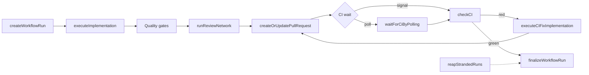

# Activities

> Indexed at commit `d0a90fb5` on 2026-10-06 · [view on GitHub](https://github.com/yorch/auto-swe/tree/d0a90fb5)

## Relevant source files

- [packages/worker/src/activities/index.ts](https://github.com/yorch/auto-swe/blob/d0a90fb5/packages/worker/src/activities/index.ts)
- [packages/worker/src/activities/executeImplementation.ts](https://github.com/yorch/auto-swe/blob/d0a90fb5/packages/worker/src/activities/executeImplementation.ts)
- [packages/worker/src/activities/implementerSession.ts](https://github.com/yorch/auto-swe/blob/d0a90fb5/packages/worker/src/activities/implementerSession.ts)
- [packages/worker/src/activities/ciFixLoop.ts](https://github.com/yorch/auto-swe/blob/d0a90fb5/packages/worker/src/activities/ciFixLoop.ts)
- [packages/worker/src/activities/allowedPaths.ts](https://github.com/yorch/auto-swe/blob/d0a90fb5/packages/worker/src/activities/allowedPaths.ts)
- [packages/worker/src/activities/runReviewNetwork.ts](https://github.com/yorch/auto-swe/blob/d0a90fb5/packages/worker/src/activities/runReviewNetwork.ts)
- [packages/worker/src/activities/createOrUpdatePullRequest.ts](https://github.com/yorch/auto-swe/blob/d0a90fb5/packages/worker/src/activities/createOrUpdatePullRequest.ts)
- [packages/worker/src/activities/waitForCiByPolling.ts](https://github.com/yorch/auto-swe/blob/d0a90fb5/packages/worker/src/activities/waitForCiByPolling.ts)
- [packages/worker/src/activities/qualityGates.ts](https://github.com/yorch/auto-swe/blob/d0a90fb5/packages/worker/src/activities/qualityGates.ts)
- [packages/worker/src/activities/agentRunFinalize.ts](https://github.com/yorch/auto-swe/blob/d0a90fb5/packages/worker/src/activities/agentRunFinalize.ts)
- [packages/worker/src/activities/templates.ts](https://github.com/yorch/auto-swe/blob/d0a90fb5/packages/worker/src/activities/templates.ts)
- [packages/worker/src/activities/scheduledFireAuthorization.ts](https://github.com/yorch/auto-swe/blob/d0a90fb5/packages/worker/src/activities/scheduledFireAuthorization.ts)
- [packages/worker/src/activities/reapStrandedRuns.ts](https://github.com/yorch/auto-swe/blob/d0a90fb5/packages/worker/src/activities/reapStrandedRuns.ts)
- [packages/worker/src/activities/publishOutcome.ts](https://github.com/yorch/auto-swe/blob/d0a90fb5/packages/worker/src/activities/publishOutcome.ts)
- [packages/worker/src/activities/resolveWorkspace.ts](https://github.com/yorch/auto-swe/blob/d0a90fb5/packages/worker/src/activities/resolveWorkspace.ts)
- [packages/worker/src/activities/state.ts](https://github.com/yorch/auto-swe/blob/d0a90fb5/packages/worker/src/activities/state.ts)

## Overview

Activities are the deterministic boundary of the worker. Temporal workflows run in a V8 isolate and cannot touch the network, Docker, the database or an LLM; every such side effect lives in a function under `packages/worker/src/activities/` that a workflow invokes through a proxy. The directory holds 63 non-test modules covering the engineering pipeline (implementation, review, pull request, CI, quality gates, finalization), the channel assistant, workflow authoring, memory, evals, and the periodic sweeps.

[`index.ts`](https://github.com/yorch/auto-swe/blob/d0a90fb5/packages/worker/src/activities/index.ts#L1-L223) is the registry: it re-exports each activity and its input and result types, and anything not exported there is a module-local helper. A comment at [index.ts#L73-L76](https://github.com/yorch/auto-swe/blob/d0a90fb5/packages/worker/src/activities/index.ts#L73-L76) records that `storeContextOverflow` is deliberately left out because only the batch entry point is invoked by workflows.

Sources: [packages/worker/src/activities/index.ts:L1-L223](https://github.com/yorch/auto-swe/blob/d0a90fb5/packages/worker/src/activities/index.ts#L1-L223)

## Implementation

### Implementation activities

`executeImplementation` ([executeImplementation.ts#L106-L113](https://github.com/yorch/auto-swe/blob/d0a90fb5/packages/worker/src/activities/executeImplementation.ts#L106-L113)) takes a `RepoWorkRequest`, an optional `Subtask` (fan-out branches are `<prefix>/<ticket>/<subtask.id>`), a system-prompt override, cross-repo options and an optional `allowedPaths` list. Its first act is `assertRolePricedForUsdCap('implementer')`, so an unpriced model under a USD cap is refused before any clone or container exists. It then loads the `Connection`, resolves the branch prefix from workflow defaults, obtains clone credentials from the source-control provider, and calls `createWorkspace` ([L114-L135](https://github.com/yorch/auto-swe/blob/d0a90fb5/packages/worker/src/activities/executeImplementation.ts#L114-L135)).

Inside the `try`, the activity retrieves similar lessons and fences them as recalled memory, then loops through test-driven-development (TDD) iterations. Each iteration heartbeats, calls `throwIfActivityCancelled`, runs `assertBudgetAvailable`, and invokes `runImplementerTurn` ([L302-L320](https://github.com/yorch/auto-swe/blob/d0a90fb5/packages/worker/src/activities/executeImplementation.ts#L302-L320)). After the loop, `commitStaged` produces the commit and `gitAuthed` pushes by sha ([L379-L382](https://github.com/yorch/auto-swe/blob/d0a90fb5/packages/worker/src/activities/executeImplementation.ts#L379-L382)). The diff then passes `scanDiffForCodeIssues` and `scanDiffForSecurityIssues`; a critical finding throws a non-retryable `ApplicationFailure` ([L401-L426](https://github.com/yorch/auto-swe/blob/d0a90fb5/packages/worker/src/activities/executeImplementation.ts#L401-L426)). The `finally` block persists the `AgentTracer` rows and calls `workspace.destroy()` ([L444-L460](https://github.com/yorch/auto-swe/blob/d0a90fb5/packages/worker/src/activities/executeImplementation.ts#L444-L460)).

The `allowedPaths` guard in [allowedPaths.ts](https://github.com/yorch/auto-swe/blob/d0a90fb5/packages/worker/src/activities/allowedPaths.ts#L1-L60) confines a step to named files. `startPathGuard` records the session's base sha before the agent runs; after the commit, the committed sha is pinned and its tree is compared with the base tree, so the checked, pushed and reported commits are one object. `pushRefspec` builds `<sha>:refs/heads/<branch>` ([allowedPaths.ts#L149](https://github.com/yorch/auto-swe/blob/d0a90fb5/packages/worker/src/activities/allowedPaths.ts#L149)).

The three fix activities share one body. `executeCIFixImplementation` and `executeReviewFixImplementation` in [ciFixLoop.ts#L36-L87](https://github.com/yorch/auto-swe/blob/d0a90fb5/packages/worker/src/activities/ciFixLoop.ts#L36-L87) are thin wrappers over `runImplementerFixSession` ([implementerSession.ts#L117](https://github.com/yorch/auto-swe/blob/d0a90fb5/packages/worker/src/activities/implementerSession.ts#L117)), parameterized by `agentKey` (`ciFixer`, `reviewFixer`), `FixMode` (`CI_FIX`, `REVIEW_FIX`, `GATE_FIX`), a commit message and a user payload. The session re-provisions a workspace, fetches and hard-resets to the remote branch so the agent edits the pushed tree, and then runs the same scan-and-push tail. `fetchCILogs` resolves the repository's own installation before asking the provider for logs ([ciFixLoop.ts#L12-L28](https://github.com/yorch/auto-swe/blob/d0a90fb5/packages/worker/src/activities/ciFixLoop.ts#L12-L28)).

Sources: [packages/worker/src/activities/executeImplementation.ts:L106-L462](https://github.com/yorch/auto-swe/blob/d0a90fb5/packages/worker/src/activities/executeImplementation.ts#L106-L462) [packages/worker/src/activities/implementerSession.ts:L117-L150](https://github.com/yorch/auto-swe/blob/d0a90fb5/packages/worker/src/activities/implementerSession.ts#L117-L150) [packages/worker/src/activities/ciFixLoop.ts:L1-L87](https://github.com/yorch/auto-swe/blob/d0a90fb5/packages/worker/src/activities/ciFixLoop.ts#L1-L87) [packages/worker/src/activities/allowedPaths.ts:L1-L60](https://github.com/yorch/auto-swe/blob/d0a90fb5/packages/worker/src/activities/allowedPaths.ts#L1-L60)

### Review, pull request and CI

`runReviewNetwork` wraps its implementation in `withHeartbeat` because the LLM call can outlast the heartbeat timeout, and a heartbeat is how cancellation reaches it ([runReviewNetwork.ts#L78-L90](https://github.com/yorch/auto-swe/blob/d0a90fb5/packages/worker/src/activities/runReviewNetwork.ts#L78-L90)). It resolves the security, domain-logic and performance reviewer agents plus the parent `reviewer` row in parallel, applies a persona prompt only when an admin customised it ([L40-L72](https://github.com/yorch/auto-swe/blob/d0a90fb5/packages/worker/src/activities/runReviewNetwork.ts#L40-L72)), optionally adds cross-repo dependency context, and records each verdict as an eval signal.

`createOrUpdatePullRequest` persists its trace in a `finally` block so failed GitHub calls still leave rows ([createOrUpdatePullRequest.ts#L28-L42](https://github.com/yorch/auto-swe/blob/d0a90fb5/packages/worker/src/activities/createOrUpdatePullRequest.ts#L28-L42)). It finds the latest pull request on this execution's own ledger row: a `CLOSED` one throws non-retryable `PR_CLOSED_BY_REVIEWER`, an `OPEN` one is updated, otherwise the newest open PR of the request is adopted ([L63-L98](https://github.com/yorch/auto-swe/blob/d0a90fb5/packages/worker/src/activities/createOrUpdatePullRequest.ts#L63-L98)). On update it resets `ciStatus` to `PENDING`, the freshness token the CI webhook handler guards on. A new PR goes through the provider, with `draft: true` honoured strictly, then a `PullRequest` row, a Slack notice, best-effort tracker and knowledge-base sync, and a `pr.created` event.

CI results arrive by one of two paths. `resolveCiWaitConfig` returns the mode (`signal` or `poll`) and timings from workflow defaults ([waitForCiByPolling.ts#L25-L33](https://github.com/yorch/auto-swe/blob/d0a90fb5/packages/worker/src/activities/waitForCiByPolling.ts#L25-L33)). `waitForCiByPolling` heartbeats through `runCiPollLoop`, returns `ciPassed` rather than `passed` so the interpreter does not treat a red CI as a failed gate that bypasses the fix loop, and converts a deadline or fetch error to non-retryable `CI_POLL_DEADLINE` / `CI_POLL_FETCH_FAILED` ([L56-L98](https://github.com/yorch/auto-swe/blob/d0a90fb5/packages/worker/src/activities/waitForCiByPolling.ts#L56-L98)).

Quality gates are `runLint`, `runTypecheck`, `runTests`, `runBuild`, `runVulnScan` and `runPerfBench` over one `runGate` ([qualityGates.ts#L201-L270](https://github.com/yorch/auto-swe/blob/d0a90fb5/packages/worker/src/activities/qualityGates.ts#L201-L270)). A gate with no command passes as a no-op; otherwise it provisions a workspace, resets to the pushed branch, executes, stores the full log as an artifact and destroys the workspace. A failure to check out the branch throws instead of running against the default branch ([L148-L199](https://github.com/yorch/auto-swe/blob/d0a90fb5/packages/worker/src/activities/qualityGates.ts#L148-L199)). `executeGateFixImplementation` reuses the fix session.

Sources: [packages/worker/src/activities/runReviewNetwork.ts:L78-L171](https://github.com/yorch/auto-swe/blob/d0a90fb5/packages/worker/src/activities/runReviewNetwork.ts#L78-L171) [packages/worker/src/activities/createOrUpdatePullRequest.ts:L28-L322](https://github.com/yorch/auto-swe/blob/d0a90fb5/packages/worker/src/activities/createOrUpdatePullRequest.ts#L28-L322) [packages/worker/src/activities/waitForCiByPolling.ts:L1-L99](https://github.com/yorch/auto-swe/blob/d0a90fb5/packages/worker/src/activities/waitForCiByPolling.ts#L1-L99) [packages/worker/src/activities/qualityGates.ts:L148-L270](https://github.com/yorch/auto-swe/blob/d0a90fb5/packages/worker/src/activities/qualityGates.ts#L148-L270)

### Finalization and trusted push

[agentRunFinalize.ts](https://github.com/yorch/auto-swe/blob/d0a90fb5/packages/worker/src/activities/agentRunFinalize.ts#L19-L40) implements the trusted half of an agent run. The agent container is never trusted: its working tree is copied out by the Docker daemon into a fresh container at the base sha ([`importAgentTree`](https://github.com/yorch/auto-swe/blob/d0a90fb5/packages/worker/src/activities/agentRunFinalize.ts#L86)), committed there ([`commitTrustedTree`](https://github.com/yorch/auto-swe/blob/d0a90fb5/packages/worker/src/activities/agentRunFinalize.ts#L166)), judged by `gateTrustedCommit`, and pushed by `pushGatedCommit`. `gateTrustedCommit` runs a deterministic policy, a size bound, an advisory code scan and the LLM gate, each failure being non-retryable (`AGENT_RUN_PUSH_POLICY`, `AGENT_RUN_DIFF_TOO_LARGE`, `SECURITY_GATE_UNAVAILABLE`, `SECURITY_GATE_FAILURE`) ([L280-L300](https://github.com/yorch/auto-swe/blob/d0a90fb5/packages/worker/src/activities/agentRunFinalize.ts#L280-L300)). A unique-symbol brand on `GatedCommit` makes a push without a passing gate fail to type-check, and `pushGatedCommit` validates branch name and sha and pushes `<sha>:refs/heads/<branch>` ([L415-L441](https://github.com/yorch/auto-swe/blob/d0a90fb5/packages/worker/src/activities/agentRunFinalize.ts#L415-L441)).

Run-level finalization lives in [templates.ts](https://github.com/yorch/auto-swe/blob/d0a90fb5/packages/worker/src/activities/templates.ts#L488-L530). `finalizeWorkflowRun` delegates to `finalizeRun`, the core that ends the run, bills its organization and fires terminal side effects exactly once; a guarded `endedAt` write decides races, and the function resolves `true` only for the caller that ended the run. `createWorkflowRun` is the run's first activity and snapshots the spec onto the row ([L201-L219](https://github.com/yorch/auto-swe/blob/d0a90fb5/packages/worker/src/activities/templates.ts#L201-L219)); `recordWorkflowStep` records each step ([L443](https://github.com/yorch/auto-swe/blob/d0a90fb5/packages/worker/src/activities/templates.ts#L443)). [state.ts](https://github.com/yorch/auto-swe/blob/d0a90fb5/packages/worker/src/activities/state.ts#L17-L76) holds the human-step helpers `createHumanStep`, `resolveHumanStep`, `cancelPendingHumanSteps` and `updateDomainState`. `publishOutcome` evaluates the autonomy policy for an action and returns `auto` or `require_approval` with an approver count, writing an `AutonomyDecision` row ([publishOutcome.ts#L22-L64](https://github.com/yorch/auto-swe/blob/d0a90fb5/packages/worker/src/activities/publishOutcome.ts#L22-L64)).

Sources: [packages/worker/src/activities/agentRunFinalize.ts:L19-L441](https://github.com/yorch/auto-swe/blob/d0a90fb5/packages/worker/src/activities/agentRunFinalize.ts#L19-L441) [packages/worker/src/activities/templates.ts:L201-L530](https://github.com/yorch/auto-swe/blob/d0a90fb5/packages/worker/src/activities/templates.ts#L201-L530) [packages/worker/src/activities/publishOutcome.ts:L22-L64](https://github.com/yorch/auto-swe/blob/d0a90fb5/packages/worker/src/activities/publishOutcome.ts#L22-L64) [packages/worker/src/activities/state.ts:L17-L132](https://github.com/yorch/auto-swe/blob/d0a90fb5/packages/worker/src/activities/state.ts#L17-L132)

### Schedules and sweeps

`createWorkflowRun` also hosts the scheduled-fire authorization. A Temporal Schedule starts the workflow without passing through the gateway, so [scheduledFireAuthorization.ts](https://github.com/yorch/auto-swe/blob/d0a90fb5/packages/worker/src/activities/scheduledFireAuthorization.ts#L1-L22) re-takes the launch decision for the schedule's owner at fire time, inside the first activity so the workflow's command sequence and replay are unchanged. `scheduledFireRefusal` recognises a fire by both a `sched-` workflow id and a standing work request ([L86-L100](https://github.com/yorch/auto-swe/blob/d0a90fb5/packages/worker/src/activities/scheduledFireAuthorization.ts#L86-L100)) and yields a reason such as `not-an-org-member`, `org-budget-exceeded` or `request-in-flight`. `assertScheduledFireAuthorized` records the refusal and throws non-retryable `SCHEDULED_FIRE_REFUSED`, so one execution fails cleanly and the next tick decides again ([L357-L372](https://github.com/yorch/auto-swe/blob/d0a90fb5/packages/worker/src/activities/scheduledFireAuthorization.ts#L357-L372)).

`reapStrandedRuns` finalizes `WorkflowRun` rows whose Temporal execution ended without a finalize step. It examines runs with no `endedAt` older than `REAPER_GRACE_MS` (10 minutes), at most `REAPER_MAX_CHECKS` (200) per sweep, never-checked first, ten lookups at a time ([reapStrandedRuns.ts#L25-L29](https://github.com/yorch/auto-swe/blob/d0a90fb5/packages/worker/src/activities/reapStrandedRuns.ts#L25-L29), [L123-L150](https://github.com/yorch/auto-swe/blob/d0a90fb5/packages/worker/src/activities/reapStrandedRuns.ts#L123-L150)). It is fail-safe: a lookup that cannot be answered leaves the run alone, so a live run is never billed on a Temporal hiccup. Channel turns end through `finalizeChannelRun`; everything else goes through `finalizeRun(…, 'reaper', notify)`, and `notify` is false for executions that closed over an hour ago ([L53-L61](https://github.com/yorch/auto-swe/blob/d0a90fb5/packages/worker/src/activities/reapStrandedRuns.ts#L53-L61)).

Other sweeps follow the same shape: `getReposForConsolidation`, `getReposForDependencyScan` and `getDatasetsForRevalidation` list targets, and `consolidateLessons`, `detectRepoDependencies`, `inferRepoDependencies`, `revalidateDatasetActivity`, `syncRepoAccess` and `syncSkillSources` act on them, all exported from [index.ts#L62-L212](https://github.com/yorch/auto-swe/blob/d0a90fb5/packages/worker/src/activities/index.ts#L62-L212).

Sources: [packages/worker/src/activities/scheduledFireAuthorization.ts:L1-L372](https://github.com/yorch/auto-swe/blob/d0a90fb5/packages/worker/src/activities/scheduledFireAuthorization.ts#L1-L372) [packages/worker/src/activities/reapStrandedRuns.ts:L1-L217](https://github.com/yorch/auto-swe/blob/d0a90fb5/packages/worker/src/activities/reapStrandedRuns.ts#L1-L217) [packages/worker/src/activities/index.ts:L62-L212](https://github.com/yorch/auto-swe/blob/d0a90fb5/packages/worker/src/activities/index.ts#L62-L212)

## Diagram

```mermaid
flowchart LR
  A[createWorkflowRun] --> B[executeImplementation]
  B --> C[Quality gates]
  C --> D[runReviewNetwork]
  D --> E[createOrUpdatePullRequest]
  E --> F{CI wait}
  F -->|signal| G[checkCI]
  F -->|poll| H[waitForCiByPolling]
  H --> G
  G -->|red| I[executeCIFixImplementation]
  I --> E
  G -->|green| J[finalizeWorkflowRun]
  K[reapStrandedRuns] -.-> J
```

Sources: [packages/worker/src/activities/index.ts:L56-L223](https://github.com/yorch/auto-swe/blob/d0a90fb5/packages/worker/src/activities/index.ts#L56-L223) [packages/worker/src/activities/waitForCiByPolling.ts:L45-L55](https://github.com/yorch/auto-swe/blob/d0a90fb5/packages/worker/src/activities/waitForCiByPolling.ts#L45-L55)

## Usage

Generic, non-SWE steps use `resolveWorkspace`, which returns a `WorkspaceContext` union (`git_repo`, `document`, `issue_tracker`, `record`, `api_only`) ([resolveWorkspace.ts#L23-L52](https://github.com/yorch/auto-swe/blob/d0a90fb5/packages/worker/src/activities/resolveWorkspace.ts#L23-L52)), together with `readSource`, `runTool` and `writeOutcome` ([index.ts#L115-L124](https://github.com/yorch/auto-swe/blob/d0a90fb5/packages/worker/src/activities/index.ts#L115-L124)). Container and shell steps are `runContainerStep` and `runShellStep`.

Every LLM-calling activity follows one convention: construct an `AgentTracer`, and call `persistActivityTrace` in a `finally` so records survive failure. Activities that provision a workspace destroy it in `finally`, heartbeat during long work, and throw `ApplicationFailure.nonRetryable` with a stable type string when a retry would fail identically.

Sources: [packages/worker/src/activities/resolveWorkspace.ts:L23-L52](https://github.com/yorch/auto-swe/blob/d0a90fb5/packages/worker/src/activities/resolveWorkspace.ts#L23-L52) [packages/worker/src/activities/index.ts:L115-L124](https://github.com/yorch/auto-swe/blob/d0a90fb5/packages/worker/src/activities/index.ts#L115-L124)

## Related Pages

- Parent: [Temporal Worker](./4-temporal-worker.md)
- Sibling: [Temporal Workflows](./4.1-temporal-workflows.md)
- Sibling: [Agent Layer](./4.3-agent-layer.md)
- Sibling: [Docker Workspaces](./4.4-docker-workspaces.md)
- Sibling: [Agent Runs and Implementer Runtimes](./4.6-agent-runs-and-implementer-runtimes.md)
- Sibling: [Agent Memory](./4.8-agent-memory.md)
