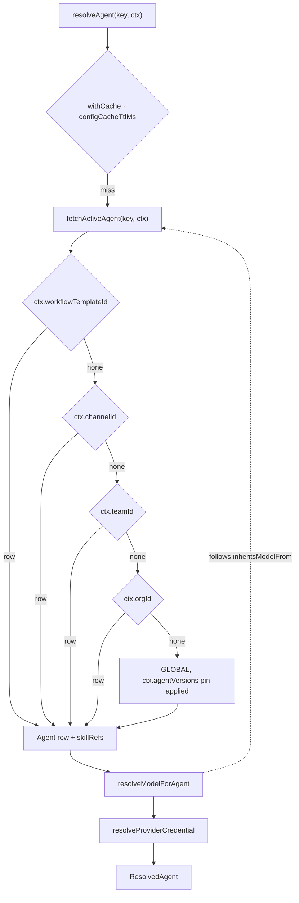
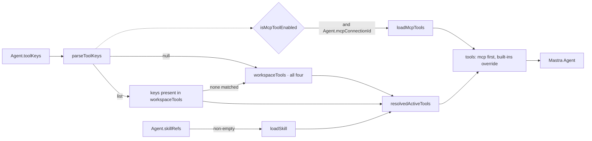

# Agent Resolution, Models, and Tools

> Indexed at commit `b1d8930` on 2026-09-08 · [view on GitHub](https://github.com/yorch/auto-swe/tree/b1d8930)

## Relevant source files

- [packages/worker/src/lib/config/agentResolver.ts](https://github.com/yorch/auto-swe/blob/b1d8930/packages/worker/src/lib/config/agentResolver.ts)
- [packages/worker/src/lib/config/agentSpec.ts](https://github.com/yorch/auto-swe/blob/b1d8930/packages/worker/src/lib/config/agentSpec.ts)
- [packages/worker/src/lib/config/agentSkills.ts](https://github.com/yorch/auto-swe/blob/b1d8930/packages/worker/src/lib/config/agentSkills.ts)
- [packages/worker/src/lib/config/agentRef.ts](https://github.com/yorch/auto-swe/blob/b1d8930/packages/worker/src/lib/config/agentRef.ts)
- [packages/worker/src/lib/config/toolKeys.ts](https://github.com/yorch/auto-swe/blob/b1d8930/packages/worker/src/lib/config/toolKeys.ts)
- [packages/worker/src/lib/config/types.ts](https://github.com/yorch/auto-swe/blob/b1d8930/packages/worker/src/lib/config/types.ts)
- [packages/worker/src/lib/config/resolver.ts](https://github.com/yorch/auto-swe/blob/b1d8930/packages/worker/src/lib/config/resolver.ts)
- [packages/worker/src/lib/config/contextLookup.ts](https://github.com/yorch/auto-swe/blob/b1d8930/packages/worker/src/lib/config/contextLookup.ts)
- [packages/worker/src/lib/config/assertReady.ts](https://github.com/yorch/auto-swe/blob/b1d8930/packages/worker/src/lib/config/assertReady.ts)
- [packages/worker/src/lib/config/deploymentAgents.ts](https://github.com/yorch/auto-swe/blob/b1d8930/packages/worker/src/lib/config/deploymentAgents.ts)
- [packages/worker/src/lib/config/stepRequiredAgents.ts](https://github.com/yorch/auto-swe/blob/b1d8930/packages/worker/src/lib/config/stepRequiredAgents.ts)
- [packages/worker/src/lib/config/mcpConnection.ts](https://github.com/yorch/auto-swe/blob/b1d8930/packages/worker/src/lib/config/mcpConnection.ts)
- [packages/worker/src/lib/models.ts](https://github.com/yorch/auto-swe/blob/b1d8930/packages/worker/src/lib/models.ts)
- [packages/worker/src/lib/embeddings.ts](https://github.com/yorch/auto-swe/blob/b1d8930/packages/worker/src/lib/embeddings.ts)
- [packages/worker/src/lib/providerUtils.ts](https://github.com/yorch/auto-swe/blob/b1d8930/packages/worker/src/lib/providerUtils.ts)
- [packages/worker/src/agents/implementer.ts](https://github.com/yorch/auto-swe/blob/b1d8930/packages/worker/src/agents/implementer.ts)
- [packages/worker/src/agents/mcpTools.ts](https://github.com/yorch/auto-swe/blob/b1d8930/packages/worker/src/agents/mcpTools.ts)
- [packages/worker/src/agents/toolOutputOffload.ts](https://github.com/yorch/auto-swe/blob/b1d8930/packages/worker/src/agents/toolOutputOffload.ts)
- [packages/worker/src/agents/securityReviewProcessor.ts](https://github.com/yorch/auto-swe/blob/b1d8930/packages/worker/src/agents/securityReviewProcessor.ts)
- [packages/worker/src/agents/decomposer.ts](https://github.com/yorch/auto-swe/blob/b1d8930/packages/worker/src/agents/decomposer.ts)
- [packages/worker/src/agents/reviewNetwork.ts](https://github.com/yorch/auto-swe/blob/b1d8930/packages/worker/src/agents/reviewNetwork.ts)
- [packages/worker/src/activities/runAgent.ts](https://github.com/yorch/auto-swe/blob/b1d8930/packages/worker/src/activities/runAgent.ts)
- [packages/worker/src/activities/runReviewNetwork.ts](https://github.com/yorch/auto-swe/blob/b1d8930/packages/worker/src/activities/runReviewNetwork.ts)
- [packages/worker/src/index.ts](https://github.com/yorch/auto-swe/blob/b1d8930/packages/worker/src/index.ts)

## Overview

The agent layer turns a stable agent key such as `implementer` into a running Mastra agent: a bound language model, a composed system prompt, an ordered set of skill fragments, and a tool map. Every one of those pieces comes from a single database entity, the `Agent` row, and a single function reads it. `resolveAgent` is that function, and everything else in this layer is a shim over it or a consumer of its result.

Agent identity is a free-form `string`, aliased as `AnySkillRole`, not an enumeration. Sub-reviewer and decomposer personas that were once members of a union are ordinary rows resolved by key, so a new persona ships as seed content rather than as a code change. `MODEL_BACKED_AGENT_KEYS` survives only as a narrow convenience set for cost pricing and model-config labels, not as the universe of agents.

Sources: [packages/worker/src/lib/config/types.ts:L1-L18](https://github.com/yorch/auto-swe/blob/b1d8930/packages/worker/src/lib/config/types.ts#L1-L18) [packages/worker/src/lib/config/agentResolver.ts:L8-L25](https://github.com/yorch/auto-swe/blob/b1d8930/packages/worker/src/lib/config/agentResolver.ts#L8-L25)

## Version Selection and the Scope Cascade

`fetchActiveAgent` walks five tiers in order — `WORKFLOW_TEMPLATE`, `CHANNEL`, `TEAM`, `ORGANIZATION`, `GLOBAL` — and returns the highest `version` among active rows at the first tier that has one. A tier only fires when its identifier is present on the context, so a deployment with no Slack channels and no organizations behaves exactly like a three-tier cascade. There is no fallback past `GLOBAL`; a missing row raises `ConfigMissingError`.

The run-start version pin in `ctx.agentVersions` applies to the `GLOBAL` tier alone. That map is snapshotted from the `GLOBAL` lineage when the run is created, and a version number carries no meaning across lineages, so applying it at every tier silently defeated scoped overrides whose version happened to differ. A scoped override therefore still wins and floats to its own latest active version, while a run that falls through to `GLOBAL` is frozen at the pinned version.

The context itself is derived from the Temporal activity, not passed by hand. `currentRequestContext` reads the workflow id, then loads the team, the transitively derived organization, the template id, the agent-version pins, and the run-pinned settings. An empty result is deliberately not cached, because caching it would pin resolution to `GLOBAL` for the whole time-to-live window.

Results are cached under a key that includes every scope identifier and a key-sorted rendering of the entire pin map, since an `inheritsModelFrom` chain resolves a parent under the same context. When a lookup falls through to a broader scope than the caller asked for, the entry is invalidated immediately so a row later inserted at the narrower scope is not masked for a full cache interval.

A separate reference format lets a workflow template name an exact version inline. `parseAgentRef` accepts `key` to float to the latest active version, or `key@version` to pin, rejecting anything whose version is not an integer of at least one.

Sources: [packages/worker/src/lib/config/agentResolver.ts:L29-L109](https://github.com/yorch/auto-swe/blob/b1d8930/packages/worker/src/lib/config/agentResolver.ts#L29-L109) [packages/worker/src/lib/config/agentResolver.ts:L173-L229](https://github.com/yorch/auto-swe/blob/b1d8930/packages/worker/src/lib/config/agentResolver.ts#L173-L229) [packages/worker/src/lib/config/contextLookup.ts:L11-L79](https://github.com/yorch/auto-swe/blob/b1d8930/packages/worker/src/lib/config/contextLookup.ts#L11-L79) [packages/worker/src/lib/config/agentRef.ts:L19-L36](https://github.com/yorch/auto-swe/blob/b1d8930/packages/worker/src/lib/config/agentRef.ts#L19-L36)

## Model Binding and Providers

A model is named by a `<provider>/<model-id>` spec. `parseProviderModelSpec` splits on the first slash, lowercases the provider so case cannot route a built-in provider into the fallback path, and preserves the model id verbatim because some self-hosted endpoints are case-sensitive. Model ids may contain further slashes, which is how gateway-style providers address upstream models.

`resolveModelForAgent` follows `inheritsModelFrom` upward until it reaches an ancestor that actually carries a `modelSpec`, guarding against a cycle with a seen-set. This is how the sub-reviewer, fixer, and decomposer personas share a parent's model while keeping their own prompts and skills. A broken chain and a chain that reaches no spec both raise `ConfigMissingError` naming the admin page that fixes it. The credential is then resolved by provider over a `TEAM → ORGANIZATION → GLOBAL` cascade and decrypted; a decryption failure is reported as the same missing-configuration error so the operator sees one affordance.

`buildModel` switches on the provider name: `anthropic`, `openai`, and `google` construct their dedicated adapters, and every other name routes through `createOpenAICompatible`, which requires an `apiBase` on the credential and throws a pointed error when one is absent. Built instances are memoized under a key made of the spec, the last six characters of the API key, and the base URL, so a credential rotation busts the cache without holding the secret in the map.

Sources: [packages/worker/src/lib/providerUtils.ts:L16-L29](https://github.com/yorch/auto-swe/blob/b1d8930/packages/worker/src/lib/providerUtils.ts#L16-L29) [packages/worker/src/lib/config/agentResolver.ts:L131-L165](https://github.com/yorch/auto-swe/blob/b1d8930/packages/worker/src/lib/config/agentResolver.ts#L131-L165) [packages/worker/src/lib/models.ts:L64-L114](https://github.com/yorch/auto-swe/blob/b1d8930/packages/worker/src/lib/models.ts#L64-L114) [packages/worker/src/lib/config/resolver.ts:L22-L84](https://github.com/yorch/auto-swe/blob/b1d8930/packages/worker/src/lib/config/resolver.ts#L22-L84)

## Composing an AgentSpec

`resolveAgentSpec` composes the resolved agent into an `AgentSpec`: an attribution key, the spec string for telemetry, a bound model, a fully composed system prompt, the resolved skills, a tool map, and an optional structured-output schema. The base prompt follows a fixed priority of explicit override, then the stored `systemPrompt`, then the caller's fallback, with the skill suffix appended after a blank line. `selectTools` intersects the caller's candidate tools with the agent's enabled keys, treating a `null` key list as "every candidate".

The spec holds live, non-serializable handles, so it is an in-process value and never a Temporal activity argument. Carrying a built model rather than a spec plus a plaintext key also keeps decrypted credentials out of the object. The generic `runAgent` helper consumes it, builds a Mastra agent, runs one `generate`, records usage, and persists a trace in a `finally` block. An `inline` variant supplies every field directly for agents defined purely as template configuration.

`getModel`, `getModelSpec`, `resolveSystemPrompt`, `loadAgentSkills`, and `loadAgentToolConfig` are thin shims over the same resolver. The two skill and tool shims read the raw row through `fetchActiveAgent` rather than `resolveAgent`, so a skills-only caller cannot fail on a missing credential.

Sources: [packages/worker/src/lib/config/agentSpec.ts:L8-L44](https://github.com/yorch/auto-swe/blob/b1d8930/packages/worker/src/lib/config/agentSpec.ts#L8-L44) [packages/worker/src/lib/config/agentSpec.ts:L89-L161](https://github.com/yorch/auto-swe/blob/b1d8930/packages/worker/src/lib/config/agentSpec.ts#L89-L161) [packages/worker/src/lib/config/agentSkills.ts:L16-L48](https://github.com/yorch/auto-swe/blob/b1d8930/packages/worker/src/lib/config/agentSkills.ts#L16-L48) [packages/worker/src/lib/models.ts:L33-L56](https://github.com/yorch/auto-swe/blob/b1d8930/packages/worker/src/lib/models.ts#L33-L56) [packages/worker/src/activities/runAgent.ts:L52-L110](https://github.com/yorch/auto-swe/blob/b1d8930/packages/worker/src/activities/runAgent.ts#L52-L110)

## Tool Wiring

`IMPLEMENTER_TOOL_IDS` names the four configurable workspace tools: `readFile`, `writeFile`, `listDirectory`, and `bash`. `parseToolKeys` coerces the nullable JSON column into a list, dropping non-string entries rather than failing the resolve, and treats `null` as "no override". `createImplementerAgent` keeps only the keys it recognises and falls back to all four when every supplied key is unrecognised, so a bad configuration never yields a tool-less implementer.

`loadSkill` is added whenever the agent has skills and is not listed in the configurable set, so no tool configuration can remove it. It backs progressive disclosure: the system prompt carries a compact menu of skill names and descriptions, and the agent fetches full guidance for one skill at a time. Agents with no tools receive their fragments inline instead — the security gate joins them onto its prompt directly, the decomposer takes a prepared suffix, and the review network resolves each sub-persona and passes its suffix down.

Sources: [packages/worker/src/agents/implementer.ts:L326-L432](https://github.com/yorch/auto-swe/blob/b1d8930/packages/worker/src/agents/implementer.ts#L326-L432) [packages/worker/src/lib/config/toolKeys.ts:L1-L12](https://github.com/yorch/auto-swe/blob/b1d8930/packages/worker/src/lib/config/toolKeys.ts#L1-L12) [packages/worker/src/agents/securityReviewProcessor.ts:L35-L45](https://github.com/yorch/auto-swe/blob/b1d8930/packages/worker/src/agents/securityReviewProcessor.ts#L35-L45) [packages/worker/src/activities/runReviewNetwork.ts:L34-L64](https://github.com/yorch/auto-swe/blob/b1d8930/packages/worker/src/activities/runReviewNetwork.ts#L34-L64) [packages/worker/src/agents/decomposer.ts:L51-L79](https://github.com/yorch/auto-swe/blob/b1d8930/packages/worker/src/agents/decomposer.ts#L51-L79)

## MCP Tool Binding

Model Context Protocol (MCP) tools bind only when two conditions hold together. `resolveAgentMcpUrl` reads the raw agent row, requires `isMcpToolEnabled` to accept the tool keys — a null or empty list allows it, a non-empty list must contain `mcp` explicitly — and then requires `mcpConnectionId` to point at an active connection of type `mcp` carrying a string `config.url`. Optional `listTimeoutMs` and `callTimeoutMs` in the same JSON bag override the fifteen-second listing and sixty-second per-call defaults.

`loadMcpTools` accepts only `http` and `https` references, validated through the shared server-side request forgery guard; stdio servers are rejected outright because a database column must never drive command execution on the worker host. Every failure path logs, writes a tracer activity event, and returns an empty tool set, so an unreachable server leaves the agent with built-in tools rather than failing the activity. Loaded tools are keyed `mcp_<sanitized-name>` and each execute is wrapped with an audit log, a per-call timeout, and tracer recording under `mcp:<name>`. When the maps are merged, built-in keys are spread last so a remote server cannot shadow `bash` or `writeFile`. The returned `close` handle is adopted whenever a server was contacted at all, including a connect that exposed zero tools, and callers must invoke it in a `finally` block.

Sources: [packages/worker/src/lib/config/mcpConnection.ts:L33-L92](https://github.com/yorch/auto-swe/blob/b1d8930/packages/worker/src/lib/config/mcpConnection.ts#L33-L92) [packages/worker/src/agents/mcpTools.ts:L69-L105](https://github.com/yorch/auto-swe/blob/b1d8930/packages/worker/src/agents/mcpTools.ts#L69-L105) [packages/worker/src/agents/mcpTools.ts:L173-L253](https://github.com/yorch/auto-swe/blob/b1d8930/packages/worker/src/agents/mcpTools.ts#L173-L253) [packages/worker/src/agents/implementer.ts:L393-L438](https://github.com/yorch/auto-swe/blob/b1d8930/packages/worker/src/agents/implementer.ts#L393-L438)

## Large Tool Output Offload

Output from `bash`, `readFile`, and `listDirectory` that exceeds `workspace.maxToolOutputChars` is written to a file and replaced by a bounded excerpt. The destination is `/workspace/.tool-output`, a sibling of the checkout at `/workspace/target-repo` rather than a path inside it, so an offloaded blob is invisible to `git status` and can never be swept into the diff the implementer commits. The setting is resolved once per agent construction and threaded in, not read per tool call.

The excerpt keeps a head and a tail rather than a head alone, because the decisive line in a test run or a build log is usually at the end. The marker between them names the elided character count, states plainly that it is not part of the content so the model does not copy it back out through `writeFile`, and points at the file. Only `bash` can retrieve it: the path is absolute, and `safePath` rejects absolute paths, so `readFile` cannot reach it. Slice boundaries are nudged off the middle of a surrogate pair, and the marker's rendered length is subtracted from the budget rather than guessed, which keeps the result inside the limit at small thresholds. A failed write falls back to plain head truncation and never returns the unbounded blob.

Sources: [packages/worker/src/agents/toolOutputOffload.ts:L6-L13](https://github.com/yorch/auto-swe/blob/b1d8930/packages/worker/src/agents/toolOutputOffload.ts#L6-L13) [packages/worker/src/agents/toolOutputOffload.ts:L79-L186](https://github.com/yorch/auto-swe/blob/b1d8930/packages/worker/src/agents/toolOutputOffload.ts#L79-L186) [packages/worker/src/agents/implementer.ts:L34-L43](https://github.com/yorch/auto-swe/blob/b1d8930/packages/worker/src/agents/implementer.ts#L34-L43) [packages/worker/src/agents/implementer.ts:L106-L146](https://github.com/yorch/auto-swe/blob/b1d8930/packages/worker/src/agents/implementer.ts#L106-L146)

## Embeddings

Embeddings resolve through a different path. `resolveEmbeddingConfig` reads the singleton `EmbeddingConfig` row with no scope cascade, since the embedding model is system-wide, and takes its credential from a pinned row when one is set or from the provider parsed out of the spec otherwise. `openai` is the only built-in; any other provider name is treated as an OpenAI-compatible endpoint and requires an `apiBase`.

Output must be exactly 1536 dimensions, because `memory_items.embedding` is a fixed-width `vector(1536)` column. For OpenAI the helper sends a `dimensions` provider option to truncate a natively larger model down to that width, and it sends that option for no other provider. A vector of any other length throws with a message naming both remedies: pick a matching model, or migrate the column. Each generated vector is returned alongside the spec that produced it, which writers persist so retrieval never compares vectors across embedding spaces after a model switch.

Sources: [packages/worker/src/lib/config/resolver.ts:L86-L123](https://github.com/yorch/auto-swe/blob/b1d8930/packages/worker/src/lib/config/resolver.ts#L86-L123) [packages/worker/src/lib/embeddings.ts:L7-L60](https://github.com/yorch/auto-swe/blob/b1d8930/packages/worker/src/lib/embeddings.ts#L7-L60) [packages/worker/src/lib/embeddings.ts:L88-L118](https://github.com/yorch/auto-swe/blob/b1d8930/packages/worker/src/lib/embeddings.ts#L88-L118)

## Boot-Time Readiness

`assertConfigReady` runs before the Temporal poller starts and refuses to boot the worker when configuration is incomplete. It calls `resolveAgent` on every required key, collecting failures rather than stopping at the first, then checks that the `EmbeddingConfig` row exists, that its spec parses, and that its provider has a resolvable credential or a matching pinned one. The accumulated list is thrown as one error naming every missing piece and the admin pages that supply them, and the process exits non-zero.

The required set is scoped to what the deployment actually installed. `requiredAgentKeysForDeployment` walks the active and experiment versions of every `ACTIVE` template, collects their step names, maps them through `STEP_REQUIRED_AGENTS`, and adds `channelAssistant` when any Slack channel exists, since channel turns call `runAgent` directly rather than through a step node. Steps absent from the map resolve no model. `runAgentNode` maps to `null` because it binds whatever `agentRef` a template names, which makes agents reached that way deliberately outside the gate: they are checked when the template is saved and resolved per node at run time.

Sources: [packages/worker/src/lib/config/assertReady.ts:L19-L75](https://github.com/yorch/auto-swe/blob/b1d8930/packages/worker/src/lib/config/assertReady.ts#L19-L75) [packages/worker/src/lib/config/deploymentAgents.ts:L29-L131](https://github.com/yorch/auto-swe/blob/b1d8930/packages/worker/src/lib/config/deploymentAgents.ts#L29-L131) [packages/worker/src/lib/config/stepRequiredAgents.ts:L34-L63](https://github.com/yorch/auto-swe/blob/b1d8930/packages/worker/src/lib/config/stepRequiredAgents.ts#L34-L63) [packages/worker/src/index.ts:L35-L47](https://github.com/yorch/auto-swe/blob/b1d8930/packages/worker/src/index.ts#L35-L47)

## Related Pages

- Parent: [Temporal Worker](./4-temporal-worker.md)
- Sibling: [Temporal Workflows](./4.1-temporal-workflows.md)
- Sibling: [Activities](./4.2-activities.md)
- Sibling: [Docker Workspaces](./4.4-docker-workspaces.md)
- Sibling: [Observability and Cost](./4.5-observability-and-cost.md)
