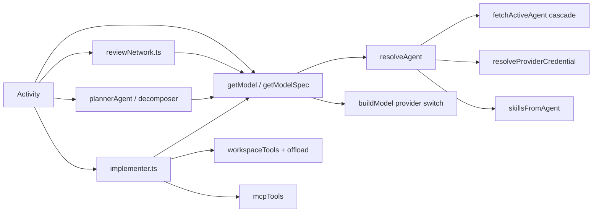

# Agent Layer

> Indexed at commit `d0a90fb5` on 2026-10-06 · [view on GitHub](https://github.com/yorch/auto-swe/tree/d0a90fb5)

## Relevant source files

- [packages/worker/src/lib/config/agentResolver.ts](https://github.com/yorch/auto-swe/blob/d0a90fb5/packages/worker/src/lib/config/agentResolver.ts)
- [packages/worker/src/lib/config/agentSpec.ts](https://github.com/yorch/auto-swe/blob/d0a90fb5/packages/worker/src/lib/config/agentSpec.ts)
- [packages/worker/src/lib/config/assertReady.ts](https://github.com/yorch/auto-swe/blob/d0a90fb5/packages/worker/src/lib/config/assertReady.ts)
- [packages/worker/src/lib/config/mcpConnection.ts](https://github.com/yorch/auto-swe/blob/d0a90fb5/packages/worker/src/lib/config/mcpConnection.ts)
- [packages/worker/src/lib/config/toolKeys.ts](https://github.com/yorch/auto-swe/blob/d0a90fb5/packages/worker/src/lib/config/toolKeys.ts)
- [packages/worker/src/lib/models.ts](https://github.com/yorch/auto-swe/blob/d0a90fb5/packages/worker/src/lib/models.ts)
- [packages/worker/src/agents/implementer.ts](https://github.com/yorch/auto-swe/blob/d0a90fb5/packages/worker/src/agents/implementer.ts)
- [packages/worker/src/agents/reviewNetwork.ts](https://github.com/yorch/auto-swe/blob/d0a90fb5/packages/worker/src/agents/reviewNetwork.ts)
- [packages/worker/src/agents/plannerAgent.ts](https://github.com/yorch/auto-swe/blob/d0a90fb5/packages/worker/src/agents/plannerAgent.ts)
- [packages/worker/src/agents/decomposer.ts](https://github.com/yorch/auto-swe/blob/d0a90fb5/packages/worker/src/agents/decomposer.ts)
- [packages/worker/src/agents/workspaceTools.ts](https://github.com/yorch/auto-swe/blob/d0a90fb5/packages/worker/src/agents/workspaceTools.ts)
- [packages/worker/src/agents/toolOutputOffload.ts](https://github.com/yorch/auto-swe/blob/d0a90fb5/packages/worker/src/agents/toolOutputOffload.ts)
- [packages/worker/src/agents/prompts.ts](https://github.com/yorch/auto-swe/blob/d0a90fb5/packages/worker/src/agents/prompts.ts)
- [packages/worker/src/agents/mcpTools.ts](https://github.com/yorch/auto-swe/blob/d0a90fb5/packages/worker/src/agents/mcpTools.ts)
- [packages/shared/src/lib/syncBuiltins.ts](https://github.com/yorch/auto-swe/blob/d0a90fb5/packages/shared/src/lib/syncBuiltins.ts)

## Overview

The agent layer turns a free-form agent key (`implementer`, `reviewer`, `planner`, and so on) into a bound Mastra `Agent` with a model, a system prompt, skills and tools. Every agent is data: a row in the `Agent` table resolved through one function, `resolveAgent`, and bound to a Vercel AI SDK model by `getModel`. The files under `packages/worker/src/agents/` are the consumers: the implementer, the three-persona review network, the epic planner and the feature decomposer.

```mermaid
flowchart LR
  A[Activity] --> M[getModel / getModelSpec]
  M --> R[resolveAgent]
  R --> F[fetchActiveAgent cascade]
  R --> C[resolveProviderCredential]
  R --> S[skillsFromAgent]
  M --> B[buildModel provider switch]
  I[implementer.ts] --> W[workspaceTools + offload]
  I --> T[mcpTools]
  A --> I
  A --> RN[reviewNetwork.ts]
  A --> P[plannerAgent / decomposer]
  RN --> M
  P --> M
  I --> M
```

Sources: [packages/worker/src/lib/config/agentResolver.ts:L324-L342](https://github.com/yorch/auto-swe/blob/d0a90fb5/packages/worker/src/lib/config/agentResolver.ts#L324-L342) [packages/worker/src/lib/models.ts:L50-L57](https://github.com/yorch/auto-swe/blob/d0a90fb5/packages/worker/src/lib/models.ts#L50-L57) [packages/worker/src/agents/implementer.ts:L79-L96](https://github.com/yorch/auto-swe/blob/d0a90fb5/packages/worker/src/agents/implementer.ts#L79-L96)

## Agent resolution

`resolveAgent(key, ctx)` returns a `ResolvedAgent`: the key, version, verification flag, origin, a resolved model (spec, credential, optional base prompt), ordered skills, enabled `toolKeys` (`null` means no override, so all candidate tools), an optional `mcpConnectionId`, and an optional `runtime`. [agentResolver.ts:L21-L38](https://github.com/yorch/auto-swe/blob/d0a90fb5/packages/worker/src/lib/config/agentResolver.ts#L21-L38)

`fetchActiveAgent` walks the scope cascade `WORKFLOW_TEMPLATE`, `CHANNEL`, `TEAM`, `ORGANIZATION`, `GLOBAL`, returning the highest-version active row at the first scope that has one. The `CHANNEL` and `ORGANIZATION` tiers fire only when `ctx.channelId` or `ctx.orgId` is set. A run's version pin (`ctx.agentVersions`) applies to the `GLOBAL` row only, because a version number is meaningless across lineages; a scoped override still wins and resolves its latest version. [agentResolver.ts:L60-L125](https://github.com/yorch/auto-swe/blob/d0a90fb5/packages/worker/src/lib/config/agentResolver.ts#L60-L125)

Model resolution follows `inheritsModelFrom` until a row carries a `modelSpec`, with a cycle guard, then loads the provider credential. A missing parent, or a chain with no spec, throws `ConfigMissingError`. The agent's `runtime` travels along the same chain: the first row with an opinion decides. [agentResolver.ts:L257-L297](https://github.com/yorch/auto-swe/blob/d0a90fb5/packages/worker/src/lib/config/agentResolver.ts#L257-L297)

Results are cached with `withCache` under a key that includes the template, channel, team and org ids, the full agent-version pin map and a digest of skill pins. A result that fell through to a broader scope than the context requested is invalidated immediately, so a row inserted later at the narrower scope is not hidden for the TTL. [agentResolver.ts:L324-L392](https://github.com/yorch/auto-swe/blob/d0a90fb5/packages/worker/src/lib/config/agentResolver.ts#L324-L392)

Skills come from `skillsFromAgent`. Inactive skills are dropped. When a run pinned a revision, that revision's text and description are read from `skillRevision`, so mid-run edits change nothing; a missing pinned revision falls back to live text and emits a `skill.pinned_revision_missing` trace event. Skills imported from a git source get an `external: owner/repo@sha7` provenance label. [agentResolver.ts:L141-L249](https://github.com/yorch/auto-swe/blob/d0a90fb5/packages/worker/src/lib/config/agentResolver.ts#L141-L249)

`parseToolKeys` coerces the JSON `Agent.toolKeys` column to `string[] | null`, dropping non-string entries. [toolKeys.ts:L7-L12](https://github.com/yorch/auto-swe/blob/d0a90fb5/packages/worker/src/lib/config/toolKeys.ts#L7-L12)

Sources: [packages/worker/src/lib/config/agentResolver.ts](https://github.com/yorch/auto-swe/blob/d0a90fb5/packages/worker/src/lib/config/agentResolver.ts) [packages/worker/src/lib/config/toolKeys.ts](https://github.com/yorch/auto-swe/blob/d0a90fb5/packages/worker/src/lib/config/toolKeys.ts)

## Seeded agents

`SWE_AGENTS` in `syncBuiltins.ts` defines the built-ins. Counting the array at this commit gives 17 model-backed agents with their own `modelSpec` and 11 sub-role personas with `inheritsModelFrom`, 28 in total.

- Model-backed: `implementer`, `reviewer`, `planner`, `securityReview`, `validateContext`, `commitToMemory`, `channelAssistant`, `evalJudge`, `workflowAuthor`, `workflowExplainer`, `contentWriter`, `issueDrafter`, `brandReviewer`, `supportResponder`, `productAnalyst`, `prdWriter`, `repoDependencyInferrer`.
- Personas: `securityReviewer`, `domainLogicReviewer`, `performanceReviewer` (from `reviewer`); `decomposer`, `prdAnalyst`, `prdDecomposer` (from `planner`); `lessonConsolidator` (from `commitToMemory`); `ciFixer`, `reviewFixer`, `gateFixer`, `mergeConflictResolver` (from `implementer`).

Sources: [packages/shared/src/lib/syncBuiltins.ts:L461-L704](https://github.com/yorch/auto-swe/blob/d0a90fb5/packages/shared/src/lib/syncBuiltins.ts#L461-L704)

## Model binding

`getModel(role, ctx?)` merges the ambient Temporal activity context with an optional override (channel-resident callers pass `{ channelId }`), resolves the agent, and builds a `LanguageModel`. `getModelSpec` returns only the spec string, and `getBoundModel` returns both so callers that price their own spend charge the model that was actually bound. [models.ts:L34-L73](https://github.com/yorch/auto-swe/blob/d0a90fb5/packages/worker/src/lib/models.ts#L34-L73)

`buildModel` caches constructed models under `spec|last-6-of-apiKey|apiBase`, so a credential rotation busts the cache without storing the secret in the key. The provider switch handles `anthropic`, `openai` and `google` natively; any other provider requires an `apiBase` and goes through `createOpenAICompatible`, otherwise it throws a configuration error. [models.ts:L98-L131](https://github.com/yorch/auto-swe/blob/d0a90fb5/packages/worker/src/lib/models.ts#L98-L131)

`resolveSystemPrompt(role, fallback, override?)` returns the override if given, else the resolved agent's `systemPrompt`, else the built-in fallback. All built-in prompt constants live in `@auto-swe/shared` and are re-exported by `prompts.ts` so the web UI can import them. [models.ts:L140-L151](https://github.com/yorch/auto-swe/blob/d0a90fb5/packages/worker/src/lib/models.ts#L140-L151) [prompts.ts:L1-L3](https://github.com/yorch/auto-swe/blob/d0a90fb5/packages/worker/src/agents/prompts.ts#L1-L3)

`resolveAgentSpec` composes model, skills, prompt and tools into one `AgentSpec` for the generic agent runner. The base prompt follows `promptOverride`, then the agent's `systemPrompt`, then `basePrompt`; the skill suffix is appended after a blank line; tools are selected from `availableTools` by the agent's `toolKeys`. An `inline` input bypasses resolution. [agentSpec.ts:L116-L162](https://github.com/yorch/auto-swe/blob/d0a90fb5/packages/worker/src/lib/config/agentSpec.ts#L116-L162)

At boot, `assertConfigReady` calls `resolveAgent` for every agent key the installed templates can reach and checks the `EmbeddingConfig` singleton and its credential. It collects all failures into one error so the worker refuses to start with a complete list. [assertReady.ts:L19-L76](https://github.com/yorch/auto-swe/blob/d0a90fb5/packages/worker/src/lib/config/assertReady.ts#L19-L76)

Sources: [packages/worker/src/lib/models.ts](https://github.com/yorch/auto-swe/blob/d0a90fb5/packages/worker/src/lib/models.ts) [packages/worker/src/lib/config/agentSpec.ts](https://github.com/yorch/auto-swe/blob/d0a90fb5/packages/worker/src/lib/config/agentSpec.ts) [packages/worker/src/lib/config/assertReady.ts](https://github.com/yorch/auto-swe/blob/d0a90fb5/packages/worker/src/lib/config/assertReady.ts)

## Implementer agent

`createImplementerAgent` builds a Mastra `Agent` bound to one workspace container. It builds the four workspace tools, creates a `loadSkill` tool, filters the workspace tools by the enabled keys (`null` or empty means all four; a list with no recognised key also falls back to all four), and optionally loads MCP tools. The agent receives `{ ...mcpTools, ...resolvedActiveTools }`, so built-in tool names win over a colliding remote MCP tool. [implementer.ts:L79-L226](https://github.com/yorch/auto-swe/blob/d0a90fb5/packages/worker/src/agents/implementer.ts#L79-L226)

Skills use progressive disclosure: the system prompt carries only an "Available Skills" menu of names and descriptions, and the agent calls `loadSkill` to fetch a skill's full text. `loadSkill` is added only when skills exist. [implementer.ts:L113-L206](https://github.com/yorch/auto-swe/blob/d0a90fb5/packages/worker/src/agents/implementer.ts#L113-L206)

`resolveImplementerConfig` loads tool keys, skills and the `workspace.maxToolOutputChars` and `workspace.agentMaxSteps` settings in parallel. For a persona (`agentKey` other than `implementer`), `effectivePersonaToolKeys` intersects the persona's tool keys with the implementer's, so a persona can narrow but never widen the implementer's tools. A persona with no skills of its own inherits the implementer's. [implementer.ts:L243-L305](https://github.com/yorch/auto-swe/blob/d0a90fb5/packages/worker/src/agents/implementer.ts#L243-L305)

`buildImplementerForActivity` combines that config with the agent's MCP target and returns the agent, `promptSuffix`, `maxSteps`, skills, tool keys and a `closeMcp` function the caller must invoke in a `finally` block. Every `agent.generate` on the result must pass `maxSteps`, or Mastra stops a turn after 5 steps. Runtime selection between Mastra and a harness lives in sibling modules covered by the agent-runs page. [implementer.ts:L307-L362](https://github.com/yorch/auto-swe/blob/d0a90fb5/packages/worker/src/agents/implementer.ts#L307-L362)

Sources: [packages/worker/src/agents/implementer.ts](https://github.com/yorch/auto-swe/blob/d0a90fb5/packages/worker/src/agents/implementer.ts)

## Workspace tools and output offload

`buildWorkspaceTools` returns `readFile`, `writeFile`, `listDirectory` and `bash`, each executing through `docker exec` in the workspace. `safePath` rejects absolute paths, `..` traversal, NUL bytes, single quotes and backslashes. Because the scanners sit inside the tool bodies, a caller building its own tool set cannot skip them: `writeFile` runs `checkSensitiveFilePath` and a pre-write content check, and `bash` runs `scanShellCommand` after redacting the command for the audit log. File contents are streamed over stdin rather than argv to avoid the kernel argument-size limit. [workspaceTools.ts:L23-L110](https://github.com/yorch/auto-swe/blob/d0a90fb5/packages/worker/src/agents/workspaceTools.ts#L23-L110) [workspaceTools.ts:L207-L268](https://github.com/yorch/auto-swe/blob/d0a90fb5/packages/worker/src/agents/workspaceTools.ts#L207-L268)

`offloadIfLarge` returns output unchanged when it fits within `maxChars`. Otherwise it writes the full output to `/workspace/.tool-output/`, a sibling of the target repo that `git add -A` never sees, and returns a head and tail excerpt (60 percent head) with a marker naming the file and elided character count. If the write fails it falls back to a plain truncation, so the result is always bounded. `readFile`, `listDirectory` and `bash` all go through it, and `packOffload` records the offload metadata on the trace. [toolOutputOffload.ts:L13-L53](https://github.com/yorch/auto-swe/blob/d0a90fb5/packages/worker/src/agents/toolOutputOffload.ts#L13-L53) [toolOutputOffload.ts:L160-L186](https://github.com/yorch/auto-swe/blob/d0a90fb5/packages/worker/src/agents/toolOutputOffload.ts#L160-L186)

Sources: [packages/worker/src/agents/workspaceTools.ts](https://github.com/yorch/auto-swe/blob/d0a90fb5/packages/worker/src/agents/workspaceTools.ts) [packages/worker/src/agents/toolOutputOffload.ts](https://github.com/yorch/auto-swe/blob/d0a90fb5/packages/worker/src/agents/toolOutputOffload.ts)

## MCP tool binding

MCP tools bind only when two gates pass. `isMcpToolEnabled` returns true for a `null` or empty tool list and otherwise requires the `mcp` pseudo-key. `resolveAgentMcpUrl` additionally requires an active `mcp` Connection referenced by `Agent.mcpConnectionId`. It reads the raw agent row, never throws, and returns `null` on any error so the activity degrades to built-in tools. [mcpTools.ts:L89-L94](https://github.com/yorch/auto-swe/blob/d0a90fb5/packages/worker/src/agents/mcpTools.ts#L89-L94) [mcpConnection.ts:L117-L138](https://github.com/yorch/auto-swe/blob/d0a90fb5/packages/worker/src/lib/config/mcpConnection.ts#L117-L138)

`ImplementerAgentOptions` carries the decrypted bearer token, custom headers, the private-network opt-in and per-connection list and call timeouts. `loadMcpTools` returns a `close` function that is always adopted, even for a connect with zero tools, to avoid leaking the client. A persona without its own MCP binding uses the implementer's. [implementer.ts:L35-L75](https://github.com/yorch/auto-swe/blob/d0a90fb5/packages/worker/src/agents/implementer.ts#L35-L75) [implementer.ts:L176-L195](https://github.com/yorch/auto-swe/blob/d0a90fb5/packages/worker/src/agents/implementer.ts#L176-L195)

Sources: [packages/worker/src/agents/mcpTools.ts](https://github.com/yorch/auto-swe/blob/d0a90fb5/packages/worker/src/agents/mcpTools.ts) [packages/worker/src/lib/config/mcpConnection.ts](https://github.com/yorch/auto-swe/blob/d0a90fb5/packages/worker/src/lib/config/mcpConnection.ts)

## Review network

`runReviewNetwork` runs three reviewer agents in parallel with `Promise.allSettled`. `REVIEWER_AGENT_KEYS` maps `SECURITY`, `DOMAIN_LOGIC` and `PERFORMANCE` to the `securityReviewer`, `domainLogicReviewer` and `performanceReviewer` personas, each binding the `reviewer` model unless its row overrides it. Each returns a Zod-validated `ReviewVerdict` via `structuredOutput`. A `CRITICAL` severity forces `approved` to false regardless of the model's own flag. [reviewNetwork.ts:L36-L144](https://github.com/yorch/auto-swe/blob/d0a90fb5/packages/worker/src/agents/reviewNetwork.ts#L36-L144)

Prompt assembly uses `ReviewNetworkOptions`: a step-level `systemPromptOverride` replaces all three base prompts, otherwise each persona uses its own chosen prompt or its built-in constant. Skill suffixes, the cross-repo dependency block and, for the domain reviewer, success criteria are appended. The security reviewer also receives the static code-security findings. [reviewNetwork.ts:L154-L231](https://github.com/yorch/auto-swe/blob/d0a90fb5/packages/worker/src/agents/reviewNetwork.ts#L154-L231)

Before the fan-out, the network checks USD-cap pricing once per reviewer key and the budget once. Failure handling has three tiers: an unrecoverable failure (non-retryable `ApplicationFailure` or `ConfigMissingError`) is rethrown; if all three fail, a retryable `REVIEW_NETWORK_UNAVAILABLE` is thrown; if only some fail, each crashed reviewer becomes a `CRITICAL` `REVIEWER_CRASH` finding requiring manual review. The result is approved only when every verdict is approved, and `summarizeRejections` formats the findings that feed the review-fix session. [reviewNetwork.ts:L233-L344](https://github.com/yorch/auto-swe/blob/d0a90fb5/packages/worker/src/agents/reviewNetwork.ts#L233-L344)

Sources: [packages/worker/src/agents/reviewNetwork.ts](https://github.com/yorch/auto-swe/blob/d0a90fb5/packages/worker/src/agents/reviewNetwork.ts)

## Planner and decomposer

`decomposeEpic` calls the `planner` agent with the epic description and available repositories and validates the output against `PlannerOutputSchema`. `normalizePlan` is pure and deterministic: it drops unknown repositories, merges duplicate entries by unioning dependencies, appends any omitted repository with no dependencies, and drops self or out-of-plan dependencies. The planner therefore chooses ordering but not scope. An empty plan throws non-retryable `EPIC_PLAN_EMPTY`. [plannerAgent.ts:L42-L71](https://github.com/yorch/auto-swe/blob/d0a90fb5/packages/worker/src/agents/plannerAgent.ts#L42-L71) [plannerAgent.ts:L75-L165](https://github.com/yorch/auto-swe/blob/d0a90fb5/packages/worker/src/agents/plannerAgent.ts#L75-L165)

`planDecomposition` runs the `decomposer` persona, which inherits the planner's model. Output is limited to `MAX_SUBTASKS = 8` subtasks whose ids match a lowercase-kebab regex. If the structured output is missing or fails validation, the function falls back to a single-subtask plan instead of failing the run, and still records the paid call on the trace. [decomposer.ts:L38-L51](https://github.com/yorch/auto-swe/blob/d0a90fb5/packages/worker/src/agents/decomposer.ts#L38-L51) [decomposer.ts:L53-L120](https://github.com/yorch/auto-swe/blob/d0a90fb5/packages/worker/src/agents/decomposer.ts#L53-L120)

Both agents share a call shape: an OpenTelemetry span, `assertRolePricedForUsdCap` and `assertBudgetAvailable` before generation, `recordLlmUsage` after it, and an `AgentTracer` entry on both success and failure.

Sources: [packages/worker/src/agents/plannerAgent.ts](https://github.com/yorch/auto-swe/blob/d0a90fb5/packages/worker/src/agents/plannerAgent.ts) [packages/worker/src/agents/decomposer.ts](https://github.com/yorch/auto-swe/blob/d0a90fb5/packages/worker/src/agents/decomposer.ts)
