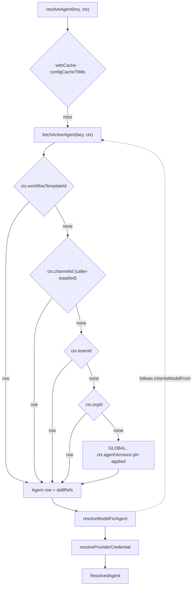
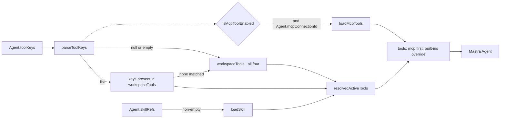

# Agent Resolution, Models, and Tools

> Indexed at commit `ae416937` on 2026-10-03 · [view on GitHub](https://github.com/yorch/auto-swe/tree/ae416937)

## Relevant source files

- [packages/worker/src/lib/config/agentResolver.ts](https://github.com/yorch/auto-swe/blob/ae416937/packages/worker/src/lib/config/agentResolver.ts)
- [packages/worker/src/lib/config/agentSpec.ts](https://github.com/yorch/auto-swe/blob/ae416937/packages/worker/src/lib/config/agentSpec.ts)
- [packages/worker/src/lib/config/agentSkills.ts](https://github.com/yorch/auto-swe/blob/ae416937/packages/worker/src/lib/config/agentSkills.ts)
- [packages/worker/src/lib/config/agentRef.ts](https://github.com/yorch/auto-swe/blob/ae416937/packages/worker/src/lib/config/agentRef.ts)
- [packages/worker/src/lib/config/toolKeys.ts](https://github.com/yorch/auto-swe/blob/ae416937/packages/worker/src/lib/config/toolKeys.ts)
- [packages/worker/src/lib/config/types.ts](https://github.com/yorch/auto-swe/blob/ae416937/packages/worker/src/lib/config/types.ts)
- [packages/worker/src/lib/config/resolver.ts](https://github.com/yorch/auto-swe/blob/ae416937/packages/worker/src/lib/config/resolver.ts)
- [packages/worker/src/lib/config/contextLookup.ts](https://github.com/yorch/auto-swe/blob/ae416937/packages/worker/src/lib/config/contextLookup.ts)
- [packages/worker/src/lib/config/channelContext.ts](https://github.com/yorch/auto-swe/blob/ae416937/packages/worker/src/lib/config/channelContext.ts)
- [packages/worker/src/lib/config/assertReady.ts](https://github.com/yorch/auto-swe/blob/ae416937/packages/worker/src/lib/config/assertReady.ts)
- [packages/worker/src/lib/config/deploymentAgents.ts](https://github.com/yorch/auto-swe/blob/ae416937/packages/worker/src/lib/config/deploymentAgents.ts)
- [packages/worker/src/lib/config/stepRequiredAgents.ts](https://github.com/yorch/auto-swe/blob/ae416937/packages/worker/src/lib/config/stepRequiredAgents.ts)
- [packages/worker/src/lib/config/mcpConnection.ts](https://github.com/yorch/auto-swe/blob/ae416937/packages/worker/src/lib/config/mcpConnection.ts)
- [packages/worker/src/lib/models.ts](https://github.com/yorch/auto-swe/blob/ae416937/packages/worker/src/lib/models.ts)
- [packages/worker/src/lib/embeddings.ts](https://github.com/yorch/auto-swe/blob/ae416937/packages/worker/src/lib/embeddings.ts)
- [packages/worker/src/lib/usdCapGuard.ts](https://github.com/yorch/auto-swe/blob/ae416937/packages/worker/src/lib/usdCapGuard.ts)
- [packages/worker/src/lib/llmAttribution.ts](https://github.com/yorch/auto-swe/blob/ae416937/packages/worker/src/lib/llmAttribution.ts)
- [packages/worker/src/lib/traceTotals.ts](https://github.com/yorch/auto-swe/blob/ae416937/packages/worker/src/lib/traceTotals.ts)
- [packages/worker/src/agents/implementer.ts](https://github.com/yorch/auto-swe/blob/ae416937/packages/worker/src/agents/implementer.ts)
- [packages/worker/src/agents/implementerRuntime.ts](https://github.com/yorch/auto-swe/blob/ae416937/packages/worker/src/agents/implementerRuntime.ts)
- [packages/worker/src/agents/implementerRuntimeSelect.ts](https://github.com/yorch/auto-swe/blob/ae416937/packages/worker/src/agents/implementerRuntimeSelect.ts)
- [packages/worker/src/agents/workspaceTools.ts](https://github.com/yorch/auto-swe/blob/ae416937/packages/worker/src/agents/workspaceTools.ts)
- [packages/worker/src/agents/agentRunTools.ts](https://github.com/yorch/auto-swe/blob/ae416937/packages/worker/src/agents/agentRunTools.ts)
- [packages/worker/src/agents/mcpTools.ts](https://github.com/yorch/auto-swe/blob/ae416937/packages/worker/src/agents/mcpTools.ts)
- [packages/worker/src/agents/toolOutputOffload.ts](https://github.com/yorch/auto-swe/blob/ae416937/packages/worker/src/agents/toolOutputOffload.ts)
- [packages/worker/src/agents/securityReviewProcessor.ts](https://github.com/yorch/auto-swe/blob/ae416937/packages/worker/src/agents/securityReviewProcessor.ts)
- [packages/worker/src/agents/decomposer.ts](https://github.com/yorch/auto-swe/blob/ae416937/packages/worker/src/agents/decomposer.ts)
- [packages/worker/src/agents/reviewNetwork.ts](https://github.com/yorch/auto-swe/blob/ae416937/packages/worker/src/agents/reviewNetwork.ts)
- [packages/worker/src/activities/runAgent.ts](https://github.com/yorch/auto-swe/blob/ae416937/packages/worker/src/activities/runAgent.ts)
- [packages/worker/src/activities/runAgentNode.ts](https://github.com/yorch/auto-swe/blob/ae416937/packages/worker/src/activities/runAgentNode.ts)
- [packages/worker/src/activities/runReviewNetwork.ts](https://github.com/yorch/auto-swe/blob/ae416937/packages/worker/src/activities/runReviewNetwork.ts)
- [packages/worker/src/activities/decomposition.ts](https://github.com/yorch/auto-swe/blob/ae416937/packages/worker/src/activities/decomposition.ts)
- [packages/worker/src/index.ts](https://github.com/yorch/auto-swe/blob/ae416937/packages/worker/src/index.ts)
- [packages/shared/src/lib/syncBuiltins.ts](https://github.com/yorch/auto-swe/blob/ae416937/packages/shared/src/lib/syncBuiltins.ts)
- [packages/shared/src/lib/modelSpec.ts](https://github.com/yorch/auto-swe/blob/ae416937/packages/shared/src/lib/modelSpec.ts)
- [packages/shared/src/lib/builtinModels.ts](https://github.com/yorch/auto-swe/blob/ae416937/packages/shared/src/lib/builtinModels.ts)

## Overview

The agent layer turns a stable agent key such as `implementer` into a running Mastra agent: a bound language model, a composed system prompt, an ordered set of skill fragments, and a tool map. Every one of those pieces comes from a single database entity, the `Agent` row, and a single function reads it. `resolveAgent` is that function, and everything else in this layer is a shim over it or a consumer of its result.

Agent identity is a free-form `string`, aliased as `AnySkillRole`, not an enumeration. Sub-reviewer, fixer, and decomposer personas are ordinary rows resolved by key, so a new persona ships as seed content rather than as a code change. `MODEL_BACKED_AGENT_KEYS` survives only as a narrow convenience set (seven keys) for model-config labels, not as the universe of agents. The built-in roster is seeded by `syncBuiltins` and described in [Seeded Roster and Default-Model Migration](#seeded-roster-and-default-model-migration).

Three neighbouring subjects are deliberately kept out of this page. Which models exist, what they cost, and how a call is priced is [Model Catalog and Pricing](./4.7-model-catalog-and-pricing.md). The loop that drives an implementer turn once the agent is built, including the optional Claude Code runtime, is [Agent Runs and Implementer Runtimes](./4.6-agent-runs-and-implementer-runtimes.md); this page covers only how the runtime is selected. The reference for the behaviour described here is [`docs/agents.md`](https://github.com/yorch/auto-swe/blob/ae416937/docs/agents.md).

Sources: [packages/worker/src/lib/config/types.ts:L1-L18](https://github.com/yorch/auto-swe/blob/ae416937/packages/worker/src/lib/config/types.ts#L1-L18) [packages/worker/src/lib/config/agentResolver.ts:L8-L25](https://github.com/yorch/auto-swe/blob/ae416937/packages/worker/src/lib/config/agentResolver.ts#L8-L25) [packages/shared/src/agentKeys.ts:L1-L29](https://github.com/yorch/auto-swe/blob/ae416937/packages/shared/src/agentKeys.ts#L1-L29)

## Version Selection and the Scope Cascade

```mermaid
flowchart TD
    call["resolveAgent(key, ctx)"] --> cache{"withCache · configCacheTtlMs"}
    cache -->|miss| fetch["fetchActiveAgent(key, ctx)"]
    fetch --> wt{"ctx.workflowTemplateId"}
    wt -->|row| got["Agent row + skillRefs"]
    wt -->|none| ch{"ctx.channelId (caller-supplied)"}
    ch -->|row| got
    ch -->|none| team{"ctx.teamId"}
    team -->|row| got
    team -->|none| org{"ctx.orgId"}
    org -->|row| got
    org -->|none| glob["GLOBAL, ctx.agentVersions pin applied"]
    glob --> got
    got --> model["resolveModelForAgent"]
    model -.follows inheritsModelFrom.-> fetch
    model --> cred["resolveProviderCredential"]
    cred --> out["ResolvedAgent"]
```

`fetchActiveAgent` walks five tiers in order — `WORKFLOW_TEMPLATE`, `CHANNEL`, `TEAM`, `ORGANIZATION`, `GLOBAL` — and returns the highest `version` among active rows at the first tier that has one. A tier only fires when its identifier is present on the context, so a deployment with no Slack channels and no organizations behaves exactly like a three-tier cascade. There is no fallback past `GLOBAL`; a missing row raises `ConfigMissingError`, as does a pinned version that has no active row.

The run-start version pin in `ctx.agentVersions` applies to the `GLOBAL` tier alone. That map is snapshotted from the `GLOBAL` lineage when the run is created, and a version number carries no meaning across lineages, so applying it at every tier would silently defeat scoped overrides whose version happened to differ. A scoped override therefore still wins and floats to its own latest active version, while a run that falls through to `GLOBAL` is frozen at the pinned version.

The context itself is derived from the Temporal activity, not passed by hand. `currentRequestContext` reads the workflow id, then loads the team, the transitively derived organization, the template id, the agent-version pins, and the run-pinned settings. It never supplies a `channelId`: the Temporal context cannot know one, so channel-resident callers add it themselves. `withChannelScope` does that for activities: it sets `channelId` and, when the ambient context carries no team (a repo-less channel task has no ledger row), also fills in the channel's own team and organization, so an override at either tier applies to a delegated task as it does to the assistant's reply. A missing channel row degrades to the channel id alone. `getModel` merges a caller-supplied partial context over the ambient one in the same spirit. An empty result from `currentRequestContext` is deliberately not cached, because caching it would pin resolution to `GLOBAL` for the whole time-to-live window.

Results are cached under a key that includes every scope identifier and a key-sorted rendering of the entire pin map, since an `inheritsModelFrom` chain resolves a parent under the same context. When a lookup falls through to a broader scope than the caller asked for, the entry is invalidated immediately so a row later inserted at the narrower scope is not masked for a full cache interval.

A reference format lets a workflow template name an exact version inline. `parseAgentRef` accepts `key` to float to the latest active version, or `key@version` to pin, rejecting anything whose version is not an integer of at least one. `runAgentNode` applies the pin by overlaying `{ [key]: version }` on the run-start snapshot, so an explicit `key@version` overrides the run pin for that key only.

Sources: [packages/worker/src/lib/config/agentResolver.ts:L29-L109](https://github.com/yorch/auto-swe/blob/ae416937/packages/worker/src/lib/config/agentResolver.ts#L29-L109) [packages/worker/src/lib/config/agentResolver.ts:L173-L251](https://github.com/yorch/auto-swe/blob/ae416937/packages/worker/src/lib/config/agentResolver.ts#L173-L251) [packages/worker/src/lib/config/types.ts:L20-L48](https://github.com/yorch/auto-swe/blob/ae416937/packages/worker/src/lib/config/types.ts#L20-L48) [packages/worker/src/lib/config/contextLookup.ts:L6-L80](https://github.com/yorch/auto-swe/blob/ae416937/packages/worker/src/lib/config/contextLookup.ts#L6-L80) [packages/worker/src/lib/config/channelContext.ts:L1-L36](https://github.com/yorch/auto-swe/blob/ae416937/packages/worker/src/lib/config/channelContext.ts#L1-L36) [packages/worker/src/lib/config/agentRef.ts:L11-L36](https://github.com/yorch/auto-swe/blob/ae416937/packages/worker/src/lib/config/agentRef.ts#L11-L36) [packages/worker/src/activities/runAgentNode.ts:L64-L77](https://github.com/yorch/auto-swe/blob/ae416937/packages/worker/src/activities/runAgentNode.ts#L64-L77) [packages/worker/src/lib/models.ts:L40-L57](https://github.com/yorch/auto-swe/blob/ae416937/packages/worker/src/lib/models.ts#L40-L57)

## Model Binding and Providers

A model is named by a `<provider>/<model-id>` spec. `parseProviderModelSpec`, which lives in `packages/shared` so the gateway and the worker split specs the same way, splits on the first slash, lowercases the provider so case cannot route a built-in provider into the fallback path, and preserves the model id verbatim because some self-hosted endpoints are case-sensitive. Model ids may contain further slashes, which is how gateway-style providers address upstream models.

`resolveModelForAgent` follows `inheritsModelFrom` upward until it reaches an ancestor that actually carries a `modelSpec`, guarding against a cycle with a seen-set. This is how the sub-reviewer, fixer, and decomposer personas share a parent's model while keeping their own prompts and skills. A broken chain and a chain that reaches no spec both raise `ConfigMissingError` naming the admin page that fixes it (`/studio/agents/library`). The credential is then resolved by provider over a `TEAM → ORGANIZATION → GLOBAL` cascade, with no template or channel tier of its own, and decrypted; a decryption failure is reported as the same missing-configuration error so the operator sees one affordance.

`getModelSpec` and `getModel` read the ambient activity context and accept any agent key. `getBoundModel` resolves a role once and returns the model together with the spec it was built from, so a caller that prices its own spend can charge the call at the model it actually bound rather than re-resolving the role from an ambient context that cannot see the `CHANNEL` tier. `buildModel` switches on the provider name. Three providers are built in: `anthropic`, `openai`, and `google` construct their dedicated adapters. Every other name routes through `createOpenAICompatible`, which requires an `apiBase` on the credential and throws a pointed error when one is absent. Built instances are memoized under a key made of the spec, the last six characters of the API key, and the base URL, so a credential rotation busts the cache without holding the secret in the map.

The built-in price table, `BUILTIN_MODELS`, now lives in `packages/shared`. Read from source it holds 34 entries: sixteen Anthropic chat models (the `claude-fable-5` and `claude-fable-5-1` ids, the Opus 4.x and 5.x ids including `claude-opus-5-5`, the Sonnet 4.x and 5.x ids including `claude-sonnet-5-5`, and Haiku, with `claude-sonnet-4-20250514` marked `RETIRED` but still priced), ten Google Gemini chat models, six OpenAI chat models (`gpt-5`, `gpt-5.5`, `gpt-5.5-pro`, `gpt-6-astra`, `gpt-6.1-sol`, `gpt-6-luna`), and two OpenAI embedding models. Pricing a call, the database-backed catalog that overrides these rows, the unpriced-model warnings, and provider model discovery are all covered in [Model Catalog and Pricing](./4.7-model-catalog-and-pricing.md).

One pricing rule does reach into agent code. Before a model call on a capped path, the role-binding paths (implementer and fix sessions, the three reviewers, planner, decomposer, security gate) call `assertRolePricedForUsdCap`, which resolves the role's model and refuses the call when that model has no price and a USD cap is in force. The review network runs the check once per distinct reviewer key before the fan-out rather than three times concurrently.

Sources: [packages/shared/src/lib/modelSpec.ts:L1-L29](https://github.com/yorch/auto-swe/blob/ae416937/packages/shared/src/lib/modelSpec.ts#L1-L29) [packages/worker/src/lib/config/agentResolver.ts:L125-L165](https://github.com/yorch/auto-swe/blob/ae416937/packages/worker/src/lib/config/agentResolver.ts#L125-L165) [packages/worker/src/lib/models.ts:L27-L73](https://github.com/yorch/auto-swe/blob/ae416937/packages/worker/src/lib/models.ts#L27-L73) [packages/worker/src/lib/models.ts:L85-L131](https://github.com/yorch/auto-swe/blob/ae416937/packages/worker/src/lib/models.ts#L85-L131) [packages/worker/src/lib/config/resolver.ts:L17-L84](https://github.com/yorch/auto-swe/blob/ae416937/packages/worker/src/lib/config/resolver.ts#L17-L84) [packages/worker/src/lib/config/resolver.ts:L129-L147](https://github.com/yorch/auto-swe/blob/ae416937/packages/worker/src/lib/config/resolver.ts#L129-L147) [packages/shared/src/lib/builtinModels.ts:L100-L422](https://github.com/yorch/auto-swe/blob/ae416937/packages/shared/src/lib/builtinModels.ts#L100-L422) [packages/worker/src/lib/usdCapGuard.ts:L111-L155](https://github.com/yorch/auto-swe/blob/ae416937/packages/worker/src/lib/usdCapGuard.ts#L111-L155) [packages/worker/src/agents/reviewNetwork.ts:L224-L232](https://github.com/yorch/auto-swe/blob/ae416937/packages/worker/src/agents/reviewNetwork.ts#L224-L232)

## Seeded Roster and Default-Model Migration

`SWE_AGENTS` is the list of built-in GLOBAL agents that `syncAgents` writes at startup, 28 in all. Seventeen are model-backed, each carrying its own `modelSpec`:

- Engineering: `implementer`, `reviewer`, `planner`, `securityReview`, `validateContext`, `commitToMemory`, `channelAssistant`, `evalJudge`, `workflowAuthor`, `workflowExplainer`, and `repoDependencyInferrer`.
- Non-engineering: `contentWriter`, `brandReviewer`, `supportResponder`, `productAnalyst`, `prdWriter`, and `issueDrafter`.

Eleven are sub-role personas that carry `inheritsModelFrom` instead: `securityReviewer`, `domainLogicReviewer`, and `performanceReviewer` inherit from `reviewer`; `decomposer`, `prdAnalyst`, and `prdDecomposer` from `planner`; `ciFixer`, `reviewFixer`, `gateFixer`, and `mergeConflictResolver` from `implementer`; and `lessonConsolidator` from `commitToMemory`. Only the implementer and its four fixer personas carry `toolKeys` in their seed definitions (the four workspace tools); every other seeded agent leaves it null.

Seeded defaults are `anthropic/claude-opus-5-5` for `implementer`, `reviewer`, `commitToMemory`, `channelAssistant`, and `workflowAuthor`; `anthropic/claude-sonnet-5-5` for `planner`, `securityReview`, `validateContext`, `workflowExplainer`, and the six non-engineering agents; and `anthropic/claude-haiku-4-5-20251001` for `evalJudge` and `repoDependencyInferrer`. `MODEL_BACKED_AGENT_KEYS` covers only seven of the seventeen model-backed agents (`implementer`, `reviewer`, `planner`, `securityReview`, `validateContext`, `commitToMemory`, `channelAssistant`); the others, such as `evalJudge`, `workflowAuthor`, and `repoDependencyInferrer`, are resolved on demand by the activity that uses them.

When a default changes, `syncAgents` moves an existing agent forward by cutting a new version. `PREVIOUS_DEFAULT_MODEL_SPECS` maps each retired default to its replacement (`claude-opus-4-8` to `claude-opus-5-5`, `claude-sonnet-4-6` to `claude-sonnet-5-5`). `migrateSeededModelDefault` acts only when the latest GLOBAL row is active and built-in, and its `modelSpec` is a key of that map whose value equals the definition's current default; any other value is treated as an admin's choice and left alone. The migration creates version `n + 1` in a transaction, copying the prompt, tools, scope identifiers, MCP connection, and `AgentSkillRef` rows, and never edits the old version, because a run pins the GLOBAL version it started on through `WorkflowRun.agentVersions` and an in-place rewrite would swap the model under an in-flight run. For the same reason `syncAgents` looks up the newest version of each key (`orderBy: { version: 'desc' }`) before deciding what the lineage currently runs. A missing agent is created at version 1 with its seeded skills; for an existing agent, skill refs are added only for built-in skills created in the same sync run, so a ref an admin removed is not restored on every boot.

Sources: [packages/shared/src/lib/syncBuiltins.ts:L422-L436](https://github.com/yorch/auto-swe/blob/ae416937/packages/shared/src/lib/syncBuiltins.ts#L422-L436) [packages/shared/src/lib/syncBuiltins.ts:L465-L712](https://github.com/yorch/auto-swe/blob/ae416937/packages/shared/src/lib/syncBuiltins.ts#L465-L712) [packages/shared/src/lib/syncBuiltins.ts:L727-L798](https://github.com/yorch/auto-swe/blob/ae416937/packages/shared/src/lib/syncBuiltins.ts#L727-L798) [packages/shared/src/lib/syncBuiltins.ts:L800-L874](https://github.com/yorch/auto-swe/blob/ae416937/packages/shared/src/lib/syncBuiltins.ts#L800-L874) [packages/shared/src/agentKeys.ts:L1-L29](https://github.com/yorch/auto-swe/blob/ae416937/packages/shared/src/agentKeys.ts#L1-L29)

## Composing an AgentSpec

`resolveAgentSpec` composes the resolved agent into an `AgentSpec`: an attribution key, the spec string for telemetry, a bound model, a fully composed system prompt, the resolved skills, a tool map, and an optional structured-output schema. The base prompt follows a fixed priority of explicit override, then the stored `systemPrompt`, then the caller's fallback, with the skill suffix appended after a blank line. `selectTools` intersects the caller's candidate tools with the agent's enabled keys, treating a `null` key list as "every candidate".

The spec holds live, non-serializable handles, so it is an in-process value and never a Temporal activity argument. Carrying a built model rather than a spec plus a plaintext key also keeps decrypted credentials out of the object. The generic `runAgent` helper consumes it, builds a Mastra agent, refuses an unpriced model on a USD-capped path, checks the budget, runs one `generate`, records usage priced at the spec it was handed, and persists a trace in a `finally` block unless the caller supplied its own tracer. A tool-bearing agent receives the `workspace.agentMaxSteps` budget (otherwise Mastra stops after five steps), and an agent run can ask for per-step accounting so each finished step is debited as it lands. An `inline` variant supplies every field directly for agents defined purely as template configuration.

When a call fails, the trace row still carries what the call cost. `failedCallAttribution` reuses usage that was already recorded when something after it threw (a missing structured output, a parse error), reads the attribution carried on a `BUDGET_EXCEEDED` failure from the post-call check, and otherwise records only the configured model with no tokens. `runAgent`, the planner and decomposer, the review network, and the security gate all route their failure rows through it.

`getModel`, `getModelSpec`, `resolveSystemPrompt`, `loadAgentSkills`, and `loadAgentToolConfig` are thin shims over the same resolver. The two skill and tool shims read the raw row through `fetchActiveAgent` rather than `resolveAgent`, so a skills-only caller cannot fail on a missing credential.

Sources: [packages/worker/src/lib/config/agentSpec.ts:L21-L44](https://github.com/yorch/auto-swe/blob/ae416937/packages/worker/src/lib/config/agentSpec.ts#L21-L44) [packages/worker/src/lib/config/agentSpec.ts:L85-L162](https://github.com/yorch/auto-swe/blob/ae416937/packages/worker/src/lib/config/agentSpec.ts#L85-L162) [packages/worker/src/lib/config/agentSkills.ts:L9-L49](https://github.com/yorch/auto-swe/blob/ae416937/packages/worker/src/lib/config/agentSkills.ts#L9-L49) [packages/worker/src/lib/models.ts:L133-L151](https://github.com/yorch/auto-swe/blob/ae416937/packages/worker/src/lib/models.ts#L133-L151) [packages/worker/src/activities/runAgent.ts:L18-L71](https://github.com/yorch/auto-swe/blob/ae416937/packages/worker/src/activities/runAgent.ts#L18-L71) [packages/worker/src/activities/runAgent.ts:L123-L294](https://github.com/yorch/auto-swe/blob/ae416937/packages/worker/src/activities/runAgent.ts#L123-L294) [packages/worker/src/lib/llmAttribution.ts:L4-L38](https://github.com/yorch/auto-swe/blob/ae416937/packages/worker/src/lib/llmAttribution.ts#L4-L38)

## Tool Wiring

```mermaid
flowchart LR
    toolKeys["Agent.toolKeys"] --> parse["parseToolKeys"]
    parse -->|null or empty| allTools["workspaceTools · all four"]
    parse -->|list| picked["keys present in workspaceTools"]
    picked -->|none matched| allTools
    allTools --> resolved["resolvedActiveTools"]
    picked --> resolved
    skillRefs["Agent.skillRefs"] -->|non-empty| loadSkill["loadSkill"]
    loadSkill --> resolved
    parse -.-> mcpGate{"isMcpToolEnabled"}
    mcpGate -->|"and Agent.mcpConnectionId"| loadMcpTools["loadMcpTools"]
    loadMcpTools --> merged["tools: mcp first, built-ins override"]
    resolved --> merged
    merged --> agent["Mastra Agent"]
```

`IMPLEMENTER_TOOL_IDS` names the four configurable workspace tools: `readFile`, `writeFile`, `listDirectory`, and `bash`. The shared tool-key set adds `mcp` as a fifth pseudo-key that gates MCP loading but is not a workspace tool. `parseToolKeys` coerces the nullable JSON column into a list, dropping non-string entries rather than failing the resolve, and treats `null` as "no override". The four tools themselves are built by `buildWorkspaceTools`, shared by the implementer and by agent runs, so the sensitive-file check, the pre-write content check, and the shell-command scanner are part of the tool bodies and cannot be skipped by a caller assembling its own set. `createImplementerAgent` keeps only the keys it recognises and falls back to all four when the list is empty or every supplied key is unrecognised, so a bad configuration never yields a tool-less implementer.

An agent run applies a stricter rule, because it may be given an arbitrary library agent that never expressed an opinion about tools. For a run, `toolKeys` is an allowlist: `null` grants only the read tools (`readFile`, `listDirectory`), and a list grants exactly the workspace tools it names, so `[]` and `['mcp']` grant none. See [Agent Runs and Implementer Runtimes](./4.6-agent-runs-and-implementer-runtimes.md).

A sub-role persona that runs the implementer loop (a fixer, the merge-conflict resolver) is bounded by the implementer. `effectivePersonaToolKeys` intersects the persona's keys with the implementer's, computed on the expanded sets because `null` and an empty list both mean "every tool", so an admin who removes `bash` or `mcp` from the implementer has removed it from every fix path; a persona can narrow the implementer's tools, never widen them. A persona with no skills of its own inherits the implementer's, since the seeded personas carry none.

`loadSkill` is added whenever the agent has skills and is not listed in the configurable set, so no tool configuration can remove it. It backs progressive disclosure: under the Mastra loop the system prompt carries a compact menu of skill names and descriptions, and the agent fetches full guidance for one skill at a time. When the Claude Code runtime is selected the harness has no `loadSkill` tool, so `selectImplementerRuntime` returns the skills inline as a prompt suffix instead. Agents with no tools receive their fragments inline too. The security gate joins its skills onto its prompt directly, the decomposition activity loads the `decomposer` persona's skills and hands the planner a prepared suffix, and the review network resolves each sub-persona and passes its suffix down.

`buildImplementerForActivity` is the one place the implementer is assembled for activities: it loads tool keys, skills, and the `workspace.maxToolOutputChars` and `workspace.agentMaxSteps` settings together, resolves the MCP target, and builds the agent for a given persona key. The caller then asks `selectImplementerRuntime` which loop drives the turn. That setting, `workspace.implementerRuntime`, is run-pinned and defaults to `mastra`; `claude-code` needs the agent's model to be an Anthropic one and otherwise fails non-retryably. Each turn then goes through `runImplementerTurn` over the `ImplementerRuntime` interface, which owns usage accrual, the advisory output scan, and the trace row for every runtime alike. The implementer, the fix sessions, the eval harness, and the merge-conflict resolver all select a runtime this way.

Each review persona and the decomposer binds its own Agent row. `REVIEWER_AGENT_KEYS` maps the three verdict kinds to `securityReviewer`, `domainLogicReviewer`, and `performanceReviewer`, each reaching the `reviewer` model through inheritance. The review activity chooses each persona's base prompt as the persona row's customised text, else a customised parent `reviewer` prompt, else the persona's built-in text, and a step-level prompt from the template author overrides all three. The decomposition activity binds `decomposer`, which reaches the planner's model.

Sources: [packages/worker/src/agents/implementer.ts:L30-L97](https://github.com/yorch/auto-swe/blob/ae416937/packages/worker/src/agents/implementer.ts#L30-L97) [packages/worker/src/agents/implementer.ts:L99-L213](https://github.com/yorch/auto-swe/blob/ae416937/packages/worker/src/agents/implementer.ts#L99-L213) [packages/worker/src/agents/implementer.ts:L215-L328](https://github.com/yorch/auto-swe/blob/ae416937/packages/worker/src/agents/implementer.ts#L215-L328) [packages/worker/src/lib/config/toolKeys.ts:L1-L12](https://github.com/yorch/auto-swe/blob/ae416937/packages/worker/src/lib/config/toolKeys.ts#L1-L12) [packages/shared/src/workflow/stepRegistry.ts:L37-L51](https://github.com/yorch/auto-swe/blob/ae416937/packages/shared/src/workflow/stepRegistry.ts#L37-L51) [packages/worker/src/agents/workspaceTools.ts:L22-L48](https://github.com/yorch/auto-swe/blob/ae416937/packages/worker/src/agents/workspaceTools.ts#L22-L48) [packages/worker/src/agents/agentRunTools.ts:L1-L55](https://github.com/yorch/auto-swe/blob/ae416937/packages/worker/src/agents/agentRunTools.ts#L1-L55) [packages/worker/src/agents/implementerRuntimeSelect.ts:L12-L78](https://github.com/yorch/auto-swe/blob/ae416937/packages/worker/src/agents/implementerRuntimeSelect.ts#L12-L78) [packages/worker/src/agents/implementerRuntime.ts:L8-L131](https://github.com/yorch/auto-swe/blob/ae416937/packages/worker/src/agents/implementerRuntime.ts#L8-L131) [packages/worker/src/activities/executeImplementation.ts:L187-L197](https://github.com/yorch/auto-swe/blob/ae416937/packages/worker/src/activities/executeImplementation.ts#L187-L197) [packages/worker/src/activities/implementerSession.ts:L165-L182](https://github.com/yorch/auto-swe/blob/ae416937/packages/worker/src/activities/implementerSession.ts#L165-L182) [packages/worker/src/agents/securityReviewProcessor.ts:L36-L65](https://github.com/yorch/auto-swe/blob/ae416937/packages/worker/src/agents/securityReviewProcessor.ts#L36-L65) [packages/worker/src/agents/reviewNetwork.ts:L43-L52](https://github.com/yorch/auto-swe/blob/ae416937/packages/worker/src/agents/reviewNetwork.ts#L43-L52) [packages/worker/src/activities/runReviewNetwork.ts:L23-L76](https://github.com/yorch/auto-swe/blob/ae416937/packages/worker/src/activities/runReviewNetwork.ts#L23-L76) [packages/worker/src/activities/runReviewNetwork.ts:L92-L152](https://github.com/yorch/auto-swe/blob/ae416937/packages/worker/src/activities/runReviewNetwork.ts#L92-L152) [packages/worker/src/activities/decomposition.ts:L51-L74](https://github.com/yorch/auto-swe/blob/ae416937/packages/worker/src/activities/decomposition.ts#L51-L74) [packages/worker/src/agents/decomposer.ts:L66-L95](https://github.com/yorch/auto-swe/blob/ae416937/packages/worker/src/agents/decomposer.ts#L66-L95)

## MCP Tool Binding

This section is about the worker acting as an MCP client: loading tools from a remote server into an agent. It is unrelated to the MCP server the gateway runs (an OAuth-protected endpoint through which external MCP clients call platform tools), which is described in [MCP Server and OAuth](./3.5-mcp-server-and-oauth.md) and [`docs/mcp-server.md`](https://github.com/yorch/auto-swe/blob/ae416937/docs/mcp-server.md); the two share a protocol and no code.

Model Context Protocol (MCP) tools bind only when two conditions hold together. `resolveAgentMcpUrl` reads the raw agent row, requires `isMcpToolEnabled` to accept the tool keys — a null or empty list allows it, a non-empty list must contain `mcp` explicitly — and then requires `mcpConnectionId` to point at an active connection of type `mcp` carrying a string `config.url`. Optional `listTimeoutMs` and `callTimeoutMs` in the same JSON bag override the fifteen-second listing and sixty-second per-call defaults, and are honoured only when finite and positive. Any resolution error returns no target, so the agent degrades to built-in tools.

`loadMcpTools` accepts only `http` and `https` references, validated through the shared server-side request forgery guard; stdio servers are rejected outright because a database column must never drive command execution on the worker host. Every failure path logs, writes a tracer activity event (`mcp.invalid_ref` or `mcp.connect_failed`), and returns an empty tool set, so an unreachable server leaves the agent with built-in tools rather than failing the activity. Loaded tools are keyed `mcp_<sanitized-name>` and each execute is wrapped with an audit log, a per-call timeout, and tracer recording under `mcp:<name>`. When the maps are merged, built-in keys are spread last so a remote server cannot shadow `bash` or `writeFile`. The returned `close` handle is adopted whenever a server was contacted at all, including a connect that exposed zero tools, and callers must invoke it in a `finally` block. Both the implementer path and the generic `runAgentNode` path bind this way; `runAgentNode` hands the bound keys to `runAgent` as self-recording so their calls are not traced twice.

Sources: [packages/worker/src/lib/config/mcpConnection.ts:L25-L92](https://github.com/yorch/auto-swe/blob/ae416937/packages/worker/src/lib/config/mcpConnection.ts#L25-L92) [packages/worker/src/agents/mcpTools.ts:L56-L86](https://github.com/yorch/auto-swe/blob/ae416937/packages/worker/src/agents/mcpTools.ts#L56-L86) [packages/worker/src/agents/mcpTools.ts:L116-L166](https://github.com/yorch/auto-swe/blob/ae416937/packages/worker/src/agents/mcpTools.ts#L116-L166) [packages/worker/src/agents/mcpTools.ts:L173-L254](https://github.com/yorch/auto-swe/blob/ae416937/packages/worker/src/agents/mcpTools.ts#L173-L254) [packages/worker/src/agents/implementer.ts:L166-L182](https://github.com/yorch/auto-swe/blob/ae416937/packages/worker/src/agents/implementer.ts#L166-L182) [packages/worker/src/activities/runAgentNode.ts:L87-L120](https://github.com/yorch/auto-swe/blob/ae416937/packages/worker/src/activities/runAgentNode.ts#L87-L120) [packages/gateway/src/routes/mcp.ts:L23-L30](https://github.com/yorch/auto-swe/blob/ae416937/packages/gateway/src/routes/mcp.ts#L23-L30)

## Large Tool Output Offload

Output from `bash`, `readFile`, and `listDirectory` that exceeds `workspace.maxToolOutputChars` is written to a file and replaced by a bounded excerpt. The setting lives in the setting registry with a default of 20,000 characters, a floor of 1,000 and a ceiling of 200,000, overridable at team and organization scope and changeable by a lead. The destination is `/workspace/.tool-output`, a sibling of the checkout at `/workspace/target-repo` rather than a path inside it, so an offloaded blob is invisible to `git status` and can never be swept into the diff the implementer commits. The setting is resolved once per agent construction (by `buildImplementerForActivity`, against the activity's context) and threaded into `buildWorkspaceTools`, not read per tool call; a caller that omits it gets the registry default. The offload belongs to the workspace tools, which the Mastra loop uses; the Claude Code harness brings its own tools and is not wrapped by it.

The excerpt keeps a head and a tail rather than a head alone, because the decisive line in a test run or a build log is usually at the end; roughly 60 percent of the budget goes to the head. The marker between them names the elided character count, states plainly that it is not part of the content so the model does not copy it back out through `writeFile`, and points at the file. Only `bash` can retrieve it: the path is absolute, and `safePath` rejects absolute paths, so `readFile` cannot reach it. Slice boundaries are nudged off the middle of a surrogate pair, and the marker's rendered length is subtracted from the budget rather than guessed, which keeps the result inside the limit at small thresholds. The blob is streamed over stdin rather than passed as an argument to stay clear of the kernel's argument-size cap. A failed write falls back to plain head truncation and never returns the unbounded blob.

Sources: [packages/worker/src/agents/toolOutputOffload.ts:L6-L16](https://github.com/yorch/auto-swe/blob/ae416937/packages/worker/src/agents/toolOutputOffload.ts#L6-L16) [packages/worker/src/agents/toolOutputOffload.ts:L70-L186](https://github.com/yorch/auto-swe/blob/ae416937/packages/worker/src/agents/toolOutputOffload.ts#L70-L186) [packages/worker/src/agents/workspaceTools.ts:L22-L66](https://github.com/yorch/auto-swe/blob/ae416937/packages/worker/src/agents/workspaceTools.ts#L22-L66) [packages/worker/src/agents/implementer.ts:L87-L97](https://github.com/yorch/auto-swe/blob/ae416937/packages/worker/src/agents/implementer.ts#L87-L97) [packages/worker/src/agents/implementer.ts:L291-L319](https://github.com/yorch/auto-swe/blob/ae416937/packages/worker/src/agents/implementer.ts#L291-L319) [packages/shared/src/config/registry.ts:L495-L507](https://github.com/yorch/auto-swe/blob/ae416937/packages/shared/src/config/registry.ts#L495-L507)

## Embeddings

Embeddings resolve through a different path. `resolveEmbeddingConfig` reads the singleton `EmbeddingConfig` row with no scope cascade, since the embedding model is system-wide, and takes its credential from a pinned row when one is set or from the provider parsed out of the spec otherwise. `openai` is the only built-in; any other provider name is treated as an OpenAI-compatible endpoint and requires an `apiBase`. The built client is cached under the same spec, key-tail, and base-URL key shape as chat models.

Output must be exactly 1536 dimensions, because `memory_items.embedding` is a fixed-width `vector(1536)` column. For OpenAI the helper sends a `dimensions` provider option to truncate a natively larger model down to that width, and it sends that option for no other provider. A vector of any other length throws with a message naming both remedies: pick a matching model, or migrate the column. Each generated vector is returned alongside the spec that produced it, which writers persist so retrieval never compares vectors across embedding spaces after a model switch; `currentEmbeddingSpec` exposes the same spec without generating a vector.

Each call is also recorded as usage. `recordEmbeddingUsage` always emits LLM-call metrics under the agent key `embedding`. Inside an activity it additionally writes one `llm_response` `AgentTrace` row (agent key and tool name `embedding`, input recorded as the character count, output tokens zero) and adds the cost to the workflow's `costUsdAccrued`. The row carries the spec node tag of the dispatching activity, the owning team and organization, and the Temporal run id. Outside an activity there is nothing to attribute to, so no row is written. Cost is priced from the embedding spec's input rate through the same catalog-backed pricing as chat calls ([Model Catalog and Pricing](./4.7-model-catalog-and-pricing.md)) and is null when the provider reports no usage, which the SDK signals with `NaN` tokens. Tokens are deliberately not added to the ledger's token counters, because the per-tier budgets are measured in chat tokens, and `sumRunTraceUsage` excludes `embedding` rows from token sums for the same reason. The whole step is best-effort and never fails the embedding. It runs before the dimension check, so a call that returns a wrong-sized vector is still recorded.

Sources: [packages/worker/src/lib/config/resolver.ts:L86-L123](https://github.com/yorch/auto-swe/blob/ae416937/packages/worker/src/lib/config/resolver.ts#L86-L123) [packages/worker/src/lib/embeddings.ts:L19-L72](https://github.com/yorch/auto-swe/blob/ae416937/packages/worker/src/lib/embeddings.ts#L19-L72) [packages/worker/src/lib/embeddings.ts:L82-L125](https://github.com/yorch/auto-swe/blob/ae416937/packages/worker/src/lib/embeddings.ts#L82-L125) [packages/worker/src/lib/embeddings.ts:L127-L210](https://github.com/yorch/auto-swe/blob/ae416937/packages/worker/src/lib/embeddings.ts#L127-L210) [packages/worker/src/lib/traceTotals.ts:L1-L32](https://github.com/yorch/auto-swe/blob/ae416937/packages/worker/src/lib/traceTotals.ts#L1-L32)

## Boot-Time Readiness

`assertConfigReady` runs before the Temporal poller starts and refuses to boot the worker when configuration is incomplete. It calls `resolveAgent` on every required key with no context, so the check covers the `GLOBAL` tier, collecting failures rather than stopping at the first. It then checks that the `EmbeddingConfig` row exists, that its spec parses, and that its provider has a resolvable credential or a matching pinned one. The accumulated list is thrown as one error naming every missing piece and the admin pages that supply them (`/studio/models`, `/studio/agents/library`), and the process exits non-zero. The boot function checks the encryption key first, then initialises metrics, then runs this gate; after it come the workspace-infrastructure environment check, a warning naming any `MODEL_PRICE_*` variable that is no longer read, and the step-registry assertion.

The required set is scoped to what the deployment actually installed. `requiredAgentKeysForDeployment` walks the active and experiment versions of every `ACTIVE` template, collects their step names (an `eval` node counts as the `runEvalNode` step), maps them through `STEP_REQUIRED_AGENTS`, and adds `channelAssistant` when any Slack channel exists, since channel turns call `runAgent` directly rather than through a step node. The map names persona rows as well as their parents: the three fix activities require `ciFixer`, `reviewFixer`, or `gateFixer` beside `implementer` and `securityReview`, the review network requires its three personas plus `reviewer`, and decomposition requires `decomposer` plus `planner`. Steps absent from the map resolve no model. `runAgentNode` maps to `null` because it binds whatever `agentRef` a template names, which makes agents reached that way deliberately outside the gate: they are checked when the template is saved and resolved per node at run time. `runAgentTask`, which runs a library agent against a repository without a workflow, requires only `securityReview`, since the agent itself comes from the launch payload. A template activated after boot is likewise not retroactively gated.

Sources: [packages/worker/src/lib/config/assertReady.ts:L19-L76](https://github.com/yorch/auto-swe/blob/ae416937/packages/worker/src/lib/config/assertReady.ts#L19-L76) [packages/worker/src/lib/config/deploymentAgents.ts:L28-L132](https://github.com/yorch/auto-swe/blob/ae416937/packages/worker/src/lib/config/deploymentAgents.ts#L28-L132) [packages/worker/src/lib/config/stepRequiredAgents.ts:L55-L71](https://github.com/yorch/auto-swe/blob/ae416937/packages/worker/src/lib/config/stepRequiredAgents.ts#L55-L71) [packages/worker/src/index.ts:L18-L69](https://github.com/yorch/auto-swe/blob/ae416937/packages/worker/src/index.ts#L18-L69)

## Related Pages

- Parent: [Temporal Worker](./4-temporal-worker.md)
- Sibling: [Temporal Workflows](./4.1-temporal-workflows.md)
- Sibling: [Activities](./4.2-activities.md)
- Sibling: [Docker Workspaces](./4.4-docker-workspaces.md)
- Sibling: [Observability and Cost](./4.5-observability-and-cost.md)
- Sibling: [Agent Runs and Implementer Runtimes](./4.6-agent-runs-and-implementer-runtimes.md)
- Sibling: [Model Catalog and Pricing](./4.7-model-catalog-and-pricing.md)
- Related: [MCP Server and OAuth](./3.5-mcp-server-and-oauth.md)

Sources: [packages/worker/src/lib/config/agentResolver.ts:L173-L191](https://github.com/yorch/auto-swe/blob/ae416937/packages/worker/src/lib/config/agentResolver.ts#L173-L191) [packages/worker/src/activities/runAgent.ts:L123-L127](https://github.com/yorch/auto-swe/blob/ae416937/packages/worker/src/activities/runAgent.ts#L123-L127)
