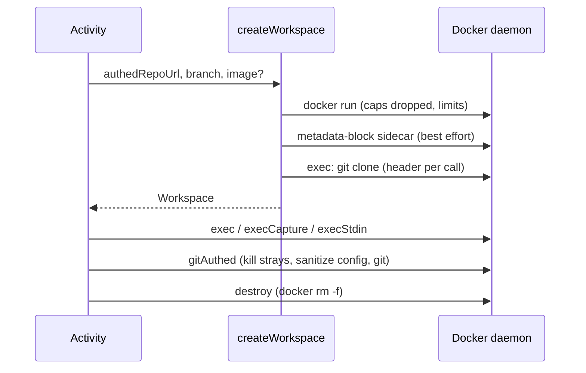

# Docker Workspaces and Container Steps

> Indexed at commit `d0a90fb5` on 2026-10-06 · [view on GitHub](https://github.com/yorch/auto-swe/tree/d0a90fb5)

## Relevant source files

- [packages/worker/src/activities/workspace.ts](https://github.com/yorch/auto-swe/blob/d0a90fb5/packages/worker/src/activities/workspace.ts)
- [packages/worker/src/lib/ephemeralContainer.ts](https://github.com/yorch/auto-swe/blob/d0a90fb5/packages/worker/src/lib/ephemeralContainer.ts)
- [packages/worker/src/lib/execUtils.ts](https://github.com/yorch/auto-swe/blob/d0a90fb5/packages/worker/src/lib/execUtils.ts)
- [packages/shared/src/lib/systemConfig.ts](https://github.com/yorch/auto-swe/blob/d0a90fb5/packages/shared/src/lib/systemConfig.ts)

## Overview

The worker isolates agent-driven code in Docker containers created through the host Docker socket. Two runtimes exist. The long-lived agent workspace (`createWorkspace`) holds a cloned repository for the duration of a run and keeps default bridge networking so the agent can clone, push and install packages. The ephemeral runner (`runEphemeralContainer`, `runSidecarContainer`) executes team-authored shell and container steps in a locked-down, throwaway container.

Both share the exec helpers in `execUtils.ts`, which pump Temporal heartbeats and report timeouts uniformly. Deploy-time sizing for the agent workspace comes from environment variables read by `resolveWorkspaceInfra`, not from the database.

## Implementation

### Workspace lifecycle

`createWorkspace` resolves infra config, picks `image ?? infra.image`, and validates the result against `DOCKER_IMAGE_REF_RE` ([workspace.ts:L568-L574](https://github.com/yorch/auto-swe/blob/d0a90fb5/packages/worker/src/activities/workspace.ts#L568-L574)). The comment on the `image` parameter explains why callers must pass `repo.executorImage ?? undefined`: a literal fallback wins the `??` and the operator's configured image is never read ([workspace.ts:L533-L547](https://github.com/yorch/auto-swe/blob/d0a90fb5/packages/worker/src/activities/workspace.ts#L533-L547)).

The container is named `workspace-<hex>` before it exists, and everything from `docker run` onward sits inside one `try`. Any failure runs `docker rm -f` by that name, then scrubs the credential from the error with `redactExecError` and rethrows ([workspace.ts:L591-L745](https://github.com/yorch/auto-swe/blob/d0a90fb5/packages/worker/src/activities/workspace.ts#L591-L745)). The run command applies `--init`, pinned DNS (`1.1.1.1`, `8.8.8.8`), `--memory`, `--cpus`, `--pids-limit`, `--cap-drop=ALL`, `no-new-privileges`, and `--add-host` entries that blackhole the GCP metadata hostnames, then starts `sleep infinity` ([workspace.ts:L641-L647](https://github.com/yorch/auto-swe/blob/d0a90fb5/packages/worker/src/activities/workspace.ts#L641-L647)).

Three clone modes exist: a pinned `checkoutSha` (full clone, branch cut from the commit), `existingBranch` (depth-50 clone of the candidate branch), and the default (depth-50 clone of `defaultBranch`, then a new branch) ([workspace.ts:L710-L723](https://github.com/yorch/auto-swe/blob/d0a90fb5/packages/worker/src/activities/workspace.ts#L710-L723)). Clones have a 10-minute ceiling.

The returned `Workspace` exposes `exec`, `execCapture`, `execStdin`, `gitAuthed` and `destroy` ([workspace.ts:L15-L47](https://github.com/yorch/auto-swe/blob/d0a90fb5/packages/worker/src/activities/workspace.ts#L15-L47)). `exec` throws on non-zero exit, `execCapture` returns `{stdout, stderr, exitCode}`, and `execStdin` streams content through `docker exec -i` so file contents avoid the kernel argv limit ([workspace.ts:L756-L807](https://github.com/yorch/auto-swe/blob/d0a90fb5/packages/worker/src/activities/workspace.ts#L756-L807)). `destroy` runs `docker rm -f` and tolerates an already-removed container.

Sources: [packages/worker/src/activities/workspace.ts:L529-L832](https://github.com/yorch/auto-swe/blob/d0a90fb5/packages/worker/src/activities/workspace.ts#L529-L832)

### Metadata egress block

The workspace drops all capabilities, so it cannot install routes itself. `buildMetadataBlockArgs` builds a throwaway `docker run --rm --network container:<name> --cap-add=NET_ADMIN` sidecar that installs blackhole routes for `169.254.169.254`, `169.254.170.2` and `fd00:ec2::254`, and exits non-zero if no blackhole route landed ([workspace.ts:L418-L434](https://github.com/yorch/auto-swe/blob/d0a90fb5/packages/worker/src/activities/workspace.ts#L418-L434)). The call is best-effort: failure logs a warning and the workspace continues ([workspace.ts:L660-L673](https://github.com/yorch/auto-swe/blob/d0a90fb5/packages/worker/src/activities/workspace.ts#L660-L673)).

Sources: [packages/worker/src/activities/workspace.ts:L418-L434](https://github.com/yorch/auto-swe/blob/d0a90fb5/packages/worker/src/activities/workspace.ts#L418-L434)

### Quoting and credential handling

`shellQuote` wraps a string in single quotes and escapes embedded quotes ([workspace.ts:L49-L51](https://github.com/yorch/auto-swe/blob/d0a90fb5/packages/worker/src/activities/workspace.ts#L49-L51)); every `docker exec ... sh -c` argument passes through it. `splitCloneCredential` splits a credential-bearing URL into a clean URL and an `AUTHORIZATION: basic` header, stripping the password before any decoding that could throw ([workspace.ts:L86-L119](https://github.com/yorch/auto-swe/blob/d0a90fb5/packages/worker/src/activities/workspace.ts#L86-L119)). The clone uses the clean URL, and `origin` is pinned to it afterwards.

`gitWithAuthHeader` prefixes git with hardened `-c` overrides (no hooks, no askpass or credential helper, no `ext::` transport, no submodule recursion) and an environment that ignores system and global config ([workspace.ts:L143-L177](https://github.com/yorch/auto-swe/blob/d0a90fb5/packages/worker/src/activities/workspace.ts#L143-L177)). Because the agent can write `.git/config`, `sanitizeGitRepoConfigScript` rewrites it from an allow-list before each authenticated call, refuses a non-directory `.git`, and pins `GIT_DIR`, `GIT_WORK_TREE` and `GIT_CEILING_DIRECTORIES` ([workspace.ts:L216-L254](https://github.com/yorch/auto-swe/blob/d0a90fb5/packages/worker/src/activities/workspace.ts#L216-L254)). `authedGitScript` also redirects `push origin` to the clean URL with `--no-verify` ([workspace.ts:L333-L348](https://github.com/yorch/auto-swe/blob/d0a90fb5/packages/worker/src/activities/workspace.ts#L333-L348)).

`gitAuthed` first runs `killStrayProcessesScript`, which SIGSTOPs then SIGKILLs every process except PID 1, the container keeper and itself, so no leftover agent process can read the credential from `/proc/<pid>/cmdline` ([workspace.ts:L291-L318](https://github.com/yorch/auto-swe/blob/d0a90fb5/packages/worker/src/activities/workspace.ts#L291-L318), [workspace.ts:L808-L830](https://github.com/yorch/auto-swe/blob/d0a90fb5/packages/worker/src/activities/workspace.ts#L808-L830)).

`cloneDependencyRepos` clones up to `MAX_DEPENDENCY_CHECKOUTS` (4) read-only repositories into `/workspace/deps/<name>`, using `safeDepDirName` for the directory and scrubbing each `origin`. A failed clone is removed and does not fail the run ([workspace.ts:L437-L517](https://github.com/yorch/auto-swe/blob/d0a90fb5/packages/worker/src/activities/workspace.ts#L437-L517)).

Sources: [packages/worker/src/activities/workspace.ts:L49-L348](https://github.com/yorch/auto-swe/blob/d0a90fb5/packages/worker/src/activities/workspace.ts#L49-L348)

### Exec helpers and timeout cleanup

`execShellAsync` wraps `child_process.exec` with a 10 MiB buffer and a 2-minute default timeout, and pumps a Temporal heartbeat every 30 seconds ([execUtils.ts:L18-L22](https://github.com/yorch/auto-swe/blob/d0a90fb5/packages/worker/src/lib/execUtils.ts#L18-L22), [execUtils.ts:L81-L128](https://github.com/yorch/auto-swe/blob/d0a90fb5/packages/worker/src/lib/execUtils.ts#L81-L128)). `spawnCaptureAsync` never throws on non-zero exit: a timeout yields exit code 124 with `SIGTERM`, and a spawn failure yields 127 with `SPAWN_ERROR`. It can also stream stdout line by line through `onStdoutLine` ([execUtils.ts:L157-L258](https://github.com/yorch/auto-swe/blob/d0a90fb5/packages/worker/src/lib/execUtils.ts#L157-L258)). `spawnWithStdinAsync` is the stdin-streaming variant ([execUtils.ts:L278](https://github.com/yorch/auto-swe/blob/d0a90fb5/packages/worker/src/lib/execUtils.ts#L278)).

Killing the local `docker exec` client does not stop the in-container process. Each workspace command therefore carries `AUTO_SWE_EXEC_ID=<hex>` in its environment, and on timeout `onTimeout` runs `killTaggedProcessesScript`, which SIGSTOPs then SIGKILLs every process whose `/proc/<pid>/environ` carries the tag ([workspace.ts:L356-L379](https://github.com/yorch/auto-swe/blob/d0a90fb5/packages/worker/src/activities/workspace.ts#L356-L379), [workspace.ts:L598-L609](https://github.com/yorch/auto-swe/blob/d0a90fb5/packages/worker/src/activities/workspace.ts#L598-L609)). Cancellation helpers `throwIfActivityCancelled` and `raceActivityCancellation` also live in this file ([execUtils.ts:L44-L73](https://github.com/yorch/auto-swe/blob/d0a90fb5/packages/worker/src/lib/execUtils.ts#L44-L73)).

Sources: [packages/worker/src/lib/execUtils.ts:L1-L270](https://github.com/yorch/auto-swe/blob/d0a90fb5/packages/worker/src/lib/execUtils.ts#L1-L270)

### Ephemeral containers

`lockdownFlags` validates image, mount source, memory literal and CPU count (at most 8), then emits the flag block shared by every ephemeral container: `--network=none` by default (`bridge` for `'egress'`), `--pids-limit=256`, `--read-only`, a 64 MiB `/tmp` tmpfs, `no-new-privileges`, `--cap-drop=ALL`, validated `-e` pairs, and the `/workspace:rw` mount ([ephemeralContainer.ts:L122-L183](https://github.com/yorch/auto-swe/blob/d0a90fb5/packages/worker/src/lib/ephemeralContainer.ts#L122-L183)). Host-path mounts are rejected under system roots, `/var/lib/docker` and `/var/run` by `isAllowedHostMountPath` ([ephemeralContainer.ts:L79-L113](https://github.com/yorch/auto-swe/blob/d0a90fb5/packages/worker/src/lib/ephemeralContainer.ts#L79-L113)).

`runEphemeralContainer` names the container `shellstep-<hex>`, runs `docker run --rm` through `spawnCaptureAsync` (default 600 s), and force-removes it in `finally` ([ephemeralContainer.ts:L277-L300](https://github.com/yorch/auto-swe/blob/d0a90fb5/packages/worker/src/lib/ephemeralContainer.ts#L277-L300)). With an egress allowlist, DNS is pointed at `127.0.0.2` and each non-wildcard hostname is resolved and injected as `--add-host`; the source states this does not block direct-IP connections ([ephemeralContainer.ts:L249-L268](https://github.com/yorch/auto-swe/blob/d0a90fb5/packages/worker/src/lib/ephemeralContainer.ts#L249-L268)).

`runSidecarContainer` runs an image detached under the same lockdown with its port published only on `127.0.0.1`, resolves the published port, polls the readiness path, POSTs the JSON body, parses the JSON reply, and always removes the container ([ephemeralContainer.ts:L214-L240](https://github.com/yorch/auto-swe/blob/d0a90fb5/packages/worker/src/lib/ephemeralContainer.ts#L214-L240), [ephemeralContainer.ts:L339-L391](https://github.com/yorch/auto-swe/blob/d0a90fb5/packages/worker/src/lib/ephemeralContainer.ts#L339-L391)).

Sources: [packages/worker/src/lib/ephemeralContainer.ts:L1-L425](https://github.com/yorch/auto-swe/blob/d0a90fb5/packages/worker/src/lib/ephemeralContainer.ts#L1-L425)

## Diagram

```mermaid
sequenceDiagram
    participant A as Activity
    participant W as createWorkspace
    participant D as Docker daemon
    A->>W: authedRepoUrl, branch, image?
    W->>D: docker run (caps dropped, limits)
    W->>D: metadata-block sidecar (best effort)
    W->>D: exec: git clone (header per call)
    W-->>A: Workspace
    A->>D: exec / execCapture / execStdin
    A->>D: gitAuthed (kill strays, sanitize config, git)
    A->>D: destroy (docker rm -f)
```

## Configuration

`resolveWorkspaceInfra` reads environment variables only. Invalid values fall back to defaults with a one-time error log, because the function is read on paths that must not throw ([systemConfig.ts:L775-L823](https://github.com/yorch/auto-swe/blob/d0a90fb5/packages/shared/src/lib/systemConfig.ts#L775-L823)). `assertWorkspaceInfraEnv` is the strict check at worker boot and lists every bad value at once ([systemConfig.ts:L832-L876](https://github.com/yorch/auto-swe/blob/d0a90fb5/packages/shared/src/lib/systemConfig.ts#L832-L876)).

| Variable | Default | Purpose |
| -------- | ------- | ------- |
| `WORKSPACE_IMAGE` | `node:24-alpine` | Base image when the caller passes none |
| `WORKSPACE_MEMORY` | `4g` | `--memory` cap |
| `WORKSPACE_CPUS` | `2` | `--cpus` cap |
| `WORKSPACE_PIDS_LIMIT` | `512` | `--pids-limit` |
| `WORKSPACE_BLOCK_METADATA` | on | Only the literal `false` disables the block |
| `WORKSPACE_METADATA_BLOCK_IMAGE` | `alpine:3.20` | Sidecar image |
| `WORKER_MAX_CONCURRENT_ACTIVITIES` | `10` | Activity concurrency, clamped 1 to 1000 |
| `SCANNER_REGEX_BUDGET_MS` | `250` | Scanner pattern budget, clamped 10 to 60000 |

Sources: [packages/shared/src/lib/systemConfig.ts:L728-L876](https://github.com/yorch/auto-swe/blob/d0a90fb5/packages/shared/src/lib/systemConfig.ts#L728-L876)

## Related Pages

- Parent: [Temporal Worker](./4-temporal-worker.md)
- Sibling: [Activities](./4.2-activities.md)
- Sibling: [Agent Layer](./4.3-agent-layer.md)
- Sibling: [Agent Runs and Implementer Runtimes](./4.6-agent-runs-and-implementer-runtimes.md)
