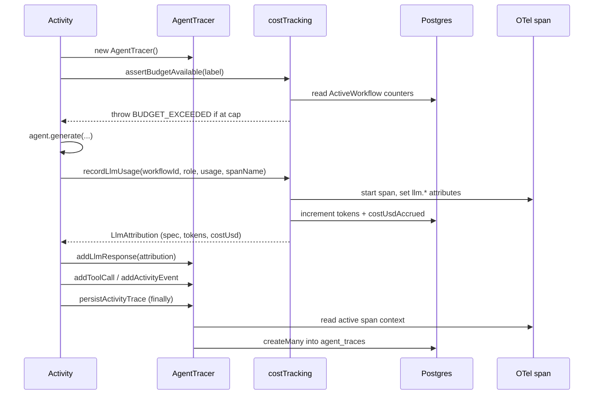

# Tracing, Cost Tracking, and Budgets

> Indexed at commit `b1d8930` on 2026-09-08 · [view on GitHub](https://github.com/yorch/auto-swe/tree/b1d8930)

## Relevant source files

- [packages/worker/src/lib/agentTracer.ts](https://github.com/yorch/auto-swe/blob/b1d8930/packages/worker/src/lib/agentTracer.ts)
- [packages/worker/src/lib/activityContext.ts](https://github.com/yorch/auto-swe/blob/b1d8930/packages/worker/src/lib/activityContext.ts)
- [packages/worker/src/lib/costTracking.ts](https://github.com/yorch/auto-swe/blob/b1d8930/packages/worker/src/lib/costTracking.ts)
- [packages/worker/src/lib/telemetry.ts](https://github.com/yorch/auto-swe/blob/b1d8930/packages/worker/src/lib/telemetry.ts)
- [packages/worker/src/lib/activityLog.ts](https://github.com/yorch/auto-swe/blob/b1d8930/packages/worker/src/lib/activityLog.ts)
- [packages/worker/src/lib/config/stepRequiredAgents.ts](https://github.com/yorch/auto-swe/blob/b1d8930/packages/worker/src/lib/config/stepRequiredAgents.ts)
- [packages/worker/src/lib/config/deploymentAgents.ts](https://github.com/yorch/auto-swe/blob/b1d8930/packages/worker/src/lib/config/deploymentAgents.ts)
- [packages/shared/src/lib/telemetry.ts](https://github.com/yorch/auto-swe/blob/b1d8930/packages/shared/src/lib/telemetry.ts)
- [packages/worker/src/index.ts](https://github.com/yorch/auto-swe/blob/b1d8930/packages/worker/src/index.ts)
- [packages/worker/src/activities/runAgent.ts](https://github.com/yorch/auto-swe/blob/b1d8930/packages/worker/src/activities/runAgent.ts)

## Overview

Three concerns share one code path in the worker: what an agent did, what it cost, and whether the run may keep spending. `AgentTracer` collects a per-activity record of tool calls and model calls and writes them to the `agent_traces` table that backs the run viewer. `costTracking.ts` prices each model call, debits a per-run token and dollar ledger, and refuses further calls once a tier cap is breached. `telemetry.ts` boots the OpenTelemetry SDK so the same events also leave the process as spans and metrics. The three meet in `persistActivityTrace`, which stamps every trace row with the active span's trace and span identifiers so a database row and a Grafana span describe the same moment.

## Implementation

### The tracer pattern

Every activity that calls a model constructs an `AgentTracer`, appends entries as it works, and persists them once. The class holds an ordered in-memory array and a monotonic `seq` counter, plus optional OpenTelemetry identifiers set by `setSpanContext` ([agentTracer.ts#L110-L120](https://github.com/yorch/auto-swe/blob/b1d8930/packages/worker/src/lib/agentTracer.ts#L110-L120)).

A record carries a sequence number, one of three types, an optional name, request and response JSON, a duration, and an optional error string; `model`, `inputTokens`, `outputTokens`, and `costUsd` are populated only on model calls ([agentTracer.ts:L82-L99](https://github.com/yorch/auto-swe/blob/b1d8930/packages/worker/src/lib/agentTracer.ts#L82-L99)). The `toolName` column is overloaded by type: a tool name for a tool call, an agent key for a model call, an event name for an activity event.

| Entry | Added by | Records |
| ----- | -------- | ------- |
| `tool_call` | `addToolCall` | Workspace tool invocations such as `bash`, `readFile`, `writeFile` |
| `llm_response` | `addLlmResponse` | One model round trip, with system prompt, user message, output, tokens, and cost |
| `activity_event` | `addActivityEvent` | Non-model work such as git operations, test runs, and pull-request creation |

Both request and response payloads pass through `sanitizeJsonValues` before they are stored. Redaction rewrites credentials embedded in URLs, `Authorization` headers, and values that follow key-looking names, then blanks any property whose lowercased key is in `SENSITIVE_KEYS` ([agentTracer.ts:L8-L56](https://github.com/yorch/auto-swe/blob/b1d8930/packages/worker/src/lib/agentTracer.ts#L8-L56)). Truncation then caps each string at 32,000 characters with an explicit elision marker, a limit raised from 4 KB because a single bash output or file read routinely exceeded it and was destroyed silently ([agentTracer.ts#L3-L6](https://github.com/yorch/auto-swe/blob/b1d8930/packages/worker/src/lib/agentTracer.ts#L3-L6)).

`persist` writes the whole batch in one `createMany` and returns early when there are no records or no run identifier. Its `try`/`catch` swallows every database error, because tracing is bookkeeping and must never fail a run that has already paid a provider ([agentTracer.ts:L190-L224](https://github.com/yorch/auto-swe/blob/b1d8930/packages/worker/src/lib/agentTracer.ts#L190-L224)). Rows land in `agent_traces` with `run_id`, `node_id`, `agent_key`, `attempt`, and the two OpenTelemetry columns ([schema.prisma:L1278-L1313](https://github.com/yorch/auto-swe/blob/b1d8930/packages/shared/src/prisma/schema.prisma#L1278-L1313)).

Sources: [packages/worker/src/lib/agentTracer.ts:L1-L225](https://github.com/yorch/auto-swe/blob/b1d8930/packages/worker/src/lib/agentTracer.ts#L1-L225) [packages/shared/src/prisma/schema.prisma:L1278-L1313](https://github.com/yorch/auto-swe/blob/b1d8930/packages/shared/src/prisma/schema.prisma#L1278-L1313)

### Resolving run, node, and attempt from Temporal

Activities never pass their own identity to the tracer. `activityContext.ts` reads it from the ambient Temporal activity context instead. `currentActivityType()` returns the activity function name and becomes the trace's `nodeId`; `currentAttempt()` returns the one-based retry attempt so the viewer can separate retries; `currentWorkflowId()` reads `Info.workflowExecution` and throws when it is absent, because every activity here is workflow-driven and a missing execution is a programmer error rather than a case to paper over ([activityContext.ts:L11-L40](https://github.com/yorch/auto-swe/blob/b1d8930/packages/worker/src/lib/activityContext.ts#L11-L40)).

The run identifier is a database lookup, not a context field: `currentWorkflowRunId()` maps the Temporal workflow identifier to a `WorkflowRun` row and returns `undefined` when the row does not exist yet or the query fails, because persistence is best-effort ([activityContext.ts:L48-L59](https://github.com/yorch/auto-swe/blob/b1d8930/packages/worker/src/lib/activityContext.ts#L48-L59)). `persistActivityTrace` composes all four: it captures the active span context, attaches it to the tracer, and calls `persist` with the resolved run, activity type, agent key, and attempt ([activityContext.ts:L67-L78](https://github.com/yorch/auto-swe/blob/b1d8930/packages/worker/src/lib/activityContext.ts#L67-L78)).

### Why persistence belongs in `finally`

The call must sit in a `finally` block, and the reason is concrete. Records accumulate only in process memory until `persist` runs, so a `persist` reachable solely on the success path is skipped entirely when the model call throws. The failed prompt, the tool calls that led to it, and the error string all vanish, and the run viewer shows an activity that produced nothing at exactly the moment an operator needs the transcript. Temporal then retries the activity with a fresh tracer, so nothing later recovers the lost attempt.

`runAgent` shows the canonical shape: the `catch` records a failed `llm_response` carrying the error message and re-raises, while the outer `finally` persists the batch regardless of outcome ([runAgent.ts:L113-L128](https://github.com/yorch/auto-swe/blob/b1d8930/packages/worker/src/activities/runAgent.ts#L113-L128)). Activities holding a workspace order the teardown deliberately: `executeImplementation` closes any MCP connection, persists, then continues its cleanup ([executeImplementation.ts:L441-L444](https://github.com/yorch/auto-swe/blob/b1d8930/packages/worker/src/activities/executeImplementation.ts#L441-L444)), and `implementerSession` starts the persist, destroys the container, then awaits the write so container teardown and the database round trip overlap ([implementerSession.ts:L283-L288](https://github.com/yorch/auto-swe/blob/b1d8930/packages/worker/src/activities/implementerSession.ts#L283-L288)).

Sources: [packages/worker/src/lib/activityContext.ts:L1-L78](https://github.com/yorch/auto-swe/blob/b1d8930/packages/worker/src/lib/activityContext.ts#L1-L78) [packages/worker/src/activities/runAgent.ts:L52-L129](https://github.com/yorch/auto-swe/blob/b1d8930/packages/worker/src/activities/runAgent.ts#L52-L129)

### Pricing a call

`MODEL_PRICES` maps a `<provider>/<model-id>` spec to input and output rates in US dollars per million tokens, verified against the three built-in providers' published pricing ([costTracking.ts:L21-L70](https://github.com/yorch/auto-swe/blob/b1d8930/packages/worker/src/lib/costTracking.ts#L21-L70)). The table states base rates only. Prompt-caching multipliers, the batch discount, data-residency and fast-mode premiums, and the Gemini 2.5 Pro long-context surcharge are all outside it, and a deployment affected by one is expected to set an override.

`getModelPrice` checks the environment first, then the static table, and otherwise returns a zero rate with `known: false` ([costTracking.ts:L109-L119](https://github.com/yorch/auto-swe/blob/b1d8930/packages/worker/src/lib/costTracking.ts#L109-L119)). An override is read from `MODEL_PRICE_<SPEC>`, where the spec is uppercased and every non-alphanumeric character becomes an underscore, so `anthropic/claude-opus-4-8` becomes `MODEL_PRICE_ANTHROPIC_CLAUDE_OPUS_4_8`. Its value is `<input>:<output>`. `parsePriceOverride` rejects anything that is not two finite non-negative numbers, explicitly so a negative rate cannot invert cost accumulation and walk a run back under its cap ([costTracking.ts:L74-L107](https://github.com/yorch/auto-swe/blob/b1d8930/packages/worker/src/lib/costTracking.ts#L74-L107)).

Pricing keys on the resolved spec alone. `recordLlmUsage` resolves the spec from the agent key, but the agent identity is used only for attribution and model lookup, never as part of the price ([costTracking.ts:L178-L184](https://github.com/yorch/auto-swe/blob/b1d8930/packages/worker/src/lib/costTracking.ts#L178-L184)). When the spec cannot be resolved at all, the code substitutes `unknown/unknown` and continues, because failing here would let a malformed configuration burn unlimited tokens: each retry would re-spend at the provider while the counter stayed still and the cap never fired ([costTracking.ts:L340-L355](https://github.com/yorch/auto-swe/blob/b1d8930/packages/worker/src/lib/costTracking.ts#L340-L355)). An unpriced model logs a warning and sets `llm.cost_pricing_known=false` on the span; usage is still recorded, so no run is lost to a missing table entry.

Sources: [packages/worker/src/lib/costTracking.ts:L14-L164](https://github.com/yorch/auto-swe/blob/b1d8930/packages/worker/src/lib/costTracking.ts#L14-L164)

### The ledger and the two budget checks

Accounting lives on the `ActiveWorkflow` row keyed by `temporalWorkflowId`, which holds `budgetTier`, two BigInt token counters, and a float dollar total ([schema.prisma:L100-L124](https://github.com/yorch/auto-swe/blob/b1d8930/packages/shared/src/prisma/schema.prisma#L100-L124)). `recordLlmUsage` updates it with Postgres-side `increment` operations rather than read-modify-write. Concurrency is the reason: the review network runs three reviewers under one settled promise and fan-out branches run in parallel, possibly on different workers, so interleaved read/write pairs dropped increments precisely when spend was highest ([costTracking.ts:L379-L399](https://github.com/yorch/auto-swe/blob/b1d8930/packages/worker/src/lib/costTracking.ts#L379-L399)). The dollar delta is rounded to micro-dollars before accumulating so each increment is exactly representable in the float column. A missing ledger row surfaces as Prisma error `P2025`, which is treated as non-fatal: the span gets `llm.workflow_found=false` and the call's own attribution is returned, since channel tasks and product-requirement runs keep no ledger ([costTracking.ts:L421-L429](https://github.com/yorch/auto-swe/blob/b1d8930/packages/worker/src/lib/costTracking.ts#L421-L429)).

Enforcement happens twice around each call, and `resolveTierLimits` is the single definition both use. It defaults a null tier to `STANDARD`, reads the database-backed tier table, falls back to `BUDGET_LIMITS`, and throws on a tier it cannot find. The two sites previously derived limits separately and had already drifted: the pre-call gate returned silently on an unknown tier while the post-call check threw, so a misconfigured tier quietly disabled the gate everywhere ([costTracking.ts:L212-L232](https://github.com/yorch/auto-swe/blob/b1d8930/packages/worker/src/lib/costTracking.ts#L212-L232)).

`assertBudgetAvailable(label)` runs before `generate()`. It reads the workflow identifier from activity context rather than accepting it as a parameter, after a call site once passed a literal string that matched no row and turned its gate into a permanent no-op. It throws a non-retryable `BUDGET_EXCEEDED` failure when either counter is already at or above its cap ([costTracking.ts:L234-L269](https://github.com/yorch/auto-swe/blob/b1d8930/packages/worker/src/lib/costTracking.ts#L234-L269)). The comparison is `>=` here and `>` after the call, deliberately: a call landing exactly on the cap is allowed, the next one is not.

`recordLlmUsage` runs after. It writes the increment first and checks the limits second, so the dashboard shows the real overage rather than the last value under the cap, then throws the same non-retryable `BUDGET_EXCEEDED` ([costTracking.ts:L448-L466](https://github.com/yorch/auto-swe/blob/b1d8930/packages/worker/src/lib/costTracking.ts#L448-L466)). Non-retryable is what makes the failure terminal: Temporal does not retry the activity, and the workflow fails instead of re-spending. The post-call check alone cannot prevent overshoot, because a call's cost is unknown until it returns; the pre-call gate turns one overshooting call per concurrent branch into one overshooting call total. It is a gate, not a reservation, and a workflow sitting just under its cap is still allowed one more call of unknown size ([costTracking.ts:L193-L211](https://github.com/yorch/auto-swe/blob/b1d8930/packages/worker/src/lib/costTracking.ts#L193-L211)).

Tier limits come from the `WorkflowDefaults` singleton, one nullable column pair per tier with the built-in constants as the fallback ([systemConfig.ts:L395-L408](https://github.com/yorch/auto-swe/blob/b1d8930/packages/shared/src/lib/systemConfig.ts#L395-L408)). Because `recordLlmUsage` is a hot path, `resolveBudgetTiers` memoizes the resolved table behind the shared configuration cache, so a dashboard edit takes effect on the next call after the time-to-live elapses ([costTracking.ts:L133-L150](https://github.com/yorch/auto-swe/blob/b1d8930/packages/worker/src/lib/costTracking.ts#L133-L150)).

One advisory check rides along. `flagUnregisteredAgentUsage` compares the executing activity against `STEP_REQUIRED_AGENTS` and flags a step that spent tokens on an agent the boot gate never validated, since a missing entry means a deployment boots clean and dies mid-run on a missing model or credential. It only judges activities the gate actually walked, sets `llm.step_agent_unregistered` on the span unconditionally, and logs once per step-and-agent pair per process ([costTracking.ts:L271-L332](https://github.com/yorch/auto-swe/blob/b1d8930/packages/worker/src/lib/costTracking.ts#L271-L332), [stepRequiredAgents.ts:L49-L63](https://github.com/yorch/auto-swe/blob/b1d8930/packages/worker/src/lib/config/stepRequiredAgents.ts#L49-L63)).

Sources: [packages/worker/src/lib/costTracking.ts:L166-L479](https://github.com/yorch/auto-swe/blob/b1d8930/packages/worker/src/lib/costTracking.ts#L166-L479) [packages/shared/src/prisma/schema.prisma:L100-L124](https://github.com/yorch/auto-swe/blob/b1d8930/packages/shared/src/prisma/schema.prisma#L100-L124)

### Cost and budget knobs

| Name | Type | Default | Purpose |
| ---- | ---- | ------- | ------- |
| `budgetTiers.STANDARD` | tokens | 2,000,000 input / 500,000 output | Default per-run cap; `WorkflowDefaults` columns override `BUDGET_LIMITS` |
| `budgetTiers.LARGE` | tokens | 8,000,000 input / 2,000,000 output | Mid tier |
| `budgetTiers.EPIC` | tokens | 20,000,000 input / 5,000,000 output | Highest tier |
| `ActiveWorkflow.budgetTier` | `string` | `STANDARD` | Which tier a run is charged against; null resolves to `STANDARD` |
| `MODEL_PRICE_<PROVIDER>_<MODEL>` | env `input:output` | unset | Per-model rate override in dollars per million tokens; negative or malformed values are ignored |
| Unknown model rate | `ModelPrice` | `{ input: 0, output: 0 }` | Zero cost plus `llm.cost_pricing_known=false` on the span |
| `CONFIG_CACHE_TTL_MS` | ms | 30,000 | Time-to-live for the memoized tier table and other config resolvers |
| `MAX_JSON_CHARS` | chars | 32,000 | Per-string truncation limit on persisted trace payloads |
| `OTEL_EXPORTER_OTLP_ENDPOINT` | URL | unset | Enables telemetry; unset disables the SDK and the Temporal metrics runtime |
| `OTEL_METRIC_EXPORT_INTERVAL` | ms | 60,000 | Metric export period; non-positive or unparseable values fall back to the default |

Sources: [packages/worker/src/lib/costTracking.ts:L121-L150](https://github.com/yorch/auto-swe/blob/b1d8930/packages/worker/src/lib/costTracking.ts#L121-L150) [packages/shared/src/config/cache.ts:L104-L113](https://github.com/yorch/auto-swe/blob/b1d8930/packages/shared/src/config/cache.ts#L104-L113) [packages/shared/src/lib/systemConfig.ts:L742-L749](https://github.com/yorch/auto-swe/blob/b1d8930/packages/shared/src/lib/systemConfig.ts#L742-L749)

### OpenTelemetry wiring

The worker's entry point initializes telemetry on its first line, before any other import, because auto-instrumentation must patch modules as they load ([index.ts:L1-L4](https://github.com/yorch/auto-swe/blob/b1d8930/packages/worker/src/index.ts#L1-L4)). The worker-local `initTelemetry` supplies HTTP instrumentation, an OTLP gRPC trace exporter, and a periodic metric reader over an OTLP gRPC metric exporter, each conditional on the endpoint being set ([telemetry.ts:L11-L24](https://github.com/yorch/auto-swe/blob/b1d8930/packages/worker/src/lib/telemetry.ts#L11-L24)). Its inline comment says the export interval defaults to 30 seconds; the resolver it calls returns 60,000 milliseconds ([systemConfig.ts#L746-L749](https://github.com/yorch/auto-swe/blob/b1d8930/packages/shared/src/lib/systemConfig.ts#L746-L749)).

The shared helper builds the resource from a service name and package version and starts a `NodeSDK`. With no endpoint configured it logs once and returns a no-op shutdown, so a development machine needs no telemetry infrastructure ([shared/telemetry.ts:L22-L47](https://github.com/yorch/auto-swe/blob/b1d8930/packages/shared/src/lib/telemetry.ts#L22-L47)). Separately, when the endpoint is present the worker installs the Temporal runtime with its own OTel metrics pointed at the same collector, which is what surfaces task-queue and activity metrics ([index.ts:L23-L33](https://github.com/yorch/auto-swe/blob/b1d8930/packages/worker/src/index.ts#L23-L33)). Locally the collector is the Grafana LGTM container in the application compose overlay.

Manual spans come from a tracer named `auto-swe-worker`, obtained in `costTracking.ts`, `runAgent.ts`, and each agent module. `recordLlmUsage` opens a span named by its caller, such as `llm.implementer.iteration_1`, and sets the attributes below before ending it in a `finally` ([costTracking.ts:L435-L458](https://github.com/yorch/auto-swe/blob/b1d8930/packages/worker/src/lib/costTracking.ts#L435-L458)).

| Attribute | Set when |
| --------- | -------- |
| `llm.model`, `llm.role`, `llm.input_tokens`, `llm.output_tokens`, `llm.cost_usd` | Every priced call |
| `llm.cost_pricing_known` | Every priced call; `false` marks a model absent from the price table |
| `llm.spec_resolution_failed` | The agent's model spec could not be resolved |
| `llm.workflow_found` | Set to `false` when no `ActiveWorkflow` ledger row exists |
| `llm.step_agent_unregistered` | A gated step spent on an agent missing from `STEP_REQUIRED_AGENTS` |
| `workflow.budget_tier`, `workflow.cost_usd_cumulative`, `workflow.tokens_input_cumulative`, `workflow.tokens_output_cumulative` | After the ledger increment |
| `workflow.budget_remaining_input_tokens`, `workflow.budget_remaining_output_tokens` | After tier limits resolve |
| `agent.key` | `runAgent` spans, alongside `llm.model` |

Structured logging is thin by comparison: `activityLog.ts` exposes a single `logError` that forwards to the Temporal activity logger only when an activity context is present, so the same helper is inert when called outside one ([activityLog.ts:L1-L7](https://github.com/yorch/auto-swe/blob/b1d8930/packages/worker/src/lib/activityLog.ts#L1-L7)).

Sources: [packages/worker/src/lib/telemetry.ts:L1-L25](https://github.com/yorch/auto-swe/blob/b1d8930/packages/worker/src/lib/telemetry.ts#L1-L25) [packages/shared/src/lib/telemetry.ts:L1-L48](https://github.com/yorch/auto-swe/blob/b1d8930/packages/shared/src/lib/telemetry.ts#L1-L48) [packages/worker/src/index.ts:L1-L33](https://github.com/yorch/auto-swe/blob/b1d8930/packages/worker/src/index.ts#L1-L33)

## Diagram

## Usage

Roughly twenty activities follow the pattern, including `executeImplementation`, `runReviewNetwork`, `commitToMemory`, `channelAssistant`, `evalHarness`, and the generic `runAgent` node. The agent key passed to `persistActivityTrace` is the attribution label on every row in the batch, and it need not be a model-backed agent: `createOrUpdatePullRequest` persists under `pr` and `mcpCallTool` under `mcp`, so tool-only activities still produce a viewable transcript.

Callers should read cost from the `LlmAttribution` that `recordLlmUsage` returns rather than re-pricing the provider's usage object, which keeps the value shown per call identical to the amount debited to the run ledger ([runAgent.ts:L22-L32](https://github.com/yorch/auto-swe/blob/b1d8930/packages/worker/src/activities/runAgent.ts#L22-L32)).

The per-run tier cap is not the only budget in the system. Channel assistant turns check a monthly per-channel dollar budget and answer with a friendly refusal instead of failing ([channelAssistant.ts:L812-L817](https://github.com/yorch/auto-swe/blob/b1d8930/packages/worker/src/activities/channelAssistant.ts#L812-L817)), and the gateway rejects submissions with `ORG_BUDGET_EXCEEDED` and HTTP 402 when an organization has spent its monthly cap ([orgAccess.ts:L66-L91](https://github.com/yorch/auto-swe/blob/b1d8930/packages/gateway/src/lib/orgAccess.ts#L66-L91)).

Sources: [packages/worker/src/activities/runAgent.ts:L1-L129](https://github.com/yorch/auto-swe/blob/b1d8930/packages/worker/src/activities/runAgent.ts#L1-L129) [packages/gateway/src/lib/orgAccess.ts:L60-L91](https://github.com/yorch/auto-swe/blob/b1d8930/packages/gateway/src/lib/orgAccess.ts#L60-L91)

## Related Pages

- Parent: [Temporal Worker](./4-temporal-worker.md)
- Sibling: [Temporal Workflows](./4.1-temporal-workflows.md)
- Sibling: [Activities](./4.2-activities.md)
- Sibling: [Agent Layer](./4.3-agent-layer.md)
- Sibling: [Docker Workspaces](./4.4-docker-workspaces.md)
