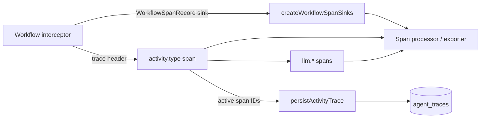

# Observability and Cost

> Indexed at commit `d0a90fb5` on 2026-10-06 · [view on GitHub](https://github.com/yorch/auto-swe/tree/d0a90fb5)

## Relevant source files

- [packages/worker/src/lib/agentTracer.ts](https://github.com/yorch/auto-swe/blob/d0a90fb5/packages/worker/src/lib/agentTracer.ts)
- [packages/worker/src/lib/activityContext.ts](https://github.com/yorch/auto-swe/blob/d0a90fb5/packages/worker/src/lib/activityContext.ts)
- [packages/worker/src/lib/activitySpans.ts](https://github.com/yorch/auto-swe/blob/d0a90fb5/packages/worker/src/lib/activitySpans.ts)
- [packages/worker/src/lib/workflowSpanSink.ts](https://github.com/yorch/auto-swe/blob/d0a90fb5/packages/worker/src/lib/workflowSpanSink.ts)
- [packages/worker/src/lib/costTracking.ts](https://github.com/yorch/auto-swe/blob/d0a90fb5/packages/worker/src/lib/costTracking.ts)
- [packages/worker/src/lib/orgBudgetGuard.ts](https://github.com/yorch/auto-swe/blob/d0a90fb5/packages/worker/src/lib/orgBudgetGuard.ts)
- [packages/worker/src/instrument.ts](https://github.com/yorch/auto-swe/blob/d0a90fb5/packages/worker/src/instrument.ts)
- [packages/worker/src/activities/reapStrandedRuns.ts](https://github.com/yorch/auto-swe/blob/d0a90fb5/packages/worker/src/activities/reapStrandedRuns.ts)
- [packages/shared/src/lib/billing.ts](https://github.com/yorch/auto-swe/blob/d0a90fb5/packages/shared/src/lib/billing.ts)

## Overview

Every LLM-calling activity in the worker records two things: what happened (tool calls, model responses, events, persisted as `AgentTrace` rows and OpenTelemetry spans) and what it cost (tokens and USD, debited against a per-run ledger and an optional organization monthly cap). This page covers both halves and the reaper that finalizes runs whose workflow ended without billing them.

The pieces are small and cooperate through Temporal's activity context. `AgentTracer` buffers records in memory, `persistActivityTrace` stamps them with run, span and spend-owner identity, `recordLlmUsage` prices a call and enforces token budgets, and `assertOrgBudgetAvailable` enforces the monthly cap.

## Tracing: AgentTracer and persistence

`AgentTracer` collects three record types per activity execution: `tool_call`, `llm_response` and `activity_event`. LLM records carry `model`, `inputTokens`, `outputTokens` and `costUsd`, taken from the attribution `recordLlmUsage` returns ([agentTracer.ts:L84-L181](https://github.com/yorch/auto-swe/blob/d0a90fb5/packages/worker/src/lib/agentTracer.ts#L84-L181)). Every payload passes through `sanitizeJsonValues`, which first redacts credential-bearing keys (`token`, `api_key`, `authorization` and similar) and credential patterns in strings (URL userinfo, bearer headers), then truncates strings at 32,000 characters ([agentTracer.ts:L5-L82](https://github.com/yorch/auto-swe/blob/d0a90fb5/packages/worker/src/lib/agentTracer.ts#L5-L82)).

`persist()` writes all records with one `agentTrace.createMany`, adding the node tag columns, attempt, OTel trace and span IDs, and the `teamId`/`orgId` spend owner. It never throws and resolves `false` on a failed write, so tracing cannot break a run. `runId` may be undefined for workflows that keep no `WorkflowRun` row; those rows are keyed by `workflowId` so their spend is still recorded ([agentTracer.ts:L215-L275](https://github.com/yorch/auto-swe/blob/d0a90fb5/packages/worker/src/lib/agentTracer.ts#L215-L275)).

`persistActivityTrace` is the entry point activities call, always from a `finally` block. It attaches the active span context unless the tracer already holds a more specific one, looks up the run id and spend owner in parallel, and reserves a block of `seq` values per attempt (a `WeakMap` keyed by the attempt's `Context`) so that two tracers persisted by one activity do not collide ([activityContext.ts:L81-L138](https://github.com/yorch/auto-swe/blob/d0a90fb5/packages/worker/src/lib/activityContext.ts#L81-L138)). When the run lookup fails, the rows carry no owner: stamping one would bill a run to its org twice, since the run's spend is already counted from its ledger ([activityContext.ts:L118-L122](https://github.com/yorch/auto-swe/blob/d0a90fb5/packages/worker/src/lib/activityContext.ts#L118-L122)). The same file exposes `currentActivityType`, `currentAttempt`, `currentWorkflowId` and `currentTemporalRunId` ([activityContext.ts:L14-L56](https://github.com/yorch/auto-swe/blob/d0a90fb5/packages/worker/src/lib/activityContext.ts#L14-L56)).

Sources: [packages/worker/src/lib/agentTracer.ts:L1-L276](https://github.com/yorch/auto-swe/blob/d0a90fb5/packages/worker/src/lib/agentTracer.ts#L1-L276) [packages/worker/src/lib/activityContext.ts:L1-L138](https://github.com/yorch/auto-swe/blob/d0a90fb5/packages/worker/src/lib/activityContext.ts#L1-L138)

## Spans: activity interceptor and workflow span sink

[src/instrument.ts](https://github.com/yorch/auto-swe/blob/d0a90fb5/packages/worker/src/instrument.ts#L1-L13) is the OpenTelemetry preload, started with `node --import`. It calls `initTelemetry('auto-swe-worker')` before the entry point's import graph loads, so module hooks patch `http` before anything binds it; `index.ts` imports the exported `otel` handle for shutdown.

`activitySpanInterceptor` wraps every activity attempt in an `activity.<type>` span carrying the activity type, attempt, task queue, workflow id and workflow type. Its parent is the run's workflow span, taken from a header the workflow forwards on each scheduled activity; activities scheduled after a signal or update also get a span link to the signal's span ([activitySpans.ts:L47-L65](https://github.com/yorch/auto-swe/blob/d0a90fb5/packages/worker/src/lib/activitySpans.ts#L47-L65)). This gives every `llm.*` span an attempt opens a common trace. Outcomes are classified as `success`, `failure` or `cancelled`; a cancellation (`CancelledFailure` or `AbortError`) is marked `temporal.cancelled` and not recorded as an error, so user cancels do not read as outages. Duration is reported through `recordActivityDuration` ([activitySpans.ts:L17-L24](https://github.com/yorch/auto-swe/blob/d0a90fb5/packages/worker/src/lib/activitySpans.ts#L17-L24), [activitySpans.ts:L66-L88](https://github.com/yorch/auto-swe/blob/d0a90fb5/packages/worker/src/lib/activitySpans.ts#L66-L88)). The file's doc comment records why `@temporalio/interceptors-opentelemetry` is not used: it pins a 1.x OpenTelemetry SDK beside the repo's 2.x one and runs OpenTelemetry inside the workflow isolate.

The workflow span cannot be created inside the V8 isolate, so the workflow interceptor emits a `WorkflowSpanRecord` through a Temporal sink, and `createWorkflowSpanSinks` registers the worker half under `workflowSpans.exportSpan`. `workflowReadableSpan` builds a finished `ReadableSpan` by hand, because the OpenTelemetry tracer API cannot be told which span id to use and the id was already stamped on every activity's carrier. The span is named `workflow.<type>`, marked `ERROR` when the outcome is `failed`, and passed to the span processor's `onEnd`. With no target (telemetry disabled) the sink is a no-op, and `callDuringReplay: false` prevents a worker restart from exporting a run twice ([workflowSpanSink.ts:L26-L104](https://github.com/yorch/auto-swe/blob/d0a90fb5/packages/worker/src/lib/workflowSpanSink.ts#L26-L104)).

```mermaid
flowchart LR
  WF[Workflow interceptor] -->|trace header| ACT[activity.type span]
  WF -->|WorkflowSpanRecord sink| SINK[createWorkflowSpanSinks]
  SINK --> PROC[Span processor / exporter]
  ACT --> LLM[llm.* spans]
  ACT --> PROC
  LLM --> PROC
  ACT -->|active span IDs| PERSIST[persistActivityTrace]
  PERSIST --> DB[(agent_traces)]
```

Sources: [packages/worker/src/lib/activitySpans.ts:L1-L92](https://github.com/yorch/auto-swe/blob/d0a90fb5/packages/worker/src/lib/activitySpans.ts#L1-L92) [packages/worker/src/lib/workflowSpanSink.ts:L1-L104](https://github.com/yorch/auto-swe/blob/d0a90fb5/packages/worker/src/lib/workflowSpanSink.ts#L1-L104) [packages/worker/src/instrument.ts:L1-L13](https://github.com/yorch/auto-swe/blob/d0a90fb5/packages/worker/src/instrument.ts#L1-L13)

## Cost tracking and token budgets

`recordLlmUsage` is the single place a call is priced and debited. It resolves the model spec (the caller's `boundModelSpec` when given, else the role's configured spec; a resolution failure falls back to `unknown/unknown` so tokens are still debited), prices it with `getModelPrice`, and applies cache read and write multipliers ([costTracking.ts:L466-L511](https://github.com/yorch/auto-swe/blob/d0a90fb5/packages/worker/src/lib/costTracking.ts#L466-L511)). Pricing reads the model catalog first and falls back to `MODEL_PRICES`, a view over the built-in table; an unpriced model records $0 with `llm.cost_pricing_known=false` ([costTracking.ts:L154-L165](https://github.com/yorch/auto-swe/blob/d0a90fb5/packages/worker/src/lib/costTracking.ts#L154-L165)). Catalog detail lives on the model catalog page.

Inside an `llm.*` span the function sets per-call attributes (`llm.model`, `llm.cost_usd`, token and cache counts), then increments the `ActiveWorkflow` ledger atomically in Postgres, because concurrent reviewers and fan-out branches made read-modify-write lose increments. The cost delta is rounded to micro-dollars before accumulating ([costTracking.ts:L522-L587](https://github.com/yorch/auto-swe/blob/d0a90fb5/packages/worker/src/lib/costTracking.ts#L522-L587)). A missing ledger row (`P2025`) is non-fatal: the call is routed to `recordRunlessUsage` and held to the runless cap instead ([costTracking.ts:L588-L610](https://github.com/yorch/auto-swe/blob/d0a90fb5/packages/worker/src/lib/costTracking.ts#L588-L610)).

The tier check runs after the write on purpose, so the UI shows real overage. If cumulative input or output tokens exceed the tier limit, a non-retryable `BUDGET_EXCEEDED` `ApplicationFailure` is thrown carrying the call's attribution so the caller's trace row is still priced ([costTracking.ts:L623-L650](https://github.com/yorch/auto-swe/blob/d0a90fb5/packages/worker/src/lib/costTracking.ts#L623-L650)). Tier limits come from `resolveTierLimits`: the workflow-defaults override first, then `BUDGET_LIMITS` (STANDARD 2M input / 500K output, LARGE 8M / 2M, EPIC 20M / 5M). An unknown tier throws in both the gate and the check ([costTracking.ts:L194-L198](https://github.com/yorch/auto-swe/blob/d0a90fb5/packages/worker/src/lib/costTracking.ts#L194-L198), [costTracking.ts:L347-L359](https://github.com/yorch/auto-swe/blob/d0a90fb5/packages/worker/src/lib/costTracking.ts#L347-L359)).

`assertBudgetAvailable` is the pre-flight gate called before `generate()`, so parallel branches cannot each spend a full call after one trips the limit. It takes the workflow id from the activity context, checks the organization cap, then the ledger tier (`>=` here versus `>` in the post-check, so a call landing exactly on the cap is allowed but the next is refused) ([costTracking.ts:L361-L401](https://github.com/yorch/auto-swe/blob/d0a90fb5/packages/worker/src/lib/costTracking.ts#L361-L401)). Separately, `flagUnregisteredAgentUsage` sets `llm.step_agent_unregistered` when a step spends on an agent missing from `STEP_REQUIRED_AGENTS`; it is advisory and logs once per step and agent ([costTracking.ts:L426-L464](https://github.com/yorch/auto-swe/blob/d0a90fb5/packages/worker/src/lib/costTracking.ts#L426-L464)).

Sources: [packages/worker/src/lib/costTracking.ts:L466-L663](https://github.com/yorch/auto-swe/blob/d0a90fb5/packages/worker/src/lib/costTracking.ts#L466-L663) [packages/worker/src/lib/costTracking.ts:L347-L401](https://github.com/yorch/auto-swe/blob/d0a90fb5/packages/worker/src/lib/costTracking.ts#L347-L401)

## Organization spend cap

`orgMonthSpend` in the shared package computes what an org has spent this calendar month (UTC `YYYY-MM`) as three parts: `finalizedUsd` from `OrgMonthlyUsage`, `inFlightUsd` from unfinalized runs' ledger rows (or their trace rows when a run has no ledger), and `runlessUsd` from trace rows with an `orgId` and no run. It reads under REPEATABLE READ so a finalizing run is counted on exactly one side, and on a pool timeout (`P2028`) it repeats the reads without the snapshot ([billing.ts:L10-L65](https://github.com/yorch/auto-swe/blob/d0a90fb5/packages/shared/src/lib/billing.ts#L10-L65), [billing.ts:L99-L181](https://github.com/yorch/auto-swe/blob/d0a90fb5/packages/shared/src/lib/billing.ts#L99-L181)). `billedOrgId` is the one definition of whose spend a run is: the work request's connection decides if it names one, else the run's connection, else the ledger repository, with no fall-through once a source exists ([billing.ts:L83-L97](https://github.com/yorch/auto-swe/blob/d0a90fb5/packages/shared/src/lib/billing.ts#L83-L97)). `usdToCents` rounds with an epsilon for comparison with a cents cap ([billing.ts:L187-L189](https://github.com/yorch/auto-swe/blob/d0a90fb5/packages/shared/src/lib/billing.ts#L187-L189)).

`assertOrgBudgetAvailable` applies the cap to the next call of a run already going. It resolves the billed org (cached when derived from stable rows, otherwise the activity's declared spend owner), reads the org's `monthlyBudgetUsdCents` and `orgMonthSpend` through a per-org cache of one config-cache window, and throws a non-retryable `BUDGET_EXCEEDED` with `cap: 'organization'` once spend reaches the cap. It fails open: an unreadable budget is logged and the call proceeds ([orgBudgetGuard.ts:L23-L50](https://github.com/yorch/auto-swe/blob/d0a90fb5/packages/worker/src/lib/orgBudgetGuard.ts#L23-L50), [orgBudgetGuard.ts:L75-L120](https://github.com/yorch/auto-swe/blob/d0a90fb5/packages/worker/src/lib/orgBudgetGuard.ts#L75-L120)).

Sources: [packages/shared/src/lib/billing.ts:L1-L189](https://github.com/yorch/auto-swe/blob/d0a90fb5/packages/shared/src/lib/billing.ts#L1-L189) [packages/worker/src/lib/orgBudgetGuard.ts:L1-L120](https://github.com/yorch/auto-swe/blob/d0a90fb5/packages/worker/src/lib/orgBudgetGuard.ts#L1-L120)

## Run reaper

A run is normally finalized by its workflow's last step. A workflow terminated or timed out externally never reaches it, so its accrued cost would stay in the org cap's in-flight figure indefinitely. `reapStrandedRuns` sweeps `WorkflowRun` rows with `endedAt: null` older than `REAPER_GRACE_MS` (10 minutes), at most `REAPER_MAX_CHECKS` (200) per sweep, ordered never-checked first and then by oldest `reapCheckedAt` ([reapStrandedRuns.ts:L24-L29](https://github.com/yorch/auto-swe/blob/d0a90fb5/packages/worker/src/activities/reapStrandedRuns.ts#L24-L29), [reapStrandedRuns.ts:L123-L139](https://github.com/yorch/auto-swe/blob/d0a90fb5/packages/worker/src/activities/reapStrandedRuns.ts#L123-L139)).

Each run is described to Temporal with a 5-second timeout, ten lookups at a time. A still-running execution is only stamped with `reapCheckedAt` so it rotates to the back of the queue; a lookup failure leaves the run unstamped and unended, so a Temporal outage never bills a live run. A vanished execution maps to `FAILED`; `COMPLETED`, `TIMED_OUT`, and `CANCELLED`/`TERMINATED` map through `reapedStatusFor` ([reapStrandedRuns.ts:L38-L50](https://github.com/yorch/auto-swe/blob/d0a90fb5/packages/worker/src/activities/reapStrandedRuns.ts#L38-L50), [reapStrandedRuns.ts:L72-L114](https://github.com/yorch/auto-swe/blob/d0a90fb5/packages/worker/src/activities/reapStrandedRuns.ts#L72-L114)).

Finalization reuses the workflow's own core, `finalizeRun`, so billing happens exactly once even when racing a late finalize: the guarded `endedAt` write decides. Channel turns, which have no work request and bill their channel, go through `finalizeChannelRun` instead. Whether to send a notification depends on `NOTIFY_WINDOW_MS` (one hour since the execution closed), widened to the last "still running" check by at most `NOTIFY_RECHECK_MAX_MS` (24 hours); older endings are finalized silently with a warning ([reapStrandedRuns.ts:L52-L61](https://github.com/yorch/auto-swe/blob/d0a90fb5/packages/worker/src/activities/reapStrandedRuns.ts#L52-L61), [reapStrandedRuns.ts:L162-L197](https://github.com/yorch/auto-swe/blob/d0a90fb5/packages/worker/src/activities/reapStrandedRuns.ts#L162-L197)).

Sources: [packages/worker/src/activities/reapStrandedRuns.ts:L1-L217](https://github.com/yorch/auto-swe/blob/d0a90fb5/packages/worker/src/activities/reapStrandedRuns.ts#L1-L217)

## Related Pages

- Parent: [Temporal worker](./4-temporal-worker.md)
- Sibling: [Activities](./4.2-activities.md)
- Sibling: [Model catalog and pricing](./4.7-model-catalog-and-pricing.md)
