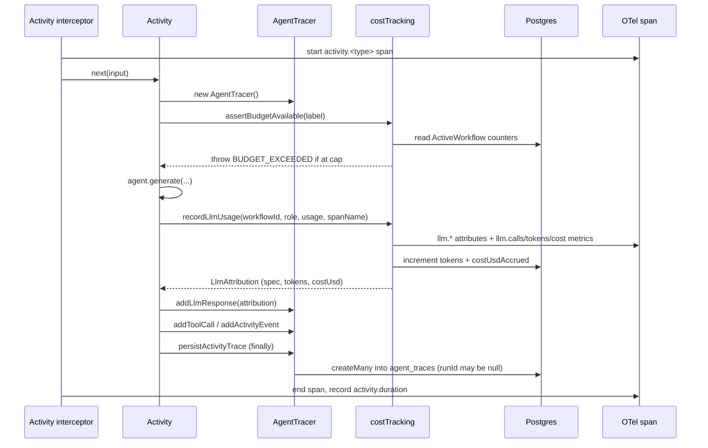

# Tracing, Cost Tracking, and Budgets

> Indexed at commit `147d054a` on 2026-09-30 · [view on GitHub](https://github.com/yorch/auto-swe/tree/147d054a)

## Relevant source files

- [packages/worker/src/lib/agentTracer.ts](https://github.com/yorch/auto-swe/blob/147d054a/packages/worker/src/lib/agentTracer.ts)
- [packages/worker/src/lib/activityContext.ts](https://github.com/yorch/auto-swe/blob/147d054a/packages/worker/src/lib/activityContext.ts)
- [packages/worker/src/lib/costTracking.ts](https://github.com/yorch/auto-swe/blob/147d054a/packages/worker/src/lib/costTracking.ts)
- [packages/worker/src/lib/llmAttribution.ts](https://github.com/yorch/auto-swe/blob/147d054a/packages/worker/src/lib/llmAttribution.ts)
- [packages/worker/src/lib/traceTotals.ts](https://github.com/yorch/auto-swe/blob/147d054a/packages/worker/src/lib/traceTotals.ts)
- [packages/worker/src/lib/activitySpans.ts](https://github.com/yorch/auto-swe/blob/147d054a/packages/worker/src/lib/activitySpans.ts)
- [packages/worker/src/lib/metrics.ts](https://github.com/yorch/auto-swe/blob/147d054a/packages/worker/src/lib/metrics.ts)
- [packages/worker/src/lib/telemetry.ts](https://github.com/yorch/auto-swe/blob/147d054a/packages/worker/src/lib/telemetry.ts)
- [packages/worker/src/lib/embeddings.ts](https://github.com/yorch/auto-swe/blob/147d054a/packages/worker/src/lib/embeddings.ts)
- [packages/worker/src/lib/activityLog.ts](https://github.com/yorch/auto-swe/blob/147d054a/packages/worker/src/lib/activityLog.ts)
- [packages/worker/src/lib/config/stepRequiredAgents.ts](https://github.com/yorch/auto-swe/blob/147d054a/packages/worker/src/lib/config/stepRequiredAgents.ts)
- [packages/worker/src/lib/config/deploymentAgents.ts](https://github.com/yorch/auto-swe/blob/147d054a/packages/worker/src/lib/config/deploymentAgents.ts)
- [packages/shared/src/lib/telemetry.ts](https://github.com/yorch/auto-swe/blob/147d054a/packages/shared/src/lib/telemetry.ts)
- [packages/gateway/src/routes/usage.ts](https://github.com/yorch/auto-swe/blob/147d054a/packages/gateway/src/routes/usage.ts)
- [packages/worker/src/index.ts](https://github.com/yorch/auto-swe/blob/147d054a/packages/worker/src/index.ts)
- [packages/worker/src/activities/runAgent.ts](https://github.com/yorch/auto-swe/blob/147d054a/packages/worker/src/activities/runAgent.ts)

## Overview

Three concerns share one code path in the worker: what an agent did, what it cost, and whether the run may keep spending. `AgentTracer` collects a per-activity record of tool calls and model calls and writes them to the `agent_traces` table that backs the run viewer. `costTracking.ts` prices each model call, debits a per-run token and dollar ledger, and refuses further calls once a tier cap is breached. `telemetry.ts` boots the OpenTelemetry SDK so the same events also leave the process as spans and metrics. The three meet in `persistActivityTrace`, which stamps every trace row with a span's trace and span identifiers so a database row and a Grafana span describe the same moment.

Two things distinguish the current design from a plain "log to the database" tracer. First, `agent_traces` is the one place spend is recorded for every workflow, including workflows that keep no `WorkflowRun` or ledger row; rows carry the Temporal workflow identifier so they stay attributable. Second, every activity attempt is wrapped in an `activity.<type>` span and timed, and a small set of low-cardinality metrics (calls, tokens, cost, budget breaches, run outcomes, activity duration) is exported beside the spans.

Sources: [packages/worker/src/lib/agentTracer.ts:L110-L125](https://github.com/yorch/auto-swe/blob/147d054a/packages/worker/src/lib/agentTracer.ts#L110-L125) [packages/worker/src/lib/metrics.ts:L1-L17](https://github.com/yorch/auto-swe/blob/147d054a/packages/worker/src/lib/metrics.ts#L1-L17) [packages/gateway/src/routes/usage.ts:L6-L16](https://github.com/yorch/auto-swe/blob/147d054a/packages/gateway/src/routes/usage.ts#L6-L16)

## Implementation

### The tracer pattern

Every activity that calls a model constructs an `AgentTracer`, appends entries as it works, and persists them once. The class holds an ordered in-memory array and a monotonic `seq` counter, plus optional OpenTelemetry identifiers set by `setSpanContext`; `hasSpanContext()` reports whether one has been attached ([agentTracer.ts#L110-L125](https://github.com/yorch/auto-swe/blob/147d054a/packages/worker/src/lib/agentTracer.ts#L110-L125)).

A record carries a sequence number, one of three types, an optional name, request and response JSON, a duration, and an optional error string; `model`, `inputTokens`, `outputTokens`, and `costUsd` are populated only on model calls ([agentTracer.ts:L82-L99](https://github.com/yorch/auto-swe/blob/147d054a/packages/worker/src/lib/agentTracer.ts#L82-L99)). The `toolName` column is overloaded by type: a tool name for a tool call, an agent key for a model call, an event name for an activity event. The tracer itself still writes exactly three kinds; the `agent_traces` schema comment lists the same three ([schema.prisma:L1481-L1524](https://github.com/yorch/auto-swe/blob/147d054a/packages/shared/src/prisma/schema.prisma#L1481-L1524)).

| Entry | Added by | Records |
| ----- | -------- | ------- |
| `tool_call` | `addToolCall` | Workspace tool invocations such as `bash`, `readFile`, `writeFile` |
| `llm_response` | `addLlmResponse` | One model round trip, with system prompt, user message, output, tokens, and cost; also one embedding call (see below) |
| `activity_event` | `addActivityEvent` | Non-model work such as git operations, test runs, and pull-request creation |

Both request and response payloads pass through `sanitizeJsonValues` before they are stored. Redaction rewrites credentials embedded in URLs, `Authorization` headers, and values that follow key-looking names, then blanks any property whose lowercased key is in `SENSITIVE_KEYS`: strings become `***`, other values `[REDACTED]` ([agentTracer.ts:L8-L56](https://github.com/yorch/auto-swe/blob/147d054a/packages/worker/src/lib/agentTracer.ts#L8-L56)). Truncation then caps each string at 32,000 characters with an explicit elision marker, a limit raised from 4 KB because a single bash output or file read routinely exceeded it and was destroyed silently ([agentTracer.ts#L3-L6](https://github.com/yorch/auto-swe/blob/147d054a/packages/worker/src/lib/agentTracer.ts#L3-L6), [agentTracer.ts#L58-L80](https://github.com/yorch/auto-swe/blob/147d054a/packages/worker/src/lib/agentTracer.ts#L58-L80)).

`persist` takes `{ runId, workflowId }`, the activity type as `nodeId`, the agent key, and the attempt. It returns early only when there are no records. A missing `runId` no longer drops the batch: workflows that keep no `WorkflowRun` row (workflow authoring, scheduled evals, lesson consolidation, repo-access sync, epic planning) still have their traces written with `run_id` null and `workflow_id` set, so their LLM spend is recorded somewhere. The batch is one `createMany`, and its `try`/`catch` swallows every database error, because tracing is bookkeeping and must never fail a run that has already paid a provider ([agentTracer.ts:L195-L235](https://github.com/yorch/auto-swe/blob/147d054a/packages/worker/src/lib/agentTracer.ts#L195-L235)). Rows land in `agent_traces` with `run_id` (nullable), `workflow_id`, `node_id`, `agent_key`, `attempt`, and the two OpenTelemetry columns ([schema.prisma:L1481-L1524](https://github.com/yorch/auto-swe/blob/147d054a/packages/shared/src/prisma/schema.prisma#L1481-L1524)).

Sources: [packages/worker/src/lib/agentTracer.ts:L1-L236](https://github.com/yorch/auto-swe/blob/147d054a/packages/worker/src/lib/agentTracer.ts#L1-L236) [packages/shared/src/prisma/schema.prisma:L1481-L1524](https://github.com/yorch/auto-swe/blob/147d054a/packages/shared/src/prisma/schema.prisma#L1481-L1524)

### Resolving run, node, and attempt from Temporal

Activities never pass their own identity to the tracer. `activityContext.ts` reads it from the ambient Temporal activity context instead. `currentActivityType()` returns the activity function name and becomes the trace's `nodeId`; `currentAttempt()` returns the one-based retry attempt so the viewer can separate retries; `currentWorkflowId()` reads `Info.workflowExecution` and throws when it is absent, because every activity here is workflow-driven and a missing execution is a programmer error rather than a case to paper over ([activityContext.ts:L11-L40](https://github.com/yorch/auto-swe/blob/147d054a/packages/worker/src/lib/activityContext.ts#L11-L40)). `currentTemporalRunId()` returns Temporal's per-execution run id, or null outside an activity; unlike the workflow id it is unique per execution, since an id can be started again once its earlier execution has closed ([activityContext.ts:L42-L53](https://github.com/yorch/auto-swe/blob/147d054a/packages/worker/src/lib/activityContext.ts#L42-L53)). It is not used for trace rows; the run-creation activity stores it on the `WorkflowRun` ([templates.ts:L187](https://github.com/yorch/auto-swe/blob/147d054a/packages/worker/src/activities/templates.ts#L187)).

The database run identifier is a lookup, not a context field: `currentWorkflowRunId()` maps the Temporal workflow identifier to a `WorkflowRun` row and returns `undefined` when the row does not exist yet or the query fails, because persistence is best-effort ([activityContext.ts:L55-L72](https://github.com/yorch/auto-swe/blob/147d054a/packages/worker/src/lib/activityContext.ts#L55-L72)). `persistActivityTrace` composes all of it. It reads the active span context and attaches it to the tracer only if the tracer does not already carry one, so a more specific span set earlier wins; it then calls `persist` with the resolved run id, the workflow id, activity type, agent key, and attempt ([activityContext.ts:L74-L92](https://github.com/yorch/auto-swe/blob/147d054a/packages/worker/src/lib/activityContext.ts#L74-L92)). The "set earlier" case matters for `runAgent`: its trace is persisted after its `llm.*` span has ended, so it captures that span's identifiers up front, and the rows keep pointing at the span that did the work rather than at whatever is active at persist time ([runAgent.ts:L60-L67](https://github.com/yorch/auto-swe/blob/147d054a/packages/worker/src/activities/runAgent.ts#L60-L67)).

### Why persistence belongs in `finally`

The call must sit in a `finally` block, and the reason is concrete. Records accumulate only in process memory until `persist` runs, so a `persist` reachable solely on the success path is skipped entirely when the model call throws. The failed prompt, the tool calls that led to it, and the error string all vanish, and the run viewer shows an activity that produced nothing at exactly the moment an operator needs the transcript. Temporal then retries the activity with a fresh tracer, so nothing later recovers the lost attempt.

`runAgent` shows the canonical shape: the `catch` records a failed `llm_response` carrying the error message and re-raises, while the outer `finally` persists the batch regardless of outcome ([runAgent.ts:L75-L141](https://github.com/yorch/auto-swe/blob/147d054a/packages/worker/src/activities/runAgent.ts#L75-L141)). The failed row is no longer blank: `failedCallAttribution` spreads the call's model, tokens, and cost into it. If usage was already recorded and something after it threw (missing structured output, a parse error), the call was paid for and the recorded attribution is used. If the post-call check raised `BUDGET_EXCEEDED`, the attribution rides on the failure's details. Anything else gets the configured model and no tokens ([llmAttribution.ts:L4-L38](https://github.com/yorch/auto-swe/blob/147d054a/packages/worker/src/lib/llmAttribution.ts#L4-L38)). The helper is shared by the planner, decomposer, review network, and security-review processor, so the usage report prices failed calls and blames the right model. Activities holding a workspace order the teardown deliberately: `executeImplementation` closes any MCP connection, persists, then continues its cleanup ([executeImplementation.ts:L442-L444](https://github.com/yorch/auto-swe/blob/147d054a/packages/worker/src/activities/executeImplementation.ts#L442-L444)), and `implementerSession` starts the persist, destroys the container, then awaits the write so container teardown and the database round trip overlap ([implementerSession.ts:L296-L300](https://github.com/yorch/auto-swe/blob/147d054a/packages/worker/src/activities/implementerSession.ts#L296-L300)).

Sources: [packages/worker/src/lib/activityContext.ts:L1-L92](https://github.com/yorch/auto-swe/blob/147d054a/packages/worker/src/lib/activityContext.ts#L1-L92) [packages/worker/src/activities/runAgent.ts:L53-L141](https://github.com/yorch/auto-swe/blob/147d054a/packages/worker/src/activities/runAgent.ts#L53-L141) [packages/worker/src/lib/llmAttribution.ts:L1-L38](https://github.com/yorch/auto-swe/blob/147d054a/packages/worker/src/lib/llmAttribution.ts#L1-L38)

### Spend with no ledger: embeddings and trace totals

Not every workflow has an `ActiveWorkflow` ledger row. Channel tasks, PRD runs, authoring, and similar paths keep none, so the ledger cannot be the only record of spend. Two mechanisms close that gap.

Embedding calls now leave a trace. After each successful `embed`, `generateEmbeddingWithSpec` writes one `llm_response` row with agent key `embedding`, tool name `embedding`, `seq` 0, the character count as input JSON, and the token count and cost priced from the embedding spec; the cost is rounded to micro-dollars, and a provider that omits usage yields null tokens and cost. Its cost, but deliberately not its tokens, is added to the ledger's `costUsdAccrued` when a ledger row exists, because the per-tier budgets are measured in chat tokens. Outside an activity nothing is written, and any database error is swallowed so a bookkeeping failure never fails the embedding ([embeddings.ts:L120-L192](https://github.com/yorch/auto-swe/blob/147d054a/packages/worker/src/lib/embeddings.ts#L120-L192)).

`sumRunTraceUsage(runId)` sums a run's `agent_traces` rows into cost and token totals, excluding the `embedding` key from tokens for the same reason. The run-finalizing activity uses it when a run has no ledger workflows, so `/runs` shows real cost rather than $0, and `finalizeChannelRun` uses it for channel runs ([traceTotals.ts:L14-L29](https://github.com/yorch/auto-swe/blob/147d054a/packages/worker/src/lib/traceTotals.ts#L14-L29), [templates.ts:L392-L404](https://github.com/yorch/auto-swe/blob/147d054a/packages/worker/src/activities/templates.ts#L392-L404), [channelRun.ts:L248-L257](https://github.com/yorch/auto-swe/blob/147d054a/packages/worker/src/activities/channelRun.ts#L257)).

The same rows feed an admin-only gateway report, `GET /api/v1/platform/usage?window=7|30|90` (default 30). It aggregates `llm_response` rows over whole UTC days into totals, per-model, per-agent, and per-activity breakdowns, a per-day series, the ten most expensive runs, and an `unattributed` bucket for rows with no run. Latency means exclude failed calls, a null model marks a call whose spec could not be resolved, and the daily queries run three at a time so a report never holds the gateway's ten-connection pool ([usage.ts:L18-L36](https://github.com/yorch/auto-swe/blob/147d054a/packages/gateway/src/routes/usage.ts#L18-L36), [usage.ts:L100-L266](https://github.com/yorch/auto-swe/blob/147d054a/packages/gateway/src/routes/usage.ts#L100-L266), registered at the `/api/v1/platform` prefix in [index.ts](https://github.com/yorch/auto-swe/blob/147d054a/packages/gateway/src/index.ts)). The per-run trace list on the run detail route is a separate read, ordered by creation time then `seq` ([workflowRuns.ts:L323-L327](https://github.com/yorch/auto-swe/blob/147d054a/packages/gateway/src/routes/workflowRuns.ts#L323-L327)).

Sources: [packages/worker/src/lib/embeddings.ts:L93-L192](https://github.com/yorch/auto-swe/blob/147d054a/packages/worker/src/lib/embeddings.ts#L93-L192) [packages/worker/src/lib/traceTotals.ts:L1-L29](https://github.com/yorch/auto-swe/blob/147d054a/packages/worker/src/lib/traceTotals.ts#L1-L29) [packages/gateway/src/routes/usage.ts:L1-L268](https://github.com/yorch/auto-swe/blob/147d054a/packages/gateway/src/routes/usage.ts#L1-L268)

### Pricing a call

`MODEL_PRICES` maps a `<provider>/<model-id>` spec to input and output rates in US dollars per million tokens, last verified against the three built-in providers' published pricing in September 2026 ([costTracking.ts:L22-L91](https://github.com/yorch/auto-swe/blob/147d054a/packages/worker/src/lib/costTracking.ts#L22-L91)). It covers every seeded default and the full model-id table from the project guide:

| Provider | Entries (input / output USD per MTok) |
| -------- | ------------------------------------- |
| Anthropic | Fable 5 and 5.1 at 10 / 50; Opus 5 at 5 / 25 and Opus 5.5 at 4 / 20; Sonnet 5 and 5.5 at 2 / 10; Haiku 4.5 at 1 / 5; older Opus 4.x, Sonnet 4.x, and Haiku 3.5 retained for historical runs |
| OpenAI | `gpt-6-astra` 10 / 50, `gpt-6.1-sol` 2 / 10, `gpt-6-luna` 0.1 / 0.5; `gpt-5`, `gpt-5.5`, `gpt-5.5-pro`; embeddings `text-embedding-3-large` 0.13 and `-small` 0.02 (input only) |
| Google | `gemini-3.1-pro-preview` 2 / 12, `gemini-3.8-flash` 1.5 / 7.5, `gemini-3.5-flash` 1.5 / 9, `gemini-3.5-flash-lite` 0.3 / 2.5, plus 3.x preview and 2.5 entries |

OpenAI GPT-5.5 keys use the dotted ids the provider actually reports (`openai/gpt-5.5`, `openai/gpt-5.5-pro`); the earlier hyphenated spelling matched nothing and priced those calls at zero. The `gemini-3.8-flash` row deliberately records the list price that starts on 2027-01-01 rather than the lower introductory price, so budgets over-count rather than under-count once it lapses.

The table states base rates only. Prompt-caching multipliers, the batch discount, data-residency and fast-mode premiums, and the Gemini 2.5 Pro and 3.1 Pro long-context surcharge are all outside it, and a deployment affected by one is expected to set an override.

`getModelPrice` checks the environment first, then the static table, and otherwise returns a zero rate with `known: false` ([costTracking.ts:L130-L140](https://github.com/yorch/auto-swe/blob/147d054a/packages/worker/src/lib/costTracking.ts#L130-L140)). An override is read from `MODEL_PRICE_<SPEC>`, where the spec is uppercased and every non-alphanumeric character becomes an underscore, so `anthropic/claude-opus-5-5` becomes `MODEL_PRICE_ANTHROPIC_CLAUDE_OPUS_5_5` and `openai/gpt-5.5` becomes `MODEL_PRICE_OPENAI_GPT_5_5`. Its value is `<input>:<output>`. `parsePriceOverride` rejects anything that is not two finite non-negative numbers, explicitly so a negative rate cannot invert cost accumulation and walk a run back under its cap ([costTracking.ts:L95-L128](https://github.com/yorch/auto-swe/blob/147d054a/packages/worker/src/lib/costTracking.ts#L95-L128)).

Pricing keys on the resolved spec alone. `recordLlmUsage` resolves the spec from the agent key, but the agent identity is used only for attribution and model lookup, never as part of the price ([costTracking.ts:L173-L185](https://github.com/yorch/auto-swe/blob/147d054a/packages/worker/src/lib/costTracking.ts#L173-L185)). When the spec cannot be resolved at all, the code substitutes `unknown/unknown` and continues, because failing here would let a malformed configuration burn unlimited tokens: each retry would re-spend at the provider while the counter stayed still and the cap never fired ([costTracking.ts:L361-L376](https://github.com/yorch/auto-swe/blob/147d054a/packages/worker/src/lib/costTracking.ts#L361-L376)). An unpriced model logs a warning and sets `llm.cost_pricing_known=false` on the span; usage is still recorded, so no run is lost to a missing table entry.

Sources: [packages/worker/src/lib/costTracking.ts:L15-L185](https://github.com/yorch/auto-swe/blob/147d054a/packages/worker/src/lib/costTracking.ts#L15-L185)

### The ledger and the two budget checks

Accounting lives on the `ActiveWorkflow` row keyed by `temporalWorkflowId`, which holds `budgetTier`, two BigInt token counters, and a float dollar total ([schema.prisma:L109-L133](https://github.com/yorch/auto-swe/blob/147d054a/packages/shared/src/prisma/schema.prisma#L109-L133)). `recordLlmUsage` updates it with Postgres-side `increment` operations rather than read-modify-write. Concurrency is the reason: the review network runs three reviewers under one settled promise and fan-out branches run in parallel, possibly on different workers, so interleaved read/write pairs dropped increments precisely when spend was highest ([costTracking.ts:L419-L470](https://github.com/yorch/auto-swe/blob/147d054a/packages/worker/src/lib/costTracking.ts#L419-L470)). The dollar delta is rounded to micro-dollars before accumulating so each increment is exactly representable in the float column. A missing ledger row surfaces as Prisma error `P2025`, which is treated as non-fatal: the span gets `llm.workflow_found=false` and the call's own attribution is returned, since channel tasks and product-requirement runs keep no ledger ([costTracking.ts:L462-L470](https://github.com/yorch/auto-swe/blob/147d054a/packages/worker/src/lib/costTracking.ts#L462-L470)). Such a call is still counted in metrics and spans, because both are recorded before the ledger is touched.

Enforcement happens twice around each call, and `resolveTierLimits` is the single definition both use. It defaults a null tier to `STANDARD`, reads the database-backed tier table, falls back to `BUDGET_LIMITS`, and throws on a tier it cannot find. The two sites previously derived limits separately and had already drifted: the pre-call gate returned silently on an unknown tier while the post-call check threw, so a misconfigured tier quietly disabled the gate everywhere ([costTracking.ts:L233-L253](https://github.com/yorch/auto-swe/blob/147d054a/packages/worker/src/lib/costTracking.ts#L233-L253)).

`assertBudgetAvailable(label)` runs before `generate()`. It reads the workflow identifier from activity context rather than accepting it as a parameter, after a call site once passed a literal string that matched no row and turned its gate into a permanent no-op. It returns silently when there is no ledger row, and otherwise throws a non-retryable `BUDGET_EXCEEDED` failure when either counter is already at or above its cap ([costTracking.ts:L255-L290](https://github.com/yorch/auto-swe/blob/147d054a/packages/worker/src/lib/costTracking.ts#L255-L290)). The comparison is `>=` here and `>` after the call, deliberately: a call landing exactly on the cap is allowed, the next one is not.

`recordLlmUsage` runs after. It writes the increment first and checks the limits second, so the dashboard shows the real overage rather than the last value under the cap. On a breach it counts `workflow.budget_exceeded` for the tier and throws the same non-retryable `BUDGET_EXCEEDED`, now carrying the call's own attribution in the failure details so the caller can price the failed trace row ([costTracking.ts:L483-L510](https://github.com/yorch/auto-swe/blob/147d054a/packages/worker/src/lib/costTracking.ts#L483-L510)). Non-retryable is what makes the failure terminal: Temporal does not retry the activity, and the workflow fails instead of re-spending. The post-call check alone cannot prevent overshoot, because a call's cost is unknown until it returns; the pre-call gate turns one overshooting call per concurrent branch into one overshooting call total. It is a gate, not a reservation, and a workflow sitting just under its cap is still allowed one more call of unknown size ([costTracking.ts:L214-L232](https://github.com/yorch/auto-swe/blob/147d054a/packages/worker/src/lib/costTracking.ts#L214-L232)).

Tier limits come from the `WorkflowDefaults` singleton, one nullable column pair per tier with the built-in constants as the fallback ([systemConfig.ts:L395-L408](https://github.com/yorch/auto-swe/blob/147d054a/packages/shared/src/lib/systemConfig.ts#L395-L408)). Because `recordLlmUsage` is a hot path, `resolveBudgetTiers` memoizes the resolved table behind the shared configuration cache, so a dashboard edit takes effect on the next call after the time-to-live elapses ([costTracking.ts:L154-L171](https://github.com/yorch/auto-swe/blob/147d054a/packages/worker/src/lib/costTracking.ts#L154-L171)).

One advisory check rides along. `flagUnregisteredAgentUsage` compares the executing activity against `STEP_REQUIRED_AGENTS` and flags a step that spent tokens on an agent the boot gate never validated, since a missing entry means a deployment boots clean and dies mid-run on a missing model or credential. It only judges activities the gate actually walked, sets `llm.step_agent_unregistered` on the span unconditionally, and logs once per step-and-agent pair per process ([costTracking.ts:L292-L353](https://github.com/yorch/auto-swe/blob/147d054a/packages/worker/src/lib/costTracking.ts#L292-L353), [stepRequiredAgents.ts:L10-L24](https://github.com/yorch/auto-swe/blob/147d054a/packages/worker/src/lib/config/stepRequiredAgents.ts#L10-L24)).

Sources: [packages/worker/src/lib/costTracking.ts:L186-L523](https://github.com/yorch/auto-swe/blob/147d054a/packages/worker/src/lib/costTracking.ts#L186-L523) [packages/shared/src/prisma/schema.prisma:L109-L133](https://github.com/yorch/auto-swe/blob/147d054a/packages/shared/src/prisma/schema.prisma#L109-L133)

### Cost and budget knobs

| Name | Type | Default | Purpose |
| ---- | ---- | ------- | ------- |
| `budgetTiers.STANDARD` | tokens | 2,000,000 input / 500,000 output | Default per-run cap; `WorkflowDefaults` columns override `BUDGET_LIMITS` |
| `budgetTiers.LARGE` | tokens | 8,000,000 input / 2,000,000 output | Mid tier |
| `budgetTiers.EPIC` | tokens | 20,000,000 input / 5,000,000 output | Highest tier |
| `ActiveWorkflow.budgetTier` | `string` | `STANDARD` | Which tier a run is charged against; null resolves to `STANDARD` |
| `MODEL_PRICE_<PROVIDER>_<MODEL>` | env `input:output` | unset | Per-model rate override in dollars per million tokens; negative or malformed values are ignored |
| Unknown model rate | `ModelPrice` | `{ input: 0, output: 0 }` | Zero cost plus `llm.cost_pricing_known=false` on the span |
| `CONFIG_CACHE_TTL_MS` | ms | 30,000 | Time-to-live for the memoized tier table and other config resolvers |
| `MAX_JSON_CHARS` | chars | 32,000 | Per-string truncation limit on persisted trace payloads |
| `OTEL_EXPORTER_OTLP_ENDPOINT` | URL | unset | Enables telemetry; unset disables the SDK and the Temporal metrics runtime |
| `OTEL_METRIC_EXPORT_INTERVAL` | ms | 60,000 | Metric export period; non-positive or unparseable values fall back to the default |

Sources: [packages/worker/src/lib/costTracking.ts:L142-L171](https://github.com/yorch/auto-swe/blob/147d054a/packages/worker/src/lib/costTracking.ts#L142-L171) [packages/shared/src/config/cache.ts:L104-L113](https://github.com/yorch/auto-swe/blob/147d054a/packages/shared/src/config/cache.ts#L104-L113) [packages/shared/src/lib/systemConfig.ts:L742-L749](https://github.com/yorch/auto-swe/blob/147d054a/packages/shared/src/lib/systemConfig.ts#L742-L749)

### OpenTelemetry wiring

The worker's entry point initializes telemetry on its first line, before any other import, because auto-instrumentation must patch modules as they load ([index.ts:L1-L4](https://github.com/yorch/auto-swe/blob/147d054a/packages/worker/src/index.ts#L1-L4)). The worker-local `initTelemetry` supplies HTTP instrumentation, an OTLP gRPC trace exporter, and a periodic metric reader over an OTLP gRPC metric exporter, each conditional on the endpoint being set ([telemetry.ts:L11-L24](https://github.com/yorch/auto-swe/blob/147d054a/packages/worker/src/lib/telemetry.ts#L11-L24)). Its inline comment says the export interval defaults to 30 seconds; the resolver it calls returns 60,000 milliseconds ([telemetry.ts#L18](https://github.com/yorch/auto-swe/blob/147d054a/packages/worker/src/lib/telemetry.ts#L18), [systemConfig.ts#L746-L749](https://github.com/yorch/auto-swe/blob/147d054a/packages/shared/src/lib/systemConfig.ts#L746-L749)). That mismatch still exists; the code value is the one in force.

The shared helper builds the resource from a service name and package version and starts a `NodeSDK`. With no endpoint configured it logs once and returns a no-op shutdown, so a development machine needs no telemetry infrastructure ([shared/telemetry.ts:L22-L47](https://github.com/yorch/auto-swe/blob/147d054a/packages/shared/src/lib/telemetry.ts#L22-L47)). Separately, when the endpoint is present the worker installs the Temporal runtime with its own OTel metrics pointed at the same collector, which is what surfaces task-queue and activity metrics ([index.ts:L27-L37](https://github.com/yorch/auto-swe/blob/147d054a/packages/worker/src/index.ts#L27-L37)). Locally the collector is the Grafana LGTM container in the application compose overlay. The gateway boots the same shared helper under the service name `auto-swe-gateway`.

Right after the endpoint check at the top of `run()`, the worker calls `initMetrics()`, and later registers `activitySpanInterceptor` as an activity interceptor on `Worker.create` ([index.ts:L19-L25](https://github.com/yorch/auto-swe/blob/147d054a/packages/worker/src/index.ts#L19-L25), [index.ts:L74-L78](https://github.com/yorch/auto-swe/blob/147d054a/packages/worker/src/index.ts#L74-L78)).

#### Activity spans

`activitySpanInterceptor` wraps every activity attempt in an `activity.<type>` span from the tracer named `auto-swe-worker`. Without it the `llm.*` spans an activity opens are roots with nothing tying them to one another or to the workflow, and trace rows persisted outside an LLM span carry no trace id at all. Under it, everything an attempt does shares one trace, and the workflow id on the span finds it in Tempo. A cancelled attempt (`CancelledFailure` or an `AbortError`) is marked `temporal.cancelled` and is not recorded as an error; any other throw records the exception and sets error status. The interceptor is activity-side only, on purpose: propagating context from the workflow would need a workflow interceptor inside the V8 isolate, and the official package pins the 1.x OpenTelemetry SDK beside this repository's 2.x one ([activitySpans.ts:L8-L72](https://github.com/yorch/auto-swe/blob/147d054a/packages/worker/src/lib/activitySpans.ts#L8-L72)).

#### Metrics

`metrics.ts` owns six instruments under the meter `auto-swe-worker`. Attributes are low-cardinality on purpose (model spec, agent key, activity type, status, tier), never a run, workflow, or ticket id. Instruments are created lazily on first use and again explicitly by `initMetrics()`, because the metrics API has no proxy provider: instruments built at import time, before `initTelemetry()` ran, would be no-ops for the life of the process. `initMetrics()` also seeds zero samples for every run status and budget tier, then forces one export without awaiting it, so Prometheus `increase()` has a baseline before the first real event ([metrics.ts:L19-L109](https://github.com/yorch/auto-swe/blob/147d054a/packages/worker/src/lib/metrics.ts#L19-L109)).

| Instrument | Kind | Attributes | Recorded by |
| ---------- | ---- | ---------- | ----------- |
| `llm.calls` | counter | `agent`, `model` | `recordLlmUsage` and each embedding call |
| `llm.tokens` | counter | `agent`, `model`, `direction` (`input` or `output`) | same |
| `llm.cost_usd` | counter | `agent`, `model` | same |
| `workflow.budget_exceeded` | counter | `tier` | post-call budget breach; concurrent breaching calls each count |
| `workflow.runs.finalized` | counter | `status` (`SUCCESS`, `FAILED`, `TIMED_OUT`, `SKIPPED`, `CANCELLED`) | `recordRunFinalized` in the run-finalizing activity (`templates.ts:L508`) |
| `activity.duration` | histogram, seconds | `activity`, `outcome` (`success`, `failure`, `cancelled`) | `activitySpanInterceptor` |

Sources: [packages/worker/src/lib/metrics.ts:L1-L140](https://github.com/yorch/auto-swe/blob/147d054a/packages/worker/src/lib/metrics.ts#L1-L140) [packages/worker/src/lib/activitySpans.ts:L1-L72](https://github.com/yorch/auto-swe/blob/147d054a/packages/worker/src/lib/activitySpans.ts#L1-L72)

#### Manual `llm.*` spans

`recordLlmUsage` opens a span named by its caller, such as `llm.implementer.iteration_1`, and ends it in a `finally` ([costTracking.ts:L400-L523](https://github.com/yorch/auto-swe/blob/147d054a/packages/worker/src/lib/costTracking.ts#L400-L523)). The per-call attributes are set before the ledger is touched, so a run with no ledger row still shows what it spent; the `workflow.*` attributes follow the increment.

| Attribute | Set when |
| --------- | -------- |
| `llm.model`, `llm.role`, `llm.input_tokens`, `llm.output_tokens`, `llm.cost_usd` | Every priced call, before the ledger update |
| `llm.cost_pricing_known` | Every priced call; `false` marks a model absent from the price table |
| `llm.spec_resolution_failed` | The agent's model spec could not be resolved |
| `llm.workflow_found` | Set to `false` when no `ActiveWorkflow` ledger row exists |
| `llm.step_agent_unregistered` | A gated step spent on an agent missing from `STEP_REQUIRED_AGENTS` |
| `workflow.budget_tier`, `workflow.cost_usd_cumulative`, `workflow.tokens_input_cumulative`, `workflow.tokens_output_cumulative` | After the ledger increment |
| `workflow.budget_remaining_input_tokens`, `workflow.budget_remaining_output_tokens` | After tier limits resolve |
| `agent.key` | `runAgent` spans, alongside `llm.model` |
| `temporal.activity_type`, `temporal.attempt`, `temporal.task_queue`, `temporal.workflow_id`, `temporal.workflow_type` | Every `activity.<type>` span |
| `temporal.cancelled` | An `activity.<type>` span whose attempt was cancelled |

Structured logging is thin by comparison: `activityLog.ts` exposes a single `logError` that forwards to the Temporal activity logger only when an activity context is present, so the same helper is inert when called outside one ([activityLog.ts:L1-L7](https://github.com/yorch/auto-swe/blob/147d054a/packages/worker/src/lib/activityLog.ts#L1-L7)).

Sources: [packages/worker/src/lib/telemetry.ts:L1-L25](https://github.com/yorch/auto-swe/blob/147d054a/packages/worker/src/lib/telemetry.ts#L1-L25) [packages/shared/src/lib/telemetry.ts:L1-L48](https://github.com/yorch/auto-swe/blob/147d054a/packages/shared/src/lib/telemetry.ts#L1-L48) [packages/worker/src/index.ts:L1-L78](https://github.com/yorch/auto-swe/blob/147d054a/packages/worker/src/index.ts#L1-L78)

## Diagram

```mermaid
sequenceDiagram
    participant I as Activity interceptor
    participant A as Activity
    participant T as AgentTracer
    participant C as costTracking
    participant DB as Postgres
    participant O as OTel span

    I->>O: start activity.<type> span
    I->>A: next(input)
    A->>T: new AgentTracer()
    A->>C: assertBudgetAvailable(label)
    C->>DB: read ActiveWorkflow counters
    C-->>A: throw BUDGET_EXCEEDED if at cap
    A->>A: agent.generate(...)
    A->>C: recordLlmUsage(workflowId, role, usage, spanName)
    C->>O: llm.* attributes + llm.calls/tokens/cost metrics
    C->>DB: increment tokens + costUsdAccrued
    C-->>A: LlmAttribution (spec, tokens, costUsd)
    A->>T: addLlmResponse(attribution)
    A->>T: addToolCall / addActivityEvent
    A->>T: persistActivityTrace (finally)
    T->>DB: createMany into agent_traces (runId may be null)
    I->>O: end span, record activity.duration
```

Sources: [packages/worker/src/lib/activitySpans.ts:L29-L71](https://github.com/yorch/auto-swe/blob/147d054a/packages/worker/src/lib/activitySpans.ts#L29-L71) [packages/worker/src/activities/runAgent.ts:L53-L141](https://github.com/yorch/auto-swe/blob/147d054a/packages/worker/src/activities/runAgent.ts#L53-L141) [packages/worker/src/lib/costTracking.ts:L355-L523](https://github.com/yorch/auto-swe/blob/147d054a/packages/worker/src/lib/costTracking.ts#L355-L523)

## Usage

Roughly twenty activities follow the pattern, including `executeImplementation`, `runReviewNetwork`, `commitToMemory`, `channelAssistant`, `evalHarness`, and the generic `runAgent` node. The agent key passed to `persistActivityTrace` is the attribution label on every row in the batch, and it need not be a model-backed agent: `createOrUpdatePullRequest` persists under `pr` and `mcpCallTool` under `mcp`, so tool-only activities still produce a viewable transcript ([createOrUpdatePullRequest.ts:L28](https://github.com/yorch/auto-swe/blob/147d054a/packages/worker/src/activities/createOrUpdatePullRequest.ts#L28), [mcpCallTool.ts:L63](https://github.com/yorch/auto-swe/blob/147d054a/packages/worker/src/activities/mcpCallTool.ts#L63)).

Callers should read cost from the `LlmAttribution` that `recordLlmUsage` returns rather than re-pricing the provider's usage object, which keeps the value shown per call identical to the amount debited to the run ledger ([runAgent.ts:L20-L35](https://github.com/yorch/auto-swe/blob/147d054a/packages/worker/src/activities/runAgent.ts#L20-L35)). On failure, spread `failedCallAttribution(err, modelSpec, recorded)` into the failed `addLlmResponse` so the usage report still prices the call.

The per-run tier cap is not the only budget in the system. Channel assistant turns check a monthly per-channel dollar budget before building the prompt and answer with a friendly refusal instead of failing ([channelAssistant.ts:L812-L817](https://github.com/yorch/auto-swe/blob/147d054a/packages/worker/src/activities/channelAssistant.ts#L812-L817)), and the gateway rejects submissions with `ORG_BUDGET_EXCEEDED` and HTTP 402 when an organization has spent its monthly cap ([orgAccess.ts:L56-L91](https://github.com/yorch/auto-swe/blob/147d054a/packages/gateway/src/lib/orgAccess.ts#L56-L91)).

Sources: [packages/worker/src/activities/runAgent.ts:L1-L141](https://github.com/yorch/auto-swe/blob/147d054a/packages/worker/src/activities/runAgent.ts#L1-L141) [packages/gateway/src/lib/orgAccess.ts:L56-L91](https://github.com/yorch/auto-swe/blob/147d054a/packages/gateway/src/lib/orgAccess.ts#L56-L91)

## Related Pages

- Parent: [Temporal Worker](./4-temporal-worker.md)
- Sibling: [Temporal Workflows](./4.1-temporal-workflows.md)
- Sibling: [Activities](./4.2-activities.md)
- Sibling: [Agent Layer](./4.3-agent-layer.md)
- Sibling: [Docker Workspaces](./4.4-docker-workspaces.md)
