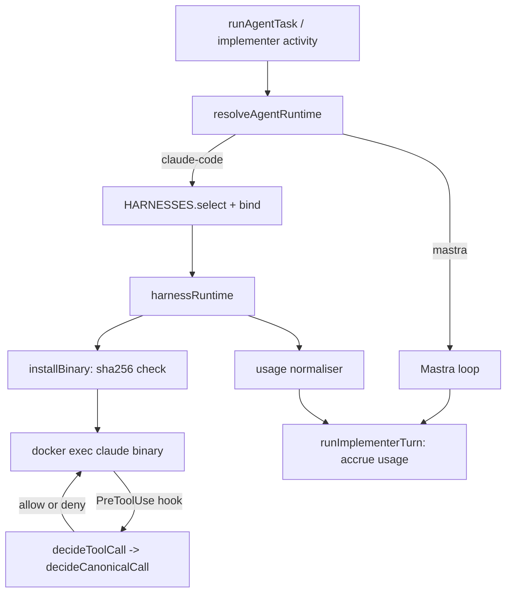

# Agent Runs and Implementer Runtimes

> Indexed at commit `d0a90fb5` on 2026-10-06 · [view on GitHub](https://github.com/yorch/auto-swe/tree/d0a90fb5)

## Relevant source files

- [packages/worker/src/agents/harness/adapter.ts](https://github.com/yorch/auto-swe/blob/d0a90fb5/packages/worker/src/agents/harness/adapter.ts)
- [packages/worker/src/agents/harness/binary.ts](https://github.com/yorch/auto-swe/blob/d0a90fb5/packages/worker/src/agents/harness/binary.ts)
- [packages/worker/src/agents/harness/policy.ts](https://github.com/yorch/auto-swe/blob/d0a90fb5/packages/worker/src/agents/harness/policy.ts)
- [packages/worker/src/agents/harness/registry.ts](https://github.com/yorch/auto-swe/blob/d0a90fb5/packages/worker/src/agents/harness/registry.ts)
- [packages/worker/src/agents/harness/runtime.ts](https://github.com/yorch/auto-swe/blob/d0a90fb5/packages/worker/src/agents/harness/runtime.ts)
- [packages/worker/src/agents/harness/usage.ts](https://github.com/yorch/auto-swe/blob/d0a90fb5/packages/worker/src/agents/harness/usage.ts)
- [packages/worker/src/agents/claudeCode/binary.ts](https://github.com/yorch/auto-swe/blob/d0a90fb5/packages/worker/src/agents/claudeCode/binary.ts)
- [packages/worker/src/agents/claudeCode/harness.ts](https://github.com/yorch/auto-swe/blob/d0a90fb5/packages/worker/src/agents/claudeCode/harness.ts)
- [packages/worker/src/agents/claudeCode/policy.ts](https://github.com/yorch/auto-swe/blob/d0a90fb5/packages/worker/src/agents/claudeCode/policy.ts)
- [packages/worker/src/agents/claudeCode/runtime.ts](https://github.com/yorch/auto-swe/blob/d0a90fb5/packages/worker/src/agents/claudeCode/runtime.ts)
- [packages/worker/src/agents/harnessRegistry.ts](https://github.com/yorch/auto-swe/blob/d0a90fb5/packages/worker/src/agents/harnessRegistry.ts)
- [packages/worker/src/agents/implementerRuntime.ts](https://github.com/yorch/auto-swe/blob/d0a90fb5/packages/worker/src/agents/implementerRuntime.ts)
- [packages/worker/src/agents/implementerRuntimeSelect.ts](https://github.com/yorch/auto-swe/blob/d0a90fb5/packages/worker/src/agents/implementerRuntimeSelect.ts)
- [packages/worker/src/agents/agentRunTools.ts](https://github.com/yorch/auto-swe/blob/d0a90fb5/packages/worker/src/agents/agentRunTools.ts)
- [packages/worker/src/activities/runAgentTask.ts](https://github.com/yorch/auto-swe/blob/d0a90fb5/packages/worker/src/activities/runAgentTask.ts)
- [packages/worker/src/lib/agentRunPolicy.ts](https://github.com/yorch/auto-swe/blob/d0a90fb5/packages/worker/src/lib/agentRunPolicy.ts)
- [packages/worker/src/lib/agentRunSlots.ts](https://github.com/yorch/auto-swe/blob/d0a90fb5/packages/worker/src/lib/agentRunSlots.ts)
- [packages/worker/src/lib/config/agentRuntime.ts](https://github.com/yorch/auto-swe/blob/d0a90fb5/packages/worker/src/lib/config/agentRuntime.ts)
- [packages/shared/src/lib/agentRun.ts](https://github.com/yorch/auto-swe/blob/d0a90fb5/packages/shared/src/lib/agentRun.ts)
- [packages/shared/src/lib/agentRunAdmission.ts](https://github.com/yorch/auto-swe/blob/d0a90fb5/packages/shared/src/lib/agentRunAdmission.ts)
- [packages/gateway/src/routes/agentRuns.ts](https://github.com/yorch/auto-swe/blob/d0a90fb5/packages/gateway/src/routes/agentRuns.ts)
- [docs/agent-runs.md](https://github.com/yorch/auto-swe/blob/d0a90fb5/docs/agent-runs.md)

## Overview

An agent run is an ad-hoc launch of one library agent against one repository; the agent works in a throwaway workspace container and its result is optionally published as a branch or draft pull request ([docs/agent-runs.md:L1-L9](https://github.com/yorch/auto-swe/blob/d0a90fb5/docs/agent-runs.md#L1-L9)). The same worker also drives implementer sessions, and both paths choose their loop through one seam: the agent runs on the Mastra loop or on a registered harness, currently Claude Code. This page covers agent-run admission and delivery, per-agent runtime selection and run pinning, the harness adapter seam and registry, the Claude Code harness, the per-call tool policy, binary installation, and usage accounting.

## Implementation

### Admission and the agent-run activity

A launch is a workflow of the hidden system template whose single internal step is `runAgentTask` ([packages/shared/src/lib/agentRun.ts:L18-L30](https://github.com/yorch/auto-swe/blob/d0a90fb5/packages/shared/src/lib/agentRun.ts#L18-L30)). The gateway pre-checks concurrency with `wouldAdmitNewRun` and answers `403 AGENT_RUNS_DISABLED` or `429 AGENT_RUN_CONCURRENCY_EXCEEDED` ([packages/gateway/src/routes/agentRuns.ts:L295-L308](https://github.com/yorch/auto-swe/blob/d0a90fb5/packages/gateway/src/routes/agentRuns.ts#L295-L308)), but the worker is the authority. `runAgentTask` re-verifies the system template origin, the ledger repository and the payload ([packages/worker/src/activities/runAgentTask.ts:L101-L148](https://github.com/yorch/auto-swe/blob/d0a90fb5/packages/worker/src/activities/runAgentTask.ts#L101-L148)), then calls `decideAdmission` over the live slots ([packages/worker/src/activities/runAgentTask.ts:L165-L181](https://github.com/yorch/auto-swe/blob/d0a90fb5/packages/worker/src/activities/runAgentTask.ts#L165-L181)).

`decideAdmission` admits a run only if its rank by launch time then workflow id falls within the global and per-team limits; a run that cannot find itself fails closed ([packages/shared/src/lib/agentRunAdmission.ts:L46-L75](https://github.com/yorch/auto-swe/blob/d0a90fb5/packages/shared/src/lib/agentRunAdmission.ts#L46-L75)). `loadLiveAgentRunSlots` reconciles ledger rows against Temporal so finished or missing workflows stop holding slots, and a row it cannot confirm keeps its slot ([packages/worker/src/lib/agentRunSlots.ts:L56-L73](https://github.com/yorch/auto-swe/blob/d0a90fb5/packages/worker/src/lib/agentRunSlots.ts#L56-L73)). Reconciliation is bounded by constants: a 5-minute launch grace, at most 8 Temporal lookups per admission call, a 3-second timeout per lookup, and a 60-second recheck interval for rows confirmed running ([packages/shared/src/lib/agentRunAdmission.ts:L147-L160](https://github.com/yorch/auto-swe/blob/d0a90fb5/packages/shared/src/lib/agentRunAdmission.ts#L147-L160)). Requested step and wall-clock caps are clamped to the settings ceilings with `clampToCeiling` ([packages/worker/src/activities/runAgentTask.ts:L182-L187](https://github.com/yorch/auto-swe/blob/d0a90fb5/packages/worker/src/activities/runAgentTask.ts#L182-L187)).

Tool grants differ from the implementer's. `grantedWorkspaceToolIds` treats `toolKeys` as an allowlist: `null` grants only `readFile` and `listDirectory`, and a list grants exactly the workspace tools it names ([packages/worker/src/agents/agentRunTools.ts:L26-L36](https://github.com/yorch/auto-swe/blob/d0a90fb5/packages/worker/src/agents/agentRunTools.ts#L26-L36)).

Sources: [packages/worker/src/activities/runAgentTask.ts:L97-L187](https://github.com/yorch/auto-swe/blob/d0a90fb5/packages/worker/src/activities/runAgentTask.ts#L97-L187) [packages/shared/src/lib/agentRunAdmission.ts:L46-L91](https://github.com/yorch/auto-swe/blob/d0a90fb5/packages/shared/src/lib/agentRunAdmission.ts#L46-L91) [packages/worker/src/lib/agentRunSlots.ts:L20-L73](https://github.com/yorch/auto-swe/blob/d0a90fb5/packages/worker/src/lib/agentRunSlots.ts#L20-L73) [packages/worker/src/agents/agentRunTools.ts:L1-L55](https://github.com/yorch/auto-swe/blob/d0a90fb5/packages/worker/src/agents/agentRunTools.ts#L1-L55) [packages/gateway/src/routes/agentRuns.ts:L295-L308](https://github.com/yorch/auto-swe/blob/d0a90fb5/packages/gateway/src/routes/agentRuns.ts#L295-L308)

### Delivery from a fresh container

The agent's container never holds the push credential. When delivery is requested, the activity creates a second workspace cloned at the agent's base SHA, imports the agent's working tree into it, commits that tree as one engine-authored commit, gates the commit, and pushes the gated SHA ([packages/worker/src/activities/runAgentTask.ts:L295-L340](https://github.com/yorch/auto-swe/blob/d0a90fb5/packages/worker/src/activities/runAgentTask.ts#L295-L340)). A `draft_pr` run then opens a draft pull request; a repository without draft support fails with `DRAFT_PR_UNSUPPORTED` and keeps the pushed branch ([packages/worker/src/activities/runAgentTask.ts:L340-L375](https://github.com/yorch/auto-swe/blob/d0a90fb5/packages/worker/src/activities/runAgentTask.ts#L340-L375)). Both workspaces are destroyed in the `finally` block ([packages/worker/src/activities/runAgentTask.ts:L389-L394](https://github.com/yorch/auto-swe/blob/d0a90fb5/packages/worker/src/activities/runAgentTask.ts#L389-L394)).

The deterministic push policy `evaluatePushPolicy` classifies every changed path against the file-count, size, sensitive-path and workflow-path rules before the model-based gate runs ([packages/worker/src/lib/agentRunPolicy.ts:L95-L125](https://github.com/yorch/auto-swe/blob/d0a90fb5/packages/worker/src/lib/agentRunPolicy.ts#L95-L125)). The size ceilings it enforces live in [packages/shared/src/lib/agentRun.ts:L110-L126](https://github.com/yorch/auto-swe/blob/d0a90fb5/packages/shared/src/lib/agentRun.ts#L110-L126).

Sources: [packages/worker/src/activities/runAgentTask.ts:L295-L394](https://github.com/yorch/auto-swe/blob/d0a90fb5/packages/worker/src/activities/runAgentTask.ts#L295-L394) [packages/worker/src/lib/agentRunPolicy.ts:L95-L125](https://github.com/yorch/auto-swe/blob/d0a90fb5/packages/worker/src/lib/agentRunPolicy.ts#L95-L125) [packages/shared/src/lib/agentRun.ts:L110-L126](https://github.com/yorch/auto-swe/blob/d0a90fb5/packages/shared/src/lib/agentRun.ts#L110-L126) [docs/agent-runs.md:L147-L166](https://github.com/yorch/auto-swe/blob/d0a90fb5/docs/agent-runs.md#L147-L166)

### Per-agent runtime selection and run pinning

`resolveAgentRuntime(agentKey, ctx, fallback)` decides which loop drives an agent. Precedence is a caller-supplied pin (`ctx.agentRuntimes`, used by eval cases), then the run's own `WorkflowRun.agentRuntimes` pin, then the resolved Agent version's `runtime`, then the fallback ([packages/worker/src/lib/config/agentRuntime.ts:L50-L77](https://github.com/yorch/auto-swe/blob/d0a90fb5/packages/worker/src/lib/config/agentRuntime.ts#L50-L77)). The fallback is `implementerSetting` (the `workspace.implementerRuntime` setting) for the implementer family and `mastra` for agent runs ([packages/worker/src/lib/config/agentRuntime.ts:L79-L90](https://github.com/yorch/auto-swe/blob/d0a90fb5/packages/worker/src/lib/config/agentRuntime.ts#L79-L90)). The first resolution inside a run is pinned by a compare-and-set on the whole map, so retries and parallel branches see the same answer.

`buildImplementerTurnRunner` resolves the kind first, records an `agent.runtime` trace event, and builds only what that runtime uses. For `mastra` it builds the Mastra agent with its MCP client; for any other kind it selects the registered harness, binds it to the Agent's own model and credential, and builds a runtime with the Agent's tool keys and step budget ([packages/worker/src/agents/implementerRuntimeSelect.ts:L66-L119](https://github.com/yorch/auto-swe/blob/d0a90fb5/packages/worker/src/agents/implementerRuntimeSelect.ts#L66-L119)). The returned runner carries the skill prompt suffix and an idempotent `close` ([packages/worker/src/agents/implementerRuntimeSelect.ts:L120-L153](https://github.com/yorch/auto-swe/blob/d0a90fb5/packages/worker/src/agents/implementerRuntimeSelect.ts#L120-L153)). `runAgentTask` performs the same resolution before any container exists, so a model the harness cannot drive is refused before a clone ([packages/worker/src/activities/runAgentTask.ts:L208-L212](https://github.com/yorch/auto-swe/blob/d0a90fb5/packages/worker/src/activities/runAgentTask.ts#L208-L212)).

Sources: [packages/worker/src/lib/config/agentRuntime.ts:L50-L90](https://github.com/yorch/auto-swe/blob/d0a90fb5/packages/worker/src/lib/config/agentRuntime.ts#L50-L90) [packages/worker/src/agents/implementerRuntimeSelect.ts:L66-L153](https://github.com/yorch/auto-swe/blob/d0a90fb5/packages/worker/src/agents/implementerRuntimeSelect.ts#L66-L153) [packages/worker/src/activities/runAgentTask.ts:L208-L212](https://github.com/yorch/auto-swe/blob/d0a90fb5/packages/worker/src/activities/runAgentTask.ts#L208-L212)

### The harness seam and registry

A harness is declared with `defineHarness`: a `kind`, a `label`, `capabilities`, `bindModel` and `createRuntime` ([packages/worker/src/agents/harness/registry.ts:L20-L31](https://github.com/yorch/auto-swe/blob/d0a90fb5/packages/worker/src/agents/harness/registry.ts#L20-L31)). `bind` converts the Agent's model into harness access and throws before anything is built, then `build` produces a runtime ([packages/worker/src/agents/harness/registry.ts:L53-L64](https://github.com/yorch/auto-swe/blob/d0a90fb5/packages/worker/src/agents/harness/registry.ts#L53-L64)). `createHarnessRegistry` refuses at construction any harness that does not declare `enforcesPerCallPolicyInWorker`, rejects duplicate kinds, and re-checks on `select`; an unknown kind fails non-retryably with `HARNESS_UNAVAILABLE` ([packages/worker/src/agents/harness/registry.ts:L91-L118](https://github.com/yorch/auto-swe/blob/d0a90fb5/packages/worker/src/agents/harness/registry.ts#L91-L118)). The worker's registry holds one entry, `claudeCodeHarness` ([packages/worker/src/agents/harnessRegistry.ts:L1-L10](https://github.com/yorch/auto-swe/blob/d0a90fb5/packages/worker/src/agents/harnessRegistry.ts#L1-L10)).

The `HarnessAdapter` interface is the part a harness owns: provisioning, native-to-canonical tool mapping through `decide`, usage normalisation, and the protocol-specific `runTurn` ([packages/worker/src/agents/harness/adapter.ts:L128-L157](https://github.com/yorch/auto-swe/blob/d0a90fb5/packages/worker/src/agents/harness/adapter.ts#L128-L157)). The shared `harnessRuntime` owns everything else: the exec tag, cancellation, the deadline, fail-closed decisions and trace bounding ([packages/worker/src/agents/harness/runtime.ts:L97-L126](https://github.com/yorch/auto-swe/blob/d0a90fb5/packages/worker/src/agents/harness/runtime.ts#L97-L126)). Both runtimes satisfy `ImplementerRuntime`, and `runImplementerTurn` accrues usage, runs the advisory output scan and records the LLM call for either ([packages/worker/src/agents/implementerRuntime.ts:L153-L204](https://github.com/yorch/auto-swe/blob/d0a90fb5/packages/worker/src/agents/implementerRuntime.ts#L153-L204)).

Sources: [packages/worker/src/agents/harness/registry.ts:L20-L118](https://github.com/yorch/auto-swe/blob/d0a90fb5/packages/worker/src/agents/harness/registry.ts#L20-L118) [packages/worker/src/agents/harness/adapter.ts:L25-L185](https://github.com/yorch/auto-swe/blob/d0a90fb5/packages/worker/src/agents/harness/adapter.ts#L25-L185) [packages/worker/src/agents/harness/runtime.ts:L97-L257](https://github.com/yorch/auto-swe/blob/d0a90fb5/packages/worker/src/agents/harness/runtime.ts#L97-L257) [packages/worker/src/agents/implementerRuntime.ts:L59-L204](https://github.com/yorch/auto-swe/blob/d0a90fb5/packages/worker/src/agents/implementerRuntime.ts#L59-L204)

### The Claude Code harness

The Claude Code harness requires an `anthropic/` model and strips the prefix to form the model id; any other model fails with `HARNESS_UNSUPPORTED_MODEL`. The credential's `apiBase` is passed through as the Anthropic base URL ([packages/worker/src/agents/claudeCode/harness.ts:L17-L38](https://github.com/yorch/auto-swe/blob/d0a90fb5/packages/worker/src/agents/claudeCode/harness.ts#L17-L38)). `claudeCodeAdapter` starts the SDK `query` with a `PreToolUse` hook that calls `turn.decide` and returns a deny or allow decision ([packages/worker/src/agents/claudeCode/runtime.ts:L257-L282](https://github.com/yorch/auto-swe/blob/d0a90fb5/packages/worker/src/agents/claudeCode/runtime.ts#L257-L282)). The options set `canUseTool` to deny, `permissionMode: 'default'`, and managed settings that disable bypass mode and honour only managed permission rules, so a hook that times out falls back to a refusal ([packages/worker/src/agents/claudeCode/runtime.ts:L329-L351](https://github.com/yorch/auto-swe/blob/d0a90fb5/packages/worker/src/agents/claudeCode/runtime.ts#L329-L351)). The hook's own timeout (`PRE_TOOL_USE_TIMEOUT_S`, 120 s) exceeds the worker's 60 s decision bound, so the worker answers first ([packages/worker/src/agents/claudeCode/runtime.ts:L47-L52](https://github.com/yorch/auto-swe/blob/d0a90fb5/packages/worker/src/agents/claudeCode/runtime.ts#L47-L52)).

The binary runs inside the workspace container through `docker exec -i`. The API key is named on the command line without a value and read from docker's own environment ([packages/worker/src/agents/claudeCode/runtime.ts:L363-L377](https://github.com/yorch/auto-swe/blob/d0a90fb5/packages/worker/src/agents/claudeCode/runtime.ts#L363-L377) [packages/worker/src/agents/harness/runtime.ts:L195-L227](https://github.com/yorch/auto-swe/blob/d0a90fb5/packages/worker/src/agents/harness/runtime.ts#L195-L227)). With `loadProjectSettings` on, the repository's `.claude` settings load from the `project` source only (`settingSources` is empty otherwise); the highest-priority settings layer, applied either way, pins the base URL and disables bypass mode ([packages/worker/src/agents/claudeCode/runtime.ts:L353-L360](https://github.com/yorch/auto-swe/blob/d0a90fb5/packages/worker/src/agents/claudeCode/runtime.ts#L353-L360)).

Sources: [packages/worker/src/agents/claudeCode/harness.ts:L17-L38](https://github.com/yorch/auto-swe/blob/d0a90fb5/packages/worker/src/agents/claudeCode/harness.ts#L17-L38) [packages/worker/src/agents/claudeCode/runtime.ts:L215-L377](https://github.com/yorch/auto-swe/blob/d0a90fb5/packages/worker/src/agents/claudeCode/runtime.ts#L215-L377) [packages/worker/src/agents/harness/runtime.ts:L195-L227](https://github.com/yorch/auto-swe/blob/d0a90fb5/packages/worker/src/agents/harness/runtime.ts#L195-L227)

### Per-call policy

Every native tool call is translated into one of four canonical tools (`read`, `search`, `write`, `shell`) and decided by `decideCanonicalCall` ([packages/worker/src/agents/harness/policy.ts:L208-L276](https://github.com/yorch/auto-swe/blob/d0a90fb5/packages/worker/src/agents/harness/policy.ts#L208-L276)). Shell commands are audit-logged with redaction and checked by the shell scanner; writes must resolve inside the checkout, avoid protected harness configuration, pass the sensitive-file check and the content check; reads and searches must stay inside the checkout plus any `extraReadRoots` (the harness's own `.claude` home) ([packages/worker/src/agents/harness/policy.ts:L177-L181](https://github.com/yorch/auto-swe/blob/d0a90fb5/packages/worker/src/agents/harness/policy.ts#L177-L181), [packages/worker/src/agents/harness/policy.ts:L215-L276](https://github.com/yorch/auto-swe/blob/d0a90fb5/packages/worker/src/agents/harness/policy.ts#L215-L276)). Claude Code's tool names map to the canonical vocabulary, and `harnessToolsFor` reads the Agent's `toolKeys` like the Mastra implementer, while `harnessToolsGranting` is exact, so an empty grant is no tools ([packages/worker/src/agents/claudeCode/policy.ts:L36-L65](https://github.com/yorch/auto-swe/blob/d0a90fb5/packages/worker/src/agents/claudeCode/policy.ts#L36-L65)). Writes to `.claude/`, `CLAUDE.md`, `CLAUDE.local.md` and the root `.mcp.json` are refused while project settings are loaded ([packages/worker/src/agents/claudeCode/policy.ts:L88-L97](https://github.com/yorch/auto-swe/blob/d0a90fb5/packages/worker/src/agents/claudeCode/policy.ts#L88-L97)). A tool not granted is refused even though it is also omitted from the harness's tool list ([packages/worker/src/agents/claudeCode/policy.ts:L130-L142](https://github.com/yorch/auto-swe/blob/d0a90fb5/packages/worker/src/agents/claudeCode/policy.ts#L130-L142)).

`decideWithinDeadline` bounds each decision to `POLICY_DECISION_MS` (60 s) and turns both a timeout and a throw into a deny ([packages/worker/src/agents/harness/policy.ts:L287-L317](https://github.com/yorch/auto-swe/blob/d0a90fb5/packages/worker/src/agents/harness/policy.ts#L287-L317)).

Sources: [packages/worker/src/agents/harness/policy.ts:L208-L317](https://github.com/yorch/auto-swe/blob/d0a90fb5/packages/worker/src/agents/harness/policy.ts#L208-L317) [packages/worker/src/agents/claudeCode/policy.ts:L21-L155](https://github.com/yorch/auto-swe/blob/d0a90fb5/packages/worker/src/agents/claudeCode/policy.ts#L21-L155)

### Binary installation

On the first turn, `prepareContainer` runs `PLATFORM_PROBE` in the container and `parseContainerPlatform` maps it to architecture and libc ([packages/worker/src/agents/harness/binary.ts:L20-L60](https://github.com/yorch/auto-swe/blob/d0a90fb5/packages/worker/src/agents/harness/binary.ts#L20-L60)). `resolveClaudeBinary` returns the worker's copy from the matching `@anthropic-ai/claude-agent-sdk-linux-*` package, or fails non-retryably with `HARNESS_BINARY_MISSING` ([packages/worker/src/agents/claudeCode/binary.ts:L16-L46](https://github.com/yorch/auto-swe/blob/d0a90fb5/packages/worker/src/agents/claudeCode/binary.ts#L16-L46)). Before every turn, `installBinary` compares the container copy's `sha256sum` with the worker's digest, copies with `docker cp` when they differ, and fails with `HARNESS_BINARY_UNVERIFIED` if the copy still differs ([packages/worker/src/agents/harness/runtime.ts:L57-L90](https://github.com/yorch/auto-swe/blob/d0a90fb5/packages/worker/src/agents/harness/runtime.ts#L57-L90)). The binary lives under `/workspace/.harness`, beside the checkout, so `git add -A` cannot sweep it into a commit ([packages/worker/src/agents/harness/adapter.ts:L10-L18](https://github.com/yorch/auto-swe/blob/d0a90fb5/packages/worker/src/agents/harness/adapter.ts#L10-L18)). Digests are computed once per path per process ([packages/worker/src/agents/harness/binary.ts:L62-L83](https://github.com/yorch/auto-swe/blob/d0a90fb5/packages/worker/src/agents/harness/binary.ts#L62-L83)).

Sources: [packages/worker/src/agents/harness/binary.ts:L20-L83](https://github.com/yorch/auto-swe/blob/d0a90fb5/packages/worker/src/agents/harness/binary.ts#L20-L83) [packages/worker/src/agents/claudeCode/binary.ts:L16-L46](https://github.com/yorch/auto-swe/blob/d0a90fb5/packages/worker/src/agents/claudeCode/binary.ts#L16-L46) [packages/worker/src/agents/harness/runtime.ts:L41-L90](https://github.com/yorch/auto-swe/blob/d0a90fb5/packages/worker/src/agents/harness/runtime.ts#L41-L90)

### Usage accounting

The harness reports usage as running totals per model. `runningTotalsUsage` turns those into per-turn deltas, counts cache reads and writes within input, and treats a decreasing total as a reset ([packages/worker/src/agents/harness/usage.ts:L37-L71](https://github.com/yorch/auto-swe/blob/d0a90fb5/packages/worker/src/agents/harness/usage.ts#L37-L71)). When a turn dies before a result, `summedCallsUsage` sums streamed per-call usage as a fallback that can undercount ([packages/worker/src/agents/harness/usage.ts:L81-L105](https://github.com/yorch/auto-swe/blob/d0a90fb5/packages/worker/src/agents/harness/usage.ts#L81-L105)). A failed but billed turn carries its report through `withUsageReport`, which the runtime normalises and re-attaches with `withSpentUsage`, so `runImplementerTurn` accrues it before rethrowing ([packages/worker/src/agents/harness/runtime.ts:L242-L247](https://github.com/yorch/auto-swe/blob/d0a90fb5/packages/worker/src/agents/harness/runtime.ts#L242-L247) [packages/worker/src/agents/implementerRuntime.ts:L153-L176](https://github.com/yorch/auto-swe/blob/d0a90fb5/packages/worker/src/agents/implementerRuntime.ts#L153-L176)). On the agent-run harness path the budget is checked once before the turn and debited after it ([packages/worker/src/activities/runAgentTask.ts:L488-L541](https://github.com/yorch/auto-swe/blob/d0a90fb5/packages/worker/src/activities/runAgentTask.ts#L488-L541)).

Sources: [packages/worker/src/agents/harness/usage.ts:L1-L106](https://github.com/yorch/auto-swe/blob/d0a90fb5/packages/worker/src/agents/harness/usage.ts#L1-L106) [packages/worker/src/agents/implementerRuntime.ts:L42-L57](https://github.com/yorch/auto-swe/blob/d0a90fb5/packages/worker/src/agents/implementerRuntime.ts#L42-L57) [packages/worker/src/agents/harness/runtime.ts:L242-L253](https://github.com/yorch/auto-swe/blob/d0a90fb5/packages/worker/src/agents/harness/runtime.ts#L242-L253) [packages/worker/src/activities/runAgentTask.ts:L488-L541](https://github.com/yorch/auto-swe/blob/d0a90fb5/packages/worker/src/activities/runAgentTask.ts#L488-L541)

## Diagram

## Usage

`runOnHarness` builds the runtime with `exactToolKeys` from `grantedWorkspaceToolIds`, the run's wall-clock `deadline` and `loadProjectSettings: true`; it skips MCP binding and traces `agent.runtime_mcp_skipped` when the Agent would otherwise bind one ([packages/worker/src/activities/runAgentTask.ts:L488-L541](https://github.com/yorch/auto-swe/blob/d0a90fb5/packages/worker/src/activities/runAgentTask.ts#L488-L541)). Implementer activities call `buildImplementerTurnRunner` once per session so a resumed harness session keeps its context ([packages/worker/src/agents/implementerRuntimeSelect.ts:L66-L75](https://github.com/yorch/auto-swe/blob/d0a90fb5/packages/worker/src/agents/implementerRuntimeSelect.ts#L66-L75)). Launch endpoints are `POST /` and `POST /:workRequestId/rerun` on the agent-runs router ([packages/gateway/src/routes/agentRuns.ts:L559-L600](https://github.com/yorch/auto-swe/blob/d0a90fb5/packages/gateway/src/routes/agentRuns.ts#L559-L600)).

Sources: [packages/worker/src/activities/runAgentTask.ts:L488-L541](https://github.com/yorch/auto-swe/blob/d0a90fb5/packages/worker/src/activities/runAgentTask.ts#L488-L541) [packages/worker/src/agents/implementerRuntimeSelect.ts:L66-L75](https://github.com/yorch/auto-swe/blob/d0a90fb5/packages/worker/src/agents/implementerRuntimeSelect.ts#L66-L75) [packages/gateway/src/routes/agentRuns.ts:L559-L600](https://github.com/yorch/auto-swe/blob/d0a90fb5/packages/gateway/src/routes/agentRuns.ts#L559-L600)

## Related Pages

- Parent: [Temporal Worker](./4-temporal-worker.md)
- Sibling: [Activities](./4.2-activities.md)
- Sibling: [Agent Layer](./4.3-agent-layer.md)
- Sibling: [Docker Workspaces](./4.4-docker-workspaces.md)
