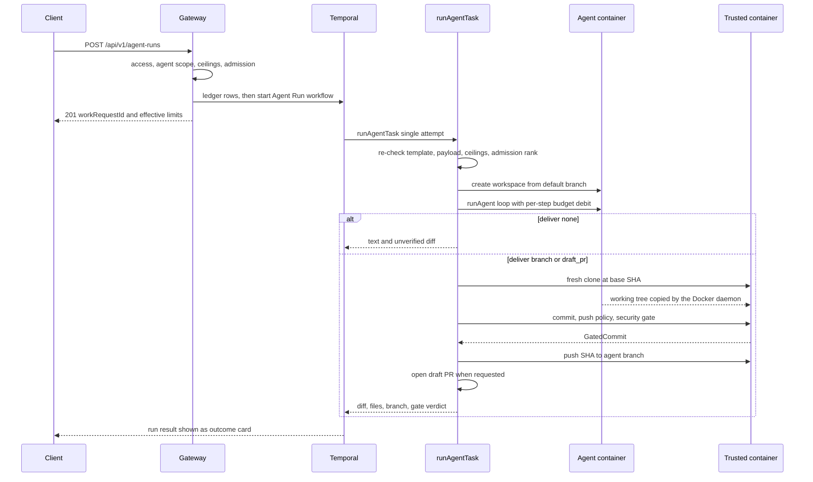
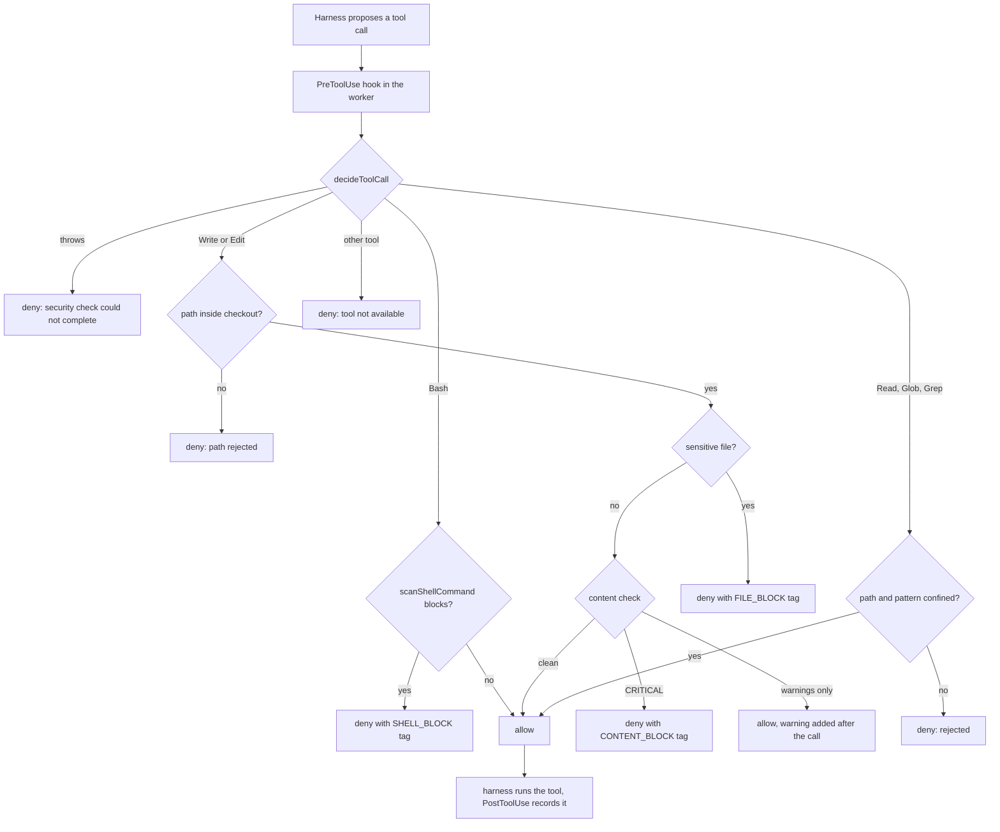

# Agent Runs and Implementer Runtimes

> Indexed at commit `ae416937` on 2026-10-03 · [view on GitHub](https://github.com/yorch/auto-swe/tree/ae416937)

## Relevant source files

- [docs/agent-runs.md](https://github.com/yorch/auto-swe/blob/ae416937/docs/agent-runs.md)
- [docs/agents.md](https://github.com/yorch/auto-swe/blob/ae416937/docs/agents.md)
- [packages/gateway/src/routes/agentRuns.ts](https://github.com/yorch/auto-swe/blob/ae416937/packages/gateway/src/routes/agentRuns.ts)
- [packages/gateway/src/lib/idempotency.ts](https://github.com/yorch/auto-swe/blob/ae416937/packages/gateway/src/lib/idempotency.ts)
- [packages/gateway/src/lib/systemTemplate.ts](https://github.com/yorch/auto-swe/blob/ae416937/packages/gateway/src/lib/systemTemplate.ts)
- [packages/shared/src/lib/agentRun.ts](https://github.com/yorch/auto-swe/blob/ae416937/packages/shared/src/lib/agentRun.ts)
- [packages/shared/src/lib/agentRunAdmission.ts](https://github.com/yorch/auto-swe/blob/ae416937/packages/shared/src/lib/agentRunAdmission.ts)
- [packages/shared/src/lib/agentRunFailure.ts](https://github.com/yorch/auto-swe/blob/ae416937/packages/shared/src/lib/agentRunFailure.ts)
- [packages/shared/src/lib/syncBuiltins.ts](https://github.com/yorch/auto-swe/blob/ae416937/packages/shared/src/lib/syncBuiltins.ts)
- [packages/shared/src/config/registry.ts](https://github.com/yorch/auto-swe/blob/ae416937/packages/shared/src/config/registry.ts)
- [packages/worker/src/activities/runAgentTask.ts](https://github.com/yorch/auto-swe/blob/ae416937/packages/worker/src/activities/runAgentTask.ts)
- [packages/worker/src/activities/agentRunFinalize.ts](https://github.com/yorch/auto-swe/blob/ae416937/packages/worker/src/activities/agentRunFinalize.ts)
- [packages/worker/src/activities/runAgent.ts](https://github.com/yorch/auto-swe/blob/ae416937/packages/worker/src/activities/runAgent.ts)
- [packages/worker/src/agents/agentRunTools.ts](https://github.com/yorch/auto-swe/blob/ae416937/packages/worker/src/agents/agentRunTools.ts)
- [packages/worker/src/lib/agentRunSlots.ts](https://github.com/yorch/auto-swe/blob/ae416937/packages/worker/src/lib/agentRunSlots.ts)
- [packages/worker/src/lib/stepAccounting.ts](https://github.com/yorch/auto-swe/blob/ae416937/packages/worker/src/lib/stepAccounting.ts)
- [packages/worker/src/workflows/proxyOptions.ts](https://github.com/yorch/auto-swe/blob/ae416937/packages/worker/src/workflows/proxyOptions.ts)
- [packages/worker/src/agents/implementerRuntime.ts](https://github.com/yorch/auto-swe/blob/ae416937/packages/worker/src/agents/implementerRuntime.ts)
- [packages/worker/src/agents/implementerRuntimeSelect.ts](https://github.com/yorch/auto-swe/blob/ae416937/packages/worker/src/agents/implementerRuntimeSelect.ts)
- [packages/worker/src/agents/claudeCode/runtime.ts](https://github.com/yorch/auto-swe/blob/ae416937/packages/worker/src/agents/claudeCode/runtime.ts)
- [packages/worker/src/agents/claudeCode/policy.ts](https://github.com/yorch/auto-swe/blob/ae416937/packages/worker/src/agents/claudeCode/policy.ts)
- [packages/worker/src/agents/claudeCode/binary.ts](https://github.com/yorch/auto-swe/blob/ae416937/packages/worker/src/agents/claudeCode/binary.ts)
- [packages/worker/src/activities/executeImplementation.ts](https://github.com/yorch/auto-swe/blob/ae416937/packages/worker/src/activities/executeImplementation.ts)
- [packages/worker/src/activities/implementerSession.ts](https://github.com/yorch/auto-swe/blob/ae416937/packages/worker/src/activities/implementerSession.ts)
- [packages/worker/src/activities/decomposition.ts](https://github.com/yorch/auto-swe/blob/ae416937/packages/worker/src/activities/decomposition.ts)
- [packages/worker/src/activities/evalHarness.ts](https://github.com/yorch/auto-swe/blob/ae416937/packages/worker/src/activities/evalHarness.ts)
- [packages/cli/src/commands/agent.ts](https://github.com/yorch/auto-swe/blob/ae416937/packages/cli/src/commands/agent.ts)
- [packages/web/src/components/agentRuns/AgentRunForm.tsx](https://github.com/yorch/auto-swe/blob/ae416937/packages/web/src/components/agentRuns/AgentRunForm.tsx)
- [packages/web/src/components/runs/AgentRunOutcomeCard.tsx](https://github.com/yorch/auto-swe/blob/ae416937/packages/web/src/components/runs/AgentRunOutcomeCard.tsx)

## Overview

Two features share this page because both sit on the worker's model-calling loop and both decide what an agent may do inside a Docker workspace. An **agent run** launches one library agent against one repository with no workflow authored around it: the platform wraps the launch in a hidden system template, runs the agent in a throwaway checkout, and, only if asked, publishes the result as a branch or a draft pull request after deterministic checks and the security gate. An **implementer runtime** is the loop that drives one implementer-family model turn: every such turn goes through `runImplementerTurn` over an `ImplementerRuntime`, and a run-pinned setting chooses between the platform's own Mastra tool loop and the Claude Code harness.

They are independent of each other. Agent runs call the generic `runAgent` activity, not `runImplementerTurn`, so `workspace.implementerRuntime` has no effect on them. What they have in common is the tool-level scanners and the tracer: the Mastra workspace tools used by an agent run, and the policy that guards the Claude Code harness, apply the same sensitive-file, pre-write content and shell-command checks.

This page is the code map. The behaviour, the trust boundary and the known risks are written up in [docs/agent-runs.md](https://github.com/yorch/auto-swe/blob/ae416937/docs/agent-runs.md) and [docs/agents.md](https://github.com/yorch/auto-swe/blob/ae416937/docs/agents.md) (section 3.7, Runtimes), which this page does not restate.

Sources: [packages/shared/src/lib/agentRun.ts:L12-L27](https://github.com/yorch/auto-swe/blob/ae416937/packages/shared/src/lib/agentRun.ts#L12-L27) [packages/worker/src/agents/workspaceTools.ts:L33-L45](https://github.com/yorch/auto-swe/blob/ae416937/packages/worker/src/agents/workspaceTools.ts#L33-L45) [packages/worker/src/agents/implementerRuntime.ts:L73-L83](https://github.com/yorch/auto-swe/blob/ae416937/packages/worker/src/agents/implementerRuntime.ts#L73-L83) [packages/worker/src/agents/implementerRuntimeSelect.ts:L37-L47](https://github.com/yorch/auto-swe/blob/ae416937/packages/worker/src/agents/implementerRuntimeSelect.ts#L37-L47)

## Implementation

### Part one: agent runs

#### What a run is

A launch is an ordinary `WorkflowRun` of a hidden GLOBAL system template named `Agent Run`. Its spec is `AGENT_RUN_SPEC`: a `step` node that calls the internal step `runAgentTask` with the prompt as its `task` input, then a `terminate` node that copies the step's output (text, diff, files, branch, gate verdict, pull request) into the run result ([agentRun.ts:L128-L168](https://github.com/yorch/auto-swe/blob/ae416937/packages/shared/src/lib/agentRun.ts#L128-L168)). The template is identified by a reserved name and a dedicated `system:agent-run` origin, and `isReservedTemplateOrigin` treats any `system:` prefix as reserved ([agentRun.ts:L12-L40](https://github.com/yorch/auto-swe/blob/ae416937/packages/shared/src/lib/agentRun.ts#L12-L40)).

`syncAgentRunTemplate` seeds it. It creates the row at version 1, appends a new version only when the stored spec differs from the code's, and leaves strictly alone a GLOBAL template of the same name that lacks the system origin, logging that agent runs are unavailable until it is renamed or removed ([syncBuiltins.ts:L280-L354](https://github.com/yorch/auto-swe/blob/ae416937/packages/shared/src/lib/syncBuiltins.ts#L280-L354)). The gateway hides it: `isSystemTemplate` matches a null team plus a `system:` origin, and `EXCLUDE_SYSTEM_TEMPLATES` is the `where` fragment that keeps it out of template queries ([systemTemplate.ts:L12-L27](https://github.com/yorch/auto-swe/blob/ae416937/packages/gateway/src/lib/systemTemplate.ts#L12-L27)). `runAgentTask` is registered in the step registry with `internal: true`, so it stays out of the palette, and `validateSpec` raises `INTERNAL_STEP` for any authored spec that names it unless the caller opts in ([stepRegistry.ts:L505-L516](https://github.com/yorch/auto-swe/blob/ae416937/packages/shared/src/workflow/stepRegistry.ts#L505-L516), [validateSpec.ts:L119-L126](https://github.com/yorch/auto-swe/blob/ae416937/packages/shared/src/workflow/validateSpec.ts#L119-L126), [validateSpec.ts:L199-L208](https://github.com/yorch/auto-swe/blob/ae416937/packages/shared/src/workflow/validateSpec.ts#L199-L208)).

Sources: [packages/shared/src/lib/agentRun.ts:L12-L168](https://github.com/yorch/auto-swe/blob/ae416937/packages/shared/src/lib/agentRun.ts#L12-L168) [packages/shared/src/lib/syncBuiltins.ts:L280-L354](https://github.com/yorch/auto-swe/blob/ae416937/packages/shared/src/lib/syncBuiltins.ts#L280-L354) [packages/gateway/src/lib/systemTemplate.ts:L1-L27](https://github.com/yorch/auto-swe/blob/ae416937/packages/gateway/src/lib/systemTemplate.ts#L1-L27) [packages/shared/src/workflow/stepRegistry.ts:L505-L516](https://github.com/yorch/auto-swe/blob/ae416937/packages/shared/src/workflow/stepRegistry.ts#L505-L516)

#### Launch and re-run routes

`agentRunRoutes` is registered under `/api/v1/agent-runs` ([index.ts:L294-L294](https://github.com/yorch/auto-swe/blob/ae416937/packages/gateway/src/index.ts#L294-L294)). Four routes exist, all behind `requireAuth({ requiredRole: 'ENGINEER' })`.

| Route | Purpose |
|---|---|
| `POST /` | Launch. Body: `agent` (`key` or `key@version`), `prompt` (up to 20,000 characters), `repoId`, `deliver`, optional `maxSteps` and `maxWallClockSeconds`, `budgetTier`. Accepts `Idempotency-Key` ([agentRuns.ts:L50-L61](https://github.com/yorch/auto-swe/blob/ae416937/packages/gateway/src/routes/agentRuns.ts#L50-L61), [agentRuns.ts:L550-L571](https://github.com/yorch/auto-swe/blob/ae416937/packages/gateway/src/routes/agentRuns.ts#L550-L571)) |
| `POST /:workRequestId/rerun` | Start a new run from a stored run's parameters ([agentRuns.ts:L573-L618](https://github.com/yorch/auto-swe/blob/ae416937/packages/gateway/src/routes/agentRuns.ts#L573-L618)) |
| `GET /agents` | Launchable agents for the form, optionally scoped to a `repoId` ([agentRuns.ts:L441-L499](https://github.com/yorch/auto-swe/blob/ae416937/packages/gateway/src/routes/agentRuns.ts#L441-L499)) |
| `GET /limits` | Ceilings, hard bounds, concurrency settings and an `enabled` flag ([agentRuns.ts:L501-L548](https://github.com/yorch/auto-swe/blob/ae416937/packages/gateway/src/routes/agentRuns.ts#L501-L548)) |

Launch and re-run share one pipeline, `launch`, so a re-run re-validates everything instead of replaying a stored decision ([agentRuns.ts:L103-L108](https://github.com/yorch/auto-swe/blob/ae416937/packages/gateway/src/routes/agentRuns.ts#L103-L108)). The pipeline runs these checks in order:

1. the agent key is not in `NON_LAUNCHABLE_AGENT_KEYS` (nine keys that back a platform mechanism, including `securityReview`, `evalJudge` and `channelAssistant`) ([agentRun.ts:L45-L67](https://github.com/yorch/auto-swe/blob/ae416937/packages/shared/src/lib/agentRun.ts#L45-L67), [agentRuns.ts:L116-L123](https://github.com/yorch/auto-swe/blob/ae416937/packages/gateway/src/routes/agentRuns.ts#L116-L123));
2. `validateRunConnection` applies repository access (owning team or a shared team), GitHub permission, and the organization's monthly cap, then the connection must be a git repository on an approved repository host ([agentRuns.ts:L125-L175](https://github.com/yorch/auto-swe/blob/ae416937/packages/gateway/src/routes/agentRuns.ts#L125-L175));
3. the agent must exist at GLOBAL or the repository's ORGANIZATION scope only, never TEAM, and a `key@version` pin is refused with `AGENT_PIN_SHADOWED` when an active organization override would win ([agentRuns.ts:L177-L218](https://github.com/yorch/auto-swe/blob/ae416937/packages/gateway/src/routes/agentRuns.ts#L177-L218));
4. a requested cap above a ceiling is refused with `CAP_EXCEEDS_CEILING` ([agentRuns.ts:L220-L252](https://github.com/yorch/auto-swe/blob/ae416937/packages/gateway/src/routes/agentRuns.ts#L220-L252));
5. the system template must be installed, else `503 AGENT_RUN_TEMPLATE_MISSING` ([agentRuns.ts:L254-L270](https://github.com/yorch/auto-swe/blob/ae416937/packages/gateway/src/routes/agentRuns.ts#L254-L270));
6. concurrency admission, answering `403 AGENT_RUNS_DISABLED` or `429 AGENT_RUN_CONCURRENCY_EXCEEDED` ([agentRuns.ts:L272-L308](https://github.com/yorch/auto-swe/blob/ae416937/packages/gateway/src/routes/agentRuns.ts#L272-L308)).

The route then writes the ledger rows and starts the workflow through `launchTrackedWorkflow`, with the `ActiveWorkflow` row first because the worker derives the run's team and organization from it, and answers `201` with `effective` (deliver, steps and seconds after clamping), the Temporal workflow id, and the `workRequestId` ([agentRuns.ts:L350-L402](https://github.com/yorch/auto-swe/blob/ae416937/packages/gateway/src/routes/agentRuns.ts#L350-L402)). The run is launched as its caller: `launchedById` is the user, which is what lets a saved per-user GitHub credential stand in for the platform one ([agentRuns.ts:L336-L348](https://github.com/yorch/auto-swe/blob/ae416937/packages/gateway/src/routes/agentRuns.ts#L336-L348)).

A re-run loads the stored `RunInput`, requires that its template is the system template and that its payload still parses, and calls `launch` with `budgetTier: 'STANDARD'`, so the tier is a fresh decision by whoever re-runs it ([agentRuns.ts:L576-L618](https://github.com/yorch/auto-swe/blob/ae416937/packages/gateway/src/routes/agentRuns.ts#L576-L618)). The generic `POST /work-requests/:id/retry` refuses an agent run with `409 USE_AGENT_RUN_RERUN`, because it would reuse the ticket id and so the branch name the first run pushed ([workRequests.ts:L852-L866](https://github.com/yorch/auto-swe/blob/ae416937/packages/gateway/src/routes/workRequests.ts#L852-L866)).

Sources: [packages/gateway/src/routes/agentRuns.ts:L40-L626](https://github.com/yorch/auto-swe/blob/ae416937/packages/gateway/src/routes/agentRuns.ts#L40-L626) [packages/gateway/src/routes/workRequests.ts:L852-L866](https://github.com/yorch/auto-swe/blob/ae416937/packages/gateway/src/routes/workRequests.ts#L852-L866)

#### Workflow id, ticket id, branch and idempotency

A run has no ticket, so the gateway mints one: `agentRunTicketId` returns `agent-` plus the 32 hex digits of the work request UUID, the whole value, so a branch collision cannot fail a push after the spend ([agentRun.ts:L93-L100](https://github.com/yorch/auto-swe/blob/ae416937/packages/shared/src/lib/agentRun.ts#L93-L100)). The branch is `<branchPrefix>/<ticket id>`, from `generateBranchName` at the gateway and the same expression in the worker ([workflowId.ts:L94-L96](https://github.com/yorch/auto-swe/blob/ae416937/packages/shared/src/lib/workflowId.ts#L94-L96), [runAgentTask.ts:L201-L202](https://github.com/yorch/auto-swe/blob/ae416937/packages/worker/src/activities/runAgentTask.ts#L201-L202)). `runAgentTask` rejects any ticket id that does not match `^agent-[0-9a-f]{32}$`, so a run can only publish under its own branch name ([runAgentTask.ts:L135-L140](https://github.com/yorch/auto-swe/blob/ae416937/packages/worker/src/activities/runAgentTask.ts#L135-L140)).

The Temporal workflow id depends on whether the caller sent an `Idempotency-Key`. Without one it is `agent-<repo8>-<random 32 hex>`. With one it is `workflowIdFromIdempotencyKey('agent', '<repo8>-<user8>', key)`, a length-prefixed SHA-256 digest truncated to 16 hex characters, scoped to the caller as well as the repository so one user's key can neither collide with another's nor reveal their run ([agentRuns.ts:L317-L325](https://github.com/yorch/auto-swe/blob/ae416937/packages/gateway/src/routes/agentRuns.ts#L317-L325), [idempotency.ts:L36-L52](https://github.com/yorch/auto-swe/blob/ae416937/packages/gateway/src/lib/idempotency.ts#L36-L52)). A second launch with the same key is reported as a duplicate by `launchTrackedWorkflow`, either from the unique ledger index or from Temporal refusing the workflow id, and answers `409 RUN_CONFLICT` ([workflowLaunch.ts:L115-L190](https://github.com/yorch/auto-swe/blob/ae416937/packages/gateway/src/lib/workflowLaunch.ts#L115-L190), [agentRuns.ts:L385-L387](https://github.com/yorch/auto-swe/blob/ae416937/packages/gateway/src/routes/agentRuns.ts#L385-L387)). The dashboard form keeps one key per distinct body, so a retry of identical values reuses it and any edit mints a new one ([agentRun.ts:L138-L170](https://github.com/yorch/auto-swe/blob/ae416937/packages/web/src/lib/agentRun.ts#L138-L170), [AgentRunForm.tsx:L86-L107](https://github.com/yorch/auto-swe/blob/ae416937/packages/web/src/components/agentRuns/AgentRunForm.tsx#L86-L107)).

Sources: [packages/shared/src/lib/agentRun.ts:L93-L100](https://github.com/yorch/auto-swe/blob/ae416937/packages/shared/src/lib/agentRun.ts#L93-L100) [packages/gateway/src/lib/idempotency.ts:L36-L52](https://github.com/yorch/auto-swe/blob/ae416937/packages/gateway/src/lib/idempotency.ts#L36-L52) [packages/gateway/src/routes/agentRuns.ts:L310-L402](https://github.com/yorch/auto-swe/blob/ae416937/packages/gateway/src/routes/agentRuns.ts#L310-L402) [packages/worker/src/activities/runAgentTask.ts:L74-L140](https://github.com/yorch/auto-swe/blob/ae416937/packages/worker/src/activities/runAgentTask.ts#L74-L140)

#### What `runAgentTask` does

`runAgentTask` is the authority; the gateway checks exist for error messages, because the template is reachable from other launch paths. It makes a single attempt (`RETRY_SINGLE_ATTEMPT`), since a retry would re-spend and could re-publish, with a heartbeat timeout of five minutes and a `startToCloseTimeout` of the setting's hard maximum (14,400 s) plus 7,200 s of headroom, which is only a backstop ([runnable.ts:L199-L210](https://github.com/yorch/auto-swe/blob/ae416937/packages/worker/src/workflows/runnable.ts#L199-L210), [proxyOptions.ts:L182-L202](https://github.com/yorch/auto-swe/blob/ae416937/packages/worker/src/workflows/proxyOptions.ts#L182-L202)). Its body runs in this order ([runAgentTask.ts:L94-L384](https://github.com/yorch/auto-swe/blob/ae416937/packages/worker/src/activities/runAgentTask.ts#L94-L384)):

1. **Identity.** The run's template must carry the system origin, the reserved name and a null team, and the ledger row must name the same repository as the request ([runAgentTask.ts:L98-L123](https://github.com/yorch/auto-swe/blob/ae416937/packages/worker/src/activities/runAgentTask.ts#L98-L123)).
2. **Payload.** `AgentRunPayloadSchema` is parsed again, the agent must still be launchable, and the ticket id must have the expected shape ([runAgentTask.ts:L125-L140](https://github.com/yorch/auto-swe/blob/ae416937/packages/worker/src/activities/runAgentTask.ts#L125-L140)).
3. **Bounds and admission.** The five agent-run settings and `workspace.maxToolOutputChars` are resolved with `{ orgId, teamId }` only, so a template scope can never override a ceiling. `decideAdmission` ranks the run among the live slots, and `clampToCeiling` produces the effective caps ([runAgentTask.ts:L142-L180](https://github.com/yorch/auto-swe/blob/ae416937/packages/worker/src/activities/runAgentTask.ts#L142-L180)).
4. **Agent resolution.** `resolveAgent` runs with the organization and the launch's version pin, and `assertModelPricedForUsdCap` refuses an unpriced model under a USD cap before any container exists ([runAgentTask.ts:L182-L195](https://github.com/yorch/auto-swe/blob/ae416937/packages/worker/src/activities/runAgentTask.ts#L182-L195)).
5. **Workspace and tools.** `createWorkspace` clones the default branch with the repository's executor image. `buildWorkspaceTools` builds the four tools and `selectAgentRunTools` keeps only the granted subset: `toolKeys: null` grants `readFile` and `listDirectory`, and a list grants exactly the workspace tools it names, so `[]` and `['mcp']` grant none ([runAgentTask.ts:L197-L234](https://github.com/yorch/auto-swe/blob/ae416937/packages/worker/src/activities/runAgentTask.ts#L197-L234), [agentRunTools.ts:L26-L48](https://github.com/yorch/auto-swe/blob/ae416937/packages/worker/src/agents/agentRunTools.ts#L26-L48)). MCP tools bind per the agent's own configuration ([runAgentTask.ts:L236-L248](https://github.com/yorch/auto-swe/blob/ae416937/packages/worker/src/activities/runAgentTask.ts#L236-L248)).
6. **The loop.** `runAgent` runs with `AbortSignal.timeout(maxWallClockSeconds)`, the clamped `maxSteps`, `perStepAccounting: true`, and the tracer shared with the tools ([runAgentTask.ts:L250-L262](https://github.com/yorch/auto-swe/blob/ae416937/packages/worker/src/activities/runAgentTask.ts#L250-L262)).
7. **Delivery.** With `deliver: 'none'` the result carries the agent's own `git diff`, labelled `diffVerified: false`. Otherwise a second, fresh workspace is created at the exact base SHA, `importAgentTree` copies the working tree across, `commitTrustedTree` commits it, `gateTrustedCommit` applies the policy and the gate, `pushGatedCommit` pushes by SHA, and for `draft_pr` the SCM provider opens a draft pull request ([runAgentTask.ts:L283-L376](https://github.com/yorch/auto-swe/blob/ae416937/packages/worker/src/activities/runAgentTask.ts#L283-L376)).
8. **Cleanup.** A `finally` closes MCP, persists the trace, and destroys both workspaces ([runAgentTask.ts:L377-L383](https://github.com/yorch/auto-swe/blob/ae416937/packages/worker/src/activities/runAgentTask.ts#L377-L383)).

The trust boundary lives in `agentRunFinalize.ts`. `GatedCommit` is a branded type whose only producer is `gateTrustedCommit`, and `pushGatedCommit` accepts nothing else, so an unchecked SHA does not type-check; it also re-checks that the commit belongs to the container, validates the branch name and SHA shape, and throws if the activity was cancelled ([agentRunFinalize.ts:L55-L79](https://github.com/yorch/auto-swe/blob/ae416937/packages/worker/src/activities/agentRunFinalize.ts#L55-L79), [agentRunFinalize.ts:L408-L441](https://github.com/yorch/auto-swe/blob/ae416937/packages/worker/src/activities/agentRunFinalize.ts#L408-L441)). `gateTrustedCommit` classifies the change, runs the deterministic push policy (`evaluatePushPolicy`), refuses a diff over 300,000 characters rather than truncating it, runs the advisory code scan, then the `securityReview` gate. Each refusal is a non-retryable `ApplicationFailure` with its own type ([agentRunFinalize.ts:L289-L405](https://github.com/yorch/auto-swe/blob/ae416937/packages/worker/src/activities/agentRunFinalize.ts#L289-L405), [agentRunPolicy.ts:L95-L188](https://github.com/yorch/auto-swe/blob/ae416937/packages/worker/src/lib/agentRunPolicy.ts#L95-L188)).

A delivery that publishes a draft pull request catches `DraftPullRequestUnsupportedError` and fails with `DRAFT_PR_UNSUPPORTED`, leaving the pushed branch in place, rather than opening a ready-for-review pull request ([runAgentTask.ts:L334-L364](https://github.com/yorch/auto-swe/blob/ae416937/packages/worker/src/activities/runAgentTask.ts#L334-L364)).

Sources: [packages/worker/src/activities/runAgentTask.ts:L90-L384](https://github.com/yorch/auto-swe/blob/ae416937/packages/worker/src/activities/runAgentTask.ts#L90-L384) [packages/worker/src/activities/agentRunFinalize.ts:L25-L441](https://github.com/yorch/auto-swe/blob/ae416937/packages/worker/src/activities/agentRunFinalize.ts#L25-L441) [packages/worker/src/agents/agentRunTools.ts:L1-L55](https://github.com/yorch/auto-swe/blob/ae416937/packages/worker/src/agents/agentRunTools.ts#L1-L55) [packages/worker/src/workflows/proxyOptions.ts:L182-L202](https://github.com/yorch/auto-swe/blob/ae416937/packages/worker/src/workflows/proxyOptions.ts#L182-L202)

#### Delivery modes

`AGENT_RUN_DELIVERIES` is `none`, `branch`, `draft_pr`, and every schema defaults to `none` ([agentRun.ts:L42-L43](https://github.com/yorch/auto-swe/blob/ae416937/packages/shared/src/lib/agentRun.ts#L42-L43), [agentRun.ts:L79-L85](https://github.com/yorch/auto-swe/blob/ae416937/packages/shared/src/lib/agentRun.ts#L79-L85)). The dashboard labels them "Show me the result", "Push a branch" and "Open a draft pull request" ([agentRun.ts:L10-L27](https://github.com/yorch/auto-swe/blob/ae416937/packages/web/src/lib/agentRun.ts#L10-L27)). The result sizes are bounded because the diff rides in the activity result, the step output and the terminate result, and Temporal rejects a payload over 2 MB: the carried diff is capped at 100,000 characters, the gated diff at 300,000, and the result lists at most 200 files with paths cut at 300 characters ([agentRun.ts:L102-L126](https://github.com/yorch/auto-swe/blob/ae416937/packages/shared/src/lib/agentRun.ts#L102-L126), [runAgentTask.ts:L401-L424](https://github.com/yorch/auto-swe/blob/ae416937/packages/worker/src/activities/runAgentTask.ts#L401-L424)).

Sources: [packages/shared/src/lib/agentRun.ts:L42-L126](https://github.com/yorch/auto-swe/blob/ae416937/packages/shared/src/lib/agentRun.ts#L42-L126) [packages/worker/src/activities/runAgentTask.ts:L392-L424](https://github.com/yorch/auto-swe/blob/ae416937/packages/worker/src/activities/runAgentTask.ts#L392-L424)

#### Ceilings, caps and settings

Five registry settings define the bounds. All require ADMIN, none is run-pinned, and a launch's own caps can only lower the two ceilings.

| Setting | Default | Range | Overridable at |
|---|---|---|---|
| `workspace.agentRunMaxSteps` | 50 | up to 500 | TEAM, ORGANIZATION |
| `workspace.agentRunMaxWallClockSeconds` | 1800 | 60 to 14,400 | TEAM, ORGANIZATION |
| `workspace.agentRunMaxConcurrentGlobal` | 4 | 0 to 100 (0 disables) | none |
| `workspace.agentRunMaxConcurrentPerTeam` | 2 | 0 to 100 (0 disables the team) | TEAM, ORGANIZATION |
| `workspace.agentRunAllowWorkflowChanges` | false | boolean | TEAM, ORGANIZATION |

([registry.ts:L384-L455](https://github.com/yorch/auto-swe/blob/ae416937/packages/shared/src/config/registry.ts#L384-L455).) The gateway rejects an over-ceiling cap and the worker clamps again with `clampToCeiling`, because a ceiling can drop between launch and start ([agentRun.ts:L88-L91](https://github.com/yorch/auto-swe/blob/ae416937/packages/shared/src/lib/agentRun.ts#L88-L91)). `AGENT_RUN_MAX_WALL_CLOCK_SECONDS` is the setting's schema maximum, and `proxyOptions.ts` repeats the number because workflow code runs in an isolate and cannot import it; a test pins the two ([agentRun.ts:L117-L123](https://github.com/yorch/auto-swe/blob/ae416937/packages/shared/src/lib/agentRun.ts#L117-L123), [proxyOptions.ts:L183-L185](https://github.com/yorch/auto-swe/blob/ae416937/packages/worker/src/workflows/proxyOptions.ts#L183-L185)).

Sources: [packages/shared/src/config/registry.ts:L384-L455](https://github.com/yorch/auto-swe/blob/ae416937/packages/shared/src/config/registry.ts#L384-L455) [packages/shared/src/lib/agentRun.ts:L88-L123](https://github.com/yorch/auto-swe/blob/ae416937/packages/shared/src/lib/agentRun.ts#L88-L123)

#### Admission and concurrency

`decideAdmission` is the worker's rule and it is a rank, not a count: of the in-flight slots sorted by launch time then workflow id, the oldest `global` are admitted and, within the run's team, the oldest `perTeam`. A run that cannot find itself in the list is refused as `unknown_run` (it fails closed), and `0` for either limit is `disabled` ([agentRunAdmission.ts:L46-L75](https://github.com/yorch/auto-swe/blob/ae416937/packages/shared/src/lib/agentRunAdmission.ts#L46-L75)). The gateway's friendlier `wouldAdmitNewRun` is a plain count ([agentRunAdmission.ts:L77-L92](https://github.com/yorch/auto-swe/blob/ae416937/packages/shared/src/lib/agentRunAdmission.ts#L77-L92)).

A ledger row holds a slot only while its workflow runs in Temporal. `reconcileAgentRunSlots` closes rows whose workflow is finished or missing, bounded by `RECONCILE_MAX_CHECKS` (8), `RECONCILE_LOOKUP_TIMEOUT_MS` (3 s), a five-minute grace for new rows and a one-minute recheck for rows already confirmed running. When Temporal cannot be asked the row keeps its slot. The gateway and the worker supply their own `isRunning` probes ([agentRunAdmission.ts:L142-L161](https://github.com/yorch/auto-swe/blob/ae416937/packages/shared/src/lib/agentRunAdmission.ts#L142-L161), [agentRunAdmission.ts:L234-L322](https://github.com/yorch/auto-swe/blob/ae416937/packages/shared/src/lib/agentRunAdmission.ts#L234-L322), [agentRunSlots.ts:L13-L54](https://github.com/yorch/auto-swe/blob/ae416937/packages/worker/src/lib/agentRunSlots.ts#L13-L54)).

Sources: [packages/shared/src/lib/agentRunAdmission.ts:L17-L335](https://github.com/yorch/auto-swe/blob/ae416937/packages/shared/src/lib/agentRunAdmission.ts#L17-L335) [packages/worker/src/lib/agentRunSlots.ts:L1-L54](https://github.com/yorch/auto-swe/blob/ae416937/packages/worker/src/lib/agentRunSlots.ts#L1-L54)

#### Traces, cost, budget and cancel

Agent runs record through the same `AgentTracer` as every activity. `runAgentTask` creates one tracer, hands it to the workspace tools and to `runAgent` (with `selfRecordingTools` naming the tools that record themselves so no call is logged twice), adds `agent_run.push_policy` and `git.commit_push` events, and persists in `finally` under the resolved agent key ([runAgentTask.ts:L207-L262](https://github.com/yorch/auto-swe/blob/ae416937/packages/worker/src/activities/runAgentTask.ts#L207-L262), [runAgentTask.ts:L377-L383](https://github.com/yorch/auto-swe/blob/ae416937/packages/worker/src/activities/runAgentTask.ts#L377-L383)).

Budget differs from the implementer family. With `perStepAccounting`, `createStepAccounting` debits every finished step to the run ledger through `recordLlmUsage` at the model the run resolved, then calls `assertBudgetAvailable`; a failure aborts the loop through a budget-stop controller and `throwIfBudgetOrCancelled` rethrows `BUDGET_EXCEEDED` after `generate` settles, because an aborted `generate` can resolve instead of throwing ([stepAccounting.ts:L50-L114](https://github.com/yorch/auto-swe/blob/ae416937/packages/worker/src/lib/stepAccounting.ts#L50-L114), [runAgent.ts:L176-L212](https://github.com/yorch/auto-swe/blob/ae416937/packages/worker/src/activities/runAgent.ts#L176-L212)). The merged abort signal combines the activity's cancellation signal, the wall-clock deadline and the budget stop, and `deadlineHit` separates a deadline (a partial result with `stoppedReason: 'wall_clock'`) from a cancellation (a failure) ([stepAccounting.ts:L50-L58](https://github.com/yorch/auto-swe/blob/ae416937/packages/worker/src/lib/stepAccounting.ts#L50-L58), [runAgent.ts:L205-L243](https://github.com/yorch/auto-swe/blob/ae416937/packages/worker/src/activities/runAgent.ts#L205-L243)). `max_steps` is reported when the finish reason is not `stop` and the step count reached the cap ([runAgent.ts:L235-L243](https://github.com/yorch/auto-swe/blob/ae416937/packages/worker/src/activities/runAgent.ts#L235-L243)).

Cancel is the generic run cancel route. It cancels the workflow in Temporal first and leaves the row `RUNNING` with a 502 if Temporal refuses ([workflowRuns.ts:L251-L330](https://github.com/yorch/auto-swe/blob/ae416937/packages/gateway/src/routes/workflowRuns.ts#L251-L330)). In the worker the cancellation reaches the activity through its heartbeat, `runAgentTask` calls `throwIfActivityCancelled` before the loop and before creating the trusted container, and `pushGatedCommit` checks again immediately before the push ([cancellation.ts:L1-L37](https://github.com/yorch/auto-swe/blob/ae416937/packages/worker/src/lib/cancellation.ts#L1-L37), [runAgentTask.ts:L250-L252](https://github.com/yorch/auto-swe/blob/ae416937/packages/worker/src/activities/runAgentTask.ts#L250-L252), [runAgentTask.ts:L296-L298](https://github.com/yorch/auto-swe/blob/ae416937/packages/worker/src/activities/runAgentTask.ts#L296-L298)).

Sources: [packages/worker/src/lib/stepAccounting.ts:L1-L114](https://github.com/yorch/auto-swe/blob/ae416937/packages/worker/src/lib/stepAccounting.ts#L1-L114) [packages/worker/src/activities/runAgent.ts:L28-L275](https://github.com/yorch/auto-swe/blob/ae416937/packages/worker/src/activities/runAgent.ts#L28-L275) [packages/gateway/src/routes/workflowRuns.ts:L251-L330](https://github.com/yorch/auto-swe/blob/ae416937/packages/gateway/src/routes/workflowRuns.ts#L251-L330) [packages/worker/src/lib/cancellation.ts:L1-L37](https://github.com/yorch/auto-swe/blob/ae416937/packages/worker/src/lib/cancellation.ts#L1-L37)

#### CLI

`auto-swe agent` dispatches from `index.ts` to `runAgentCommand`, which serves `agent run` and `agent rerun` ([index.ts:L111-L113](https://github.com/yorch/auto-swe/blob/ae416937/packages/cli/src/index.ts#L111-L113), [agent.ts:L67-L87](https://github.com/yorch/auto-swe/blob/ae416937/packages/cli/src/commands/agent.ts#L67-L87)). `agent run` takes the agent key and a prompt (or `--prompt=@file` / `-`), `--repo=<org/name>` (a UUID is also accepted) or `--repo-id`, `--deliver`, `--max-steps`, `--timeout`, `--budget`, `--idempotency-key` and `--wait` ([agent.ts:L14-L34](https://github.com/yorch/auto-swe/blob/ae416937/packages/cli/src/commands/agent.ts#L14-L34), [agent.ts:L147-L223](https://github.com/yorch/auto-swe/blob/ae416937/packages/cli/src/commands/agent.ts#L147-L223)). `agent rerun` posts to the re-run route ([agent.ts:L225-L241](https://github.com/yorch/auto-swe/blob/ae416937/packages/cli/src/commands/agent.ts#L225-L241)). `--wait` first polls `/workflow-runs?workRequestId=` until the run row exists, then polls the run to a terminal status and exits `0` only on `SUCCESS` and `2` otherwise, printing the agent text, branch, pull request link, changed files, and for `deliver: none` the diff marked as the agent's own unverified view ([agent.ts:L259-L337](https://github.com/yorch/auto-swe/blob/ae416937/packages/cli/src/commands/agent.ts#L259-L337)).

Sources: [packages/cli/src/commands/agent.ts:L14-L337](https://github.com/yorch/auto-swe/blob/ae416937/packages/cli/src/commands/agent.ts#L14-L337) [packages/cli/src/index.ts:L105-L113](https://github.com/yorch/auto-swe/blob/ae416937/packages/cli/src/index.ts#L105-L113)

#### Dashboard form and outcome card

`/agent-runs` renders `AgentRunForm` under the navigation label "Run an agent", visible to ENGINEER and above ([page.tsx:L7-L18](https://github.com/yorch/auto-swe/blob/ae416937/packages/web/src/app/agent-runs/page.tsx#L7-L18), [navigation.ts:L40-L41](https://github.com/yorch/auto-swe/blob/ae416937/packages/web/src/lib/navigation.ts#L40-L41)). Choosing a repository scopes the two read hooks, `useAgentRunAgents` and `useAgentRunLimits`, to it; the agents query is disabled until a repository is chosen ([useAgentRuns.ts:L12-L42](https://github.com/yorch/auto-swe/blob/ae416937/packages/web/src/hooks/useAgentRuns.ts#L12-L42)). The form validates caps against the reported ceilings before sending (`validateAgentRunForm`), builds the body with `buildLaunchBody`, and explains launch errors by code through `describeLaunchError` ([agentRun.ts:L85-L135](https://github.com/yorch/auto-swe/blob/ae416937/packages/web/src/lib/agentRun.ts#L85-L135), [agentRun.ts:L183-L200](https://github.com/yorch/auto-swe/blob/ae416937/packages/web/src/lib/agentRun.ts#L183-L200)). It does not offer a budget tier, so a dashboard launch is `STANDARD`. The repository picker requests up to 500 repositories ([AgentRunForm.tsx:L49-L49](https://github.com/yorch/auto-swe/blob/ae416937/packages/web/src/components/agentRuns/AgentRunForm.tsx#L49-L49)).

On the run page, the gateway computes `isAgentRun` from the template's null team and reserved origin, never from its display name ([workflowRuns.ts:L524-L530](https://github.com/yorch/auto-swe/blob/ae416937/packages/gateway/src/routes/workflowRuns.ts#L524-L530)). `RunOutcomeCard` delegates to `AgentRunOutcomeCard` for such a run ([RunOutcomeCard.tsx:L53-L62](https://github.com/yorch/auto-swe/blob/ae416937/packages/web/src/components/runs/RunOutcomeCard.tsx#L53-L62)). The card parses the stored result (`parseAgentRunOutcome`) and shows the gate verdict, a `diff verified` or `diff unverified` badge, the stop reason, the files changed, the branch, and a pull request link only when its URL is `https`; the diff is behind a disclosure ([AgentRunOutcomeCard.tsx:L20-L131](https://github.com/yorch/auto-swe/blob/ae416937/packages/web/src/components/runs/AgentRunOutcomeCard.tsx#L20-L131)). `RunMetaRail` runs `classifyAgentRunFailure` on the failed step's error, which keys on the leading `<TYPE>: ` token and never the message wording, and `useRunReRun` sends an agent run to its own re-run endpoint, asking for confirmation first when delivery was `branch`, `draft_pr` or unrecorded ([agentRunFailure.ts:L85-L94](https://github.com/yorch/auto-swe/blob/ae416937/packages/shared/src/lib/agentRunFailure.ts#L85-L94), [RunMetaRail.tsx:L48-L49](https://github.com/yorch/auto-swe/blob/ae416937/packages/web/src/components/runs/RunMetaRail.tsx#L48-L49), [useRunReRun.ts:L14-L60](https://github.com/yorch/auto-swe/blob/ae416937/packages/web/src/hooks/useRunReRun.ts#L14-L60), [agentRun.ts:L357-L369](https://github.com/yorch/auto-swe/blob/ae416937/packages/web/src/lib/agentRun.ts#L357-L369)).

Sources: [packages/web/src/app/agent-runs/page.tsx:L1-L18](https://github.com/yorch/auto-swe/blob/ae416937/packages/web/src/app/agent-runs/page.tsx#L1-L18) [packages/web/src/hooks/useAgentRuns.ts:L1-L88](https://github.com/yorch/auto-swe/blob/ae416937/packages/web/src/hooks/useAgentRuns.ts#L1-L88) [packages/web/src/components/runs/AgentRunOutcomeCard.tsx:L1-L150](https://github.com/yorch/auto-swe/blob/ae416937/packages/web/src/components/runs/AgentRunOutcomeCard.tsx#L1-L150) [packages/web/src/hooks/useRunReRun.ts:L1-L66](https://github.com/yorch/auto-swe/blob/ae416937/packages/web/src/hooks/useRunReRun.ts#L1-L66)

### Part two: implementer runtimes

#### `runImplementerTurn` and what it centralises

`runImplementerTurn` is the one place that wraps a model turn with the bookkeeping every caller owes it. It calls `turn.runtime.runTurn({ system, user })`, then for each model that spent tokens calls `recordLlmUsage` (usage is `outcome.usageByModel` when the runtime reports it, else `outcome.usage` priced at `boundModelSpec`), summing the attributions; then `recordSuspiciousLlmOutput`, the advisory output scan; then `tracer.addLlmResponse`, which writes the row carrying the prompt, the cost, the model and either the text or the tool-call count ([implementerRuntime.ts:L83-L131](https://github.com/yorch/auto-swe/blob/ae416937/packages/worker/src/agents/implementerRuntime.ts#L83-L131)). The caller keeps `assertBudgetAvailable`, which must run before the call and must not be traced as a model call, and any failure row; an error from the runtime or the budget check propagates untouched ([implementerRuntime.ts:L73-L82](https://github.com/yorch/auto-swe/blob/ae416937/packages/worker/src/agents/implementerRuntime.ts#L73-L82)).

Sources: [packages/worker/src/agents/implementerRuntime.ts:L54-L131](https://github.com/yorch/auto-swe/blob/ae416937/packages/worker/src/agents/implementerRuntime.ts#L54-L131) [packages/worker/src/lib/llmOutputScan.ts:L12-L32](https://github.com/yorch/auto-swe/blob/ae416937/packages/worker/src/lib/llmOutputScan.ts#L12-L32)

#### The `ImplementerRuntime` interface and the Mastra runtime

`ImplementerRuntime` has one method, `runTurn({ system, user })`, returning an `ImplementerTurnOutcome`: optional `text`, a `toolCallCount`, `usage`, and `usageByModel` for a runtime whose turn can span several models ([implementerRuntime.ts:L8-L30](https://github.com/yorch/auto-swe/blob/ae416937/packages/worker/src/agents/implementerRuntime.ts#L8-L30)). `mastraRuntime(agent, maxSteps)` is the Mastra implementation: it calls `agent.generate` with a system and a user message, `maxSteps`, `toolChoice: 'auto'` and the activity's abort signal, and reports `result.steps.length` as the tool-call count ([implementerRuntime.ts:L32-L52](https://github.com/yorch/auto-swe/blob/ae416937/packages/worker/src/agents/implementerRuntime.ts#L32-L52)). `maxSteps` is `workspace.agentMaxSteps`, because Mastra otherwise stops a turn after five steps ([registry.ts:L370-L383](https://github.com/yorch/auto-swe/blob/ae416937/packages/shared/src/config/registry.ts#L370-L383)).

Sources: [packages/worker/src/agents/implementerRuntime.ts:L8-L52](https://github.com/yorch/auto-swe/blob/ae416937/packages/worker/src/agents/implementerRuntime.ts#L8-L52)

#### Choosing the runtime

`selectImplementerRuntime` reads `workspace.implementerRuntime` through `resolveSetting` and returns the runtime together with the prompt suffix it needs. For `mastra` it returns `mastraRuntime` and the caller's own suffix. For `claude-code` it returns `claudeCodeRuntime` and the skills as inline text (`skillsToPromptSuffix`), because the harness has no `loadSkill` tool ([implementerRuntimeSelect.ts:L37-L78](https://github.com/yorch/auto-swe/blob/ae416937/packages/worker/src/agents/implementerRuntimeSelect.ts#L37-L78)). The harness runs on the same Agent row and decrypted credential the Mastra runtime would use. `resolveClaudeCodeAccess` requires an `anthropic/` model and otherwise throws a non-retryable `HARNESS_UNSUPPORTED_MODEL` ([implementerRuntimeSelect.ts:L12-L35](https://github.com/yorch/auto-swe/blob/ae416937/packages/worker/src/agents/implementerRuntimeSelect.ts#L12-L35)). The runtime is built with `loadProjectSettings: true` and `maxTurns` set to the same step budget ([implementerRuntimeSelect.ts:L65-L77](https://github.com/yorch/auto-swe/blob/ae416937/packages/worker/src/agents/implementerRuntimeSelect.ts#L65-L77)).

The setting is `ADMIN`-only, defaults to `mastra`, accepts `mastra` or `claude-code`, is overridable at WORKFLOW_TEMPLATE, TEAM and ORGANIZATION, and is `runPinned: true` ([registry.ts:L473-L488](https://github.com/yorch/auto-swe/blob/ae416937/packages/shared/src/config/registry.ts#L473-L488)). Run pinning means the value is captured once into `WorkflowRun.pinnedSettings` by `snapshotPinnedSettings` when the run is created, and `resolveSetting` then returns the pinned value, reported with source `PINNED`, on every later read in that run ([templates.ts:L223-L229](https://github.com/yorch/auto-swe/blob/ae416937/packages/worker/src/activities/templates.ts#L223-L229), [resolveSetting.ts:L133-L160](https://github.com/yorch/auto-swe/blob/ae416937/packages/shared/src/config/resolveSetting.ts#L133-L160), [resolveSetting.ts:L228-L240](https://github.com/yorch/auto-swe/blob/ae416937/packages/shared/src/config/resolveSetting.ts#L228-L240)). The pinned snapshot reaches activities through `currentRequestContext` ([contextLookup.ts:L40-L80](https://github.com/yorch/auto-swe/blob/ae416937/packages/worker/src/lib/config/contextLookup.ts#L40-L80)).

Sources: [packages/worker/src/agents/implementerRuntimeSelect.ts:L1-L78](https://github.com/yorch/auto-swe/blob/ae416937/packages/worker/src/agents/implementerRuntimeSelect.ts#L1-L78) [packages/shared/src/config/registry.ts:L473-L488](https://github.com/yorch/auto-swe/blob/ae416937/packages/shared/src/config/registry.ts#L473-L488) [packages/shared/src/config/resolveSetting.ts:L133-L160](https://github.com/yorch/auto-swe/blob/ae416937/packages/shared/src/config/resolveSetting.ts#L133-L160)

#### Which activities route through it

Four code paths call `selectImplementerRuntime` once and `runImplementerTurn` per turn:

| Caller | Agent key | Turn call |
|---|---|---|
| `executeImplementation`, the TDD loop | `implementer` | one turn per iteration ([executeImplementation.ts:L182-L197](https://github.com/yorch/auto-swe/blob/ae416937/packages/worker/src/activities/executeImplementation.ts#L182-L197), [executeImplementation.ts:L329-L338](https://github.com/yorch/auto-swe/blob/ae416937/packages/worker/src/activities/executeImplementation.ts#L329-L338)) |
| `runImplementerFixSession`, used by `executeCIFixImplementation`, `executeReviewFixImplementation` and the gate fix in `qualityGates.ts` | `ciFixer`, `reviewFixer`, `gateFixer` | one turn per session ([implementerSession.ts:L166-L203](https://github.com/yorch/auto-swe/blob/ae416937/packages/worker/src/activities/implementerSession.ts#L166-L203), [ciFixLoop.ts:L36-L76](https://github.com/yorch/auto-swe/blob/ae416937/packages/worker/src/activities/ciFixLoop.ts#L36-L76), [qualityGates.ts:L309-L338](https://github.com/yorch/auto-swe/blob/ae416937/packages/worker/src/activities/qualityGates.ts#L309-L338)) |
| The merge-conflict resolver in `decomposition.ts` | `mergeConflictResolver` | one turn per resolver attempt ([decomposition.ts:L531-L575](https://github.com/yorch/auto-swe/blob/ae416937/packages/worker/src/activities/decomposition.ts#L531-L575)) |
| The eval harness replay | the agent under evaluation | chosen once per case, one turn per iteration ([evalHarness.ts:L199-L235](https://github.com/yorch/auto-swe/blob/ae416937/packages/worker/src/activities/evalHarness.ts#L199-L235)) |

Each caller builds its Mastra agent first, through `buildImplementerForActivity` or `createImplementerAgent`, and then asks the selector for the runtime; the selector's `agent` parameter is unused under the harness ([implementerRuntimeSelect.ts:L45-L56](https://github.com/yorch/auto-swe/blob/ae416937/packages/worker/src/agents/implementerRuntimeSelect.ts#L45-L56)). The outer loop around the turn is unchanged by the runtime: tests, commit, push and diff scans stay in the activity.

Sources: [packages/worker/src/activities/executeImplementation.ts:L176-L345](https://github.com/yorch/auto-swe/blob/ae416937/packages/worker/src/activities/executeImplementation.ts#L176-L345) [packages/worker/src/activities/implementerSession.ts:L160-L203](https://github.com/yorch/auto-swe/blob/ae416937/packages/worker/src/activities/implementerSession.ts#L160-L203) [packages/worker/src/activities/decomposition.ts:L521-L575](https://github.com/yorch/auto-swe/blob/ae416937/packages/worker/src/activities/decomposition.ts#L521-L575) [packages/worker/src/activities/evalHarness.ts:L195-L245](https://github.com/yorch/auto-swe/blob/ae416937/packages/worker/src/activities/evalHarness.ts#L195-L245)

#### The Claude Code runtime

`claudeCodeRuntime(options)` returns an `ImplementerRuntime` bound to one workspace. The Claude Agent SDK is imported lazily and runs in the worker; the `claude` binary runs in the workspace container and is started by the SDK's `spawnClaudeCodeProcess` option as `docker exec -i` with a working directory, an exec tag, `ANTHROPIC_BASE_URL`, a harness `HOME`, and `ANTHROPIC_API_KEY` named without a value so docker reads it from the worker's environment and it never appears on a command line ([runtime.ts:L135-L153](https://github.com/yorch/auto-swe/blob/ae416937/packages/worker/src/agents/claudeCode/runtime.ts#L135-L153), [runtime.ts:L305-L383](https://github.com/yorch/auto-swe/blob/ae416937/packages/worker/src/agents/claudeCode/runtime.ts#L305-L383)).

The first turn calls `prepareContainer` once per workspace. It probes the container's architecture and libc, resolves the matching native binary from the SDK's per-platform optional package (`@anthropic-ai/claude-agent-sdk-linux-<arch>[-musl]`), installs `bash` on Alpine because Claude Code's shell tool needs it, and `docker cp`s the binary into `/workspace/.harness`, beside the checkout so `git add -A` can never sweep it into a commit. A missing platform, shell or binary raises a non-retryable `HARNESS_UNSUPPORTED_PLATFORM`, `HARNESS_NO_SHELL` or `HARNESS_BINARY_MISSING` ([runtime.ts:L82-L112](https://github.com/yorch/auto-swe/blob/ae416937/packages/worker/src/agents/claudeCode/runtime.ts#L82-L112), [binary.ts:L13-L65](https://github.com/yorch/auto-swe/blob/ae416937/packages/worker/src/agents/claudeCode/binary.ts#L13-L65)). Turns after the first pass the saved `session_id` as `resume`, so a TDD loop keeps its context and prompt cache ([runtime.ts:L144-L147](https://github.com/yorch/auto-swe/blob/ae416937/packages/worker/src/agents/claudeCode/runtime.ts#L144-L147), [runtime.ts:L385-L391](https://github.com/yorch/auto-swe/blob/ae416937/packages/worker/src/agents/claudeCode/runtime.ts#L385-L391)).

Options set the run's shape: `permissionMode: 'default'` with hook decisions as the grant, `settingSources: ['project']` so the repository's own `CLAUDE.md` and `.claude` settings apply, `settings.env.ANTHROPIC_BASE_URL` in the highest-priority layer so a repository setting cannot redirect the key, the tool list `HARNESS_TOOLS`, and `canUseTool` returning deny so anything the hook did not grant is refused because nobody is attending ([runtime.ts:L315-L338](https://github.com/yorch/auto-swe/blob/ae416937/packages/worker/src/agents/claudeCode/runtime.ts#L315-L338), [runtime.ts:L378-L379](https://github.com/yorch/auto-swe/blob/ae416937/packages/worker/src/agents/claudeCode/runtime.ts#L378-L379)). A system prompt over 100,000 characters is staged as a file in the container and the prompt points at it, because the argument travels on a command line ([runtime.ts:L34-L40](https://github.com/yorch/auto-swe/blob/ae416937/packages/worker/src/agents/claudeCode/runtime.ts#L34-L40), [runtime.ts:L307-L313](https://github.com/yorch/auto-swe/blob/ae416937/packages/worker/src/agents/claudeCode/runtime.ts#L307-L313)).

Usage is reported by the harness as running totals per model. `usageSince` records the change since the last turn (a total that goes backwards counts whole), folds cache reads and writes into the input total the budget meters, reports them separately for pricing, prices each model at `anthropic/<model>`, and sorts largest-output first ([runtime.ts:L158-L198](https://github.com/yorch/auto-swe/blob/ae416937/packages/worker/src/agents/claudeCode/runtime.ts#L158-L198)). The `finally` block kills every process carrying the turn's exec tag, because `docker exec` does not stop what it started when its client dies ([runtime.ts:L422-L427](https://github.com/yorch/auto-swe/blob/ae416937/packages/worker/src/agents/claudeCode/runtime.ts#L422-L427)). Errors map to Temporal failures: HTTP 401 or 403 becomes the non-retryable `HARNESS_AUTH_FAILURE`, `error_max_turns` ends the turn without failing it (as the Mastra loop stops at its step budget), and any other non-success result throws ([runtime.ts:L114-L125](https://github.com/yorch/auto-swe/blob/ae416937/packages/worker/src/agents/claudeCode/runtime.ts#L114-L125), [runtime.ts:L397-L415](https://github.com/yorch/auto-swe/blob/ae416937/packages/worker/src/agents/claudeCode/runtime.ts#L397-L415)).

Sources: [packages/worker/src/agents/claudeCode/runtime.ts:L23-L431](https://github.com/yorch/auto-swe/blob/ae416937/packages/worker/src/agents/claudeCode/runtime.ts#L23-L431) [packages/worker/src/agents/claudeCode/binary.ts:L1-L65](https://github.com/yorch/auto-swe/blob/ae416937/packages/worker/src/agents/claudeCode/binary.ts#L1-L65)

#### The PreToolUse policy

Every tool call is decided in the worker, before the harness runs it, by `decideToolCall`. The SDK's `PreToolUse` hook calls it and answers the harness with an `allow` or `deny` permission decision. A `deny` also records a tool-call row with the refusal text and the security tag; an `allow` with a warning stores the warning so the `PostToolUse` hook can attach it as additional context to the tool result and tag the recorded call ([runtime.ts:L219-L302](https://github.com/yorch/auto-swe/blob/ae416937/packages/worker/src/agents/claudeCode/runtime.ts#L219-L302)). Because the policy runs in the worker, nothing the agent does inside the container can edit it.

| Tool | Decision |
|---|---|
| `Bash` | audit log line with the command redacted, then `scanShellCommand`; a block is a deny tagged `SHELL_BLOCK` |
| `Write`, `Edit` | the path must stay inside `/workspace/target-repo`; `checkSensitiveFilePath` is a hard deny tagged `FILE_BLOCK`; `checkContentSecurity` denies tagged `CONTENT_BLOCK` or allows with a `CONTENT_WARN` warning. `Edit` is checked on `new_string` only |
| `Read` | the path must be inside the checkout or the harness's own `.claude` directory |
| `Glob`, `Grep` | the pattern must be relative with no `..`; the search path follows the `Read` rule |
| anything else | denied: the tool is not available in this workspace |

([policy.ts:L84-L149](https://github.com/yorch/auto-swe/blob/ae416937/packages/worker/src/agents/claudeCode/policy.ts#L84-L149).) `HARNESS_TOOLS` lists the six tools the harness is given, `Read`, `Write`, `Edit`, `Bash`, `Glob`, `Grep`; web fetch, sub-agents and plugin tools are not offered ([policy.ts:L8-L14](https://github.com/yorch/auto-swe/blob/ae416937/packages/worker/src/agents/claudeCode/policy.ts#L8-L14)). The tags come from `SECURITY_TRACE_ERRORS`, the same strings the Mastra tools write, so the security-events view counts harness refusals and warnings alongside them ([policy.ts:L2-L2](https://github.com/yorch/auto-swe/blob/ae416937/packages/worker/src/agents/claudeCode/policy.ts#L2-L2)).

Refusals are tagged on the trace row for the denied call (`error` is the policy's security tag, or `blocked by workspace policy` for an untagged denial). A scanner that cannot complete fails closed twice over: the blocking scanners return a block message when they cannot scan, and `preToolUse` wraps `decideToolCall` in a `try`/`catch` that turns any throw into a deny, with the message that the security check could not complete ([runtime.ts:L223-L252](https://github.com/yorch/auto-swe/blob/ae416937/packages/worker/src/agents/claudeCode/runtime.ts#L223-L252), [policy.ts:L81-L83](https://github.com/yorch/auto-swe/blob/ae416937/packages/worker/src/agents/claudeCode/policy.ts#L81-L83)).

Sources: [packages/worker/src/agents/claudeCode/policy.ts:L1-L149](https://github.com/yorch/auto-swe/blob/ae416937/packages/worker/src/agents/claudeCode/policy.ts#L1-L149) [packages/worker/src/agents/claudeCode/runtime.ts:L219-L302](https://github.com/yorch/auto-swe/blob/ae416937/packages/worker/src/agents/claudeCode/runtime.ts#L219-L302)

#### What stays outside the runtime

The runtime only drives the loop. Everything that makes the turn governed stays in `runImplementerTurn` and its callers: budget pre-checks, the test run, the commit and push, the diff scans, and failure rows. Model-calling code outside this seam calls `agent.generate` itself or goes through `runAgent`: the planner, the decomposer, the review network, the security-review processor, memory commit and lesson consolidation, the channel activities, the generic agent node, and agent runs ([reviewNetwork.ts:L86-L86](https://github.com/yorch/auto-swe/blob/ae416937/packages/worker/src/agents/reviewNetwork.ts#L86-L86), [plannerAgent.ts:L60-L60](https://github.com/yorch/auto-swe/blob/ae416937/packages/worker/src/agents/plannerAgent.ts#L60-L60), [securityReviewProcessor.ts:L66-L66](https://github.com/yorch/auto-swe/blob/ae416937/packages/worker/src/agents/securityReviewProcessor.ts#L66-L66), [runAgent.ts:L188-L199](https://github.com/yorch/auto-swe/blob/ae416937/packages/worker/src/activities/runAgent.ts#L188-L199)). `workspace.implementerRuntime` does not reach any of them.

Sources: [packages/worker/src/agents/implementerRuntime.ts:L73-L83](https://github.com/yorch/auto-swe/blob/ae416937/packages/worker/src/agents/implementerRuntime.ts#L73-L83) [packages/worker/src/activities/runAgent.ts:L176-L200](https://github.com/yorch/auto-swe/blob/ae416937/packages/worker/src/activities/runAgent.ts#L176-L200)

## Diagram

The first diagram follows one agent run from launch to outcome. The second is the decision `decideToolCall` makes for each Claude Code tool call.





Sources: [packages/gateway/src/routes/agentRuns.ts:L108-L403](https://github.com/yorch/auto-swe/blob/ae416937/packages/gateway/src/routes/agentRuns.ts#L108-L403) [packages/worker/src/activities/runAgentTask.ts:L94-L384](https://github.com/yorch/auto-swe/blob/ae416937/packages/worker/src/activities/runAgentTask.ts#L94-L384) [packages/worker/src/agents/claudeCode/policy.ts:L84-L149](https://github.com/yorch/auto-swe/blob/ae416937/packages/worker/src/agents/claudeCode/policy.ts#L84-L149) [packages/worker/src/agents/claudeCode/runtime.ts:L219-L262](https://github.com/yorch/auto-swe/blob/ae416937/packages/worker/src/agents/claudeCode/runtime.ts#L219-L262)

## Usage

Launch from the API, the CLI or the dashboard; each call lands on `POST /api/v1/agent-runs`.

```bash
auto-swe agent run contentWriter "Draft release notes for v2" --repo=acme/payments-api --deliver=draft_pr --wait
auto-swe agent rerun <workRequestId> --wait
```

Inside the worker, a new implementer-family activity adopts the seam by building its Mastra agent, calling `selectImplementerRuntime` to get the runtime and the prompt suffix, calling `assertBudgetAvailable`, then `runImplementerTurn`, as the existing callers do ([implementerSession.ts:L166-L203](https://github.com/yorch/auto-swe/blob/ae416937/packages/worker/src/activities/implementerSession.ts#L166-L203)). An operator switches the loop with `workspace.implementerRuntime` at `/govern/platform-settings`; the value applies to runs that start after the change, because it is pinned at run start.

Sources: [packages/cli/src/commands/agent.ts:L14-L34](https://github.com/yorch/auto-swe/blob/ae416937/packages/cli/src/commands/agent.ts#L14-L34) [packages/worker/src/activities/implementerSession.ts:L166-L203](https://github.com/yorch/auto-swe/blob/ae416937/packages/worker/src/activities/implementerSession.ts#L166-L203) [packages/shared/src/config/registry.ts:L473-L488](https://github.com/yorch/auto-swe/blob/ae416937/packages/shared/src/config/registry.ts#L473-L488)

## Limitations

These are gaps read from the code at this commit. The living docs hold a longer list of risks (the harness credential inside the container, MCP next to a workspace, CI on pushed branches, and others); see [docs/agent-runs.md](https://github.com/yorch/auto-swe/blob/ae416937/docs/agent-runs.md) and [docs/agents.md](https://github.com/yorch/auto-swe/blob/ae416937/docs/agents.md).

- **Usage from a turn that throws is not accrued by `runImplementerTurn`.** The function has no `try`/`catch` around `runTurn`, so when the harness or the Mastra loop fails after spending, `recordLlmUsage` never runs for that turn. The only `claude-code` exception is `error_max_turns`, which returns normally ([implementerRuntime.ts:L83-L91](https://github.com/yorch/auto-swe/blob/ae416937/packages/worker/src/agents/implementerRuntime.ts#L83-L91), [runtime.ts:L397-L421](https://github.com/yorch/auto-swe/blob/ae416937/packages/worker/src/agents/claudeCode/runtime.ts#L397-L421)). Agent runs are the contrast: they debit per step.
- **The Mastra agent is built, and its MCP client opened, even when the harness runs the turn.** Callers build the agent before they ask for a runtime, and the selector ignores it under `claude-code`; the MCP connection is then opened and closed with nothing using it ([executeImplementation.ts:L182-L197](https://github.com/yorch/auto-swe/blob/ae416937/packages/worker/src/activities/executeImplementation.ts#L182-L197), [implementerRuntimeSelect.ts:L45-L56](https://github.com/yorch/auto-swe/blob/ae416937/packages/worker/src/agents/implementerRuntimeSelect.ts#L45-L56)).
- **Harness path confinement is textual.** `within` resolves paths lexically with `path.posix`, and the worker cannot read the container's filesystem, so a symlink that already exists in the checkout and points outside it is not seen. `Bash` has no path confinement at all and is covered only by the shell-command scanner ([policy.ts:L34-L41](https://github.com/yorch/auto-swe/blob/ae416937/packages/worker/src/agents/claudeCode/policy.ts#L34-L41), [policy.ts:L89-L100](https://github.com/yorch/auto-swe/blob/ae416937/packages/worker/src/agents/claudeCode/policy.ts#L89-L100)).
- **`Edit` content is checked on the inserted fragment.** The pre-write check sees `new_string`, not the file that results, so a rule that matches across the edit boundary does not fire ([policy.ts:L112-L113](https://github.com/yorch/auto-swe/blob/ae416937/packages/worker/src/agents/claudeCode/policy.ts#L112-L113)).
- **A turn that reaches the harness's turn cap returns no text.** On `error_max_turns` the outcome's `text` is `undefined` and only the tool-call count is traced ([runtime.ts:L417-L421](https://github.com/yorch/auto-swe/blob/ae416937/packages/worker/src/agents/claudeCode/runtime.ts#L417-L421), [implementerRuntime.ts:L125-L125](https://github.com/yorch/auto-swe/blob/ae416937/packages/worker/src/agents/implementerRuntime.ts#L125-L125)).
- **A failed container preparation is cached for the life of the runtime.** `prepared` holds the promise from the first turn, so a rejected `prepareContainer` rejects every later turn of that runtime without retrying ([runtime.ts:L156-L202](https://github.com/yorch/auto-swe/blob/ae416937/packages/worker/src/agents/claudeCode/runtime.ts#L156-L202)).
- **The runtime setting does not reach agent runs.** Agent runs always use the Mastra loop through `runAgent`, with the workspace tools the agent's `toolKeys` name ([runAgentTask.ts:L250-L262](https://github.com/yorch/auto-swe/blob/ae416937/packages/worker/src/activities/runAgentTask.ts#L250-L262)).
- **A re-run is not bound to its original launcher.** The route requires the run to be of the system template and its payload to parse, and the launch pipeline re-checks the caller's own access to the repository; any ENGINEER who can reach the repository and knows the work request id can re-run it with the stored prompt ([agentRuns.ts:L576-L618](https://github.com/yorch/auto-swe/blob/ae416937/packages/gateway/src/routes/agentRuns.ts#L576-L618)).
- **The step and time hard bounds are written as literals at the gateway.** The launch body schema hard-codes 500 steps and 14,400 seconds, and `MAX_STEPS_HARD` and `MIN_WALL_CLOCK_SECONDS` repeat bounds the shared payload schema and the registry also state, so a change to a hard bound has to be made in several places ([agentRuns.ts:L50-L65](https://github.com/yorch/auto-swe/blob/ae416937/packages/gateway/src/routes/agentRuns.ts#L50-L65), [agentRun.ts:L79-L85](https://github.com/yorch/auto-swe/blob/ae416937/packages/shared/src/lib/agentRun.ts#L79-L85)).
- **The workflow cost estimator has no hint for `runAgentTask`.** The step is registered without a `costHint`, and a node without one contributes zero, so an estimate for the system template is empty ([stepRegistry.ts:L505-L516](https://github.com/yorch/auto-swe/blob/ae416937/packages/shared/src/workflow/stepRegistry.ts#L505-L516), [costEstimator.ts:L1-L20](https://github.com/yorch/auto-swe/blob/ae416937/packages/shared/src/workflow/costEstimator.ts#L1-L20)).

Sources: [packages/worker/src/agents/implementerRuntime.ts:L83-L131](https://github.com/yorch/auto-swe/blob/ae416937/packages/worker/src/agents/implementerRuntime.ts#L83-L131) [packages/worker/src/agents/claudeCode/runtime.ts:L147-L431](https://github.com/yorch/auto-swe/blob/ae416937/packages/worker/src/agents/claudeCode/runtime.ts#L147-L431) [packages/worker/src/agents/claudeCode/policy.ts:L34-L149](https://github.com/yorch/auto-swe/blob/ae416937/packages/worker/src/agents/claudeCode/policy.ts#L34-L149) [packages/gateway/src/routes/agentRuns.ts:L50-L65](https://github.com/yorch/auto-swe/blob/ae416937/packages/gateway/src/routes/agentRuns.ts#L50-L65)

## Related Pages

- Parent: [Temporal Worker](./4-temporal-worker.md)
- Sibling: [Temporal Workflows](./4.1-temporal-workflows.md)
- Sibling: [Activities](./4.2-activities.md)
- Sibling: [Agent Layer](./4.3-agent-layer.md)
- Sibling: [Docker Workspaces](./4.4-docker-workspaces.md)
- Sibling: [Observability and Cost](./4.5-observability-and-cost.md)
- Related: [Configuration and Settings](./2.3-configuration-and-settings.md)
- Related: [Skills and Security Scanners](./2.4-skills-and-security-scanners.md)
- Related: [HTTP Routes](./3.1-http-routes.md)
- Related: [CLI](./6-cli.md)
