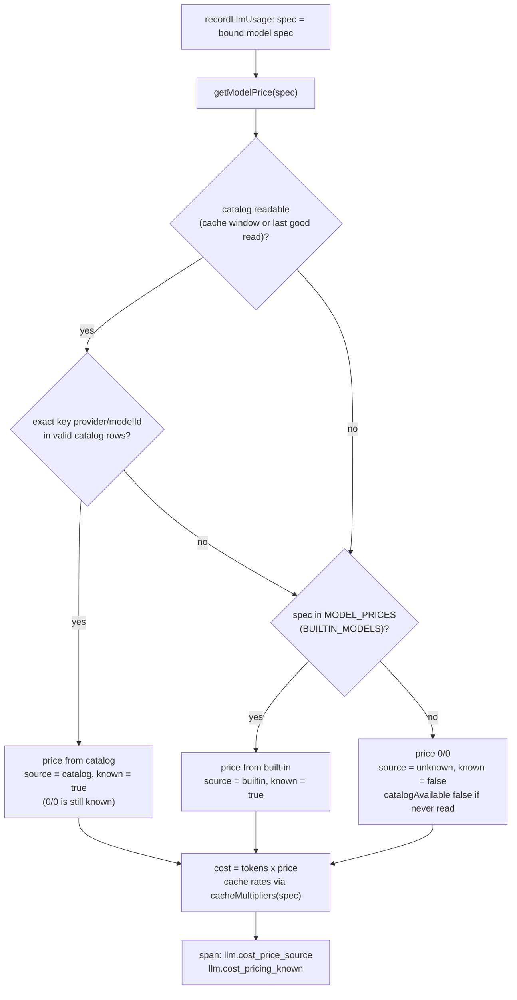
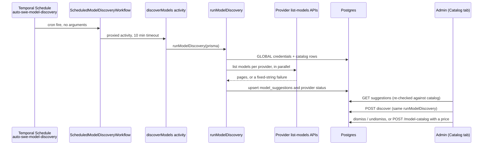

# Model Catalog, Pricing, and Discovery

> Indexed at commit `ae416937` on 2026-10-03 · [view on GitHub](https://github.com/yorch/auto-swe/tree/ae416937)

## Relevant source files

- [packages/shared/src/prisma/schema.prisma](https://github.com/yorch/auto-swe/blob/ae416937/packages/shared/src/prisma/schema.prisma)
- [packages/shared/src/lib/builtinModels.ts](https://github.com/yorch/auto-swe/blob/ae416937/packages/shared/src/lib/builtinModels.ts)
- [packages/shared/src/lib/modelSpec.ts](https://github.com/yorch/auto-swe/blob/ae416937/packages/shared/src/lib/modelSpec.ts)
- [packages/shared/src/lib/syncBuiltins.ts](https://github.com/yorch/auto-swe/blob/ae416937/packages/shared/src/lib/syncBuiltins.ts)
- [packages/shared/src/lib/modelDiscovery.ts](https://github.com/yorch/auto-swe/blob/ae416937/packages/shared/src/lib/modelDiscovery.ts)
- [packages/shared/src/lib/modelSuggestions.ts](https://github.com/yorch/auto-swe/blob/ae416937/packages/shared/src/lib/modelSuggestions.ts)
- [packages/shared/src/lib/systemConfig.ts](https://github.com/yorch/auto-swe/blob/ae416937/packages/shared/src/lib/systemConfig.ts)
- [packages/shared/src/workflow/costEstimator.ts](https://github.com/yorch/auto-swe/blob/ae416937/packages/shared/src/workflow/costEstimator.ts)
- [packages/shared/src/workflow/templates/modelCatalogRefresh.ts](https://github.com/yorch/auto-swe/blob/ae416937/packages/shared/src/workflow/templates/modelCatalogRefresh.ts)
- [packages/gateway/src/routes/modelCatalog.ts](https://github.com/yorch/auto-swe/blob/ae416937/packages/gateway/src/routes/modelCatalog.ts)
- [packages/gateway/src/lib/modelCatalogService.ts](https://github.com/yorch/auto-swe/blob/ae416937/packages/gateway/src/lib/modelCatalogService.ts)
- [packages/gateway/src/plugins/temporal.ts](https://github.com/yorch/auto-swe/blob/ae416937/packages/gateway/src/plugins/temporal.ts)
- [packages/worker/src/lib/costTracking.ts](https://github.com/yorch/auto-swe/blob/ae416937/packages/worker/src/lib/costTracking.ts)
- [packages/worker/src/lib/usdCapGuard.ts](https://github.com/yorch/auto-swe/blob/ae416937/packages/worker/src/lib/usdCapGuard.ts)
- [packages/worker/src/activities/discoverModels.ts](https://github.com/yorch/auto-swe/blob/ae416937/packages/worker/src/activities/discoverModels.ts)
- [packages/worker/src/activities/listProviderModels.ts](https://github.com/yorch/auto-swe/blob/ae416937/packages/worker/src/activities/listProviderModels.ts)
- [packages/worker/src/workflows/scheduledModelDiscovery.ts](https://github.com/yorch/auto-swe/blob/ae416937/packages/worker/src/workflows/scheduledModelDiscovery.ts)
- [packages/web/src/components/modelConfig/CatalogTab.tsx](https://github.com/yorch/auto-swe/blob/ae416937/packages/web/src/components/modelConfig/CatalogTab.tsx)
- [packages/web/src/lib/modelCatalog.ts](https://github.com/yorch/auto-swe/blob/ae416937/packages/web/src/lib/modelCatalog.ts)

## Overview

Every LLM and embedding call the worker makes is priced from a spec string of the form `<provider>/<model-id>`. The model catalog is the table that holds those prices: one `model_catalog_entries` row per spec, in USD per million tokens, global to the deployment. Code ships a baseline in `BUILTIN_MODELS`, the gateway seeds it into the table at startup, admins edit it from the dashboard, and the worker prices calls from the table first and the baseline second. A model that neither source knows is priced at zero and flagged, so USD budgets never see its spend.

Around that core sit three supporting mechanisms: a catalog API that warns when a saved agent or embedding config names an unpriced model, a discovery pass that asks each provider which models it lists and stores the gap as admin-reviewed suggestions, and a built-in workflow template that keeps the baseline table itself current through a draft pull request. The dashboard exposes all of it in one Catalog tab, reuses the catalog in the model pickers, and prices the workflow editor's cost estimate from it.

This page is the code map. The operator-facing behaviour, bootstrap steps and scripted recipes are in [docs/model-configuration.md](https://github.com/yorch/auto-swe/blob/ae416937/docs/model-configuration.md) and are not restated here. Model binding is covered in [Agent Layer](./4.3-agent-layer.md); tracing, ledgers and budget enforcement are covered in [Tracing, Cost Tracking, and Budgets](./4.5-observability-and-cost.md).

Sources: [packages/shared/src/lib/builtinModels.ts:L1-L21](https://github.com/yorch/auto-swe/blob/ae416937/packages/shared/src/lib/builtinModels.ts#L1-L21) [packages/worker/src/lib/costTracking.ts:L30-L36](https://github.com/yorch/auto-swe/blob/ae416937/packages/worker/src/lib/costTracking.ts#L30-L36) [packages/gateway/src/routes/modelCatalog.ts:L12-L21](https://github.com/yorch/auto-swe/blob/ae416937/packages/gateway/src/routes/modelCatalog.ts#L12-L21)

## Implementation

### The catalog table, its enums and the uniqueness rule

`ModelCatalogEntry` maps to `model_catalog_entries`. Each row carries `provider`, `modelId`, `kind`, an optional `displayName`, the two per-MTok prices as floats, `status`, free-text `notes`, and two booleans, `isBuiltIn` and `isCustomized` ([schema.prisma:L1923-L1948](https://github.com/yorch/auto-swe/blob/ae416937/packages/shared/src/prisma/schema.prisma#L1923-L1948)). `provider` is stored lowercase, exactly as `parseProviderModelSpec` returns it, and `modelId` is everything after the first slash, so it may itself contain slashes (`openrouter/anthropic/...`). The unique key is the pair `(provider, modelId)`, which is also the migration's unique index ([schema.prisma:L1946](https://github.com/yorch/auto-swe/blob/ae416937/packages/shared/src/prisma/schema.prisma#L1946), [migration.sql:L1799](https://github.com/yorch/auto-swe/blob/ae416937/packages/shared/src/prisma/migrations/00000000000000_init/migration.sql#L1799)).

The catalog is global on purpose. The model carries no scope, team or organization column, and its doc comment states the reason: prices are facts about a vendor, not policy ([schema.prisma:L1923-L1927](https://github.com/yorch/auto-swe/blob/ae416937/packages/shared/src/prisma/schema.prisma#L1923-L1927)). There is therefore no cascade to resolve and no per-team price; one spec has one price for everyone.

Two enums shape a row. `ModelKind` is `CHAT` or `EMBEDDING`. `ModelStatus` is `ACTIVE`, `DEPRECATED` or `RETIRED`, and its comment states the rule that keeps pricing sound: status drives the model pickers, never pricing. A `RETIRED` model is hidden from pickers but is still priced, because pinned agent versions and recorded history keep billing to it ([schema.prisma:L1910-L1921](https://github.com/yorch/auto-swe/blob/ae416937/packages/shared/src/prisma/schema.prisma#L1910-L1921)). The pricing path confirms it: `catalogPrices()` selects only the provider, model id and the two prices, so status never enters the lookup ([costTracking.ts:L66-L85](https://github.com/yorch/auto-swe/blob/ae416937/packages/worker/src/lib/costTracking.ts#L66-L85)). A row priced `0/0` is a known, free model (a self-hosted endpoint), not an unknown one.

Three further tables hold discovery state and are kept apart from the catalog so that discovery can never make a model "known" at $0 and the pricing path never reads them: `ModelSuggestion` (type `NEW` or `RETIREMENT_CANDIDATE`, unique on provider and model id, with first-seen, last-seen and dismissed timestamps), and `ModelDiscoveryProviderStatus` (per provider: when it was last checked, when a listing last completed, and the last error) ([schema.prisma:L1950-L1994](https://github.com/yorch/auto-swe/blob/ae416937/packages/shared/src/prisma/schema.prisma#L1950-L1994)).

Sources: [packages/shared/src/prisma/schema.prisma:L1910-L1994](https://github.com/yorch/auto-swe/blob/ae416937/packages/shared/src/prisma/schema.prisma#L1910-L1994) [packages/shared/src/prisma/migrations/00000000000000_init/migration.sql:L919-L936](https://github.com/yorch/auto-swe/blob/ae416937/packages/shared/src/prisma/migrations/00000000000000_init/migration.sql#L919-L936)

### `BUILTIN_MODELS`, the spec parser and seeding

`BUILTIN_MODELS` lives in the shared package at `packages/shared/src/lib/builtinModels.ts`, not in the worker. Each `BuiltinModel` has `provider`, `modelId`, `kind`, `status` (only `ACTIVE` or `RETIRED`), the two prices, and a required `priceSourceUrl` ([builtinModels.ts:L30-L52](https://github.com/yorch/auto-swe/blob/ae416937/packages/shared/src/lib/builtinModels.ts#L30-L52)). The table spans three providers; counting `provider:` fields in the file gives 16 Anthropic, 10 Google and 8 OpenAI rows, two of them embeddings ([builtinModels.ts:L100-L422](https://github.com/yorch/auto-swe/blob/ae416937/packages/shared/src/lib/builtinModels.ts#L100-L422)). The file header cites the official pricing page for each provider and lists the premiums the prices do not account for, which an admin covers by customizing a row ([builtinModels.ts:L1-L21](https://github.com/yorch/auto-swe/blob/ae416937/packages/shared/src/lib/builtinModels.ts#L1-L21)). `BUILTIN_MODELS_PATH` names the file's own location in the repository, because the refresh template, its precondition, its scope guard and its test gate all refer to it ([builtinModels.ts:L23-L28](https://github.com/yorch/auto-swe/blob/ae416937/packages/shared/src/lib/builtinModels.ts#L23-L28)).

Prompt-cache rates are not catalog fields. `cacheMultipliers(spec)` returns multiples of the input price from a per-model entry, then a per-provider rule (Anthropic reads at 0.1x and writes at 1.25x), else 1x, which overstates a cached read rather than understating it ([builtinModels.ts:L58-L98](https://github.com/yorch/auto-swe/blob/ae416937/packages/shared/src/lib/builtinModels.ts#L58-L98)). They apply to whichever input price a call is costed at, so a customized catalog price needs no second edit.

The spec parser is `parseProviderModelSpec` in `packages/shared/src/lib/modelSpec.ts`. It splits at the first slash, lowercases and trims the provider, preserves the model id as written, and throws on a missing slash or an empty half ([modelSpec.ts:L1-L29](https://github.com/yorch/auto-swe/blob/ae416937/packages/shared/src/lib/modelSpec.ts#L1-L29)). The worker's model binding, agent resolver, embedding helper and readiness check all import it from there, as does the gateway's catalog service ([models.ts:L111](https://github.com/yorch/auto-swe/blob/ae416937/packages/worker/src/lib/models.ts#L111), [embeddings.ts:L42](https://github.com/yorch/auto-swe/blob/ae416937/packages/worker/src/lib/embeddings.ts#L42), [modelCatalogService.ts:L101](https://github.com/yorch/auto-swe/blob/ae416937/packages/gateway/src/lib/modelCatalogService.ts#L101)).

`syncModelCatalog` seeds the table. It runs inside `seedCoreDefaults`, the always-on part of the built-in sync that the gateway invokes at startup ([syncBuiltins.ts:L179-L184](https://github.com/yorch/auto-swe/blob/ae416937/packages/shared/src/lib/syncBuiltins.ts#L179-L184)). It reads every existing row, then walks `BUILTIN_MODELS` with three cases. A missing row is created as built-in, and a unique-key collision from a second gateway booting at the same moment is swallowed. An existing row that is not built-in (an admin's own row for a model that later ships built-in) is adopted as built-in and customized, which keeps the admin's prices. An untouched built-in row whose prices, kind or status differ from code is updated, so a price corrected in code reaches every deployment on restart. A customized row is never overwritten, and nothing is ever deleted, so a model dropped from code still prices its history ([syncBuiltins.ts:L186-L232](https://github.com/yorch/auto-swe/blob/ae416937/packages/shared/src/lib/syncBuiltins.ts#L186-L232)).

Sources: [packages/shared/src/lib/builtinModels.ts:L1-L112](https://github.com/yorch/auto-swe/blob/ae416937/packages/shared/src/lib/builtinModels.ts#L1-L112) [packages/shared/src/lib/modelSpec.ts:L1-L29](https://github.com/yorch/auto-swe/blob/ae416937/packages/shared/src/lib/modelSpec.ts#L1-L29) [packages/shared/src/lib/syncBuiltins.ts:L179-L232](https://github.com/yorch/auto-swe/blob/ae416937/packages/shared/src/lib/syncBuiltins.ts#L179-L232)

### Pricing in the worker

`getModelPrice(spec)` in `costTracking.ts` returns `{ price, known, source, catalogAvailable }`. Its source order is fixed: the catalog row, then the built-in table, then unknown with a zero price ([costTracking.ts:L105-L132](https://github.com/yorch/auto-swe/blob/ae416937/packages/worker/src/lib/costTracking.ts#L105-L132)). The built-in side is `MODEL_PRICES`, a plain map derived from `BUILTIN_MODELS` at module load ([costTracking.ts:L30-L42](https://github.com/yorch/auto-swe/blob/ae416937/packages/worker/src/lib/costTracking.ts#L30-L42)), so a model is priced before the gateway has seeded the table or while the database is unreachable.

The lookup is exact. The catalog is read into a `Map` keyed by `` `${provider}/${modelId}` `` and queried with the spec as given, so the doc comment's example holds: `gpt-5-5` for `gpt-5.5` is unknown and is never silently priced as its neighbour ([costTracking.ts:L66-L84](https://github.com/yorch/auto-swe/blob/ae416937/packages/worker/src/lib/costTracking.ts#L66-L84), [costTracking.ts:L105-L109](https://github.com/yorch/auto-swe/blob/ae416937/packages/worker/src/lib/costTracking.ts#L105-L109)). Misspellings are surfaced instead by the gateway's "did you mean" suggestion, described below.

A row is skipped, not trusted, when its prices are invalid. `isValidPrice` requires both rates to be finite and non-negative, because a negative rate would invert cost accrual and slip past USD budgets; an invalid row is left out of the map, so the lookup falls through to the built-in table ([costTracking.ts:L55-L58](https://github.com/yorch/auto-swe/blob/ae416937/packages/worker/src/lib/costTracking.ts#L55-L58), [costTracking.ts:L76-L83](https://github.com/yorch/auto-swe/blob/ae416937/packages/worker/src/lib/costTracking.ts#L76-L83)). The zero-price known case works because the hit test is on the returned object, not on its value: a catalog entry of `{ input: 0, output: 0 }` is truthy, so it returns `known: true, source: 'catalog'` ([costTracking.ts:L123-L126](https://github.com/yorch/auto-swe/blob/ae416937/packages/worker/src/lib/costTracking.ts#L123-L126)).

`catalogPrices()` never throws. It reads the catalog once per config-cache window through `withCache`; on failure it logs a warning through the context-guarded `logWarn`, serves the last good read (or none, so built-in prices apply) and does not query again for one window, because `withCache` does not cache a rejection and an unreachable database would otherwise cost a query per LLM call ([costTracking.ts:L48-L98](https://github.com/yorch/auto-swe/blob/ae416937/packages/worker/src/lib/costTracking.ts#L48-L98)). The `catalogAvailable` flag is false when no read ever succeeded, so a caller can tell "nobody priced this" from "not looked up yet" ([costTracking.ts:L114-L120](https://github.com/yorch/auto-swe/blob/ae416937/packages/worker/src/lib/costTracking.ts#L114-L120)).

In `recordLlmUsage` the result feeds three things: a warning when the price is unknown ([costTracking.ts:L430-L436](https://github.com/yorch/auto-swe/blob/ae416937/packages/worker/src/lib/costTracking.ts#L430-L436)), the call's cost via `costFromPrice` with the spec's cache multipliers ([costTracking.ts:L443-L446](https://github.com/yorch/auto-swe/blob/ae416937/packages/worker/src/lib/costTracking.ts#L443-L446)), and the span attributes `llm.cost_price_source` (`catalog`, `builtin` or `unknown`) and `llm.cost_pricing_known` beside the tokens and cost ([costTracking.ts:L468-L478](https://github.com/yorch/auto-swe/blob/ae416937/packages/worker/src/lib/costTracking.ts#L468-L478)). Embedding usage is priced through the same lookup with input tokens only ([embeddings.ts:L137-L145](https://github.com/yorch/auto-swe/blob/ae416937/packages/worker/src/lib/embeddings.ts#L137-L145)).

The per-model price override environment variable no longer exists as a price source. `MODEL_PRICE_*` variables are not read; `ignoredPriceOverrideVars()` lists any that are set, and the worker prints a warning at boot naming them and pointing at the catalog API ([costTracking.ts:L134-L143](https://github.com/yorch/auto-swe/blob/ae416937/packages/worker/src/lib/costTracking.ts#L134-L143), [worker index.ts:L53-L63](https://github.com/yorch/auto-swe/blob/ae416937/packages/worker/src/index.ts#L53-L63)).

A separate guard refuses calls it cannot price when a USD cap is in force. `assertModelPricedForUsdCap` returns at once for a known model. For an unknown one it looks up the cap; with no cap the call proceeds at $0. With a cap it throws a retryable `MODEL_PRICE_UNAVAILABLE` when the catalog has never been readable (the price may exist), and a non-retryable `MODEL_UNPRICED` naming the model and where to price it otherwise ([usdCapGuard.ts:L111-L144](https://github.com/yorch/auto-swe/blob/ae416937/packages/worker/src/lib/usdCapGuard.ts#L111-L144)). Budget enforcement itself belongs to [page 4.5](./4.5-observability-and-cost.md).

Sources: [packages/worker/src/lib/costTracking.ts:L30-L143](https://github.com/yorch/auto-swe/blob/ae416937/packages/worker/src/lib/costTracking.ts#L30-L143) [packages/worker/src/lib/costTracking.ts:L430-L478](https://github.com/yorch/auto-swe/blob/ae416937/packages/worker/src/lib/costTracking.ts#L430-L478) [packages/worker/src/lib/usdCapGuard.ts:L111-L144](https://github.com/yorch/auto-swe/blob/ae416937/packages/worker/src/lib/usdCapGuard.ts#L111-L144)

### The gateway catalog API and its warnings

`modelCatalogRoutes` is registered under `/api/v1/platform`, so every path below is `/api/v1/platform/model-catalog...` ([gateway index.ts:L324](https://github.com/yorch/auto-swe/blob/ae416937/packages/gateway/src/index.ts#L324)). Two guards are defined at the top: `anyUser = requireAuth()` and `adminOnly = requireAuth({ requiredRole: 'ADMIN' })` ([modelCatalog.ts:L94-L97](https://github.com/yorch/auto-swe/blob/ae416937/packages/gateway/src/routes/modelCatalog.ts#L94-L97)). The route header gives the policy: any signed-in user may read, because a team's agent editor needs the catalog to pick a model, but a price decides what USD budgets see, so every write is ADMIN-only.

| Route | Guard | Behaviour |
| ----- | ----- | --------- |
| `GET /model-catalog` | any signed-in user | Lists rows ordered by provider and model id, filtered by `kind`; `RETIRED` rows only with `includeRetired`. Each row gains a `builtin` object with the values code ships ([modelCatalog.ts:L74-L88](https://github.com/yorch/auto-swe/blob/ae416937/packages/gateway/src/routes/modelCatalog.ts#L74-L88), [L99-L113](https://github.com/yorch/auto-swe/blob/ae416937/packages/gateway/src/routes/modelCatalog.ts#L99-L113)) |
| `GET /model-catalog/role-pricing` | any signed-in user | Per-role prices for the workflow editor; only specs and prices leave, not prompts or tools ([modelCatalog.ts:L115-L120](https://github.com/yorch/auto-swe/blob/ae416937/packages/gateway/src/routes/modelCatalog.ts#L115-L120)) |
| `GET /model-catalog/unpriced` | ADMIN | Specs in use that nothing prices ([modelCatalog.ts:L122-L124](https://github.com/yorch/auto-swe/blob/ae416937/packages/gateway/src/routes/modelCatalog.ts#L122-L124)) |
| `GET /model-catalog/suggestions` | ADMIN | Stored suggestions plus per-provider status ([modelCatalog.ts:L126-L174](https://github.com/yorch/auto-swe/blob/ae416937/packages/gateway/src/routes/modelCatalog.ts#L126-L174)) |
| `POST /model-catalog/suggestions/:id/dismiss` and `/undismiss` | ADMIN | Sets or clears `dismissedAt`, audited as an `UPDATE` of `ModelSuggestion`; a missing id is a 404 ([modelCatalog.ts:L176-L212](https://github.com/yorch/auto-swe/blob/ae416937/packages/gateway/src/routes/modelCatalog.ts#L176-L212)) |
| `POST /model-catalog/discover` | ADMIN | Runs a discovery pass now ([modelCatalog.ts:L214-L229](https://github.com/yorch/auto-swe/blob/ae416937/packages/gateway/src/routes/modelCatalog.ts#L214-L229)) |
| `POST /model-catalog` | ADMIN | Creates a custom row; a duplicate spec is a 409 `MODEL_EXISTS` ([modelCatalog.ts:L231-L261](https://github.com/yorch/auto-swe/blob/ae416937/packages/gateway/src/routes/modelCatalog.ts#L231-L261)) |
| `PUT /model-catalog/:id` | ADMIN | Edits prices, kind, status, name or notes, never provider or model id; an edit to a built-in sets `isCustomized` ([modelCatalog.ts:L263-L291](https://github.com/yorch/auto-swe/blob/ae416937/packages/gateway/src/routes/modelCatalog.ts#L263-L291)) |
| `POST /model-catalog/:id/reset` | ADMIN | Restores a built-in row to the code values and clears `isCustomized`; a non-built-in is a 409 `NOT_BUILT_IN` ([modelCatalog.ts:L293-L337](https://github.com/yorch/auto-swe/blob/ae416937/packages/gateway/src/routes/modelCatalog.ts#L293-L337)) |
| `DELETE /model-catalog/:id` | ADMIN | Deletes a custom row; a built-in is a 409 `BUILT_IN_MODEL`, since startup would re-create it, so it is set to `RETIRED` instead ([modelCatalog.ts:L339-L371](https://github.com/yorch/auto-swe/blob/ae416937/packages/gateway/src/routes/modelCatalog.ts#L339-L371)) |

Input is bounded by Zod: a price is a finite number between 0 and 100,000, the provider must match lowercase kebab-case, and the model id must contain no whitespace ([modelCatalog.ts:L23-L52](https://github.com/yorch/auto-swe/blob/ae416937/packages/gateway/src/routes/modelCatalog.ts#L23-L52)). Create, update, reset, delete and dismissal each write an audit log entry.

The unpriced-model warnings come from `modelCatalogService.ts`, not the catalog routes. `catalogWarnings(prisma, spec, kind)` is advisory and never blocks a save, so a model released today, a self-hosted endpoint or a pinned version is never refused. It finds a catalog row, falling back to the built-in table. A spec in neither yields one warning that its calls are recorded at $0 and invisible to USD budgets, with a "did you mean" suggestion when `suggestSpec` finds a priced spec that differs only by `.`/`-` or case, or sits within two edits on the same provider and is the unique nearest. A found entry yields further warnings for a kind mismatch, a `RETIRED` status or a `DEPRECATED` status ([modelCatalogService.ts:L31-L131](https://github.com/yorch/auto-swe/blob/ae416937/packages/gateway/src/lib/modelCatalogService.ts#L31-L131)). The agent library returns the result as `catalogWarnings` on create and update of an agent version, and the embedding-config save returns it for an `EMBEDDING` kind ([agentLibraryService.ts:L190](https://github.com/yorch/auto-swe/blob/ae416937/packages/gateway/src/lib/agentLibraryService.ts#L190), [agentLibraryService.ts:L251](https://github.com/yorch/auto-swe/blob/ae416937/packages/gateway/src/lib/agentLibraryService.ts#L251), [modelConfig.ts:L357-L358](https://github.com/yorch/auto-swe/blob/ae416937/packages/gateway/src/routes/modelConfig.ts#L357-L358)).

`findUnpricedSpecs` backs `GET /model-catalog/unpriced`. It gathers the model of every active agent version across all scopes, the embedding config's model and every distinct model on an LLM trace in the last 30 days, subtracts the priced set, and attaches where each is used (`agent:<key>`, `embedding-config`, `recent-calls`) and the nearest suggestion. The reads run unscoped on purpose, since an unpriced model is a platform-wide gap and the report is ADMIN-only ([modelCatalogService.ts:L20-L21](https://github.com/yorch/auto-swe/blob/ae416937/packages/gateway/src/lib/modelCatalogService.ts#L20-L21), [L133-L191](https://github.com/yorch/auto-swe/blob/ae416937/packages/gateway/src/lib/modelCatalogService.ts#L133-L191)).

Sources: [packages/gateway/src/routes/modelCatalog.ts:L1-L372](https://github.com/yorch/auto-swe/blob/ae416937/packages/gateway/src/routes/modelCatalog.ts#L1-L372) [packages/gateway/src/lib/modelCatalogService.ts:L1-L191](https://github.com/yorch/auto-swe/blob/ae416937/packages/gateway/src/lib/modelCatalogService.ts#L1-L191)

### On-demand discovery

Discovery lists models through the GLOBAL provider credentials and keeps the ones nothing prices. All of it is in `packages/shared/src/lib/modelDiscovery.ts`, shared by the gateway and the worker. `modelListRequest` builds each provider's list-models request: fixed URLs and headers for Anthropic, OpenAI and Google, and `<apiBase>/models` for any OpenAI-compatible provider, behind the SSRF guard, with credentials in the URL refused and redirects not followed ([modelDiscovery.ts:L24-L70](https://github.com/yorch/auto-swe/blob/ae416937/packages/shared/src/lib/modelDiscovery.ts#L24-L70)). Every failure is reduced to a fixed string (`blocked address`, `apiBase required`, `timed out`, `unrecognised response`, or a name-and-code pair), because Node can put header values and URL userinfo into a fetch error and nothing from the provider's body may reach the status row, the API or Temporal history ([modelDiscovery.ts:L72-L108](https://github.com/yorch/auto-swe/blob/ae416937/packages/shared/src/lib/modelDiscovery.ts#L72-L108)).

`listProviderModels` follows pages up to five, 10 seconds per request, asking for the largest page each provider allows. It filters out non-text models by name (speech, image generation, moderation and similar) for suggestions, but keeps every listed id for the "still listed" test. A listing is `complete` only when paging finished, the provider never signalled more pages it gave no cursor for, and it listed at least one id ([modelDiscovery.ts:L177-L191](https://github.com/yorch/auto-swe/blob/ae416937/packages/shared/src/lib/modelDiscovery.ts#L177-L191), [L269-L343](https://github.com/yorch/auto-swe/blob/ae416937/packages/shared/src/lib/modelDiscovery.ts#L269-L343)). `parseModelListPage` reads Google's `models` array (kind from the supported generation methods) and the `data` array of the other providers (embedding kind guessed from the id) ([modelDiscovery.ts:L205-L267](https://github.com/yorch/auto-swe/blob/ae416937/packages/shared/src/lib/modelDiscovery.ts#L205-L267)).

`discoverProviderModels` decrypts each GLOBAL credential, lists in parallel and compares against `knownModels`, which is the union of catalog rows and built-ins with a catalog row overriding its built-in. A provider that fails is reported on its own entry and stops nothing else. For a successful listing, `models` are the specs nothing prices, and `retirementCandidates` are priced, non-retired models the provider no longer lists, computed only when the listing was complete ([modelDiscovery.ts:L110-L150](https://github.com/yorch/auto-swe/blob/ae416937/packages/shared/src/lib/modelDiscovery.ts#L110-L150), [L345-L424](https://github.com/yorch/auto-swe/blob/ae416937/packages/shared/src/lib/modelDiscovery.ts#L345-L424)).

`runModelDiscovery` in `modelSuggestions.ts` runs one pass and records it, and both the on-demand route and the scheduled activity call it, so they leave the same state ([modelSuggestions.ts:L131-L137](https://github.com/yorch/auto-swe/blob/ae416937/packages/shared/src/lib/modelSuggestions.ts#L131-L137)). `recordDiscovery` is the persistence rule. A failed provider changes only its status row. `NEW` rows are upserted while a model stays unpriced and listed, and dropped once it is priced or unlisted, but only on a complete listing; `RETIREMENT_CANDIDATE` rows follow the same rule and are flags only. A dismissed row is never deleted for being absent, so a dismissal survives a model leaving and returning, and a row that flips type starts undismissed. Providers with no remaining GLOBAL credential lose their rows and status ([modelSuggestions.ts:L27-L129](https://github.com/yorch/auto-swe/blob/ae416937/packages/shared/src/lib/modelSuggestions.ts#L27-L129)).

Sources: [packages/shared/src/lib/modelDiscovery.ts:L1-L424](https://github.com/yorch/auto-swe/blob/ae416937/packages/shared/src/lib/modelDiscovery.ts#L1-L424) [packages/shared/src/lib/modelSuggestions.ts:L1-L137](https://github.com/yorch/auto-swe/blob/ae416937/packages/shared/src/lib/modelSuggestions.ts#L1-L137) [packages/gateway/src/routes/modelCatalog.ts:L214-L229](https://github.com/yorch/auto-swe/blob/ae416937/packages/gateway/src/routes/modelCatalog.ts#L214-L229)

### Scheduled discovery and the admin review flow

The schedule is a single system-wide Temporal Schedule with the id `auto-swe-model-discovery` ([temporal.ts:L33](https://github.com/yorch/auto-swe/blob/ae416937/packages/gateway/src/plugins/temporal.ts#L33)). Its action starts `ScheduledModelDiscoveryWorkflow` on the `engineering-workflow` task queue with no arguments ([temporal.ts:L325-L334](https://github.com/yorch/auto-swe/blob/ae416937/packages/gateway/src/plugins/temporal.ts#L325-L334)). The workflow is one line: it proxies the `discoverModels` activity with the scheduled retry policy and a 10-minute start-to-close timeout and returns its result ([scheduledModelDiscovery.ts:L5-L21](https://github.com/yorch/auto-swe/blob/ae416937/packages/worker/src/workflows/scheduledModelDiscovery.ts#L5-L21)). It is exported from the workflows barrel and the activity from the activities barrel ([workflows/index.ts:L15](https://github.com/yorch/auto-swe/blob/ae416937/packages/worker/src/workflows/index.ts#L15), [activities/index.ts:L95-L96](https://github.com/yorch/auto-swe/blob/ae416937/packages/worker/src/activities/index.ts#L95-L96)). The activity calls `runModelDiscovery` with the shared Prisma client, logs a warning for each provider that failed and an info line with the summary, and returns the summary. It writes no trace, since a Schedule-started run has no `WorkflowRun` row; the log line and the stored status row are the record ([discoverModels.ts:L24-L38](https://github.com/yorch/auto-swe/blob/ae416937/packages/worker/src/activities/discoverModels.ts#L24-L38)).

Registration happens at gateway startup. After the other sweeps, `index.ts` calls `app.temporal.syncModelDiscoverySchedule(sweeps.modelDiscovery)` and logs a warning rather than failing boot if Temporal is unreachable ([gateway index.ts:L158-L176](https://github.com/yorch/auto-swe/blob/ae416937/packages/gateway/src/index.ts#L158-L176)). The helper calls `upsertSchedule`, which updates the schedule in place when it exists, with its cron and paused state, and otherwise creates it with an overlap policy of `SKIP` ([temporal.ts:L428-L452](https://github.com/yorch/auto-swe/blob/ae416937/packages/gateway/src/plugins/temporal.ts#L428-L452), [L891-L899](https://github.com/yorch/auto-swe/blob/ae416937/packages/gateway/src/plugins/temporal.ts#L891-L899)). Cadence is environment-only: `resolveScheduledSweeps()` reads `MODEL_DISCOVERY_ENABLED` (default true) and `MODEL_DISCOVERY_CRON` (default `17 3 * * *`), leniently, and `validateScheduledSweepsEnv()` is the strict check the gateway runs at boot ([systemConfig.ts:L907-L937](https://github.com/yorch/auto-swe/blob/ae416937/packages/shared/src/lib/systemConfig.ts#L907-L937), [L943-L960](https://github.com/yorch/auto-swe/blob/ae416937/packages/shared/src/lib/systemConfig.ts#L943-L960)). Disabled means the schedule stays and is paused.

The admin review flow is the suggestions API plus the dashboard. `GET /model-catalog/suggestions` re-checks every stored row against the catalog on read, so a model an admin has since priced is never shown as new and one since retired or deleted is never shown as possibly retired, before the next run. A dismissed row last seen before its provider's last complete listing is hidden as no longer applying. The response carries `hiddenDismissed` counts per type so the UI can tell "everything is dismissed" from "nothing found" ([modelCatalog.ts:L126-L174](https://github.com/yorch/auto-swe/blob/ae416937/packages/gateway/src/routes/modelCatalog.ts#L126-L174)). Acting on a suggestion is the admin entering a price through the ordinary create or edit routes; discovery itself never writes a catalog row.

Sources: [packages/gateway/src/plugins/temporal.ts:L325-L334](https://github.com/yorch/auto-swe/blob/ae416937/packages/gateway/src/plugins/temporal.ts#L325-L334) [packages/worker/src/workflows/scheduledModelDiscovery.ts:L1-L21](https://github.com/yorch/auto-swe/blob/ae416937/packages/worker/src/workflows/scheduledModelDiscovery.ts#L1-L21) [packages/worker/src/activities/discoverModels.ts:L1-L38](https://github.com/yorch/auto-swe/blob/ae416937/packages/worker/src/activities/discoverModels.ts#L1-L38) [packages/gateway/src/index.ts:L158-L176](https://github.com/yorch/auto-swe/blob/ae416937/packages/gateway/src/index.ts#L158-L176)

### The `model-catalog-refresh` template

A second mechanism keeps `BUILTIN_MODELS` itself current. `MODEL_CATALOG_REFRESH_SPEC` is a built-in workflow template named `model-catalog-refresh`, listed among the automated templates ([modelCatalogRefresh.ts:L63-L84](https://github.com/yorch/auto-swe/blob/ae416937/packages/shared/src/workflow/templates/modelCatalogRefresh.ts#L63-L84), [templates/index.ts:L80-L84](https://github.com/yorch/auto-swe/blob/ae416937/packages/shared/src/workflow/templates/index.ts#L80-L84)). Run against a fork of the repository, by hand or on a schedule, it ends at a draft pull request that a person merges.

The graph is written with the authoring helpers. `setCriteria` stamps the success criteria (every changed price cites an official URL, an unverifiable price is left unchanged and marked `UNVERIFIED`, only existing providers are touched, no row is deleted) ([modelCatalogRefresh.ts:L16-L27](https://github.com/yorch/auto-swe/blob/ae416937/packages/shared/src/workflow/templates/modelCatalogRefresh.ts#L16-L27)). The `listProviderModels` step runs next, and a `cond` node ends the run successfully if the previous refresh is still open. Otherwise `executeImplementation` edits the catalog file with the platform's id list as guidance, a `cond` ends the run when nothing changed, `runTests` runs the one test file as an advisory gate, a `reviewLoop` reviews and fixes, and `checkScope` requires that exactly one file changed and that it is the catalog path before `openPullRequest` opens the draft ([modelCatalogRefresh.ts:L85-L179](https://github.com/yorch/auto-swe/blob/ae416937/packages/shared/src/workflow/templates/modelCatalogRefresh.ts#L85-L179)). The change is confined twice, by `allowedPaths` on the implementation steps and by `checkScope` ([modelCatalogRefresh.ts:L61](https://github.com/yorch/auto-swe/blob/ae416937/packages/shared/src/workflow/templates/modelCatalogRefresh.ts#L61), [L76-L83](https://github.com/yorch/auto-swe/blob/ae416937/packages/shared/src/workflow/templates/modelCatalogRefresh.ts#L76-L83)). The prompt treats fetched page text as data and forbids rounding, inferring from a sibling model or recalling a price from memory ([modelCatalogRefresh.ts:L35-L54](https://github.com/yorch/auto-swe/blob/ae416937/packages/shared/src/workflow/templates/modelCatalogRefresh.ts#L35-L54)).

The `listProviderModels` step is registered in the step registry and mapped to an activity in `runnable.ts` with a 5-minute timeout ([stepRegistry.ts:L180-L190](https://github.com/yorch/auto-swe/blob/ae416937/packages/shared/src/workflow/stepRegistry.ts#L180-L190), [runnable.ts:L169-L175](https://github.com/yorch/auto-swe/blob/ae416937/packages/worker/src/workflows/runnable.ts#L169-L175), [runnable.ts:L773](https://github.com/yorch/auto-swe/blob/ae416937/packages/worker/src/workflows/runnable.ts#L773)). The activity exists so that only the worker holds provider keys. Before any workspace or credential it fetches the catalog file from the repository and fails non-retryably if it is missing or lacks `export const BUILTIN_MODELS`, then checks whether a previous refresh's branch has an open pull request or commits ahead of the default branch and, if so, returns `previousRefreshOpen: true`. It then lists models for only those GLOBAL credentials whose provider already appears in the file, drops ids containing a colon (private fine-tunes), and returns markdown: candidates to add, and, for a complete listing, every listed id so the agent can retire a row only when its id is absent. Provider error text is never returned ([listProviderModels.ts:L59-L162](https://github.com/yorch/auto-swe/blob/ae416937/packages/worker/src/activities/listProviderModels.ts#L59-L162)).

Sources: [packages/shared/src/workflow/templates/modelCatalogRefresh.ts:L1-L179](https://github.com/yorch/auto-swe/blob/ae416937/packages/shared/src/workflow/templates/modelCatalogRefresh.ts#L1-L179) [packages/worker/src/activities/listProviderModels.ts:L1-L162](https://github.com/yorch/auto-swe/blob/ae416937/packages/worker/src/activities/listProviderModels.ts#L1-L162)

### The dashboard

The catalog is a tab on the model configuration page. `StudioModelConfigPage` defines the tabs `credentials`, `catalog`, `embeddings` and `audit` and renders `CatalogTab` for the second ([studio/models/page.tsx:L13-L46](https://github.com/yorch/auto-swe/blob/ae416937/packages/web/src/app/studio/models/page.tsx#L13-L46)). `CatalogTab` stacks an unpriced panel, a discovery panel and the catalog table. The table shows spec, kind, price, status and a source badge (custom, customized or built-in), with edit, reset (for a customized built-in) and delete actions, a "show retired" toggle, and a note on a customized row when code now ships different values ([CatalogTab.tsx:L54-L193](https://github.com/yorch/auto-swe/blob/ae416937/packages/web/src/components/modelConfig/CatalogTab.tsx#L54-L193), [L202-L219](https://github.com/yorch/auto-swe/blob/ae416937/packages/web/src/components/modelConfig/CatalogTab.tsx#L202-L219)). `UnpricedPanel` lists the unpriced specs with their usage and "did you mean" and an "Add to catalog" shortcut ([CatalogTab.tsx:L221-L261](https://github.com/yorch/auto-swe/blob/ae416937/packages/web/src/components/modelConfig/CatalogTab.tsx#L221-L261)). `DiscoveryPanel` shows new and possibly retired suggestions, per-provider failures and the last check time, offers dismiss and undismiss, and has the "Check providers now" button that calls the discover route ([CatalogTab.tsx:L263-L435](https://github.com/yorch/auto-swe/blob/ae416937/packages/web/src/components/modelConfig/CatalogTab.tsx#L263-L435), [useModelCatalog.ts:L113-L148](https://github.com/yorch/auto-swe/blob/ae416937/packages/web/src/hooks/useModelCatalog.ts#L113-L148)).

The catalog also backs the model pickers. `ModelSpecPicker` is a combobox that suggests cataloged models of a kind, each with its price, still accepts a spec the catalog lacks, and says when an entry would be recorded at $0 ([ModelSpecPicker.tsx:L13-L47](https://github.com/yorch/auto-swe/blob/ae416937/packages/web/src/components/modelConfig/ModelSpecPicker.tsx#L13-L47)). `modelSpecOptions` drops `RETIRED` entries, sorts `ACTIVE` before `DEPRECATED` and labels deprecated ones ([modelCatalog.ts:L50-L69](https://github.com/yorch/auto-swe/blob/ae416937/packages/web/src/lib/modelCatalog.ts#L50-L69)). It is used for the agent form's model spec with kind `CHAT` and for the embeddings tab ([AgentFormFields.tsx:L121-L129](https://github.com/yorch/auto-swe/blob/ae416937/packages/web/src/components/agents/AgentFormFields.tsx#L121-L129), [EmbeddingsTab.tsx:L75](https://github.com/yorch/auto-swe/blob/ae416937/packages/web/src/components/modelConfig/EmbeddingsTab.tsx#L75)).

Sources: [packages/web/src/components/modelConfig/CatalogTab.tsx:L54-L435](https://github.com/yorch/auto-swe/blob/ae416937/packages/web/src/components/modelConfig/CatalogTab.tsx#L54-L435) [packages/web/src/lib/modelCatalog.ts:L1-L106](https://github.com/yorch/auto-swe/blob/ae416937/packages/web/src/lib/modelCatalog.ts#L1-L106) [packages/web/src/components/modelConfig/ModelSpecPicker.tsx:L1-L48](https://github.com/yorch/auto-swe/blob/ae416937/packages/web/src/components/modelConfig/ModelSpecPicker.tsx#L1-L48)

### The workflow editor's cost estimate

`estimateSpecCost` prices a spec from per-role rates. `DEFAULT_ROLE_PRICING` is the fallback, a fixed table of seven roles whose values are the built-in prices of the models the seeded agents run, with a test that fails when a seeded default or built-in price moves without it ([costEstimator.ts:L26-L46](https://github.com/yorch/auto-swe/blob/ae416937/packages/shared/src/workflow/costEstimator.ts#L26-L46)). Options may pass a partial `pricing` override that is merged over the defaults ([costEstimator.ts:L56-L80](https://github.com/yorch/auto-swe/blob/ae416937/packages/shared/src/workflow/costEstimator.ts#L56-L80)).

The editor supplies live prices through `GET /model-catalog/role-pricing`. `rolePricing` reads the latest active GLOBAL agent version per role, follows `inheritsModelFrom` up to five hops as the resolver does, and prices the resulting spec from its catalog row (rows with a negative price are ignored), else the built-in table. A role with no price is omitted so the estimator keeps its default for it instead of showing $0. Only GLOBAL agents are read, because the editor estimates a template rather than a run ([modelCatalogService.ts:L193-L265](https://github.com/yorch/auto-swe/blob/ae416937/packages/gateway/src/lib/modelCatalogService.ts#L193-L265)). On the web side the template editor page calls `useRolePricing`, converts the result with `estimatorPricing` and passes it to `estimateSpecCost` inside a memo ([workflows/library/[id]/page.tsx:L600-L611](https://github.com/yorch/auto-swe/blob/ae416937/packages/web/src/app/workflows/library/%5Bid%5D/page.tsx#L600-L611), [modelCatalog.ts:L86-L106](https://github.com/yorch/auto-swe/blob/ae416937/packages/web/src/lib/modelCatalog.ts#L86-L106), [useModelCatalog.ts:L150-L158](https://github.com/yorch/auto-swe/blob/ae416937/packages/web/src/hooks/useModelCatalog.ts#L150-L158)).

Sources: [packages/shared/src/workflow/costEstimator.ts:L26-L80](https://github.com/yorch/auto-swe/blob/ae416937/packages/shared/src/workflow/costEstimator.ts#L26-L80) [packages/gateway/src/lib/modelCatalogService.ts:L193-L265](https://github.com/yorch/auto-swe/blob/ae416937/packages/gateway/src/lib/modelCatalogService.ts#L193-L265) [packages/web/src/app/workflows/library/%5Bid%5D/page.tsx:L600-L611](https://github.com/yorch/auto-swe/blob/ae416937/packages/web/src/app/workflows/library/%5Bid%5D/page.tsx#L600-L611)

## Diagram

Price resolution for one call, from the spec string to the span attribute:

The discovery flow, from trigger to review:

Sources: [packages/worker/src/lib/costTracking.ts:L105-L132](https://github.com/yorch/auto-swe/blob/ae416937/packages/worker/src/lib/costTracking.ts#L105-L132) [packages/shared/src/lib/modelSuggestions.ts:L131-L137](https://github.com/yorch/auto-swe/blob/ae416937/packages/shared/src/lib/modelSuggestions.ts#L131-L137) [packages/worker/src/activities/discoverModels.ts:L24-L38](https://github.com/yorch/auto-swe/blob/ae416937/packages/worker/src/activities/discoverModels.ts#L24-L38)

## Usage

To price a new model, an admin adds a row through the Catalog tab or `POST /api/v1/platform/model-catalog`; the worker picks it up within one config-cache window and never reprices calls already recorded ([CatalogTab.tsx:L88-L92](https://github.com/yorch/auto-swe/blob/ae416937/packages/web/src/components/modelConfig/CatalogTab.tsx#L88-L92)). To change what ships, edit `BUILTIN_MODELS` and let `syncModelCatalog` carry it to untouched built-in rows on the next gateway start. Code that needs a price calls `getModelPrice` (the USD-cap guard does) or `calculateCostUsd` (embedding usage does) rather than reading the table ([usdCapGuard.ts:L115](https://github.com/yorch/auto-swe/blob/ae416937/packages/worker/src/lib/usdCapGuard.ts#L115), [costTracking.ts:L181-L187](https://github.com/yorch/auto-swe/blob/ae416937/packages/worker/src/lib/costTracking.ts#L181-L187)). Code that needs the set of priced specs on the gateway uses `pricedSpecs` or `knownModels`, which include both catalog rows and built-ins ([modelDiscovery.ts:L120-L150](https://github.com/yorch/auto-swe/blob/ae416937/packages/shared/src/lib/modelDiscovery.ts#L120-L150)). Parsing a spec goes through `parseProviderModelSpec` everywhere.

Sources: [packages/worker/src/lib/costTracking.ts:L181-L187](https://github.com/yorch/auto-swe/blob/ae416937/packages/worker/src/lib/costTracking.ts#L181-L187) [packages/shared/src/lib/modelDiscovery.ts:L120-L150](https://github.com/yorch/auto-swe/blob/ae416937/packages/shared/src/lib/modelDiscovery.ts#L120-L150) [packages/web/src/components/modelConfig/CatalogTab.tsx:L88-L92](https://github.com/yorch/auto-swe/blob/ae416937/packages/web/src/components/modelConfig/CatalogTab.tsx#L88-L92)

## Limitations

- **Exact, case-sensitive spec matching on the pricing side.** Catalog keys use the lowercase provider the parser returns, but `getModelPrice` looks up the spec string as given, and the call site passes the bound spec unchanged. A spec stored as `OpenAI/gpt-5` routes to the OpenAI provider (the parser lowercases) yet misses the `openai/gpt-5` key and is priced unknown ([modelSpec.ts:L10-L28](https://github.com/yorch/auto-swe/blob/ae416937/packages/shared/src/lib/modelSpec.ts#L10-L28), [costTracking.ts:L121-L131](https://github.com/yorch/auto-swe/blob/ae416937/packages/worker/src/lib/costTracking.ts#L121-L131), [costTracking.ts:L423-L430](https://github.com/yorch/auto-swe/blob/ae416937/packages/worker/src/lib/costTracking.ts#L423-L430)). The gateway's `catalogWarnings` does normalise through the parser, so the save-time warning and the runtime price can disagree on such a spec ([modelCatalogService.ts:L98-L109](https://github.com/yorch/auto-swe/blob/ae416937/packages/gateway/src/lib/modelCatalogService.ts#L98-L109)).
- **"Priced" means two different things.** The worker skips a catalog row with an invalid price and falls through to the built-in table, but the gateway's `knownModels` and `pricedSpecs` count every catalog row as priced regardless of its values, so the unpriced report and the discovery diff cannot see a row the worker ignores ([costTracking.ts:L76-L83](https://github.com/yorch/auto-swe/blob/ae416937/packages/worker/src/lib/costTracking.ts#L76-L83), [modelDiscovery.ts:L120-L145](https://github.com/yorch/auto-swe/blob/ae416937/packages/shared/src/lib/modelDiscovery.ts#L120-L145)). The API's price bounds (0 to 100,000, finite) make such a row unlikely through the routes.
- **Warnings are advisory.** Saving an agent version or embedding config with an unpriced, deprecated, retired or wrong-kind model succeeds with `catalogWarnings`; only an active USD cap turns an unpriced model into a refusal at call time ([modelCatalogService.ts:L88-L92](https://github.com/yorch/auto-swe/blob/ae416937/packages/gateway/src/lib/modelCatalogService.ts#L88-L92), [usdCapGuard.ts:L111-L144](https://github.com/yorch/auto-swe/blob/ae416937/packages/worker/src/lib/usdCapGuard.ts#L111-L144)).
- **Cache multipliers are code-only.** Prompt-cache read and write rates come from tables in `builtinModels.ts` keyed by provider or spec, with no catalog column, so a model outside them is costed with cached input at the full input price ([builtinModels.ts:L58-L98](https://github.com/yorch/auto-swe/blob/ae416937/packages/shared/src/lib/builtinModels.ts#L58-L98)). The header also lists provider premiums (long-cache writes, batch discounts, data residency, fast mode, long-context surcharges) that no price field models ([builtinModels.ts:L13-L20](https://github.com/yorch/auto-swe/blob/ae416937/packages/shared/src/lib/builtinModels.ts#L13-L20)). Embeddings are priced on input tokens only ([embeddings.ts:L143-L144](https://github.com/yorch/auto-swe/blob/ae416937/packages/worker/src/lib/embeddings.ts#L143-L144)).
- **Per-process caching.** The worker reads the catalog once per config-cache window, per process, and after a failed read backs off for a window; an edit therefore reaches workers with a delay, and a worker that has never read the catalog prices only from the built-in table ([costTracking.ts:L48-L98](https://github.com/yorch/auto-swe/blob/ae416937/packages/worker/src/lib/costTracking.ts#L48-L98)).
- **Discovery covers GLOBAL credentials only, and suggestions are flags.** Team- or organization-scoped provider credentials are not listed, nothing in discovery retires a model, and a retirement candidate needs a complete listing, which a page cap of five, a provider signalling pages it gives no cursor for, or an empty list defeats ([modelDiscovery.ts:L177-L179](https://github.com/yorch/auto-swe/blob/ae416937/packages/shared/src/lib/modelDiscovery.ts#L177-L179), [L338-L342](https://github.com/yorch/auto-swe/blob/ae416937/packages/shared/src/lib/modelDiscovery.ts#L338-L342), [L351-L363](https://github.com/yorch/auto-swe/blob/ae416937/packages/shared/src/lib/modelDiscovery.ts#L351-L363)). The `kind` of a discovered OpenAI-compatible or OpenAI model is guessed from whether the id contains "embed" ([modelDiscovery.ts:L189-L191](https://github.com/yorch/auto-swe/blob/ae416937/packages/shared/src/lib/modelDiscovery.ts#L189-L191)).
- **The discovery schedule is read at gateway start.** It is applied once at boot, so a changed `MODEL_DISCOVERY_ENABLED` or `MODEL_DISCOVERY_CRON` needs a gateway restart, and a failed Temporal connection at boot is only logged ([gateway index.ts:L172-L176](https://github.com/yorch/auto-swe/blob/ae416937/packages/gateway/src/index.ts#L172-L176), [systemConfig.ts:L907-L910](https://github.com/yorch/auto-swe/blob/ae416937/packages/shared/src/lib/systemConfig.ts#L907-L910)).
- **The editor estimate covers seven roles from GLOBAL agents.** `rolePricing` is asked only for the keys of `DEFAULT_ROLE_PRICING`, ignores team and template agent overrides, and omits a role it cannot price ([modelCatalog.ts:L118-L120](https://github.com/yorch/auto-swe/blob/ae416937/packages/gateway/src/routes/modelCatalog.ts#L118-L120), [modelCatalogService.ts:L203-L212](https://github.com/yorch/auto-swe/blob/ae416937/packages/gateway/src/lib/modelCatalogService.ts#L203-L212)).
- **The refresh template's test gate is advisory.** `runTests` runs in warn mode, so CI on the draft pull request is the hard check, and the template only works against a repository that holds `builtinModels.ts` at the fixed path ([modelCatalogRefresh.ts:L133-L138](https://github.com/yorch/auto-swe/blob/ae416937/packages/shared/src/workflow/templates/modelCatalogRefresh.ts#L133-L138), [listProviderModels.ts:L62-L85](https://github.com/yorch/auto-swe/blob/ae416937/packages/worker/src/activities/listProviderModels.ts#L62-L85)).

Sources: [packages/worker/src/lib/costTracking.ts:L48-L131](https://github.com/yorch/auto-swe/blob/ae416937/packages/worker/src/lib/costTracking.ts#L48-L131) [packages/shared/src/lib/modelDiscovery.ts:L110-L424](https://github.com/yorch/auto-swe/blob/ae416937/packages/shared/src/lib/modelDiscovery.ts#L110-L424) [packages/gateway/src/lib/modelCatalogService.ts:L88-L265](https://github.com/yorch/auto-swe/blob/ae416937/packages/gateway/src/lib/modelCatalogService.ts#L88-L265)

## Related Pages

- Parent: [Temporal Worker](./4-temporal-worker.md)
- Sibling: [Temporal Workflows](./4.1-temporal-workflows.md)
- Sibling: [Activities](./4.2-activities.md)
- Sibling: [Agent Layer](./4.3-agent-layer.md) (model binding)
- Sibling: [Docker Workspaces](./4.4-docker-workspaces.md)
- Sibling: [Tracing, Cost Tracking, and Budgets](./4.5-observability-and-cost.md) (ledgers and budget gates)
- Sibling: [Agent Runs and Implementer Runtimes](./4.6-agent-runs-and-implementer-runtimes.md)
- Living doc: [docs/model-configuration.md](https://github.com/yorch/auto-swe/blob/ae416937/docs/model-configuration.md)

Sources: [docs/model-configuration.md](https://github.com/yorch/auto-swe/blob/ae416937/docs/model-configuration.md)
