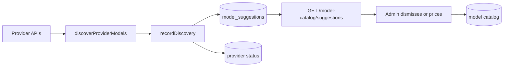

# Model Catalog and Pricing

Relevant source files

- [packages/shared/src/lib/builtinModels.ts](https://github.com/yorch/auto-swe/blob/d0a90fb5/packages/shared/src/lib/builtinModels.ts)
- [packages/gateway/src/routes/modelCatalog.ts](https://github.com/yorch/auto-swe/blob/d0a90fb5/packages/gateway/src/routes/modelCatalog.ts)
- [packages/worker/src/activities/listProviderModels.ts](https://github.com/yorch/auto-swe/blob/d0a90fb5/packages/worker/src/activities/listProviderModels.ts)
- [packages/shared/src/lib/modelSuggestions.ts](https://github.com/yorch/auto-swe/blob/d0a90fb5/packages/shared/src/lib/modelSuggestions.ts)
- [packages/worker/src/lib/embeddings.ts](https://github.com/yorch/auto-swe/blob/d0a90fb5/packages/worker/src/lib/embeddings.ts)

## Overview

The model catalog holds one row per `<provider>/<model-id>` spec with per-million-token (MTok) USD prices, and the worker costs every LLM call against it. Prices ship in code as the `BUILTIN_MODELS` table, are seeded into the database, and are editable by administrators. A spec missing from the catalog is priced at zero and emits `llm.cost_pricing_known=false`, so USD budgets never see its spend ([builtinModels.ts:L9-L11](https://github.com/yorch/auto-swe/blob/d0a90fb5/packages/shared/src/lib/builtinModels.ts#L9-L11)). Around the table sit the admin routes, a discovery pipeline that suggests new or retired models, a catalog-refresh worker activity, and the embeddings client that prices its own calls.

## Built-in price table

`BUILTIN_MODELS` is a typed array of `BuiltinModel` rows: provider, model id, `kind` (`CHAT` or `EMBEDDING`), `status` (`ACTIVE` or `RETIRED`), input and output USD per MTok, and a `priceSourceUrl` ([builtinModels.ts:L29-L51](https://github.com/yorch/auto-swe/blob/d0a90fb5/packages/shared/src/lib/builtinModels.ts#L29-L51)). Retired models stay priced because pinned agent versions and history bill against them. Embedding rows carry an output price of zero because they bill input only. The table covers Anthropic, Google and OpenAI models, including `text-embedding-3-large` at 0.13 and `text-embedding-3-small` at 0.02 ([builtinModels.ts:L101-L423](https://github.com/yorch/auto-swe/blob/d0a90fb5/packages/shared/src/lib/builtinModels.ts#L101-L423)).

Prompt-cache pricing is expressed as multiples of the input price through `CacheMultipliers` (`read`, `write`, `write1h`). `cacheMultipliers(spec)` resolves a per-model entry first, then a per-provider rule (Anthropic: 0.1 read, 1.25 five-minute write, 2 one-hour write), and finally a no-discount default of 1, which overstates cached cost so a USD budget errs toward stopping early ([builtinModels.ts:L64-L99](https://github.com/yorch/auto-swe/blob/d0a90fb5/packages/shared/src/lib/builtinModels.ts#L64-L99)). Because multipliers apply to whatever input price a call is costed at, a customized catalog price needs no second edit.

`BUILTIN_MODELS_PATH` names the file's own location in the repository so the `model-catalog-refresh` template and the worker activity can locate it ([builtinModels.ts:L22-L27](https://github.com/yorch/auto-swe/blob/d0a90fb5/packages/shared/src/lib/builtinModels.ts#L22-L27)).

Sources: [packages/shared/src/lib/builtinModels.ts:L1-L99](https://github.com/yorch/auto-swe/blob/d0a90fb5/packages/shared/src/lib/builtinModels.ts#L1-L99) [packages/shared/src/lib/builtinModels.ts:L101-L423](https://github.com/yorch/auto-swe/blob/d0a90fb5/packages/shared/src/lib/builtinModels.ts#L101-L423)

## Catalog routes

`modelCatalogRoutes` serves the catalog under `/model-catalog`. Any signed-in user may read it, because a team's agent editor needs it to pick a model; writes are ADMIN-only, since a price decides what budgets see ([modelCatalog.ts:L13-L22](https://github.com/yorch/auto-swe/blob/d0a90fb5/packages/gateway/src/routes/modelCatalog.ts#L13-L22), [modelCatalog.ts:L107-L110](https://github.com/yorch/auto-swe/blob/d0a90fb5/packages/gateway/src/routes/modelCatalog.ts#L107-L110)). Prices are validated to 0–100,000 and cache multipliers to 0–20 (nullable, where null clears the override) ([modelCatalog.ts:L24-L58](https://github.com/yorch/auto-swe/blob/d0a90fb5/packages/gateway/src/routes/modelCatalog.ts#L24-L58)).

The route set:

- `GET /model-catalog` lists rows ordered by provider and model id, hiding `RETIRED` rows unless `includeRetired` is set. Each row is returned through `toDto`, which attaches the code-shipped values for a built-in and the `cacheDefaults` that a null multiplier resolves to ([modelCatalog.ts:L80-L126](https://github.com/yorch/auto-swe/blob/d0a90fb5/packages/gateway/src/routes/modelCatalog.ts#L80-L126)).
- `GET /model-catalog/role-pricing` is open to any user so template authors can see the workflow editor's cost estimate without reading the agent library; only specs and prices leave ([modelCatalog.ts:L128-L133](https://github.com/yorch/auto-swe/blob/d0a90fb5/packages/gateway/src/routes/modelCatalog.ts#L128-L133)).
- `GET /model-catalog/unpriced` returns specs in use that lack a price, for admins ([modelCatalog.ts:L135-L137](https://github.com/yorch/auto-swe/blob/d0a90fb5/packages/gateway/src/routes/modelCatalog.ts#L135-L137)).
- `POST /model-catalog` creates a custom row and answers `409 MODEL_EXISTS` on a unique violation ([modelCatalog.ts:L244-L274](https://github.com/yorch/auto-swe/blob/d0a90fb5/packages/gateway/src/routes/modelCatalog.ts#L244-L274)).
- `PUT /model-catalog/:id` edits prices and status but never provider or model id, since pinned agent versions bill against that identity. Editing a built-in sets `isCustomized`, so startup seeding keeps the edit ([modelCatalog.ts:L52-L57](https://github.com/yorch/auto-swe/blob/d0a90fb5/packages/gateway/src/routes/modelCatalog.ts#L52-L57), [modelCatalog.ts:L276-L304](https://github.com/yorch/auto-swe/blob/d0a90fb5/packages/gateway/src/routes/modelCatalog.ts#L276-L304)).
- `POST /model-catalog/:id/reset` restores a built-in's code values, clears the multipliers, and unsets `isCustomized`; non-built-ins get `409 NOT_BUILT_IN` ([modelCatalog.ts:L306-L354](https://github.com/yorch/auto-swe/blob/d0a90fb5/packages/gateway/src/routes/modelCatalog.ts#L306-L354)).
- `DELETE /model-catalog/:id` refuses built-ins with `409 BUILT_IN_MODEL`, because gateway startup would re-create them; the instruction is to set `RETIRED` instead ([modelCatalog.ts:L356-L388](https://github.com/yorch/auto-swe/blob/d0a90fb5/packages/gateway/src/routes/modelCatalog.ts#L356-L388)).

Every mutation writes an audit log entry through `writeAuditLog`.

Sources: [packages/gateway/src/routes/modelCatalog.ts:L107-L388](https://github.com/yorch/auto-swe/blob/d0a90fb5/packages/gateway/src/routes/modelCatalog.ts#L107-L388) [packages/gateway/src/routes/modelCatalog.ts:L1-L105](https://github.com/yorch/auto-swe/blob/d0a90fb5/packages/gateway/src/routes/modelCatalog.ts#L1-L105)

## Discovery suggestions

Discovery asks each provider with a GLOBAL credential which models it lists, and `recordDiscovery` persists the outcome in `model_suggestions` and `model_discovery_provider_status`, never in the catalog itself, so a suggestion cannot make a model "known" at $0 ([modelSuggestions.ts:L8-L15](https://github.com/yorch/auto-swe/blob/d0a90fb5/packages/shared/src/lib/modelSuggestions.ts#L8-L15)). The scheduled run and the on-demand route share this code, so both leave the same state.

The rules are documented on the function. A failed listing changes only its status row. `NEW` suggestions follow the listing, upserted while a provider lists an unpriced model and dropped once priced or unlisted; an incomplete listing drops nothing. `RETIREMENT_CANDIDATE` rows are written only for complete listings and are flags only. Dismissals survive refreshes, and a row that changes type starts undismissed. Providers that lose their GLOBAL credential lose their rows ([modelSuggestions.ts:L27-L129](https://github.com/yorch/auto-swe/blob/d0a90fb5/packages/shared/src/lib/modelSuggestions.ts#L27-L129)). `runModelDiscovery` combines `discoverProviderModels` with `recordDiscovery` ([modelSuggestions.ts:L131-L137](https://github.com/yorch/auto-swe/blob/d0a90fb5/packages/shared/src/lib/modelSuggestions.ts#L131-L137)).

The gateway exposes the result at `GET /model-catalog/suggestions`, re-checking each row against the current catalog on read so a model since priced is never shown as new and one since retired is never shown as a retirement candidate. A dismissed row not seen since its provider's last complete listing is also hidden ([modelCatalog.ts:L139-L187](https://github.com/yorch/auto-swe/blob/d0a90fb5/packages/gateway/src/routes/modelCatalog.ts#L139-L187)). `POST /model-catalog/:id`-style dismiss and undismiss actions set or clear `dismissedAt` on `/model-catalog/suggestions/:id/dismiss|undismiss` ([modelCatalog.ts:L189-L225](https://github.com/yorch/auto-swe/blob/d0a90fb5/packages/gateway/src/routes/modelCatalog.ts#L189-L225)). `POST /model-catalog/discover` runs discovery on demand; it is a POST because it calls every provider with a decrypted key ([modelCatalog.ts:L227-L242](https://github.com/yorch/auto-swe/blob/d0a90fb5/packages/gateway/src/routes/modelCatalog.ts#L227-L242)).

Sources: [packages/shared/src/lib/modelSuggestions.ts:L1-L137](https://github.com/yorch/auto-swe/blob/d0a90fb5/packages/shared/src/lib/modelSuggestions.ts#L1-L137) [packages/gateway/src/routes/modelCatalog.ts:L139-L242](https://github.com/yorch/auto-swe/blob/d0a90fb5/packages/gateway/src/routes/modelCatalog.ts#L139-L242)

## Catalog refresh activity

`listProviderModels` is the model-id half of the `model-catalog-refresh` template. It lists each provider's models through the GLOBAL provider credentials and returns a markdown guidance string, so the agent workspace never holds a key ([listProviderModels.ts:L1-L19](https://github.com/yorch/auto-swe/blob/d0a90fb5/packages/worker/src/activities/listProviderModels.ts#L1-L19)). Its output is only `{ guidance, previousRefreshOpen, note? }`, because the output is recorded in Temporal history and bound into the implementer prompt ([listProviderModels.ts:L40-L45](https://github.com/yorch/auto-swe/blob/d0a90fb5/packages/worker/src/activities/listProviderModels.ts#L40-L45)).

Preconditions run before any workspace or credential read. The activity fetches `BUILTIN_MODELS_PATH` from the target repository and fails non-retryably with `CATALOG_FILE_MISSING` or `CATALOG_FILE_INVALID` if it is absent or lacks the `export const BUILTIN_MODELS` marker. It then computes the branch from the configured prefix and ticket id; if that branch has an open pull request or commits ahead of the default branch, it returns `previousRefreshOpen: true` with a fixed note and no guidance ([listProviderModels.ts:L62-L96](https://github.com/yorch/auto-swe/blob/d0a90fb5/packages/worker/src/activities/listProviderModels.ts#L62-L96)).

Credentials are loaded unscoped for GLOBAL scope and filtered to providers already named in the catalog file. For each, the key is decrypted, models are listed, and ids containing a colon are dropped as private fine-tunes. Candidates and a retirement list are emitted separately: retirement is judged against every listed id, and an incomplete listing instructs the agent not to retire anything. Failures are reported in fixed words, never with provider error text, since a transport error can quote request headers ([listProviderModels.ts:L98-L162](https://github.com/yorch/auto-swe/blob/d0a90fb5/packages/worker/src/activities/listProviderModels.ts#L98-L162)).

Sources: [packages/worker/src/activities/listProviderModels.ts:L1-L162](https://github.com/yorch/auto-swe/blob/d0a90fb5/packages/worker/src/activities/listProviderModels.ts#L1-L162)

## Embeddings

`generateEmbedding` and `generateEmbeddingWithSpec` produce vectors using the spec, key and optional `apiBase` from `resolveEmbeddingConfig`. `buildEmbeddingModel` caches the client by spec, last six key characters and base URL. The `openai` provider uses `createOpenAI`; any other provider requires an `apiBase` and routes through `createOpenAICompatible`, otherwise it throws with a pointer to the Embeddings tab ([embeddings.ts:L38-L72](https://github.com/yorch/auto-swe/blob/d0a90fb5/packages/worker/src/lib/embeddings.ts#L38-L72)).

The `memory_items` column is `vector(1536)`, so `REQUIRED_DIMENSIONS` is 1536. OpenAI calls pass a `dimensions` option to truncate, and any result of another width throws ([embeddings.ts:L19-L25](https://github.com/yorch/auto-swe/blob/d0a90fb5/packages/worker/src/lib/embeddings.ts#L19-L25), [embeddings.ts:L100-L125](https://github.com/yorch/auto-swe/blob/d0a90fb5/packages/worker/src/lib/embeddings.ts#L100-L125)). The spec is returned so writers can record which embedding space a vector belongs to, and `currentEmbeddingSpec` lets retrieval scope similarity search to that space ([embeddings.ts:L203-L210](https://github.com/yorch/auto-swe/blob/d0a90fb5/packages/worker/src/lib/embeddings.ts#L203-L210)).

Each call is priced through `calculateCostUsd(spec, tokens, 0)` and recorded as an `llm_response` trace row with agent key `embedding`, with cost added to the workflow's `costUsdAccrued`. Tokens are not added to the ledger's token counters, because per-tier budgets are sized for chat tokens. Bookkeeping is best-effort and writes nothing outside an activity ([embeddings.ts:L127-L201](https://github.com/yorch/auto-swe/blob/d0a90fb5/packages/worker/src/lib/embeddings.ts#L127-L201)).

Sources: [packages/worker/src/lib/embeddings.ts:L19-L210](https://github.com/yorch/auto-swe/blob/d0a90fb5/packages/worker/src/lib/embeddings.ts#L19-L210)

## Related Pages

- Parent: [Temporal Worker](./4-temporal-worker.md)
- Sibling: [Agent Layer](./4.3-agent-layer.md)
- Sibling: [Observability and Cost](./4.5-observability-and-cost.md)
