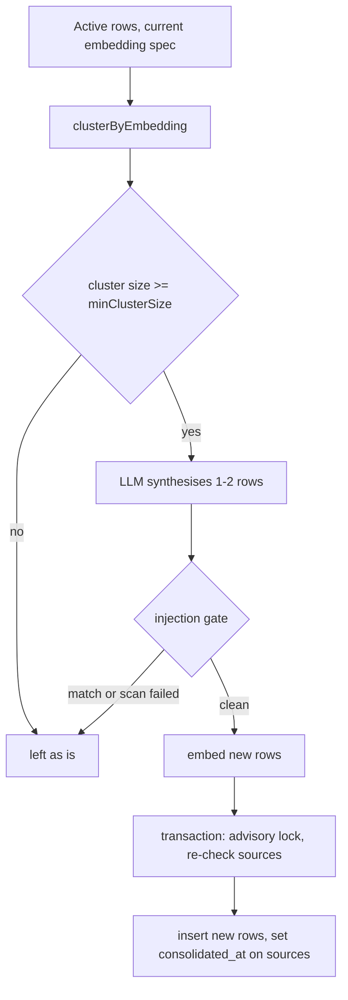

# Agent Memory

> Indexed at commit `d0a90fb5` on 2026-10-06 · [view on GitHub](https://github.com/yorch/auto-swe/tree/d0a90fb5)

## Relevant source files

- [packages/worker/src/lib/memoryStore.ts](https://github.com/yorch/auto-swe/blob/d0a90fb5/packages/worker/src/lib/memoryStore.ts)
- [packages/worker/src/lib/memoryGuard.ts](https://github.com/yorch/auto-swe/blob/d0a90fb5/packages/worker/src/lib/memoryGuard.ts)
- [packages/worker/src/lib/lessonRetrieval.ts](https://github.com/yorch/auto-swe/blob/d0a90fb5/packages/worker/src/lib/lessonRetrieval.ts)
- [packages/worker/src/lib/channelMemory.ts](https://github.com/yorch/auto-swe/blob/d0a90fb5/packages/worker/src/lib/channelMemory.ts)
- [packages/worker/src/lib/embeddingClustering.ts](https://github.com/yorch/auto-swe/blob/d0a90fb5/packages/worker/src/lib/embeddingClustering.ts)
- [packages/worker/src/activities/commitToMemory.ts](https://github.com/yorch/auto-swe/blob/d0a90fb5/packages/worker/src/activities/commitToMemory.ts)
- [packages/worker/src/activities/consolidateLessons.ts](https://github.com/yorch/auto-swe/blob/d0a90fb5/packages/worker/src/activities/consolidateLessons.ts)
- [packages/worker/src/activities/consolidateChannelMemory.ts](https://github.com/yorch/auto-swe/blob/d0a90fb5/packages/worker/src/activities/consolidateChannelMemory.ts)
- [packages/worker/src/activities/getReposForConsolidation.ts](https://github.com/yorch/auto-swe/blob/d0a90fb5/packages/worker/src/activities/getReposForConsolidation.ts)
- [packages/worker/src/activities/passiveIngestChannelMemory.ts](https://github.com/yorch/auto-swe/blob/d0a90fb5/packages/worker/src/activities/passiveIngestChannelMemory.ts)
- [packages/worker/src/activities/reembedMemory.ts](https://github.com/yorch/auto-swe/blob/d0a90fb5/packages/worker/src/activities/reembedMemory.ts)
- [packages/gateway/src/routes/lessons.ts](https://github.com/yorch/auto-swe/blob/d0a90fb5/packages/gateway/src/routes/lessons.ts)

## Overview

Agent memory is the text that later runs recall into a prompt. It lives in one table, `memory_items`, and serves two flows: repository lessons (scope `swe-lessons`, keyed by `repo_id`), which land in the implementer's system prompt, and Slack channel memory (scope `channel-memory`, keyed by `channel_id`), which is prepended to the channel assistant's turn. Each row carries a pgvector embedding of its summary, so recall is a cosine-similarity search.

Four mechanisms surround the table: a shared store for the vector SQL, an injection gate on write and read, consolidation jobs that merge near-duplicate rows, and gateway routes for listing and managing lessons. The store's header comment names the table's two writers and states that the module is the single source of truth for the SELECT and INSERT so the flows cannot drift ([memoryStore.ts:L5-L17](https://github.com/yorch/auto-swe/blob/d0a90fb5/packages/worker/src/lib/memoryStore.ts#L5-L17)).

Sources: [packages/worker/src/lib/memoryStore.ts:L1-L17](https://github.com/yorch/auto-swe/blob/d0a90fb5/packages/worker/src/lib/memoryStore.ts#L1-L17) [packages/gateway/src/routes/lessons.ts:L35-L42](https://github.com/yorch/auto-swe/blob/d0a90fb5/packages/gateway/src/routes/lessons.ts#L35-L42)

## Implementation

### Embeddings and pgvector recall

`insertMemoryItem` is the only write path for new rows outside consolidation. It first runs the injection gate on `lessonSummary` and `rationale`, then embeds the summary, then inserts with the embedding and the embedding spec it was produced under ([memoryStore.ts:L172-L237](https://github.com/yorch/auto-swe/blob/d0a90fb5/packages/worker/src/lib/memoryStore.ts#L172-L237)). The gate runs before the embedding, so a refused write costs no provider call. When the caller supplies no explicit entity, the entity pair is derived from the legacy columns: a `repoId` becomes a `connection` entity and a `channelId` becomes a `channel` entity.

`searchMemoryItemsByVector` ranks by pgvector cosine distance (`<=>`). It filters to rows that have an embedding, are not consolidated, and carry either a null `embedding_model` or the current spec, so vectors from different embedding models are never compared after a model switch ([memoryStore.ts:L68-L110](https://github.com/yorch/auto-swe/blob/d0a90fb5/packages/worker/src/lib/memoryStore.ts#L68-L110)). The scope column is interpolated into the SQL string, so it is checked against the allowlist `repo_id` / `channel_id`; every runtime value is a bind parameter ([memoryStore.ts:L27-L49](https://github.com/yorch/auto-swe/blob/d0a90fb5/packages/worker/src/lib/memoryStore.ts#L27-L49)). `searchMemoryItemsByEntity` is the generic counterpart keyed on `entity_type` and `entity_id`.

`reembedMemoryItem` regenerates the embedding from a row's current summary, and returns `false` for a missing row ([memoryStore.ts:L256-L281](https://github.com/yorch/auto-swe/blob/d0a90fb5/packages/worker/src/lib/memoryStore.ts#L256-L281)). The `reembedMemoryItemActivity` wrapper runs after an admin edits a channel memory item's text, because the gateway has already written the new text and the stored vector is stale; a missing row is logged and skipped ([reembedMemory.ts:L10-L27](https://github.com/yorch/auto-swe/blob/d0a90fb5/packages/worker/src/activities/reembedMemory.ts#L10-L27)).

Sources: [packages/worker/src/lib/memoryStore.ts:L68-L281](https://github.com/yorch/auto-swe/blob/d0a90fb5/packages/worker/src/lib/memoryStore.ts#L68-L281) [packages/worker/src/activities/reembedMemory.ts:L10-L27](https://github.com/yorch/auto-swe/blob/d0a90fb5/packages/worker/src/activities/reembedMemory.ts#L10-L27)

### Lessons: write and recall

`commitToMemory` loads the workflow and its pull requests, asks the `commitToMemory` agent for a structured lesson (`failureType`, `lessonSummary`, `rationale`, `metadata`), and writes it through `insertMemoryItem` with the repo as the `connection` entity ([commitToMemory.ts:L36-L64](https://github.com/yorch/auto-swe/blob/d0a90fb5/packages/worker/src/activities/commitToMemory.ts#L36-L64), [commitToMemory.ts:L70-L211](https://github.com/yorch/auto-swe/blob/d0a90fb5/packages/worker/src/activities/commitToMemory.ts#L70-L211)). A run with no workspace connection fails with a non-retryable `NO_CONNECTION` error. If the gate refuses the lesson, the activity records a `memory.lesson_refused` event naming the patterns and returns an empty id rather than failing, since a retry would regenerate the same kind of text ([commitToMemory.ts:L192-L204](https://github.com/yorch/auto-swe/blob/d0a90fb5/packages/worker/src/activities/commitToMemory.ts#L192-L204)).

`recordLessonDirectly` skips the summarizer for callers that already know what happened and returns `null` on any failure; `recordLessonBackground` races that write against a 5-second ceiling ([commitToMemory.ts:L235-L289](https://github.com/yorch/auto-swe/blob/d0a90fb5/packages/worker/src/activities/commitToMemory.ts#L235-L289)).

`retrieveSimilarLessons` searches by `repo_id` (default limit 5, threshold 0.7), then filters the results through the read-side gate because they go straight into the implementer's system prompt ([lessonRetrieval.ts:L11-L49](https://github.com/yorch/auto-swe/blob/d0a90fb5/packages/worker/src/lib/lessonRetrieval.ts#L11-L49)).

Sources: [packages/worker/src/activities/commitToMemory.ts:L70-L289](https://github.com/yorch/auto-swe/blob/d0a90fb5/packages/worker/src/activities/commitToMemory.ts#L70-L289) [packages/worker/src/lib/lessonRetrieval.ts:L1-L49](https://github.com/yorch/auto-swe/blob/d0a90fb5/packages/worker/src/lib/lessonRetrieval.ts#L1-L49)

### Channel memory

`writeChannelMemory` inserts a `channel-memory` row attributed to `channelAssistant`, with the channel, team and org set and `repo_id` null ([channelMemory.ts:L269-L291](https://github.com/yorch/auto-swe/blob/d0a90fb5/packages/worker/src/lib/channelMemory.ts#L269-L291)). `passiveIngestChannelMemory` fills the same table without a Slack reply: it reads human messages after a stored cursor, has the model extract at most five facts, skips any fact whose nearest channel neighbour is above the `channel.memoryDedupThreshold` setting, and writes the rest with `source: 'passive-ingest'` metadata. It holds channel budget before advancing the cursor and settles the hold in a `finally` block ([passiveIngestChannelMemory.ts:L69-L264](https://github.com/yorch/auto-swe/blob/d0a90fb5/packages/worker/src/activities/passiveIngestChannelMemory.ts#L69-L264)).

`retrieveChannelMemory` embeds the query once and searches the channel (default threshold 0.65). When the channel has a team and room remains, it also searches other channels in the team at a threshold of at least 0.75, labelling those hits `crossChannel` ([channelMemory.ts:L37-L94](https://github.com/yorch/auto-swe/blob/d0a90fb5/packages/worker/src/lib/channelMemory.ts#L37-L94)). The cross-channel SQL is built once for the team and org scopes and joins `slack_channels` with `is_private = false`, so a private channel is never a cross-channel source ([channelMemory.ts:L125-L163](https://github.com/yorch/auto-swe/blob/d0a90fb5/packages/worker/src/lib/channelMemory.ts#L125-L163)). `searchOrgChannelMemory` and `recentChannelMemory` pass their results through the gate as well ([channelMemory.ts:L212-L256](https://github.com/yorch/auto-swe/blob/d0a90fb5/packages/worker/src/lib/channelMemory.ts#L212-L256)).

Sources: [packages/worker/src/lib/channelMemory.ts:L37-L291](https://github.com/yorch/auto-swe/blob/d0a90fb5/packages/worker/src/lib/channelMemory.ts#L37-L291) [packages/worker/src/activities/passiveIngestChannelMemory.ts:L69-L275](https://github.com/yorch/auto-swe/blob/d0a90fb5/packages/worker/src/activities/passiveIngestChannelMemory.ts#L69-L275)

## Injection gate

[memoryGuard.ts](https://github.com/yorch/auto-swe/blob/d0a90fb5/packages/worker/src/lib/memoryGuard.ts) is the one gate shared by both directions. It checks text against the `INJECTION` pattern set only; the `EXFILTRATION` set is excluded because it is written for prose and would flag ordinary notes that name a URL or a command ([memoryGuard.ts:L1-L23](https://github.com/yorch/auto-swe/blob/d0a90fb5/packages/worker/src/lib/memoryGuard.ts#L1-L23)). `memoryInjectionMatches` joins the texts and calls `scanSkillContent` with `full: true`, which covers every character in overlapping windows rather than truncating, then keeps the hits whose key starts with `injection:` ([memoryGuard.ts:L38-L47](https://github.com/yorch/auto-swe/blob/d0a90fb5/packages/worker/src/lib/memoryGuard.ts#L38-L47), [skillScanner.ts:L30-L58](https://github.com/yorch/auto-swe/blob/d0a90fb5/packages/shared/src/lib/skillScanner.ts#L30-L58)).

Where the gate applies:

| Path | Behaviour |
| ---- | --------- |
| `insertMemoryItem` write | Throws `MemoryContentRefusedError`, which names patterns and never the text ([memoryGuard.ts:L22-L55](https://github.com/yorch/auto-swe/blob/d0a90fb5/packages/worker/src/lib/memoryGuard.ts#L22-L55)) |
| Consolidation insert | Scans the merged output; a refusal or a failed scan leaves the source cluster untouched ([consolidateLessons.ts:L204-L213](https://github.com/yorch/auto-swe/blob/d0a90fb5/packages/worker/src/activities/consolidateLessons.ts#L204-L213) [consolidateChannelMemory.ts:L266-L278](https://github.com/yorch/auto-swe/blob/d0a90fb5/packages/worker/src/activities/consolidateChannelMemory.ts#L266-L278)) |
| Recall (`withoutFlaggedMemory`) | Drops flagged items, keeps order, and returns nothing if the scan throws ([memoryGuard.ts:L57-L87](https://github.com/yorch/auto-swe/blob/d0a90fb5/packages/worker/src/lib/memoryGuard.ts#L57-L87)) |

A scan that throws fails closed on both write and read. The gate acts on the warnings that `scanSkillContent` returns; a pattern that does not complete within its execution budget, or is quarantined, produces no warning and so does not gate. Consolidation inserts rows directly with SQL instead of `insertMemoryItem`, which is why it carries its own scan.

The gateway does not reference the gate: an admin edit of a channel memory item's text is not gated at save. Such a row is covered on recall, where `withoutFlaggedMemory` drops it, as the guard's own comment states ([memoryGuard.ts:L57-L62](https://github.com/yorch/auto-swe/blob/d0a90fb5/packages/worker/src/lib/memoryGuard.ts#L57-L62)). Recalled blocks are also wrapped by `fenceRecalledMemory` in a `<recalled_memory>` fence with an instruction to treat the contents as reference data ([memoryGuard.ts:L89-L104](https://github.com/yorch/auto-swe/blob/d0a90fb5/packages/worker/src/lib/memoryGuard.ts#L89-L104)).

Sources: [packages/worker/src/lib/memoryGuard.ts:L1-L104](https://github.com/yorch/auto-swe/blob/d0a90fb5/packages/worker/src/lib/memoryGuard.ts#L1-L104) [packages/shared/src/lib/skillScanner.ts:L30-L58](https://github.com/yorch/auto-swe/blob/d0a90fb5/packages/shared/src/lib/skillScanner.ts#L30-L58)

## Consolidation

Both consolidation activities load active rows with their embeddings (`embedding::text`), restricted to the current embedding spec, and parse them into vectors. `clusterByEmbedding` then does greedy clustering: for each unassigned vector it pulls in every later vector whose cosine similarity meets the threshold, and a null or zero-norm vector stays a singleton ([embeddingClustering.ts:L28-L72](https://github.com/yorch/auto-swe/blob/d0a90fb5/packages/worker/src/lib/embeddingClustering.ts#L28-L72)). Only clusters of at least `minClusterSize` qualify.

`consolidateLessons` resolves the size and threshold from the input or the DB-backed consolidation config, then runs the `lessonConsolidator` agent over each qualifying cluster through a pool of 3 concurrent workers. Each cluster yields one or two lessons ([consolidateLessons.ts:L54-L117](https://github.com/yorch/auto-swe/blob/d0a90fb5/packages/worker/src/activities/consolidateLessons.ts#L54-L117), [consolidateLessons.ts:L271-L286](https://github.com/yorch/auto-swe/blob/d0a90fb5/packages/worker/src/activities/consolidateLessons.ts#L271-L286)). Embeddings are generated before the transaction opens. Inside it, a `pg_advisory_xact_lock` per repo serialises runs and a re-check confirms the sources are still unconsolidated; the new rows are inserted with `consolidatedFrom` provenance and the sources are soft-deleted by setting `consolidated_at` ([consolidateLessons.ts:L227-L268](https://github.com/yorch/auto-swe/blob/d0a90fb5/packages/worker/src/activities/consolidateLessons.ts#L227-L268)). Search and recall exclude consolidated rows.

`consolidateChannelMemory` follows the same pattern per channel, with a per-channel opt-out and per-channel size and threshold overrides. The threshold falls back to the `channel.memoryDedupThreshold` setting, and the activity skips an over-budget channel ([consolidateChannelMemory.ts:L87-L133](https://github.com/yorch/auto-swe/blob/d0a90fb5/packages/worker/src/activities/consolidateChannelMemory.ts#L87-L133), [consolidateChannelMemory.ts:L294-L331](https://github.com/yorch/auto-swe/blob/d0a90fb5/packages/worker/src/activities/consolidateChannelMemory.ts#L294-L331)). `getReposForConsolidation` feeds the schedule with active connections that have `consolidationEnabled` ([getReposForConsolidation.ts:L9-L20](https://github.com/yorch/auto-swe/blob/d0a90fb5/packages/worker/src/activities/getReposForConsolidation.ts#L9-L20)).

Sources: [packages/worker/src/lib/embeddingClustering.ts:L28-L72](https://github.com/yorch/auto-swe/blob/d0a90fb5/packages/worker/src/lib/embeddingClustering.ts#L28-L72) [packages/worker/src/activities/consolidateLessons.ts:L54-L268](https://github.com/yorch/auto-swe/blob/d0a90fb5/packages/worker/src/activities/consolidateLessons.ts#L54-L268) [packages/worker/src/activities/consolidateChannelMemory.ts:L87-L331](https://github.com/yorch/auto-swe/blob/d0a90fb5/packages/worker/src/activities/consolidateChannelMemory.ts#L87-L331)

## Lessons routes

[lessons.ts](https://github.com/yorch/auto-swe/blob/d0a90fb5/packages/gateway/src/routes/lessons.ts) serves repository lessons only. Every query is pinned to `scope: 'swe-lessons'` so a platform admin's unfiltered list cannot surface channel memory, including private channels ([lessons.ts:L35-L42](https://github.com/yorch/auto-swe/blob/d0a90fb5/packages/gateway/src/routes/lessons.ts#L35-L42)).

| Route | Role | Behaviour |
| ----- | ---- | --------- |
| `GET /` | ENGINEER | Paginated list; non-admins are limited to reachable connections; optional `repoId`, `q`, `includeConsolidated` ([lessons.ts:L48-L109](https://github.com/yorch/auto-swe/blob/d0a90fb5/packages/gateway/src/routes/lessons.ts#L48-L109)) |
| `GET /search` | ENGINEER | Case-insensitive text match on summary and rationale within one authorised repo; the gateway does not run the vector query ([lessons.ts:L112-L171](https://github.com/yorch/auto-swe/blob/d0a90fb5/packages/gateway/src/routes/lessons.ts#L112-L171)) |
| `POST /consolidate` | ADMIN | Starts a consolidation workflow and answers 202 with its id ([lessons.ts:L174-L202](https://github.com/yorch/auto-swe/blob/d0a90fb5/packages/gateway/src/routes/lessons.ts#L174-L202)) |
| `GET /stats` | ADMIN | Per-repo total, active and consolidated counts via `groupBy`, with a zero row for every git repo ([lessons.ts:L215-L279](https://github.com/yorch/auto-swe/blob/d0a90fb5/packages/gateway/src/routes/lessons.ts#L215-L279)) |
| `DELETE /:id` | ADMIN | Deletes the lesson and writes an audit row carrying its content in one transaction ([lessons.ts:L282-L325](https://github.com/yorch/auto-swe/blob/d0a90fb5/packages/gateway/src/routes/lessons.ts#L282-L325)) |

Sources: [packages/gateway/src/routes/lessons.ts:L1-L326](https://github.com/yorch/auto-swe/blob/d0a90fb5/packages/gateway/src/routes/lessons.ts#L1-L326)

## Related Pages

- Parent: [Temporal Worker](./4-temporal-worker.md)
- Sibling: [Activities](./4.2-activities.md)
- Sibling: [Agent Layer](./4.3-agent-layer.md)
- Sibling: [Model Catalog and Pricing](./4.7-model-catalog-and-pricing.md)
