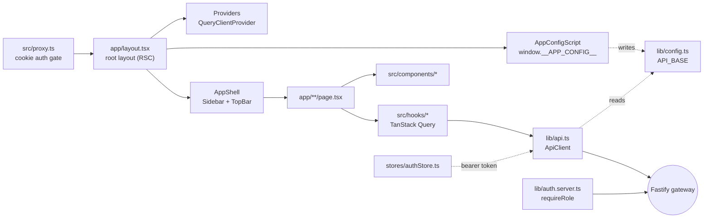
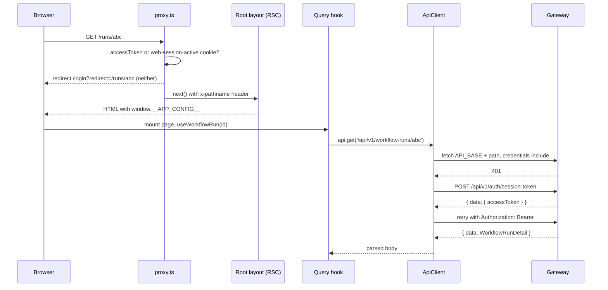

# @auto-swe/web — Next.js Dashboard

> Indexed at commit `b1d8930` on 2026-09-08 · [view on GitHub](https://github.com/yorch/auto-swe/tree/b1d8930)

## Relevant source files

- [packages/web/package.json](https://github.com/yorch/auto-swe/blob/b1d8930/packages/web/package.json)
- [packages/web/next.config.ts](https://github.com/yorch/auto-swe/blob/b1d8930/packages/web/next.config.ts)
- [packages/web/src/proxy.ts](https://github.com/yorch/auto-swe/blob/b1d8930/packages/web/src/proxy.ts)
- [packages/web/src/app/layout.tsx](https://github.com/yorch/auto-swe/blob/b1d8930/packages/web/src/app/layout.tsx)
- [packages/web/src/app/page.tsx](https://github.com/yorch/auto-swe/blob/b1d8930/packages/web/src/app/page.tsx)
- [packages/web/src/app/globals.css](https://github.com/yorch/auto-swe/blob/b1d8930/packages/web/src/app/globals.css)
- [packages/web/src/components/Providers.tsx](https://github.com/yorch/auto-swe/blob/b1d8930/packages/web/src/components/Providers.tsx)
- [packages/web/src/components/AppConfigScript.tsx](https://github.com/yorch/auto-swe/blob/b1d8930/packages/web/src/components/AppConfigScript.tsx)
- [packages/web/src/components/layout/AppShell.tsx](https://github.com/yorch/auto-swe/blob/b1d8930/packages/web/src/components/layout/AppShell.tsx)
- [packages/web/src/components/auth/RoleLayout.tsx](https://github.com/yorch/auto-swe/blob/b1d8930/packages/web/src/components/auth/RoleLayout.tsx)
- [packages/web/src/lib/config.ts](https://github.com/yorch/auto-swe/blob/b1d8930/packages/web/src/lib/config.ts)
- [packages/web/src/lib/api.ts](https://github.com/yorch/auto-swe/blob/b1d8930/packages/web/src/lib/api.ts)
- [packages/web/src/lib/env.ts](https://github.com/yorch/auto-swe/blob/b1d8930/packages/web/src/lib/env.ts)
- [packages/web/src/lib/auth.server.ts](https://github.com/yorch/auto-swe/blob/b1d8930/packages/web/src/lib/auth.server.ts)
- [packages/web/src/lib/networkErrors.ts](https://github.com/yorch/auto-swe/blob/b1d8930/packages/web/src/lib/networkErrors.ts)
- [packages/web/src/lib/palette.ts](https://github.com/yorch/auto-swe/blob/b1d8930/packages/web/src/lib/palette.ts)
- [packages/web/src/lib/docs.ts](https://github.com/yorch/auto-swe/blob/b1d8930/packages/web/src/lib/docs.ts)
- [packages/web/src/hooks/useListQuery.ts](https://github.com/yorch/auto-swe/blob/b1d8930/packages/web/src/hooks/useListQuery.ts)
- [packages/web/src/hooks/useRuns.ts](https://github.com/yorch/auto-swe/blob/b1d8930/packages/web/src/hooks/useRuns.ts)
- [packages/web/src/hooks/useApprovals.ts](https://github.com/yorch/auto-swe/blob/b1d8930/packages/web/src/hooks/useApprovals.ts)
- [packages/web/src/stores/authStore.ts](https://github.com/yorch/auto-swe/blob/b1d8930/packages/web/src/stores/authStore.ts)
- [packages/web/src/stores/teamStore.ts](https://github.com/yorch/auto-swe/blob/b1d8930/packages/web/src/stores/teamStore.ts)
- [packages/web/postcss.config.mjs](https://github.com/yorch/auto-swe/blob/b1d8930/packages/web/postcss.config.mjs)
- [packages/web/tsconfig.json](https://github.com/yorch/auto-swe/blob/b1d8930/packages/web/tsconfig.json)
- [packages/web/Dockerfile](https://github.com/yorch/auto-swe/blob/b1d8930/packages/web/Dockerfile)

## Overview

`@auto-swe/web` is the operator-facing dashboard: a Next.js 16 App Router application that renders workflow runs, approval queues, the workflow library, agent and skill configuration, and platform governance screens. It is a separate deployable from the gateway, served by `next start` in development and by the standalone Node server in the container image ([packages/web/package.json:L5-L9](https://github.com/yorch/auto-swe/blob/b1d8930/packages/web/package.json#L5-L9), [packages/web/Dockerfile:L104-L105](https://github.com/yorch/auto-swe/blob/b1d8930/packages/web/Dockerfile#L104-L105)).

The package holds no business logic of its own. Every domain type it renders is imported from `@auto-swe/shared/types/api`, and every read or write goes over the gateway's REST API. The application layer is therefore thin: 48 `page.tsx` route files, 18 layout files, 95 non-test components, 27 hooks, and 2 Zustand stores. React 19.2.8 with the App Router is the rendering model; almost every page is a Client Component, with Server Components reserved for role guards and filesystem-backed documentation ([packages/web/package.json:L11-L27](https://github.com/yorch/auto-swe/blob/b1d8930/packages/web/package.json#L11-L27)).

## Architecture

Requests enter through `proxy.ts`, which decides only whether the visitor is signed in. The root layout then injects runtime configuration into the HTML, mounts the TanStack Query client, and wraps the page in the sidebar chrome. Pages call hooks, hooks call the shared `ApiClient` singleton, and the client issues a cross-origin `fetch` to the gateway. Server Component guards are the one path that talks to the gateway from inside the web container rather than from the browser.

Sources: [packages/web/src/proxy.ts:L31-L52](https://github.com/yorch/auto-swe/blob/b1d8930/packages/web/src/proxy.ts#L31-L52) [packages/web/src/app/layout.tsx:L28-L62](https://github.com/yorch/auto-swe/blob/b1d8930/packages/web/src/app/layout.tsx#L28-L62) [packages/web/src/lib/api.ts:L48-L114](https://github.com/yorch/auto-swe/blob/b1d8930/packages/web/src/lib/api.ts#L48-L114)

## Module Layout

| Module | Path | Responsibility |
| ------ | ---- | -------------- |
| Route tree | `packages/web/src/app/` | App Router pages, section layouts, `globals.css`, the `/health` route handler |
| Proxy | `packages/web/src/proxy.ts` | Next 16 proxy (the renamed middleware): cookie-presence auth gate and `x-pathname` injection |
| Components | `packages/web/src/components/` | 17 feature folders plus a 22-file `ui/` primitive set |
| Hooks | `packages/web/src/hooks/` | One file per API domain; TanStack Query wrappers over `ApiClient` |
| Stores | `packages/web/src/stores/` | `authStore` (session and sign-in flows), `teamStore` (selected team) |
| Lib | `packages/web/src/lib/` | API client, runtime config, formatting, chart and DAG layout helpers, server-side auth |
| Test helpers | `packages/web/src/test/rtl-helpers.tsx` | React Testing Library render wrapper for component tests |

Path alias `@/*` maps to `packages/web/src/*`, so every internal import in the package is written as `@/lib/...` or `@/components/...` ([packages/web/tsconfig.json:L11-L13](https://github.com/yorch/auto-swe/blob/b1d8930/packages/web/tsconfig.json#L11-L13)).

Sources: [packages/web/tsconfig.json:L1-L33](https://github.com/yorch/auto-swe/blob/b1d8930/packages/web/tsconfig.json#L1-L33) [packages/web/src/proxy.ts:L1-L52](https://github.com/yorch/auto-swe/blob/b1d8930/packages/web/src/proxy.ts#L1-L52)

## Key Components

### Root layout and providers

`RootLayout` is a Server Component. It loads the Inter and IBM Plex Mono fonts through `next/font/google`, exposes them as the `--font-inter` and `--font-ibm-plex-mono` CSS variables on `<html>`, and nests three wrappers around the page: `Providers`, `ErrorBoundary`, and `AppShell` ([packages/web/src/app/layout.tsx:L9-L21](https://github.com/yorch/auto-swe/blob/b1d8930/packages/web/src/app/layout.tsx#L9-L21), [packages/web/src/app/layout.tsx:L54-L60](https://github.com/yorch/auto-swe/blob/b1d8930/packages/web/src/app/layout.tsx#L54-L60)).

`Providers` constructs one `QueryClient` per browser session inside `useState`, with `retry: 1` and a 30-second `staleTime` as the defaults every hook inherits. It also fires `authStore.checkAuth()` once on mount, which reconciles the in-memory identity with whatever credentials the browser actually holds ([packages/web/src/components/Providers.tsx:L8-L26](https://github.com/yorch/auto-swe/blob/b1d8930/packages/web/src/components/Providers.tsx#L8-L26)).

`AppShell` renders the two-column chrome — a 234px `Sidebar` and a `TopBar` — and drops it entirely on `/login`. Run detail and template diff routes are matched by regular expression and given a non-scrolling full-height `main` instead of the centred 1280px column. The approvals SSE subscription is mounted in the inner `Chrome` component rather than `AppShell` itself, so the single `EventSource` opens only on chromed routes ([packages/web/src/components/layout/AppShell.tsx:L11-L52](https://github.com/yorch/auto-swe/blob/b1d8930/packages/web/src/components/layout/AppShell.tsx#L11-L52)).

Sources: [packages/web/src/app/layout.tsx:L1-L63](https://github.com/yorch/auto-swe/blob/b1d8930/packages/web/src/app/layout.tsx#L1-L63) [packages/web/src/components/Providers.tsx:L1-L27](https://github.com/yorch/auto-swe/blob/b1d8930/packages/web/src/components/Providers.tsx#L1-L27) [packages/web/src/components/layout/AppShell.tsx:L1-L53](https://github.com/yorch/auto-swe/blob/b1d8930/packages/web/src/components/layout/AppShell.tsx#L1-L53)

### How the browser reaches the gateway

There is no rewrite, proxy route, or API forwarding layer. `next.config.ts` declares `allowedDevOrigins`, an `env` block, `output: 'standalone'`, and `reactStrictMode`, and nothing else ([packages/web/next.config.ts:L21-L34](https://github.com/yorch/auto-swe/blob/b1d8930/packages/web/next.config.ts#L21-L34)). The browser calls the Fastify gateway directly, cross-origin, at `API_BASE`.

`API_BASE` is resolved at module load in `lib/config.ts` from three sources in order: `window.__APP_CONFIG__.apiUrl`, the build-time `NEXT_PUBLIC_API_URL`, then `http://localhost:8080` ([packages/web/src/lib/config.ts:L25-L26](https://github.com/yorch/auto-swe/blob/b1d8930/packages/web/src/lib/config.ts#L25-L26)). The first source is what makes a prebuilt image portable: `RootLayout` serialises the gateway URL and the Temporal UI URL into a JSON string with `<`, `>`, and `&` escaped, and `AppConfigScript` inserts it into `<head>` through `useServerInsertedHTML` as `window.__APP_CONFIG__=…` ([packages/web/src/app/layout.tsx:L29-L37](https://github.com/yorch/auto-swe/blob/b1d8930/packages/web/src/app/layout.tsx#L29-L37), [packages/web/src/components/AppConfigScript.tsx:L13-L23](https://github.com/yorch/auto-swe/blob/b1d8930/packages/web/src/components/AppConfigScript.tsx#L13-L23)). Because that script runs before the client bundle evaluates, the URL is a per-deployment runtime value rather than a constant inlined at `next build`.

Server-side fetches use a different address. `apiInternalUrl()` reads `API_INTERNAL_URL` first, because the browser-facing URL is frequently `http://localhost:8080`, which inside the web container points at the container's own loopback rather than the gateway ([packages/web/src/lib/env.ts:L11-L21](https://github.com/yorch/auto-swe/blob/b1d8930/packages/web/src/lib/env.ts#L11-L21)).

Sources: [packages/web/next.config.ts:L1-L36](https://github.com/yorch/auto-swe/blob/b1d8930/packages/web/next.config.ts#L1-L36) [packages/web/src/lib/config.ts:L1-L34](https://github.com/yorch/auto-swe/blob/b1d8930/packages/web/src/lib/config.ts#L1-L34) [packages/web/src/components/AppConfigScript.tsx:L1-L26](https://github.com/yorch/auto-swe/blob/b1d8930/packages/web/src/components/AppConfigScript.tsx#L1-L26) [packages/web/src/lib/env.ts:L1-L21](https://github.com/yorch/auto-swe/blob/b1d8930/packages/web/src/lib/env.ts#L1-L21)

### The API client

`ApiClient` is a single exported instance holding an in-memory bearer token, and it is the only place in the package that calls `fetch` against the gateway's `/api/v1/*` surface ([packages/web/src/lib/api.ts:L8-L9](https://github.com/yorch/auto-swe/blob/b1d8930/packages/web/src/lib/api.ts#L8-L9), [packages/web/src/lib/api.ts:L217](https://github.com/yorch/auto-swe/blob/b1d8930/packages/web/src/lib/api.ts#L217)). Every request sends `credentials: 'include'` so the better-auth session cookie travels cross-origin, and adds an `Authorization` header when a token is held — the gateway tries the header first and falls back to the cookie, so both auth modes work without per-call branching ([packages/web/src/lib/api.ts:L61-L71](https://github.com/yorch/auto-swe/blob/b1d8930/packages/web/src/lib/api.ts#L61-L71)).

Four details in `fetch` exist because their absence broke something. A `Content-Type` header is attached only when a body exists, because Fastify rejects a JSON content type with an empty body and every dashboard `DELETE` failed ([packages/web/src/lib/api.ts:L51-L56](https://github.com/yorch/auto-swe/blob/b1d8930/packages/web/src/lib/api.ts#L51-L56)). A `204` or zero-length response returns `undefined` rather than throwing inside `res.json()`, which would have rejected a mutation the server had already applied and skipped the caller's cache invalidation ([packages/web/src/lib/api.ts:L116-L127](https://github.com/yorch/auto-swe/blob/b1d8930/packages/web/src/lib/api.ts#L116-L127)). A `401` on a request that carried a token triggers one refresh against `POST /api/v1/auth/session-token`, deduplicated through a shared `refreshPromise` and guarded by a `tokenGeneration` counter so a concurrent logout or fresh login is not overwritten ([packages/web/src/lib/api.ts:L150-L194](https://github.com/yorch/auto-swe/blob/b1d8930/packages/web/src/lib/api.ts#L150-L194)). A network-level `TypeError` is rewrapped by `gatewayUnreachableMessage` into a message naming the actual `API_BASE` and the `CORS_ORIGIN` setting, since "failed to fetch" and "wrong credentials" need opposite remediations ([packages/web/src/lib/networkErrors.ts:L15-L32](https://github.com/yorch/auto-swe/blob/b1d8930/packages/web/src/lib/networkErrors.ts#L15-L32)).

Sources: [packages/web/src/lib/api.ts:L1-L217](https://github.com/yorch/auto-swe/blob/b1d8930/packages/web/src/lib/api.ts#L1-L217) [packages/web/src/lib/networkErrors.ts:L1-L50](https://github.com/yorch/auto-swe/blob/b1d8930/packages/web/src/lib/networkErrors.ts#L1-L50)

### Route protection: proxy gate plus server-side role guard

`proxy.ts` is Next 16's proxy convention, the successor to `middleware.ts`, and its matcher covers everything except `_next/static`, `_next/image`, and `favicon.ico` ([packages/web/src/proxy.ts:L50-L52](https://github.com/yorch/auto-swe/blob/b1d8930/packages/web/src/proxy.ts#L50-L52)). It performs a presence check only: either the legacy `accessToken` JWT cookie or the `web-session-active` marker that `authStore` drops after a magic-link or social sign-in lets the request through, and neither is validated. The real better-auth session cookie lives on the gateway origin and is invisible here, so validation stays with the gateway's `requireAuth` on every `/api/v1/*` call. Requests without either cookie are redirected to `/login` with the original path as a `redirect` query parameter ([packages/web/src/proxy.ts:L38-L47](https://github.com/yorch/auto-swe/blob/b1d8930/packages/web/src/proxy.ts#L38-L47)).

The proxy's second job is to copy the matched pathname into an `x-pathname` request header, because layouts have no access to the URL ([packages/web/src/proxy.ts:L25-L29](https://github.com/yorch/auto-swe/blob/b1d8930/packages/web/src/proxy.ts#L25-L29)). Authorisation itself is enforced by Server Component layouts: `RoleLayout` awaits `requireRole`, which reads the token cookie, calls `GET /api/v1/auth/me` over `API_INTERNAL_URL` with `cache: 'no-store'`, and redirects to `/` unless the user is active and `roleMeets` accepts their role ([packages/web/src/components/auth/RoleLayout.tsx:L10-L13](https://github.com/yorch/auto-swe/blob/b1d8930/packages/web/src/components/auth/RoleLayout.tsx#L10-L13), [packages/web/src/lib/auth.server.ts:L15-L52](https://github.com/yorch/auto-swe/blob/b1d8930/packages/web/src/lib/auth.server.ts#L15-L52)). The `/govern` tree admits ENGINEER and above; `/studio` is ADMIN-only.

Sources: [packages/web/src/proxy.ts:L1-L52](https://github.com/yorch/auto-swe/blob/b1d8930/packages/web/src/proxy.ts#L1-L52) [packages/web/src/lib/auth.server.ts:L1-L53](https://github.com/yorch/auto-swe/blob/b1d8930/packages/web/src/lib/auth.server.ts#L1-L53) [packages/web/src/components/auth/RoleLayout.tsx:L1-L13](https://github.com/yorch/auto-swe/blob/b1d8930/packages/web/src/components/auth/RoleLayout.tsx#L1-L13)

### Query hooks

Hooks are organised one file per API domain and follow a fixed shape: `'use client'`, domain types imported from `@auto-swe/shared/types/api`, a `useQuery` whose `queryFn` unwraps the gateway's `{ data }` envelope, and a `queryKey` array whose first element is the domain name ([packages/web/src/hooks/useRuns.ts:L1-L31](https://github.com/yorch/auto-swe/blob/b1d8930/packages/web/src/hooks/useRuns.ts#L1-L31)). Freshness is expressed per hook through `refetchInterval` rather than through global settings, and the interval can be a function of the current data — a workflow run polls every 3 seconds while `RUNNING` and every 30 seconds once it is not ([packages/web/src/hooks/useRuns.ts:L43-L47](https://github.com/yorch/auto-swe/blob/b1d8930/packages/web/src/hooks/useRuns.ts#L43-L47)).

Paginated endpoints go through `useListQuery`, which returns the rows as `data` and the pagination block as `meta`. A hook that unwrapped `data` alone would silently discard the total and render "N total" for the current page rather than the table ([packages/web/src/hooks/useListQuery.ts:L35-L49](https://github.com/yorch/auto-swe/blob/b1d8930/packages/web/src/hooks/useListQuery.ts#L35-L49)). Its companion `listUrl` appends `limit` and `offset` while preserving an existing query string ([packages/web/src/hooks/useListQuery.ts:L23-L33](https://github.com/yorch/auto-swe/blob/b1d8930/packages/web/src/hooks/useListQuery.ts#L23-L33)). Mutations invalidate by key prefix in `onSuccess`; responding to an approval invalidates both `['approvals']` and `['workflow-run']` ([packages/web/src/hooks/useApprovals.ts:L73-L83](https://github.com/yorch/auto-swe/blob/b1d8930/packages/web/src/hooks/useApprovals.ts#L73-L83)).

Live updates use one server-sent-events subscription. `useApprovalsStream` opens a single `EventSource` against `/api/v1/human-steps/stream` and invalidates the approvals key on each `change` event; the 30-second poll in `useApprovals` stays as the fallback. Mounting it once in `AppShell` replaced three long-lived connections per page, one per consumer ([packages/web/src/hooks/useApprovals.ts:L44-L65](https://github.com/yorch/auto-swe/blob/b1d8930/packages/web/src/hooks/useApprovals.ts#L44-L65)).

Sources: [packages/web/src/hooks/useListQuery.ts:L1-L49](https://github.com/yorch/auto-swe/blob/b1d8930/packages/web/src/hooks/useListQuery.ts#L1-L49) [packages/web/src/hooks/useRuns.ts:L1-L70](https://github.com/yorch/auto-swe/blob/b1d8930/packages/web/src/hooks/useRuns.ts#L1-L70) [packages/web/src/hooks/useApprovals.ts:L1-L83](https://github.com/yorch/auto-swe/blob/b1d8930/packages/web/src/hooks/useApprovals.ts#L1-L83)

### Zustand stores

Client state is deliberately small. `teamStore` is eleven lines holding the selected team id ([packages/web/src/stores/teamStore.ts:L1-L11](https://github.com/yorch/auto-swe/blob/b1d8930/packages/web/src/stores/teamStore.ts#L1-L11)). `authStore` is the substantial one: it owns the current user, the `isAuthenticated` flag, and every sign-in flow — email and password, magic link, password reset, and the social providers `github`, `google`, and `okta` ([packages/web/src/stores/authStore.ts:L14-L63](https://github.com/yorch/auto-swe/blob/b1d8930/packages/web/src/stores/authStore.ts#L14-L63)).

The store talks to the gateway's better-auth routes under `/api/auth/*` rather than through `ApiClient`, wrapping them in a `betterAuthPost` helper that folds gateway-unreachable messages, the server's own `message` field, and a caller fallback into one error path. Responses are parsed with Zod schemas so a shape change surfaces as a validation error rather than an undefined read ([packages/web/src/stores/authStore.ts:L88-L125](https://github.com/yorch/auto-swe/blob/b1d8930/packages/web/src/stores/authStore.ts#L88-L125)). Social sign-in is a fetch-then-navigate dance: the provider URL comes back as JSON, the browser navigates to it, and the round trip lands on `/login?bridge=1`, where `hydrateFromSession` resolves the session ([packages/web/src/stores/authStore.ts:L36-L43](https://github.com/yorch/auto-swe/blob/b1d8930/packages/web/src/stores/authStore.ts#L36-L43)). The store also writes the `web-session-active` marker cookie the proxy reads, and clears both cookies on logout ([packages/web/src/stores/authStore.ts:L69-L86](https://github.com/yorch/auto-swe/blob/b1d8930/packages/web/src/stores/authStore.ts#L69-L86)).

Per-user UI preferences are not kept in a store at all. `useUserPreferences` persists them on the server through `/api/v1/me/preferences` with optimistic updates, and validates the stored value on read because the column is free-form JSON older clients may have written ([packages/web/src/hooks/useUserPreferences.ts:L19-L40](https://github.com/yorch/auto-swe/blob/b1d8930/packages/web/src/hooks/useUserPreferences.ts#L19-L40)).

Sources: [packages/web/src/stores/authStore.ts:L1-L120](https://github.com/yorch/auto-swe/blob/b1d8930/packages/web/src/stores/authStore.ts#L1-L120) [packages/web/src/stores/teamStore.ts:L1-L11](https://github.com/yorch/auto-swe/blob/b1d8930/packages/web/src/stores/teamStore.ts#L1-L11) [packages/web/src/hooks/useUserPreferences.ts:L1-L40](https://github.com/yorch/auto-swe/blob/b1d8930/packages/web/src/hooks/useUserPreferences.ts#L1-L40)

### Styling

Tailwind CSS 4 is configured entirely in CSS. There is no `tailwind.config.js`: `globals.css` opens with `@import 'tailwindcss'` and two explicit `@source` globs, added because v4 scans relative to the stylesheet and the monorepo working directory made the default scan unreliable ([packages/web/src/app/globals.css:L1-L6](https://github.com/yorch/auto-swe/blob/b1d8930/packages/web/src/app/globals.css#L1-L6)). The PostCSS config loads the single `@tailwindcss/postcss` plugin ([packages/web/postcss.config.mjs:L1-L8](https://github.com/yorch/auto-swe/blob/b1d8930/packages/web/postcss.config.mjs#L1-L8)).

The design tokens live in an `@theme` block: an ink ramp for surfaces, a paper ramp for text, violet `ember` as the primary accent, teal as the secondary, five status colours, three font families, and a tight radius scale topping out at 4px ([packages/web/src/app/globals.css:L12-L67](https://github.com/yorch/auto-swe/blob/b1d8930/packages/web/src/app/globals.css#L12-L67)). A `@layer base` block re-exports them as semantic aliases such as `--background` and `--primary` so older call sites keep working.

Two surfaces cannot use CSS variables at all. Recharts passes `tick={{ fill }}` straight onto an SVG `<text>` as a presentation attribute, and React Flow does the same with an edge marker colour — and presentation attributes do not resolve `var()`. `lib/palette.ts` holds the literal hex values for those call sites in one place, and `palette.test.ts` parses `globals.css` and fails if any entry drifts ([packages/web/src/lib/palette.ts:L1-L14](https://github.com/yorch/auto-swe/blob/b1d8930/packages/web/src/lib/palette.ts#L1-L14)).

Sources: [packages/web/src/app/globals.css:L1-L80](https://github.com/yorch/auto-swe/blob/b1d8930/packages/web/src/app/globals.css#L1-L80) [packages/web/src/lib/palette.ts:L1-L52](https://github.com/yorch/auto-swe/blob/b1d8930/packages/web/src/lib/palette.ts#L1-L52) [packages/web/postcss.config.mjs:L1-L8](https://github.com/yorch/auto-swe/blob/b1d8930/packages/web/postcss.config.mjs#L1-L8)

## Data Flow

The refresh leg runs at most once per request, and a `401` on the retry calls `expireSession`, which clears the token and navigates to `/login` ([packages/web/src/lib/api.ts:L82-L107](https://github.com/yorch/auto-swe/blob/b1d8930/packages/web/src/lib/api.ts#L82-L107)).

Sources: [packages/web/src/lib/api.ts:L48-L135](https://github.com/yorch/auto-swe/blob/b1d8930/packages/web/src/lib/api.ts#L48-L135) [packages/web/src/proxy.ts:L31-L48](https://github.com/yorch/auto-swe/blob/b1d8930/packages/web/src/proxy.ts#L31-L48)

## Configuration & Extension Points

| Setting | Type | Default | Purpose |
| ------- | ---- | ------- | ------- |
| `NEXT_PUBLIC_API_URL` | `string` | `http://localhost:8080` | Gateway URL the browser calls; serialised into `window.__APP_CONFIG__` at request time |
| `API_INTERNAL_URL` | `string` | falls back to `NEXT_PUBLIC_API_URL` | Gateway address for Server Component fetches inside the container network |
| `NEXT_PUBLIC_TEMPORAL_UI_URL` | `string` | `http://localhost:8233` in dev, `''` in prod | Temporal UI link; empty hides the link rather than pointing at a dead URL |
| `NEXT_PUBLIC_GRAFANA_URL` | `string` | `''` | Grafana dashboard link |
| `ALLOWED_DEV_ORIGINS` | `string` (comma-separated hosts) | `localhost,127.0.0.1` | Extra `next dev` origins so a Tailscale or LAN address can load `_next/static` and hydrate |
| `NEXT_PUBLIC_APP_VERSION` | `string` | package version | Build constant injected from `package.json` through `next.config.ts` |

The container build is a two-stage Dockerfile. The builder installs a `yarn` shim resolved from `yarnPath` because `node:26` ships no Corepack, focuses the install on the root, shared, and web workspaces, generates the Prisma client before building `@auto-swe/shared`, and copies only the top level of `docs/` — the full tree added roughly 1.4 MB of frozen history to the traced standalone bundle. The runtime stage copies the `standalone` output plus `.next/static`, runs as the `node` user, and probes `/health` ([packages/web/Dockerfile:L26-L68](https://github.com/yorch/auto-swe/blob/b1d8930/packages/web/Dockerfile#L26-L68), [packages/web/Dockerfile:L94-L105](https://github.com/yorch/auto-swe/blob/b1d8930/packages/web/Dockerfile#L94-L105)). That documentation tree is read at request time by `lib/docs.ts`, which resolves `../../docs` from the working directory and serves only its top-level `.md` files ([packages/web/src/lib/docs.ts:L15-L23](https://github.com/yorch/auto-swe/blob/b1d8930/packages/web/src/lib/docs.ts#L15-L23)).

Sources: [packages/web/next.config.ts:L11-L34](https://github.com/yorch/auto-swe/blob/b1d8930/packages/web/next.config.ts#L11-L34) [packages/web/src/lib/config.ts:L25-L34](https://github.com/yorch/auto-swe/blob/b1d8930/packages/web/src/lib/config.ts#L25-L34) [packages/web/src/lib/env.ts:L1-L21](https://github.com/yorch/auto-swe/blob/b1d8930/packages/web/src/lib/env.ts#L1-L21) [packages/web/Dockerfile:L1-L105](https://github.com/yorch/auto-swe/blob/b1d8930/packages/web/Dockerfile#L1-L105) [packages/web/src/lib/docs.ts:L1-L40](https://github.com/yorch/auto-swe/blob/b1d8930/packages/web/src/lib/docs.ts#L1-L40)

## Child Pages

**[App routes and pages](./5.1-app-routes-and-pages.md)** walks the 48-route App Router tree: the dashboard home with its approvals inbox and status charts, the `/runs` and `/workflows` operational surfaces, the ADMIN-only `/studio` section covering agents, skills, models, MCP connections, bundles and integrations, the `/govern` section covering approvals, audit, budgets, policies, scanner patterns, teams, users and platform settings, and the public `/login`, `/reset-password`, `/docs` and `/health` routes. It also covers the section layouts that apply role guards and the dynamic segments such as `/runs/[id]` and `/workflows/library/[id]/diff`.

**[Components and state](./5.2-components-and-state.md)** covers the component library and the client state layer in depth: the 22 primitives under `components/ui/` including `QueryBoundary`, `Table`, `Modal` and `StatusBadge`, the 17 feature folders led by the 22-file `workflow/` set that renders the React Flow DAG, the Recharts wrappers under `charts/`, the formatting and layout helpers in `lib/utils.ts`, `lib/chartUtils.ts` and `lib/workflowLayout.ts`, and the testing setup built on Vitest with jsdom and the `rtl-helpers` render wrapper.

## Related Pages

- Gateway API: [@auto-swe/gateway](./3-gateway-api.md) — the REST surface every hook calls
- Shared library: [@auto-swe/shared](./2-shared-library.md) — source of `types/api` and the `Role` permission helpers
- Temporal worker: [@auto-swe/worker](./4-temporal-worker.md) — produces the runs and traces this dashboard renders
- Repository structure: [Repository Structure](./1-repository-structure.md)
- CLI: [@auto-swe/cli](./6-cli.md) — the headless alternative to this dashboard
- Bundle SDK: [@auto-swe/sdk](./7-bundle-sdk.md)
