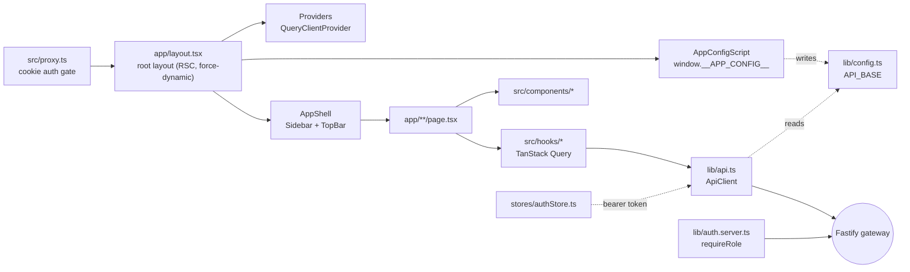
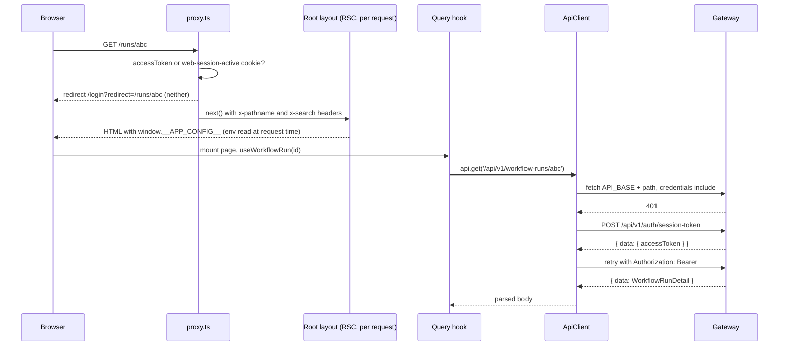

# @auto-swe/web — Next.js Dashboard

> Indexed at commit `ae416937` on 2026-10-03 · [view on GitHub](https://github.com/yorch/auto-swe/tree/ae416937)

## Relevant source files

- [packages/web/package.json](https://github.com/yorch/auto-swe/blob/ae416937/packages/web/package.json)
- [packages/web/next.config.ts](https://github.com/yorch/auto-swe/blob/ae416937/packages/web/next.config.ts)
- [packages/web/src/proxy.ts](https://github.com/yorch/auto-swe/blob/ae416937/packages/web/src/proxy.ts)
- [packages/web/src/app/layout.tsx](https://github.com/yorch/auto-swe/blob/ae416937/packages/web/src/app/layout.tsx)
- [packages/web/src/app/page.tsx](https://github.com/yorch/auto-swe/blob/ae416937/packages/web/src/app/page.tsx)
- [packages/web/src/app/globals.css](https://github.com/yorch/auto-swe/blob/ae416937/packages/web/src/app/globals.css)
- [packages/web/src/app/govern/layout.tsx](https://github.com/yorch/auto-swe/blob/ae416937/packages/web/src/app/govern/layout.tsx)
- [packages/web/src/app/studio/layout.tsx](https://github.com/yorch/auto-swe/blob/ae416937/packages/web/src/app/studio/layout.tsx)
- [packages/web/src/app/studio/integrations/page.tsx](https://github.com/yorch/auto-swe/blob/ae416937/packages/web/src/app/studio/integrations/page.tsx)
- [packages/web/src/app/studio/models/page.tsx](https://github.com/yorch/auto-swe/blob/ae416937/packages/web/src/app/studio/models/page.tsx)
- [packages/web/src/app/login/page.tsx](https://github.com/yorch/auto-swe/blob/ae416937/packages/web/src/app/login/page.tsx)
- [packages/web/src/components/Providers.tsx](https://github.com/yorch/auto-swe/blob/ae416937/packages/web/src/components/Providers.tsx)
- [packages/web/src/components/AppConfigScript.tsx](https://github.com/yorch/auto-swe/blob/ae416937/packages/web/src/components/AppConfigScript.tsx)
- [packages/web/src/components/layout/AppShell.tsx](https://github.com/yorch/auto-swe/blob/ae416937/packages/web/src/components/layout/AppShell.tsx)
- [packages/web/src/components/auth/RoleLayout.tsx](https://github.com/yorch/auto-swe/blob/ae416937/packages/web/src/components/auth/RoleLayout.tsx)
- [packages/web/src/lib/config.ts](https://github.com/yorch/auto-swe/blob/ae416937/packages/web/src/lib/config.ts)
- [packages/web/src/lib/api.ts](https://github.com/yorch/auto-swe/blob/ae416937/packages/web/src/lib/api.ts)
- [packages/web/src/lib/env.ts](https://github.com/yorch/auto-swe/blob/ae416937/packages/web/src/lib/env.ts)
- [packages/web/src/lib/auth.server.ts](https://github.com/yorch/auto-swe/blob/ae416937/packages/web/src/lib/auth.server.ts)
- [packages/web/src/lib/networkErrors.ts](https://github.com/yorch/auto-swe/blob/ae416937/packages/web/src/lib/networkErrors.ts)
- [packages/web/src/lib/palette.ts](https://github.com/yorch/auto-swe/blob/ae416937/packages/web/src/lib/palette.ts)
- [packages/web/src/lib/docs.ts](https://github.com/yorch/auto-swe/blob/ae416937/packages/web/src/lib/docs.ts)
- [packages/web/src/hooks/useListQuery.ts](https://github.com/yorch/auto-swe/blob/ae416937/packages/web/src/hooks/useListQuery.ts)
- [packages/web/src/hooks/useRuns.ts](https://github.com/yorch/auto-swe/blob/ae416937/packages/web/src/hooks/useRuns.ts)
- [packages/web/src/hooks/useApprovals.ts](https://github.com/yorch/auto-swe/blob/ae416937/packages/web/src/hooks/useApprovals.ts)
- [packages/web/src/hooks/useUserPreferences.ts](https://github.com/yorch/auto-swe/blob/ae416937/packages/web/src/hooks/useUserPreferences.ts)
- [packages/web/src/hooks/useModelCatalog.ts](https://github.com/yorch/auto-swe/blob/ae416937/packages/web/src/hooks/useModelCatalog.ts)
- [packages/web/src/hooks/useAgentRuns.ts](https://github.com/yorch/auto-swe/blob/ae416937/packages/web/src/hooks/useAgentRuns.ts)
- [packages/web/src/hooks/useOAuthConsent.ts](https://github.com/yorch/auto-swe/blob/ae416937/packages/web/src/hooks/useOAuthConsent.ts)
- [packages/web/src/hooks/useMcpGrants.ts](https://github.com/yorch/auto-swe/blob/ae416937/packages/web/src/hooks/useMcpGrants.ts)
- [packages/web/src/stores/authStore.ts](https://github.com/yorch/auto-swe/blob/ae416937/packages/web/src/stores/authStore.ts)
- [packages/web/src/stores/teamStore.ts](https://github.com/yorch/auto-swe/blob/ae416937/packages/web/src/stores/teamStore.ts)
- [packages/web/postcss.config.mjs](https://github.com/yorch/auto-swe/blob/ae416937/packages/web/postcss.config.mjs)
- [packages/web/tsconfig.json](https://github.com/yorch/auto-swe/blob/ae416937/packages/web/tsconfig.json)
- [packages/web/Dockerfile](https://github.com/yorch/auto-swe/blob/ae416937/packages/web/Dockerfile)
- [scripts/check-invariants.mjs](https://github.com/yorch/auto-swe/blob/ae416937/scripts/check-invariants.mjs)

## Overview

`@auto-swe/web` is the operator-facing dashboard: a Next.js 16 App Router application that renders workflow runs, approval queues, the workflow library, agent and skill configuration, the model catalog, agent runs, MCP consent and governance screens. It is a separate deployable from the gateway, served by `next start` in development and by the standalone Node server in the container image ([packages/web/package.json:L5-L10](https://github.com/yorch/auto-swe/blob/ae416937/packages/web/package.json#L5-L10), [packages/web/Dockerfile:L94-L105](https://github.com/yorch/auto-swe/blob/ae416937/packages/web/Dockerfile#L94-L105)).

The package holds no business logic of its own. Every domain type it renders is imported from `@auto-swe/shared/types/api`, and every read or write goes over the gateway's REST API. The application layer is therefore thin. Counted with `find` over `packages/web/src`: 54 `page.tsx` route files, 20 layout files, one route handler (`/health`), 123 non-test component files, 39 non-test hook files, and 2 Zustand stores. React 19.3.0 with the App Router is the rendering model. Almost every page is a Client Component, with Server Components reserved for role guards, redirects and filesystem-backed documentation ([packages/web/package.json:L11-L30](https://github.com/yorch/auto-swe/blob/ae416937/packages/web/package.json#L11-L30)).

Three feature surfaces reach into other subsystems and are described on their own pages rather than here:

- **MCP consent and connected apps.** `/oauth/consent` is the screen an MCP client's authorization request lands on, and Settings carries a connected-apps section that lists and revokes grants. The authorization server and MCP endpoint behind them are covered in [MCP server and OAuth](./3.5-mcp-server-and-oauth.md).
- **Model catalog.** `/studio/models` has a Catalog tab beside Credentials, Embeddings and Audit log, and model pickers read the catalog. The data model and pricing are covered in [Model catalog and pricing](./4.7-model-catalog-and-pricing.md).
- **Agent runs.** `/agent-runs` renders a form that launches a library agent against a repository without a workflow, plus an outcome card. The backend is covered in [Agent runs and implementer runtimes](./4.6-agent-runs-and-implementer-runtimes.md).

`@auto-swe/shared` is declared in `dependencies` as `workspace:*`, and 100 files under `packages/web/src` import it (78 source files and 22 tests, counted by grepping for `from '@auto-swe/shared` and dynamic `import('@auto-swe/shared`). Most import `types/api`, and a few use it at runtime, such as `roleMeets` in the server-side guard and `isTerminalWorkflowRunStatus` in the run hooks. Yarn's `node-modules` linker hoists the workspace into the root `node_modules`, and the Dockerfile builds `@auto-swe/shared` before `@auto-swe/web`, so the import resolves from the compiled output ([packages/web/package.json:L11-L12](https://github.com/yorch/auto-swe/blob/ae416937/packages/web/package.json#L11-L12), [packages/web/Dockerfile:L65-L67](https://github.com/yorch/auto-swe/blob/ae416937/packages/web/Dockerfile#L65-L67)).

Sources: [packages/web/package.json:L1-L44](https://github.com/yorch/auto-swe/blob/ae416937/packages/web/package.json#L1-L44) [packages/web/Dockerfile:L48-L67](https://github.com/yorch/auto-swe/blob/ae416937/packages/web/Dockerfile#L48-L67) [packages/web/src/lib/auth.server.ts:L1-L3](https://github.com/yorch/auto-swe/blob/ae416937/packages/web/src/lib/auth.server.ts#L1-L3)

## Architecture

```mermaid
flowchart LR
    Proxy["src/proxy.ts<br/>cookie auth gate"] --> Layout["app/layout.tsx<br/>root layout (RSC, force-dynamic)"]
    Layout --> ConfigScript["AppConfigScript<br/>window.__APP_CONFIG__"]
    Layout --> Providers["Providers<br/>QueryClientProvider"]
    Layout --> Shell["AppShell<br/>Sidebar + TopBar"]
    Shell --> Pages["app/**/page.tsx"]
    Pages --> Hooks["src/hooks/*<br/>TanStack Query"]
    Pages --> Components["src/components/*"]
    Hooks --> ApiClient["lib/api.ts<br/>ApiClient"]
    ApiClient --> Gateway(("Fastify gateway"))
    Guards["lib/auth.server.ts<br/>requireRole"] --> Gateway
    ConfigScript -.writes.-> Config["lib/config.ts<br/>API_BASE"]
    ApiClient -.reads.-> Config
    AuthStore["stores/authStore.ts"] -.bearer token.-> ApiClient
```

Requests enter through `proxy.ts`, which decides only whether the visitor is signed in. The root layout then renders on every request, injects runtime configuration into the HTML, mounts the TanStack Query client, and wraps the page in the sidebar chrome. Pages call hooks, hooks call the shared `ApiClient` singleton, and the client issues a cross-origin `fetch` to the gateway. Server Component guards are the one path that talks to the gateway from inside the web container rather than from the browser.

Sources: [packages/web/src/proxy.ts:L52-L73](https://github.com/yorch/auto-swe/blob/ae416937/packages/web/src/proxy.ts#L52-L73) [packages/web/src/app/layout.tsx:L29-L68](https://github.com/yorch/auto-swe/blob/ae416937/packages/web/src/app/layout.tsx#L29-L68) [packages/web/src/lib/api.ts:L40-L146](https://github.com/yorch/auto-swe/blob/ae416937/packages/web/src/lib/api.ts#L40-L146)

## Module Layout

| Module | Path | Responsibility |
| ------ | ---- | -------------- |
| Route tree | `packages/web/src/app/` | App Router pages, section layouts, `globals.css`, the `/health` route handler |
| Proxy | `packages/web/src/proxy.ts` | Next 16 proxy (the renamed middleware): cookie-presence auth gate, `x-pathname` and `x-search` injection, anti-framing headers on two pages |
| Components | `packages/web/src/components/` | 21 feature and chrome folders plus a 28-file `ui/` primitive set, which includes the React Aria `Select` and `Combobox` |
| Hooks | `packages/web/src/hooks/` | One file per API domain; TanStack Query wrappers over `ApiClient` |
| Stores | `packages/web/src/stores/` | `authStore` (session and sign-in flows), `teamStore` (selected team) |
| Lib | `packages/web/src/lib/` | API client, runtime config, navigation, formatting, chart and DAG layout helpers, trace linkage, server-side auth |
| Test helpers | `packages/web/src/test/rtl-helpers.tsx` | React Testing Library render wrapper for component tests |

Path alias `@/*` maps to `packages/web/src/*`, so every internal import in the package is written as `@/lib/...` or `@/components/...` ([packages/web/tsconfig.json:L12-L14](https://github.com/yorch/auto-swe/blob/ae416937/packages/web/tsconfig.json#L12-L14)). The admin surface lives in two route trees, `/govern` for the governance screens and `/studio` for authoring and integration screens, each guarded by its own layout. The route tree is walked in [App routes and pages](./5.1-app-routes-and-pages.md), and the component library in [Components and state](./5.2-components-and-state.md).

Sources: [packages/web/tsconfig.json:L1-L33](https://github.com/yorch/auto-swe/blob/ae416937/packages/web/tsconfig.json#L1-L33) [packages/web/src/proxy.ts:L33-L50](https://github.com/yorch/auto-swe/blob/ae416937/packages/web/src/proxy.ts#L33-L50)

## Key Components

### Root layout and providers

`RootLayout` is a Server Component. It loads the Inter and IBM Plex Mono fonts through `next/font/google`, exposes them as the `--font-inter` and `--font-ibm-plex-mono` CSS variables on `<html>`, and nests three wrappers around the page: `Providers`, `ErrorBoundary`, and `AppShell` ([packages/web/src/app/layout.tsx:L10-L22](https://github.com/yorch/auto-swe/blob/ae416937/packages/web/src/app/layout.tsx#L10-L22), [packages/web/src/app/layout.tsx:L59-L65](https://github.com/yorch/auto-swe/blob/ae416937/packages/web/src/app/layout.tsx#L59-L65)).

`Providers` constructs one `QueryClient` per browser session inside `useState`, with `retry: 1` and a 30-second `staleTime` as the defaults every hook inherits. It also fires `authStore.checkAuth()` once on mount, which reconciles the in-memory identity with whatever credentials the browser actually holds ([packages/web/src/components/Providers.tsx:L7-L27](https://github.com/yorch/auto-swe/blob/ae416937/packages/web/src/components/Providers.tsx#L7-L27)).

`AppShell` renders the two-column chrome, a 234px `Sidebar` and a `TopBar`, and drops it entirely on `/login` and `/reset-password`. Run detail and template diff routes are matched by regular expression and given a non-scrolling full-height `main` instead of the centred 1280px column. The approvals SSE subscription is mounted in the inner `Chrome` component rather than `AppShell` itself, so the single `EventSource` opens only on chromed routes ([packages/web/src/components/layout/AppShell.tsx:L9-L68](https://github.com/yorch/auto-swe/blob/ae416937/packages/web/src/components/layout/AppShell.tsx#L9-L68)).

Sources: [packages/web/src/app/layout.tsx:L1-L68](https://github.com/yorch/auto-swe/blob/ae416937/packages/web/src/app/layout.tsx#L1-L68) [packages/web/src/components/Providers.tsx:L1-L27](https://github.com/yorch/auto-swe/blob/ae416937/packages/web/src/components/Providers.tsx#L1-L27) [packages/web/src/components/layout/AppShell.tsx:L1-L68](https://github.com/yorch/auto-swe/blob/ae416937/packages/web/src/components/layout/AppShell.tsx#L1-L68)

### How the browser reaches the gateway

There is no rewrite, proxy route, or API forwarding layer. `next.config.ts` declares `allowedDevOrigins`, an `env` block carrying only `NEXT_PUBLIC_APP_VERSION`, an `experimental.useTypeScriptCli` flag, `output: 'standalone'`, and `reactStrictMode`. It has no `rewrites`, `redirects` or `headers` entry ([packages/web/next.config.ts:L21-L34](https://github.com/yorch/auto-swe/blob/ae416937/packages/web/next.config.ts#L21-L34)). The browser calls the Fastify gateway directly, cross-origin, at `API_BASE`.

The root layout exports `dynamic = 'force-dynamic'`, so it renders on every request rather than once at `next build`. It reads the gateway and Temporal UI addresses through `lib/env.ts` to build the config blob. With no dynamic API in the layout, Next would treat it as static and prerender it during the image build, where neither variable is set. The `http://localhost:8080` fallback would then be written into the HTML of every page and the variables on the running container would never be read, so a published image could only reach a gateway on `localhost:8080` ([packages/web/src/app/layout.tsx:L29-L33](https://github.com/yorch/auto-swe/blob/ae416937/packages/web/src/app/layout.tsx#L29-L33)). A source invariant guards this, the third of the four that `yarn invariants:check` enforces. `checkLayoutRendersPerRequest` fails if `layout.tsx` either matches `process.env.NEXT_PUBLIC_*` directly or imports `@/lib/env` while that module reads a `NEXT_PUBLIC_*` variable, and does not export `dynamic = 'force-dynamic'`. The import case is deliberately coarse, because the layout reads its URLs through `lib/env.ts` and moving the read into a helper must not switch the rule off ([scripts/check-invariants.mjs:L204-L252](https://github.com/yorch/auto-swe/blob/ae416937/scripts/check-invariants.mjs#L204-L252), [scripts/check-invariants.mjs:L372-L375](https://github.com/yorch/auto-swe/blob/ae416937/scripts/check-invariants.mjs#L372-L375)).

The path from environment variable to browser is:

1. `RootLayout` serialises `{ apiUrl, temporalUiUrl }` into a JSON string. `publicApiUrl()` returns `NEXT_PUBLIC_API_URL ?? 'http://localhost:8080'`, and `temporalUiUrl()` returns `NEXT_PUBLIC_TEMPORAL_UI_URL`, falling back to `http://localhost:8233` outside production and `''` in production. The layout escapes `<`, `>` and `&` as `<`, `>` and `&` so the value cannot close the script element ([packages/web/src/app/layout.tsx:L35-L42](https://github.com/yorch/auto-swe/blob/ae416937/packages/web/src/app/layout.tsx#L35-L42), [packages/web/src/lib/env.ts:L7-L25](https://github.com/yorch/auto-swe/blob/ae416937/packages/web/src/lib/env.ts#L7-L25)).
2. `AppConfigScript` hands that string to `useServerInsertedHTML`, which writes `` into `<head>` once per render ([packages/web/src/components/AppConfigScript.tsx:L10-L25](https://github.com/yorch/auto-swe/blob/ae416937/packages/web/src/components/AppConfigScript.tsx#L10-L25), [packages/web/src/app/layout.tsx:L51](https://github.com/yorch/auto-swe/blob/ae416937/packages/web/src/app/layout.tsx#L51)).
3. `lib/config.ts` resolves `API_BASE` at module load as `windowConfig().apiUrl ?? publicApiUrl()`. `windowConfig()` returns `{}` during server rendering, where `window` is undefined, so in the browser the injected value wins and the `NEXT_PUBLIC_API_URL` that Next inlines into the client bundle, with `http://localhost:8080` behind it, is only a fallback. `TEMPORAL_UI_URL` follows the same order ([packages/web/src/lib/config.ts:L9-L16](https://github.com/yorch/auto-swe/blob/ae416937/packages/web/src/lib/config.ts#L9-L16), [packages/web/src/lib/config.ts:L29-L34](https://github.com/yorch/auto-swe/blob/ae416937/packages/web/src/lib/config.ts#L29-L34)).

Server-side fetches use a different address. `apiInternalUrl()` reads `API_INTERNAL_URL` first and falls back to `publicApiUrl()`, because the browser-facing URL is frequently `http://localhost:8080`, which inside the web container points at the container's own loopback rather than the gateway. It is read only from Server Components, in `checkSession`, and is never serialised into the page ([packages/web/src/lib/env.ts:L31-L41](https://github.com/yorch/auto-swe/blob/ae416937/packages/web/src/lib/env.ts#L31-L41), [packages/web/src/lib/auth.server.ts:L42-L53](https://github.com/yorch/auto-swe/blob/ae416937/packages/web/src/lib/auth.server.ts#L42-L53)).

Sources: [packages/web/next.config.ts:L1-L36](https://github.com/yorch/auto-swe/blob/ae416937/packages/web/next.config.ts#L1-L36) [packages/web/src/app/layout.tsx:L29-L51](https://github.com/yorch/auto-swe/blob/ae416937/packages/web/src/app/layout.tsx#L29-L51) [packages/web/src/components/AppConfigScript.tsx:L1-L26](https://github.com/yorch/auto-swe/blob/ae416937/packages/web/src/components/AppConfigScript.tsx#L1-L26) [packages/web/src/lib/config.ts:L1-L34](https://github.com/yorch/auto-swe/blob/ae416937/packages/web/src/lib/config.ts#L1-L34) [packages/web/src/lib/env.ts:L1-L41](https://github.com/yorch/auto-swe/blob/ae416937/packages/web/src/lib/env.ts#L1-L41) [scripts/check-invariants.mjs:L204-L252](https://github.com/yorch/auto-swe/blob/ae416937/scripts/check-invariants.mjs#L204-L252)

### The API client

`ApiClient` is a single exported instance holding an in-memory bearer token, and it is the only place in the package that calls `fetch` against the gateway's `/api/v1/*` surface for JSON reads and writes ([packages/web/src/lib/api.ts:L40-L45](https://github.com/yorch/auto-swe/blob/ae416937/packages/web/src/lib/api.ts#L40-L45), [packages/web/src/lib/api.ts:L253](https://github.com/yorch/auto-swe/blob/ae416937/packages/web/src/lib/api.ts#L253)). Every request sends `credentials: 'include'` so the better-auth session cookie travels cross-origin, and adds an `Authorization` header when a token is held. The gateway tries the header first and falls back to the cookie, so both auth modes work without per-call branching ([packages/web/src/lib/api.ts:L80-L103](https://github.com/yorch/auto-swe/blob/ae416937/packages/web/src/lib/api.ts#L80-L103)).

Five details exist because their absence broke something. A `Content-Type` header is attached only when a body exists, because Fastify rejects a JSON content type with an empty body and every dashboard `DELETE` failed ([packages/web/src/lib/api.ts:L82-L91](https://github.com/yorch/auto-swe/blob/ae416937/packages/web/src/lib/api.ts#L82-L91)). A `204` or zero-length response returns `undefined` rather than throwing inside `res.json()`, which would have rejected a mutation the server had already applied and skipped the caller's cache invalidation ([packages/web/src/lib/api.ts:L148-L159](https://github.com/yorch/auto-swe/blob/ae416937/packages/web/src/lib/api.ts#L148-L159)). A non-2xx response becomes an `ApiError` that carries the HTTP status and the gateway's machine-readable `error.code` beside the message, so callers can branch on a code while every `errMsg(err)` caller still sees an ordinary `Error` ([packages/web/src/lib/api.ts:L23-L38](https://github.com/yorch/auto-swe/blob/ae416937/packages/web/src/lib/api.ts#L23-L38), [packages/web/src/lib/api.ts:L175-L184](https://github.com/yorch/auto-swe/blob/ae416937/packages/web/src/lib/api.ts#L175-L184)). A `401` on a request that carried a token triggers one refresh against `POST /api/v1/auth/session-token`, deduplicated through a shared `refreshPromise` and guarded by a `tokenGeneration` counter so a concurrent logout or fresh login is not overwritten ([packages/web/src/lib/api.ts:L114-L139](https://github.com/yorch/auto-swe/blob/ae416937/packages/web/src/lib/api.ts#L114-L139), [packages/web/src/lib/api.ts:L186-L230](https://github.com/yorch/auto-swe/blob/ae416937/packages/web/src/lib/api.ts#L186-L230)). A network-level `TypeError` is rewrapped by `gatewayUnreachableMessage` into a message naming the actual `API_BASE` and the `CORS_ORIGIN` setting, since "failed to fetch" and "wrong credentials" need opposite remediations ([packages/web/src/lib/networkErrors.ts:L21-L32](https://github.com/yorch/auto-swe/blob/ae416937/packages/web/src/lib/networkErrors.ts#L21-L32)).

A session that cannot be refreshed ends in `expireSession`, which only redirects to `/login` when the caller actually had a session (a bearer or the marker cookie) and is not already on a signed-out page, so an anonymous request on `/reset-password` is not hijacked ([packages/web/src/lib/api.ts:L14-L21](https://github.com/yorch/auto-swe/blob/ae416937/packages/web/src/lib/api.ts#L14-L21), [packages/web/src/lib/api.ts:L161-L173](https://github.com/yorch/auto-swe/blob/ae416937/packages/web/src/lib/api.ts#L161-L173)).

Sources: [packages/web/src/lib/api.ts:L1-L253](https://github.com/yorch/auto-swe/blob/ae416937/packages/web/src/lib/api.ts#L1-L253) [packages/web/src/lib/networkErrors.ts:L1-L32](https://github.com/yorch/auto-swe/blob/ae416937/packages/web/src/lib/networkErrors.ts#L1-L32)

### Route protection: proxy gate plus server-side role guard

`proxy.ts` is Next 16's proxy convention, the successor to `middleware.ts`, and its matcher covers everything except `_next/static`, `_next/image`, and `favicon.ico` ([packages/web/src/proxy.ts:L71-L73](https://github.com/yorch/auto-swe/blob/ae416937/packages/web/src/proxy.ts#L71-L73)). It performs a presence check only: either the legacy `accessToken` JWT cookie or the `web-session-active` marker that `authStore` drops after a magic-link or social sign-in lets the request through, and neither is validated. The real better-auth session cookie lives on the gateway origin and is invisible here, so validation stays with the gateway's `requireAuth` on every `/api/v1/*` call. Paths under `/login`, `/api`, `/reset-password`, `/health` and `/oauth/consent` skip the check. `/oauth/consent` is public to the proxy because the browser arrives there straight from the authorization server, before this app has set the marker, and the page establishes the session itself. Requests to anything else without either cookie are redirected to `/login` with the original path and query string as a `redirect` parameter ([packages/web/src/proxy.ts:L10-L14](https://github.com/yorch/auto-swe/blob/ae416937/packages/web/src/proxy.ts#L10-L14), [packages/web/src/proxy.ts:L52-L69](https://github.com/yorch/auto-swe/blob/ae416937/packages/web/src/proxy.ts#L52-L69)).

The proxy's other jobs are headers. It copies the matched pathname and the query string into `x-pathname` and `x-search` request headers, always overwriting any client-sent value, because layouts have no access to the URL and the reauth redirect needs both to send the user back to the exact page they were on. On `/login` and `/oauth/consent`, which take a credential or a security decision, it also sets `frame-ancestors 'none'` and `X-Frame-Options: DENY` so neither can be framed ([packages/web/src/proxy.ts:L16-L17](https://github.com/yorch/auto-swe/blob/ae416937/packages/web/src/proxy.ts#L16-L17), [packages/web/src/proxy.ts:L33-L50](https://github.com/yorch/auto-swe/blob/ae416937/packages/web/src/proxy.ts#L33-L50), [packages/web/src/lib/config.ts:L23-L27](https://github.com/yorch/auto-swe/blob/ae416937/packages/web/src/lib/config.ts#L23-L27)).

Authorization itself is enforced by Server Component layouts. `RoleLayout` awaits `requireRole`, which runs `checkSession`: it reads the token cookie and calls `GET /api/v1/auth/me` over `API_INTERNAL_URL` with `cache: 'no-store'`. The outcomes are kept apart because they need different responses. A missing or expired bearer redirects through the login bridge (re-minting the bearer from the better-auth session when the marker cookie is present), an inactive user or one whose role does not satisfy `roleMeets` redirects to `/`, and a gateway that cannot answer renders an "unavailable" alert so an outage is not dressed up as "you are not allowed here" ([packages/web/src/components/auth/RoleLayout.tsx:L11-L23](https://github.com/yorch/auto-swe/blob/ae416937/packages/web/src/components/auth/RoleLayout.tsx#L11-L23), [packages/web/src/lib/auth.server.ts:L34-L73](https://github.com/yorch/auto-swe/blob/ae416937/packages/web/src/lib/auth.server.ts#L34-L73), [packages/web/src/lib/auth.server.ts:L80-L127](https://github.com/yorch/auto-swe/blob/ae416937/packages/web/src/lib/auth.server.ts#L80-L127)). The `/govern` tree admits ENGINEER, LEAD and ADMIN, nested layouts narrow individual sections (`/govern/organizations` to LEAD and ADMIN, for instance), and `/studio` is ADMIN-only ([packages/web/src/app/govern/layout.tsx:L4-L6](https://github.com/yorch/auto-swe/blob/ae416937/packages/web/src/app/govern/layout.tsx#L4-L6), [packages/web/src/app/govern/organizations/layout.tsx:L4-L6](https://github.com/yorch/auto-swe/blob/ae416937/packages/web/src/app/govern/organizations/layout.tsx#L4-L6), [packages/web/src/app/studio/layout.tsx:L4-L6](https://github.com/yorch/auto-swe/blob/ae416937/packages/web/src/app/studio/layout.tsx#L4-L6)). The full tier table is in [App routes and pages](./5.1-app-routes-and-pages.md).

Client-side checks are presentation only. `lib/roles.ts` defers to the shared `roleMeets` so a control hidden in the dashboard is hidden exactly when the API would refuse it, and treats an unknown role as unprivileged ([packages/web/src/lib/roles.ts:L1-L14](https://github.com/yorch/auto-swe/blob/ae416937/packages/web/src/lib/roles.ts#L1-L14)).

Sources: [packages/web/src/proxy.ts:L1-L73](https://github.com/yorch/auto-swe/blob/ae416937/packages/web/src/proxy.ts#L1-L73) [packages/web/src/lib/auth.server.ts:L1-L127](https://github.com/yorch/auto-swe/blob/ae416937/packages/web/src/lib/auth.server.ts#L1-L127) [packages/web/src/components/auth/RoleLayout.tsx:L1-L23](https://github.com/yorch/auto-swe/blob/ae416937/packages/web/src/components/auth/RoleLayout.tsx#L1-L23) [packages/web/src/app/govern/layout.tsx:L1-L6](https://github.com/yorch/auto-swe/blob/ae416937/packages/web/src/app/govern/layout.tsx#L1-L6) [packages/web/src/app/studio/layout.tsx:L1-L6](https://github.com/yorch/auto-swe/blob/ae416937/packages/web/src/app/studio/layout.tsx#L1-L6)

### Query hooks

Hooks are organised one file per API domain and follow a fixed shape: `'use client'`, domain types imported from `@auto-swe/shared/types/api`, a `useQuery` whose `queryFn` unwraps the gateway's `{ data }` envelope, and a `queryKey` array whose first element is the domain name ([packages/web/src/hooks/useRuns.ts:L1-L33](https://github.com/yorch/auto-swe/blob/ae416937/packages/web/src/hooks/useRuns.ts#L1-L33)). Freshness is expressed per hook through `refetchInterval` rather than through global settings, and the interval can be a function of the current data. A workflow run polls every 3 seconds while it is not terminal and every 30 seconds once it is, and does not poll at all when full trace payloads were requested. The run hook also reads only the trace tail since a cursor and merges it into the cached traces, falling back to a full read when the merged count disagrees with the server's total or the run has just finished ([packages/web/src/hooks/useRuns.ts:L105-L149](https://github.com/yorch/auto-swe/blob/ae416937/packages/web/src/hooks/useRuns.ts#L105-L149)).

Paginated endpoints go through `useListQuery`, which returns the rows as `data` and the pagination block as `meta`. A hook that unwrapped `data` alone would silently discard the total and render "N total" for the current page rather than the table ([packages/web/src/hooks/useListQuery.ts:L35-L49](https://github.com/yorch/auto-swe/blob/ae416937/packages/web/src/hooks/useListQuery.ts#L35-L49)). Its companion `listUrl` appends `limit` and `offset` while preserving an existing query string ([packages/web/src/hooks/useListQuery.ts:L22-L33](https://github.com/yorch/auto-swe/blob/ae416937/packages/web/src/hooks/useListQuery.ts#L22-L33)). Mutations invalidate by key prefix in `onSuccess`: responding to an approval invalidates both `['approvals']` and `['workflow-run']`, and launching an agent run invalidates `['workflows']` and `['workflow-runs']` ([packages/web/src/hooks/useApprovals.ts:L73-L83](https://github.com/yorch/auto-swe/blob/ae416937/packages/web/src/hooks/useApprovals.ts#L73-L83), [packages/web/src/hooks/useAgentRuns.ts:L44-L47](https://github.com/yorch/auto-swe/blob/ae416937/packages/web/src/hooks/useAgentRuns.ts#L44-L47)).

Live updates use one server-sent-events subscription. `useApprovalsStream` opens a single `EventSource` against `/api/v1/human-steps/stream` and invalidates the approvals key on each `change` event. The 30-second poll in `useApprovals` stays as the fallback for the pending list. Mounting the stream once in `AppShell`, rather than in each consumer, avoids three long-lived connections per page ([packages/web/src/hooks/useApprovals.ts:L36-L65](https://github.com/yorch/auto-swe/blob/ae416937/packages/web/src/hooks/useApprovals.ts#L36-L65)).

The newer surfaces follow the same shape. `useModelCatalog.ts` keys catalog reads by kind and retired-flag and invalidates them after each catalog write ([packages/web/src/hooks/useModelCatalog.ts:L25-L54](https://github.com/yorch/auto-swe/blob/ae416937/packages/web/src/hooks/useModelCatalog.ts#L25-L54)), `useAgentRuns.ts` keys the agent list and run limits by repository ([packages/web/src/hooks/useAgentRuns.ts:L21-L47](https://github.com/yorch/auto-swe/blob/ae416937/packages/web/src/hooks/useAgentRuns.ts#L21-L47)), and `useMcpGrants.ts` lists and revokes MCP connections under one key ([packages/web/src/hooks/useMcpGrants.ts:L23-L37](https://github.com/yorch/auto-swe/blob/ae416937/packages/web/src/hooks/useMcpGrants.ts#L23-L37)).

Sources: [packages/web/src/hooks/useListQuery.ts:L1-L49](https://github.com/yorch/auto-swe/blob/ae416937/packages/web/src/hooks/useListQuery.ts#L1-L49) [packages/web/src/hooks/useRuns.ts:L1-L149](https://github.com/yorch/auto-swe/blob/ae416937/packages/web/src/hooks/useRuns.ts#L1-L149) [packages/web/src/hooks/useApprovals.ts:L1-L83](https://github.com/yorch/auto-swe/blob/ae416937/packages/web/src/hooks/useApprovals.ts#L1-L83)

### Zustand stores

Client state is deliberately small. `teamStore` is eleven lines holding the selected team id ([packages/web/src/stores/teamStore.ts:L1-L11](https://github.com/yorch/auto-swe/blob/ae416937/packages/web/src/stores/teamStore.ts#L1-L11)). `authStore` is the substantial one: it owns the current user, the `isAuthenticated` flag, and every sign-in flow, namely email and password, magic link, password reset, and the social providers `github`, `google`, and `okta` ([packages/web/src/stores/authStore.ts:L15-L69](https://github.com/yorch/auto-swe/blob/ae416937/packages/web/src/stores/authStore.ts#L15-L69)).

Which providers are offered is not a dashboard setting. Google, Okta and GitHub sign-in credentials are environment variables on the gateway, and `/studio/integrations` has no tabs for them: its tabs are GitHub (the integration, not sign-in), Slack, Issue Tracker, Knowledge Base, Figma and Audit log. The login page asks the gateway which providers are configured through `/api/v1/auth/providers`, validates the response shape, and renders a button only for each provider reported as available. The same probe doubles as the gateway-reachability check ([packages/web/src/app/studio/integrations/page.tsx:L15-L24](https://github.com/yorch/auto-swe/blob/ae416937/packages/web/src/app/studio/integrations/page.tsx#L15-L24), [packages/web/src/app/login/page.tsx:L61-L65](https://github.com/yorch/auto-swe/blob/ae416937/packages/web/src/app/login/page.tsx#L61-L65), [packages/web/src/app/login/page.tsx:L182-L210](https://github.com/yorch/auto-swe/blob/ae416937/packages/web/src/app/login/page.tsx#L182-L210)).

The store talks to the gateway's better-auth routes under `/api/auth/*` rather than through `ApiClient`, wrapping them in a `betterAuthPost` helper that folds gateway-unreachable messages, the server's own `message` field, and a caller fallback into one error path. Responses are parsed with Zod schemas so a shape change surfaces as a validation error rather than an undefined read ([packages/web/src/stores/authStore.ts:L94-L146](https://github.com/yorch/auto-swe/blob/ae416937/packages/web/src/stores/authStore.ts#L94-L146)). Social sign-in is a fetch-then-navigate dance: the provider URL comes back as JSON, the browser navigates to it, and the round trip lands on `/login?bridge=1`, where `hydrateFromSession` resolves the session ([packages/web/src/stores/authStore.ts:L148-L176](https://github.com/yorch/auto-swe/blob/ae416937/packages/web/src/stores/authStore.ts#L148-L176), [packages/web/src/stores/authStore.ts:L255-L267](https://github.com/yorch/auto-swe/blob/ae416937/packages/web/src/stores/authStore.ts#L255-L267)). Both `login` and `signInWithProvider` accept the signed query of a pending MCP authorization. The server answers an email sign-in with the URL where that authorization continues, and `login` returns it so the page can resume the consent flow instead of landing on the dashboard ([packages/web/src/stores/authStore.ts:L277-L314](https://github.com/yorch/auto-swe/blob/ae416937/packages/web/src/stores/authStore.ts#L277-L314)). The store also writes the `web-session-active` marker cookie the proxy reads, and clears both cookies on logout ([packages/web/src/stores/authStore.ts:L71-L92](https://github.com/yorch/auto-swe/blob/ae416937/packages/web/src/stores/authStore.ts#L71-L92), [packages/web/src/stores/authStore.ts:L316-L328](https://github.com/yorch/auto-swe/blob/ae416937/packages/web/src/stores/authStore.ts#L316-L328)). The session probe separates `anonymous` (positive evidence of no session, the only outcome that may clear cookies) from `unknown` (gateway down, 429 or 5xx), so a transient failure does not log the user out ([packages/web/src/stores/authStore.ts:L178-L253](https://github.com/yorch/auto-swe/blob/ae416937/packages/web/src/stores/authStore.ts#L178-L253)).

Per-user UI preferences are not kept in a store at all. `useUserPreferences` persists them on the server through `/api/v1/me/preferences` with optimistic updates, and validates the stored value on read because the column is free-form JSON older clients may have written ([packages/web/src/hooks/useUserPreferences.ts:L22-L63](https://github.com/yorch/auto-swe/blob/ae416937/packages/web/src/hooks/useUserPreferences.ts#L22-L63)).

Sources: [packages/web/src/stores/authStore.ts:L1-L328](https://github.com/yorch/auto-swe/blob/ae416937/packages/web/src/stores/authStore.ts#L1-L328) [packages/web/src/stores/teamStore.ts:L1-L11](https://github.com/yorch/auto-swe/blob/ae416937/packages/web/src/stores/teamStore.ts#L1-L11) [packages/web/src/hooks/useUserPreferences.ts:L1-L63](https://github.com/yorch/auto-swe/blob/ae416937/packages/web/src/hooks/useUserPreferences.ts#L1-L63) [packages/web/src/app/login/page.tsx:L61-L65](https://github.com/yorch/auto-swe/blob/ae416937/packages/web/src/app/login/page.tsx#L61-L65)

### Styling

Tailwind CSS 4 is configured entirely in CSS. There is no `tailwind.config.js`: `globals.css` opens with `@import 'tailwindcss'` and two explicit `@source` globs, added because v4 scans relative to the stylesheet and the monorepo working directory made the default scan unreliable ([packages/web/src/app/globals.css:L1-L6](https://github.com/yorch/auto-swe/blob/ae416937/packages/web/src/app/globals.css#L1-L6)). The PostCSS config loads the single `@tailwindcss/postcss` plugin ([packages/web/postcss.config.mjs:L1-L8](https://github.com/yorch/auto-swe/blob/ae416937/packages/web/postcss.config.mjs#L1-L8)).

The design tokens live in an `@theme` block: an ink ramp for surfaces, a paper ramp for text, violet `ember` as the primary accent, teal as the secondary, status colours, three font families, and a tight radius scale topping out at 4px ([packages/web/src/app/globals.css:L12-L66](https://github.com/yorch/auto-swe/blob/ae416937/packages/web/src/app/globals.css#L12-L66)). A `@layer base` block re-exports them as semantic aliases such as `--background` and `--primary` so older call sites keep working, and an `@layer utilities` block holds shared classes such as `.kicker` and `.label-mono` ([packages/web/src/app/globals.css:L68-L90](https://github.com/yorch/auto-swe/blob/ae416937/packages/web/src/app/globals.css#L68-L90), [packages/web/src/app/globals.css:L163-L181](https://github.com/yorch/auto-swe/blob/ae416937/packages/web/src/app/globals.css#L163-L181)).

Two surfaces cannot use CSS variables at all. Recharts passes `tick={{ fill }}` straight onto an SVG `<text>` as a presentation attribute, and React Flow does the same with an edge marker colour, and presentation attributes do not resolve `var()`. `lib/palette.ts` holds the literal hex values for those call sites in one place, with a `TOKEN_CSS_VAR` map naming the custom property each one mirrors, and `palette.test.ts` parses `globals.css` and fails if any entry drifts ([packages/web/src/lib/palette.ts:L1-L33](https://github.com/yorch/auto-swe/blob/ae416937/packages/web/src/lib/palette.ts#L1-L33), [packages/web/src/lib/palette.ts:L35-L54](https://github.com/yorch/auto-swe/blob/ae416937/packages/web/src/lib/palette.ts#L35-L54)). A second source-reading test, `themeClasses.test.ts`, fails the build when a colour class names a token the theme does not define; see [Components and state](./5.2-components-and-state.md) for the shared-primitives convention it backs.

Sources: [packages/web/src/app/globals.css:L1-L90](https://github.com/yorch/auto-swe/blob/ae416937/packages/web/src/app/globals.css#L1-L90) [packages/web/src/lib/palette.ts:L1-L54](https://github.com/yorch/auto-swe/blob/ae416937/packages/web/src/lib/palette.ts#L1-L54) [packages/web/postcss.config.mjs:L1-L8](https://github.com/yorch/auto-swe/blob/ae416937/packages/web/postcss.config.mjs#L1-L8)

## Data Flow

```mermaid
sequenceDiagram
    participant B as Browser
    participant P as proxy.ts
    participant L as Root layout (RSC, per request)
    participant H as Query hook
    participant A as ApiClient
    participant G as Gateway

    B->>P: GET /runs/abc
    P->>P: accessToken or web-session-active cookie?
    P-->>B: redirect /login?redirect=/runs/abc (neither)
    P->>L: next() with x-pathname and x-search headers
    L-->>B: HTML with window.__APP_CONFIG__ (env read at request time)
    B->>H: mount page, useWorkflowRun(id)
    H->>A: api.get('/api/v1/workflow-runs/abc')
    A->>G: fetch API_BASE + path, credentials include
    G-->>A: 401
    A->>G: POST /api/v1/auth/session-token
    G-->>A: { data: { accessToken } }
    A->>G: retry with Authorization: Bearer
    G-->>A: { data: WorkflowRunDetail }
    A-->>H: parsed body
```

The refresh leg runs at most once per request, and a `401` on the retry calls `expireSession`, which clears the token and navigates to `/login` when the caller had a session ([packages/web/src/lib/api.ts:L114-L139](https://github.com/yorch/auto-swe/blob/ae416937/packages/web/src/lib/api.ts#L114-L139)).

Sources: [packages/web/src/lib/api.ts:L80-L146](https://github.com/yorch/auto-swe/blob/ae416937/packages/web/src/lib/api.ts#L80-L146) [packages/web/src/proxy.ts:L52-L69](https://github.com/yorch/auto-swe/blob/ae416937/packages/web/src/proxy.ts#L52-L69) [packages/web/src/app/layout.tsx:L29-L42](https://github.com/yorch/auto-swe/blob/ae416937/packages/web/src/app/layout.tsx#L29-L42)

## Configuration & Extension Points

| Setting | Type | Default | Purpose |
| ------- | ---- | ------- | ------- |
| `NEXT_PUBLIC_API_URL` | `string` | `http://localhost:8080` | Gateway URL the browser calls; read from the container environment on every request and serialised into `window.__APP_CONFIG__` |
| `API_INTERNAL_URL` | `string` | falls back to `NEXT_PUBLIC_API_URL` | Gateway address for Server Component fetches inside the container network; never sent to the browser |
| `NEXT_PUBLIC_TEMPORAL_UI_URL` | `string` | `http://localhost:8233` in dev, `''` in prod | Temporal UI link, injected the same way; empty hides the link rather than pointing at a dead URL |
| `NEXT_PUBLIC_GRAFANA_URL` | `string` | `''` | Grafana dashboard link, read by the trace viewer |
| `ALLOWED_DEV_ORIGINS` | `string` (comma-separated hosts) | `localhost,127.0.0.1` | Extra `next dev` origins so a Tailscale or LAN address can load `_next/static` and hydrate |
| `NEXT_PUBLIC_APP_VERSION` | `string` | package version | Build constant injected from `package.json` through `next.config.ts` |

The dashboard reads no sign-in provider credentials and no storage settings. Those are gateway environment variables, and the web package only learns which providers are enabled from `/api/v1/auth/providers`.

The container build is a two-stage Dockerfile. The builder installs a `yarn` shim resolved from `yarnPath` because `node:26` ships no Corepack, focuses the install on the root, shared, and web workspaces, generates the Prisma client before building `@auto-swe/shared`, and copies only the top level of `docs/`, because the full tree added roughly 1.4 MB of frozen history to the traced standalone bundle. The runtime stage copies the `standalone` output plus `.next/static`, runs as the `node` user, and probes `/health` ([packages/web/Dockerfile:L1-L68](https://github.com/yorch/auto-swe/blob/ae416937/packages/web/Dockerfile#L1-L68), [packages/web/Dockerfile:L94-L105](https://github.com/yorch/auto-swe/blob/ae416937/packages/web/Dockerfile#L94-L105)). That documentation tree is read at request time by `lib/docs.ts`, which resolves `../../docs` from the working directory and serves only its top-level `.md` files ([packages/web/src/lib/docs.ts:L15-L20](https://github.com/yorch/auto-swe/blob/ae416937/packages/web/src/lib/docs.ts#L15-L20)).

Sources: [packages/web/next.config.ts:L11-L34](https://github.com/yorch/auto-swe/blob/ae416937/packages/web/next.config.ts#L11-L34) [packages/web/src/lib/config.ts:L29-L34](https://github.com/yorch/auto-swe/blob/ae416937/packages/web/src/lib/config.ts#L29-L34) [packages/web/src/lib/env.ts:L1-L41](https://github.com/yorch/auto-swe/blob/ae416937/packages/web/src/lib/env.ts#L1-L41) [packages/web/Dockerfile:L1-L105](https://github.com/yorch/auto-swe/blob/ae416937/packages/web/Dockerfile#L1-L105) [packages/web/src/lib/docs.ts:L1-L40](https://github.com/yorch/auto-swe/blob/ae416937/packages/web/src/lib/docs.ts#L1-L40)

## Child Pages

**[App routes and pages](./5.1-app-routes-and-pages.md)** walks the 54-page App Router tree and its 20 layouts: the dashboard home with its approvals inbox and status charts, the `/runs` and `/workflows` operational surfaces, the `/agent-runs` launcher, the ADMIN-only `/studio` section covering agents, skills, models and the catalog, MCP connections, bundles, integrations and GitHub installations, the `/govern` section covering approvals, audit, budgets, policies, scanner patterns, teams, users, usage and platform settings, and the public `/login`, `/reset-password`, `/oauth/consent`, `/docs` and `/health` routes. It also covers how nearly every page opens with the shared `PageHeader`, the section layouts that apply role guards, and the dynamic segments such as `/runs/[id]` and `/workflows/library/[id]/diff`.

**[Components and state](./5.2-components-and-state.md)** covers the component library and the client state layer in depth: the `ui/` primitive set including `QueryBoundary`, `Table`, `Modal`, `PageHeader`, `StatusBadge` and the React Aria `Select` and `Combobox` dropdowns built on a shared `dropdown` module, the feature folders led by the `workflow/` set that renders the React Flow DAG, the Recharts wrappers under `charts/`, the formatting and layout helpers in `lib/`, the rule that a treatment appearing on more than one page becomes a shared primitive rather than a class string, and the testing setup built on Vitest with jsdom and the `rtl-helpers` render wrapper.

## Related Pages

- Gateway API: [@auto-swe/gateway](./3-gateway-api.md) — the REST surface every hook calls
- MCP server and OAuth: [MCP server and OAuth](./3.5-mcp-server-and-oauth.md) — the authorization server behind the consent screen and connected apps
- Model catalog: [Model catalog and pricing](./4.7-model-catalog-and-pricing.md) — the data behind the Catalog tab and the model pickers
- Agent runs: [Agent runs and implementer runtimes](./4.6-agent-runs-and-implementer-runtimes.md) — the backend of the agent-run form
- Shared library: [@auto-swe/shared](./2-shared-library.md) — source of `types/api` and the `Role` permission helpers
- Temporal worker: [@auto-swe/worker](./4-temporal-worker.md) — produces the runs and traces this dashboard renders
- Repository structure: [Repository Structure](./1-repository-structure.md)
- CLI: [@auto-swe/cli](./6-cli.md) — the headless alternative to this dashboard
- Bundle SDK: [@auto-swe/sdk](./7-bundle-sdk.md)
