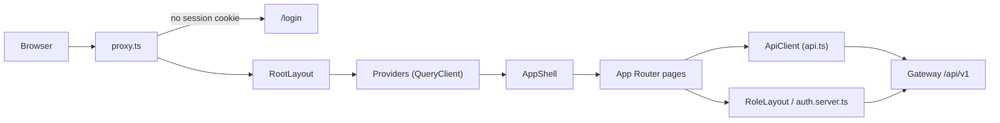
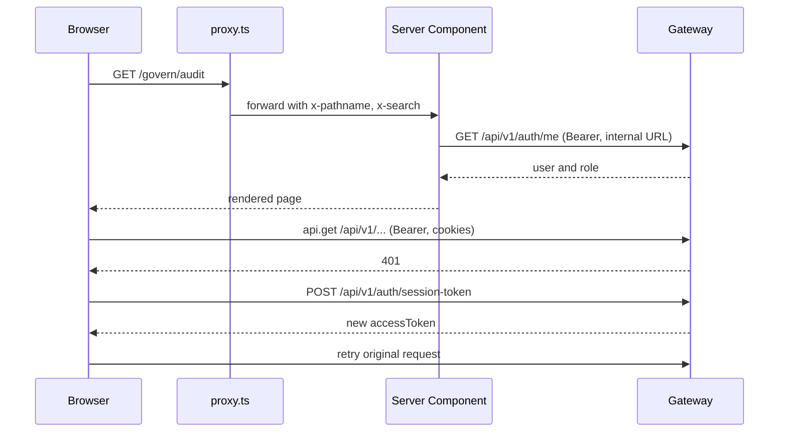

# Web dashboard (Next.js 16 App Router)

> Indexed at commit `d0a90fb5` on 2026-10-06 · [view on GitHub](https://github.com/yorch/auto-swe/tree/d0a90fb5)

## Relevant source files

- [packages/web/package.json](https://github.com/yorch/auto-swe/blob/d0a90fb5/packages/web/package.json)
- [packages/web/src/app/layout.tsx](https://github.com/yorch/auto-swe/blob/d0a90fb5/packages/web/src/app/layout.tsx)
- [packages/web/src/proxy.ts](https://github.com/yorch/auto-swe/blob/d0a90fb5/packages/web/src/proxy.ts)
- [packages/web/src/app/health/route.ts](https://github.com/yorch/auto-swe/blob/d0a90fb5/packages/web/src/app/health/route.ts)
- [packages/web/src/app/govern/layout.tsx](https://github.com/yorch/auto-swe/blob/d0a90fb5/packages/web/src/app/govern/layout.tsx)
- [packages/web/src/app/studio/layout.tsx](https://github.com/yorch/auto-swe/blob/d0a90fb5/packages/web/src/app/studio/layout.tsx)
- [packages/web/src/lib/api.ts](https://github.com/yorch/auto-swe/blob/d0a90fb5/packages/web/src/lib/api.ts)
- [packages/web/src/lib/auth.server.ts](https://github.com/yorch/auto-swe/blob/d0a90fb5/packages/web/src/lib/auth.server.ts)
- [packages/web/src/lib/config.ts](https://github.com/yorch/auto-swe/blob/d0a90fb5/packages/web/src/lib/config.ts)
- [packages/web/src/lib/env.ts](https://github.com/yorch/auto-swe/blob/d0a90fb5/packages/web/src/lib/env.ts)
- [packages/web/src/lib/navigation.ts](https://github.com/yorch/auto-swe/blob/d0a90fb5/packages/web/src/lib/navigation.ts)
- [packages/web/src/lib/roles.ts](https://github.com/yorch/auto-swe/blob/d0a90fb5/packages/web/src/lib/roles.ts)

## Overview

The web dashboard is the `@auto-swe/web` package: a Next.js 16 App Router application on React 19, styled with Tailwind CSS 4, that gives operators a browser front end to the gateway REST API. Server state is held by TanStack Query, client state by Zustand, workflow graphs are drawn with `@xyflow/react` and `dagre`, charts with `recharts`, and sign-in is handled through `better-auth` ([packages/web/package.json:L12-L32](https://github.com/yorch/auto-swe/blob/d0a90fb5/packages/web/package.json#L12-L32)). It starts with `next dev --port 3000` ([packages/web/package.json:L6-L11](https://github.com/yorch/auto-swe/blob/d0a90fb5/packages/web/package.json#L6-L11)).

The package contains no database access and no business logic of its own. Every read and write goes to the gateway over HTTP through a single client, `ApiClient`, and role decisions defer to the same seniority function the gateway uses. Page-level and component-level detail lives in the child pages [5.1 App routes and pages](./5.1-app-routes-and-pages.md) and [5.2 Components and state](./5.2-components-and-state.md).

Sources: [packages/web/package.json:L1-L40](https://github.com/yorch/auto-swe/blob/d0a90fb5/packages/web/package.json#L1-L40) [packages/web/src/lib/api.ts:L43-L50](https://github.com/yorch/auto-swe/blob/d0a90fb5/packages/web/src/lib/api.ts#L43-L50)

## Architecture

```mermaid
flowchart LR
  Browser --> Proxy["proxy.ts"]
  Proxy -->|"no session cookie"| Login["/login"]
  Proxy --> Layout["RootLayout"]
  Layout --> Providers["Providers (QueryClient)"]
  Providers --> Shell["AppShell"]
  Shell --> Pages["App Router pages"]
  Pages --> Api["ApiClient (api.ts)"]
  Pages --> Role["RoleLayout / auth.server.ts"]
  Api --> Gateway["Gateway /api/v1"]
  Role --> Gateway
```

A request first passes through `proxy.ts`, which redirects unauthenticated visitors to `/login`. The root layout injects runtime configuration and wraps the tree in `Providers` and `AppShell`. Client components fetch through `ApiClient`; server-rendered guards call the gateway directly through `auth.server.ts`.

Sources: [packages/web/src/proxy.ts:L52-L69](https://github.com/yorch/auto-swe/blob/d0a90fb5/packages/web/src/proxy.ts#L52-L69) [packages/web/src/app/layout.tsx:L34-L65](https://github.com/yorch/auto-swe/blob/d0a90fb5/packages/web/src/app/layout.tsx#L34-L65)

## Module Layout

| Module | Path | Responsibility |
| ------ | ---- | -------------- |
| Root layout | `packages/web/src/app/layout.tsx` | Fonts, metadata, runtime config injection, provider and shell mounting |
| Auth proxy | `packages/web/src/proxy.ts` | Session-cookie gate, pathname forwarding, frame protection |
| Routes | `packages/web/src/app/` | App Router pages, grouped as work, `studio`, `govern`, `docs`, auth pages and `health` |
| API client | `packages/web/src/lib/api.ts` | Bearer-token fetch wrapper with refresh and typed errors |
| Server auth | `packages/web/src/lib/auth.server.ts` | Server-side session and role guards |
| Config and env | `packages/web/src/lib/config.ts`, `packages/web/src/lib/env.ts` | Cookie names, header names, gateway and Temporal URLs |
| Navigation map | `packages/web/src/lib/navigation.ts` | Sidebar groups, labels and minimum roles |
| Role helper | `packages/web/src/lib/roles.ts` | Client-side role checks |
| Pure helpers | `packages/web/src/lib/*.ts` | Display, diff, form and formatting utilities with co-located `*.test.ts` |

Sources: [packages/web/src/app/layout.tsx:L1-L65](https://github.com/yorch/auto-swe/blob/d0a90fb5/packages/web/src/app/layout.tsx#L1-L65) [packages/web/src/lib/config.ts:L18-L34](https://github.com/yorch/auto-swe/blob/d0a90fb5/packages/web/src/lib/config.ts#L18-L34) [packages/web/src/lib/navigation.ts:L1-L60](https://github.com/yorch/auto-swe/blob/d0a90fb5/packages/web/src/lib/navigation.ts#L1-L60)

## Key Components

### Root layout and runtime configuration

`RootLayout` sets `dynamic = 'force-dynamic'` so it renders per request. It serialises the gateway URL and Temporal UI URL into `window.__APP_CONFIG__` through `AppConfigScript`, escaping `<`, `>` and `&` in the JSON. Left static, Next would prerender the layout at `next build`, where those variables are unset, and bake the `localhost` fallbacks into every page ([packages/web/src/app/layout.tsx:L28-L41](https://github.com/yorch/auto-swe/blob/d0a90fb5/packages/web/src/app/layout.tsx#L28-L41)). The layout also loads the Inter and IBM Plex Mono fonts as CSS variables and sets the title template `%s · auto·swe` ([packages/web/src/app/layout.tsx:L9-L26](https://github.com/yorch/auto-swe/blob/d0a90fb5/packages/web/src/app/layout.tsx#L9-L26)).

`lib/config.ts` reads that injected object in the browser and falls back to the build-time values from `lib/env.ts` during server rendering. `publicApiUrl()` defaults to `http://localhost:8080`, `temporalUiUrl()` defaults to `http://localhost:8233` outside production and to an empty string in production so the link is hidden, and `apiInternalUrl()` reads `API_INTERNAL_URL` for server-side fetches inside Docker ([packages/web/src/lib/env.ts:L1-L41](https://github.com/yorch/auto-swe/blob/d0a90fb5/packages/web/src/lib/env.ts#L1-L41)).

Sources: [packages/web/src/app/layout.tsx:L28-L65](https://github.com/yorch/auto-swe/blob/d0a90fb5/packages/web/src/app/layout.tsx#L28-L65) [packages/web/src/lib/config.ts:L9-L34](https://github.com/yorch/auto-swe/blob/d0a90fb5/packages/web/src/lib/config.ts#L9-L34) [packages/web/src/lib/env.ts:L1-L41](https://github.com/yorch/auto-swe/blob/d0a90fb5/packages/web/src/lib/env.ts#L1-L41)

### Auth proxy

`proxy.ts` replaces the older middleware file name used by earlier Next versions. It lets `/login`, `/api`, `/reset-password`, `/health` and `/oauth/consent` through without a session ([packages/web/src/proxy.ts:L14](https://github.com/yorch/auto-swe/blob/d0a90fb5/packages/web/src/proxy.ts#L14)). Every other path requires one of two cookies: the legacy `accessToken` JWT or the `web-session-active` marker the auth store sets after a better-auth sign-in. The proxy checks only that the cookie is present; the gateway remains the real validator ([packages/web/src/proxy.ts:L52-L69](https://github.com/yorch/auto-swe/blob/d0a90fb5/packages/web/src/proxy.ts#L52-L69)).

On every pass the proxy overwrites the `x-pathname` and `x-search` request headers so Server Components, which cannot see the URL, can rebuild it for the reauth redirect. `/login` and `/oauth/consent` also receive `frame-ancestors 'none'` and `X-Frame-Options: DENY` to prevent clickjacking ([packages/web/src/proxy.ts:L33-L50](https://github.com/yorch/auto-swe/blob/d0a90fb5/packages/web/src/proxy.ts#L33-L50)). The matcher excludes `_next/static`, `_next/image` and `favicon.ico` ([packages/web/src/proxy.ts:L71-L73](https://github.com/yorch/auto-swe/blob/d0a90fb5/packages/web/src/proxy.ts#L71-L73)). The `/health` route returns `{ status: 'ok' }` for the container health check ([packages/web/src/app/health/route.ts:L5-L7](https://github.com/yorch/auto-swe/blob/d0a90fb5/packages/web/src/app/health/route.ts#L5-L7)).

Sources: [packages/web/src/proxy.ts:L14-L73](https://github.com/yorch/auto-swe/blob/d0a90fb5/packages/web/src/proxy.ts#L14-L73) [packages/web/src/lib/config.ts:L18-L27](https://github.com/yorch/auto-swe/blob/d0a90fb5/packages/web/src/lib/config.ts#L18-L27) [packages/web/src/app/health/route.ts:L1-L7](https://github.com/yorch/auto-swe/blob/d0a90fb5/packages/web/src/app/health/route.ts#L1-L7)

### ApiClient

`ApiClient` is the single gateway client, exported as the `api` singleton. It holds the bearer token in memory and mirrors it into the `accessToken` cookie so server guards can read it ([packages/web/src/lib/api.ts:L43-L58](https://github.com/yorch/auto-swe/blob/d0a90fb5/packages/web/src/lib/api.ts#L43-L58)). Each request sends `credentials: 'include'`, so the gateway can authenticate by either the `Authorization` header or the better-auth session cookie, and a `Content-Type` is attached only when a body exists ([packages/web/src/lib/api.ts:L89-L111](https://github.com/yorch/auto-swe/blob/d0a90fb5/packages/web/src/lib/api.ts#L89-L111)).

On a 401 for a request that carried a token, the client calls `tryRefresh`, which deduplicates concurrent refreshes through a shared promise and mints a new bearer by POSTing to `/api/v1/auth/session-token`. A `tokenGeneration` counter discards a refresh result if a logout or new login raced it. If the retry also returns 401, `expireSession` clears the token and redirects to `/login` with the current path, unless the visitor never had a session or is already on a public auth page ([packages/web/src/lib/api.ts:L122-L145](https://github.com/yorch/auto-swe/blob/d0a90fb5/packages/web/src/lib/api.ts#L122-L145), [packages/web/src/lib/api.ts:L173-L231](https://github.com/yorch/auto-swe/blob/d0a90fb5/packages/web/src/lib/api.ts#L173-L231)). Non-2xx responses become `ApiError` values carrying `status`, the gateway's `error.code` and `details` ([packages/web/src/lib/api.ts:L28-L41](https://github.com/yorch/auto-swe/blob/d0a90fb5/packages/web/src/lib/api.ts#L28-L41)). The helpers `get`, `post`, `patch`, `put` and `delete` wrap `fetch` ([packages/web/src/lib/api.ts:L233-L265](https://github.com/yorch/auto-swe/blob/d0a90fb5/packages/web/src/lib/api.ts#L233-L265)).

Sources: [packages/web/src/lib/api.ts:L28-L145](https://github.com/yorch/auto-swe/blob/d0a90fb5/packages/web/src/lib/api.ts#L28-L145) [packages/web/src/lib/api.ts:L173-L267](https://github.com/yorch/auto-swe/blob/d0a90fb5/packages/web/src/lib/api.ts#L173-L267)

### Server-side role guards

`auth.server.ts` runs inside the web container. `checkSession` reads the `accessToken` cookie and calls `GET /api/v1/auth/me` on the internal gateway URL. It returns a discriminated result of `ok`, `no-token`, `unauthorized`, `forbidden` or `unavailable`, which keeps an expired bearer separate from a gateway outage ([packages/web/src/lib/auth.server.ts:L21-L74](https://github.com/yorch/auto-swe/blob/d0a90fb5/packages/web/src/lib/auth.server.ts#L21-L74)).

`requireRole(allowed)` redirects a missing or expired bearer to the login bridge. When the session marker cookie is present, it adds `bridge=1&reauth=1` so the login page re-mints the bearer and returns the user to the original path. A signed-in user who lacks the role is redirected Home with `/?denied=<path>&need=<role>`, an inactive user with `reason=inactive` in place of `need` ([packages/web/src/lib/accessDenied.ts:L11-L19](https://github.com/yorch/auto-swe/blob/d0a90fb5/packages/web/src/lib/accessDenied.ts#L11-L19)), and Home explains why. An unreachable gateway returns `unavailable` so the page renders an error rather than a false denial ([packages/web/src/lib/auth.server.ts:L81-L138](https://github.com/yorch/auto-swe/blob/d0a90fb5/packages/web/src/lib/auth.server.ts#L81-L138)). `requireUsageScope` additionally calls `/api/v1/platform/usage/scopes` and admits callers who hold a platform, team or organization usage scope ([packages/web/src/lib/auth.server.ts:L147-L179](https://github.com/yorch/auto-swe/blob/d0a90fb5/packages/web/src/lib/auth.server.ts#L147-L179)).

The `govern` route group is wrapped in a `RoleLayout` that allows `ENGINEER`, `LEAD` and `ADMIN`, while `studio` allows only `ADMIN` ([packages/web/src/app/govern/layout.tsx:L4-L6](https://github.com/yorch/auto-swe/blob/d0a90fb5/packages/web/src/app/govern/layout.tsx#L4-L6), [packages/web/src/app/studio/layout.tsx:L4-L6](https://github.com/yorch/auto-swe/blob/d0a90fb5/packages/web/src/app/studio/layout.tsx#L4-L6)). Pages inside `govern` then narrow access further.

Sources: [packages/web/src/lib/auth.server.ts:L21-L179](https://github.com/yorch/auto-swe/blob/d0a90fb5/packages/web/src/lib/auth.server.ts#L21-L179) [packages/web/src/app/govern/layout.tsx:L1-L6](https://github.com/yorch/auto-swe/blob/d0a90fb5/packages/web/src/app/govern/layout.tsx#L1-L6) [packages/web/src/app/studio/layout.tsx:L1-L6](https://github.com/yorch/auto-swe/blob/d0a90fb5/packages/web/src/app/studio/layout.tsx#L1-L6)

### Navigation map and roles

`NAV_GROUPS` is the one page map: it supplies sidebar entries, TopBar titles and page headings from the same strings. Each `NavItem` carries `href`, `label`, `icon` and `minRole`, with optional `section`, `alsoActiveFor` and `needsUsageScope` fields ([packages/web/src/lib/navigation.ts:L1-L52](https://github.com/yorch/auto-swe/blob/d0a90fb5/packages/web/src/lib/navigation.ts#L1-L52)). The Work group lists Home, Requests, Pull requests, Tickets, All runs, Approvals, Workflow library and Connections at `ENGINEER`, and the Studio group lists ADMIN-only entries such as Agents, Skills and MCP connections ([packages/web/src/lib/navigation.ts:L54-L96](https://github.com/yorch/auto-swe/blob/d0a90fb5/packages/web/src/lib/navigation.ts#L54-L96)).

`hasRole` in `roles.ts` defers to `roleMeets` from `@auto-swe/shared/config/permissions`, the ordering the gateway applies, and treats an unknown or missing role as unprivileged ([packages/web/src/lib/roles.ts:L4-L20](https://github.com/yorch/auto-swe/blob/d0a90fb5/packages/web/src/lib/roles.ts#L4-L20)).

Sources: [packages/web/src/lib/navigation.ts:L1-L96](https://github.com/yorch/auto-swe/blob/d0a90fb5/packages/web/src/lib/navigation.ts#L1-L96) [packages/web/src/lib/roles.ts:L1-L25](https://github.com/yorch/auto-swe/blob/d0a90fb5/packages/web/src/lib/roles.ts#L1-L25)

## Data Flow

```mermaid
sequenceDiagram
  participant B as Browser
  participant P as proxy.ts
  participant S as Server Component
  participant G as Gateway
  B->>P: GET /govern/audit
  P->>S: forward with x-pathname, x-search
  S->>G: GET /api/v1/auth/me (Bearer, internal URL)
  G-->>S: user and role
  S-->>B: rendered page
  B->>G: api.get /api/v1/... (Bearer, cookies)
  G-->>B: 401
  B->>G: POST /api/v1/auth/session-token
  G-->>B: new accessToken
  B->>G: retry original request
```

The server guard and the browser client both authenticate against the gateway, but with different URLs: the guard uses `API_INTERNAL_URL`, the client uses the public URL injected into `window.__APP_CONFIG__`.

Sources: [packages/web/src/lib/auth.server.ts:L35-L74](https://github.com/yorch/auto-swe/blob/d0a90fb5/packages/web/src/lib/auth.server.ts#L35-L74) [packages/web/src/lib/api.ts:L122-L145](https://github.com/yorch/auto-swe/blob/d0a90fb5/packages/web/src/lib/api.ts#L122-L145) [packages/web/src/proxy.ts:L33-L50](https://github.com/yorch/auto-swe/blob/d0a90fb5/packages/web/src/proxy.ts#L33-L50)

## Configuration & Extension Points

| Setting | Type | Default | Purpose |
| ------- | ---- | ------- | ------- |
| `NEXT_PUBLIC_API_URL` | env var | `http://localhost:8080` | Gateway URL as the browser reaches it |
| `API_INTERNAL_URL` | env var | `NEXT_PUBLIC_API_URL` | Gateway URL for server-side fetches on the compose network |
| `NEXT_PUBLIC_TEMPORAL_UI_URL` | env var | `http://localhost:8233` in dev, empty in production | Temporal UI link; hidden when empty |
| `NEXT_PUBLIC_GRAFANA_URL` | env var | empty | Grafana link |
| `NEXT_PUBLIC_APP_VERSION` | env var | `0.0.0` | Version string shown by the app; a build-time constant taken from the package version, not read at run time ([packages/web/next.config.ts#L30](https://github.com/yorch/auto-swe/blob/d0a90fb5/packages/web/next.config.ts#L30)) |

A new page joins the sidebar by adding a `NavItem` to `NAV_GROUPS`; its `minRole` must match the route's `RoleLayout` and the gateway's `requiredRole` ([packages/web/src/lib/navigation.ts:L13-L19](https://github.com/yorch/auto-swe/blob/d0a90fb5/packages/web/src/lib/navigation.ts#L13-L19)).

Sources: [packages/web/src/lib/env.ts:L1-L41](https://github.com/yorch/auto-swe/blob/d0a90fb5/packages/web/src/lib/env.ts#L1-L41) [packages/web/src/lib/config.ts:L29-L34](https://github.com/yorch/auto-swe/blob/d0a90fb5/packages/web/src/lib/config.ts#L29-L34)

## Related Pages

- Child: [5.1 App routes and pages](./5.1-app-routes-and-pages.md)
- Child: [5.2 Components and state](./5.2-components-and-state.md)
