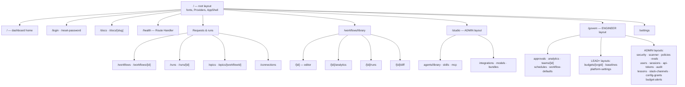

# Dashboard Route Tree

> Indexed at commit `b1d8930` on 2026-09-08 · [view on GitHub](https://github.com/yorch/auto-swe/tree/b1d8930)

## Relevant source files

- [packages/web/src/app/layout.tsx](https://github.com/yorch/auto-swe/blob/b1d8930/packages/web/src/app/layout.tsx)
- [packages/web/src/app/page.tsx](https://github.com/yorch/auto-swe/blob/b1d8930/packages/web/src/app/page.tsx)
- [packages/web/src/app/runs/[id]/page.tsx](https://github.com/yorch/auto-swe/blob/b1d8930/packages/web/src/app/runs/%5Bid%5D/page.tsx)
- [packages/web/src/app/workflows/library/[id]/page.tsx](https://github.com/yorch/auto-swe/blob/b1d8930/packages/web/src/app/workflows/library/%5Bid%5D/page.tsx)
- [packages/web/src/app/docs/[slug]/page.tsx](https://github.com/yorch/auto-swe/blob/b1d8930/packages/web/src/app/docs/%5Bslug%5D/page.tsx)
- [packages/web/src/app/docs/page.tsx](https://github.com/yorch/auto-swe/blob/b1d8930/packages/web/src/app/docs/page.tsx)
- [packages/web/src/app/health/route.ts](https://github.com/yorch/auto-swe/blob/b1d8930/packages/web/src/app/health/route.ts)
- [packages/web/src/app/govern/layout.tsx](https://github.com/yorch/auto-swe/blob/b1d8930/packages/web/src/app/govern/layout.tsx)
- [packages/web/src/app/studio/layout.tsx](https://github.com/yorch/auto-swe/blob/b1d8930/packages/web/src/app/studio/layout.tsx)
- [packages/web/src/app/login/page.tsx](https://github.com/yorch/auto-swe/blob/b1d8930/packages/web/src/app/login/page.tsx)
- [packages/web/src/lib/docs.ts](https://github.com/yorch/auto-swe/blob/b1d8930/packages/web/src/lib/docs.ts)
- [packages/web/src/lib/docLinks.ts](https://github.com/yorch/auto-swe/blob/b1d8930/packages/web/src/lib/docLinks.ts)
- [packages/web/src/components/docs/Markdown.tsx](https://github.com/yorch/auto-swe/blob/b1d8930/packages/web/src/components/docs/Markdown.tsx)
- [packages/web/src/components/auth/RoleLayout.tsx](https://github.com/yorch/auto-swe/blob/b1d8930/packages/web/src/components/auth/RoleLayout.tsx)
- [packages/web/src/lib/auth.server.ts](https://github.com/yorch/auto-swe/blob/b1d8930/packages/web/src/lib/auth.server.ts)
- [packages/web/src/proxy.ts](https://github.com/yorch/auto-swe/blob/b1d8930/packages/web/src/proxy.ts)
- [packages/web/src/components/layout/AppShell.tsx](https://github.com/yorch/auto-swe/blob/b1d8930/packages/web/src/components/layout/AppShell.tsx)
- [packages/web/src/lib/routeParams.ts](https://github.com/yorch/auto-swe/blob/b1d8930/packages/web/src/lib/routeParams.ts)
- [packages/web/src/components/layout/Sidebar.tsx](https://github.com/yorch/auto-swe/blob/b1d8930/packages/web/src/components/layout/Sidebar.tsx)

## Overview

`packages/web/src/app` is a Next.js 16 App Router tree of 48 page routes, one Route Handler, and 18 layouts across roughly 15,400 lines. It is a client-first application: 45 of the 48 pages carry `'use client'`, and most of them read the gateway's REST API through TanStack Query hooks. The three exceptions are the two docs pages, which read Markdown off the filesystem at build time, and a one-line redirect.

Server rendering is used for exactly one job besides docs: authorization. All 18 layouts are Server Components, and the 17 nested ones each await a session check before rendering their subtree, so a role gate runs on the server and cannot be defeated by editing client state.

There are no route groups, no `loading.tsx`, no `error.tsx`, and no `not-found.tsx` anywhere in the tree. Loading and error states are rendered inline by each page from its query state, usually through the shared `QueryBoundary` or `LoadingState` components, and uncaught render errors are caught by a single `ErrorBoundary` wrapped around the whole app in the root layout [packages/web/src/app/layout.tsx#L54-L60](https://github.com/yorch/auto-swe/blob/b1d8930/packages/web/src/app/layout.tsx#L54-L60).

Sources: [packages/web/src/app/layout.tsx:L1-L63](https://github.com/yorch/auto-swe/blob/b1d8930/packages/web/src/app/layout.tsx#L1-L63) [packages/web/src/components/auth/RoleLayout.tsx:L1-L13](https://github.com/yorch/auto-swe/blob/b1d8930/packages/web/src/components/auth/RoleLayout.tsx#L1-L13)

## Diagram



The nesting shown is directory nesting, which is also layout nesting: a page under `govern/security/` is wrapped by the root layout, then `govern/layout.tsx`, then `govern/security/layout.tsx`, and each gate must pass in turn.

Sources: [packages/web/src/app/govern/layout.tsx:L1-L6](https://github.com/yorch/auto-swe/blob/b1d8930/packages/web/src/app/govern/layout.tsx#L1-L6) [packages/web/src/app/studio/layout.tsx:L1-L6](https://github.com/yorch/auto-swe/blob/b1d8930/packages/web/src/app/studio/layout.tsx#L1-L6)

## Route inventory

Every page is a Client Component unless the Kind column says otherwise.

### Shell, home, and authentication

| URL | File | Kind | Shows |
| --- | ---- | ---- | ----- |
| `/` | `app/page.tsx` | client | Dashboard home: status and volume charts, an approvals inbox widget, recent runs, and the new-request and run-template modals |
| `/login` | `app/login/page.tsx` | client | Email/password form plus GitHub, Google, Okta, and magic-link buttons, gated on a probe of `/api/v1/auth/providers` |
| `/reset-password` | `app/reset-password/page.tsx` | client | Token-driven password reset, reading `?token=` inside a `Suspense` boundary |
| `/settings` | `app/settings/page.tsx` | client | Four numbered sections: profile, linked OAuth accounts, credentials, and personal API tokens |
| `/health` | `app/health/route.ts` | Route Handler | `{ "status": "ok" }` for the container `HEALTHCHECK` |
| `/lessons` | `app/lessons/page.tsx` | server | Permanent redirect to `/govern/lessons` |

`login` and `reset-password` both need `useSearchParams`, which requires a `Suspense` boundary above it for static prerender, so each wraps its real body in an inner component [packages/web/src/app/reset-password/page.tsx#L12-L20](https://github.com/yorch/auto-swe/blob/b1d8930/packages/web/src/app/reset-password/page.tsx#L12-L20). The login route is also the only chromeless route: `AppShell` renders it without the sidebar or top bar [packages/web/src/components/layout/AppShell.tsx#L7-L26](https://github.com/yorch/auto-swe/blob/b1d8930/packages/web/src/components/layout/AppShell.tsx#L7-L26).

Sources: [packages/web/src/app/login/page.tsx:L1-L60](https://github.com/yorch/auto-swe/blob/b1d8930/packages/web/src/app/login/page.tsx#L1-L60) [packages/web/src/app/settings/page.tsx:L145-L306](https://github.com/yorch/auto-swe/blob/b1d8930/packages/web/src/app/settings/page.tsx#L145-L306) [packages/web/src/app/health/route.ts:L1-L7](https://github.com/yorch/auto-swe/blob/b1d8930/packages/web/src/app/health/route.ts#L1-L7)

### Work requests, runs, and epics

| URL | File | Shows |
| --- | ---- | ----- |
| `/workflows` | `app/workflows/page.tsx` | The request queue, filtered by an All/Mine/Team scope toggle, with an outcome column |
| `/workflows/[id]` | `app/workflows/[id]/page.tsx` | One work request: repository, branch, cost, token totals, and every run it produced |
| `/runs` | `app/runs/page.tsx` | Paginated run history filtered by status, template, and whether channel-resident runs are included |
| `/runs/[id]` | `app/runs/[id]/page.tsx` | The run viewer — see below |
| `/epics` | `app/epics/page.tsx` | Epic list plus a create modal for LEAD and ADMIN |
| `/epics/[workflowId]` | `app/epics/[workflowId]/page.tsx` | One epic and its decomposed child work requests |
| `/connections` | `app/connections/page.tsx` | Repository connections, GitHub import, and dependency-scan suggestions |

The run list reads `GET /api/v1/workflow-runs` through `useAllWorkflowRuns`, and the work-request list reads `GET /api/v1/workflows` through `useWorkflows` [packages/web/src/hooks/useRuns.ts#L18](https://github.com/yorch/auto-swe/blob/b1d8930/packages/web/src/hooks/useRuns.ts#L18). The epic detail page holds a 45-second startup grace window: the epic's row only appears after the orchestrator's first state update, so a 404 inside that window renders "epic is starting" rather than an error [packages/web/src/app/epics/[workflowId]/page.tsx#L113-L124](https://github.com/yorch/auto-swe/blob/b1d8930/packages/web/src/app/epics/%5BworkflowId%5D/page.tsx#L113-L124).

Sources: [packages/web/src/app/epics/[workflowId]/page.tsx:L109-L140](https://github.com/yorch/auto-swe/blob/b1d8930/packages/web/src/app/epics/%5BworkflowId%5D/page.tsx#L109-L140) [packages/web/src/hooks/useRuns.ts:L14-L130](https://github.com/yorch/auto-swe/blob/b1d8930/packages/web/src/hooks/useRuns.ts#L14-L130) [packages/web/src/app/runs/page.tsx:L16-L30](https://github.com/yorch/auto-swe/blob/b1d8930/packages/web/src/app/runs/page.tsx#L16-L30)

### Template studio

`/workflows/library` lists templates and offers both blank and starter specs plus an LLM generation job polled through `useWorkflowGenerationJob` [packages/web/src/app/workflows/library/page.tsx#L21-L40](https://github.com/yorch/auto-swe/blob/b1d8930/packages/web/src/app/workflows/library/page.tsx#L21-L40). Its four child routes share one `TabBar` whose `onChange` pushes the sibling route, so each tab is a separate URL rather than local state [packages/web/src/app/workflows/library/[id]/analytics/page.tsx#L44-L52](https://github.com/yorch/auto-swe/blob/b1d8930/packages/web/src/app/workflows/library/%5Bid%5D/analytics/page.tsx#L44-L52).

| URL | File | Shows | Loads via |
| --- | ---- | ----- | --------- |
| `/workflows/library/[id]` | `library/[id]/page.tsx` | Spec editor, DAG preview, input-schema builder, refine chat, versions, webhook card | `useWorkflowTemplate`, `useUpdateWorkflowTemplate`, `useRefineWorkflowTemplate` |
| `/workflows/library/[id]/analytics` | `.../analytics/page.tsx` | Per-template run counts, success rate, cost and duration over a 7/14/30/90-day window | `useWorkflowTemplateAnalytics` → `GET /api/v1/workflow-templates/:id/analytics?window=` |
| `/workflows/library/[id]/runs` | `.../runs/page.tsx` | Paginated run history scoped to the template | `useTemplateRuns` → `GET /api/v1/workflow-templates/:id/runs` |
| `/workflows/library/[id]/diff` | `.../diff/page.tsx` | Two-version spec comparison rendered as a diff-annotated DAG | `useWorkflowSpecDiff` → `GET /api/v1/workflow-templates/:id/diff?a=&b=` |

The editor route is the largest page in the tree at 1,113 lines. It parses the spec with the shared `parseWorkflowSpec` and estimates cost with `estimateSpecCost`, both imported from `@auto-swe/shared/workflow`, so the browser validates a spec with the same code the interpreter uses [packages/web/src/app/workflows/library/[id]/page.tsx#L1-L30](https://github.com/yorch/auto-swe/blob/b1d8930/packages/web/src/app/workflows/library/%5Bid%5D/page.tsx#L1-L30).

Sources: [packages/web/src/app/workflows/library/[id]/page.tsx:L1-L60](https://github.com/yorch/auto-swe/blob/b1d8930/packages/web/src/app/workflows/library/%5Bid%5D/page.tsx#L1-L60) [packages/web/src/hooks/useTemplates.ts:L20-L290](https://github.com/yorch/auto-swe/blob/b1d8930/packages/web/src/hooks/useTemplates.ts#L20-L290) [packages/web/src/app/workflows/library/[id]/diff/page.tsx:L1-L30](https://github.com/yorch/auto-swe/blob/b1d8930/packages/web/src/app/workflows/library/%5Bid%5D/diff/page.tsx#L1-L30)

### Studio

Everything under `/studio` is ADMIN-only through one layout [packages/web/src/app/studio/layout.tsx#L1-L6](https://github.com/yorch/auto-swe/blob/b1d8930/packages/web/src/app/studio/layout.tsx#L1-L6).

| URL | Shows |
| --- | ----- |
| `/studio/agents/library` | The Agent library — model spec, prompt, skill refs, and tool keys per agent version |
| `/studio/skills` | Skill CRUD with a verification flag and per-skill effectiveness stats |
| `/studio/mcp` | Model Context Protocol connections, including per-connection list and call timeouts |
| `/studio/integrations` | Eight in-page tabs: GitHub, Slack, Storage, Issue Tracker, Knowledge Base, Figma, OAuth, Audit log |
| `/studio/models` | Three in-page tabs: provider credentials, embedding model, audit log |
| `/studio/bundles` | Installed distribution bundles, install-from-URL, and export |

The integrations page is the one route that keeps its tab in the URL: it reads `useSearchParams` inside a `Suspense` boundary so a link can deep-link to one connector [packages/web/src/app/studio/integrations/page.tsx#L1-L30](https://github.com/yorch/auto-swe/blob/b1d8930/packages/web/src/app/studio/integrations/page.tsx#L1-L30). The model-config page keeps its tab in local state instead.

Sources: [packages/web/src/app/studio/integrations/page.tsx:L1-L85](https://github.com/yorch/auto-swe/blob/b1d8930/packages/web/src/app/studio/integrations/page.tsx#L1-L85) [packages/web/src/app/studio/models/page.tsx:L1-L45](https://github.com/yorch/auto-swe/blob/b1d8930/packages/web/src/app/studio/models/page.tsx#L1-L45) [packages/web/src/app/studio/agents/library/page.tsx:L1-L30](https://github.com/yorch/auto-swe/blob/b1d8930/packages/web/src/app/studio/agents/library/page.tsx#L1-L30)

### Governance

`/govern` admits any active signed-in user; individual sections narrow that with their own nested layout.

| URL | Own layout gate | Shows |
| --- | --- | ----- |
| `/govern/approvals` | none (ENGINEER) | Human-step inbox with pending/all tabs, sort, and an overdue filter |
| `/govern/analytics` | none (ENGINEER) | Cross-template run, success-rate, and cost leaderboard over 7/30/90 days |
| `/govern/teams`, `/govern/teams/[id]` | none (ENGINEER) | Team list; detail adds members, egress and shell allowlists, and the team Agent library |
| `/govern/schedules` | none (ENGINEER) | Cron-scheduled work requests, with a fire-now action |
| `/govern/workflow-defaults` | none (ENGINEER) | Four forms: workflow defaults, consolidation, revalidation, canary |
| `/govern/budgets`, `/govern/budgets/[orgId]` | LEAD, ADMIN | Organizations and their monthly caps, alert thresholds, and members |
| `/govern/baselines` | LEAD, ADMIN | Human-error baselines per domain and outcome type |
| `/govern/platform-settings` | LEAD, ADMIN | Every setting-registry knob, re-resolved at a chosen scope |
| `/govern/security` | ADMIN | Security events with a type filter and a summary bar |
| `/govern/scanner` | ADMIN | Scanner-pattern CRUD across the five blocking and advisory pattern types |
| `/govern/policies`, `/govern/policies/decisions` | ADMIN | Autonomy policy rules; the child route is the filterable decision log |
| `/govern/evals` | ADMIN | Eval datasets and per-scorer result summaries |
| `/govern/budget-alerts` | ADMIN | Organizations whose month-to-date spend crossed their threshold |
| `/govern/users` | ADMIN | Users partitioned into pending sign-ups and active accounts, plus invite |
| `/govern/api-tokens` | ADMIN | Personal access tokens with revoke and shell-audit pruning |
| `/govern/sessions` | ADMIN | Active browser sessions with revoke |
| `/govern/lessons` | ADMIN | Memory lessons, per-repository stats, and consolidation triggers |
| `/govern/slack-channels` | ADMIN | Channel config, memory, open items, and audit — the largest govern page at 1,410 lines |
| `/govern/config-grants` | ADMIN | Per-key configuration grants to LEAD and ENGINEER |
| `/govern/audit` | ADMIN | The 200 most recent lifecycle changes |

The `platform-settings` layout deliberately admits LEAD as well as ADMIN, because the settings API authorizes per setting and a LEAD holding a config grant must be able to reach the page [packages/web/src/app/govern/platform-settings/layout.tsx#L1-L9](https://github.com/yorch/auto-swe/blob/b1d8930/packages/web/src/app/govern/platform-settings/layout.tsx#L1-L9).

Sources: [packages/web/src/app/govern/platform-settings/layout.tsx:L1-L9](https://github.com/yorch/auto-swe/blob/b1d8930/packages/web/src/app/govern/platform-settings/layout.tsx#L1-L9) [packages/web/src/app/govern/budgets/layout.tsx:L1-L6](https://github.com/yorch/auto-swe/blob/b1d8930/packages/web/src/app/govern/budgets/layout.tsx#L1-L6) [packages/web/src/app/govern/slack-channels/page.tsx:L1-L60](https://github.com/yorch/auto-swe/blob/b1d8930/packages/web/src/app/govern/slack-channels/page.tsx#L1-L60) [packages/web/src/components/layout/Sidebar.tsx:L74-L213](https://github.com/yorch/auto-swe/blob/b1d8930/packages/web/src/components/layout/Sidebar.tsx#L74-L213)

## Layouts, gating, and dynamic segments

Three mechanisms guard a route, in order. The proxy runs first and only checks for the presence of one of two session cookies, redirecting to `/login?redirect=<path>` when neither is set; `/login`, `/api`, `/reset-password`, and `/health` are exempt [packages/web/src/proxy.ts#L5](https://github.com/yorch/auto-swe/blob/b1d8930/packages/web/src/proxy.ts#L5). Next, each nested `layout.tsx` calls `RoleLayout`, which awaits `requireRole` — a server-side `GET /api/v1/auth/me` with the cookie's bearer token, redirecting to `/` when the user is inactive or under-privileged [packages/web/src/lib/auth.server.ts#L45-L53](https://github.com/yorch/auto-swe/blob/b1d8930/packages/web/src/lib/auth.server.ts#L45-L53). The gateway's own RBAC is the third and authoritative gate on every API call.

Nine dynamic segments exist, all single-parameter: `[id]` on runs, work requests, teams, and templates; `[workflowId]` on epics; `[orgId]` on budgets; `[slug]` on docs. Every client page passes its raw parameter through `validateRouteParam`, which rejects non-strings and blanks and `decodeURIComponent`s the rest, so a malformed URL renders a not-found state instead of firing a request [packages/web/src/lib/routeParams.ts#L6-L11](https://github.com/yorch/auto-swe/blob/b1d8930/packages/web/src/lib/routeParams.ts#L6-L11).

Two routes opt out of the standard page container. `AppShell` matches `/runs/<id>` and `/workflows/library/<id>/diff` by regular expression and gives them a full-height, non-scrolling `main`, because both manage their own layout [packages/web/src/components/layout/AppShell.tsx#L9-L13](https://github.com/yorch/auto-swe/blob/b1d8930/packages/web/src/components/layout/AppShell.tsx#L9-L13).

Sources: [packages/web/src/proxy.ts:L1-L52](https://github.com/yorch/auto-swe/blob/b1d8930/packages/web/src/proxy.ts#L1-L52) [packages/web/src/lib/auth.server.ts:L1-L53](https://github.com/yorch/auto-swe/blob/b1d8930/packages/web/src/lib/auth.server.ts#L1-L53) [packages/web/src/lib/routeParams.ts:L1-L11](https://github.com/yorch/auto-swe/blob/b1d8930/packages/web/src/lib/routeParams.ts#L1-L11) [packages/web/src/components/layout/AppShell.tsx:L1-L53](https://github.com/yorch/auto-swe/blob/b1d8930/packages/web/src/components/layout/AppShell.tsx#L1-L53)

## The run viewer

`/runs/[id]` is the densest page in the tree at 1,139 lines and ships three alternative renderings of the same run, chosen by a per-user layout preference rather than by URL. `LayoutA` is a split console pairing a step list with a trace panel, `LayoutB` a transcript with a step spine, and `LayoutC` a flight recorder with a waterfall and an 11-second playhead animation [packages/web/src/app/runs/[id]/page.tsx#L81-L540](https://github.com/yorch/auto-swe/blob/b1d8930/packages/web/src/app/runs/%5Bid%5D/page.tsx#L81-L540).

The page loads the run with `useWorkflowRun`, which requests `GET /api/v1/workflow-runs/:id?includeTraces=true`, and layers `useApprovals` on top so a pending human step renders inline as an approval card. Cancel and re-run post to `/api/v1/workflow-runs/:id/cancel` and `/api/v1/work-requests/:id/retry` [packages/web/src/app/runs/[id]/page.tsx#L846-L852](https://github.com/yorch/auto-swe/blob/b1d8930/packages/web/src/app/runs/%5Bid%5D/page.tsx#L846-L852). Traces are classified into security events client-side by reusing `classifyTraceAsSecurityEvent` from the governance security list, so the same rule decides what counts as a block in both places.

Sources: [packages/web/src/app/runs/[id]/page.tsx:L1-L60](https://github.com/yorch/auto-swe/blob/b1d8930/packages/web/src/app/runs/%5Bid%5D/page.tsx#L1-L60) [packages/web/src/app/runs/[id]/page.tsx:L841-L935](https://github.com/yorch/auto-swe/blob/b1d8930/packages/web/src/app/runs/%5Bid%5D/page.tsx#L841-L935) [packages/web/src/hooks/useRuns.ts:L36-L145](https://github.com/yorch/auto-swe/blob/b1d8930/packages/web/src/hooks/useRuns.ts#L36-L145)

## The docs surface

`/docs` and `/docs/[slug]` publish the repository's living documentation inside the dashboard, and they are the only routes that opt into static generation explicitly. Both set `dynamic = 'force-static'`; the slug route adds `dynamicParams = false` and enumerates its pages from `generateStaticParams`, so the served set is frozen at build time and any other slug 404s [packages/web/src/app/docs/[slug]/page.tsx#L9-L15](https://github.com/yorch/auto-swe/blob/b1d8930/packages/web/src/app/docs/%5Bslug%5D/page.tsx#L9-L15).

`listDocs` reads `../../docs` relative to the package, keeps only top-level `.md` files whose basename matches `/^[a-z0-9][a-z0-9-]*$/i`, and derives each title from the file's own `# heading` with the first non-heading paragraph as a 140-character description. Only `README` carries a title override, and the comment on that map warns that an entry there silently outlives the file it describes. Serving only the top level is deliberate: `docs/history/` is frozen and publishing it would advertise superseded behaviour as current [packages/web/src/lib/docs.ts#L16-L47](https://github.com/yorch/auto-swe/blob/b1d8930/packages/web/src/lib/docs.ts#L16-L47).

The non-obvious part is link rewriting. The docs are authored to be read as files, so a cross-reference is written as a markdown link whose target is the bare filename `./agents.md`. Rendered at `/docs/architecture`, that href resolves against the URL and becomes `/docs/agents.md` — which the route rejects, since the slug pattern has no dot and `dynamicParams` is off. Every cross-doc link would 404. `resolveDocLink` classifies each href into one of three outcomes before rendering [packages/web/src/lib/docLinks.ts#L73-L123](https://github.com/yorch/auto-swe/blob/b1d8930/packages/web/src/lib/docLinks.ts#L73-L123).

| Href shape | Resolution | Rendered as |
| --- | --- | --- |
| `http:`, `https:`, `mailto:` | `href` | `<a target="_blank" rel="noopener noreferrer">` |
| `#section` | `href` | Anchor, unchanged |
| `/studio/models` | `href` | Dashboard route, unchanged |
| `./agents.md#3-6` | `doc` | `<Link href="/docs/agents#3-6">` |
| `./slack-app-manifest.json` | `unserved` — not a Markdown document | Plain text with a tooltip |
| `../AGENTS.md` | `unserved` — outside the docs directory | Plain text with a tooltip |
| `./history/evals-rfc.md` | `unserved` — not published to the dashboard | Plain text with a tooltip |
| `./nonexistent.md` | `unserved` — no such doc page | Plain text with a tooltip |

Relative paths are normalized by `resolveWithinDocs`, a string-only walker that drops `.` segments, pops on `..`, and returns null the moment a `..` would escape `docs/` — no filesystem access, so it is safe to run during static generation [packages/web/src/lib/docLinks.ts#L47-L66](https://github.com/yorch/auto-swe/blob/b1d8930/packages/web/src/lib/docLinks.ts#L47-L66). A protocol-relative `//host` href is treated as unserved rather than passed through, because it inherits the page's scheme and can point anywhere, and the same check keeps `javascript:` hrefs out of the DOM.

The page component passes `servedDocSlugs()` into `Markdown`, which installs a custom anchor renderer only when that set is supplied — without it, relative links are left exactly as authored [packages/web/src/components/docs/Markdown.tsx#L73-L117](https://github.com/yorch/auto-swe/blob/b1d8930/packages/web/src/components/docs/Markdown.tsx#L73-L117). A degraded link renders as dotted-underlined text whose tooltip names the reason and says the target lives in the repository, on the stated principle that a link that goes nowhere is worse than prose. The renderer also intercepts fenced code: a ```` ```mermaid ```` block is prefixed with a line saying it is diagram source, because no Mermaid renderer is installed [packages/web/src/components/docs/Markdown.tsx#L51-L71](https://github.com/yorch/auto-swe/blob/b1d8930/packages/web/src/components/docs/Markdown.tsx#L51-L71).

Sources: [packages/web/src/lib/docLinks.ts:L1-L124](https://github.com/yorch/auto-swe/blob/b1d8930/packages/web/src/lib/docLinks.ts#L1-L124) [packages/web/src/lib/docs.ts:L1-L88](https://github.com/yorch/auto-swe/blob/b1d8930/packages/web/src/lib/docs.ts#L1-L88) [packages/web/src/components/docs/Markdown.tsx:L1-L120](https://github.com/yorch/auto-swe/blob/b1d8930/packages/web/src/components/docs/Markdown.tsx#L1-L120) [packages/web/src/app/docs/[slug]/page.tsx:L1-L47](https://github.com/yorch/auto-swe/blob/b1d8930/packages/web/src/app/docs/%5Bslug%5D/page.tsx#L1-L47)

## Limitations

- **The sidebar links a route that does not exist.** The Govern section offers "Organizations" at `/govern/organizations`, but no such directory is in the tree and `next.config.ts` declares no rewrites; the organization pages live at `/govern/budgets` and `/govern/budgets/[orgId]` [packages/web/src/components/layout/Sidebar.tsx#L142-L147](https://github.com/yorch/auto-swe/blob/b1d8930/packages/web/src/components/layout/Sidebar.tsx#L142-L147).
- **`/epics` and `/epics/[workflowId]` are unlinked.** Nothing in the sidebar, top bar, or any page href points at them; they are reachable only by typing the URL.
- **Two routes the sidebar marks ADMIN carry only the ENGINEER-level layout gate.** `/govern/schedules` and `/govern/workflow-defaults` have no `layout.tsx` of their own, so the server-side gate they inherit from `govern/layout.tsx` admits any active user. The sidebar hides the entries and the gateway rejects the writes, but the page itself renders for a direct visit.
- **There is no route-level error or loading UI.** With no `error.tsx` or `loading.tsx` anywhere, a page that throws during render falls all the way to the single app-wide `ErrorBoundary`, losing the surrounding chrome context that a nested boundary would have preserved.
- **Docs are frozen at build time.** `force-static` plus `dynamicParams = false` means a documentation file added or edited after the image is built is invisible until the next build.
- **Mermaid diagrams in docs are not rendered**, only labelled as diagram source, because adding the renderer is a dependency decision that has not been taken.

## Related Pages

- Parent: [Web Dashboard](./5-web-dashboard.md)
- Sibling: [Components and State](./5.2-components-and-state.md)
- [Gateway HTTP Routes](./3.1-http-routes.md) — the API these pages call
- [Authentication and RBAC](./3.2-authentication-and-rbac.md) — the roles the layouts check
