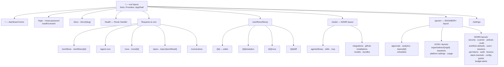

# Dashboard Route Tree

> Indexed at commit `ae416937` on 2026-10-03 · [view on GitHub](https://github.com/yorch/auto-swe/tree/ae416937)

## Relevant source files

- [packages/web/src/app/layout.tsx](https://github.com/yorch/auto-swe/blob/ae416937/packages/web/src/app/layout.tsx)
- [packages/web/src/app/page.tsx](https://github.com/yorch/auto-swe/blob/ae416937/packages/web/src/app/page.tsx)
- [packages/web/src/app/agent-runs/page.tsx](https://github.com/yorch/auto-swe/blob/ae416937/packages/web/src/app/agent-runs/page.tsx)
- [packages/web/src/app/oauth/consent/page.tsx](https://github.com/yorch/auto-swe/blob/ae416937/packages/web/src/app/oauth/consent/page.tsx)
- [packages/web/src/app/runs/[id]/page.tsx](https://github.com/yorch/auto-swe/blob/ae416937/packages/web/src/app/runs/%5Bid%5D/page.tsx)
- [packages/web/src/app/runs/[id]/TracesTab.tsx](https://github.com/yorch/auto-swe/blob/ae416937/packages/web/src/app/runs/%5Bid%5D/TracesTab.tsx)
- [packages/web/src/app/runs/[id]/SplitRunPanel.tsx](https://github.com/yorch/auto-swe/blob/ae416937/packages/web/src/app/runs/%5Bid%5D/SplitRunPanel.tsx)
- [packages/web/src/app/workflows/library/[id]/page.tsx](https://github.com/yorch/auto-swe/blob/ae416937/packages/web/src/app/workflows/library/%5Bid%5D/page.tsx)
- [packages/web/src/app/docs/[slug]/page.tsx](https://github.com/yorch/auto-swe/blob/ae416937/packages/web/src/app/docs/%5Bslug%5D/page.tsx)
- [packages/web/src/app/docs/page.tsx](https://github.com/yorch/auto-swe/blob/ae416937/packages/web/src/app/docs/page.tsx)
- [packages/web/src/app/health/route.ts](https://github.com/yorch/auto-swe/blob/ae416937/packages/web/src/app/health/route.ts)
- [packages/web/src/app/govern/layout.tsx](https://github.com/yorch/auto-swe/blob/ae416937/packages/web/src/app/govern/layout.tsx)
- [packages/web/src/app/govern/usage/layout.tsx](https://github.com/yorch/auto-swe/blob/ae416937/packages/web/src/app/govern/usage/layout.tsx)
- [packages/web/src/app/govern/usage/page.tsx](https://github.com/yorch/auto-swe/blob/ae416937/packages/web/src/app/govern/usage/page.tsx)
- [packages/web/src/app/govern/workflow-defaults/layout.tsx](https://github.com/yorch/auto-swe/blob/ae416937/packages/web/src/app/govern/workflow-defaults/layout.tsx)
- [packages/web/src/app/studio/layout.tsx](https://github.com/yorch/auto-swe/blob/ae416937/packages/web/src/app/studio/layout.tsx)
- [packages/web/src/app/studio/models/page.tsx](https://github.com/yorch/auto-swe/blob/ae416937/packages/web/src/app/studio/models/page.tsx)
- [packages/web/src/app/studio/integrations/page.tsx](https://github.com/yorch/auto-swe/blob/ae416937/packages/web/src/app/studio/integrations/page.tsx)
- [packages/web/src/app/studio/github-installations/page.tsx](https://github.com/yorch/auto-swe/blob/ae416937/packages/web/src/app/studio/github-installations/page.tsx)
- [packages/web/src/app/login/page.tsx](https://github.com/yorch/auto-swe/blob/ae416937/packages/web/src/app/login/page.tsx)
- [packages/web/src/lib/navigation.ts](https://github.com/yorch/auto-swe/blob/ae416937/packages/web/src/lib/navigation.ts)
- [packages/web/src/lib/navigation.test.ts](https://github.com/yorch/auto-swe/blob/ae416937/packages/web/src/lib/navigation.test.ts)
- [packages/web/src/lib/docs.ts](https://github.com/yorch/auto-swe/blob/ae416937/packages/web/src/lib/docs.ts)
- [packages/web/src/lib/docLinks.ts](https://github.com/yorch/auto-swe/blob/ae416937/packages/web/src/lib/docLinks.ts)
- [packages/web/src/components/docs/Markdown.tsx](https://github.com/yorch/auto-swe/blob/ae416937/packages/web/src/components/docs/Markdown.tsx)
- [packages/web/src/components/auth/RoleLayout.tsx](https://github.com/yorch/auto-swe/blob/ae416937/packages/web/src/components/auth/RoleLayout.tsx)
- [packages/web/src/components/ui/PageHeader.tsx](https://github.com/yorch/auto-swe/blob/ae416937/packages/web/src/components/ui/PageHeader.tsx)
- [packages/web/src/lib/auth.server.ts](https://github.com/yorch/auto-swe/blob/ae416937/packages/web/src/lib/auth.server.ts)
- [packages/web/src/proxy.ts](https://github.com/yorch/auto-swe/blob/ae416937/packages/web/src/proxy.ts)
- [packages/web/src/components/layout/AppShell.tsx](https://github.com/yorch/auto-swe/blob/ae416937/packages/web/src/components/layout/AppShell.tsx)
- [packages/web/src/lib/routeParams.ts](https://github.com/yorch/auto-swe/blob/ae416937/packages/web/src/lib/routeParams.ts)
- [packages/web/src/components/layout/Sidebar.tsx](https://github.com/yorch/auto-swe/blob/ae416937/packages/web/src/components/layout/Sidebar.tsx)
- [packages/web/src/components/layout/TopBar.tsx](https://github.com/yorch/auto-swe/blob/ae416937/packages/web/src/components/layout/TopBar.tsx)

## Overview

`packages/web/src/app` is a Next.js 16 App Router tree of 54 page routes, one Route Handler, and 20 layouts, in 77 non-test source files and roughly 16,500 lines (counted with `find` and `wc -l`; nine colocated test files are excluded). It is a client-first application: 51 of the 54 pages carry `'use client'`, and most of them read the gateway's REST API through TanStack Query hooks. The three exceptions are the two docs pages, which read Markdown off the filesystem at build time, and a one-line redirect.

Server rendering is used for exactly one job besides docs: authorization. None of the 20 layouts carries `'use client'`, and the 19 nested ones each await a session check before rendering their subtree, so a role gate runs on the server and cannot be defeated by editing client state.

Every page except six opens with the shared `PageHeader` primitive (a mono "chapter" eyebrow such as `§ Govern`, a title, an optional subtitle and an actions slot), which is the one header convention across the tree. The exceptions are the three sign-in pages (login, reset password, and the OAuth consent screen, which each draw their own panel instead), the redirect, the run viewer (which draws its own full-height header), and the single doc page (which draws a breadcrumb) [packages/web/src/components/ui/PageHeader.tsx#L3-L39](https://github.com/yorch/auto-swe/blob/ae416937/packages/web/src/components/ui/PageHeader.tsx#L3-L39).

Page titles come from one list. `lib/navigation.ts` declares every sidebar entry with its label, icon and minimum role, and the same labels feed the top bar title and the H1 of pages reachable from the sidebar, so the three cannot drift apart [packages/web/src/lib/navigation.ts#L4-L19](https://github.com/yorch/auto-swe/blob/ae416937/packages/web/src/lib/navigation.ts#L4-L19).

There are no route groups, no `loading.tsx`, no `error.tsx`, no `global-error.tsx`, and no `not-found.tsx` anywhere in the tree. Loading and error states are rendered inline by each page from its query state, usually through the shared `QueryBoundary` or `LoadingState` components, and uncaught render errors are caught by a single `ErrorBoundary` wrapped around the whole app in the root layout [packages/web/src/app/layout.tsx#L61-L63](https://github.com/yorch/auto-swe/blob/ae416937/packages/web/src/app/layout.tsx#L61-L63). The root layout is also marked `force-dynamic`, because it injects the browser-facing API and Temporal UI URLs from the running container's environment [packages/web/src/app/layout.tsx#L28-L33](https://github.com/yorch/auto-swe/blob/ae416937/packages/web/src/app/layout.tsx#L28-L33).

Sources: [packages/web/src/app/layout.tsx:L1-L68](https://github.com/yorch/auto-swe/blob/ae416937/packages/web/src/app/layout.tsx#L1-L68) [packages/web/src/components/auth/RoleLayout.tsx:L1-L23](https://github.com/yorch/auto-swe/blob/ae416937/packages/web/src/components/auth/RoleLayout.tsx#L1-L23) [packages/web/src/lib/navigation.ts:L1-L30](https://github.com/yorch/auto-swe/blob/ae416937/packages/web/src/lib/navigation.ts#L1-L30)

## Diagram


```mermaid
flowchart TD
    Root["/ — root layout<br/>fonts, Providers, AppShell"]

    Root --> Home["/ — dashboard home"]
    Root --> Auth["/login · /reset-password<br/>/oauth/consent"]
    Root --> Docs["/docs · /docs/[slug]"]
    Root --> Health["/health — Route Handler"]

    Root --> Work["Requests & runs"]
    Work --> W1["/workflows · /workflows/[id]"]
    Work --> W5["/agent-runs"]
    Work --> W2["/runs · /runs/[id]"]
    Work --> W3["/epics · /epics/[workflowId]"]
    Work --> W4["/connections"]

    Root --> Lib["/workflows/library"]
    Lib --> L1["/[id] — editor"]
    Lib --> L2["/[id]/analytics"]
    Lib --> L3["/[id]/runs"]
    Lib --> L4["/[id]/diff"]

    Root --> Studio["/studio — ADMIN layout"]
    Studio --> S1["agents/library · skills · mcp"]
    Studio --> S2["integrations · github-installations<br/>models · bundles"]

    Root --> Gov["/govern — ENGINEER+ layout"]
    Gov --> G1["approvals · analytics · teams/[id]<br/>schedules"]
    Gov --> G2["LEAD+ layouts:<br/>organizations/[orgId] · baselines<br/>platform-settings · usage"]
    Gov --> G3["ADMIN layouts:<br/>security · scanner · policies · evals<br/>workflow-defaults · users · sessions<br/>api-tokens · audit · lessons<br/>slack-channels · config-grants<br/>budget-alerts"]

    Root --> Acct["/settings"]
```

The nesting shown is directory nesting, which is also layout nesting: a page under `govern/security/` is wrapped by the root layout, then `govern/layout.tsx`, then `govern/security/layout.tsx`, and each gate must pass in turn. Evals is the one govern section with child pages (`evals/datasets/[id]`, `evals/runs/[id]`), and policies has `policies/decisions`; they sit under the section's own layout and are omitted from the diagram for space.

Sources: [packages/web/src/app/govern/layout.tsx:L1-L6](https://github.com/yorch/auto-swe/blob/ae416937/packages/web/src/app/govern/layout.tsx#L1-L6) [packages/web/src/app/studio/layout.tsx:L1-L6](https://github.com/yorch/auto-swe/blob/ae416937/packages/web/src/app/studio/layout.tsx#L1-L6) [packages/web/src/app/govern/evals/layout.tsx:L1-L6](https://github.com/yorch/auto-swe/blob/ae416937/packages/web/src/app/govern/evals/layout.tsx#L1-L6)

## Route inventory

Every page is a Client Component unless the Kind column says otherwise.

### Shell, home, and authentication

| URL | File | Kind | Shows |
| --- | ---- | ---- | ----- |
| `/` | `app/page.tsx` | client | Dashboard home, built from the work-request list (`GET /api/v1/workflows`): status and volume charts, an approvals inbox widget, recent outcomes, and the new-request and run-template modals. A deployment with no work requests shows the onboarding panel instead |
| `/login` | `app/login/page.tsx` | client | Email/password and magic-link tabs plus GitHub, Google, and Okta buttons, shown only for the providers a probe of `/api/v1/auth/providers` reports |
| `/reset-password` | `app/reset-password/page.tsx` | client | Token-driven password reset, reading `?token=` inside a `Suspense` boundary |
| `/oauth/consent` | `app/oauth/consent/page.tsx` | client | The approval screen an MCP client sends the user to: who is asking, where the result goes, what it may do, Approve or Deny |
| `/settings` | `app/settings/page.tsx` | client | Five numbered sections: profile, linked sign-in accounts, credentials, personal API tokens, and connected apps |
| `/health` | `app/health/route.ts` | Route Handler | `{ "status": "ok" }` for the container `HEALTHCHECK` |
| `/lessons` | `app/lessons/page.tsx` | server | Redirect to `/govern/lessons` |

`login`, `reset-password`, and `oauth/consent` all need `useSearchParams`, which requires a `Suspense` boundary above it for static prerender, so each wraps its real body in an inner component [packages/web/src/app/reset-password/page.tsx#L13-L20](https://github.com/yorch/auto-swe/blob/ae416937/packages/web/src/app/reset-password/page.tsx#L13-L20). Only `/login` and `/reset-password` are chromeless: `AppShell` renders them without the sidebar or top bar [packages/web/src/components/layout/AppShell.tsx#L9-L31](https://github.com/yorch/auto-swe/blob/ae416937/packages/web/src/components/layout/AppShell.tsx#L9-L31).

The login page learns which sign-in methods exist by probing the gateway rather than from build-time configuration. It renders a social button only when the probe reports that provider, and treats a 200 that does not match the expected shape as a gateway that is not really there [packages/web/src/app/login/page.tsx#L182-L210](https://github.com/yorch/auto-swe/blob/ae416937/packages/web/src/app/login/page.tsx#L182-L210).

**The consent screen** is the dashboard half of the MCP authorization flow described in [MCP Server and OAuth](./3.5-mcp-server-and-oauth.md). The proxy lets it through without a session marker, because the browser can arrive straight from the authorization server before this app has set one; the page therefore calls `hydrateFromSession` itself and shows a sign-in prompt, a retry, or the decision form depending on the probe result [packages/web/src/components/oauth/ConsentScreen.tsx#L32-L82](https://github.com/yorch/auto-swe/blob/ae416937/packages/web/src/components/oauth/ConsentScreen.tsx#L32-L82). The decision form shows the app's self-chosen name behind an `unverified` badge, the host of the redirect URI it will be sent to, a warning when that host is local, and the scopes requested. Read is described when the request carries a read or write scope; Write appears as an unchecked box only when the request asked for `mcp:write` and the operator allows write tools, and the write scope is granted only if that box is checked [packages/web/src/components/oauth/ConsentScreen.tsx#L84-L132](https://github.com/yorch/auto-swe/blob/ae416937/packages/web/src/components/oauth/ConsentScreen.tsx#L84-L132). Its two calls go to the authorization server's own `/api/auth/oauth2/public-client` and `/api/auth/oauth2/consent` endpoints with the session cookie, not through the bearer-token API client, and the consent answer is the URL the browser is then sent to [packages/web/src/hooks/useOAuthConsent.ts#L9-L53](https://github.com/yorch/auto-swe/blob/ae416937/packages/web/src/hooks/useOAuthConsent.ts#L9-L53). Apps a user has approved are listed in the fifth Settings section, which reads `GET /api/v1/me/mcp-grants`, offers one Disconnect action per app, and hides itself when MCP is off and nothing is connected [packages/web/src/components/settings/ConnectedAppsSection.tsx#L22-L45](https://github.com/yorch/auto-swe/blob/ae416937/packages/web/src/components/settings/ConnectedAppsSection.tsx#L22-L45) [packages/web/src/hooks/useMcpGrants.ts#L22-L37](https://github.com/yorch/auto-swe/blob/ae416937/packages/web/src/hooks/useMcpGrants.ts#L22-L37). See [`docs/mcp-server.md`](https://github.com/yorch/auto-swe/blob/ae416937/docs/mcp-server.md) for the server side.

Sources: [packages/web/src/app/login/page.tsx:L1-L110](https://github.com/yorch/auto-swe/blob/ae416937/packages/web/src/app/login/page.tsx#L1-L110) [packages/web/src/app/oauth/consent/page.tsx:L1-L18](https://github.com/yorch/auto-swe/blob/ae416937/packages/web/src/app/oauth/consent/page.tsx#L1-L18) [packages/web/src/app/settings/page.tsx:L176-L326](https://github.com/yorch/auto-swe/blob/ae416937/packages/web/src/app/settings/page.tsx#L176-L326) [packages/web/src/app/health/route.ts:L1-L7](https://github.com/yorch/auto-swe/blob/ae416937/packages/web/src/app/health/route.ts#L1-L7) [packages/web/src/app/lessons/page.tsx:L1-L5](https://github.com/yorch/auto-swe/blob/ae416937/packages/web/src/app/lessons/page.tsx#L1-L5) [packages/web/src/app/page.tsx:L117-L210](https://github.com/yorch/auto-swe/blob/ae416937/packages/web/src/app/page.tsx#L117-L210)

### Work requests, runs, and epics

| URL | File | Shows |
| --- | ---- | ----- |
| `/workflows` | `app/workflows/page.tsx` | The request queue: runs filtered by an All/Mine/Team scope toggle (default Mine), with label, workflow, domain, status, and outcome columns |
| `/workflows/[id]` | `app/workflows/[id]/page.tsx` | One work request: repository, branch, cost, token totals, and every run it produced |
| `/agent-runs` | `app/agent-runs/page.tsx` | The form for running a library agent against one repository without a workflow |
| `/runs` | `app/runs/page.tsx` | Paginated run history, filtered on the server by status, template, and whether channel-resident runs are included |
| `/runs/[id]` | `app/runs/[id]/page.tsx` | The run viewer — see below |
| `/epics` | `app/epics/page.tsx` | Epic list plus a create modal for LEAD and ADMIN |
| `/epics/[workflowId]` | `app/epics/[workflowId]/page.tsx` | One epic and its decomposed child work requests |
| `/connections` | `app/connections/page.tsx` | Repository connections, GitHub import, per-user credentials, team sharing, and dependency-scan suggestions |

Both the request queue and the run history read `GET /api/v1/workflow-runs` through `useAllWorkflowRuns`. The hook turns its filter object into query parameters (`status`, `templateId`, `templateVersion`, `scope`, `includeChannel`, `limit`, `offset`), so filtering and paging happen at the gateway and each filter change resets the offset to the first page [packages/web/src/hooks/useRuns.ts#L212-L252](https://github.com/yorch/auto-swe/blob/ae416937/packages/web/src/hooks/useRuns.ts#L212-L252) [packages/web/src/app/runs/page.tsx#L23-L91](https://github.com/yorch/auto-swe/blob/ae416937/packages/web/src/app/runs/page.tsx#L23-L91). The queue page is the same hook with a `scope` parameter and a fixed page size of 50 [packages/web/src/app/workflows/page.tsx#L19-L62](https://github.com/yorch/auto-swe/blob/ae416937/packages/web/src/app/workflows/page.tsx#L19-L62). The epic detail page holds a 45-second startup grace window: the epic's row only appears after the orchestrator's first state update, so a 404 inside that window renders "epic is starting" rather than an error [packages/web/src/app/epics/[workflowId]/page.tsx#L25-L60](https://github.com/yorch/auto-swe/blob/ae416937/packages/web/src/app/epics/%5BworkflowId%5D/page.tsx#L25-L60).

**Agent runs.** `/agent-runs` is a thin page around `AgentRunForm`, which collects a repository, a launchable agent, an optional pinned version, a prompt, a delivery mode, and optional step and wall-clock limits. The repository and agent pickers are searchable comboboxes; the agent list and the platform's limits are re-fetched per repository because an organization's overrides change what is launchable [packages/web/src/app/agent-runs/page.tsx#L7-L17](https://github.com/yorch/auto-swe/blob/ae416937/packages/web/src/app/agent-runs/page.tsx#L7-L17) [packages/web/src/components/agentRuns/AgentRunForm.tsx#L41-L66](https://github.com/yorch/auto-swe/blob/ae416937/packages/web/src/components/agentRuns/AgentRunForm.tsx#L41-L66). The form sends one idempotency key per distinct submission and guards double clicks with its own ref, because a pending flag lags a click by a render [packages/web/src/components/agentRuns/AgentRunForm.tsx#L88-L108](https://github.com/yorch/auto-swe/blob/ae416937/packages/web/src/components/agentRuns/AgentRunForm.tsx#L88-L108). On success it swaps itself for a confirmation card with the effective delivery mode and limits and a link to the run once it can be located [packages/web/src/components/agentRuns/AgentRunForm.tsx#L112-L146](https://github.com/yorch/auto-swe/blob/ae416937/packages/web/src/components/agentRuns/AgentRunForm.tsx#L112-L146). The calls are `GET /api/v1/agent-runs/agents`, `GET /api/v1/agent-runs/limits` and `POST /api/v1/agent-runs` [packages/web/src/hooks/useAgentRuns.ts#L28-L80](https://github.com/yorch/auto-swe/blob/ae416937/packages/web/src/hooks/useAgentRuns.ts#L28-L80). What the endpoint does is in [Agent Runs and Implementer Runtimes](./4.6-agent-runs-and-implementer-runtimes.md) and [`docs/agent-runs.md`](https://github.com/yorch/auto-swe/blob/ae416937/docs/agent-runs.md). The result of such a run is shown on its run page; see the run viewer below.

Sources: [packages/web/src/app/epics/[workflowId]/page.tsx:L20-L60](https://github.com/yorch/auto-swe/blob/ae416937/packages/web/src/app/epics/%5BworkflowId%5D/page.tsx#L20-L60) [packages/web/src/app/workflows/[id]/page.tsx:L61-L65](https://github.com/yorch/auto-swe/blob/ae416937/packages/web/src/app/workflows/%5Bid%5D/page.tsx#L61-L65) [packages/web/src/app/workflows/[id]/page.tsx:L134-L140](https://github.com/yorch/auto-swe/blob/ae416937/packages/web/src/app/workflows/%5Bid%5D/page.tsx#L134-L140) [packages/web/src/app/epics/page.tsx:L24-L30](https://github.com/yorch/auto-swe/blob/ae416937/packages/web/src/app/epics/page.tsx#L24-L30) [packages/web/src/app/connections/page.tsx:L53-L130](https://github.com/yorch/auto-swe/blob/ae416937/packages/web/src/app/connections/page.tsx#L53-L130)

### Template studio

`/workflows/library` lists templates and offers both blank and starter specs plus an LLM generation job polled through `useWorkflowGenerationJob` [packages/web/src/app/workflows/library/page.tsx#L157-L176](https://github.com/yorch/auto-swe/blob/ae416937/packages/web/src/app/workflows/library/page.tsx#L157-L176). Its four child routes share one `TabBar` whose tabs are links to the sibling routes, so each tab is a separate URL rather than local state [packages/web/src/components/workflow/templateNav.tsx#L12-L37](https://github.com/yorch/auto-swe/blob/ae416937/packages/web/src/components/workflow/templateNav.tsx#L12-L37).

| URL | File | Shows | Loads via |
| --- | ---- | ----- | --------- |
| `/workflows/library/[id]` | `library/[id]/page.tsx` | Spec editor, graph and outline views of the DAG, input-schema builder, refine chat, versions, cost estimate, webhook card | `useWorkflowTemplate`, `useUpdateWorkflowTemplate`, `useRefineWorkflowTemplate` |
| `/workflows/library/[id]/analytics` | `.../analytics/page.tsx` | Per-template run counts, success rate, cost and duration over a 7/14/30/90-day window | `useWorkflowTemplateAnalytics` → `GET /api/v1/workflow-templates/:id/analytics?window=` |
| `/workflows/library/[id]/runs` | `.../runs/page.tsx` | Paginated run history scoped to the template | `useTemplateRuns` → `GET /api/v1/workflow-templates/:id/runs` |
| `/workflows/library/[id]/diff` | `.../diff/page.tsx` | Two-version spec comparison rendered as a diff-annotated DAG | `useWorkflowSpecDiff` → `GET /api/v1/workflow-templates/:id/diff?a=&b=` |

The editor route is the second-largest page in the tree at 1,117 lines. It parses the spec with the shared `parseWorkflowSpec` and estimates cost with `estimateSpecCost`, both imported from `@auto-swe/shared/workflow`, so the browser validates a spec with the same code the interpreter uses [packages/web/src/app/workflows/library/[id]/page.tsx#L1-L10](https://github.com/yorch/auto-swe/blob/ae416937/packages/web/src/app/workflows/library/%5Bid%5D/page.tsx#L1-L10). The estimate prices each agent role at the model its GLOBAL agent currently runs, read from the model catalog through `useRolePricing`; a role the catalog cannot price keeps the estimator's built-in default [packages/web/src/app/workflows/library/[id]/page.tsx#L596-L612](https://github.com/yorch/auto-swe/blob/ae416937/packages/web/src/app/workflows/library/%5Bid%5D/page.tsx#L596-L612). The graph canvas offers an Outline view of the same spec when the page passes it the `outline` prop, and the run viewer's graph panel passes it too [packages/web/src/components/workflow/WorkflowDag.tsx#L72-L102](https://github.com/yorch/auto-swe/blob/ae416937/packages/web/src/components/workflow/WorkflowDag.tsx#L72-L102).

Sources: [packages/web/src/app/workflows/library/[id]/page.tsx:L1-L60](https://github.com/yorch/auto-swe/blob/ae416937/packages/web/src/app/workflows/library/%5Bid%5D/page.tsx#L1-L60) [packages/web/src/hooks/useTemplates.ts:L20-L290](https://github.com/yorch/auto-swe/blob/ae416937/packages/web/src/hooks/useTemplates.ts#L20-L290) [packages/web/src/app/workflows/library/[id]/analytics/page.tsx:L28-L75](https://github.com/yorch/auto-swe/blob/ae416937/packages/web/src/app/workflows/library/%5Bid%5D/analytics/page.tsx#L28-L75)

### Studio

Everything under `/studio` is ADMIN-only through one layout [packages/web/src/app/studio/layout.tsx#L1-L6](https://github.com/yorch/auto-swe/blob/ae416937/packages/web/src/app/studio/layout.tsx#L1-L6).

| URL | Shows |
| --- | ----- |
| `/studio/agents/library` | The Agent library — model spec, prompt, skill refs, and tool keys per agent version; editing cuts a new version |
| `/studio/skills` | Skill CRUD with a verification flag and per-skill effectiveness stats |
| `/studio/mcp` | Model Context Protocol connections, including per-connection list and call timeouts |
| `/studio/integrations` | Six in-page tabs: GitHub, Slack, Issue Tracker, Knowledge Base, Figma, Audit log |
| `/studio/github-installations` | GitHub App installations: list with host, add by installation ID, account login and optional host, edit, delete, over `/api/v1/platform/github-installations` |
| `/studio/models` | Four in-page tabs: provider credentials, model catalog, embeddings, audit log |
| `/studio/bundles` | Installed distribution bundles, install-from-URL, and export |

**Integrations.** The page reads `?tab=` once to pick the initial tab, inside a `Suspense` boundary, so a link can deep-link to one connector (the Slack install callback lands on `?tab=slack&slack_installed=<teamId>`); switching tabs afterwards is local state and does not rewrite the URL [packages/web/src/app/studio/integrations/page.tsx#L40-L47](https://github.com/yorch/auto-swe/blob/ae416937/packages/web/src/app/studio/integrations/page.tsx#L40-L47). Its subtitle states that sign-in providers (Google, Okta, GitHub OAuth) and artifact storage are configured through environment variables only, and an `env` badge marks a field whose value is currently read from the environment [packages/web/src/app/studio/integrations/page.tsx#L50-L61](https://github.com/yorch/auto-swe/blob/ae416937/packages/web/src/app/studio/integrations/page.tsx#L50-L61); see [Configuration and Settings](./2.3-configuration-and-settings.md). The GitHub tab ends with two GitHub Enterprise cards: per-host credentials (a token and/or an App id and private key for each approved host, where an empty secret on edit means unchanged and Clear removes it) and per-host webhook secrets [packages/web/src/components/integrations/GitHubTab.tsx#L288-L292](https://github.com/yorch/auto-swe/blob/ae416937/packages/web/src/components/integrations/GitHubTab.tsx#L288-L292) [packages/web/src/components/integrations/GitHubHostCredentialsCard.tsx#L24-L70](https://github.com/yorch/auto-swe/blob/ae416937/packages/web/src/components/integrations/GitHubHostCredentialsCard.tsx#L24-L70) [packages/web/src/hooks/useGithubHostCredentials.ts#L38-L70](https://github.com/yorch/auto-swe/blob/ae416937/packages/web/src/hooks/useGithubHostCredentials.ts#L38-L70). The credential model is in [Repository Access and Credentials](./3.4-repository-access-and-credentials.md) and [`docs/user-github-credentials.md`](https://github.com/yorch/auto-swe/blob/ae416937/docs/user-github-credentials.md).

**GitHub installations.** The table shows the host of each installation, rendering an empty host as `instance`, and the create modal takes an optional host that is lower-cased and cannot be changed afterwards, because the same installation id can exist on two hosts [packages/web/src/app/studio/github-installations/page.tsx#L25-L77](https://github.com/yorch/auto-swe/blob/ae416937/packages/web/src/app/studio/github-installations/page.tsx#L25-L77) [packages/web/src/app/studio/github-installations/page.tsx#L199-L215](https://github.com/yorch/auto-swe/blob/ae416937/packages/web/src/app/studio/github-installations/page.tsx#L199-L215).

**Model configuration.** The page keeps its tab in local state [packages/web/src/app/studio/models/page.tsx#L13-L49](https://github.com/yorch/auto-swe/blob/ae416937/packages/web/src/app/studio/models/page.tsx#L13-L49). The Catalog tab is the editor for the per-MTok prices every LLM and embedding call is costed at: a table of entries with add, edit, reset-to-built-in and delete, a panel of in-use models that have no price, and a discovery panel whose "Check providers now" button asks the gateway to list what each provider offers and shows the stored suggestions [packages/web/src/components/modelConfig/CatalogTab.tsx#L55-L75](https://github.com/yorch/auto-swe/blob/ae416937/packages/web/src/components/modelConfig/CatalogTab.tsx#L55-L75) [packages/web/src/components/modelConfig/CatalogTab.tsx#L263-L330](https://github.com/yorch/auto-swe/blob/ae416937/packages/web/src/components/modelConfig/CatalogTab.tsx#L263-L330). It talks to `/api/v1/platform/model-catalog` [packages/web/src/hooks/useModelCatalog.ts#L23](https://github.com/yorch/auto-swe/blob/ae416937/packages/web/src/hooks/useModelCatalog.ts#L23), and the `<provider>/<model-id>` field used elsewhere suggests catalog models with their prices while still accepting a spec the catalog lacks [packages/web/src/components/modelConfig/ModelSpecPicker.tsx#L8-L32](https://github.com/yorch/auto-swe/blob/ae416937/packages/web/src/components/modelConfig/ModelSpecPicker.tsx#L8-L32). Pricing and discovery are covered in [Model Catalog and Pricing](./4.7-model-catalog-and-pricing.md).

Sources: [packages/web/src/app/studio/integrations/page.tsx:L1-L72](https://github.com/yorch/auto-swe/blob/ae416937/packages/web/src/app/studio/integrations/page.tsx#L1-L72) [packages/web/src/app/studio/models/page.tsx:L1-L49](https://github.com/yorch/auto-swe/blob/ae416937/packages/web/src/app/studio/models/page.tsx#L1-L49) [packages/web/src/app/studio/github-installations/page.tsx:L160-L215](https://github.com/yorch/auto-swe/blob/ae416937/packages/web/src/app/studio/github-installations/page.tsx#L160-L215) [packages/web/src/hooks/useGithubInstallations.ts:L37-L72](https://github.com/yorch/auto-swe/blob/ae416937/packages/web/src/hooks/useGithubInstallations.ts#L37-L72)

### Governance

`/govern` admits any active signed-in user; individual sections narrow that with their own nested layout.

| URL | Own layout gate | Shows |
| --- | --- | ----- |
| `/govern/approvals` | none (ENGINEER) | Human-step inbox with pending/all tabs, sort, and an overdue filter |
| `/govern/analytics` | none (ENGINEER) | Cross-template run, success-rate, and cost leaderboard over a selectable window |
| `/govern/teams`, `/govern/teams/[id]` | none (ENGINEER) | Team list; detail adds members, repositories, egress and shell allowlists, a default channel persona, and the team Agent library |
| `/govern/schedules` | none (ENGINEER) | Cron-scheduled work requests (5-field, UTC), with a fire-now action |
| `/govern/organizations`, `/govern/organizations/[orgId]` | LEAD, ADMIN | Organizations you belong to with their monthly caps and alert thresholds; detail adds budget and members |
| `/govern/baselines` | LEAD, ADMIN | Human-error baselines per organization and domain |
| `/govern/platform-settings` | LEAD, ADMIN | Every setting-registry knob, re-resolved at a chosen scope |
| `/govern/usage` | ADMIN, LEAD | LLM usage over a 7/30/90-day window at a chosen scope: totals, a daily cost chart, breakdown tables, and the costliest runs |
| `/govern/security` | ADMIN | Security events with a type filter and a summary bar |
| `/govern/scanner` | ADMIN | Scanner-pattern CRUD across the blocking and advisory pattern types |
| `/govern/policies`, `/govern/policies/decisions` | ADMIN | Autonomy policy rules; the child route is the decision log |
| `/govern/evals`, `/govern/evals/datasets/[id]`, `/govern/evals/runs/[id]` | ADMIN | Per-scorer trends and every captured result with a link to the run it scored, plus datasets; a dataset page lists its offline runs, and a run page shows its candidate and baseline refs and its results filtered by scorer |
| `/govern/budget-alerts` | ADMIN | Organizations whose month-to-date spend crossed their threshold |
| `/govern/workflow-defaults` | ADMIN | Four forms: workflow defaults, consolidation, revalidation, canary |
| `/govern/users` | ADMIN | Users partitioned into pending sign-ups and active accounts, plus invite |
| `/govern/api-tokens` | ADMIN | Personal access tokens with revoke and shell-audit pruning |
| `/govern/sessions` | ADMIN | Active browser sessions with revoke |
| `/govern/lessons` | ADMIN | Memory lessons, per-repository stats, and consolidation triggers |
| `/govern/slack-channels` | ADMIN | Channel config, memory, open items, and audit — the largest page in the tree at 1,275 lines |
| `/govern/config-grants` | ADMIN | Per-key configuration grants to LEAD and ENGINEER |
| `/govern/audit` | ADMIN | Lifecycle-change log, 50 rows a page, filterable by action, entity type, and actor |

**LLM usage.** The page reads `GET /api/v1/platform/usage` with a window and an optional team or organization scope, keeps the previous window on screen while the next loads, and is not polled [packages/web/src/hooks/useAdmin.ts#L304-L322](https://github.com/yorch/auto-swe/blob/ae416937/packages/web/src/hooks/useAdmin.ts#L304-L322). The scope picker offers "Whole platform" only to an ADMIN; a LEAD sees the teams they lead and the organizations they administer, mirroring what the gateway enforces [packages/web/src/app/govern/usage/page.tsx#L22-L52](https://github.com/yorch/auto-swe/blob/ae416937/packages/web/src/app/govern/usage/page.tsx#L22-L52). It shows four stats (spend, calls, error rate, and spend with no run record), a spend-per-day chart, breakdowns by team, organization, model, agent and activity, and a table of the costliest runs [packages/web/src/app/govern/usage/page.tsx#L165-L274](https://github.com/yorch/auto-swe/blob/ae416937/packages/web/src/app/govern/usage/page.tsx#L165-L274). See [Observability and Cost](./4.5-observability-and-cost.md) for where the figures come from.

**Workflow defaults.** The workflow-defaults form is one Card of branch and pull-request templates, one for the default team, and one "Resources and tuning" Card holding per-tier token budgets, the CI wait strategy, agent refine-loop caps, lesson retrieval, and the eval-health and judge thresholds [packages/web/src/components/workflow/WorkflowDefaultsForm.tsx#L185-L241](https://github.com/yorch/auto-swe/blob/ae416937/packages/web/src/components/workflow/WorkflowDefaultsForm.tsx#L185-L241) [packages/web/src/components/workflow/WorkflowDefaultsForm.tsx#L292-L376](https://github.com/yorch/auto-swe/blob/ae416937/packages/web/src/components/workflow/WorkflowDefaultsForm.tsx#L292-L376). Workspace sizing and image are not editable here: the worker reads them from environment variables. The page is ADMIN-only at its own layout, because every form on it reads and writes `/platform/config/*`, which is ADMIN-only at the gateway [packages/web/src/app/govern/workflow-defaults/layout.tsx#L1-L7](https://github.com/yorch/auto-swe/blob/ae416937/packages/web/src/app/govern/workflow-defaults/layout.tsx#L1-L7).

The `platform-settings` layout deliberately admits LEAD as well as ADMIN, because the settings API authorizes per setting and a LEAD holding a config grant must be able to reach the page [packages/web/src/app/govern/platform-settings/layout.tsx#L1-L9](https://github.com/yorch/auto-swe/blob/ae416937/packages/web/src/app/govern/platform-settings/layout.tsx#L1-L9). The `usage` layout admits LEAD for the same reason: the gateway decides which scopes each role may read [packages/web/src/app/govern/usage/layout.tsx#L1-L7](https://github.com/yorch/auto-swe/blob/ae416937/packages/web/src/app/govern/usage/layout.tsx#L1-L7).

Sources: [packages/web/src/app/govern/platform-settings/layout.tsx:L1-L9](https://github.com/yorch/auto-swe/blob/ae416937/packages/web/src/app/govern/platform-settings/layout.tsx#L1-L9) [packages/web/src/app/govern/organizations/layout.tsx:L1-L6](https://github.com/yorch/auto-swe/blob/ae416937/packages/web/src/app/govern/organizations/layout.tsx#L1-L6) [packages/web/src/app/govern/usage/page.tsx:L1-L60](https://github.com/yorch/auto-swe/blob/ae416937/packages/web/src/app/govern/usage/page.tsx#L1-L60) [packages/web/src/app/govern/audit/page.tsx:L20-L60](https://github.com/yorch/auto-swe/blob/ae416937/packages/web/src/app/govern/audit/page.tsx#L20-L60) [packages/web/src/app/govern/evals/page.tsx:L45-L66](https://github.com/yorch/auto-swe/blob/ae416937/packages/web/src/app/govern/evals/page.tsx#L45-L66) [packages/web/src/app/govern/slack-channels/page.tsx:L1-L60](https://github.com/yorch/auto-swe/blob/ae416937/packages/web/src/app/govern/slack-channels/page.tsx#L1-L60) [packages/web/src/lib/navigation.ts:L84-L132](https://github.com/yorch/auto-swe/blob/ae416937/packages/web/src/lib/navigation.ts#L84-L132)

## Layouts, gating, and dynamic segments

Three mechanisms guard a route, in order. The proxy runs first and only checks for the presence of one of two session cookies, redirecting to `/login?redirect=<path>` when neither is set; `/login`, `/api`, `/reset-password`, `/health`, and `/oauth/consent` are exempt [packages/web/src/proxy.ts#L14](https://github.com/yorch/auto-swe/blob/ae416937/packages/web/src/proxy.ts#L14) [packages/web/src/proxy.ts#L52-L67](https://github.com/yorch/auto-swe/blob/ae416937/packages/web/src/proxy.ts#L52-L67). It also forwards the matched pathname and query string to Server Components in headers, since layouts cannot read the URL, and it sets `frame-ancestors 'none'` and `X-Frame-Options: DENY` on `/login` and `/oauth/consent`, the two pages that take a credential or a security decision [packages/web/src/proxy.ts#L17-L50](https://github.com/yorch/auto-swe/blob/ae416937/packages/web/src/proxy.ts#L17-L50).

Next, each nested `layout.tsx` calls `RoleLayout`, which awaits `requireRole`. That function runs `checkSession`, a server-side `GET /api/v1/auth/me` with the cookie's bearer token, and then decides by outcome [packages/web/src/lib/auth.server.ts#L34-L77](https://github.com/yorch/auto-swe/blob/ae416937/packages/web/src/lib/auth.server.ts#L34-L77):

| Outcome of the check | Result |
| --- | --- |
| No bearer, or the gateway answers 401 | Redirect to `/login` carrying the original path; when the session marker cookie is present the redirect also asks the login page to re-mint the bearer from the longer-lived session and return |
| The gateway answers 403, the user is inactive, or no allowed role is met under the shared `roleMeets` hierarchy | Redirect to `/` |
| The gateway is unreachable or answers something else | `RoleLayout` renders an error alert rather than treating an outage as "not allowed" |

[packages/web/src/lib/auth.server.ts#L80-L127](https://github.com/yorch/auto-swe/blob/ae416937/packages/web/src/lib/auth.server.ts#L80-L127) [packages/web/src/components/auth/RoleLayout.tsx#L10-L23](https://github.com/yorch/auto-swe/blob/ae416937/packages/web/src/components/auth/RoleLayout.tsx#L10-L23). The gateway's own RBAC is the third and authoritative gate on every API call. Pages outside `/govern` and `/studio` have no layout, so they get only the proxy's cookie check on the server and whatever the page itself hides.

The 19 nested layouts resolve to three tiers; `allowed` lists accepted roles and `roleMeets` admits anyone at or above any of them:

| Gate | Layouts |
| --- | --- |
| ENGINEER and above (any active user) | `govern/` |
| LEAD and above | `govern/organizations`, `govern/baselines`, `govern/platform-settings`, `govern/usage` |
| ADMIN only | `studio/` and 13 govern sections: `api-tokens`, `audit`, `budget-alerts`, `config-grants`, `evals`, `lessons`, `policies`, `scanner`, `security`, `sessions`, `slack-channels`, `users`, `workflow-defaults` |

The sidebar is generated from the same `NAV_GROUPS` list, narrowed to the viewer's role by `visibleNavGroups`, and a unit test keeps the two honest: for every nav entry it reads each `layout.tsx` on the path from the app root, takes the strictest `allowed` floor, and requires it to equal the entry's `minRole` [packages/web/src/lib/navigation.ts#L141-L147](https://github.com/yorch/auto-swe/blob/ae416937/packages/web/src/lib/navigation.ts#L141-L147) [packages/web/src/lib/navigation.test.ts#L11-L44](https://github.com/yorch/auto-swe/blob/ae416937/packages/web/src/lib/navigation.test.ts#L11-L44).

Nine dynamic-segment directories exist, all single-parameter, under four parameter names: `[id]` on runs, work requests, teams, templates, eval datasets, and eval runs; `[workflowId]` on epics; `[orgId]` on organizations; `[slug]` on docs. Every client page with a segment passes its raw parameter through `validateRouteParam`, which rejects non-strings and blanks and `decodeURIComponent`s the rest, so a malformed URL renders a not-found state instead of firing a request; 11 pages call it (the four template pages count individually) [packages/web/src/lib/routeParams.ts#L6-L11](https://github.com/yorch/auto-swe/blob/ae416937/packages/web/src/lib/routeParams.ts#L6-L11). The docs slug is the exception, validated instead by `dynamicParams = false`.

Two routes opt out of the standard page container. `AppShell` matches `/runs/<id>` and `/workflows/library/<id>/diff` by regular expression and gives them a full-height, non-scrolling `main`, because both manage their own layout [packages/web/src/components/layout/AppShell.tsx#L13-L16](https://github.com/yorch/auto-swe/blob/ae416937/packages/web/src/components/layout/AppShell.tsx#L13-L16).

Sources: [packages/web/src/proxy.ts:L1-L73](https://github.com/yorch/auto-swe/blob/ae416937/packages/web/src/proxy.ts#L1-L73) [packages/web/src/lib/auth.server.ts:L1-L127](https://github.com/yorch/auto-swe/blob/ae416937/packages/web/src/lib/auth.server.ts#L1-L127) [packages/web/src/lib/routeParams.ts:L1-L11](https://github.com/yorch/auto-swe/blob/ae416937/packages/web/src/lib/routeParams.ts#L1-L11) [packages/web/src/components/layout/AppShell.tsx:L1-L70](https://github.com/yorch/auto-swe/blob/ae416937/packages/web/src/components/layout/AppShell.tsx#L1-L70) [packages/web/src/components/layout/Sidebar.tsx:L73-L87](https://github.com/yorch/auto-swe/blob/ae416937/packages/web/src/components/layout/Sidebar.tsx#L73-L87)

## The run viewer

`/runs/[id]` is the third-largest page in the tree at 998 lines, and it delegates trace rendering to two sibling modules in the same directory: `TracesTab` (702 lines) and `SplitRunPanel` (109 lines). The page ships three alternative renderings of the same run, chosen by a per-user layout preference rather than by URL. `LayoutA` is a split console pairing an execution graph (with a graph/outline switch) with a console that has a Split/Stream mode toggle; `LayoutB` is a transcript with a step spine; `LayoutC` is a flight recorder with a waterfall and an 11-second playhead animation [packages/web/src/app/runs/[id]/page.tsx#L61-L190](https://github.com/yorch/auto-swe/blob/ae416937/packages/web/src/app/runs/%5Bid%5D/page.tsx#L61-L190) [packages/web/src/app/runs/[id]/page.tsx#L385-L396](https://github.com/yorch/auto-swe/blob/ae416937/packages/web/src/app/runs/%5Bid%5D/page.tsx#L385-L396) [packages/web/src/app/runs/[id]/page.tsx#L925-L965](https://github.com/yorch/auto-swe/blob/ae416937/packages/web/src/app/runs/%5Bid%5D/page.tsx#L925-L965).

**Linking traces to the graph.** Each trace carries the key of the spec node that produced it and a recording id that prefixes the fan-out branch path (`fan[0]/impl`). Selecting a graph node selects every execution of that node across all branches; selecting a step row selects exactly one branch's execution. Traces recorded without those columns fall back to the spec nodes that run the same activity and are flagged as ambiguous rather than guessed [packages/web/src/lib/traceLinkage.ts#L1-L60](https://github.com/yorch/auto-swe/blob/ae416937/packages/web/src/lib/traceLinkage.ts#L1-L60). `TracesTab` groups the selected traces by branch and prints a `Branch fan[0]` header when any trace belongs to one [packages/web/src/app/runs/[id]/TracesTab.tsx#L512-L640](https://github.com/yorch/auto-swe/blob/ae416937/packages/web/src/app/runs/%5Bid%5D/TracesTab.tsx#L512-L640).

`TracesTab` is the shared trace renderer used by all three layouts: it labels each event by kind (llm, tool, event), summarizes tool calls and activity events such as TDD test runs and PR creation, caps oversized payloads, shows token and cost chips, and links each LLM-response trace that has an OpenTelemetry trace id to the Tempo explorer in Grafana [packages/web/src/app/runs/[id]/TracesTab.tsx#L12-L80](https://github.com/yorch/auto-swe/blob/ae416937/packages/web/src/app/runs/%5Bid%5D/TracesTab.tsx#L12-L80) [packages/web/src/app/runs/[id]/TracesTab.tsx#L125-L165](https://github.com/yorch/auto-swe/blob/ae416937/packages/web/src/app/runs/%5Bid%5D/TracesTab.tsx#L125-L165) [packages/web/src/app/runs/[id]/TracesTab.tsx#L320-L366](https://github.com/yorch/auto-swe/blob/ae416937/packages/web/src/app/runs/%5Bid%5D/TracesTab.tsx#L320-L366).

**Live updates.** The page loads the run through `useRunDetail`. The first read requests `GET /api/v1/workflow-runs/:id?includeTraces=true`. Each poll after that reads the run without traces and only the traces created since a cursor, `GET /api/v1/workflow-runs/:id/traces?since=`, and appends them to the cached run; the cursor trails the last read by 10 seconds because a trace's timestamp is the writer's clock, not its commit time. The poll falls back to a full read when the merged count disagrees with the server's total and once when the run turns terminal. Polling is every 3 seconds while the run is active and every 30 afterwards [packages/web/src/hooks/useRuns.ts#L36-L151](https://github.com/yorch/auto-swe/blob/ae416937/packages/web/src/hooks/useRuns.ts#L36-L151). Trace payloads arrive trimmed to 4,000 characters per field; when any trace is flagged `trimmed`, a header button switches the query to `?fullTraces=true`, fetched once and not refreshed, and falls back to the trimmed view with a badge if that request fails [packages/web/src/hooks/useRuns.ts#L153-L184](https://github.com/yorch/auto-swe/blob/ae416937/packages/web/src/hooks/useRuns.ts#L153-L184) [packages/web/src/app/runs/[id]/page.tsx#L856-L876](https://github.com/yorch/auto-swe/blob/ae416937/packages/web/src/app/runs/%5Bid%5D/page.tsx#L856-L876). The page layers `useApprovals` on top so a pending human step renders inline as an approval card [packages/web/src/app/runs/[id]/page.tsx#L734-L738](https://github.com/yorch/auto-swe/blob/ae416937/packages/web/src/app/runs/%5Bid%5D/page.tsx#L734-L738) [packages/web/src/app/runs/[id]/page.tsx#L150-L155](https://github.com/yorch/auto-swe/blob/ae416937/packages/web/src/app/runs/%5Bid%5D/page.tsx#L150-L155), and classifies traces into security events client-side by reusing `classifyTraceAsSecurityEvent` from the governance security list, so the same rule decides what counts as a block in both places [packages/web/src/app/runs/[id]/page.tsx#L755-L775](https://github.com/yorch/auto-swe/blob/ae416937/packages/web/src/app/runs/%5Bid%5D/page.tsx#L755-L775).

**Outcome.** The right-hand meta rail renders `RunOutcomeCard` whenever the run has a non-empty `result`. For an agent run the card is `AgentRunOutcomeCard`: what the agent said, the branch and pull request it published (the link only when the URL is https), the files it changed with a collapsible diff, the security-gate result, whether the diff was verified, and why it stopped if it hit a limit. Everything in it is rendered as text because the agent influenced it [packages/web/src/components/runs/RunMetaRail.tsx#L146-L175](https://github.com/yorch/auto-swe/blob/ae416937/packages/web/src/components/runs/RunMetaRail.tsx#L146-L175) [packages/web/src/components/runs/RunOutcomeCard.tsx#L53-L62](https://github.com/yorch/auto-swe/blob/ae416937/packages/web/src/components/runs/RunOutcomeCard.tsx#L53-L62) [packages/web/src/components/runs/AgentRunOutcomeCard.tsx#L20-L136](https://github.com/yorch/auto-swe/blob/ae416937/packages/web/src/components/runs/AgentRunOutcomeCard.tsx#L20-L136).

**Cancel and re-run.** Cancel posts to `/api/v1/workflow-runs/:id/cancel`. Re-run is offered for failed runs and for any terminal agent run; an ordinary run retries through `/api/v1/work-requests/:id/retry`, while an agent run goes through its own `/api/v1/agent-runs/:id/rerun` and asks for confirmation first when the previous run delivered, naming what the re-run will create. The page allows one re-run per view [packages/web/src/hooks/useRunReRun.ts#L9-L50](https://github.com/yorch/auto-swe/blob/ae416937/packages/web/src/hooks/useRunReRun.ts#L9-L50) [packages/web/src/app/runs/[id]/page.tsx#L884-L892](https://github.com/yorch/auto-swe/blob/ae416937/packages/web/src/app/runs/%5Bid%5D/page.tsx#L884-L892) [packages/web/src/hooks/useRuns.ts#L268-L285](https://github.com/yorch/auto-swe/blob/ae416937/packages/web/src/hooks/useRuns.ts#L268-L285). The "View template" link is omitted for agent runs, because the hidden system template behind them has a detail route that answers 404 for everyone [packages/web/src/app/runs/[id]/page.tsx#L915-L923](https://github.com/yorch/auto-swe/blob/ae416937/packages/web/src/app/runs/%5Bid%5D/page.tsx#L915-L923).

Sources: [packages/web/src/app/runs/[id]/page.tsx:L1-L60](https://github.com/yorch/auto-swe/blob/ae416937/packages/web/src/app/runs/%5Bid%5D/page.tsx#L1-L60) [packages/web/src/app/runs/[id]/page.tsx:L708-L760](https://github.com/yorch/auto-swe/blob/ae416937/packages/web/src/app/runs/%5Bid%5D/page.tsx#L708-L760) [packages/web/src/app/runs/[id]/SplitRunPanel.tsx:L1-L40](https://github.com/yorch/auto-swe/blob/ae416937/packages/web/src/app/runs/%5Bid%5D/SplitRunPanel.tsx#L1-L40) [packages/web/src/hooks/useRuns.ts:L105-L184](https://github.com/yorch/auto-swe/blob/ae416937/packages/web/src/hooks/useRuns.ts#L105-L184)

## The docs surface

`/docs` and `/docs/[slug]` publish the repository's living documentation inside the dashboard, and they are the only routes that opt into static generation explicitly. Both set `dynamic = 'force-static'`; the slug route adds `dynamicParams = false` and enumerates its pages from `generateStaticParams`, so the served set is frozen at build time and any other slug 404s [packages/web/src/app/docs/[slug]/page.tsx#L9-L15](https://github.com/yorch/auto-swe/blob/ae416937/packages/web/src/app/docs/%5Bslug%5D/page.tsx#L9-L15).

`listDocs` reads `../../docs` relative to the package, keeps only top-level `.md` files whose basename matches `/^[a-z0-9][a-z0-9-]*$/i`, and derives each title from the file's own `# heading` with the first non-heading paragraph as a 140-character description. Only `README` carries a title override (`Overview`), and the comment on that map warns that an entry there silently outlives the file it describes. Serving only the top level is deliberate: `docs/history/` is frozen and publishing it would advertise superseded behaviour as current [packages/web/src/lib/docs.ts#L15-L67](https://github.com/yorch/auto-swe/blob/ae416937/packages/web/src/lib/docs.ts#L15-L67). The container image copies only `docs/*.md` for the same reason [packages/web/Dockerfile#L53-L58](https://github.com/yorch/auto-swe/blob/ae416937/packages/web/Dockerfile#L53-L58).

The non-obvious part is link rewriting. The docs are authored to be read as files, so a cross-reference is written as a markdown link whose target is the bare filename `./agents.md`. Rendered at `/docs/architecture`, that href resolves against the URL and becomes `/docs/agents.md` — which the route rejects, since the slug pattern has no dot and `dynamicParams` is off. Every cross-doc link would 404. `resolveDocLink` classifies each href into one of three outcomes before rendering [packages/web/src/lib/docLinks.ts#L73-L124](https://github.com/yorch/auto-swe/blob/ae416937/packages/web/src/lib/docLinks.ts#L73-L124).

| Href shape | Resolution | Rendered as |
| --- | --- | --- |
| `http:`, `https:`, `mailto:` | `href` | `<a target="_blank" rel="noopener noreferrer">` |
| `#section` | `href` | Anchor, unchanged |
| `/studio/models` | `href` | Dashboard route, unchanged |
| `./agents.md#3-6` | `doc` | `<Link href="/docs/agents#3-6">` |
| `./slack-app-manifest.json` | `unserved` — not a Markdown document | Plain text with a tooltip |
| `../AGENTS.md` | `unserved` — outside the docs directory | Plain text with a tooltip |
| `./history/evals-rfc.md` | `unserved` — not published to the dashboard | Plain text with a tooltip |
| `./nonexistent.md` | `unserved` — no such doc page | Plain text with a tooltip |

Relative paths are normalized by `resolveWithinDocs`, a string-only walker that drops `.` segments, pops on `..`, and returns null the moment a `..` would escape `docs/` — no filesystem access, so it is safe to run during static generation [packages/web/src/lib/docLinks.ts#L43-L65](https://github.com/yorch/auto-swe/blob/ae416937/packages/web/src/lib/docLinks.ts#L43-L65). A protocol-relative `//host` href is treated as unserved rather than passed through, because it inherits the page's scheme and can point anywhere, and the same check keeps `javascript:` hrefs out of the DOM [packages/web/src/lib/docLinks.ts#L78-L98](https://github.com/yorch/auto-swe/blob/ae416937/packages/web/src/lib/docLinks.ts#L78-L98).

The page component passes `servedDocSlugs()` into `Markdown`, which installs a custom anchor renderer only when that set is supplied — without it, relative links are left exactly as authored [packages/web/src/components/docs/Markdown.tsx#L16-L47](https://github.com/yorch/auto-swe/blob/ae416937/packages/web/src/components/docs/Markdown.tsx#L16-L47) [packages/web/src/components/docs/Markdown.tsx#L112-L117](https://github.com/yorch/auto-swe/blob/ae416937/packages/web/src/components/docs/Markdown.tsx#L112-L117). A degraded link renders as dotted-underlined text whose tooltip names the reason and says the target lives in the repository, on the stated principle that a link that goes nowhere is worse than prose. The renderer also intercepts fenced code: a ```` ```mermaid ```` block is prefixed with a line saying it is diagram source, because no Mermaid renderer is installed in the dashboard [packages/web/src/components/docs/Markdown.tsx#L50-L72](https://github.com/yorch/auto-swe/blob/ae416937/packages/web/src/components/docs/Markdown.tsx#L50-L72).

**Relation to the public site.** The `site` workspace publishes the same documents as a second surface. Its `syncDocs.mjs` reads the same top-level `docs/*.md` files with the same slug rule so that the two surfaces publish the same set, copies them into a generated, gitignored content collection at build time, and adds the root README and the CLI README as extra pages [site/scripts/syncDocs.mjs#L1-L24](https://github.com/yorch/auto-swe/blob/ae416937/site/scripts/syncDocs.mjs#L1-L24) [site/scripts/syncDocs.mjs#L52-L58](https://github.com/yorch/auto-swe/blob/ae416937/site/scripts/syncDocs.mjs#L52-L58) [site/scripts/syncDocs.mjs#L143-L161](https://github.com/yorch/auto-swe/blob/ae416937/site/scripts/syncDocs.mjs#L143-L161). Neither surface owns the content, and they solve relative links differently: the dashboard degrades an unserved target to plain text, while the site resolves it to the file on GitHub, since a reader of the public site is already outside the product [site/scripts/docLinks.mjs#L1-L30](https://github.com/yorch/auto-swe/blob/ae416937/site/scripts/docLinks.mjs#L1-L30). The site also renders Mermaid diagrams, which the dashboard does not.

Sources: [packages/web/src/lib/docLinks.ts:L1-L124](https://github.com/yorch/auto-swe/blob/ae416937/packages/web/src/lib/docLinks.ts#L1-L124) [packages/web/src/lib/docs.ts:L1-L88](https://github.com/yorch/auto-swe/blob/ae416937/packages/web/src/lib/docs.ts#L1-L88) [packages/web/src/components/docs/Markdown.tsx:L1-L120](https://github.com/yorch/auto-swe/blob/ae416937/packages/web/src/components/docs/Markdown.tsx#L1-L120) [packages/web/src/app/docs/[slug]/page.tsx:L1-L46](https://github.com/yorch/auto-swe/blob/ae416937/packages/web/src/app/docs/%5Bslug%5D/page.tsx#L1-L46) [site/scripts/syncDocs.mjs:L1-L24](https://github.com/yorch/auto-swe/blob/ae416937/site/scripts/syncDocs.mjs#L1-L24)

## Limitations

- **`/epics` and `/epics/[workflowId]` have no navigation item.** `NAV_GROUPS` lists neither, the sidebar defines an `epics` icon that no item uses, and `/epics` appears only in the page-title table for pages without a sidebar entry. The list links to each epic and the create modal navigates to the new one, so the only inbound links come from the epic pages themselves; a user reaches them by typing the URL [packages/web/src/lib/navigation.ts#L163-L173](https://github.com/yorch/auto-swe/blob/ae416937/packages/web/src/lib/navigation.ts#L163-L173) [packages/web/src/components/layout/Sidebar.tsx#L22-L23](https://github.com/yorch/auto-swe/blob/ae416937/packages/web/src/components/layout/Sidebar.tsx#L22-L23) [packages/web/src/app/epics/page.tsx#L124-L130](https://github.com/yorch/auto-swe/blob/ae416937/packages/web/src/app/epics/page.tsx#L124-L130).
- **`/docs` is linked only from the first-run onboarding panel.** It has no sidebar entry, and the panel that links to it renders only when the deployment has no work requests at all, so an established deployment reaches the in-app docs by typing the URL [packages/web/src/app/page.tsx#L131-L137](https://github.com/yorch/auto-swe/blob/ae416937/packages/web/src/app/page.tsx#L131-L137) [packages/web/src/components/dashboard/DashboardOnboarding.tsx#L178-L184](https://github.com/yorch/auto-swe/blob/ae416937/packages/web/src/components/dashboard/DashboardOnboarding.tsx#L178-L184).
- **`/oauth/consent` renders inside the app chrome.** The proxy treats the page as public, but `AppShell` lists only `/login` and `/reset-password` as chromeless, so the consent screen, including its signed-out branch, is drawn inside the sidebar and top bar, whose queries, by the shell's own comment, would 401 for a signed-out visitor [packages/web/src/components/layout/AppShell.tsx#L9-L31](https://github.com/yorch/auto-swe/blob/ae416937/packages/web/src/components/layout/AppShell.tsx#L9-L31) [packages/web/src/proxy.ts#L9-L14](https://github.com/yorch/auto-swe/blob/ae416937/packages/web/src/proxy.ts#L9-L14).
- **Pages outside `/govern` and `/studio` have no server-side role check.** They are guarded by the proxy's cookie-presence test and by what each page hides from a lower role; the gateway still refuses the API calls, but the page shell renders for any signed-in browser [packages/web/src/proxy.ts#L59-L66](https://github.com/yorch/auto-swe/blob/ae416937/packages/web/src/proxy.ts#L59-L66).
- **There is no route-level error or loading UI.** With no `error.tsx` or `loading.tsx` anywhere, a page that throws during render falls all the way to the single app-wide `ErrorBoundary`, losing the surrounding chrome context that a nested boundary would have preserved.
- **Docs are frozen at build time.** `force-static` plus `dynamicParams = false` means a documentation file added or edited after the image is built is invisible until the next build.
- **Mermaid diagrams in docs are not rendered**, only labelled as diagram source, because adding the renderer to the dashboard is a dependency decision that has not been taken; the public site renders them.

Sources: [packages/web/src/lib/navigation.ts:L163-L173](https://github.com/yorch/auto-swe/blob/ae416937/packages/web/src/lib/navigation.ts#L163-L173) [packages/web/src/components/layout/AppShell.tsx:L9-L31](https://github.com/yorch/auto-swe/blob/ae416937/packages/web/src/components/layout/AppShell.tsx#L9-L31) [packages/web/src/proxy.ts:L52-L67](https://github.com/yorch/auto-swe/blob/ae416937/packages/web/src/proxy.ts#L52-L67) [packages/web/src/components/docs/Markdown.tsx:L50-L72](https://github.com/yorch/auto-swe/blob/ae416937/packages/web/src/components/docs/Markdown.tsx#L50-L72) [packages/web/src/app/docs/[slug]/page.tsx:L9-L15](https://github.com/yorch/auto-swe/blob/ae416937/packages/web/src/app/docs/%5Bslug%5D/page.tsx#L9-L15)

## Related Pages

- Parent: [Web Dashboard](./5-web-dashboard.md)
- Sibling: [Components and State](./5.2-components-and-state.md)
- [Gateway HTTP Routes](./3.1-http-routes.md) — the API these pages call
- [Authentication and RBAC](./3.2-authentication-and-rbac.md) — the roles the layouts check
- [MCP Server and OAuth](./3.5-mcp-server-and-oauth.md) — the server behind the consent screen
- [Agent Runs and Implementer Runtimes](./4.6-agent-runs-and-implementer-runtimes.md) — what the agent-run form launches
- [Model Catalog and Pricing](./4.7-model-catalog-and-pricing.md) — what the catalog tab edits