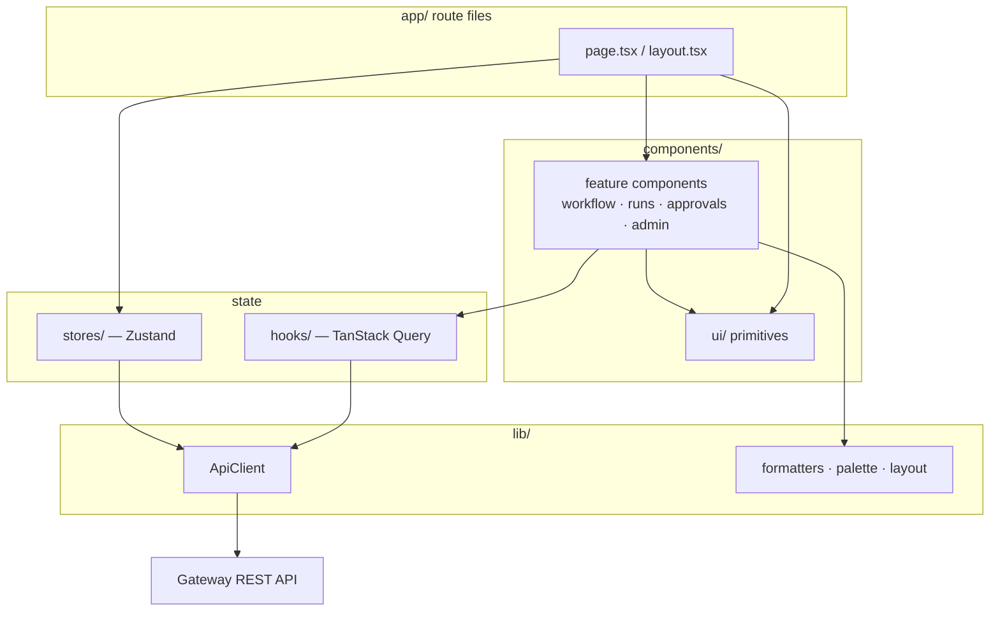

# Component Library and Client State

> Indexed at commit `b1d8930` on 2026-09-08 · [view on GitHub](https://github.com/yorch/auto-swe/tree/b1d8930)

## Relevant source files

- [packages/web/src/lib/api.ts](https://github.com/yorch/auto-swe/blob/b1d8930/packages/web/src/lib/api.ts)
- [packages/web/src/lib/utils.ts](https://github.com/yorch/auto-swe/blob/b1d8930/packages/web/src/lib/utils.ts)
- [packages/web/src/lib/palette.ts](https://github.com/yorch/auto-swe/blob/b1d8930/packages/web/src/lib/palette.ts)
- [packages/web/src/lib/workflowLayout.ts](https://github.com/yorch/auto-swe/blob/b1d8930/packages/web/src/lib/workflowLayout.ts)
- [packages/web/src/lib/networkErrors.ts](https://github.com/yorch/auto-swe/blob/b1d8930/packages/web/src/lib/networkErrors.ts)
- [packages/web/src/lib/config.ts](https://github.com/yorch/auto-swe/blob/b1d8930/packages/web/src/lib/config.ts)
- [packages/web/src/lib/docLinks.ts](https://github.com/yorch/auto-swe/blob/b1d8930/packages/web/src/lib/docLinks.ts)
- [packages/web/src/hooks/useListQuery.ts](https://github.com/yorch/auto-swe/blob/b1d8930/packages/web/src/hooks/useListQuery.ts)
- [packages/web/src/hooks/useRuns.ts](https://github.com/yorch/auto-swe/blob/b1d8930/packages/web/src/hooks/useRuns.ts)
- [packages/web/src/hooks/useApprovals.ts](https://github.com/yorch/auto-swe/blob/b1d8930/packages/web/src/hooks/useApprovals.ts)
- [packages/web/src/hooks/useAdminConfig.ts](https://github.com/yorch/auto-swe/blob/b1d8930/packages/web/src/hooks/useAdminConfig.ts)
- [packages/web/src/hooks/useConfigForm.ts](https://github.com/yorch/auto-swe/blob/b1d8930/packages/web/src/hooks/useConfigForm.ts)
- [packages/web/src/hooks/useIntegrationConfigForm.ts](https://github.com/yorch/auto-swe/blob/b1d8930/packages/web/src/hooks/useIntegrationConfigForm.ts)
- [packages/web/src/hooks/useUserPreferences.ts](https://github.com/yorch/auto-swe/blob/b1d8930/packages/web/src/hooks/useUserPreferences.ts)
- [packages/web/src/stores/authStore.ts](https://github.com/yorch/auto-swe/blob/b1d8930/packages/web/src/stores/authStore.ts)
- [packages/web/src/stores/teamStore.ts](https://github.com/yorch/auto-swe/blob/b1d8930/packages/web/src/stores/teamStore.ts)
- [packages/web/src/components/workflow/TemplateEditor.tsx](https://github.com/yorch/auto-swe/blob/b1d8930/packages/web/src/components/workflow/TemplateEditor.tsx)
- [packages/web/src/components/workflow/WorkflowDag.tsx](https://github.com/yorch/auto-swe/blob/b1d8930/packages/web/src/components/workflow/WorkflowDag.tsx)
- [packages/web/src/components/workflow/dagNode.tsx](https://github.com/yorch/auto-swe/blob/b1d8930/packages/web/src/components/workflow/dagNode.tsx)
- [packages/web/src/components/workflow/specToFlow.ts](https://github.com/yorch/auto-swe/blob/b1d8930/packages/web/src/components/workflow/specToFlow.ts)
- [packages/web/src/components/workflow/specEdits.ts](https://github.com/yorch/auto-swe/blob/b1d8930/packages/web/src/components/workflow/specEdits.ts)
- [packages/web/src/components/workflow/NodeInspector.tsx](https://github.com/yorch/auto-swe/blob/b1d8930/packages/web/src/components/workflow/NodeInspector.tsx)
- [packages/web/src/components/workflow/NodePalette.tsx](https://github.com/yorch/auto-swe/blob/b1d8930/packages/web/src/components/workflow/NodePalette.tsx)
- [packages/web/src/components/ui/FieldWrapper.tsx](https://github.com/yorch/auto-swe/blob/b1d8930/packages/web/src/components/ui/FieldWrapper.tsx)
- [packages/web/src/components/ui/QueryBoundary.tsx](https://github.com/yorch/auto-swe/blob/b1d8930/packages/web/src/components/ui/QueryBoundary.tsx)
- [packages/web/src/components/ui/Modal.tsx](https://github.com/yorch/auto-swe/blob/b1d8930/packages/web/src/components/ui/Modal.tsx)
- [packages/web/src/components/ui/Table.tsx](https://github.com/yorch/auto-swe/blob/b1d8930/packages/web/src/components/ui/Table.tsx)
- [packages/web/src/components/layout/AppShell.tsx](https://github.com/yorch/auto-swe/blob/b1d8930/packages/web/src/components/layout/AppShell.tsx)
- [packages/web/src/components/Providers.tsx](https://github.com/yorch/auto-swe/blob/b1d8930/packages/web/src/components/Providers.tsx)
- [packages/web/src/app/globals.css](https://github.com/yorch/auto-swe/blob/b1d8930/packages/web/src/app/globals.css)

## Overview

The dashboard's shared front end sits in four directories under `packages/web/src`: `components/` holds the presentational library, `hooks/` holds the TanStack Query bindings for the gateway REST API, `stores/` holds the two Zustand stores, and `lib/` holds the fetch wrapper, formatters, design tokens and graph layout. Route files under `app/` compose these; they own no fetching or styling logic of their own.

The organising rule is that server data never lives in a store. Every remote read is a `useQuery` keyed by resource, every write is a `useMutation` that invalidates the keys it touched, and Zustand holds only the two facts that have no server representation: who is signed in, and which team the chrome is filtered to.

## Architecture

A feature component reads data through a hook and renders through the primitives; the primitives import nothing but `lib/utils`. The `ApiClient` is the only module that calls the gateway's `/api/v1` surface, so bearer-token refresh and error shaping exist in exactly one place.

Sources: [packages/web/src/components/Providers.tsx:L1-L27](https://github.com/yorch/auto-swe/blob/b1d8930/packages/web/src/components/Providers.tsx#L1-L27) [packages/web/src/components/layout/AppShell.tsx:L1-L53](https://github.com/yorch/auto-swe/blob/b1d8930/packages/web/src/components/layout/AppShell.tsx#L1-L53) [packages/web/src/lib/api.ts:L1-L217](https://github.com/yorch/auto-swe/blob/b1d8930/packages/web/src/lib/api.ts#L1-L217)

## Component Inventory

| Group | Path | Contents |
| ----- | ---- | -------- |
| Primitives | `components/ui/` | `Button`, `Input`, `Select`, `Textarea`, `FieldWrapper`, `Modal`, `ConfirmModal`, `Table` family, `Card`, `Badge`, `StatusBadge`, `Stat`, `Alert`, `EmptyState`, `LoadingState`, `QueryBoundary`, `Pagination`, `TabBar`, `ToggleSwitch`, `CopyButton`, `PageHeader`, `icons` |
| Chrome | `components/layout/` | `AppShell` grid, `Sidebar` navigation, `TopBar` with team selector and inbox badge |
| Workflow graph | `components/workflow/` | `WorkflowDag` viewer, `TemplateEditor`, `dagNode`, `NodePalette`, `NodeInspector`, `inspectorSections`, `inspectorFields`, `specToFlow`, `specEdits`, `makeDefaultNode`, `dagKeyboardNav` |
| Workflow forms | `components/workflow/` | `InputSchemaBuilder`, `schemaForm`, `SchemaFormPreview`, `RunTemplateModal`, `NewRequestModal`, `RefineChatPanel`, `WorkflowDefaultsForm`, `ConsolidationForm`, `RevalidationForm`, `CanaryForm`, `starterTemplates` |
| Run detail | `components/runs/` | `RunMetaRail`, `RunOutcomeCard`, `FailureCard`, `EvalSignalsPanel`, `AutonomyDecisionsPanel` |
| Approvals | `components/approvals/` | `HumanStepCard`, `DiffRenderer` |
| Admin | `components/integrations/`, `components/modelConfig/`, `components/settings/`, `components/security/` | Per-integration tabs, `ConfigField`, `SecretInput`, `SourceBadge`, `RestartWarning`, `CredentialsTab`, `SettingRow`, `SecurityEventList` |
| Governance | `components/teams/`, `components/users/`, `components/agents/` | `TeamFormModal`, `AddMemberModal`, `AllowlistEditor` and its two wrappers, `TeamAgentLibrarySection`, `CreateUserModal`, `AgentEditorFields` |
| Misc | `components/` | `Providers`, `AppShell` entry, `ErrorBoundary`, `AppConfigScript`, `LayoutToggle`, `AuditLogTable`, `EligibleUserSelect`, `charts/`, `docs/Markdown` |

Sources: [packages/web/src/components/ui/Table.tsx:L1-L95](https://github.com/yorch/auto-swe/blob/b1d8930/packages/web/src/components/ui/Table.tsx#L1-L95) [packages/web/src/components/ui/QueryBoundary.tsx:L1-L40](https://github.com/yorch/auto-swe/blob/b1d8930/packages/web/src/components/ui/QueryBoundary.tsx#L1-L40)

## The Workflow Graph Renderer

`WorkflowDag` is the read-only viewer used by the template detail, diff and run pages. It wraps React Flow with a minimap, zoom controls and per-node multi-port handles, and it re-keys its memo on the serialized spec rather than object identity so a 3-second poll that returns unchanged content does not tear down and rebuild every node ([WorkflowDag.tsx#L64-L76](https://github.com/yorch/auto-swe/blob/b1d8930/packages/web/src/components/workflow/WorkflowDag.tsx#L64-L76)).

Positions come from `layoutSpec`, which delegates to dagre's network-simplex layered layout rather than a hand-rolled rank assignment; the file records that the previous BFS ranking flattened a 35-node workflow into a single strip ([workflowLayout.ts#L1-L11](https://github.com/yorch/auto-swe/blob/b1d8930/packages/web/src/lib/workflowLayout.ts#L1-L11)). Which fields of which node types count as edges is not re-derived here: `collectEdges` calls `nodeEdges` from the shared spec module, the same function that backs schema ref validation and the interpreter's reachability analysis ([workflowLayout.ts#L59-L80](https://github.com/yorch/auto-swe/blob/b1d8930/packages/web/src/lib/workflowLayout.ts#L59-L80)).

`specToFlow` translates that layout into React Flow arrays, colouring each edge by kind and building a descriptive `ariaLabel` per node. Its `subLabelFor` switch ends in a `never` assignment, so adding a node type to the spec without giving it a sublabel fails the build instead of silently rendering an unidentifiable card ([specToFlow.ts#L75-L84](https://github.com/yorch/auto-swe/blob/b1d8930/packages/web/src/components/workflow/specToFlow.ts#L75-L84)). `dagNode` draws one source handle per outgoing edge, with `handlePortsFor` expanding a `humanDecision` into one port per option; the comment records that exposing only `onTimeout` made React Flow silently drop every decision branch ([dagNode.tsx#L87-L118](https://github.com/yorch/auto-swe/blob/b1d8930/packages/web/src/components/workflow/dagNode.tsx#L87-L118)).

Sources: [packages/web/src/components/workflow/WorkflowDag.tsx:L1-L212](https://github.com/yorch/auto-swe/blob/b1d8930/packages/web/src/components/workflow/WorkflowDag.tsx#L1-L212) [packages/web/src/lib/workflowLayout.ts:L1-L157](https://github.com/yorch/auto-swe/blob/b1d8930/packages/web/src/lib/workflowLayout.ts#L1-L157) [packages/web/src/components/workflow/specToFlow.ts:L1-L167](https://github.com/yorch/auto-swe/blob/b1d8930/packages/web/src/components/workflow/specToFlow.ts#L1-L167) [packages/web/src/components/workflow/dagNode.tsx:L1-L291](https://github.com/yorch/auto-swe/blob/b1d8930/packages/web/src/components/workflow/dagNode.tsx#L1-L291)

## The Template Editor

`TemplateEditor` adds authoring to the same canvas: a `NodePalette` rail on the left, drag-to-create and drag-to-connect on the canvas, and a `NodeInspector` rail on the right. The `spec` prop is the single source of truth and every edit emits through `onChange`; the parent owns validation, saving and version management. Node positions are session-local and are never written into the spec ([TemplateEditor.tsx#L1-L16](https://github.com/yorch/auto-swe/blob/b1d8930/packages/web/src/components/workflow/TemplateEditor.tsx#L1-L16)).

Palette items carry a Zod-validated payload on a private MIME type, so a drop from anything else is ignored ([NodePalette.tsx#L16-L23](https://github.com/yorch/auto-swe/blob/b1d8930/packages/web/src/components/workflow/NodePalette.tsx#L16-L23)). The primitive table is a `Record` over the node-type union rather than an array, because as an array it once omitted `eval` entirely and there was no way to create that node from the editor ([NodePalette.tsx#L41-L48](https://github.com/yorch/auto-swe/blob/b1d8930/packages/web/src/components/workflow/NodePalette.tsx#L41-L48)).

Structural edits live in `specEdits`, and its central problem is that most edge fields are schema-required. Deleting a node that a `cond` branches to cannot simply clear the field, because the resulting node fails `parseWorkflowSpec` and the user sees a schema error about a node they never touched. Instead a required edge is retargeted to a shared `terminate` placeholder named `unresolved_branch`, created on demand and reused, so the delete succeeds and every orphaned branch is drawn into one obvious node ([specEdits.ts#L15-L30](https://github.com/yorch/auto-swe/blob/b1d8930/packages/web/src/components/workflow/specEdits.ts#L15-L30)). Whether a field is required is asked of `NodeSchema` by trial-clearing it rather than read from a table, since a table is what drifts ([specEdits.ts#L42-L65](https://github.com/yorch/auto-swe/blob/b1d8930/packages/web/src/components/workflow/specEdits.ts#L42-L65)).

`NodeInspector` dispatches per node type to the ten sections in `inspectorSections`, offers dropdowns for each outgoing edge alongside the canvas drag, and exposes a raw-JSON escape hatch. Its `HAS_CONFIG_SECTION` map is a `Record` over the node-type union so a new type is a compile error rather than an inspector with no fields ([NodeInspector.tsx#L58-L82](https://github.com/yorch/auto-swe/blob/b1d8930/packages/web/src/components/workflow/NodeInspector.tsx#L58-L82)).

Sources: [packages/web/src/components/workflow/TemplateEditor.tsx:L1-L442](https://github.com/yorch/auto-swe/blob/b1d8930/packages/web/src/components/workflow/TemplateEditor.tsx#L1-L442) [packages/web/src/components/workflow/specEdits.ts:L1-L170](https://github.com/yorch/auto-swe/blob/b1d8930/packages/web/src/components/workflow/specEdits.ts#L1-L170) [packages/web/src/components/workflow/NodeInspector.tsx:L1-L297](https://github.com/yorch/auto-swe/blob/b1d8930/packages/web/src/components/workflow/NodeInspector.tsx#L1-L297) [packages/web/src/components/workflow/NodePalette.tsx:L1-L338](https://github.com/yorch/auto-swe/blob/b1d8930/packages/web/src/components/workflow/NodePalette.tsx#L1-L338)

## Run Detail Components

The run detail route composes its trace viewer itself; the reusable parts live in `components/runs/`. `RunMetaRail` assembles the sidebar for a run — duration, cost, token counts and trace count, all through the locale-aware formatters in `lib/utils` — and mounts the outcome, failure, eval and autonomy panels ([RunMetaRail.tsx#L1-L45](https://github.com/yorch/auto-swe/blob/b1d8930/packages/web/src/components/runs/RunMetaRail.tsx#L1-L45)). `FailureCard` classifies a failed step's error string into a timeout, cancellation or generic activity failure and attaches a suggested fix for the timeout case ([FailureCard.tsx#L17-L43](https://github.com/yorch/auto-swe/blob/b1d8930/packages/web/src/components/runs/FailureCard.tsx#L17-L43)). `RunOutcomeCard` renders links out of a run's result payload and validates every URL against an http/https allowlist before rendering it as an anchor.

`EvalSignalsPanel` and `AutonomyDecisionsPanel` each own their own query and render nothing when empty, so a page can mount them unconditionally. Approval work uses `HumanStepCard`, which renders the four human-step kinds and posts responses through `useRespondToApproval`, with `DiffRenderer` colouring unified-diff payloads inline.

Sources: [packages/web/src/components/runs/RunMetaRail.tsx:L1-L172](https://github.com/yorch/auto-swe/blob/b1d8930/packages/web/src/components/runs/RunMetaRail.tsx#L1-L172) [packages/web/src/components/runs/FailureCard.tsx:L1-L142](https://github.com/yorch/auto-swe/blob/b1d8930/packages/web/src/components/runs/FailureCard.tsx#L1-L142) [packages/web/src/components/runs/EvalSignalsPanel.tsx:L1-L62](https://github.com/yorch/auto-swe/blob/b1d8930/packages/web/src/components/runs/EvalSignalsPanel.tsx#L1-L62) [packages/web/src/components/approvals/HumanStepCard.tsx:L1-L60](https://github.com/yorch/auto-swe/blob/b1d8930/packages/web/src/components/approvals/HumanStepCard.tsx#L1-L60)

## Reused Form and Table Abstractions

Four abstractions carry most of the repetition out of the pages.

- **`FieldWrapper`** owns the label, hint and error markup for `Input`, `Select` and `Textarea`, and exports `fieldDescribedBy` so all three compute the same `aria-describedby` value from the same ids ([FieldWrapper.tsx#L11-L29](https://github.com/yorch/auto-swe/blob/b1d8930/packages/web/src/components/ui/FieldWrapper.tsx#L11-L29)).
- **`QueryBoundary`** renders the loading, error and settled states of a list query. Pages that checked only `isLoading` rendered their empty state on a 403 or 500, since `data` is merely undefined then ([QueryBoundary.tsx#L17-L23](https://github.com/yorch/auto-swe/blob/b1d8930/packages/web/src/components/ui/QueryBoundary.tsx#L17-L23)).
- **`Table`** exposes `THead`, `Th`, `TRow` and `Td` with four named header treatments, so density is a variant rather than a per-page class string ([Table.tsx#L24-L48](https://github.com/yorch/auto-swe/blob/b1d8930/packages/web/src/components/ui/Table.tsx#L24-L48)).
- **`Modal`** portals a native `<dialog>` to `document.body`, because callers frequently own a modal from inside a table row and a `<dialog>` under `<tbody>` is invalid HTML that React reports as a hydration error ([Modal.tsx#L23-L31](https://github.com/yorch/auto-swe/blob/b1d8930/packages/web/src/components/ui/Modal.tsx#L23-L31)). `ConfirmModal` builds on it and holds the dialog open while an async `onConfirm` settles.

Two form hooks complete the set. `useConfigForm` runs the load-query-then-seed-then-submit cycle for the workflow config forms, seeding from query data exactly once via a ref so a background refetch cannot clobber an admin's in-progress edits ([useConfigForm.ts#L44-L55](https://github.com/yorch/auto-swe/blob/b1d8930/packages/web/src/hooks/useConfigForm.ts#L44-L55)). `useIntegrationConfigForm` covers the integration tabs instead, which are write-only for secrets: the read returns masked values, so inputs stay caller-owned with blank meaning "keep current", and the hook factors out only the save/test lifecycle and the `requiresRestart` flag ([useIntegrationConfigForm.ts#L44-L53](https://github.com/yorch/auto-swe/blob/b1d8930/packages/web/src/hooks/useIntegrationConfigForm.ts#L44-L53)).

Sources: [packages/web/src/components/ui/FieldWrapper.tsx:L1-L61](https://github.com/yorch/auto-swe/blob/b1d8930/packages/web/src/components/ui/FieldWrapper.tsx#L1-L61) [packages/web/src/components/ui/Modal.tsx:L1-L82](https://github.com/yorch/auto-swe/blob/b1d8930/packages/web/src/components/ui/Modal.tsx#L1-L82) [packages/web/src/hooks/useConfigForm.ts:L1-L74](https://github.com/yorch/auto-swe/blob/b1d8930/packages/web/src/hooks/useConfigForm.ts#L1-L74) [packages/web/src/hooks/useIntegrationConfigForm.ts:L1-L92](https://github.com/yorch/auto-swe/blob/b1d8930/packages/web/src/hooks/useIntegrationConfigForm.ts#L1-L92)

## Data Fetching

`Providers` creates one `QueryClient` with a 30-second `staleTime` and a single retry, and triggers the auth probe on mount ([Providers.tsx#L8-L24](https://github.com/yorch/auto-swe/blob/b1d8930/packages/web/src/components/Providers.tsx#L8-L24)). Every remote read goes through a hook in `hooks/`, one file per resource area, exporting query hooks and the mutations that invalidate them.

Query keys are arrays whose first element names the resource, plural for a collection and singular for one entity, with the identifying arguments appended: `['workflows', opts]`, `['workflow', id]`, `['workflow-run', id, includeTraces]`, `['workflow-runs', filters]`. Nesting a literal segment marks a scoped variant, as in `['workflow-runs', 'by-work-request', workRequestId]`. A mutation invalidates every key its write can affect — cancelling a run invalidates the run, the run list and the workflow list ([useRuns.ts#L128-L138](https://github.com/yorch/auto-swe/blob/b1d8930/packages/web/src/hooks/useRuns.ts#L128-L138)).

The admin config hooks go further and derive both the path and the key from one slug, through the `sourcedConfigQuery`, `unwrappedConfigQuery` and `configMutation` factories. Deriving both from the same string is what keeps a resource from reading one cache entry and invalidating another; the two GET shapes exist because integration configs return `{ data, sources }` so each field can be badged as database- or environment-sourced, while schedule and tuning configs unwrap to `data` alone ([useAdminConfig.ts#L26-L68](https://github.com/yorch/auto-swe/blob/b1d8930/packages/web/src/hooks/useAdminConfig.ts#L26-L68)).

Freshness is mostly polling. Run and workflow lists refetch every 10 seconds, a single workflow every 5, and admin lists every 30. Two hooks poll adaptively: a run detail drops from 3 seconds to 30 once it leaves `RUNNING`, and the template-generation job polls at 1.5 seconds until it reaches a terminal state and then stops ([useRuns.ts#L43-L47](https://github.com/yorch/auto-swe/blob/b1d8930/packages/web/src/hooks/useRuns.ts#L43-L47), [useTemplates.ts#L117-L122](https://github.com/yorch/auto-swe/blob/b1d8930/packages/web/src/hooks/useTemplates.ts#L117-L122)). The approvals inbox is the one live-refresh surface: `useApprovalsStream` opens a single `EventSource` mounted once in `AppShell` and invalidates the approvals keys on a `change` event, with the 30-second poll kept as a fallback. Mounting it in the shell replaced three long-lived connections per page, one per consumer of `useApprovals` ([useApprovals.ts#L44-L65](https://github.com/yorch/auto-swe/blob/b1d8930/packages/web/src/hooks/useApprovals.ts#L44-L65)).

Paginated lists share `useListQuery`, which returns rows as `data` and the pagination block as `meta`; a hook that unwrapped `data` alone dropped the total and made every page report its own length as the row count ([useListQuery.ts#L35-L49](https://github.com/yorch/auto-swe/blob/b1d8930/packages/web/src/hooks/useListQuery.ts#L35-L49)). Only `useUserPreferences` updates optimistically, snapshotting the previous value in `onMutate`, restoring it in `onError` and reconciling in `onSettled` ([useUserPreferences.ts#L41-L57](https://github.com/yorch/auto-swe/blob/b1d8930/packages/web/src/hooks/useUserPreferences.ts#L41-L57)).

Sources: [packages/web/src/hooks/useRuns.ts:L1-L150](https://github.com/yorch/auto-swe/blob/b1d8930/packages/web/src/hooks/useRuns.ts#L1-L150) [packages/web/src/hooks/useApprovals.ts:L1-L83](https://github.com/yorch/auto-swe/blob/b1d8930/packages/web/src/hooks/useApprovals.ts#L1-L83) [packages/web/src/hooks/useAdminConfig.ts:L1-L120](https://github.com/yorch/auto-swe/blob/b1d8930/packages/web/src/hooks/useAdminConfig.ts#L1-L120) [packages/web/src/hooks/useListQuery.ts:L1-L49](https://github.com/yorch/auto-swe/blob/b1d8930/packages/web/src/hooks/useListQuery.ts#L1-L49) [packages/web/src/hooks/useUserPreferences.ts:L1-L63](https://github.com/yorch/auto-swe/blob/b1d8930/packages/web/src/hooks/useUserPreferences.ts#L1-L63)

## The API Client

`ApiClient` is a class with one instance exported as `api`. It holds the bearer token in memory, mirrors it into a middleware-visible cookie, and sends `credentials: 'include'` on every request so the gateway can authenticate from either the `Authorization` header or the better-auth session cookie without per-call branching ([api.ts#L61-L71](https://github.com/yorch/auto-swe/blob/b1d8930/packages/web/src/lib/api.ts#L61-L71)).

Four behaviours are worth naming. A `Content-Type` header is attached only when a body exists, because Fastify rejects a JSON content type with an empty body and that made every dashboard `DELETE` fail against the real gateway ([api.ts#L50-L59](https://github.com/yorch/auto-swe/blob/b1d8930/packages/web/src/lib/api.ts#L50-L59)). A 401 on a request that carried a token triggers one refresh through the session-token bridge and one retry, and a second 401 expires the session; a 401 without a token, such as a wrong password, surfaces as a normal error rather than a redirect loop ([api.ts#L82-L107](https://github.com/yorch/auto-swe/blob/b1d8930/packages/web/src/lib/api.ts#L82-L107)). Concurrent refreshes share one promise, and a generation counter discards a refresh whose token was superseded by a logout or a fresh login mid-flight ([api.ts#L150-L194](https://github.com/yorch/auto-swe/blob/b1d8930/packages/web/src/lib/api.ts#L150-L194)). A `204` or zero-length response resolves to `undefined` instead of throwing on `.json()`, which would reject a mutation after the server had already applied it and skip the caller's invalidation ([api.ts#L116-L127](https://github.com/yorch/auto-swe/blob/b1d8930/packages/web/src/lib/api.ts#L116-L127)).

Errors are unwrapped from the gateway's `{ error: { message } }` envelope, falling back to `HTTP <status>`. A network-level failure is separated from an HTTP error by `isNetworkError`, which matches the `TypeError` messages Chrome, Firefox and Safari produce, and is rewrapped by `gatewayUnreachableMessage` into copy naming the actual API base URL and the CORS setting to check ([networkErrors.ts#L1-L32](https://github.com/yorch/auto-swe/blob/b1d8930/packages/web/src/lib/networkErrors.ts#L1-L32)). Component-level `catch` blocks narrow the unknown through `errMsg`.

Sources: [packages/web/src/lib/api.ts:L1-L217](https://github.com/yorch/auto-swe/blob/b1d8930/packages/web/src/lib/api.ts#L1-L217) [packages/web/src/lib/networkErrors.ts:L1-L50](https://github.com/yorch/auto-swe/blob/b1d8930/packages/web/src/lib/networkErrors.ts#L1-L50) [packages/web/src/lib/errors.ts:L1-L12](https://github.com/yorch/auto-swe/blob/b1d8930/packages/web/src/lib/errors.ts#L1-L12) [packages/web/src/lib/config.ts:L1-L34](https://github.com/yorch/auto-swe/blob/b1d8930/packages/web/src/lib/config.ts#L1-L34)

## Client State

Two Zustand stores exist, and both hold state the server has no per-request representation of.

| Store | Holds | Why it is client state |
| ----- | ----- | ---------------------- |
| `useAuthStore` | The signed-in user, an `isAuthenticated` flag, and the sign-in, sign-out, social-link, magic-link and password-reset actions | The gateway's session lives in a cookie on its own origin. The dashboard needs a synchronous answer to "who is signed in" for chrome, role gating and redirects, before and between queries |
| `useTeamStore` | `selectedTeamId` | A view filter applied across the top bar, the library page and the new-request modal. It is a UI preference with no server row and no URL segment |

`useAuthStore` is where the auth flows live rather than a hook, because they are imperative and cross-cutting: `login` posts to better-auth, probes the resulting session and mints a bearer, while `signInWithProvider` and `linkProvider` post to the OAuth endpoints and navigate the browser to the returned URL, since better-auth answers with JSON rather than a 302 ([authStore.ts#L142-L165](https://github.com/yorch/auto-swe/blob/b1d8930/packages/web/src/stores/authStore.ts#L142-L165)).

The session probe returns a three-valued result and this distinction is load-bearing. Only `anonymous`, meaning a 401 or 403 or a 2xx with no user, may clear the local auth cookies. A network failure, a 429 or a 5xx returns `unknown` and says nothing about whether the session is still valid, so a transient gateway hiccup must not sign the user out ([authStore.ts#L167-L213](https://github.com/yorch/auto-swe/blob/b1d8930/packages/web/src/stores/authStore.ts#L167-L213)). Session responses are parsed with Zod before being trusted, and the cookie names shared with the Next.js proxy middleware are centralised in `lib/config.ts` so a rename cannot silently break auth in one of the three places that read them.

Everything else that looks like state is either query cache or component-local. `useTransientFlag` backs the "saved" and "copied" confirmations, clearing its timer on unmount and on re-trigger so a dismissed modal cannot set state on an unmounted component ([useTransientFlag.ts#L5-L38](https://github.com/yorch/auto-swe/blob/b1d8930/packages/web/src/hooks/useTransientFlag.ts#L5-L38)). The one durable per-user preference, the run detail layout, is stored on the server rather than in a store, and its union type lives in `@auto-swe/shared` so the gateway schema, the toggle and the hook cannot disagree.

Sources: [packages/web/src/stores/authStore.ts:L1-L344](https://github.com/yorch/auto-swe/blob/b1d8930/packages/web/src/stores/authStore.ts#L1-L344) [packages/web/src/stores/teamStore.ts:L1-L11](https://github.com/yorch/auto-swe/blob/b1d8930/packages/web/src/stores/teamStore.ts#L1-L11) [packages/web/src/hooks/useTransientFlag.ts:L1-L39](https://github.com/yorch/auto-swe/blob/b1d8930/packages/web/src/hooks/useTransientFlag.ts#L1-L39) [packages/web/src/components/layout/TopBar.tsx:L60-L80](https://github.com/yorch/auto-swe/blob/b1d8930/packages/web/src/components/layout/TopBar.tsx#L60-L80)

## Styling

Tailwind CSS 4 is configured entirely in `app/globals.css` — there is no `tailwind.config`. The file imports `tailwindcss`, declares two explicit `@source` globs so the scanner picks up the app and components trees regardless of the monorepo working directory, and defines the design tokens in an `@theme` block ([globals.css#L1-L12](https://github.com/yorch/auto-swe/blob/b1d8930/packages/web/src/app/globals.css#L1-L12)). PostCSS loads `@tailwindcss/postcss` from `postcss.config.mjs`.

The palette is a single dark theme: an eight-step `ink` surface ramp, a seven-step `paper` text scale, a violet `ember` accent, and five status hues named `moss`, `amber`, `brick`, `dust` and `violet`. Type is three families — Inter for display and body, IBM Plex Mono for labels and numerals. A `@layer base` block keeps legacy semantic aliases such as `--background` pointing at the ramp, and a `@layer utilities` block defines the recurring treatments: `kicker` for the mono small-caps section labels, `num` and `tabular` for tabular numerals, and `pulse-dot` for live-status indicators.

Two surfaces cannot use CSS custom properties. Recharts passes `tick={{ fill }}` straight onto an SVG `<text>` as a presentation attribute, and React Flow does the same with an edge marker's colour, and presentation attributes do not resolve `var()`. Rather than inline hex per call site, `lib/palette.ts` holds one copy of the affected tokens as literals, and `palette.test.ts` parses `globals.css` and fails if any entry stops matching ([palette.ts#L1-L14](https://github.com/yorch/auto-swe/blob/b1d8930/packages/web/src/lib/palette.ts#L1-L14)). Chart colours in `components/charts/colors.ts` and axis chrome in `chartChrome.tsx` both draw from that one copy. Status pill styling is centralised in `STATUS_META` in `lib/utils.ts`, keyed by every status enum the API returns.

Sources: [packages/web/src/app/globals.css:L1-L195](https://github.com/yorch/auto-swe/blob/b1d8930/packages/web/src/app/globals.css#L1-L195) [packages/web/src/lib/palette.ts:L1-L52](https://github.com/yorch/auto-swe/blob/b1d8930/packages/web/src/lib/palette.ts#L1-L52) [packages/web/src/components/charts/colors.ts:L1-L40](https://github.com/yorch/auto-swe/blob/b1d8930/packages/web/src/components/charts/colors.ts#L1-L40) [packages/web/src/lib/utils.ts:L166-L230](https://github.com/yorch/auto-swe/blob/b1d8930/packages/web/src/lib/utils.ts#L166-L230)

## Accessibility

The graph canvas carries the most deliberate work. `dagKeyboardNav` holds the traversal logic as pure functions over node and edge lists, free of React Flow runtime imports so it is unit-testable without a canvas ([dagKeyboardNav.ts#L1-L8](https://github.com/yorch/auto-swe/blob/b1d8930/packages/web/src/components/workflow/dagKeyboardNav.ts#L1-L8)). Arrow keys walk edges, `Home` jumps to the entry node — the one with no incoming edges, topmost when several — and `Enter` opens the anchored node in the inspector. Candidate targets are ordered by vertical position then id, so traversal across a multi-output `cond` or `fanOut` is deterministic ([dagKeyboardNav.ts#L16-L40](https://github.com/yorch/auto-swe/blob/b1d8930/packages/web/src/components/workflow/dagKeyboardNav.ts#L16-L40)).

Both canvases use `role="application"` with an instructional `aria-label`, chosen so arrow keys deliver raw key events instead of the roving-tabindex behaviour a list role would impose ([WorkflowDag.tsx#L154-L167](https://github.com/yorch/auto-swe/blob/b1d8930/packages/web/src/components/workflow/WorkflowDag.tsx#L154-L167)). Each node gets a descriptive `ariaLabel` built by `specToFlow` announcing type, id, sublabel and status, and `globals.css` draws a visible focus ring on the React Flow node wrapper so keyboard traversal is visible before selection lands. In the editor the handler is attached in the capture phase so it preempts React Flow's native arrow-key nudge, and `Space` is left to React Flow as its pan-activation key ([TemplateEditor.tsx#L267-L321](https://github.com/yorch/auto-swe/blob/b1d8930/packages/web/src/components/workflow/TemplateEditor.tsx#L267-L321)).

Elsewhere the affordances are conventional. Form controls get `aria-describedby` and `aria-invalid` from `FieldWrapper`'s shared helper; `Modal` derives `aria-labelledby` from its own title so callers cannot forget it; `ToggleSwitch` renders `role="switch"` with `aria-checked`; decorative dots and inline icons are `aria-hidden`. Palette items are the one deliberate role override — a `
` with `aria-roledescription="draggable palette item"`, because `<button draggable>` does not fire drag events reliably across browsers, and the file carries a Biome suppression recording why ([NodePalette.tsx#L301-L325](https://github.com/yorch/auto-swe/blob/b1d8930/packages/web/src/components/workflow/NodePalette.tsx#L301-L325)).

Sources: [packages/web/src/components/workflow/dagKeyboardNav.ts:L1-L67](https://github.com/yorch/auto-swe/blob/b1d8930/packages/web/src/components/workflow/dagKeyboardNav.ts#L1-L67) [packages/web/src/components/workflow/WorkflowDag.tsx:L100-L167](https://github.com/yorch/auto-swe/blob/b1d8930/packages/web/src/components/workflow/WorkflowDag.tsx#L100-L167) [packages/web/src/components/ui/FieldWrapper.tsx:L11-L61](https://github.com/yorch/auto-swe/blob/b1d8930/packages/web/src/components/ui/FieldWrapper.tsx#L11-L61) [packages/web/src/components/ui/ToggleSwitch.tsx:L1-L46](https://github.com/yorch/auto-swe/blob/b1d8930/packages/web/src/components/ui/ToggleSwitch.tsx#L1-L46)

## Limitations

- There is no design-system documentation page or component playground; the primitives are discovered by reading `components/ui/`.
- The dashboard ships a single dark theme. There is no light mode and no `prefers-color-scheme` handling, and `globals.css` defines no `prefers-reduced-motion` override for the animated utilities.
- Accessibility coverage is uneven. The graph canvases and the form primitives are deliberately handled; most list pages, tabs and modals rely on native semantics alone, and the app has no skip link and no `aria-live` region for asynchronous status messages.
- `ErrorBoundary` logs to the console because the app has no client-side error sink, so a render crash in a user's browser is not reported anywhere the team can see ([ErrorBoundary.tsx#L24-L32](https://github.com/yorch/auto-swe/blob/b1d8930/packages/web/src/components/ErrorBoundary.tsx#L24-L32)).
- Live refresh is polling everywhere except the approvals inbox, so a long-open dashboard issues steady background traffic and a run's status can lag by up to its poll interval.
- Editor node positions are session-local and are not persisted with the spec, so a hand-arranged graph reverts to the dagre layout on reload.

Sources: [packages/web/src/app/globals.css:L160-L382](https://github.com/yorch/auto-swe/blob/b1d8930/packages/web/src/app/globals.css#L160-L382) [packages/web/src/components/ErrorBoundary.tsx:L1-L57](https://github.com/yorch/auto-swe/blob/b1d8930/packages/web/src/components/ErrorBoundary.tsx#L1-L57) [packages/web/src/components/workflow/TemplateEditor.tsx:L142-L189](https://github.com/yorch/auto-swe/blob/b1d8930/packages/web/src/components/workflow/TemplateEditor.tsx#L142-L189)

## Related Pages

- Parent: [Web Dashboard](./5-web-dashboard.md)
- Sibling: [App Routes and Pages](./5.1-app-routes-and-pages.md)
