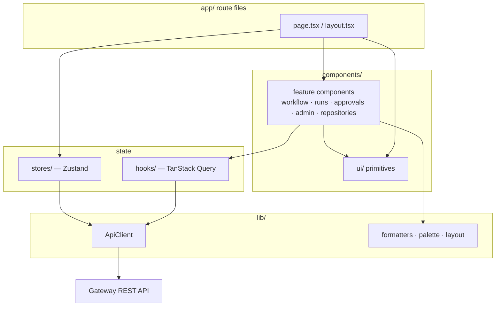

# Component Library and Client State

> Indexed at commit `147d054a` on 2026-09-30 · [view on GitHub](https://github.com/yorch/auto-swe/tree/147d054a)

## Relevant source files

- [packages/web/src/lib/api.ts](https://github.com/yorch/auto-swe/blob/147d054a/packages/web/src/lib/api.ts)
- [packages/web/src/lib/utils.ts](https://github.com/yorch/auto-swe/blob/147d054a/packages/web/src/lib/utils.ts)
- [packages/web/src/lib/palette.ts](https://github.com/yorch/auto-swe/blob/147d054a/packages/web/src/lib/palette.ts)
- [packages/web/src/lib/palette.test.ts](https://github.com/yorch/auto-swe/blob/147d054a/packages/web/src/lib/palette.test.ts)
- [packages/web/src/lib/themeClasses.test.ts](https://github.com/yorch/auto-swe/blob/147d054a/packages/web/src/lib/themeClasses.test.ts)
- [packages/web/src/lib/workflowLayout.ts](https://github.com/yorch/auto-swe/blob/147d054a/packages/web/src/lib/workflowLayout.ts)
- [packages/web/src/lib/networkErrors.ts](https://github.com/yorch/auto-swe/blob/147d054a/packages/web/src/lib/networkErrors.ts)
- [packages/web/src/lib/config.ts](https://github.com/yorch/auto-swe/blob/147d054a/packages/web/src/lib/config.ts)
- [packages/web/src/hooks/useListQuery.ts](https://github.com/yorch/auto-swe/blob/147d054a/packages/web/src/hooks/useListQuery.ts)
- [packages/web/src/hooks/useRuns.ts](https://github.com/yorch/auto-swe/blob/147d054a/packages/web/src/hooks/useRuns.ts)
- [packages/web/src/hooks/useApprovals.ts](https://github.com/yorch/auto-swe/blob/147d054a/packages/web/src/hooks/useApprovals.ts)
- [packages/web/src/hooks/useAdminConfig.ts](https://github.com/yorch/auto-swe/blob/147d054a/packages/web/src/hooks/useAdminConfig.ts)
- [packages/web/src/hooks/useGithubInstallations.ts](https://github.com/yorch/auto-swe/blob/147d054a/packages/web/src/hooks/useGithubInstallations.ts)
- [packages/web/src/hooks/useRepositories.ts](https://github.com/yorch/auto-swe/blob/147d054a/packages/web/src/hooks/useRepositories.ts)
- [packages/web/src/hooks/useTemporalUi.ts](https://github.com/yorch/auto-swe/blob/147d054a/packages/web/src/hooks/useTemporalUi.ts)
- [packages/web/src/hooks/useConfigForm.ts](https://github.com/yorch/auto-swe/blob/147d054a/packages/web/src/hooks/useConfigForm.ts)
- [packages/web/src/hooks/useIntegrationConfigForm.ts](https://github.com/yorch/auto-swe/blob/147d054a/packages/web/src/hooks/useIntegrationConfigForm.ts)
- [packages/web/src/hooks/useUserPreferences.ts](https://github.com/yorch/auto-swe/blob/147d054a/packages/web/src/hooks/useUserPreferences.ts)
- [packages/web/src/stores/authStore.ts](https://github.com/yorch/auto-swe/blob/147d054a/packages/web/src/stores/authStore.ts)
- [packages/web/src/stores/teamStore.ts](https://github.com/yorch/auto-swe/blob/147d054a/packages/web/src/stores/teamStore.ts)
- [packages/web/src/components/workflow/TemplateEditor.tsx](https://github.com/yorch/auto-swe/blob/147d054a/packages/web/src/components/workflow/TemplateEditor.tsx)
- [packages/web/src/components/workflow/WorkflowDag.tsx](https://github.com/yorch/auto-swe/blob/147d054a/packages/web/src/components/workflow/WorkflowDag.tsx)
- [packages/web/src/components/workflow/flowChrome.tsx](https://github.com/yorch/auto-swe/blob/147d054a/packages/web/src/components/workflow/flowChrome.tsx)
- [packages/web/src/components/workflow/nodeTypeTone.ts](https://github.com/yorch/auto-swe/blob/147d054a/packages/web/src/components/workflow/nodeTypeTone.ts)
- [packages/web/src/components/workflow/dagNode.tsx](https://github.com/yorch/auto-swe/blob/147d054a/packages/web/src/components/workflow/dagNode.tsx)
- [packages/web/src/components/workflow/specToFlow.ts](https://github.com/yorch/auto-swe/blob/147d054a/packages/web/src/components/workflow/specToFlow.ts)
- [packages/web/src/components/workflow/specEdits.ts](https://github.com/yorch/auto-swe/blob/147d054a/packages/web/src/components/workflow/specEdits.ts)
- [packages/web/src/components/workflow/NodeInspector.tsx](https://github.com/yorch/auto-swe/blob/147d054a/packages/web/src/components/workflow/NodeInspector.tsx)
- [packages/web/src/components/workflow/NodePalette.tsx](https://github.com/yorch/auto-swe/blob/147d054a/packages/web/src/components/workflow/NodePalette.tsx)
- [packages/web/src/components/runs/Rail.tsx](https://github.com/yorch/auto-swe/blob/147d054a/packages/web/src/components/runs/Rail.tsx)
- [packages/web/src/components/runs/RunMetaRail.tsx](https://github.com/yorch/auto-swe/blob/147d054a/packages/web/src/components/runs/RunMetaRail.tsx)
- [packages/web/src/components/ui/FieldWrapper.tsx](https://github.com/yorch/auto-swe/blob/147d054a/packages/web/src/components/ui/FieldWrapper.tsx)
- [packages/web/src/components/ui/QueryBoundary.tsx](https://github.com/yorch/auto-swe/blob/147d054a/packages/web/src/components/ui/QueryBoundary.tsx)
- [packages/web/src/components/ui/Modal.tsx](https://github.com/yorch/auto-swe/blob/147d054a/packages/web/src/components/ui/Modal.tsx)
- [packages/web/src/components/ui/Table.tsx](https://github.com/yorch/auto-swe/blob/147d054a/packages/web/src/components/ui/Table.tsx)
- [packages/web/src/components/ui/PageHeader.tsx](https://github.com/yorch/auto-swe/blob/147d054a/packages/web/src/components/ui/PageHeader.tsx)
- [packages/web/src/components/ui/SegmentedControl.tsx](https://github.com/yorch/auto-swe/blob/147d054a/packages/web/src/components/ui/SegmentedControl.tsx)
- [packages/web/src/components/layout/AppShell.tsx](https://github.com/yorch/auto-swe/blob/147d054a/packages/web/src/components/layout/AppShell.tsx)
- [packages/web/src/components/layout/AuthLayout.tsx](https://github.com/yorch/auto-swe/blob/147d054a/packages/web/src/components/layout/AuthLayout.tsx)
- [packages/web/src/components/Providers.tsx](https://github.com/yorch/auto-swe/blob/147d054a/packages/web/src/components/Providers.tsx)
- [packages/web/src/app/globals.css](https://github.com/yorch/auto-swe/blob/147d054a/packages/web/src/app/globals.css)

## Overview

The dashboard's shared front end sits in four directories under `packages/web/src`: `components/` holds the presentational library, `hooks/` holds the TanStack Query bindings for the gateway REST API, `stores/` holds the two Zustand stores, and `lib/` holds the fetch wrapper, formatters, design tokens and graph layout. Route files under `app/` compose these; they own no fetching or styling logic of their own.

The organising rule is that server data never lives in a store. Every remote read is a `useQuery` keyed by resource, every write is a `useMutation` that invalidates the keys it touched, and Zustand holds only the two facts that have no server representation: who is signed in, and which team the chrome is filtered to.

A second rule governs the presentation layer: a treatment that appears on more than one page is a primitive, not a class string. Headers, modal action rows, table headers, segmented choices, the run rail and the auth screens each have one component, and a source-reading test (see [Styling](#styling)) fails the build when a colour class names a token the theme does not define.

Sources: [packages/web/src/stores/teamStore.ts:L1-L11](https://github.com/yorch/auto-swe/blob/147d054a/packages/web/src/stores/teamStore.ts#L1-L11) [packages/web/src/lib/themeClasses.test.ts:L1-L53](https://github.com/yorch/auto-swe/blob/147d054a/packages/web/src/lib/themeClasses.test.ts#L1-L53)

## Architecture

```mermaid
flowchart TB
  subgraph rt["app/ route files"]
    page["page.tsx / layout.tsx"]
  end
  subgraph comp["components/"]
    ui["ui/ primitives"]
    feat["feature components<br/>workflow · runs · approvals · admin · repositories"]
  end
  subgraph st["state"]
    hooks["hooks/ — TanStack Query"]
    stores["stores/ — Zustand"]
  end
  subgraph libs["lib/"]
    apic["ApiClient"]
    fmt["formatters · palette · layout"]
  end
  gw["Gateway REST API"]

  page --> feat
  page --> ui
  feat --> ui
  feat --> hooks
  feat --> fmt
  page --> stores
  hooks --> apic
  stores --> apic
  apic --> gw
```

A feature component reads data through a hook and renders through the primitives; the primitives import nothing but `lib/utils` and one another. The `ApiClient` is the only module that calls the gateway's `/api/v1` surface from a hook, so bearer-token refresh and error shaping exist in exactly one place.

`AppShell` picks one of three frames per route. Chromeless routes (`/login`, `/reset-password`) render bare and take their ground from `AuthLayout`; the run detail and template diff pages render inside the chrome but with a full-height `<main>` that manages its own scrolling; every other route sits in a `max-w-[1280px]` column. The chromed branch is a separate `Chrome` component so that `useApprovalsStream` can mount only there, since a hook cannot sit behind the early return for chromeless routes ([AppShell.tsx#L15-L36](https://github.com/yorch/auto-swe/blob/147d054a/packages/web/src/components/layout/AppShell.tsx#L15-L36)).

Sources: [packages/web/src/components/Providers.tsx:L7-L27](https://github.com/yorch/auto-swe/blob/147d054a/packages/web/src/components/Providers.tsx#L7-L27) [packages/web/src/components/layout/AppShell.tsx:L1-L50](https://github.com/yorch/auto-swe/blob/147d054a/packages/web/src/components/layout/AppShell.tsx#L1-L50) [packages/web/src/components/layout/AuthLayout.tsx:L1-L67](https://github.com/yorch/auto-swe/blob/147d054a/packages/web/src/components/layout/AuthLayout.tsx#L1-L67) [packages/web/src/lib/api.ts:L1-L217](https://github.com/yorch/auto-swe/blob/147d054a/packages/web/src/lib/api.ts#L1-L217)

## Component Inventory

| Group | Path | Contents |
| ----- | ---- | -------- |
| Primitives | `components/ui/` | `Button` / `ButtonLink`, `Input`, `Select`, `Textarea`, `Checkbox`, `ToggleSwitch`, `FieldWrapper`, `SegmentedControl`, `TabBar`, `Modal` + `ModalFooter`, `ConfirmModal`, `Table` family (`THead`, `Th`, `TRow`, `Td`, `TableStatusRow`), `Card`, `Badge`, `StatusBadge`, `Stat`, `Alert`, `EmptyState`, `LoadingState`, `QueryBoundary`, `Pagination`, `CopyButton`, `PageHeader` + `SectionHeader`, `icons` |
| Chrome | `components/layout/` | `AppShell` grid, `Sidebar` navigation, `TopBar` with team selector and inbox badge, `AuthLayout` + `AuthHeading` for the sign-in screens |
| Workflow graph | `components/workflow/` | `WorkflowDag` viewer, `TemplateEditor`, `dagNode`, `flowChrome`, `nodeTypeTone`, `NodePalette`, `NodeInspector`, `inspectorSections`, `inspectorFields`, `specToFlow`, `specEdits`, `makeDefaultNode`, `dagKeyboardNav` |
| Workflow forms and chrome | `components/workflow/` | `InputSchemaBuilder`, `schemaForm`, `SchemaFormPreview`, `RunTemplateModal`, `NewRequestModal`, `RefineChatPanel`, `WorkflowDefaultsForm`, `ConsolidationForm`, `RevalidationForm`, `CanaryForm`, `scheduleControls`, `KeyValueRow`, `VersionTags`, `templateNav`, `starterTemplates` |
| Run detail | `components/runs/` | `Rail` (`RailSection`, `RailRow`), `RunMetaRail`, `RunOutcomeCard`, `FailureCard`, `EvalSignalsPanel`, `AutonomyDecisionsPanel` |
| Approvals | `components/approvals/` | `HumanStepCard`, `DiffRenderer` |
| Repositories | `components/repositories/` | `ConnectionFormModal`, `ImportFromGitHubModal`, `ShareRepoModal`, `MyCredentialModal`, `RepoDependenciesModal`, `RepoDependencySuggestions` |
| Admin | `components/integrations/`, `components/modelConfig/`, `components/settings/`, `components/security/`, `components/govern/` | Per-integration tabs, `ConfigField`, `SecretInput`, `SourceBadge`, `UrlRow`, `RestartWarning`, `IntegrationFormFooter` (+ `TestResultAlert`), `CredentialsTab`, `EmbeddingsTab`, `MidRunWarning`, `AccessTokensSection`, `SettingRow`, `SecurityEventList`, `OrgBudgetTable` |
| Governance | `components/teams/`, `components/users/`, `components/agents/`, `components/library/` | `TeamFormModal`, `AddMemberModal`, `AllowlistEditor` and its egress and shell wrappers, `TeamAgentLibrarySection`, `CreateUserModal`, `AgentEditorFields`, `AgentFormFields`, `EntityMetaBadges` |
| Charts | `components/charts/` | `chartChrome`, `colors`, `DailyCostChart`, `LessonsByTypeChart`, `LessonsOverTimeChart`, `WorkflowsOverTimeChart`, `WorkflowStatusChart` |
| Misc | `components/` | `Providers`, `ErrorBoundary`, `AppConfigScript`, `LayoutToggle`, `AuditLogTable`, `EligibleUserSelect`, `auth/RoleLayout`, `dashboard/DashboardOnboarding`, `docs/Markdown` |

The hooks directory follows the same one-file-per-resource-area rule: `useRuns`, `useTemplates`, `useRepositories`, `useTeams`, `useUsers`, `useApprovals`, `useAdmin`, `useAdminConfig`, `useConfigSettings`, `useModelConfig`, `useGithubInstallations`, `useTemporalUi` and a dozen smaller ones, plus the form and utility hooks described below.

Sources: [packages/web/src/components/ui/Table.tsx:L1-L110](https://github.com/yorch/auto-swe/blob/147d054a/packages/web/src/components/ui/Table.tsx#L1-L110) [packages/web/src/components/ui/QueryBoundary.tsx:L1-L43](https://github.com/yorch/auto-swe/blob/147d054a/packages/web/src/components/ui/QueryBoundary.tsx#L1-L43) [packages/web/src/components/ui/PageHeader.tsx:L1-L72](https://github.com/yorch/auto-swe/blob/147d054a/packages/web/src/components/ui/PageHeader.tsx#L1-L72)

## Shared Primitives and Conventions

Four conventions carry most of the consistency across pages.

- **One page header.** `PageHeader` takes a `chapter` kicker, a `title`, an optional `subtitle` and a right-aligned `actions` slot, and renders the only `<h1>` a route should own; `SectionHeader` is its `<h2>` counterpart with an optional ordinal and hint ([PageHeader.tsx#L3-L72](https://github.com/yorch/auto-swe/blob/147d054a/packages/web/src/components/ui/PageHeader.tsx#L3-L72)). Forty-five route files render it. The run detail page is the exception: it manages its own full-height layout and writes its own heading.
- **One modal action row.** `ModalFooter` is the row every modal ends with: a `ghost` Cancel beside a primary action, right-aligned. Without `onSubmit` the primary button is `type="submit"`, so a modal whose body is a `<form>` submits on Enter; with it, the button is a plain click target. Omitting `submitLabel` yields a read-only modal with a single `secondary` Close, because a lone ghost button reads as disabled ([Modal.tsx#L7-L58](https://github.com/yorch/auto-swe/blob/147d054a/packages/web/src/components/ui/Modal.tsx#L7-L58)).
- **Two ways to choose among a few things.** `TabBar` swaps a page's content section, and when its tabs carry an `href` they render as `next/link`s with `aria-current="page"`, so sub-pages stay linkable and prefetched ([TabBar.tsx#L11-L58](https://github.com/yorch/auto-swe/blob/147d054a/packages/web/src/components/ui/TabBar.tsx#L11-L58)). `SegmentedControl` is for a time range or view mode: a `<fieldset>` of toggle buttons carrying `aria-pressed`, so the selection is announced rather than conveyed by colour alone ([SegmentedControl.tsx#L10-L60](https://github.com/yorch/auto-swe/blob/147d054a/packages/web/src/components/ui/SegmentedControl.tsx#L10-L60)).
- **Shared feature chrome.** Where two or more features repeated the same markup it has been extracted next to them: `Rail` for the run detail's right-hand column, `IntegrationFormFooter` for the restart warning, outcome alert and submit button that end every integration tab, `scheduleControls` for the enabled toggle and "Run now" footer of the schedule forms, `VersionTags` and `templateNav` for template pages, `EntityMetaBadges` for scanner patterns and skills, and `AuthLayout` for the sign-in screens.

Sources: [packages/web/src/components/ui/PageHeader.tsx:L1-L72](https://github.com/yorch/auto-swe/blob/147d054a/packages/web/src/components/ui/PageHeader.tsx#L1-L72) [packages/web/src/components/ui/Modal.tsx:L1-L58](https://github.com/yorch/auto-swe/blob/147d054a/packages/web/src/components/ui/Modal.tsx#L1-L58) [packages/web/src/components/ui/TabBar.tsx:L1-L60](https://github.com/yorch/auto-swe/blob/147d054a/packages/web/src/components/ui/TabBar.tsx#L1-L60) [packages/web/src/components/ui/SegmentedControl.tsx:L1-L60](https://github.com/yorch/auto-swe/blob/147d054a/packages/web/src/components/ui/SegmentedControl.tsx#L1-L60)

## The Workflow Graph Renderer

`WorkflowDag` is the read-only viewer used by the template detail, diff and run pages. It wraps React Flow with a `FlowChrome` child (dotted background, minimap and zoom controls) and per-node multi-port handles, and it re-keys its memo on the serialized spec, statuses and diff markers rather than object identity so a 3-second poll that returns unchanged content does not tear down and rebuild every node ([WorkflowDag.tsx#L60-L75](https://github.com/yorch/auto-swe/blob/147d054a/packages/web/src/components/workflow/WorkflowDag.tsx#L60-L75)). Nodes are non-draggable and non-connectable here; a click selects a node and a second click on the same node clears the selection.

Positions come from `layoutSpec`, which delegates to dagre's network-simplex layered layout rather than a hand-rolled rank assignment; the file records that the previous BFS ranking flattened a 35-node workflow into a single strip ([workflowLayout.ts#L1-L13](https://github.com/yorch/auto-swe/blob/147d054a/packages/web/src/lib/workflowLayout.ts#L1-L13)). Which fields of which node types count as edges is not re-derived here: `collectEdges` calls `nodeEdges` from the shared spec module, the same function that backs schema ref validation and the interpreter's reachability analysis.

`specToFlow` translates that layout into React Flow arrays, colouring each edge by kind through `TOKEN` literals and building a descriptive `ariaLabel` per node. Its `subLabelFor` switch ends in a `never` assignment, so adding a node type to the spec without giving it a sublabel fails the build instead of silently rendering an unidentifiable card ([specToFlow.ts#L51-L94](https://github.com/yorch/auto-swe/blob/147d054a/packages/web/src/components/workflow/specToFlow.ts#L51-L94)). It also owns `FIT_VIEW_OPTIONS` (zoom clamped to 0.55 to 1.2). React Flow's `fitViewOptions` prop covers only the initial fit, while `<Controls>` takes its own options and defaults to the canvas `minZoom` of 0.15, at which a wide graph's labels are unreadable; `FlowChrome` therefore passes the same constant to both, so the toolbar's fit button no longer undoes the view the canvas opened with ([specToFlow.ts#L16-L23](https://github.com/yorch/auto-swe/blob/147d054a/packages/web/src/components/workflow/specToFlow.ts#L16-L23), [flowChrome.tsx#L14-L28](https://github.com/yorch/auto-swe/blob/147d054a/packages/web/src/components/workflow/flowChrome.tsx#L14-L28)).

`dagNode` draws one source handle per outgoing edge, with `handlePortsFor` expanding a `humanDecision` into one port per option; the comment records that exposing only `onTimeout` made React Flow silently drop every decision branch ([dagNode.tsx#L70-L101](https://github.com/yorch/auto-swe/blob/147d054a/packages/web/src/components/workflow/dagNode.tsx#L70-L101)). The left-stripe colour for each node type lives in `nodeTypeTone`, a `Record` over the node-type union shared by the canvas node and the palette swatch so the two cannot drift, written as full literal class strings so Tailwind's scanner sees each one ([nodeTypeTone.ts#L1-L24](https://github.com/yorch/auto-swe/blob/147d054a/packages/web/src/components/workflow/nodeTypeTone.ts#L1-L24)).

Theming React Flow is split across two files for a reason. Its stylesheet is imported by the canvas components after `globals.css`, so a property override in `globals.css` loses at equal specificity and the controls rendered white on the dark canvas. The overrides therefore set React Flow's own `--xy-controls-*` and `--xy-minimap-*` variables on `.react-flow`, and the properties that must be set inline (edge markers, the minimap mask, the dot background) take `TOKEN` literals ([globals.css#L335-L389](https://github.com/yorch/auto-swe/blob/147d054a/packages/web/src/app/globals.css#L335-L389), [flowChrome.tsx#L7-L28](https://github.com/yorch/auto-swe/blob/147d054a/packages/web/src/components/workflow/flowChrome.tsx#L7-L28)).

Sources: [packages/web/src/components/workflow/WorkflowDag.tsx:L1-L193](https://github.com/yorch/auto-swe/blob/147d054a/packages/web/src/components/workflow/WorkflowDag.tsx#L1-L193) [packages/web/src/lib/workflowLayout.ts:L1-L157](https://github.com/yorch/auto-swe/blob/147d054a/packages/web/src/lib/workflowLayout.ts#L1-L157) [packages/web/src/components/workflow/specToFlow.ts:L1-L176](https://github.com/yorch/auto-swe/blob/147d054a/packages/web/src/components/workflow/specToFlow.ts#L1-L176) [packages/web/src/components/workflow/dagNode.tsx:L1-L274](https://github.com/yorch/auto-swe/blob/147d054a/packages/web/src/components/workflow/dagNode.tsx#L1-L274) [packages/web/src/components/workflow/flowChrome.tsx:L1-L29](https://github.com/yorch/auto-swe/blob/147d054a/packages/web/src/components/workflow/flowChrome.tsx#L1-L29)

## The Template Editor

`TemplateEditor` adds authoring to the same canvas: a `NodePalette` rail on the left, drag-to-create and drag-to-connect on the canvas, and a `NodeInspector` rail on the right. It renders the same `FlowChrome` and `FIT_VIEW_OPTIONS` as the viewer, with nodes draggable and connectable and `Delete` bound to node removal. The `spec` prop is the single source of truth and every edit emits through `onChange`; the parent owns validation, saving and version management. Node positions are session-local and are never written into the spec ([TemplateEditor.tsx#L1-L16](https://github.com/yorch/auto-swe/blob/147d054a/packages/web/src/components/workflow/TemplateEditor.tsx#L1-L16)).

Palette items carry a Zod-validated payload on a private MIME type, so a drop from anything else is ignored ([NodePalette.tsx#L16-L26](https://github.com/yorch/auto-swe/blob/147d054a/packages/web/src/components/workflow/NodePalette.tsx#L16-L26)). The primitive table is a `Record` over the node-type union rather than an array, because as an array it once omitted `eval` entirely and there was no way to create that node from the editor ([NodePalette.tsx#L41-L52](https://github.com/yorch/auto-swe/blob/147d054a/packages/web/src/components/workflow/NodePalette.tsx#L41-L52)). Primitives are grouped Execution, Control flow, Human-in-loop and Advanced.

Structural edits live in `specEdits`, and its central problem is that most edge fields are schema-required. Deleting a node that a `cond` branches to cannot simply clear the field, because the resulting node fails `parseWorkflowSpec` and the user sees a schema error about a node they never touched. Instead a required edge is retargeted to a shared `terminate` placeholder named `unresolved_branch`, created on demand and reused, so the delete succeeds and every orphaned branch is drawn into one obvious node ([specEdits.ts#L15-L36](https://github.com/yorch/auto-swe/blob/147d054a/packages/web/src/components/workflow/specEdits.ts#L15-L36)). Whether a field is required is asked of `NodeSchema` by trial-clearing it rather than read from a table, since a table is what drifts ([specEdits.ts#L51-L65](https://github.com/yorch/auto-swe/blob/147d054a/packages/web/src/components/workflow/specEdits.ts#L51-L65)).

`NodeInspector` dispatches per node type to the ten sections in `inspectorSections`, offers dropdowns for each outgoing edge alongside the canvas drag, and exposes a raw-JSON escape hatch. Its `HAS_CONFIG_SECTION` map is a `Record` over the node-type union so a new type is a compile error rather than an inspector with no fields; `eval` and the four `human*` types map to `false` and render a pointer to JSON mode instead of blank space ([NodeInspector.tsx#L58-L82](https://github.com/yorch/auto-swe/blob/147d054a/packages/web/src/components/workflow/NodeInspector.tsx#L58-L82)).

Sources: [packages/web/src/components/workflow/TemplateEditor.tsx:L1-L450](https://github.com/yorch/auto-swe/blob/147d054a/packages/web/src/components/workflow/TemplateEditor.tsx#L1-L450) [packages/web/src/components/workflow/specEdits.ts:L1-L170](https://github.com/yorch/auto-swe/blob/147d054a/packages/web/src/components/workflow/specEdits.ts#L1-L170) [packages/web/src/components/workflow/NodeInspector.tsx:L1-L294](https://github.com/yorch/auto-swe/blob/147d054a/packages/web/src/components/workflow/NodeInspector.tsx#L1-L294) [packages/web/src/components/workflow/NodePalette.tsx:L1-L330](https://github.com/yorch/auto-swe/blob/147d054a/packages/web/src/components/workflow/NodePalette.tsx#L1-L330)

## Run Detail Components

The run detail route composes its trace viewer itself; the reusable parts live in `components/runs/`. `Rail` supplies the two layout atoms of the right-hand column: `RailSection` (a hairline divider, an ember kicker, then content) and `RailRow` (a label/value line with the rail's row divider) ([Rail.tsx#L8-L42](https://github.com/yorch/auto-swe/blob/147d054a/packages/web/src/components/runs/Rail.tsx#L8-L42)). `RunMetaRail` assembles a fixed 270px aside from them (start, end, duration, a Temporal deep link for the workflow id, trace-event count, cost, token totals and a link to the template, all through the locale-aware formatters in `lib/utils`), then mounts the request block, the eval and autonomy panels, the outcome card and, when a step failed, the failure card ([RunMetaRail.tsx#L43-L167](https://github.com/yorch/auto-swe/blob/147d054a/packages/web/src/components/runs/RunMetaRail.tsx#L43-L167)).

The Temporal link comes from `useTemporalWorkflowUrl`, which reads the configured UI base only after mount because the runtime value lives on `window.__APP_CONFIG__`, which does not exist during SSR; reading it during render would hydrate a different `href` than the server sent. With no UI configured the workflow id renders as plain text ([useTemporalUi.ts#L6-L31](https://github.com/yorch/auto-swe/blob/147d054a/packages/web/src/hooks/useTemporalUi.ts#L6-L31)).

`FailureCard` classifies a failed step's error string into a timeout, cancellation or generic activity failure and attaches a suggested fix for the timeout case ([FailureCard.tsx#L17-L47](https://github.com/yorch/auto-swe/blob/147d054a/packages/web/src/components/runs/FailureCard.tsx#L17-L47)). `RunOutcomeCard` renders links out of a run's result payload and validates every URL against an http/https allowlist (`isSafeWebUrl`) before rendering it as an anchor ([RunOutcomeCard.tsx#L25-L33](https://github.com/yorch/auto-swe/blob/147d054a/packages/web/src/components/runs/RunOutcomeCard.tsx#L25-L33)).

`EvalSignalsPanel` and `AutonomyDecisionsPanel` each own their own query and render nothing when empty, so a page can mount them unconditionally; on a failed query they render a `RailSection` with an error `Alert` rather than disappearing, so a 403 is not mistaken for "no decisions" ([AutonomyDecisionsPanel.tsx#L27-L50](https://github.com/yorch/auto-swe/blob/147d054a/packages/web/src/components/runs/AutonomyDecisionsPanel.tsx#L27-L50)). Approval work uses `HumanStepCard`, which renders the four human-step kinds and posts responses through `useRespondToApproval`, with `DiffRenderer` colouring unified-diff payloads inline.

What the run viewer fetches is decided in `useRuns`, covered under Data Fetching: the trimmed trace view is polled while a run is live, and the full, untrimmed payloads are a separate cache entry fetched once.

Sources: [packages/web/src/components/runs/Rail.tsx:L1-L42](https://github.com/yorch/auto-swe/blob/147d054a/packages/web/src/components/runs/Rail.tsx#L1-L42) [packages/web/src/components/runs/RunMetaRail.tsx:L1-L167](https://github.com/yorch/auto-swe/blob/147d054a/packages/web/src/components/runs/RunMetaRail.tsx#L1-L167) [packages/web/src/components/runs/FailureCard.tsx:L1-L112](https://github.com/yorch/auto-swe/blob/147d054a/packages/web/src/components/runs/FailureCard.tsx#L1-L112) [packages/web/src/components/runs/EvalSignalsPanel.tsx:L1-L58](https://github.com/yorch/auto-swe/blob/147d054a/packages/web/src/components/runs/EvalSignalsPanel.tsx#L1-L58) [packages/web/src/hooks/useTemporalUi.ts:L1-L31](https://github.com/yorch/auto-swe/blob/147d054a/packages/web/src/hooks/useTemporalUi.ts#L1-L31)

## Reused Form and Table Abstractions

Four abstractions carry most of the repetition out of the pages.

- **`FieldWrapper`** owns the label, hint and error markup for `Input`, `Select` and `Textarea`, and exports `fieldDescribedBy` so all three compute the same `aria-describedby` value from the same ids ([FieldWrapper.tsx#L11-L29](https://github.com/yorch/auto-swe/blob/147d054a/packages/web/src/components/ui/FieldWrapper.tsx#L11-L29)). `Checkbox` is the standalone counterpart for choices inside a form: a `<label>` wrapping the native input, so the pair is associated without an id ([Checkbox.tsx#L15-L35](https://github.com/yorch/auto-swe/blob/147d054a/packages/web/src/components/ui/Checkbox.tsx#L15-L35)).
- **`QueryBoundary`** renders the loading, error and settled states of a list query, with a `compact` mode for a section inside a card. Pages that checked only `isLoading` rendered their empty state on a 403 or 500, since `data` is merely undefined then ([QueryBoundary.tsx#L19-L43](https://github.com/yorch/auto-swe/blob/147d054a/packages/web/src/components/ui/QueryBoundary.tsx#L19-L43)).
- **`Table`** exposes `THead`, `Th`, `TRow` and `Td` with four named header treatments (`mono`, `plain`, `compact`, `dense`), so density is a variant rather than a per-page class string. `TableStatusRow` is a full-width body row for a loading, empty or error state so the header stays in place while the body explains itself ([Table.tsx#L24-L90](https://github.com/yorch/auto-swe/blob/147d054a/packages/web/src/components/ui/Table.tsx#L24-L90)).
- **`Modal`** portals a native `<dialog>` to `document.body`, because callers frequently own a modal from inside a table row and a `<dialog>` under `<tbody>` is invalid HTML that React reports as a hydration error ([Modal.tsx#L60-L117](https://github.com/yorch/auto-swe/blob/147d054a/packages/web/src/components/ui/Modal.tsx#L60-L117)). Every modal dismisses the same three ways: Escape (native), the header's close button, and a backdrop click. The backdrop path only closes when the press also started on the backdrop, so a text selection dragged out of an input and released outside the content does not discard the form ([Modal.tsx#L107-L132](https://github.com/yorch/auto-swe/blob/147d054a/packages/web/src/components/ui/Modal.tsx#L107-L132)); `Modal.test.tsx` pins each case, including that the close button fires `onClose` once. `ConfirmModal` builds on it and `ModalFooter`, holding the dialog open while an async `onConfirm` settles and showing a rejection inline instead of closing ([ConfirmModal.tsx#L14-L80](https://github.com/yorch/auto-swe/blob/147d054a/packages/web/src/components/ui/ConfirmModal.tsx#L14-L80)).

Two form hooks complete the set. `useConfigForm` runs the load-query-then-seed-then-submit cycle for the workflow config forms, seeding from query data exactly once via a ref so a background refetch cannot clobber an admin's in-progress edits ([useConfigForm.ts#L44-L55](https://github.com/yorch/auto-swe/blob/147d054a/packages/web/src/hooks/useConfigForm.ts#L44-L55)). `useIntegrationConfigForm` covers the integration tabs instead, which are write-only for secrets: the read returns masked values, so inputs stay caller-owned with blank meaning "keep current", and the hook factors out only the save/test lifecycle and the `requiresRestart` flag ([useIntegrationConfigForm.ts#L44-L53](https://github.com/yorch/auto-swe/blob/147d054a/packages/web/src/hooks/useIntegrationConfigForm.ts#L44-L53)).

Sources: [packages/web/src/components/ui/FieldWrapper.tsx:L1-L58](https://github.com/yorch/auto-swe/blob/147d054a/packages/web/src/components/ui/FieldWrapper.tsx#L1-L58) [packages/web/src/components/ui/Modal.tsx:L1-L162](https://github.com/yorch/auto-swe/blob/147d054a/packages/web/src/components/ui/Modal.tsx#L1-L162) [packages/web/src/components/ui/ConfirmModal.tsx:L1-L80](https://github.com/yorch/auto-swe/blob/147d054a/packages/web/src/components/ui/ConfirmModal.tsx#L1-L80) [packages/web/src/hooks/useConfigForm.ts:L1-L74](https://github.com/yorch/auto-swe/blob/147d054a/packages/web/src/hooks/useConfigForm.ts#L1-L74) [packages/web/src/hooks/useIntegrationConfigForm.ts:L1-L92](https://github.com/yorch/auto-swe/blob/147d054a/packages/web/src/hooks/useIntegrationConfigForm.ts#L1-L92)

## Data Fetching

`Providers` creates one `QueryClient` with a 30-second `staleTime` and a single retry, and triggers the auth probe on mount ([Providers.tsx#L7-L26](https://github.com/yorch/auto-swe/blob/147d054a/packages/web/src/components/Providers.tsx#L7-L26)). Every remote read goes through a hook in `hooks/`, one file per resource area, exporting query hooks and the mutations that invalidate them.

Query keys are arrays whose first element names the resource, plural for a collection and singular for one entity, with the identifying arguments appended: `['workflows', opts]`, `['workflow', id]`, `['workflow-runs', filters]`, `['workflow-templates', teamId]`, `['workflow-template-version', id, version]`. A run detail is `['workflow-run', id, includeTraces, fullTraces]`, so the trimmed and untrimmed views are distinct cache entries. Nesting a literal segment marks a scoped variant, as in `['workflow-runs', 'by-work-request', workRequestId]`. A mutation invalidates every key its write can affect, and invalidating a shorter prefix covers the longer keys beneath it: cancelling a run invalidates the run, the run list and the workflow list ([useRuns.ts#L139-L149](https://github.com/yorch/auto-swe/blob/147d054a/packages/web/src/hooks/useRuns.ts#L139-L149)). Repository sharing and per-user credentials follow the same pattern: `useSetRepoShares` invalidates `['repositories']`, and the signed-in user's own credentials sit under `['my-repo-credentials']` ([useRepositories.ts#L84-L154](https://github.com/yorch/auto-swe/blob/147d054a/packages/web/src/hooks/useRepositories.ts#L84-L154)). GitHub App installations use a single module-level key constant for the list and all three mutations ([useGithubInstallations.ts#L37-L71](https://github.com/yorch/auto-swe/blob/147d054a/packages/web/src/hooks/useGithubInstallations.ts#L37-L71)).

The admin config hooks go further and derive both the path and the key from one slug, through the `sourcedConfigQuery`, `unwrappedConfigQuery` and `configMutation` factories. `configPath` yields `/api/v1/platform/config/<slug>` and `configKey` yields `admin-config-<slug>` (with `oauth/google` flattened to `oauth-google`). Deriving both from the same string is what keeps a resource from reading one cache entry and invalidating another; the two GET shapes exist because integration configs return `{ data, sources }` so each field can be badged as database- or environment-sourced, while schedule and tuning configs unwrap to `data` alone ([useAdminConfig.ts#L30-L70](https://github.com/yorch/auto-swe/blob/147d054a/packages/web/src/hooks/useAdminConfig.ts#L30-L70)).

The run viewer's two modes are encoded in `useWorkflowRun`. By default it fetches the trimmed trace view (`?includeTraces=true`) and polls every 3 seconds while the run is `RUNNING` and every 30 seconds once it is not. With `fullTraces` it fetches the server's untrimmed payloads exactly once and never polls, because full prompts run to tens of kilobytes each and re-downloading them every few seconds is the cost the trim exists to avoid. `placeholderData` keeps the previous data on screen while switching modes, but only for the same run id, so navigating between runs never flashes the previous one ([useRuns.ts#L33-L59](https://github.com/yorch/auto-swe/blob/147d054a/packages/web/src/hooks/useRuns.ts#L33-L59)); `useRuns.test.tsx` asserts both intervals.

Freshness is mostly polling. Run and workflow lists refetch every 10 seconds, a single workflow every 5, per-run eval and autonomy panels every 10, and admin lists every 30. The template-generation job polls at 1.5 seconds until it reaches a terminal state and then stops ([useTemplates.ts#L112-L122](https://github.com/yorch/auto-swe/blob/147d054a/packages/web/src/hooks/useTemplates.ts#L112-L122)). The approvals inbox is the one live-refresh surface and the only `EventSource` in the dashboard: `useApprovalsStream` is mounted once in `Chrome` and invalidates the `['approvals']` keys on a `change` event, with the 30-second poll on pending approvals kept as a fallback. Mounting it in the shell replaced three long-lived connections per page, one per consumer of `useApprovals` ([useApprovals.ts#L44-L65](https://github.com/yorch/auto-swe/blob/147d054a/packages/web/src/hooks/useApprovals.ts#L44-L65)).

Paginated lists share `useListQuery`, which returns rows as `data` and the pagination block as `meta`; a hook that unwrapped `data` alone dropped the total and made every page report its own length as the row count ([useListQuery.ts#L35-L49](https://github.com/yorch/auto-swe/blob/147d054a/packages/web/src/hooks/useListQuery.ts#L35-L49)). Only `useUserPreferences` updates optimistically, snapshotting the previous value in `onMutate`, restoring it in `onError` and reconciling in `onSettled` ([useUserPreferences.ts#L40-L57](https://github.com/yorch/auto-swe/blob/147d054a/packages/web/src/hooks/useUserPreferences.ts#L40-L57)).

Sources: [packages/web/src/hooks/useRuns.ts:L1-L161](https://github.com/yorch/auto-swe/blob/147d054a/packages/web/src/hooks/useRuns.ts#L1-L161) [packages/web/src/hooks/useApprovals.ts:L1-L83](https://github.com/yorch/auto-swe/blob/147d054a/packages/web/src/hooks/useApprovals.ts#L1-L83) [packages/web/src/hooks/useAdminConfig.ts:L1-L120](https://github.com/yorch/auto-swe/blob/147d054a/packages/web/src/hooks/useAdminConfig.ts#L1-L120) [packages/web/src/hooks/useRepositories.ts:L59-L168](https://github.com/yorch/auto-swe/blob/147d054a/packages/web/src/hooks/useRepositories.ts#L59-L168) [packages/web/src/hooks/useListQuery.ts:L1-L49](https://github.com/yorch/auto-swe/blob/147d054a/packages/web/src/hooks/useListQuery.ts#L1-L49) [packages/web/src/hooks/useUserPreferences.ts:L1-L63](https://github.com/yorch/auto-swe/blob/147d054a/packages/web/src/hooks/useUserPreferences.ts#L1-L63)

## The API Client

`ApiClient` is a class with one instance exported as `api`. It holds the bearer token in memory, mirrors it into a middleware-visible cookie, and sends `credentials: 'include'` on every request so the gateway can authenticate from either the `Authorization` header or the better-auth session cookie without per-call branching ([api.ts#L61-L71](https://github.com/yorch/auto-swe/blob/147d054a/packages/web/src/lib/api.ts#L61-L71)).

Four behaviours are worth naming. A `Content-Type` header is attached only when a body exists, because Fastify rejects a JSON content type with an empty body and that made every dashboard `DELETE` fail against the real gateway ([api.ts#L50-L59](https://github.com/yorch/auto-swe/blob/147d054a/packages/web/src/lib/api.ts#L50-L59)). A 401 on a request that carried a token triggers one refresh through the session-token bridge and one retry, and a second 401 expires the session; a 401 without a token, such as a wrong password, surfaces as a normal error rather than a redirect loop ([api.ts#L82-L107](https://github.com/yorch/auto-swe/blob/147d054a/packages/web/src/lib/api.ts#L82-L107)). Concurrent refreshes share one promise, and a generation counter discards a refresh whose token was superseded by a logout or a fresh login mid-flight ([api.ts#L150-L194](https://github.com/yorch/auto-swe/blob/147d054a/packages/web/src/lib/api.ts#L150-L194)). A `204` or zero-length response resolves to `undefined` instead of throwing on `.json()`, which would reject a mutation after the server had already applied it and skip the caller's invalidation ([api.ts#L116-L127](https://github.com/yorch/auto-swe/blob/147d054a/packages/web/src/lib/api.ts#L116-L127)).

Errors are unwrapped from the gateway's `{ error: { message } }` envelope, falling back to `HTTP <status>`. A network-level failure is separated from an HTTP error by `isNetworkError`, which matches the `TypeError` messages Chrome, Firefox and Safari produce, and is rewrapped by `gatewayUnreachableMessage` into copy naming the actual API base URL and the CORS setting to check ([networkErrors.ts#L1-L32](https://github.com/yorch/auto-swe/blob/147d054a/packages/web/src/lib/networkErrors.ts#L1-L32)). Component-level `catch` blocks narrow the unknown through `errMsg`, and the shared surfaces that display a failure (`QueryBoundary`, `ConfirmModal`, the run-rail panels) all route it through the same helper.

Sources: [packages/web/src/lib/api.ts:L1-L217](https://github.com/yorch/auto-swe/blob/147d054a/packages/web/src/lib/api.ts#L1-L217) [packages/web/src/lib/networkErrors.ts:L1-L50](https://github.com/yorch/auto-swe/blob/147d054a/packages/web/src/lib/networkErrors.ts#L1-L50) [packages/web/src/lib/errors.ts:L1-L12](https://github.com/yorch/auto-swe/blob/147d054a/packages/web/src/lib/errors.ts#L1-L12) [packages/web/src/lib/config.ts:L1-L34](https://github.com/yorch/auto-swe/blob/147d054a/packages/web/src/lib/config.ts#L1-L34)

## Client State

Two Zustand stores exist, `authStore` and `teamStore`, and both hold state the server has no per-request representation of.

| Store | Holds | Why it is client state |
| ----- | ----- | ---------------------- |
| `useAuthStore` | The signed-in user, an `isAuthenticated` flag, and the sign-in, sign-out, social-link, magic-link and password-reset actions | The gateway's session lives in a cookie on its own origin. The dashboard needs a synchronous answer to "who is signed in" for chrome, role gating and redirects, before and between queries |
| `useTeamStore` | `selectedTeamId` | A view filter applied across the top bar, the library page and the new-request modal. It is a UI preference with no server row and no URL segment |

`useAuthStore` is where the auth flows live rather than a hook, because they are imperative and cross-cutting: `login` posts to better-auth, probes the resulting session and mints a bearer, while `signInWithProvider` and `linkProvider` post to the OAuth endpoints and navigate the browser to the returned URL, since better-auth answers with JSON rather than a 302 ([authStore.ts#L254-L292](https://github.com/yorch/auto-swe/blob/147d054a/packages/web/src/stores/authStore.ts#L254-L292)).

The session probe returns a three-valued result and this distinction is load-bearing. Only `anonymous`, meaning a 401 or 403 or a 2xx with no user, may clear the local auth cookies. A network failure, a 429 or a 5xx returns `unknown` and says nothing about whether the session is still valid, so a transient gateway hiccup must not sign the user out ([authStore.ts#L167-L240](https://github.com/yorch/auto-swe/blob/147d054a/packages/web/src/stores/authStore.ts#L167-L240)). Session responses are parsed with Zod before being trusted, and the cookie names shared with the Next.js proxy middleware are centralised in `lib/config.ts` so a rename cannot silently break auth in one of the three places that read them.

Everything else that looks like state is either query cache or component-local. `useTransientFlag` backs the "saved" and "copied" confirmations, clearing its timer on unmount and on re-trigger so a dismissed modal cannot set state on an unmounted component ([useTransientFlag.ts#L5-L38](https://github.com/yorch/auto-swe/blob/147d054a/packages/web/src/hooks/useTransientFlag.ts#L5-L38)). The one durable per-user preference, the run detail layout, is stored on the server rather than in a store, and its union type lives in `@auto-swe/shared` so the gateway schema, the toggle and the hook cannot disagree.

Sources: [packages/web/src/stores/authStore.ts:L1-L344](https://github.com/yorch/auto-swe/blob/147d054a/packages/web/src/stores/authStore.ts#L1-L344) [packages/web/src/stores/teamStore.ts:L1-L11](https://github.com/yorch/auto-swe/blob/147d054a/packages/web/src/stores/teamStore.ts#L1-L11) [packages/web/src/hooks/useTransientFlag.ts:L1-L39](https://github.com/yorch/auto-swe/blob/147d054a/packages/web/src/hooks/useTransientFlag.ts#L1-L39) [packages/web/src/components/layout/TopBar.tsx:L60-L80](https://github.com/yorch/auto-swe/blob/147d054a/packages/web/src/components/layout/TopBar.tsx#L60-L80)

## Styling

Tailwind CSS 4 is configured entirely in `app/globals.css` — there is no `tailwind.config`. The file imports `tailwindcss`, declares two explicit `@source` globs so the scanner picks up the app and components trees regardless of the monorepo working directory, and defines the design tokens in an `@theme` block ([globals.css#L1-L20](https://github.com/yorch/auto-swe/blob/147d054a/packages/web/src/app/globals.css#L1-L20)). PostCSS loads `@tailwindcss/postcss` from `postcss.config.mjs`.

The palette is a single dark theme: an eight-step `ink` surface ramp, a seven-step `paper` text scale, a violet `ember` accent, and five status hues named `moss`, `amber`, `brick`, `dust` and `violet`. Type is three families — Inter for display and body, IBM Plex Mono for labels and numerals. A `@layer base` block keeps legacy semantic aliases such as `--background` pointing at the ramp, and a `@layer utilities` block defines the recurring treatments: `kicker` for the mono small-caps section labels, `label-mono` for field labels, `num` and `tabular` for tabular numerals, and `pulse-dot` for live-status indicators.

Two surfaces cannot use CSS custom properties. Recharts passes `tick={{ fill }}` straight onto an SVG `<text>` as a presentation attribute, and React Flow does the same with an edge marker's colour, and presentation attributes do not resolve `var()`. Rather than inline hex per call site, `lib/palette.ts` holds one copy of the affected tokens as 17 literals, plus a `TOKEN_CSS_VAR` map naming the custom property each mirrors, and `palette.test.ts` parses `globals.css` and fails if any entry stops matching ([palette.ts#L1-L54](https://github.com/yorch/auto-swe/blob/147d054a/packages/web/src/lib/palette.ts#L1-L54)). Chart colours in `components/charts/colors.ts` and axis chrome in `chartChrome.tsx` both draw from that one copy, and `STATUS_CHART_COLORS` mirrors the text colour of each `STATUS_META` entry so a pie slice matches the `StatusBadge` beside it. Status pill styling is centralised in `STATUS_META` in `lib/utils.ts`, keyed by every status enum the API returns.

Two further source-reading tests guard against a class of silent failure: a colour class that compiles to nothing. `palette.test.ts` also fails on any default Tailwind colour scale (`gray`, `red`, `indigo`, and so on) in a component, since a default-scale class is valid Tailwind and renders light-theme colours on a dark ground. `themeClasses.test.ts` fails on any `family-shade` utility that `@theme` does not declare: the status families define only the 400 and 600 shades, so `bg-brick-900` or `text-moss-300` emit no rule and render as bare, uncoloured pills, and `amber` and `violet` are worse, because Tailwind's defaults fill their other shades and `violet-300` would render purple beside a theme `violet-400` that is teal ([themeClasses.test.ts#L3-L53](https://github.com/yorch/auto-swe/blob/147d054a/packages/web/src/lib/themeClasses.test.ts#L3-L53)).

Sources: [packages/web/src/app/globals.css:L1-L389](https://github.com/yorch/auto-swe/blob/147d054a/packages/web/src/app/globals.css#L1-L389) [packages/web/src/lib/palette.ts:L1-L54](https://github.com/yorch/auto-swe/blob/147d054a/packages/web/src/lib/palette.ts#L1-L54) [packages/web/src/lib/palette.test.ts:L1-L80](https://github.com/yorch/auto-swe/blob/147d054a/packages/web/src/lib/palette.test.ts#L1-L80) [packages/web/src/components/charts/colors.ts:L1-L25](https://github.com/yorch/auto-swe/blob/147d054a/packages/web/src/components/charts/colors.ts#L1-L25) [packages/web/src/lib/utils.ts:L214-L237](https://github.com/yorch/auto-swe/blob/147d054a/packages/web/src/lib/utils.ts#L214-L237)

## Accessibility

The graph canvas carries the most deliberate work. `dagKeyboardNav` holds the traversal logic as pure functions over node and edge lists, free of React Flow runtime imports so it is unit-testable without a canvas ([dagKeyboardNav.ts#L1-L8](https://github.com/yorch/auto-swe/blob/147d054a/packages/web/src/components/workflow/dagKeyboardNav.ts#L1-L8)). Arrow keys walk edges, `Home` jumps to the entry node (the one with no incoming edges, topmost when several) and `Enter` opens the anchored node in the inspector. Candidate targets are ordered by vertical position then id, so traversal across a multi-output `cond` or `fanOut` is deterministic ([dagKeyboardNav.ts#L16-L40](https://github.com/yorch/auto-swe/blob/147d054a/packages/web/src/components/workflow/dagKeyboardNav.ts#L16-L40)).

Both canvases use `role="application"` with an instructional `aria-label`, chosen so arrow keys deliver raw key events instead of the roving-tabindex behaviour a list role would impose ([WorkflowDag.tsx#L150-L162](https://github.com/yorch/auto-swe/blob/147d054a/packages/web/src/components/workflow/WorkflowDag.tsx#L150-L162)). Each node gets a descriptive `ariaLabel` built by `specToFlow` announcing type, id, sublabel and status, and `globals.css` draws a visible focus ring on the React Flow node wrapper so keyboard traversal is visible before selection lands. The viewer treats `Enter` and `Space` alike. In the editor the handler is attached in the capture phase so it preempts React Flow's native arrow-key nudge, skips events from inputs, textareas and selects, and opens a node on `Enter` only when a node holds focus so `Enter` on a Controls button still works; `Space` is left to React Flow as its pan-activation key ([TemplateEditor.tsx#L285-L338](https://github.com/yorch/auto-swe/blob/147d054a/packages/web/src/components/workflow/TemplateEditor.tsx#L285-L338)).

Elsewhere the affordances are conventional but now centralised in primitives. Form controls get `aria-describedby` and `aria-invalid` from `FieldWrapper`'s shared helper; `Modal` derives `aria-labelledby` from its own title so callers cannot forget it, and its close button carries `aria-label="Close"`; `ToggleSwitch` renders `role="switch"` with `aria-checked`; `SegmentedControl` options carry `aria-pressed` inside a labelled `<fieldset>`; `TabBar` links carry `aria-current="page"`; `Alert` is `role="alert"` for errors and `role="status"` for success and warning, which is the dashboard's one live-region mechanism; decorative dots and inline icons are `aria-hidden`. Palette items are the one deliberate role override: a `
` with `aria-roledescription="draggable palette item"` that also activates on `Enter` and `Space`, because `<button draggable>` does not fire drag events reliably across browsers, and the file carries a Biome suppression recording why ([NodePalette.tsx#L294-L325](https://github.com/yorch/auto-swe/blob/147d054a/packages/web/src/components/workflow/NodePalette.tsx#L294-L325)).

Sources: [packages/web/src/components/workflow/dagKeyboardNav.ts:L1-L67](https://github.com/yorch/auto-swe/blob/147d054a/packages/web/src/components/workflow/dagKeyboardNav.ts#L1-L67) [packages/web/src/components/workflow/WorkflowDag.tsx:L96-L162](https://github.com/yorch/auto-swe/blob/147d054a/packages/web/src/components/workflow/WorkflowDag.tsx#L96-L162) [packages/web/src/components/ui/FieldWrapper.tsx:L11-L58](https://github.com/yorch/auto-swe/blob/147d054a/packages/web/src/components/ui/FieldWrapper.tsx#L11-L58) [packages/web/src/components/ui/Alert.tsx:L19-L53](https://github.com/yorch/auto-swe/blob/147d054a/packages/web/src/components/ui/Alert.tsx#L19-L53) [packages/web/src/components/ui/ToggleSwitch.tsx:L1-L46](https://github.com/yorch/auto-swe/blob/147d054a/packages/web/src/components/ui/ToggleSwitch.tsx#L1-L46)

## Limitations

- There is no design-system documentation page or component playground; the primitives are discovered by reading `components/ui/`.
- The dashboard ships a single dark theme. There is no light mode and no `prefers-color-scheme` handling, and `globals.css` defines no `prefers-reduced-motion` override for the animated utilities.
- Accessibility coverage is uneven. The graph canvases and the form primitives are deliberately handled; most list pages and tabs rely on native semantics alone, the app has no skip link, and the only live regions are the `role` attributes on `Alert`, so a status change that does not render an `Alert` is not announced.
- `ErrorBoundary` logs to the console because the app has no client-side error sink, so a render crash in a user's browser is not reported anywhere the team can see ([ErrorBoundary.tsx#L24-L32](https://github.com/yorch/auto-swe/blob/147d054a/packages/web/src/components/ErrorBoundary.tsx#L24-L32)).
- Live refresh is polling everywhere except the approvals inbox, so a long-open dashboard issues steady background traffic and a run's status can lag by up to its poll interval.
- The full, untrimmed trace payloads are fetched once and never refreshed, so a run still in progress shows stale full payloads until the viewer switches back to the trimmed view.
- Editor node positions are session-local and are not persisted with the spec, so a hand-arranged graph reverts to the dagre layout on reload.

Sources: [packages/web/src/app/globals.css:L160-L389](https://github.com/yorch/auto-swe/blob/147d054a/packages/web/src/app/globals.css#L160-L389) [packages/web/src/components/ErrorBoundary.tsx:L1-L57](https://github.com/yorch/auto-swe/blob/147d054a/packages/web/src/components/ErrorBoundary.tsx#L1-L57) [packages/web/src/hooks/useRuns.ts:L33-L59](https://github.com/yorch/auto-swe/blob/147d054a/packages/web/src/hooks/useRuns.ts#L33-L59) [packages/web/src/components/workflow/TemplateEditor.tsx:L142-L189](https://github.com/yorch/auto-swe/blob/147d054a/packages/web/src/components/workflow/TemplateEditor.tsx#L142-L189)

## Related Pages

- Parent: [Web Dashboard](./5-web-dashboard.md)
- Sibling: [App Routes and Pages](./5.1-app-routes-and-pages.md)
