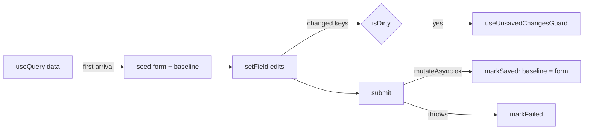

# Components, Hooks and Client State

Relevant source files

- [packages/web/src/components/Providers.tsx](https://github.com/yorch/auto-swe/blob/d0a90fb5/packages/web/src/components/Providers.tsx)
- [packages/web/src/components/ui/QueryBoundary.tsx](https://github.com/yorch/auto-swe/blob/d0a90fb5/packages/web/src/components/ui/QueryBoundary.tsx)
- [packages/web/src/components/ui/Table.tsx](https://github.com/yorch/auto-swe/blob/d0a90fb5/packages/web/src/components/ui/Table.tsx)
- [packages/web/src/components/layout/TopBar.tsx](https://github.com/yorch/auto-swe/blob/d0a90fb5/packages/web/src/components/layout/TopBar.tsx)
- [packages/web/src/hooks/useUrlFilters.ts](https://github.com/yorch/auto-swe/blob/d0a90fb5/packages/web/src/hooks/useUrlFilters.ts)
- [packages/web/src/hooks/useListQuery.ts](https://github.com/yorch/auto-swe/blob/d0a90fb5/packages/web/src/hooks/useListQuery.ts)
- [packages/web/src/hooks/useFormState.ts](https://github.com/yorch/auto-swe/blob/d0a90fb5/packages/web/src/hooks/useFormState.ts)
- [packages/web/src/hooks/useConfigForm.ts](https://github.com/yorch/auto-swe/blob/d0a90fb5/packages/web/src/hooks/useConfigForm.ts)
- [packages/web/src/hooks/useUnsavedChangesGuard.ts](https://github.com/yorch/auto-swe/blob/d0a90fb5/packages/web/src/hooks/useUnsavedChangesGuard.ts)
- [packages/web/src/hooks/useRuns.ts](https://github.com/yorch/auto-swe/blob/d0a90fb5/packages/web/src/hooks/useRuns.ts)
- [packages/web/src/hooks/useAdminConfig.ts](https://github.com/yorch/auto-swe/blob/d0a90fb5/packages/web/src/hooks/useAdminConfig.ts)
- [packages/web/src/hooks/useUserPreferences.ts](https://github.com/yorch/auto-swe/blob/d0a90fb5/packages/web/src/hooks/useUserPreferences.ts)
- [packages/web/src/hooks/useHasRole.ts](https://github.com/yorch/auto-swe/blob/d0a90fb5/packages/web/src/hooks/useHasRole.ts)
- [packages/web/src/hooks/useVisibleNav.ts](https://github.com/yorch/auto-swe/blob/d0a90fb5/packages/web/src/hooks/useVisibleNav.ts)
- [packages/web/src/hooks/useRequests.ts](https://github.com/yorch/auto-swe/blob/d0a90fb5/packages/web/src/hooks/useRequests.ts)
- [packages/web/src/stores/authStore.ts](https://github.com/yorch/auto-swe/blob/d0a90fb5/packages/web/src/stores/authStore.ts)
- [packages/web/src/stores/teamStore.ts](https://github.com/yorch/auto-swe/blob/d0a90fb5/packages/web/src/stores/teamStore.ts)
- [packages/web/src/lib/api.ts](https://github.com/yorch/auto-swe/blob/d0a90fb5/packages/web/src/lib/api.ts)

## Overview

The dashboard splits state three ways. Server state lives in TanStack Query hooks under `src/hooks/`, client-only state lives in two Zustand stores under `src/stores/`, and shareable view state lives in the URL. Presentational building blocks sit in `src/components/ui/`, with feature components grouped by domain beside them (`agentRuns`, `approvals`, `govern`, `runs`, `work`, and others). `src/lib/` holds the gateway client plus many small pure helpers, each with a co-located test.

## Providers and the gateway client

[Providers](https://github.com/yorch/auto-swe/blob/d0a90fb5/packages/web/src/components/Providers.tsx#L7-L27) creates one `QueryClient` per mount with `retry: 1` and `staleTime: 30_000`, and calls the auth store's `checkAuth` once on mount. Hooks therefore treat data as fresh for 30 seconds unless they override it, as `useReadiness` does with 15 seconds.

Every hook talks to the gateway through the `api` singleton, an instance of `ApiClient` ([packages/web/src/lib/api.ts:L43](https://github.com/yorch/auto-swe/blob/d0a90fb5/packages/web/src/lib/api.ts#L43)). It sends `credentials: 'include'` so the better-auth session cookie works cross-origin, and adds a bearer token when it holds one. A 401 on a token-carrying request triggers a single shared refresh through `tryRefresh`, which exchanges the session for a JWT at `/api/v1/auth/session-token` ([L200-L245](https://github.com/yorch/auto-swe/blob/d0a90fb5/packages/web/src/lib/api.ts#L200-L245)). A generation counter prevents an in-flight refresh from overwriting a token set by a later login or logout. Failures surface as `ApiError`, which carries `status`, the gateway's `code` and untrusted `details` ([L28-L41](https://github.com/yorch/auto-swe/blob/d0a90fb5/packages/web/src/lib/api.ts#L28-L41)). Bodies of `204` or zero-length responses are not parsed as JSON ([L164-L166](https://github.com/yorch/auto-swe/blob/d0a90fb5/packages/web/src/lib/api.ts#L164-L166)).

Sources: [packages/web/src/components/Providers.tsx:L7-L27](https://github.com/yorch/auto-swe/blob/d0a90fb5/packages/web/src/components/Providers.tsx#L7-L27) [packages/web/src/lib/api.ts:L28-L267](https://github.com/yorch/auto-swe/blob/d0a90fb5/packages/web/src/lib/api.ts#L28-L267)

## Zustand stores

`useAuthStore` ([stores/authStore.ts#L231](https://github.com/yorch/auto-swe/blob/d0a90fb5/packages/web/src/stores/authStore.ts#L231)) holds `user` and `isAuthenticated` plus the sign-in actions: `login`, `logout`, `checkAuth`, `hydrateFromSession`, magic-link and password-reset requests, and `linkProvider`. Identity is established by probing `/api/auth/get-session`, and the probe result is one of `authenticated`, `anonymous` or `unknown` ([L188](https://github.com/yorch/auto-swe/blob/d0a90fb5/packages/web/src/stores/authStore.ts#L188)). Only `anonymous` clears the auth cookies, so a transient 429 or 5xx never logs a user out ([L231-L256](https://github.com/yorch/auto-swe/blob/d0a90fb5/packages/web/src/stores/authStore.ts#L231-L256)). After a successful probe the store sets a presence-only marker cookie and asks `api` for a bearer token, so server-side route guards can read it.

`useTeamStore` is a minimal store with `selectedTeamId` and a setter ([stores/teamStore.ts:L3-L11](https://github.com/yorch/auto-swe/blob/d0a90fb5/packages/web/src/stores/teamStore.ts#L3-L11)). The top bar writes it ([TopBar.tsx#L39](https://github.com/yorch/auto-swe/blob/d0a90fb5/packages/web/src/components/layout/TopBar.tsx#L39)) and request hooks read it to scope queries ([useRequests.ts#L26](https://github.com/yorch/auto-swe/blob/d0a90fb5/packages/web/src/hooks/useRequests.ts#L26)).

Two small hooks derive from the auth store rather than adding state. `useHasRole(required)` compares the signed-in role against a floor with `hasRole` ([useHasRole.ts:L6-L8](https://github.com/yorch/auto-swe/blob/d0a90fb5/packages/web/src/hooks/useHasRole.ts#L6-L8)). `useVisibleNavGroups` combines the role with the usage-scope query to filter navigation, and both the sidebar and the command palette use it ([useVisibleNav.ts:L8-L18](https://github.com/yorch/auto-swe/blob/d0a90fb5/packages/web/src/hooks/useVisibleNav.ts#L8-L18)).

Sources: [packages/web/src/stores/authStore.ts:L188-L372](https://github.com/yorch/auto-swe/blob/d0a90fb5/packages/web/src/stores/authStore.ts#L188-L372) [packages/web/src/stores/teamStore.ts:L1-L11](https://github.com/yorch/auto-swe/blob/d0a90fb5/packages/web/src/stores/teamStore.ts#L1-L11)

## TanStack Query hooks

Roughly one hook file exists per gateway resource (`useTeams`, `useSkills`, `useSchedules`, `useMcpConnections`, and so on). Paginated lists share `useListQuery`, which wraps `useQuery` over a `{ data, meta }` response and returns the rows as `data` and the pagination block as `meta`. Its comment records the reason: unwrapping `data` alone drops the total, so a page would report "N total" for one page instead of the table ([useListQuery.ts:L35-L49](https://github.com/yorch/auto-swe/blob/d0a90fb5/packages/web/src/hooks/useListQuery.ts#L35-L49)). `listUrl` appends `limit` and `offset` only when set ([L23-L32](https://github.com/yorch/auto-swe/blob/d0a90fb5/packages/web/src/hooks/useListQuery.ts#L23-L32)).

Polling is expressed through `refetchInterval`: `useWorkflows` polls every 10 seconds and `useWorkflow` every 5 ([useRuns.ts:L19-L34](https://github.com/yorch/auto-swe/blob/d0a90fb5/packages/web/src/hooks/useRuns.ts#L19-L34)). `useWorkflowRun` live-tails a run. It loads all traces once, then each poll reads the run without traces plus only those created after a cursor. `traceTailCursor` backs the cursor off by `TRACE_TAIL_OVERLAP_MS` (10 seconds) to catch late-committed rows, `mergeTraces` de-duplicates by id and keeps server order, and a mismatch against the run's trace count forces a full re-read ([useRuns.ts:L44-L65](https://github.com/yorch/auto-swe/blob/d0a90fb5/packages/web/src/hooks/useRuns.ts#L44-L65), [L77-L90](https://github.com/yorch/auto-swe/blob/d0a90fb5/packages/web/src/hooks/useRuns.ts#L77-L90), [L105](https://github.com/yorch/auto-swe/blob/d0a90fb5/packages/web/src/hooks/useRuns.ts#L105)).

Mutations invalidate their own query key. The integration config factory `configMutation` invalidates the config key, and with `affectsReadiness` also `READINESS_KEY`, because setup readiness derives from that config ([useAdminConfig.ts:L61-L75](https://github.com/yorch/auto-swe/blob/d0a90fb5/packages/web/src/hooks/useAdminConfig.ts#L61-L75)). `useUserPreferences` is the optimistic example: `onMutate` cancels in-flight queries and writes the new layout into the cache, `onError` restores the snapshot, and `onSettled` invalidates to reconcile ([useUserPreferences.ts:L44-L61](https://github.com/yorch/auto-swe/blob/d0a90fb5/packages/web/src/hooks/useUserPreferences.ts#L44-L61)). It also validates the stored value on read, since the column is free-form JSON.

Sources: [packages/web/src/hooks/useListQuery.ts:L1-L49](https://github.com/yorch/auto-swe/blob/d0a90fb5/packages/web/src/hooks/useListQuery.ts#L1-L49) [packages/web/src/hooks/useRuns.ts:L19-L105](https://github.com/yorch/auto-swe/blob/d0a90fb5/packages/web/src/hooks/useRuns.ts#L19-L105) [packages/web/src/hooks/useAdminConfig.ts:L61-L75](https://github.com/yorch/auto-swe/blob/d0a90fb5/packages/web/src/hooks/useAdminConfig.ts#L61-L75) [packages/web/src/hooks/useUserPreferences.ts:L1-L63](https://github.com/yorch/auto-swe/blob/d0a90fb5/packages/web/src/hooks/useUserPreferences.ts#L1-L63)

## URL filters

`useUrlFilters` keeps filter state in the address bar so a filtered list can be bookmarked, shared and survives a reload. It returns the current `params` and an `update(patch)` function; a null, undefined or empty value deletes the parameter, and navigation uses `router.replace` with `scroll: false` so filtering adds no history entries ([useUrlFilters.ts:L10-L30](https://github.com/yorch/auto-swe/blob/d0a90fb5/packages/web/src/hooks/useUrlFilters.ts#L10-L30)). Callers must render inside a `Suspense` boundary because the hook uses `useSearchParams`. `parseOffset` turns a raw parameter into a non-negative safe integer, defaulting to 0 ([L33-L36](https://github.com/yorch/auto-swe/blob/d0a90fb5/packages/web/src/hooks/useUrlFilters.ts#L33-L36)). Pages such as `app/govern/evals/page.tsx` and `app/workflows/page.tsx` consume the hook.

Sources: [packages/web/src/hooks/useUrlFilters.ts:L1-L36](https://github.com/yorch/auto-swe/blob/d0a90fb5/packages/web/src/hooks/useUrlFilters.ts#L1-L36)

## Form state and the unsaved-changes guard

`useFormState` holds the form values, a `baseline` of the last loaded or saved values, and `saved` and `error` status. `changed` is computed by comparing JSON per key, so a nested value counts as changed only when its contents differ ([useFormState.ts:L9-L13](https://github.com/yorch/auto-swe/blob/d0a90fb5/packages/web/src/hooks/useFormState.ts#L9-L13)). Any edit clears the saved and error lines, `seed` sets form and baseline together, `markSaved` moves the baseline, and `discard` restores it ([L44-L108](https://github.com/yorch/auto-swe/blob/d0a90fb5/packages/web/src/hooks/useFormState.ts#L44-L108)).

`useConfigForm` composes it with a query and a mutation for the workflow config forms. It seeds the form from the query exactly once, on first data arrival, guarded by a ref so a background refetch cannot clobber in-progress edits. `submit` maps the form to a body, awaits `mutateAsync`, then calls `markSaved` or `markFailed` ([useConfigForm.ts:L32-L68](https://github.com/yorch/auto-swe/blob/d0a90fb5/packages/web/src/hooks/useConfigForm.ts#L32-L68)).

`useUnsavedChangesGuard(dirty)` registers a symbol in a module-level set; the first registration adds a `beforeunload` listener and a capture-phase click listener, and the last removal drops them, so several dirty forms prompt once. In-app link clicks that leave the page trigger `window.confirm` before Next's router sees the click. The browser Back button is not intercepted ([useUnsavedChangesGuard.ts:L9-L86](https://github.com/yorch/auto-swe/blob/d0a90fb5/packages/web/src/hooks/useUnsavedChangesGuard.ts#L9-L86)).

```mermaid
flowchart LR
  Q[useQuery data] -->|first arrival| S[seed form + baseline]
  S --> E[setField edits]
  E -->|changed keys| D{isDirty}
  D -->|yes| G[useUnsavedChangesGuard]
  E --> U[submit]
  U -->|mutateAsync ok| M[markSaved: baseline = form]
  U -->|throws| F[markFailed]
```

Sources: [packages/web/src/hooks/useFormState.ts:L1-L109](https://github.com/yorch/auto-swe/blob/d0a90fb5/packages/web/src/hooks/useFormState.ts#L1-L109) [packages/web/src/hooks/useConfigForm.ts:L1-L68](https://github.com/yorch/auto-swe/blob/d0a90fb5/packages/web/src/hooks/useConfigForm.ts#L1-L68) [packages/web/src/hooks/useUnsavedChangesGuard.ts:L1-L86](https://github.com/yorch/auto-swe/blob/d0a90fb5/packages/web/src/hooks/useUnsavedChangesGuard.ts#L1-L86)

## Design-system components

`src/components/ui/` contains the shared primitives: `Button`, `Card`, `Badge`, `StatusBadge`, `Alert`, `Modal`, `ConfirmModal`, the field set (`Input`, `Textarea`, `Select`, `Combobox`, `Checkbox`, `RadioGroup`, `ToggleSwitch`, `Slider`, `FieldWrapper`), layout pieces (`PageHeader`, `Toolbar`, `TabBar`, `SegmentedControl`, `Pagination`, `SaveBar`, `Stat`), and the `Table` family (`Table`, `THead`, `Th`, `TRow`, `Td`, `TableStatusRow`) ([Table.tsx](https://github.com/yorch/auto-swe/blob/d0a90fb5/packages/web/src/components/ui/Table.tsx#L43-L174)). `Th` takes a `SortDirection` (`ascending`, `descending`, `none`) and a `ThVariant` for density. Most primitives have a co-located `*.test.tsx`.

`QueryBoundary` is the shared loading, error and settled wrapper. It renders `LoadingState` while loading, an `Alert` reading "Could not load {label}: {detail}" on error with an optional Retry button, and its children otherwise. Its comment explains the motive: pages that checked only `isLoading` rendered an empty state on a 403 or 500 because `data` was undefined, so every list query routes `isError` and `error` through it ([QueryBoundary.tsx:L28-L61](https://github.com/yorch/auto-swe/blob/d0a90fb5/packages/web/src/components/ui/QueryBoundary.tsx#L28-L61)).

Feature components (`components/layout/AppShell`, `Sidebar`, `TopBar`, `CommandPalette`, and the domain folders) compose these primitives and the hooks above. `ErrorBoundary`, `ErrorPanel` and `LayoutToggle` sit at the top of `components/`.

Sources: [packages/web/src/components/ui/Table.tsx:L43-L223](https://github.com/yorch/auto-swe/blob/d0a90fb5/packages/web/src/components/ui/Table.tsx#L43-L223) [packages/web/src/components/ui/QueryBoundary.tsx:L1-L61](https://github.com/yorch/auto-swe/blob/d0a90fb5/packages/web/src/components/ui/QueryBoundary.tsx#L1-L61)

## Related Pages

- Parent: [Web Dashboard](./5-web-dashboard.md)
- Sibling: [App Routes and Pages](./5.1-app-routes-and-pages.md)
