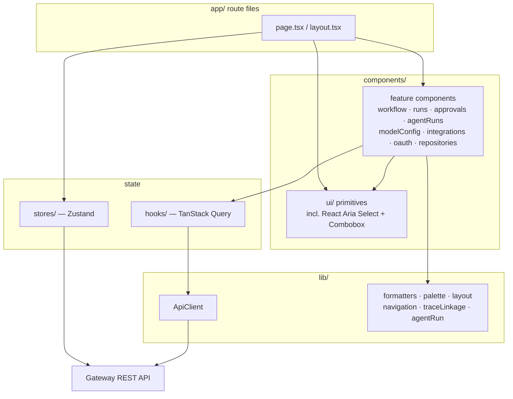

# Component Library and Client State

> Indexed at commit `ae416937` on 2026-10-03 · [view on GitHub](https://github.com/yorch/auto-swe/tree/ae416937)

## Relevant source files

- [packages/web/src/lib/api.ts](https://github.com/yorch/auto-swe/blob/ae416937/packages/web/src/lib/api.ts)
- [packages/web/src/lib/utils.ts](https://github.com/yorch/auto-swe/blob/ae416937/packages/web/src/lib/utils.ts)
- [packages/web/src/lib/palette.ts](https://github.com/yorch/auto-swe/blob/ae416937/packages/web/src/lib/palette.ts)
- [packages/web/src/lib/palette.test.ts](https://github.com/yorch/auto-swe/blob/ae416937/packages/web/src/lib/palette.test.ts)
- [packages/web/src/lib/themeClasses.test.ts](https://github.com/yorch/auto-swe/blob/ae416937/packages/web/src/lib/themeClasses.test.ts)
- [packages/web/src/lib/workflowLayout.ts](https://github.com/yorch/auto-swe/blob/ae416937/packages/web/src/lib/workflowLayout.ts)
- [packages/web/src/lib/networkErrors.ts](https://github.com/yorch/auto-swe/blob/ae416937/packages/web/src/lib/networkErrors.ts)
- [packages/web/src/lib/config.ts](https://github.com/yorch/auto-swe/blob/ae416937/packages/web/src/lib/config.ts)
- [packages/web/src/lib/navigation.ts](https://github.com/yorch/auto-swe/blob/ae416937/packages/web/src/lib/navigation.ts)
- [packages/web/src/lib/traceLinkage.ts](https://github.com/yorch/auto-swe/blob/ae416937/packages/web/src/lib/traceLinkage.ts)
- [packages/web/src/lib/dagOverlay.ts](https://github.com/yorch/auto-swe/blob/ae416937/packages/web/src/lib/dagOverlay.ts)
- [packages/web/src/lib/modelCatalog.ts](https://github.com/yorch/auto-swe/blob/ae416937/packages/web/src/lib/modelCatalog.ts)
- [packages/web/src/lib/agentRun.ts](https://github.com/yorch/auto-swe/blob/ae416937/packages/web/src/lib/agentRun.ts)
- [packages/web/src/hooks/useListQuery.ts](https://github.com/yorch/auto-swe/blob/ae416937/packages/web/src/hooks/useListQuery.ts)
- [packages/web/src/hooks/useRuns.ts](https://github.com/yorch/auto-swe/blob/ae416937/packages/web/src/hooks/useRuns.ts)
- [packages/web/src/hooks/useRunReRun.ts](https://github.com/yorch/auto-swe/blob/ae416937/packages/web/src/hooks/useRunReRun.ts)
- [packages/web/src/hooks/useAgentRuns.ts](https://github.com/yorch/auto-swe/blob/ae416937/packages/web/src/hooks/useAgentRuns.ts)
- [packages/web/src/hooks/useApprovals.ts](https://github.com/yorch/auto-swe/blob/ae416937/packages/web/src/hooks/useApprovals.ts)
- [packages/web/src/hooks/useAdminConfig.ts](https://github.com/yorch/auto-swe/blob/ae416937/packages/web/src/hooks/useAdminConfig.ts)
- [packages/web/src/hooks/useModelCatalog.ts](https://github.com/yorch/auto-swe/blob/ae416937/packages/web/src/hooks/useModelCatalog.ts)
- [packages/web/src/hooks/useMcpGrants.ts](https://github.com/yorch/auto-swe/blob/ae416937/packages/web/src/hooks/useMcpGrants.ts)
- [packages/web/src/hooks/useOAuthConsent.ts](https://github.com/yorch/auto-swe/blob/ae416937/packages/web/src/hooks/useOAuthConsent.ts)
- [packages/web/src/hooks/useGithubInstallations.ts](https://github.com/yorch/auto-swe/blob/ae416937/packages/web/src/hooks/useGithubInstallations.ts)
- [packages/web/src/hooks/useGithubHostCredentials.ts](https://github.com/yorch/auto-swe/blob/ae416937/packages/web/src/hooks/useGithubHostCredentials.ts)
- [packages/web/src/hooks/useGatewayStatus.ts](https://github.com/yorch/auto-swe/blob/ae416937/packages/web/src/hooks/useGatewayStatus.ts)
- [packages/web/src/hooks/useRepositories.ts](https://github.com/yorch/auto-swe/blob/ae416937/packages/web/src/hooks/useRepositories.ts)
- [packages/web/src/hooks/useTemporalUi.ts](https://github.com/yorch/auto-swe/blob/ae416937/packages/web/src/hooks/useTemporalUi.ts)
- [packages/web/src/hooks/useConfigForm.ts](https://github.com/yorch/auto-swe/blob/ae416937/packages/web/src/hooks/useConfigForm.ts)
- [packages/web/src/hooks/useIntegrationConfigForm.ts](https://github.com/yorch/auto-swe/blob/ae416937/packages/web/src/hooks/useIntegrationConfigForm.ts)
- [packages/web/src/hooks/useUserPreferences.ts](https://github.com/yorch/auto-swe/blob/ae416937/packages/web/src/hooks/useUserPreferences.ts)
- [packages/web/src/stores/authStore.ts](https://github.com/yorch/auto-swe/blob/ae416937/packages/web/src/stores/authStore.ts)
- [packages/web/src/stores/teamStore.ts](https://github.com/yorch/auto-swe/blob/ae416937/packages/web/src/stores/teamStore.ts)
- [packages/web/src/components/workflow/TemplateEditor.tsx](https://github.com/yorch/auto-swe/blob/ae416937/packages/web/src/components/workflow/TemplateEditor.tsx)
- [packages/web/src/components/workflow/WorkflowDag.tsx](https://github.com/yorch/auto-swe/blob/ae416937/packages/web/src/components/workflow/WorkflowDag.tsx)
- [packages/web/src/components/workflow/WorkflowOutline.tsx](https://github.com/yorch/auto-swe/blob/ae416937/packages/web/src/components/workflow/WorkflowOutline.tsx)
- [packages/web/src/components/workflow/outline.ts](https://github.com/yorch/auto-swe/blob/ae416937/packages/web/src/components/workflow/outline.ts)
- [packages/web/src/components/workflow/foldGroups.ts](https://github.com/yorch/auto-swe/blob/ae416937/packages/web/src/components/workflow/foldGroups.ts)
- [packages/web/src/components/workflow/foldBookkeeping.ts](https://github.com/yorch/auto-swe/blob/ae416937/packages/web/src/components/workflow/foldBookkeeping.ts)
- [packages/web/src/components/workflow/nodeDisplay.ts](https://github.com/yorch/auto-swe/blob/ae416937/packages/web/src/components/workflow/nodeDisplay.ts)
- [packages/web/src/components/workflow/flowChrome.tsx](https://github.com/yorch/auto-swe/blob/ae416937/packages/web/src/components/workflow/flowChrome.tsx)
- [packages/web/src/components/workflow/nodeTypeTone.ts](https://github.com/yorch/auto-swe/blob/ae416937/packages/web/src/components/workflow/nodeTypeTone.ts)
- [packages/web/src/components/workflow/dagNode.tsx](https://github.com/yorch/auto-swe/blob/ae416937/packages/web/src/components/workflow/dagNode.tsx)
- [packages/web/src/components/workflow/specToFlow.ts](https://github.com/yorch/auto-swe/blob/ae416937/packages/web/src/components/workflow/specToFlow.ts)
- [packages/web/src/components/workflow/specEdits.ts](https://github.com/yorch/auto-swe/blob/ae416937/packages/web/src/components/workflow/specEdits.ts)
- [packages/web/src/components/workflow/NodeInspector.tsx](https://github.com/yorch/auto-swe/blob/ae416937/packages/web/src/components/workflow/NodeInspector.tsx)
- [packages/web/src/components/workflow/NodePalette.tsx](https://github.com/yorch/auto-swe/blob/ae416937/packages/web/src/components/workflow/NodePalette.tsx)
- [packages/web/src/components/runs/Rail.tsx](https://github.com/yorch/auto-swe/blob/ae416937/packages/web/src/components/runs/Rail.tsx)
- [packages/web/src/components/runs/RunMetaRail.tsx](https://github.com/yorch/auto-swe/blob/ae416937/packages/web/src/components/runs/RunMetaRail.tsx)
- [packages/web/src/components/runs/AgentRunOutcomeCard.tsx](https://github.com/yorch/auto-swe/blob/ae416937/packages/web/src/components/runs/AgentRunOutcomeCard.tsx)
- [packages/web/src/components/agentRuns/AgentRunForm.tsx](https://github.com/yorch/auto-swe/blob/ae416937/packages/web/src/components/agentRuns/AgentRunForm.tsx)
- [packages/web/src/components/modelConfig/CatalogTab.tsx](https://github.com/yorch/auto-swe/blob/ae416937/packages/web/src/components/modelConfig/CatalogTab.tsx)
- [packages/web/src/components/modelConfig/ModelSpecPicker.tsx](https://github.com/yorch/auto-swe/blob/ae416937/packages/web/src/components/modelConfig/ModelSpecPicker.tsx)
- [packages/web/src/components/ui/dropdown.tsx](https://github.com/yorch/auto-swe/blob/ae416937/packages/web/src/components/ui/dropdown.tsx)
- [packages/web/src/components/ui/Select.tsx](https://github.com/yorch/auto-swe/blob/ae416937/packages/web/src/components/ui/Select.tsx)
- [packages/web/src/components/ui/Combobox.tsx](https://github.com/yorch/auto-swe/blob/ae416937/packages/web/src/components/ui/Combobox.tsx)
- [packages/web/src/components/ui/FieldWrapper.tsx](https://github.com/yorch/auto-swe/blob/ae416937/packages/web/src/components/ui/FieldWrapper.tsx)
- [packages/web/src/components/ui/QueryBoundary.tsx](https://github.com/yorch/auto-swe/blob/ae416937/packages/web/src/components/ui/QueryBoundary.tsx)
- [packages/web/src/components/ui/Modal.tsx](https://github.com/yorch/auto-swe/blob/ae416937/packages/web/src/components/ui/Modal.tsx)
- [packages/web/src/components/ui/Table.tsx](https://github.com/yorch/auto-swe/blob/ae416937/packages/web/src/components/ui/Table.tsx)
- [packages/web/src/components/ui/PageHeader.tsx](https://github.com/yorch/auto-swe/blob/ae416937/packages/web/src/components/ui/PageHeader.tsx)
- [packages/web/src/components/ui/SegmentedControl.tsx](https://github.com/yorch/auto-swe/blob/ae416937/packages/web/src/components/ui/SegmentedControl.tsx)
- [packages/web/src/components/layout/AppShell.tsx](https://github.com/yorch/auto-swe/blob/ae416937/packages/web/src/components/layout/AppShell.tsx)
- [packages/web/src/components/layout/TopBar.tsx](https://github.com/yorch/auto-swe/blob/ae416937/packages/web/src/components/layout/TopBar.tsx)
- [packages/web/src/components/layout/AuthLayout.tsx](https://github.com/yorch/auto-swe/blob/ae416937/packages/web/src/components/layout/AuthLayout.tsx)
- [packages/web/src/components/Providers.tsx](https://github.com/yorch/auto-swe/blob/ae416937/packages/web/src/components/Providers.tsx)
- [packages/web/src/app/globals.css](https://github.com/yorch/auto-swe/blob/ae416937/packages/web/src/app/globals.css)

## Overview

The dashboard's shared front end sits in four directories under `packages/web/src`: `components/` holds the presentational library, `hooks/` holds the TanStack Query bindings for the gateway REST API (about forty files, one per resource area), `stores/` holds the two Zustand stores, and `lib/` holds the fetch wrapper, formatters, design tokens, graph layout and the pure helpers that sit behind forms and viewers. Route files under `app/` compose these; they own no fetching or styling logic of their own. How those routes are organised is covered in [App Routes and Pages](./5.1-app-routes-and-pages.md).

The organising rule is that server data never lives in a store. Every remote read is a `useQuery` keyed by resource, every write is a `useMutation` that invalidates the keys it touched, and Zustand holds only the two facts that have no server representation: who is signed in, and which team the chrome is filtered to.

A second rule governs the presentation layer: a treatment that appears on more than one page is a primitive, not a class string. Headers, modal action rows, table headers, segmented choices, dropdowns, the run rail and the auth screens each have one component, and a source-reading test (see [Styling](#styling)) fails the build when a colour class names a token the theme does not define.

Sources: [packages/web/src/stores/teamStore.ts:L1-L11](https://github.com/yorch/auto-swe/blob/ae416937/packages/web/src/stores/teamStore.ts#L1-L11) [packages/web/src/lib/themeClasses.test.ts:L1-L53](https://github.com/yorch/auto-swe/blob/ae416937/packages/web/src/lib/themeClasses.test.ts#L1-L53)

## Architecture

```mermaid
flowchart TB
  subgraph rt["app/ route files"]
    page["page.tsx / layout.tsx"]
  end
  subgraph comp["components/"]
    ui["ui/ primitives<br/>incl. React Aria Select + Combobox"]
    feat["feature components<br/>workflow · runs · approvals · agentRuns<br/>modelConfig · integrations · oauth · repositories"]
  end
  subgraph st["state"]
    hooks["hooks/ — TanStack Query"]
    stores["stores/ — Zustand"]
  end
  subgraph libs["lib/"]
    apic["ApiClient"]
    fmt["formatters · palette · layout<br/>navigation · traceLinkage · agentRun"]
  end
  gw["Gateway REST API"]

  page --> feat
  page --> ui
  feat --> ui
  feat --> hooks
  feat --> fmt
  page --> stores
  hooks --> apic
  stores --> gw
  apic --> gw
```

A feature component reads data through a hook and renders through the primitives; the primitives import `lib/utils`, one another and, for the two dropdowns, React Aria. Every JSON read and write against the `/api/v1` surface goes through `ApiClient`, so bearer-token refresh and error shaping exist in exactly one place. Three call sites deliberately bypass it because the thing they talk to does not speak the gateway's envelope: `authStore` posts to better-auth's `/api/auth/*`, `useOAuthConsent` posts to the OAuth provider's `/api/auth/oauth2/*` and parses `{ error_description }` rather than `{ error: { message } }`, and `useGatewayStatus` probes the unauthenticated `/health`. The approvals inbox's `EventSource` is the fourth, since the browser owns that connection.

`AppShell` picks one of three frames per route. Chromeless routes (`/login`, `/reset-password`) render bare and take their ground from `AuthLayout`; the run detail and template diff pages render inside the chrome but with a full-height `<main>` that manages its own scrolling; every other route sits in a `max-w-[1280px]` column. The chromed branch is a separate `Chrome` component so that `useApprovalsStream` can mount only there, since a hook cannot sit behind the early return for chromeless routes ([AppShell.tsx#L11-L68](https://github.com/yorch/auto-swe/blob/ae416937/packages/web/src/components/layout/AppShell.tsx#L11-L68)). Below the `md` breakpoint the sidebar is a modal drawer: `Chrome` marks the page behind it `inert`, and `useNavDrawer` closes it on navigation, Escape and growth past `md`, moves focus into it on open and back to the menu button on close, and traps Tab inside it ([AppShell.tsx#L51-L54](https://github.com/yorch/auto-swe/blob/ae416937/packages/web/src/components/layout/AppShell.tsx#L51-L54), [AppShell.tsx#L70-L170](https://github.com/yorch/auto-swe/blob/ae416937/packages/web/src/components/layout/AppShell.tsx#L70-L170)).

What the sidebar offers, who sees it and what each page is called is one list, `NAV_GROUPS` in `lib/navigation.ts`. `visibleNavGroups(role)` narrows it with the same `hasRole` the rest of the dashboard uses, `pageTitle` gives the `TopBar` its heading, and `navLabel(href)` returns the string a page must use as its H1, so the sidebar label, the top-bar title and the page heading cannot drift ([navigation.ts#L1-L30](https://github.com/yorch/auto-swe/blob/ae416937/packages/web/src/lib/navigation.ts#L1-L30), [navigation.ts#L139-L203](https://github.com/yorch/auto-swe/blob/ae416937/packages/web/src/lib/navigation.ts#L139-L203)).

Sources: [packages/web/src/components/Providers.tsx:L7-L27](https://github.com/yorch/auto-swe/blob/ae416937/packages/web/src/components/Providers.tsx#L7-L27) [packages/web/src/components/layout/AppShell.tsx:L1-L170](https://github.com/yorch/auto-swe/blob/ae416937/packages/web/src/components/layout/AppShell.tsx#L1-L170) [packages/web/src/components/layout/AuthLayout.tsx:L1-L67](https://github.com/yorch/auto-swe/blob/ae416937/packages/web/src/components/layout/AuthLayout.tsx#L1-L67) [packages/web/src/lib/api.ts:L1-L253](https://github.com/yorch/auto-swe/blob/ae416937/packages/web/src/lib/api.ts#L1-L253) [packages/web/src/lib/navigation.ts:L1-L203](https://github.com/yorch/auto-swe/blob/ae416937/packages/web/src/lib/navigation.ts#L1-L203) [packages/web/src/hooks/useOAuthConsent.ts:L1-L88](https://github.com/yorch/auto-swe/blob/ae416937/packages/web/src/hooks/useOAuthConsent.ts#L1-L88)

## Component Inventory

| Group | Path | Contents |
| ----- | ---- | -------- |
| Primitives | `components/ui/` | `Button` / `ButtonLink`, `Input`, `Textarea`, `Select`, `Combobox` (both over `dropdown`), `Checkbox`, `RadioGroup`, `Slider`, `ToggleSwitch`, `FieldWrapper`, `SegmentedControl`, `TabBar`, `Modal` + `ModalFooter`, `ConfirmModal`, `Table` family (`THead`, `Th`, `TRow`, `Td`, `TableStatusRow`), `Card`, `Badge`, `StatusBadge`, `Stat`, `Alert`, `EmptyState`, `LoadingState`, `QueryBoundary`, `Pagination`, `CopyButton`, `PageHeader` + `SectionHeader`, `icons` |
| Chrome | `components/layout/` | `AppShell` grid and nav drawer, `Sidebar`, `TopBar` with the team picker, inbox badge and gateway status, `AuthLayout` + `AuthHeading` for the sign-in screens |
| Workflow graph | `components/workflow/` | `WorkflowDag` viewer, `WorkflowOutline`, `TemplateEditor`, `dagNode`, `flowChrome`, `nodeTypeTone`, `nodeDisplay`, `outline`, `foldBookkeeping`, `foldGroups`, `NodePalette`, `NodeInspector`, `inspectorSections`, `inspectorFields`, `specToFlow`, `specEdits`, `makeDefaultNode`, `dagKeyboardNav` |
| Workflow forms and chrome | `components/workflow/` | `InputSchemaBuilder`, `schemaForm`, `SchemaFormPreview`, `RunTemplateModal`, `NewRequestModal`, `RefineChatPanel`, `WorkflowDefaultsForm`, `ConsolidationForm`, `RevalidationForm`, `CanaryForm`, `scheduleControls`, `KeyValueRow`, `VersionTags`, `templateNav`, `starterTemplates` |
| Run detail | `components/runs/` | `Rail` (`RailSection`, `RailRow`), `RunMetaRail`, `RunOutcomeCard`, `AgentRunOutcomeCard` (+ `AgentRunFailureNote`), `FailureCard`, `EvalSignalsPanel`, `AutonomyDecisionsPanel` |
| Agent runs | `components/agentRuns/` | `AgentRunForm`, the launch form behind `/agent-runs` |
| Approvals | `components/approvals/` | `HumanStepCard`, `DiffRenderer` |
| Repositories | `components/repositories/` | `ConnectionFormModal`, `ImportFromGitHubModal`, `ShareRepoModal`, `MyCredentialModal`, `RepoDependenciesModal`, `RepoDependencySuggestions` |
| Integrations | `components/integrations/` | `GitHubTab`, `SlackTab`, `IssueTrackerTab`, `KnowledgeBaseTab`, `FigmaTab`, `AuditLogTab`, `GitHubHostCredentialsCard`, `GitHubHostSecretsCard`, `ConfigField`, `SecretInput`, `SourceBadge`, `UrlRow`, `IntegrationFormFooter` (+ `TestResultAlert`) |
| Model configuration | `components/modelConfig/` | `CredentialsTab`, `EmbeddingsTab`, `CatalogTab`, `ModelSpecPicker`, `AuditLogTab`, `MidRunWarning` |
| Settings, security, govern | `components/settings/`, `components/security/`, `components/govern/` | `AccessTokensSection`, `ConnectedAppsSection`, `SettingRow`, `SecurityEventList`, `OrgBudgetTable` |
| OAuth | `components/oauth/` | `ConsentScreen`, the page an MCP client sends a signed-in user to |
| Evals | `components/evals/` | `EvalResultsTable`, `EvalRunStatusBadge` |
| Governance | `components/teams/`, `components/users/`, `components/agents/`, `components/library/` | `TeamFormModal`, `AddMemberModal`, `AllowlistEditor` and its egress and shell wrappers, `TeamAgentLibrarySection`, `CreateUserModal`, `AgentEditorFields`, `AgentFormFields`, `EntityMetaBadges` |
| Charts | `components/charts/` | `chartChrome`, `colors`, `DailyCostChart`, `ScorerTrendChart`, `WorkflowsOverTimeChart`, `WorkflowStatusChart` |
| Misc | `components/` | `Providers`, `ErrorBoundary`, `AppConfigScript`, `LayoutToggle`, `AuditLogTable`, `EligibleUserSelect`, `MemberUserPicker`, `auth/RoleLayout`, `dashboard/DashboardOnboarding`, `docs/Markdown` |

The hooks directory follows the same one-file-per-resource-area rule: `useRuns`, `useRunReRun`, `useAgentRuns`, `useTemplates`, `useRepositories`, `useTeams`, `useUsers`, `useApprovals`, `useAdmin` (scanner patterns, tokens, audit log, security events, platform usage, eval results and trends), `useAdminConfig`, `useConfigSettings`, `useModelConfig`, `useModelCatalog`, `useMcpConnections` and `useMcpGrants` (the user's connected apps), `useOAuthConsent`, `useGithubInstallations`, `useGithubHostCredentials`, `useGithubWebhookSecrets`, `useGatewayStatus`, `useHasRole`, `useTemporalUi` and a dozen smaller ones, plus the form and utility hooks described below. `lib/` carries the pure logic that keeps components thin and testable: `navigation`, `roles`, `teamPermissions`, `traceLinkage`, `dagOverlay`, `runFailure`, `agentRun`, `modelCatalog`, `mcpConsent`, `oauthQuery`, `safeRedirect`, `githubHost` and the `*Patch` helpers that build PUT bodies from form state.

Sources: [packages/web/src/components/ui/Table.tsx:L1-L151](https://github.com/yorch/auto-swe/blob/ae416937/packages/web/src/components/ui/Table.tsx#L1-L151) [packages/web/src/components/ui/QueryBoundary.tsx:L1-L43](https://github.com/yorch/auto-swe/blob/ae416937/packages/web/src/components/ui/QueryBoundary.tsx#L1-L43) [packages/web/src/components/ui/PageHeader.tsx:L1-L77](https://github.com/yorch/auto-swe/blob/ae416937/packages/web/src/components/ui/PageHeader.tsx#L1-L77) [packages/web/src/lib/roles.ts:L1-L25](https://github.com/yorch/auto-swe/blob/ae416937/packages/web/src/lib/roles.ts#L1-L25)

## Shared Primitives and Conventions

Five conventions carry most of the consistency across pages.

- **One page header.** `PageHeader` takes a `chapter` kicker, a `title`, an optional `subtitle` and a right-aligned `actions` slot, and renders the `<h1>` a route should own; `SectionHeader` is its `<h2>` counterpart with an optional ordinal and hint ([PageHeader.tsx#L3-L77](https://github.com/yorch/auto-swe/blob/ae416937/packages/web/src/components/ui/PageHeader.tsx#L3-L77)). The `<h1>` elements in `app/` and `components/` are this one, the run detail page's own heading and the auth screens' `AuthHeading`; forty-eight route files render `<PageHeader`. The run detail page is the exception among routes: it manages its own full-height layout and writes its own heading. A page reachable from the sidebar titles itself with its nav label verbatim, through `navLabel` ([navigation.ts#L5-L14](https://github.com/yorch/auto-swe/blob/ae416937/packages/web/src/lib/navigation.ts#L5-L14)).
- **One modal action row.** `ModalFooter` is the row every modal ends with: a `ghost` Cancel beside a primary action, right-aligned. Without `onSubmit` the primary button is `type="submit"`, so a modal whose body is a `<form>` submits on Enter; with it, the button is a plain click target. A `submitHref` renders the primary action as a link for an action that navigates. Omitting `submitLabel` yields a read-only modal with a single `secondary` Close, because a lone ghost button reads as disabled ([Modal.tsx#L8-L71](https://github.com/yorch/auto-swe/blob/ae416937/packages/web/src/components/ui/Modal.tsx#L8-L71)).
- **Two ways to choose among a few things.** `TabBar` swaps a page's content section, and when its tabs carry an `href` they render as `next/link`s with `aria-current="page"`, so sub-pages stay linkable and prefetched ([TabBar.tsx#L11-L58](https://github.com/yorch/auto-swe/blob/ae416937/packages/web/src/components/ui/TabBar.tsx#L11-L58)). `SegmentedControl` is for a time range or view mode: a `<fieldset>` of toggle buttons carrying `aria-pressed`, so the selection is announced rather than conveyed by colour alone ([SegmentedControl.tsx#L10-L60](https://github.com/yorch/auto-swe/blob/ae416937/packages/web/src/components/ui/SegmentedControl.tsx#L10-L60)). The workflow viewer's Graph and Outline switch is one.
- **Two dropdowns, one skin.** `Select` is a single-choice dropdown and `Combobox` the searchable one for long, data-driven lists; both are covered under [Dropdowns](#dropdowns).
- **Shared feature chrome.** Where two or more features repeated the same markup it has been extracted next to them: `Rail` for the run detail's right-hand column, `IntegrationFormFooter` for the saved/error outcome and submit button that end every integration tab, `scheduleControls` for the enabled toggle and "Run now" footer of the schedule forms, `VersionTags` and `templateNav` for template pages, `EntityMetaBadges` for scanner patterns and skills, and `AuthLayout` for the sign-in screens.

Two smaller primitives round out the form set. `RadioGroup` is native radios in a `<fieldset>` named by its `<legend>` (hideable for assistive tech only), each row optionally carrying a description, and `Slider` is a native range input inside `FieldWrapper` with a live readout and an `aria-valuetext` ([RadioGroup.tsx#L11-L57](https://github.com/yorch/auto-swe/blob/ae416937/packages/web/src/components/ui/RadioGroup.tsx#L11-L57), [Slider.tsx#L13-L43](https://github.com/yorch/auto-swe/blob/ae416937/packages/web/src/components/ui/Slider.tsx#L13-L43)). `Table`'s `Th` can be made sortable: passing `sort` puts `aria-sort` on the `<th>` and turns the label into a button whose direction arrow is `aria-hidden`, since the state is already in `aria-sort` ([Table.tsx#L45-L90](https://github.com/yorch/auto-swe/blob/ae416937/packages/web/src/components/ui/Table.tsx#L45-L90)).

Sources: [packages/web/src/components/ui/PageHeader.tsx:L1-L77](https://github.com/yorch/auto-swe/blob/ae416937/packages/web/src/components/ui/PageHeader.tsx#L1-L77) [packages/web/src/components/ui/Modal.tsx:L1-L192](https://github.com/yorch/auto-swe/blob/ae416937/packages/web/src/components/ui/Modal.tsx#L1-L192) [packages/web/src/components/ui/TabBar.tsx:L1-L60](https://github.com/yorch/auto-swe/blob/ae416937/packages/web/src/components/ui/TabBar.tsx#L1-L60) [packages/web/src/components/ui/SegmentedControl.tsx:L1-L60](https://github.com/yorch/auto-swe/blob/ae416937/packages/web/src/components/ui/SegmentedControl.tsx#L1-L60) [packages/web/src/components/ui/RadioGroup.tsx:L1-L57](https://github.com/yorch/auto-swe/blob/ae416937/packages/web/src/components/ui/RadioGroup.tsx#L1-L57) [packages/web/src/components/ui/Slider.tsx:L1-L43](https://github.com/yorch/auto-swe/blob/ae416937/packages/web/src/components/ui/Slider.tsx#L1-L43)

## Dropdowns

Both dropdowns are built on React Aria Components (`react-aria-components` 1.21.1) rather than a native `<select>`, because Firefox has no customisable native select and a themed list that differs per browser is not a design system. No `<select>` element remains in `app/` or `components/`; thirty-nine files import `Select` and twenty import `Combobox`.

`dropdown.tsx` holds what the two share so they cannot drift: the `DropdownOption` shape (`value`, a `ReactNode` `label`, optional `textValue` for typeahead when the label is not a string, a muted `description` line and `disabled`), the field label, hint and error lines styled like `FieldWrapper`, the popover (as wide as its trigger, scrolling past about eight rows) and the option row with its selected tick ([dropdown.tsx#L14-L37](https://github.com/yorch/auto-swe/blob/ae416937/packages/web/src/components/ui/dropdown.tsx#L14-L37), [dropdown.tsx#L117-L157](https://github.com/yorch/auto-swe/blob/ae416937/packages/web/src/components/ui/dropdown.tsx#L117-L157)). Three decisions in it are easy to get wrong:

- **The empty string is a real value.** `""` stands for "All", "None" or "inherit" in many call sites, so it is used as the React Aria key unchanged and only `null` means no selection; the hidden native input submits `""`, and a `required` dropdown whose value is `""` counts as missing, as a native select does. `Select.test.tsx` pins both the round trip and the required case ([dropdown.tsx#L24-L30](https://github.com/yorch/auto-swe/blob/ae416937/packages/web/src/components/ui/dropdown.tsx#L24-L30), [Select.test.tsx#L32-L38](https://github.com/yorch/auto-swe/blob/ae416937/packages/web/src/components/ui/Select.test.tsx#L32-L38), [Select.test.tsx#L81-L97](https://github.com/yorch/auto-swe/blob/ae416937/packages/web/src/components/ui/Select.test.tsx#L81-L97)).
- **Native validation, unless the caller supplies an error.** Without an `error` prop the control validates natively, so an empty `required` dropdown blocks its form's submit and `FieldError` explains why ("Choose an option"), since React Aria suppresses the browser's own bubble. With an `error` the control switches to `aria` validation: the error is shown and announced but is never a validity flag, otherwise displaying an error would make the form unsubmittable and the caller could never clear it ([dropdown.tsx#L68-L107](https://github.com/yorch/auto-swe/blob/ae416937/packages/web/src/components/ui/dropdown.tsx#L68-L107)).
- **Overlays portal into the open dialog.** A shown `<dialog>` sits in the browser's top layer, above anything portalled to `<body>`, so a dropdown opened inside a modal would render behind it. `Modal` wraps its content in React Aria's `UNSAFE_PortalProvider` with the dialog as the container, and a test asserts the list opens inside the dialog ([Modal.tsx#L181-L187](https://github.com/yorch/auto-swe/blob/ae416937/packages/web/src/components/ui/Modal.tsx#L181-L187), [Modal.test.tsx#L68-L80](https://github.com/yorch/auto-swe/blob/ae416937/packages/web/src/components/ui/Modal.test.tsx#L68-L80)).

`Select` takes `options`, a string `value` and `onChange`, plus `label`, `hint`, `error`, `compact` (an `h-8` mono control for dense rails and inline editors), `required`, `placeholder`, `name` and an `aria-label` for when there is no visible label. A `value` that matches no option shows the placeholder. The trigger shows the selected option's plain text, not its listbox row, since the tick and description line do not fit one line. `appearance="pill"` renders an inline toolbar chip with an optional `prefix` and no label, hint or error, which is what the `TopBar` team picker uses ([Select.tsx#L20-L47](https://github.com/yorch/auto-swe/blob/ae416937/packages/web/src/components/ui/Select.tsx#L20-L47), [Select.tsx#L77-L131](https://github.com/yorch/auto-swe/blob/ae416937/packages/web/src/components/ui/Select.tsx#L77-L131), [TopBar.tsx#L85-L97](https://github.com/yorch/auto-swe/blob/ae416937/packages/web/src/components/layout/TopBar.tsx#L85-L97)). A hidden native select keeps `name` and `required` working inside an enclosing `<form>`.

`Combobox` is for lists a user would rather type into: users, repositories, templates, teams, agents. It passes the options as `defaultItems`, which React Aria re-reads on every render, so options that arrive after mount still appear and typed text filters by `textValue` (or a string `label`). When nothing matches it shows `emptyMessage` rather than closing silently. The value can only be one of the options, unless `allowsCustomValue` is set, in which case the input text is the value and each option's text must equal its `value`. Its field box is a React Aria `Group`, which carries `data-focus-within`, so focus and disabled state draw on the box the same way they do on the `Select` trigger ([Combobox.tsx#L38-L119](https://github.com/yorch/auto-swe/blob/ae416937/packages/web/src/components/ui/Combobox.tsx#L38-L119), [Combobox.test.tsx#L58-L79](https://github.com/yorch/auto-swe/blob/ae416937/packages/web/src/components/ui/Combobox.test.tsx#L58-L79)).

The model-spec fields show the custom-value mode in use. `ModelSpecPicker` wraps `Combobox` with `allowsCustomValue`, suggesting the catalog's models of one kind, each with its price as the second line, and still accepting a spec the catalog lacks, such as a model released today or a self-hosted endpoint; saving one yields an advisory warning from the gateway, never a refusal. The empty-state text says the model is not in the catalog and its calls would be recorded at $0. It backs the agent editor's model field and the embeddings tab ([ModelSpecPicker.tsx#L7-L48](https://github.com/yorch/auto-swe/blob/ae416937/packages/web/src/components/modelConfig/ModelSpecPicker.tsx#L7-L48), [modelCatalog.ts#L50-L69](https://github.com/yorch/auto-swe/blob/ae416937/packages/web/src/lib/modelCatalog.ts#L50-L69)). The model-catalog data model and pricing behind it are covered in [Model Catalog and Pricing](./4.7-model-catalog-and-pricing.md).

Sources: [packages/web/src/components/ui/dropdown.tsx:L1-L157](https://github.com/yorch/auto-swe/blob/ae416937/packages/web/src/components/ui/dropdown.tsx#L1-L157) [packages/web/src/components/ui/Select.tsx:L1-L133](https://github.com/yorch/auto-swe/blob/ae416937/packages/web/src/components/ui/Select.tsx#L1-L133) [packages/web/src/components/ui/Combobox.tsx:L1-L120](https://github.com/yorch/auto-swe/blob/ae416937/packages/web/src/components/ui/Combobox.tsx#L1-L120) [packages/web/src/components/ui/Select.test.tsx:L18-L180](https://github.com/yorch/auto-swe/blob/ae416937/packages/web/src/components/ui/Select.test.tsx#L18-L180) [packages/web/src/components/modelConfig/ModelSpecPicker.tsx:L1-L48](https://github.com/yorch/auto-swe/blob/ae416937/packages/web/src/components/modelConfig/ModelSpecPicker.tsx#L1-L48)

## The Workflow Graph Renderer

`WorkflowDag` is the read-only viewer used by the template detail, diff and run pages. It wraps React Flow with a `FlowChrome` child (dotted background, minimap and zoom controls) and per-node multi-port handles, and it re-keys its memo on the serialized spec, statuses and diff markers rather than object identity so a 3-second poll that returns unchanged content does not tear down and rebuild every node ([WorkflowDag.tsx#L139-L156](https://github.com/yorch/auto-swe/blob/ae416937/packages/web/src/components/workflow/WorkflowDag.tsx#L139-L156)). Nodes are non-draggable and non-connectable here; a click selects a node and a second click on the same node clears the selection, while a click on a collapsed group card expands it instead ([WorkflowDag.tsx#L372-L392](https://github.com/yorch/auto-swe/blob/ae416937/packages/web/src/components/workflow/WorkflowDag.tsx#L372-L392)).

Positions come from `layoutSpec`, which delegates to dagre's network-simplex layered layout rather than a hand-rolled rank assignment; the file records that the previous BFS ranking flattened a 35-node workflow into a single strip ([workflowLayout.ts#L1-L13](https://github.com/yorch/auto-swe/blob/ae416937/packages/web/src/lib/workflowLayout.ts#L1-L13)). Which fields of which node types count as edges is not re-derived here: `collectEdges` calls `nodeEdges` from the shared spec module, the same function that backs schema ref validation and the interpreter's reachability analysis. `layoutSpec` also accepts `extraEdges`, edges that exist only in the picture, which is how a collapsed group's exits are routed ([workflowLayout.ts#L83-L108](https://github.com/yorch/auto-swe/blob/ae416937/packages/web/src/lib/workflowLayout.ts#L83-L108)).

**Two display-only folds.** Large templates are mostly bookkeeping, so the viewer can reduce them without ever touching the spec. `foldBookkeeping` hides `set` nodes and `updateDomainState` steps, which have one exit and no effect, by routing every edge that pointed at one straight through to where it leads; a chain that loops back on itself has no destination and is left alone ([foldBookkeeping.ts#L1-L78](https://github.com/yorch/auto-swe/blob/ae416937/packages/web/src/components/workflow/foldBookkeeping.ts#L1-L78)). It defaults on for graphs past `AUTO_FOLD_NODE_COUNT` (20) nodes, and the viewer can flip it. `foldGroups` then collapses each `group` label into one synthetic card standing where the group's first member stood, with one exit port per distinct outside target so a group with two ways out draws two edges. Only a group that can be collapsed honestly is offered: two or more members and one connected piece, since a group split by a node outside it would fold into a card whose edges appear to skip that node ([foldGroups.ts#L1-L77](https://github.com/yorch/auto-swe/blob/ae416937/packages/web/src/components/workflow/foldGroups.ts#L1-L77), [foldGroups.ts#L79-L176](https://github.com/yorch/auto-swe/blob/ae416937/packages/web/src/components/workflow/foldGroups.ts#L79-L176)). Both folds take a `keep` set so the thing the viewer is looking for is never folded away: a node whose status is `FAILED`, `RUNNING` or `PENDING`, one carrying a diff marker, and the selected node; a group holding any of them stays open ([WorkflowDag.tsx#L76-L138](https://github.com/yorch/auto-swe/blob/ae416937/packages/web/src/components/workflow/WorkflowDag.tsx#L76-L138)). Neither fold runs in the editor, where a hidden node is a node the author cannot change.

`specToFlow` translates the folded spec into React Flow arrays, colouring each edge by kind through `TOKEN` literals and building a descriptive `ariaLabel` per node. A node is named by `nodeDisplayName`, its `title` when it has one and its id otherwise, and the label also announces the group and status; every surface that names a node (card, outline, label) goes through `nodeDisplay.ts` so they agree ([nodeDisplay.ts#L1-L30](https://github.com/yorch/auto-swe/blob/ae416937/packages/web/src/components/workflow/nodeDisplay.ts#L1-L30), [specToFlow.ts#L138-L152](https://github.com/yorch/auto-swe/blob/ae416937/packages/web/src/components/workflow/specToFlow.ts#L138-L152)). A collapsed group's card reports how many of its members ran, so a run viewer's graph still says something about what is inside. The `subLabelFor` switch ends in a `never` assignment, so adding a node type to the spec without giving it a sublabel fails the build instead of silently rendering an unidentifiable card ([specToFlow.ts#L53-L97](https://github.com/yorch/auto-swe/blob/ae416937/packages/web/src/components/workflow/specToFlow.ts#L53-L97)). It also owns `FIT_VIEW_OPTIONS` (zoom clamped to 0.55 to 1.2). React Flow's `fitViewOptions` prop covers only the initial fit, while `<Controls>` takes its own options and defaults to the canvas `minZoom` of 0.15, at which a wide graph's labels are unreadable; `FlowChrome` therefore passes the same constant to both, and `WorkflowDag` refits once the nodes are measured and whenever a different spec is shown ([specToFlow.ts#L18-L25](https://github.com/yorch/auto-swe/blob/ae416937/packages/web/src/components/workflow/specToFlow.ts#L18-L25), [flowChrome.tsx#L14-L28](https://github.com/yorch/auto-swe/blob/ae416937/packages/web/src/components/workflow/flowChrome.tsx#L14-L28), [WorkflowDag.tsx#L169-L180](https://github.com/yorch/auto-swe/blob/ae416937/packages/web/src/components/workflow/WorkflowDag.tsx#L169-L180)).

`dagNode` draws one source handle per outgoing edge, with `handlePortsFor` expanding a `humanDecision` into one port per option; the comment records that exposing only `onTimeout` made React Flow silently drop every decision branch. A folded card draws one handle per exit instead ([dagNode.tsx#L78-L109](https://github.com/yorch/auto-swe/blob/ae416937/packages/web/src/components/workflow/dagNode.tsx#L78-L109), [dagNode.tsx#L183-L190](https://github.com/yorch/auto-swe/blob/ae416937/packages/web/src/components/workflow/dagNode.tsx#L183-L190)). The left-stripe colour for each node type lives in `nodeTypeTone`, a `Record` over the node-type union shared by the canvas node, the outline row and the palette swatch so they cannot drift, written as full literal class strings so Tailwind's scanner sees each one ([nodeTypeTone.ts#L1-L24](https://github.com/yorch/auto-swe/blob/ae416937/packages/web/src/components/workflow/nodeTypeTone.ts#L1-L24)).

Theming React Flow is split across two files for a reason. Its stylesheet is imported by the canvas components after `globals.css`, so a property override in `globals.css` loses at equal specificity and the controls rendered white on the dark canvas. The overrides therefore set React Flow's own `--xy-controls-*` and `--xy-minimap-*` variables on `.react-flow`, and the properties that must be set inline (edge markers, the minimap mask, the dot background) take `TOKEN` literals ([globals.css#L335-L389](https://github.com/yorch/auto-swe/blob/ae416937/packages/web/src/app/globals.css#L335-L389), [flowChrome.tsx#L7-L28](https://github.com/yorch/auto-swe/blob/ae416937/packages/web/src/components/workflow/flowChrome.tsx#L7-L28)).

Sources: [packages/web/src/components/workflow/WorkflowDag.tsx:L1-L407](https://github.com/yorch/auto-swe/blob/ae416937/packages/web/src/components/workflow/WorkflowDag.tsx#L1-L407) [packages/web/src/lib/workflowLayout.ts:L1-L170](https://github.com/yorch/auto-swe/blob/ae416937/packages/web/src/lib/workflowLayout.ts#L1-L170) [packages/web/src/components/workflow/specToFlow.ts:L1-L208](https://github.com/yorch/auto-swe/blob/ae416937/packages/web/src/components/workflow/specToFlow.ts#L1-L208) [packages/web/src/components/workflow/dagNode.tsx:L1-L314](https://github.com/yorch/auto-swe/blob/ae416937/packages/web/src/components/workflow/dagNode.tsx#L1-L314) [packages/web/src/components/workflow/foldGroups.ts:L1-L176](https://github.com/yorch/auto-swe/blob/ae416937/packages/web/src/components/workflow/foldGroups.ts#L1-L176) [packages/web/src/components/workflow/foldBookkeeping.ts:L1-L78](https://github.com/yorch/auto-swe/blob/ae416937/packages/web/src/components/workflow/foldBookkeeping.ts#L1-L78) [packages/web/src/components/workflow/flowChrome.tsx:L1-L29](https://github.com/yorch/auto-swe/blob/ae416937/packages/web/src/components/workflow/flowChrome.tsx#L1-L29)

## The Outline View

The canvas answers "how is it wired"; the outline answers "what happens, in what order", at any size, with nothing to pan. `WorkflowOutline` lists the same spec as rows in flow order, gathered into sections by `group`, with a status beside each row. It is read-only and view-only: selecting a row only calls `onSelect`, exactly like clicking a node, so the inspector, trace filter and diff marks follow either view ([WorkflowOutline.tsx#L1-L41](https://github.com/yorch/auto-swe/blob/ae416937/packages/web/src/components/workflow/WorkflowOutline.tsx#L1-L41)).

The ordering is pure logic in `outline.ts`. `flowOrder` walks depth-first from the entry node, following each node's edges in the order `nodeEdges` lists them, so a `cond`'s true branch is read before its false branch and a loop's back-edge adds nothing; nodes the walk never reaches (a half-edited spec) follow in map order instead of vanishing. `buildOutline` places a group's whole membership at the point the walk first meets it and gives each ungrouped node a section with no heading, so the list reads top to bottom as the flow and a group is never split ([outline.ts#L1-L77](https://github.com/yorch/auto-swe/blob/ae416937/packages/web/src/components/workflow/outline.ts#L1-L77)). Rows are numbered by flow position across the whole spec, so a folded group leaves a visible gap rather than renumbering what follows ([WorkflowOutline.tsx#L89-L100](https://github.com/yorch/auto-swe/blob/ae416937/packages/web/src/components/workflow/WorkflowOutline.tsx#L89-L100)).

A group heading is a button with `aria-expanded` that folds its rows, and the count beside it reads `ran/total` when a run overlay is present. A group holding the selected row, a `FAILED`, `RUNNING` or `PENDING` step or a diff mark cannot be folded, the same rule the canvas applies, and its heading says why in a tooltip ([WorkflowOutline.tsx#L43-L87](https://github.com/yorch/auto-swe/blob/ae416937/packages/web/src/components/workflow/WorkflowOutline.tsx#L43-L87), [WorkflowOutline.tsx#L164-L194](https://github.com/yorch/auto-swe/blob/ae416937/packages/web/src/components/workflow/WorkflowOutline.tsx#L164-L194)). Rows are buttons in one tab stop (roving `tabIndex`): Up and Down move to the previous and next visible row and select it, Home and End jump to the ends, and Enter and Space select the focused row ([WorkflowOutline.tsx#L110-L133](https://github.com/yorch/auto-swe/blob/ae416937/packages/web/src/components/workflow/WorkflowOutline.tsx#L110-L133), [outline.ts#L84-L113](https://github.com/yorch/auto-swe/blob/ae416937/packages/web/src/components/workflow/outline.ts#L84-L113)).

It appears in two places. `WorkflowDag` takes an `outline` prop that adds a Graph / Outline `SegmentedControl` to its toolbar; the template page and the run viewer both pass it, and the run viewer's outline carries the per-node status overlay ([WorkflowDag.tsx#L313-L320](https://github.com/yorch/auto-swe/blob/ae416937/packages/web/src/components/workflow/WorkflowDag.tsx#L313-L320), [WorkflowDag.tsx#L349-L358](https://github.com/yorch/auto-swe/blob/ae416937/packages/web/src/components/workflow/WorkflowDag.tsx#L349-L358), [page.tsx#L112-L119](https://github.com/yorch/auto-swe/blob/ae416937/packages/web/src/app/runs/%5Bid%5D/page.tsx#L112-L119)). In the editor it is a 288 px rail beside the canvas, toggled by an Outline button, so the canvas and any positions the author has dragged stay mounted ([TemplateEditor.tsx#L87-L90](https://github.com/yorch/auto-swe/blob/ae416937/packages/web/src/components/workflow/TemplateEditor.tsx#L87-L90), [TemplateEditor.tsx#L492-L505](https://github.com/yorch/auto-swe/blob/ae416937/packages/web/src/components/workflow/TemplateEditor.tsx#L492-L505)).

Sources: [packages/web/src/components/workflow/WorkflowOutline.tsx:L1-L275](https://github.com/yorch/auto-swe/blob/ae416937/packages/web/src/components/workflow/WorkflowOutline.tsx#L1-L275) [packages/web/src/components/workflow/outline.ts:L1-L113](https://github.com/yorch/auto-swe/blob/ae416937/packages/web/src/components/workflow/outline.ts#L1-L113) [packages/web/src/components/workflow/nodeDisplay.ts:L1-L30](https://github.com/yorch/auto-swe/blob/ae416937/packages/web/src/components/workflow/nodeDisplay.ts#L1-L30)

## The Template Editor

`TemplateEditor` adds authoring to the same canvas: a `NodePalette` rail on the left, drag-to-create and drag-to-connect on the canvas, and a `NodeInspector` rail on the right. It renders the same `FlowChrome` and `FIT_VIEW_OPTIONS` as the viewer, with nodes draggable and connectable and `Delete` bound to node removal. The `spec` prop is the single source of truth and every edit emits through `onChange`; the parent owns validation, saving and version management. Node positions are session-local and are never written into the spec ([TemplateEditor.tsx#L3-L16](https://github.com/yorch/auto-swe/blob/ae416937/packages/web/src/components/workflow/TemplateEditor.tsx#L3-L16)).

When the parent's spec changes, the editor tells a change in the graph's shape from an edit inside one node. `structureSig` is the entry, each node's id and type and every edge target; if it is unchanged, only each node's label and data are refreshed and positions are kept, so typing in the inspector does not discard every manual drag. If it changed (a node added, removed, retyped or rewired), the nodes are reseeded from the layout ([TemplateEditor.tsx#L109-L139](https://github.com/yorch/auto-swe/blob/ae416937/packages/web/src/components/workflow/TemplateEditor.tsx#L109-L139)). A live lint runs `validateSpec` on every edit and lists errors and warnings in a collapsible strip above the canvas, each a button that selects the offending node, so an author learns a spec is broken before saving rather than after ([TemplateEditor.tsx#L141-L144](https://github.com/yorch/auto-swe/blob/ae416937/packages/web/src/components/workflow/TemplateEditor.tsx#L141-L144), [TemplateEditor.tsx#L452-L487](https://github.com/yorch/auto-swe/blob/ae416937/packages/web/src/components/workflow/TemplateEditor.tsx#L452-L487)).

Palette items carry a Zod-validated payload on a private MIME type, so a drop from anything else is ignored ([NodePalette.tsx#L19-L26](https://github.com/yorch/auto-swe/blob/ae416937/packages/web/src/components/workflow/NodePalette.tsx#L19-L26)). The primitive table is a `Record` over the node-type union rather than an array, because as an array it once omitted `eval` entirely and there was no way to create that node from the editor ([NodePalette.tsx#L44-L52](https://github.com/yorch/auto-swe/blob/ae416937/packages/web/src/components/workflow/NodePalette.tsx#L44-L52)). Primitives are grouped Execution, Control flow, Human-in-loop and Advanced, and the ones that require team-admin authoring carry a warning mark.

Structural edits live in `specEdits`, and its central problem is that most edge fields are schema-required. Deleting a node that a `cond` branches to cannot simply clear the field, because the resulting node fails `parseWorkflowSpec` and the user sees a schema error about a node they never touched. Instead a required edge is retargeted to a shared `terminate` placeholder named `unresolved_branch`, created on demand and reused, so the delete succeeds and every orphaned branch is drawn into one obvious node ([specEdits.ts#L1-L37](https://github.com/yorch/auto-swe/blob/ae416937/packages/web/src/components/workflow/specEdits.ts#L1-L37)). Whether a field is required is asked of `NodeSchema` by trial-clearing it rather than read from a table, since a table is what drifts ([specEdits.ts#L43-L65](https://github.com/yorch/auto-swe/blob/ae416937/packages/web/src/components/workflow/specEdits.ts#L43-L65)).

`NodeInspector` dispatches per node type to the ten sections in `inspectorSections`, offers a `Select` for each outgoing edge alongside the canvas drag (omitting `— none —` for an edge the schema requires), and exposes a raw-JSON escape hatch. Its `HAS_CONFIG_SECTION` map is a `Record` over the node-type union so a new type is a compile error rather than an inspector with no fields; `eval` and the four `human*` types map to `false` and render a pointer to JSON mode instead of blank space ([NodeInspector.tsx#L65-L89](https://github.com/yorch/auto-swe/blob/ae416937/packages/web/src/components/workflow/NodeInspector.tsx#L65-L89), [NodeInspector.tsx#L366-L394](https://github.com/yorch/auto-swe/blob/ae416937/packages/web/src/components/workflow/NodeInspector.tsx#L366-L394)).

Above those sections every node gets a title and a group field. Both are presentation-only, read by the canvas, the outline and the run viewer and never by the engine; they commit on blur like the id, and an empty value removes the key rather than saving an empty string. The four `human*` types already carry a required title (the approver's inbox heading), so there it can be changed but not cleared. The group field offers the spec's existing group labels through a `<datalist>`, so a label is reused rather than retyped with a variation ([NodeInspector.tsx#L259-L345](https://github.com/yorch/auto-swe/blob/ae416937/packages/web/src/components/workflow/NodeInspector.tsx#L259-L345), [TemplateEditor.tsx#L400-L403](https://github.com/yorch/auto-swe/blob/ae416937/packages/web/src/components/workflow/TemplateEditor.tsx#L400-L403)).

Sources: [packages/web/src/components/workflow/TemplateEditor.tsx:L1-L565](https://github.com/yorch/auto-swe/blob/ae416937/packages/web/src/components/workflow/TemplateEditor.tsx#L1-L565) [packages/web/src/components/workflow/specEdits.ts:L1-L170](https://github.com/yorch/auto-swe/blob/ae416937/packages/web/src/components/workflow/specEdits.ts#L1-L170) [packages/web/src/components/workflow/NodeInspector.tsx:L1-L394](https://github.com/yorch/auto-swe/blob/ae416937/packages/web/src/components/workflow/NodeInspector.tsx#L1-L394) [packages/web/src/components/workflow/NodePalette.tsx:L1-L330](https://github.com/yorch/auto-swe/blob/ae416937/packages/web/src/components/workflow/NodePalette.tsx#L1-L330)

## Run Detail Components

The run detail route composes its trace viewer itself; the reusable parts live in `components/runs/`. `Rail` supplies the two layout atoms of the right-hand column: `RailSection` (a hairline divider, an ember kicker, then content) and `RailRow` (a label/value line with the rail's row divider) ([Rail.tsx#L8-L42](https://github.com/yorch/auto-swe/blob/ae416937/packages/web/src/components/runs/Rail.tsx#L8-L42)). `RunMetaRail` assembles a fixed 270px aside from them (start, end, duration, a Temporal deep link for the workflow id, trace-event count, cost, token totals and the template), then mounts the request block, the eval and autonomy panels, the outcome card and, when a step failed, the failure card ([RunMetaRail.tsx#L39-L185](https://github.com/yorch/auto-swe/blob/ae416937/packages/web/src/components/runs/RunMetaRail.tsx#L39-L185)). For a run of the hidden agent-run template the template name renders as plain text rather than a link, because that template's route answers 404.

**Traces are tied to their node and branch.** A trace carries `specNodeId`, the node's key in `spec.nodes`, and `recordingId`, that key prefixed with the fan-out branch path when the step ran inside one (`fan[0]/impl`, `fan[0]/inner[1]/impl`). `traceLinkage.ts` reads those exactly. Traces recorded before those columns existed carry only the Temporal activity name, so the linker falls back to the spec nodes that run that activity (`step.step` for a step, a fixed activity per `agent`, `shell`, `mcp`, `eval` and `containerStep` node), reports every candidate and flags the result ambiguous rather than guessing one ([traceLinkage.ts#L1-L60](https://github.com/yorch/auto-swe/blob/ae416937/packages/web/src/lib/traceLinkage.ts#L1-L60), [traceLinkage.ts#L127-L159](https://github.com/yorch/auto-swe/blob/ae416937/packages/web/src/lib/traceLinkage.ts#L127-L159)). Because node ids are free-form, recording ids are never split on `/`: the longest spec key a recording id ends with, as a whole segment, wins, and `fan[n]` segments are matched against the spec's ids the same way ([traceLinkage.ts#L62-L125](https://github.com/yorch/auto-swe/blob/ae416937/packages/web/src/lib/traceLinkage.ts#L62-L125)).

Selection is a single string, either a spec node id (a graph click) or a recording id (a step row). A spec id selects every execution of that node across all branches, and a fan-out's id selects everything that ran inside it; a recording id selects exactly one branch's execution ([traceLinkage.ts#L161-L200](https://github.com/yorch/auto-swe/blob/ae416937/packages/web/src/lib/traceLinkage.ts#L161-L200)). `TracesTab` applies the filter, groups the matching traces by recording and attempt, adds a `Branch <path>` header per branch and badges an inferred match `ambiguous`, with a note explaining that such traces were matched by activity name ([TracesTab.tsx#L528-L672](https://github.com/yorch/auto-swe/blob/ae416937/packages/web/src/app/runs/%5Bid%5D/TracesTab.tsx#L528-L672)). The graph's per-node status comes from `buildDagOverlay`, which folds a run's step records two ways: within one recording id the latest attempt wins, and across branches the worst status wins, because letting the last branch to report win would let a passing sibling paint a failed branch green ([dagOverlay.ts#L1-L60](https://github.com/yorch/auto-swe/blob/ae416937/packages/web/src/lib/dagOverlay.ts#L1-L60), [page.tsx#L741-L756](https://github.com/yorch/auto-swe/blob/ae416937/packages/web/src/app/runs/%5Bid%5D/page.tsx#L741-L756)). The observability side of this linkage is in [Observability and Cost](./4.5-observability-and-cost.md).

**Agent runs.** `RunOutcomeCard` branches on the gateway's `isAgentRun` flag, not on the template name, and hands an agent run's result to `AgentRunOutcomeCard`. That card shows the gate verdict (security gate passed, no changes, not published), whether the diff was verified or is the agent's own unverified view of its container, any step or time limit it stopped at, the agent's text, the branch and draft PR when it was published, the changed files with their line deltas, and the diff behind a disclosure with a truncation note. Everything in it is agent-influenced text rendered as text, never HTML, and the one link is the pull request URL, rendered only when it is `https:` ([AgentRunOutcomeCard.tsx#L12-L135](https://github.com/yorch/auto-swe/blob/ae416937/packages/web/src/components/runs/AgentRunOutcomeCard.tsx#L12-L135), [RunOutcomeCard.tsx#L28-L35](https://github.com/yorch/auto-swe/blob/ae416937/packages/web/src/components/runs/RunOutcomeCard.tsx#L28-L35)). `RunMetaRail` puts an `AgentRunFailureNote` above the generic `FailureCard` when an agent run failed, naming the cause from the error type ([RunMetaRail.tsx#L49-L50](https://github.com/yorch/auto-swe/blob/ae416937/packages/web/src/components/runs/RunMetaRail.tsx#L49-L50), [RunMetaRail.tsx#L167-L183](https://github.com/yorch/auto-swe/blob/ae416937/packages/web/src/components/runs/RunMetaRail.tsx#L167-L183)). `useRunReRun` picks the endpoint: an agent run is re-run through its own route, since the generic retry answers `409 USE_AGENT_RUN_RERUN`, and one that delivered or whose delivery is unknown asks for confirmation first, naming what it will create ([useRunReRun.ts#L9-L66](https://github.com/yorch/auto-swe/blob/ae416937/packages/web/src/hooks/useRunReRun.ts#L9-L66)). The runs themselves are described in [Agent Runs and Implementer Runtimes](./4.6-agent-runs-and-implementer-runtimes.md).

The launch form, `AgentRunForm`, is one `Combobox` for the repository, another for the agent (re-fetched per repository, since an organization's overrides apply to its repositories only), an optional pinned version, a prompt `Textarea` with a character counter, and a `RadioGroup` for what to do with the result. A launch carries an `Idempotency-Key`: `idempotencyFor` keeps one key per distinct body and mints a new one when anything changes, a ref guards a double click that `isPending` would lag by a render, and a successful launch discards the key because launching the same text again is a new run ([AgentRunForm.tsx#L42-L110](https://github.com/yorch/auto-swe/blob/ae416937/packages/web/src/components/agentRuns/AgentRunForm.tsx#L42-L110), [agentRun.ts#L142-L169](https://github.com/yorch/auto-swe/blob/ae416937/packages/web/src/lib/agentRun.ts#L142-L169)). `describeLaunchError` turns the gateway's error code into a title, a hint and whether another click could succeed.

The Temporal link comes from `useTemporalWorkflowUrl`, which reads the configured UI base only after mount because the runtime value lives on `window.__APP_CONFIG__`, which does not exist during SSR; reading it during render would hydrate a different `href` than the server sent. With no UI configured the workflow id renders as plain text ([useTemporalUi.ts#L6-L31](https://github.com/yorch/auto-swe/blob/ae416937/packages/web/src/hooks/useTemporalUi.ts#L6-L31)).

`FailureCard` classifies a failed step's error string into a timeout, cancellation or generic activity failure and attaches a suggested fix for the timeout case ([FailureCard.tsx#L17-L46](https://github.com/yorch/auto-swe/blob/ae416937/packages/web/src/components/runs/FailureCard.tsx#L17-L46)). `RunOutcomeCard` renders links out of a non-agent run's result payload and validates every URL against an http/https allowlist (`isSafeWebUrl`) before rendering it as an anchor. `EvalSignalsPanel` and `AutonomyDecisionsPanel` each own their own query and render nothing when empty, so a page can mount them unconditionally; on a failed query they render a `RailSection` with an error `Alert` rather than disappearing, so a 403 is not mistaken for "no decisions" ([AutonomyDecisionsPanel.tsx#L32-L43](https://github.com/yorch/auto-swe/blob/ae416937/packages/web/src/components/runs/AutonomyDecisionsPanel.tsx#L32-L43)). Approval work uses `HumanStepCard`, which renders the four human-step kinds and posts responses through `useRespondToApproval`, with `DiffRenderer` colouring unified-diff payloads inline.

What the run viewer fetches is decided in `useRuns`, covered under Data Fetching: the trimmed trace view is tailed while a run is live, and the full, untrimmed payloads are a separate cache entry fetched once.

Sources: [packages/web/src/components/runs/Rail.tsx:L1-L42](https://github.com/yorch/auto-swe/blob/ae416937/packages/web/src/components/runs/Rail.tsx#L1-L42) [packages/web/src/components/runs/RunMetaRail.tsx:L1-L185](https://github.com/yorch/auto-swe/blob/ae416937/packages/web/src/components/runs/RunMetaRail.tsx#L1-L185) [packages/web/src/components/runs/AgentRunOutcomeCard.tsx:L1-L150](https://github.com/yorch/auto-swe/blob/ae416937/packages/web/src/components/runs/AgentRunOutcomeCard.tsx#L1-L150) [packages/web/src/lib/traceLinkage.ts:L1-L221](https://github.com/yorch/auto-swe/blob/ae416937/packages/web/src/lib/traceLinkage.ts#L1-L221) [packages/web/src/lib/dagOverlay.ts:L1-L60](https://github.com/yorch/auto-swe/blob/ae416937/packages/web/src/lib/dagOverlay.ts#L1-L60) [packages/web/src/hooks/useRunReRun.ts:L1-L66](https://github.com/yorch/auto-swe/blob/ae416937/packages/web/src/hooks/useRunReRun.ts#L1-L66) [packages/web/src/components/agentRuns/AgentRunForm.tsx:L1-L294](https://github.com/yorch/auto-swe/blob/ae416937/packages/web/src/components/agentRuns/AgentRunForm.tsx#L1-L294)

## Reused Form and Table Abstractions

Four abstractions carry most of the repetition out of the pages.

- **`FieldWrapper`** owns the label, hint and error markup for `Input` and `Textarea` (and `Slider`), and exports `fieldDescribedBy` so they compute the same `aria-describedby` value from the same ids, plus `RequiredMark`, which `Select` and `Combobox` reuse so a required dropdown looks like a required input ([FieldWrapper.tsx#L13-L71](https://github.com/yorch/auto-swe/blob/ae416937/packages/web/src/components/ui/FieldWrapper.tsx#L13-L71)). `Checkbox` is the standalone counterpart for choices inside a form: a `<label>` wrapping the native input, so the pair is associated without an id. Its `marked` prop shows only the `*`, not the native `required`, which on a checkbox would mean "must be ticked" ([Checkbox.tsx#L5-L43](https://github.com/yorch/auto-swe/blob/ae416937/packages/web/src/components/ui/Checkbox.tsx#L5-L43)).
- **`QueryBoundary`** renders the loading, error and settled states of a list query, with a `compact` mode for a section inside a card. Pages that checked only `isLoading` rendered their empty state on a 403 or 500, since `data` is merely undefined then ([QueryBoundary.tsx#L19-L43](https://github.com/yorch/auto-swe/blob/ae416937/packages/web/src/components/ui/QueryBoundary.tsx#L19-L43)).
- **`Table`** exposes `THead`, `Th`, `TRow` and `Td` with four named header treatments (`mono`, `plain`, `compact`, `dense`), so density is a variant rather than a per-page class string, and an optional sortable header. `TableStatusRow` is a full-width body row for a loading, empty or error state so the header stays in place while the body explains itself. The `Table` itself scrolls inside its own wrapper, so a wide table on a narrow screen never widens the page ([Table.tsx#L11-L131](https://github.com/yorch/auto-swe/blob/ae416937/packages/web/src/components/ui/Table.tsx#L11-L131)).
- **`Modal`** portals a native `<dialog>` to `document.body`, because callers frequently own a modal from inside a table row and a `<dialog>` under `<tbody>` is invalid HTML that React reports as a hydration error ([Modal.tsx#L97-L137](https://github.com/yorch/auto-swe/blob/ae416937/packages/web/src/components/ui/Modal.tsx#L97-L137)). Every modal dismisses three ways: Escape (native), the header's close button, and a backdrop click. The backdrop path only closes when the press also started on the backdrop, so a text selection dragged out of an input and released outside the content does not discard the form ([Modal.tsx#L127-L156](https://github.com/yorch/auto-swe/blob/ae416937/packages/web/src/components/ui/Modal.tsx#L127-L156)). A modal whose content cannot be shown again passes `closeOnBackdropClick={false}`, which removes only the backdrop path: the close button and Escape stay, since both are deliberate. The one-time-secret modals do this: the revealed API token and the temporary password for a new user ([Modal.tsx#L90-L95](https://github.com/yorch/auto-swe/blob/ae416937/packages/web/src/components/ui/Modal.tsx#L90-L95), [AccessTokensSection.tsx#L169-L173](https://github.com/yorch/auto-swe/blob/ae416937/packages/web/src/components/settings/AccessTokensSection.tsx#L169-L173), [CreateUserModal.tsx#L114-L118](https://github.com/yorch/auto-swe/blob/ae416937/packages/web/src/components/users/CreateUserModal.tsx#L114-L118)). `Modal.test.tsx` pins each case, including that the close button fires `onClose` once and that the backdrop is ignored when the flag is off. `ConfirmModal` builds on it and `ModalFooter`, holding the dialog open while an async `onConfirm` settles and showing a rejection inline instead of closing ([ConfirmModal.tsx#L14-L80](https://github.com/yorch/auto-swe/blob/ae416937/packages/web/src/components/ui/ConfirmModal.tsx#L14-L80)).

Two form hooks complete the set. `useConfigForm` runs the load-query-then-seed-then-submit cycle for the workflow config forms, seeding from query data exactly once via a ref so a background refetch cannot clobber an admin's in-progress edits ([useConfigForm.ts#L44-L55](https://github.com/yorch/auto-swe/blob/ae416937/packages/web/src/hooks/useConfigForm.ts#L44-L55)). `useIntegrationConfigForm` covers the integration tabs instead, which are write-only for secrets: the read returns masked values, so inputs stay caller-owned with blank meaning "keep current", and the hook factors out only the save/test lifecycle, `saved`, `saving`, `error`, `testing` and `testResult` with the two runners that fill them ([useIntegrationConfigForm.ts#L32-L77](https://github.com/yorch/auto-swe/blob/ae416937/packages/web/src/hooks/useIntegrationConfigForm.ts#L32-L77)). Several forms build their PUT body from form state through a small pure function with its own test (`configFieldPatch`, `budgetPatch`, `agentEditPatch`, `connectionForm`) rather than inline in the component.

Sources: [packages/web/src/components/ui/FieldWrapper.tsx:L1-L71](https://github.com/yorch/auto-swe/blob/ae416937/packages/web/src/components/ui/FieldWrapper.tsx#L1-L71) [packages/web/src/components/ui/Modal.tsx:L1-L192](https://github.com/yorch/auto-swe/blob/ae416937/packages/web/src/components/ui/Modal.tsx#L1-L192) [packages/web/src/components/ui/ConfirmModal.tsx:L1-L80](https://github.com/yorch/auto-swe/blob/ae416937/packages/web/src/components/ui/ConfirmModal.tsx#L1-L80) [packages/web/src/hooks/useConfigForm.ts:L1-L74](https://github.com/yorch/auto-swe/blob/ae416937/packages/web/src/hooks/useConfigForm.ts#L1-L74) [packages/web/src/hooks/useIntegrationConfigForm.ts:L1-L77](https://github.com/yorch/auto-swe/blob/ae416937/packages/web/src/hooks/useIntegrationConfigForm.ts#L1-L77)

## Data Fetching

`Providers` creates one `QueryClient` with a 30-second `staleTime` and a single retry, and triggers the auth probe on mount ([Providers.tsx#L7-L27](https://github.com/yorch/auto-swe/blob/ae416937/packages/web/src/components/Providers.tsx#L7-L27)). Every remote read goes through a hook in `hooks/`, one file per resource area, exporting query hooks and the mutations that invalidate them.

Query keys are arrays whose first element names the resource, plural for a collection and singular for one entity, with the identifying arguments appended: `['workflows', opts]`, `['workflow', id]`, `['workflow-runs', filters]`, `['workflow-templates', teamId]`, `['workflow-template-version', id, version]`. A run detail is `['workflow-run', id, includeTraces, fullTraces]`, so the trimmed and untrimmed views are distinct cache entries. Nesting a literal segment marks a scoped variant, as in `['workflow-runs', 'by-work-request', workRequestId, limit]`, and `['model-catalog', 'role-pricing']` sits under the `['model-catalog']` prefix its writes invalidate. A mutation invalidates every key its write can affect, and invalidating a shorter prefix covers the longer keys beneath it: cancelling a run invalidates the run, the run list and the workflow list ([useRuns.ts#L268-L278](https://github.com/yorch/auto-swe/blob/ae416937/packages/web/src/hooks/useRuns.ts#L268-L278)). Launching or re-running an agent run invalidates `['workflows']` and `['workflow-runs']`, and a catalog write invalidates both the catalog and its unpriced report ([useAgentRuns.ts#L44-L68](https://github.com/yorch/auto-swe/blob/ae416937/packages/web/src/hooks/useAgentRuns.ts#L44-L68), [useModelCatalog.ts#L49-L53](https://github.com/yorch/auto-swe/blob/ae416937/packages/web/src/hooks/useModelCatalog.ts#L49-L53)). Repository sharing and per-user credentials follow the same pattern: `useSetRepoShares` invalidates `['repositories']`, and the signed-in user's own credentials sit under `['my-repo-credentials']` ([useRepositories.ts#L59-L172](https://github.com/yorch/auto-swe/blob/ae416937/packages/web/src/hooks/useRepositories.ts#L59-L172)). The GitHub App installations and the per-host platform credentials each use a single module-level key constant for the list and all three mutations; a host credential row exposes only whether each secret is set and its last four characters ([useGithubInstallations.ts#L42-L75](https://github.com/yorch/auto-swe/blob/ae416937/packages/web/src/hooks/useGithubInstallations.ts#L42-L75), [useGithubHostCredentials.ts#L38-L72](https://github.com/yorch/auto-swe/blob/ae416937/packages/web/src/hooks/useGithubHostCredentials.ts#L38-L72)). A query that depends on a selection is disabled until there is one: the agent list for the launch form is not fetched without a repository ([useAgentRuns.ts#L17-L32](https://github.com/yorch/auto-swe/blob/ae416937/packages/web/src/hooks/useAgentRuns.ts#L17-L32)).

The admin config hooks go further and derive both the path and the key from one slug, through the `sourcedConfigQuery`, `unwrappedConfigQuery` and `configMutation` factories. `configPath` yields `/api/v1/platform/config/<slug>` and `configKey` yields `admin-config-<slug>`. Deriving both from the same string is what keeps a resource from reading one cache entry and invalidating another; the two GET shapes exist because integration configs return `{ data, sources }` so each field can be badged as database- or environment-sourced, while schedule and tuning configs unwrap to `data` alone ([useAdminConfig.ts#L24-L78](https://github.com/yorch/auto-swe/blob/ae416937/packages/web/src/hooks/useAdminConfig.ts#L24-L78)). The factories cover GitHub, Slack, issue tracker, knowledge base, Figma, workflow defaults and the consolidation, revalidation and canary schedules; credentials that moved to deployment environment variables have no hook here.

The run viewer's two modes are encoded in `useWorkflowRun`. By default it loads the trimmed trace view (`?includeTraces=true`) once and caches it. Each later poll, every 3 seconds while the run is not terminal and every 30 once it is, reads the run without traces plus only the traces created since a cursor, and merges the new ones into the cached run. The cursor is the server time of the previous tail read minus a 10-second overlap, because a trace's `createdAt` is the writing worker's clock at insert, not commit, so a slow insert can land older than a row already read. No cursor can promise every row behind it has been read, so the tail also reports the run's trace count: when the merged set does not match, or the run has just turned terminal, the poll re-reads every trimmed trace ([useRuns.ts#L36-L151](https://github.com/yorch/auto-swe/blob/ae416937/packages/web/src/hooks/useRuns.ts#L36-L151)). With `fullTraces` it fetches the server's untrimmed payloads exactly once and never polls, because full prompts run to tens of kilobytes each. `placeholderData` keeps the previous data on screen while switching modes, but only for the same run id, so navigating between runs never flashes the previous one. `useRunDetail` owns the mode toggle and falls back to the trimmed view, during render rather than in an effect, if a full-payload response fails ([useRuns.ts#L153-L184](https://github.com/yorch/auto-swe/blob/ae416937/packages/web/src/hooks/useRuns.ts#L153-L184)); `useRuns.test.tsx` covers the intervals, the cursor and the merge.

Freshness is mostly polling. Run and workflow lists refetch every 10 seconds, a single workflow every 5, per-run eval and autonomy panels every 10, and the admin lists that poll at all every 30. The template-generation job polls at 1.5 seconds until it reaches a terminal state and then stops ([useTemplates.ts#L108-L122](https://github.com/yorch/auto-swe/blob/ae416937/packages/web/src/hooks/useTemplates.ts#L108-L122)). A re-run's new `WorkflowRun` row does not exist yet when the retry call returns, so `useRetriedRun` polls the work request's runs every 2 seconds for the one keyed by the Temporal workflow id, for at most 60 seconds, and reports `timedOut` so the caller can fall back to a generic link ([useRuns.ts#L292-L327](https://github.com/yorch/auto-swe/blob/ae416937/packages/web/src/hooks/useRuns.ts#L292-L327)). The gateway's own reachability is a 30-second poll with refetch on window focus ([useGatewayStatus.ts#L48-L74](https://github.com/yorch/auto-swe/blob/ae416937/packages/web/src/hooks/useGatewayStatus.ts#L48-L74)). The approvals inbox is the one live-refresh surface and the only `EventSource` in the dashboard: `useApprovalsStream` is mounted once in `Chrome` and invalidates the `['approvals']` keys on a `change` event, with the 30-second poll on pending approvals kept as a fallback. Mounting it in the shell replaced three long-lived connections per page, one per consumer of `useApprovals` ([useApprovals.ts#L44-L65](https://github.com/yorch/auto-swe/blob/ae416937/packages/web/src/hooks/useApprovals.ts#L44-L65)).

Paginated lists share `useListQuery`, which returns rows as `data` and the pagination block as `meta`; a hook that unwrapped `data` alone dropped the total and made every page report its own length as the row count ([useListQuery.ts#L35-L49](https://github.com/yorch/auto-swe/blob/ae416937/packages/web/src/hooks/useListQuery.ts#L35-L49)). Server-side filtered lists (the audit log, security events and eval results) put their filters and offset in the query key and pass `keepPreviousData` as `placeholderData`, so paging or filtering does not blank the table while the next page loads. Only `useUserPreferences` updates optimistically, snapshotting the previous value in `onMutate`, restoring it in `onError` and reconciling in `onSettled` ([useUserPreferences.ts#L40-L57](https://github.com/yorch/auto-swe/blob/ae416937/packages/web/src/hooks/useUserPreferences.ts#L40-L57)).

Hooks also carry the MCP connected-app surface. `useMcpGrants` lists the signed-in user's grants together with the operator switches that decide what an app can be granted, and `useRevokeMcpGrant` deletes one and invalidates the list ([useMcpGrants.ts#L6-L37](https://github.com/yorch/auto-swe/blob/ae416937/packages/web/src/hooks/useMcpGrants.ts#L6-L37)). `useOAuthConsent` holds the consent screen's two calls: the registered name of the app asking for access, labelled unverified because the app chose it, and the accept-or-deny decision, which returns where the browser goes next ([useOAuthConsent.ts#L36-L88](https://github.com/yorch/auto-swe/blob/ae416937/packages/web/src/hooks/useOAuthConsent.ts#L36-L88)). The server side is described in [MCP Server and OAuth](./3.5-mcp-server-and-oauth.md). `usePlatformUsage` takes a `UsageScope` of team or organization, where the empty scope is platform-wide and ADMIN-only, and has an `enabled` flag so a page can hold the fetch until it knows the caller's scope ([useAdmin.ts#L261-L324](https://github.com/yorch/auto-swe/blob/ae416937/packages/web/src/hooks/useAdmin.ts#L261-L324)).

Sources: [packages/web/src/hooks/useRuns.ts:L1-L327](https://github.com/yorch/auto-swe/blob/ae416937/packages/web/src/hooks/useRuns.ts#L1-L327) [packages/web/src/hooks/useApprovals.ts:L1-L83](https://github.com/yorch/auto-swe/blob/ae416937/packages/web/src/hooks/useApprovals.ts#L1-L83) [packages/web/src/hooks/useAdminConfig.ts:L1-L422](https://github.com/yorch/auto-swe/blob/ae416937/packages/web/src/hooks/useAdminConfig.ts#L1-L422) [packages/web/src/hooks/useRepositories.ts:L59-L172](https://github.com/yorch/auto-swe/blob/ae416937/packages/web/src/hooks/useRepositories.ts#L59-L172) [packages/web/src/hooks/useListQuery.ts:L1-L49](https://github.com/yorch/auto-swe/blob/ae416937/packages/web/src/hooks/useListQuery.ts#L1-L49) [packages/web/src/hooks/useUserPreferences.ts:L1-L63](https://github.com/yorch/auto-swe/blob/ae416937/packages/web/src/hooks/useUserPreferences.ts#L1-L63) [packages/web/src/hooks/useAgentRuns.ts:L1-L88](https://github.com/yorch/auto-swe/blob/ae416937/packages/web/src/hooks/useAgentRuns.ts#L1-L88) [packages/web/src/hooks/useModelCatalog.ts:L1-L158](https://github.com/yorch/auto-swe/blob/ae416937/packages/web/src/hooks/useModelCatalog.ts#L1-L158) [packages/web/src/hooks/useMcpGrants.ts:L1-L37](https://github.com/yorch/auto-swe/blob/ae416937/packages/web/src/hooks/useMcpGrants.ts#L1-L37) [packages/web/src/hooks/useOAuthConsent.ts:L1-L88](https://github.com/yorch/auto-swe/blob/ae416937/packages/web/src/hooks/useOAuthConsent.ts#L1-L88)

## Model Catalog Components

The catalog tab on `/studio/models` is one component, `CatalogTab`, built from the same primitives as every admin list. It shows an unpriced panel, a discovery panel, and a `Table` of catalog entries (model, kind, price, status, source, actions) behind a `QueryBoundary`, with a "Show retired" `ToggleSwitch` and an Add model button. A built-in row an admin has edited shows a `customized` source badge and, when code now ships different values, an amber line saying what the built-in is now (`divergesFromBuiltin`); Reset restores the shipped values for a built-in row and Delete exists only for rows an admin added, through a `ConfirmModal` that says calls will be recorded at $0 again ([CatalogTab.tsx#L54-L193](https://github.com/yorch/auto-swe/blob/ae416937/packages/web/src/components/modelConfig/CatalogTab.tsx#L54-L193), [modelCatalog.ts#L71-L84](https://github.com/yorch/auto-swe/blob/ae416937/packages/web/src/lib/modelCatalog.ts#L71-L84)).

The unpriced panel lists specs in use that nothing prices, with where each is used and a likely intended spec, and offers to add one with the provider and model id prefilled. The discovery panel shows what the scheduled (or on-demand) provider listing stored: models a provider lists that nothing prices, and priced models it no longer lists. Both are suggestions: adding one still means an admin entering its price, and nothing there retires a model. Its empty state explains which of four reasons applies, no provider checked, every provider errored, suggestions hidden because dismissed, or genuinely nothing new ([CatalogTab.tsx#L221-L261](https://github.com/yorch/auto-swe/blob/ae416937/packages/web/src/components/modelConfig/CatalogTab.tsx#L221-L261), [CatalogTab.tsx#L263-L434](https://github.com/yorch/auto-swe/blob/ae416937/packages/web/src/components/modelConfig/CatalogTab.tsx#L263-L434)). `useModelCatalog` keys on kind and `includeRetired`, the suggestion hooks key on whether dismissed rows are included, and "Check providers now" posts to `/discover` and refetches only the suggestions, since it writes no catalog row ([useModelCatalog.ts#L25-L40](https://github.com/yorch/auto-swe/blob/ae416937/packages/web/src/hooks/useModelCatalog.ts#L25-L40), [useModelCatalog.ts#L90-L148](https://github.com/yorch/auto-swe/blob/ae416937/packages/web/src/hooks/useModelCatalog.ts#L90-L148)).

The workflow editor's cost estimate is priced from the same catalog. `useRolePricing` reads each role's price from `/model-catalog/role-pricing`, readable by any signed-in user, and `estimatorPricing` reshapes it into the estimator's per-role override; a role the gateway could not price is absent, so the estimator keeps its built-in default for it ([useModelCatalog.ts#L150-L158](https://github.com/yorch/auto-swe/blob/ae416937/packages/web/src/hooks/useModelCatalog.ts#L150-L158), [modelCatalog.ts#L86-L106](https://github.com/yorch/auto-swe/blob/ae416937/packages/web/src/lib/modelCatalog.ts#L86-L106), [page.tsx#L600-L611](https://github.com/yorch/auto-swe/blob/ae416937/packages/web/src/app/workflows/library/%5Bid%5D/page.tsx#L600-L611)).

Sources: [packages/web/src/components/modelConfig/CatalogTab.tsx:L1-L584](https://github.com/yorch/auto-swe/blob/ae416937/packages/web/src/components/modelConfig/CatalogTab.tsx#L1-L584) [packages/web/src/hooks/useModelCatalog.ts:L1-L158](https://github.com/yorch/auto-swe/blob/ae416937/packages/web/src/hooks/useModelCatalog.ts#L1-L158) [packages/web/src/lib/modelCatalog.ts:L1-L106](https://github.com/yorch/auto-swe/blob/ae416937/packages/web/src/lib/modelCatalog.ts#L1-L106)

## The API Client

`ApiClient` is a class with one instance exported as `api`. It holds the bearer token in memory, mirrors it into a middleware-visible cookie, and sends `credentials: 'include'` on every request so the gateway can authenticate from either the `Authorization` header or the better-auth session cookie without per-call branching ([api.ts#L40-L103](https://github.com/yorch/auto-swe/blob/ae416937/packages/web/src/lib/api.ts#L40-L103)). It exposes `get`, `post`, `patch`, `put` and `delete` over a general `fetch(path, options)`, which is what a call that needs its own headers uses: an agent-run launch passes an `Idempotency-Key` that way.

Four behaviours are worth naming. A `Content-Type` header is attached only when a body exists, because Fastify rejects a JSON content type with an empty body and that made every dashboard `DELETE` fail against the real gateway ([api.ts#L80-L91](https://github.com/yorch/auto-swe/blob/ae416937/packages/web/src/lib/api.ts#L80-L91)). A 401 on a request that carried a token triggers one refresh through the session-token bridge and one retry, and a second 401 expires the session; a 401 without a token, such as a wrong password, surfaces as a normal error rather than a redirect loop ([api.ts#L114-L139](https://github.com/yorch/auto-swe/blob/ae416937/packages/web/src/lib/api.ts#L114-L139)). Expiring the session redirects to `/login?redirect=<here>` only for a caller that had one, a bearer or the better-auth marker cookie, and never from a public auth page, so an anonymous visitor to `/reset-password` is not bounced ([api.ts#L14-L21](https://github.com/yorch/auto-swe/blob/ae416937/packages/web/src/lib/api.ts#L14-L21), [api.ts#L161-L173](https://github.com/yorch/auto-swe/blob/ae416937/packages/web/src/lib/api.ts#L161-L173)). Concurrent refreshes share one promise, and a generation counter discards a refresh whose token was superseded by a logout or a fresh login mid-flight ([api.ts#L186-L230](https://github.com/yorch/auto-swe/blob/ae416937/packages/web/src/lib/api.ts#L186-L230)). A `204` or zero-length response resolves to `undefined` instead of throwing on `.json()`, which would reject a mutation after the server had already applied it and skip the caller's invalidation ([api.ts#L148-L159](https://github.com/yorch/auto-swe/blob/ae416937/packages/web/src/lib/api.ts#L148-L159)).

Errors are unwrapped from the gateway's `{ error: { message, code } }` envelope into an `ApiError`, which extends `Error` with the message (falling back to `HTTP <status>`), the HTTP `status` and the machine-readable `code`. Existing `errMsg(err)` callers are unchanged, and callers that branch on the outcome read `status` and `code`; `describeLaunchError` is one, mapping `AGENT_RUN_CONCURRENCY_EXCEEDED` and `AGENT_RUNS_DISABLED` to different guidance ([api.ts#L23-L38](https://github.com/yorch/auto-swe/blob/ae416937/packages/web/src/lib/api.ts#L23-L38), [api.ts#L175-L184](https://github.com/yorch/auto-swe/blob/ae416937/packages/web/src/lib/api.ts#L175-L184)). A network-level failure is separated from an HTTP error by `isNetworkError`, which matches the `TypeError` messages Chrome, Firefox and Safari produce, and is rewrapped by `gatewayUnreachableMessage` into copy naming the actual API base URL and the CORS setting to check ([networkErrors.ts#L14-L32](https://github.com/yorch/auto-swe/blob/ae416937/packages/web/src/lib/networkErrors.ts#L14-L32)). The same helper serves the calls that bypass the client, so the OAuth consent screen and the login page say the same thing when the gateway is down. Component-level `catch` blocks narrow the unknown through `errMsg`, and the shared surfaces that display a failure (`QueryBoundary`, `ConfirmModal`, the run-rail panels) all route it through the same helper.

Sources: [packages/web/src/lib/api.ts:L1-L253](https://github.com/yorch/auto-swe/blob/ae416937/packages/web/src/lib/api.ts#L1-L253) [packages/web/src/lib/networkErrors.ts:L1-L32](https://github.com/yorch/auto-swe/blob/ae416937/packages/web/src/lib/networkErrors.ts#L1-L32) [packages/web/src/lib/errors.ts:L1-L12](https://github.com/yorch/auto-swe/blob/ae416937/packages/web/src/lib/errors.ts#L1-L12) [packages/web/src/lib/config.ts:L1-L34](https://github.com/yorch/auto-swe/blob/ae416937/packages/web/src/lib/config.ts#L1-L34) [packages/web/src/lib/agentRun.ts:L171-L200](https://github.com/yorch/auto-swe/blob/ae416937/packages/web/src/lib/agentRun.ts#L171-L200)

## Client State

Two Zustand stores exist, `authStore` and `teamStore`, and both hold state the server has no per-request representation of.

| Store | Holds | Why it is client state |
| ----- | ----- | ---------------------- |
| `useAuthStore` | The signed-in user, an `isAuthenticated` flag, and the sign-in, sign-out, social-link, magic-link and password-reset actions | The gateway's session lives in a cookie on its own origin. The dashboard needs a synchronous answer to "who is signed in" for chrome, role gating and redirects, before and between queries |
| `useTeamStore` | `selectedTeamId` | A view filter applied across the top bar, the library page and the new-request modal. It is a UI preference with no server row and no URL segment |

`useAuthStore` is where the auth flows live rather than a hook, because they are imperative and cross-cutting: `login` posts to better-auth, probes the resulting session and mints a bearer, while `signInWithProvider` and `linkProvider` post to the OAuth endpoints and navigate the browser to the returned URL, since better-auth answers with JSON rather than a 302 ([authStore.ts#L155-L176](https://github.com/yorch/auto-swe/blob/ae416937/packages/web/src/stores/authStore.ts#L155-L176), [authStore.ts#L277-L313](https://github.com/yorch/auto-swe/blob/ae416937/packages/web/src/stores/authStore.ts#L277-L313)). Both sign-in actions take an optional `oauthQuery`, the signed query of an MCP client's pending authorization read from the page's address by `signedOAuthQuery`, which includes only the parameters the authorization server signed because adding any other would invalidate the signature. With one, `login` returns where the authorization continues (the consent page, or the app's own redirect when consent already exists), validated by `resumeUrl`; otherwise it returns `null` ([authStore.ts#L360-L367](https://github.com/yorch/auto-swe/blob/ae416937/packages/web/src/stores/authStore.ts#L360-L367), [oauthQuery.ts#L1-L36](https://github.com/yorch/auto-swe/blob/ae416937/packages/web/src/lib/oauthQuery.ts#L1-L36)). A post-sign-in `?redirect=` is passed through `safeRedirectPath`, which resolves it against the real origin and rejects backslashes and control characters, raw or percent-encoded, because a prefix check alone lets `/\evil.com` through ([safeRedirect.ts#L1-L45](https://github.com/yorch/auto-swe/blob/ae416937/packages/web/src/lib/safeRedirect.ts#L1-L45)).

The session probe returns a three-valued result and this distinction is load-bearing. Only `anonymous`, meaning a 401 or 403 or a 2xx with no user, may clear the local auth cookies. A network failure, a 429 or a 5xx returns `unknown` and says nothing about whether the session is still valid, so a transient gateway hiccup must not sign the user out ([authStore.ts#L178-L226](https://github.com/yorch/auto-swe/blob/ae416937/packages/web/src/stores/authStore.ts#L178-L226), [authStore.ts#L229-L253](https://github.com/yorch/auto-swe/blob/ae416937/packages/web/src/stores/authStore.ts#L229-L253)). `hydrateFromSession` reports the same three values to its caller rather than a boolean, so the consent screen does not tell a user their session expired when nobody could check ([authStore.ts#L255-L267](https://github.com/yorch/auto-swe/blob/ae416937/packages/web/src/stores/authStore.ts#L255-L267)). Session responses are parsed with Zod before being trusted, and the cookie names shared with the Next.js proxy middleware are centralised in `lib/config.ts` so a rename cannot silently break auth in one of the three places that read them.

Role checks do not live in the store. `lib/roles.ts` defers to the shared `roleMeets`, the seniority order the gateway's `requireAuth` applies, and an unknown or missing role meets nothing; `useHasRole(required)` is the hook form, and `teamPermissions` derives what a team detail page may offer from the same rules the team routes enforce ([roles.ts#L1-L25](https://github.com/yorch/auto-swe/blob/ae416937/packages/web/src/lib/roles.ts#L1-L25), [useHasRole.ts#L1-L8](https://github.com/yorch/auto-swe/blob/ae416937/packages/web/src/hooks/useHasRole.ts#L1-L8), [teamPermissions.ts#L1-L40](https://github.com/yorch/auto-swe/blob/ae416937/packages/web/src/lib/teamPermissions.ts#L1-L40)).

Everything else that looks like state is either query cache or component-local. `useTransientFlag` backs the "saved" and "copied" confirmations, clearing its timer on unmount and on re-trigger so a dismissed modal cannot set state on an unmounted component ([useTransientFlag.ts#L5-L38](https://github.com/yorch/auto-swe/blob/ae416937/packages/web/src/hooks/useTransientFlag.ts#L5-L38)). The one durable per-user preference, the run detail layout, is stored on the server rather than in a store, and its union type lives in `@auto-swe/shared` so the gateway schema, the toggle and the hook cannot disagree. The gateway's reachability is likewise a query (`['gateway-status']`) behind `useGatewayStatus`, not store state; the login page and the top bar share one `probeGateway` so "reachable" means the same in both, and the top bar badge reads checking, online, offline or status unknown ([useGatewayStatus.ts#L16-L74](https://github.com/yorch/auto-swe/blob/ae416937/packages/web/src/hooks/useGatewayStatus.ts#L16-L74), [TopBar.tsx#L115-L124](https://github.com/yorch/auto-swe/blob/ae416937/packages/web/src/components/layout/TopBar.tsx#L115-L124)).

Sources: [packages/web/src/stores/authStore.ts:L1-L369](https://github.com/yorch/auto-swe/blob/ae416937/packages/web/src/stores/authStore.ts#L1-L369) [packages/web/src/stores/teamStore.ts:L1-L11](https://github.com/yorch/auto-swe/blob/ae416937/packages/web/src/stores/teamStore.ts#L1-L11) [packages/web/src/hooks/useTransientFlag.ts:L1-L39](https://github.com/yorch/auto-swe/blob/ae416937/packages/web/src/hooks/useTransientFlag.ts#L1-L39) [packages/web/src/lib/roles.ts:L1-L25](https://github.com/yorch/auto-swe/blob/ae416937/packages/web/src/lib/roles.ts#L1-L25) [packages/web/src/lib/safeRedirect.ts:L1-L45](https://github.com/yorch/auto-swe/blob/ae416937/packages/web/src/lib/safeRedirect.ts#L1-L45) [packages/web/src/hooks/useGatewayStatus.ts:L1-L74](https://github.com/yorch/auto-swe/blob/ae416937/packages/web/src/hooks/useGatewayStatus.ts#L1-L74) [packages/web/src/components/layout/TopBar.tsx:L36-L97](https://github.com/yorch/auto-swe/blob/ae416937/packages/web/src/components/layout/TopBar.tsx#L36-L97)

## Styling

Tailwind CSS 4 is configured entirely in `app/globals.css` — there is no `tailwind.config`. The file imports `tailwindcss`, declares two explicit `@source` globs so the scanner picks up the app and components trees regardless of the monorepo working directory, and defines the design tokens in an `@theme` block ([globals.css#L1-L20](https://github.com/yorch/auto-swe/blob/ae416937/packages/web/src/app/globals.css#L1-L20)). PostCSS loads `@tailwindcss/postcss` from `postcss.config.mjs`.

The palette is a single dark theme: an eight-step `ink` surface ramp, a seven-step `paper` text scale, a violet `ember` accent, and five status hues named `moss`, `amber`, `brick`, `dust` and `violet`. Type is three families — Inter for display and body, IBM Plex Mono for labels and numerals. A `@layer base` block keeps legacy semantic aliases such as `--background` pointing at the ramp, and a `@layer utilities` block defines the recurring treatments: `kicker` for the mono small-caps section labels, `label-mono` for field labels, `num` and `tabular` for tabular numerals, and `pulse-dot` for live-status indicators.

Two surfaces cannot use CSS custom properties. Recharts passes `tick={{ fill }}` straight onto an SVG `<text>` as a presentation attribute, and React Flow does the same with an edge marker's colour, and presentation attributes do not resolve `var()`. Rather than inline hex per call site, `lib/palette.ts` holds one copy of the affected tokens as 17 literals, plus a `TOKEN_CSS_VAR` map naming the custom property each mirrors, and `palette.test.ts` parses `globals.css` and fails if any entry stops matching ([palette.ts#L1-L54](https://github.com/yorch/auto-swe/blob/ae416937/packages/web/src/lib/palette.ts#L1-L54), [palette.test.ts#L12-L32](https://github.com/yorch/auto-swe/blob/ae416937/packages/web/src/lib/palette.test.ts#L12-L32)). Chart colours in `components/charts/colors.ts` and axis chrome in `chartChrome.tsx` both draw from that one copy, and `STATUS_CHART_COLORS` mirrors the text colour of each `STATUS_META` entry so a pie slice matches the `StatusBadge` beside it. Status pill styling is centralised in `STATUS_META` in `lib/utils.ts`, keyed by every status enum the API returns.

Two further source-reading tests guard against a class of silent failure: a colour class that compiles to nothing. `palette.test.ts` also fails on any default Tailwind colour scale (`gray`, `red`, `indigo`, and so on) in a component, since a default-scale class is valid Tailwind and renders light-theme colours on a dark ground; `amber` and `violet` are excluded there because the project defines its own `amber-400` and `violet-400` ([palette.test.ts#L34-L89](https://github.com/yorch/auto-swe/blob/ae416937/packages/web/src/lib/palette.test.ts#L34-L89)). `themeClasses.test.ts` fails on any `family-shade` utility that `@theme` does not declare: the status families define only the 400 and 600 shades, so `bg-brick-900` or `text-moss-300` emit no rule and render as bare, uncoloured pills, and `amber` and `violet` are worse, because Tailwind's defaults fill their other shades and `violet-300` would render purple beside a theme `violet-400` that is teal. It scans `app`, `components`, `hooks`, `lib` and `stores`, and reports each offender with its line ([themeClasses.test.ts#L5-L53](https://github.com/yorch/auto-swe/blob/ae416937/packages/web/src/lib/themeClasses.test.ts#L5-L53)).

Sources: [packages/web/src/app/globals.css:L1-L389](https://github.com/yorch/auto-swe/blob/ae416937/packages/web/src/app/globals.css#L1-L389) [packages/web/src/lib/palette.ts:L1-L54](https://github.com/yorch/auto-swe/blob/ae416937/packages/web/src/lib/palette.ts#L1-L54) [packages/web/src/lib/palette.test.ts:L1-L89](https://github.com/yorch/auto-swe/blob/ae416937/packages/web/src/lib/palette.test.ts#L1-L89) [packages/web/src/lib/themeClasses.test.ts:L1-L53](https://github.com/yorch/auto-swe/blob/ae416937/packages/web/src/lib/themeClasses.test.ts#L1-L53) [packages/web/src/components/charts/colors.ts:L1-L25](https://github.com/yorch/auto-swe/blob/ae416937/packages/web/src/components/charts/colors.ts#L1-L25) [packages/web/src/lib/utils.ts:L214-L237](https://github.com/yorch/auto-swe/blob/ae416937/packages/web/src/lib/utils.ts#L214-L237)

## Accessibility

The graph canvas carries the most deliberate work. `dagKeyboardNav` holds the traversal logic as pure functions over node and edge lists, free of React Flow runtime imports so it is unit-testable without a canvas ([dagKeyboardNav.ts#L1-L14](https://github.com/yorch/auto-swe/blob/ae416937/packages/web/src/components/workflow/dagKeyboardNav.ts#L1-L14)). Right and Left follow edges forward and back, Down and Up step between the other branches of a `cond`, `fanOut` or human gate (`nextSibling` and `prevSibling`), because Right alone only ever reaches the topmost target and left every other branch unreachable from the keyboard, `Home` jumps to the entry node (the one with no incoming edges, topmost when several) and `Enter` opens the anchored node in the inspector. Candidate targets are ordered by vertical position then id, so traversal across a multi-output node is deterministic ([dagKeyboardNav.ts#L16-L40](https://github.com/yorch/auto-swe/blob/ae416937/packages/web/src/components/workflow/dagKeyboardNav.ts#L16-L40), [dagKeyboardNav.ts#L42-L85](https://github.com/yorch/auto-swe/blob/ae416937/packages/web/src/components/workflow/dagKeyboardNav.ts#L42-L85)).

Both canvases use `role="application"` with an instructional `aria-label`, chosen so arrow keys deliver raw key events instead of the roving-tabindex behaviour a list role would impose ([WorkflowDag.tsx#L359-L371](https://github.com/yorch/auto-swe/blob/ae416937/packages/web/src/components/workflow/WorkflowDag.tsx#L359-L371)). Each node gets a descriptive `ariaLabel` built by `specToFlow` announcing type, name, id when titled, group, sublabel and status, a collapsed group card announces its step count and that Enter expands it, and `globals.css` draws a visible focus ring on the React Flow node wrapper so keyboard traversal is visible before selection lands. The viewer treats `Enter` and `Space` alike, either opening the node or expanding a collapsed group, and moves focus to the first expanded member so it is not dropped to `<body>` when the card unmounts ([WorkflowDag.tsx#L192-L296](https://github.com/yorch/auto-swe/blob/ae416937/packages/web/src/components/workflow/WorkflowDag.tsx#L192-L296)). In the editor the handler is attached in the capture phase so it preempts React Flow's native arrow-key nudge, skips events from inputs, textareas and selects, and opens a node on `Enter` only when a node holds focus so `Enter` on a Controls button still works; `Space` is left to React Flow as its pan-activation key ([TemplateEditor.tsx#L326-L386](https://github.com/yorch/auto-swe/blob/ae416937/packages/web/src/components/workflow/TemplateEditor.tsx#L326-L386)). The outline is the other route through a graph: a `<nav>` of buttons in one tab stop, which suits screen-reader and keyboard users better than panning a canvas ([WorkflowOutline.tsx#L155-L162](https://github.com/yorch/auto-swe/blob/ae416937/packages/web/src/components/workflow/WorkflowOutline.tsx#L155-L162)).

Elsewhere the affordances are conventional but centralised in primitives. Form controls get `aria-describedby` and `aria-invalid` from `FieldWrapper`'s shared helper; `Select` and `Combobox` get listbox semantics, arrow-key navigation, typeahead and a described-by hint or error from React Aria; `Modal` derives `aria-labelledby` from its own title so callers cannot forget it, and its close button carries `aria-label="Close"`; `ToggleSwitch` renders `role="switch"` with `aria-checked`; `SegmentedControl` options carry `aria-pressed` inside a labelled `<fieldset>`; a sortable `Th` carries `aria-sort`; `Pagination` is a labelled `<nav>` whose buttons are named Previous and Next page; `TabBar` links carry `aria-current="page"`; `Alert` is `role="alert"` for errors and `role="status"` for success and warning, which is the dashboard's one live-region mechanism; decorative dots and inline icons are `aria-hidden`. The mobile navigation drawer makes the page behind it `inert` and traps Tab, as described under [Architecture](#architecture). Palette items are the one deliberate role override: a `
` with `aria-roledescription="draggable palette item"` that also activates on `Enter` and `Space`, because `<button draggable>` does not fire drag events reliably across browsers, and the file carries a Biome suppression recording why ([NodePalette.tsx#L294-L325](https://github.com/yorch/auto-swe/blob/ae416937/packages/web/src/components/workflow/NodePalette.tsx#L294-L325)).

Sources: [packages/web/src/components/workflow/dagKeyboardNav.ts:L1-L85](https://github.com/yorch/auto-swe/blob/ae416937/packages/web/src/components/workflow/dagKeyboardNav.ts#L1-L85) [packages/web/src/components/workflow/WorkflowDag.tsx:L192-L371](https://github.com/yorch/auto-swe/blob/ae416937/packages/web/src/components/workflow/WorkflowDag.tsx#L192-L371) [packages/web/src/components/workflow/WorkflowOutline.tsx:L110-L162](https://github.com/yorch/auto-swe/blob/ae416937/packages/web/src/components/workflow/WorkflowOutline.tsx#L110-L162) [packages/web/src/components/ui/FieldWrapper.tsx:L13-L71](https://github.com/yorch/auto-swe/blob/ae416937/packages/web/src/components/ui/FieldWrapper.tsx#L13-L71) [packages/web/src/components/ui/Alert.tsx:L17-L53](https://github.com/yorch/auto-swe/blob/ae416937/packages/web/src/components/ui/Alert.tsx#L17-L53) [packages/web/src/components/ui/ToggleSwitch.tsx:L1-L46](https://github.com/yorch/auto-swe/blob/ae416937/packages/web/src/components/ui/ToggleSwitch.tsx#L1-L46) [packages/web/src/components/ui/Pagination.tsx:L1-L35](https://github.com/yorch/auto-swe/blob/ae416937/packages/web/src/components/ui/Pagination.tsx#L1-L35)

## Limitations

- There is no design-system documentation page or component playground; the primitives are discovered by reading `components/ui/`.
- The dashboard ships a single dark theme. There is no light mode and no `prefers-color-scheme` handling, and `globals.css` defines no `prefers-reduced-motion` override for the animated utilities.
- Accessibility coverage is uneven. The graph canvases, the outline, the dropdowns and the form primitives are deliberately handled; most list pages and tabs rely on native semantics alone, the app has no skip link, and the only live regions are the `role` attributes on `Alert`, so a status change that does not render an `Alert` is not announced.
- `ErrorBoundary` logs to the console because the app has no client-side error sink, so a render crash in a user's browser is not reported anywhere the team can see ([ErrorBoundary.tsx#L24-L32](https://github.com/yorch/auto-swe/blob/ae416937/packages/web/src/components/ErrorBoundary.tsx#L24-L32)).
- Live refresh is polling everywhere except the approvals inbox, so a long-open dashboard issues steady background traffic and a run's status can lag by up to its poll interval. The run viewer's trace tail narrows what each poll downloads but not how often it asks.
- The full, untrimmed trace payloads are fetched once and never refreshed, so a run still in progress shows stale full payloads until the viewer switches back to the trimmed view.
- A trace recorded before traces named their node can only be matched by activity name, so it can be attributed to the wrong node or never to a fan-out branch; the viewer flags it `ambiguous` rather than resolving it.
- Editor node positions are session-local and are not persisted with the spec, so a hand-arranged graph reverts to the dagre layout on reload. The bookkeeping and group folds exist only in the viewer; the editor always shows every node.
- A model spec typed into a `ModelSpecPicker` that the catalog does not list is accepted, and its calls are recorded at $0 until an admin prices it. The picker hides retired models but cannot stop a spec typed by hand.

Sources: [packages/web/src/app/globals.css:L160-L389](https://github.com/yorch/auto-swe/blob/ae416937/packages/web/src/app/globals.css#L160-L389) [packages/web/src/components/ErrorBoundary.tsx:L1-L57](https://github.com/yorch/auto-swe/blob/ae416937/packages/web/src/components/ErrorBoundary.tsx#L1-L57) [packages/web/src/hooks/useRuns.ts:L36-L151](https://github.com/yorch/auto-swe/blob/ae416937/packages/web/src/hooks/useRuns.ts#L36-L151) [packages/web/src/components/workflow/TemplateEditor.tsx:L109-L139](https://github.com/yorch/auto-swe/blob/ae416937/packages/web/src/components/workflow/TemplateEditor.tsx#L109-L139) [packages/web/src/lib/traceLinkage.ts:L1-L20](https://github.com/yorch/auto-swe/blob/ae416937/packages/web/src/lib/traceLinkage.ts#L1-L20) [packages/web/src/components/modelConfig/ModelSpecPicker.tsx:L1-L48](https://github.com/yorch/auto-swe/blob/ae416937/packages/web/src/components/modelConfig/ModelSpecPicker.tsx#L1-L48)

## Related Pages

- Parent: [Web Dashboard](./5-web-dashboard.md)
- Sibling: [App Routes and Pages](./5.1-app-routes-and-pages.md)
- [Agent Runs and Implementer Runtimes](./4.6-agent-runs-and-implementer-runtimes.md)
- [Model Catalog and Pricing](./4.7-model-catalog-and-pricing.md)
- [MCP Server and OAuth](./3.5-mcp-server-and-oauth.md)
- [Observability and Cost](./4.5-observability-and-cost.md)
