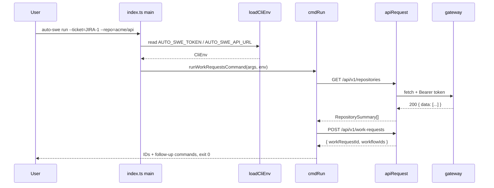

# @auto-swe/cli — Command-Line Client

> Indexed at commit `b1d8930` on 2026-09-08 · [view on GitHub](https://github.com/yorch/auto-swe/tree/b1d8930)

## Relevant source files

- [packages/cli/package.json](https://github.com/yorch/auto-swe/blob/b1d8930/packages/cli/package.json)
- [packages/cli/README.md](https://github.com/yorch/auto-swe/blob/b1d8930/packages/cli/README.md)
- [packages/cli/src/index.ts](https://github.com/yorch/auto-swe/blob/b1d8930/packages/cli/src/index.ts)
- [packages/cli/src/lib/env.ts](https://github.com/yorch/auto-swe/blob/b1d8930/packages/cli/src/lib/env.ts)
- [packages/cli/src/lib/api.ts](https://github.com/yorch/auto-swe/blob/b1d8930/packages/cli/src/lib/api.ts)
- [packages/cli/src/lib/flags.ts](https://github.com/yorch/auto-swe/blob/b1d8930/packages/cli/src/lib/flags.ts)
- [packages/cli/src/lib/format.ts](https://github.com/yorch/auto-swe/blob/b1d8930/packages/cli/src/lib/format.ts)
- [packages/cli/src/commands/workRequests.ts](https://github.com/yorch/auto-swe/blob/b1d8930/packages/cli/src/commands/workRequests.ts)
- [packages/cli/src/commands/workflows.ts](https://github.com/yorch/auto-swe/blob/b1d8930/packages/cli/src/commands/workflows.ts)
- [packages/cli/src/commands/runs.ts](https://github.com/yorch/auto-swe/blob/b1d8930/packages/cli/src/commands/runs.ts)
- [packages/cli/src/commands/tokens.ts](https://github.com/yorch/auto-swe/blob/b1d8930/packages/cli/src/commands/tokens.ts)
- [packages/cli/src/commands/bundle.ts](https://github.com/yorch/auto-swe/blob/b1d8930/packages/cli/src/commands/bundle.ts)
- [packages/cli/src/commands/bundles.ts](https://github.com/yorch/auto-swe/blob/b1d8930/packages/cli/src/commands/bundles.ts)
- [packages/cli/src/commands/evals.ts](https://github.com/yorch/auto-swe/blob/b1d8930/packages/cli/src/commands/evals.ts)

## Overview

`@auto-swe/cli` publishes a single `auto-swe` binary — an ESM Node 26+ program that is a thin client over the gateway REST API. It submits work requests, manages workflow templates and runs, issues personal access tokens, distributes library bundles, and gates on eval regressions from a terminal or a CI job. Its runtime dependencies are two workspace packages, `@auto-swe/sdk` and `@auto-swe/shared`; there is no argument-parsing, HTTP, or table-rendering library in the tree, so every one of those concerns is a small file under `src/lib/`.

The package declares `bin.auto-swe` pointing at `dist/index.js`, is `"type": "module"`, and builds with plain `tsc` into `dist/` ([packages/cli/package.json#L5-L14](https://github.com/yorch/auto-swe/blob/b1d8930/packages/cli/package.json#L5-L14)). Every command group is a `run<Group>Command(args, env)` function exported from `src/commands/`, and `src/index.ts` is the only file that maps a verb to one of them.

Sources: [packages/cli/package.json:L1-L25](https://github.com/yorch/auto-swe/blob/b1d8930/packages/cli/package.json#L1-L25) [packages/cli/README.md:L1-L20](https://github.com/yorch/auto-swe/blob/b1d8930/packages/cli/README.md#L1-L20)

## Architecture

```mermaid
flowchart LR
    argv[/argv/] --> index[index.ts main]
    index -->|no token needed| bundle[commands/bundle.ts]
    index --> loadCliEnv[lib/env.ts loadCliEnv]
    loadCliEnv --> workRequests[commands/workRequests.ts]
    loadCliEnv --> workflows[commands/workflows.ts]
    loadCliEnv --> runs[commands/runs.ts]
    loadCliEnv --> tokens[commands/tokens.ts]
    loadCliEnv --> bundles[commands/bundles.ts]
    loadCliEnv --> evals[commands/evals.ts]

    workflows -.-> api[lib/api.ts apiRequest]
    runs -.-> api
    tokens -.-> api
    bundles -.-> api
    evals -.-> api
    workRequests -.-> api
    bundle -.-> sdk[(@auto-swe/sdk)]
    api --> gateway[(gateway REST API)]
```

`main` splits the argument vector into a command verb and the rest, then hands the rest to one command module. The `bundle` branch is dispatched *before* credentials are resolved, so local authoring works with no token and no gateway reachable; every other branch runs after `loadCliEnv()` and shares the `lib/api.ts` fetch wrapper.

Sources: [packages/cli/src/index.ts:L74-L112](https://github.com/yorch/auto-swe/blob/b1d8930/packages/cli/src/index.ts#L74-L112) [packages/cli/src/lib/api.ts:L24-L63](https://github.com/yorch/auto-swe/blob/b1d8930/packages/cli/src/lib/api.ts#L24-L63)

## Module Layout

| Module | Path | Responsibility |
| ------ | ---- | -------------- |
| `main` | `src/index.ts` | Help text, verb dispatch, entry-point detection, process exit code |
| `loadCliEnv` | `src/lib/env.ts` | Resolve API base URL and bearer token from the environment |
| `apiRequest` | `src/lib/api.ts` | Bearer-decorated fetch, JSON parse, `GatewayError`, exit-code mapping |
| `parseFlags` | `src/lib/flags.ts` | `--flag=value` / `--flag value` / `-o value` parsing |
| `pad` | `src/lib/format.ts` | Fixed-width column padding and positive-integer flag parsing |
| `runWorkRequestsCommand` | `src/commands/workRequests.ts` | `auto-swe run` — submit a work request |
| `runWorkflowsCommand` | `src/commands/workflows.ts` | Template list, show, export, import, run, generate, explain |
| `runRunsCommand` | `src/commands/runs.ts` | Run list, show, tail |
| `runTokensCommand` | `src/commands/tokens.ts` | Personal access token list, create, revoke |
| `runBundleCommand` | `src/commands/bundle.ts` | Token-free local bundle authoring over `@auto-swe/sdk` |
| `runBundlesCommand` | `src/commands/bundles.ts` | Admin bundle list, export, install |
| `runEvalsCommand` | `src/commands/evals.ts` | Eval datasets, captured signals, regression gate |

Sources: [packages/cli/src/index.ts:L1-L11](https://github.com/yorch/auto-swe/blob/b1d8930/packages/cli/src/index.ts#L1-L11)

## Command Surface

Every gateway-backed command reaches exactly one route family. Gateway internals are documented separately in [3. Gateway API](./3-gateway-api.md).

| Command | Gateway route | Needs a token |
| ------- | ------------- | ------------- |
| `run` | `GET /api/v1/repositories`, `POST /api/v1/work-requests` | yes |
| `workflows list` / `show` / `export` | `GET /api/v1/workflow-templates`, `/{id}`, `/{id}/versions/{n}` | yes |
| `workflows import` | `POST /api/v1/workflow-templates` or `/{id}/versions` | yes |
| `workflows run` | `POST /api/v1/workflow-templates/{id}/runs` | yes |
| `workflows generate` | `POST /api/v1/workflow-templates/generate` | yes |
| `workflows explain` | `POST /api/v1/workflow-templates/{id}/explain` | yes |
| `runs list` / `show` / `tail` | `GET /api/v1/workflow-runs`, `/{id}` | yes |
| `tokens list` / `create` / `revoke` | `GET`/`POST`/`DELETE /api/v1/auth/tokens` | yes |
| `bundle init` / `validate` / `sign` | none — local files and `@auto-swe/sdk` | no |
| `bundles list` / `export` / `install` / `install-from-url` | `/api/v1/platform/bundles` and its `export`, `install`, `install-from-url` children | admin |
| `evals list` / `show` / `results` / `run` | `/api/v1/platform/evals`, `/{id}`, `/results`, `/runs` | admin |

The singular/plural split is deliberate: `bundle` authors a manifest offline, `bundles` moves one through the platform. Cross-reference the authoring helpers in [7. Bundle SDK](./7-bundle-sdk.md).

Sources: [packages/cli/src/commands/workflows.ts:L63-L322](https://github.com/yorch/auto-swe/blob/b1d8930/packages/cli/src/commands/workflows.ts#L63-L322) [packages/cli/src/commands/bundles.ts:L67-L158](https://github.com/yorch/auto-swe/blob/b1d8930/packages/cli/src/commands/bundles.ts#L67-L158) [packages/cli/src/commands/evals.ts:L52-L157](https://github.com/yorch/auto-swe/blob/b1d8930/packages/cli/src/commands/evals.ts#L52-L157)

## Key Components

### Entry point and dispatch

`main(argv)` returns a number rather than calling `process.exit`, and is exported so tests can drive it directly ([packages/cli/src/index.ts#L116](https://github.com/yorch/auto-swe/blob/b1d8930/packages/cli/src/index.ts#L116)). The script only executes when it is the module Node was asked to run, decided by `isEntryPoint()`: it compares `import.meta.url` against `pathToFileURL(realpathSync(process.argv[1])).href`. The realpath and URL-encoding round trip matters because `process.argv[1]` is whatever the user typed — the `node_modules/.bin/auto-swe` symlink, a relative path, or a path containing spaces — and a naive string compare makes the installed binary silently do nothing.

Sources: [packages/cli/src/index.ts:L74-L146](https://github.com/yorch/auto-swe/blob/b1d8930/packages/cli/src/index.ts#L74-L146)

### Authentication

Auth is one environment variable. `loadCliEnv()` reads `AUTO_SWE_TOKEN`, trims it, and returns it alongside `AUTO_SWE_API_URL` with any trailing slash stripped; the base URL defaults to `http://localhost:8080`. A missing or blank token throws, and `main` turns that throw into a one-line message on stderr and exit code 1 ([packages/cli/src/index.ts#L85-L91](https://github.com/yorch/auto-swe/blob/b1d8930/packages/cli/src/index.ts#L85-L91)).

Tokens are never cached to disk and are re-read once per process. The accepted value is an `ats_*` personal access token minted at Settings → API tokens in the dashboard or with `auto-swe tokens create`; a short-lived JWT from the session-token bridge also works, because the CLI does nothing with the token but put it in an `Authorization: Bearer` header. Password sign-in is a browser-only better-auth flow and has no CLI path.

Sources: [packages/cli/src/lib/env.ts:L1-L24](https://github.com/yorch/auto-swe/blob/b1d8930/packages/cli/src/lib/env.ts#L1-L24) [packages/cli/README.md:L23-L39](https://github.com/yorch/auto-swe/blob/b1d8930/packages/cli/README.md#L23-L39)

### The HTTP wrapper and its error handling

`requestEnvelope` is the single fetch call in the package. It sets the bearer header, adds `Content-Type: application/json` only when a body is present, reads the response as text, and parses it through `safeParseJson`, which swallows a parse failure and yields `{}` rather than throwing on a non-JSON error page. On a non-2xx status it throws a `GatewayError` carrying the status, the gateway's `error.code` (falling back to `HTTP_ERROR`), and its `error.message` (falling back to `HTTP <status>`).

Two public wrappers sit on top. `apiRequest<T>` returns `json.data ?? json`, unwrapping the gateway's `{ data }` envelope; `apiRequestFull<T>` returns the whole envelope, used where an endpoint puts sibling fields beside `data` — the workflow generator's `summary`, `attempts` and `warnings`, and the eval results endpoint's `meta.total`.

`runWithExitCodes(fn)` is where the documented exit codes are defined exactly once: a `GatewayError` prints `code: message` to stderr and returns 2, anything else prints the message and returns 1. Every gateway-backed dispatcher wraps its subcommand table in it. Because that table must also report an unmatched subcommand, `UNKNOWN_SUBCOMMAND` is the sentinel `-1` — negative so it can never collide with a real exit code — and each dispatcher checks for it after the wrapper returns ([packages/cli/src/commands/runs.ts#L46-L52](https://github.com/yorch/auto-swe/blob/b1d8930/packages/cli/src/commands/runs.ts#L46-L52)).

Sources: [packages/cli/src/lib/api.ts:L1-L111](https://github.com/yorch/auto-swe/blob/b1d8930/packages/cli/src/lib/api.ts#L1-L111)

### Argument parsing

`parseFlags` walks the argument list once and accepts three forms: `--flag=value`, `--flag value`, and a single-dash `-o value` restricted to two-character tokens. A flag whose next argument starts with `-`, or that ends the list, is stored as the sentinel `FLAG_PRESENT` — the literal string `'true'`. Everything else accumulates into `positional`.

That sentinel is the source of a whole class of near-bugs, so two helpers exist to catch it. `missingValue(flags, ...keys)` returns the first named key holding the sentinel, letting a command refuse `--name` with nothing after it instead of creating a template literally called `true` ([packages/cli/src/commands/workflows.ts#L158-L162](https://github.com/yorch/auto-swe/blob/b1d8930/packages/cli/src/commands/workflows.ts#L158-L162)). `parseOptionalPositiveInt` in `format.ts` rejects both `'true'` and any non-numeric, non-positive, or non-canonical value, returning the string `'invalid'` for callers to turn into a usage hint. `parsePositiveInt` is the same check with a fallback for the absent case. `tokens create` uses the optional form specifically because an older truthy check silently issued a non-expiring token for `--expires-in-days=` ([packages/cli/src/commands/tokens.ts#L89-L96](https://github.com/yorch/auto-swe/blob/b1d8930/packages/cli/src/commands/tokens.ts#L89-L96)).

Sources: [packages/cli/src/lib/flags.ts:L1-L63](https://github.com/yorch/auto-swe/blob/b1d8930/packages/cli/src/lib/flags.ts#L1-L63) [packages/cli/src/lib/format.ts:L1-L43](https://github.com/yorch/auto-swe/blob/b1d8930/packages/cli/src/lib/format.ts#L1-L43)

### Output formatting

Listing commands render a fixed-width table by hand. `pad(s, w)` right-fills to the column width, or truncates to `w - 1` characters plus a trailing space when the value is too long, so columns never run together. Each list command writes an uppercase header line then one `pad`-composed line per row — `workflows list` uses 32/16/9/9 columns, `runs list` 38/18/12/6, `tokens list` 38/22/16/26, `bundles list` 28/12/12/18.

Detail commands print JSON instead: `workflows show` and `runs show` emit `JSON.stringify(value, null, 2)` to stdout, which makes them pipeable into `jq`. The stdout/stderr split is deliberate throughout — `tokens create` writes the plaintext token to stdout and its human-readable confirmation to stderr so a CI job can do `auto-swe tokens create ci > token.txt`, and `workflows export` and `bundles export` write the payload to stdout only when no `-o` path was given, sending the "Wrote …" line to stderr either way.

Sources: [packages/cli/src/lib/format.ts:L5-L10](https://github.com/yorch/auto-swe/blob/b1d8930/packages/cli/src/lib/format.ts#L5-L10) [packages/cli/src/commands/tokens.ts:L82-L108](https://github.com/yorch/auto-swe/blob/b1d8930/packages/cli/src/commands/tokens.ts#L82-L108) [packages/cli/src/commands/workflows.ts:L106-L136](https://github.com/yorch/auto-swe/blob/b1d8930/packages/cli/src/commands/workflows.ts#L106-L136)

### `run` — work request submission

`auto-swe run` is the only top-level verb with no subcommand; `runWorkRequestsCommand` treats every argument as a flag. It validates `--ticket` and `--description` as required, requires exactly one of `--repo` and `--repo-id`, and upper-cases `--budget` against `STANDARD`, `LARGE`, `EPIC`. A `--workflow` flag is refused with an explicit message rather than ignored, because the work-request endpoint has no template field and always runs the repository's team default; `workflows run` is the path to a specific template.

Repository resolution takes one of two paths. `--repo-id` is regex-checked as a UUID and used directly. `--repo=org/name` costs an extra `GET /api/v1/repositories` and a case-insensitive match on `organizationName` and `repoName`, with a not-found message pointing at the dashboard's repositories page. The submission itself is a `POST /api/v1/work-requests` with `externalTicketId`, `description`, `budgetTier` and a single-element `repoIds`, and the command prints the returned work-request and workflow IDs plus the two follow-up commands to monitor the run.

Sources: [packages/cli/src/commands/workRequests.ts:L38-L131](https://github.com/yorch/auto-swe/blob/b1d8930/packages/cli/src/commands/workRequests.ts#L38-L131)

### `workflows` — template lifecycle

Templates are addressed by name from the terminal, so `findTemplateByName` lists `/api/v1/workflow-templates` and matches exactly; there is no server-side name lookup, and every name-taking subcommand pays for that list. `fetchSpec` then branches: an explicit `--version=N` fetches `/{id}/versions/{n}`, while the default fetches `/{id}` and reads `activeVersionSpec`, throwing a specific message when the template has no active version.

`import` is create-or-version by name: it parses the file, derives a name from the file's basename when `--name` is absent (stripping `.json` and replacing characters outside `[A-Za-z0-9_- ]` with a dash), and posts a new version when a template with that name already exists. Otherwise it creates the template, resolving `--team=<slug>` to an ID through `GET /api/v1/teams` and refusing an unknown slug. `generate` and `explain` are the two AI-backed subcommands; `generate` uses `apiRequestFull` to surface the generator's `summary`, retry `attempts`, and `warnings` beside the created DRAFT template.

Sources: [packages/cli/src/commands/workflows.ts:L140-L200](https://github.com/yorch/auto-swe/blob/b1d8930/packages/cli/src/commands/workflows.ts#L140-L200) [packages/cli/src/commands/workflows.ts:L326-L382](https://github.com/yorch/auto-swe/blob/b1d8930/packages/cli/src/commands/workflows.ts#L326-L382)

### `runs tail` — polling to a verdict

`tail` polls `GET /api/v1/workflow-runs/{id}` every `--interval` seconds (default 5) up to `--max` times (default 180). It prints a line only when `stepSignature` changes — a composite of run status, step count, and the last step's node ID and status — so a long run produces one line per observable change rather than one per poll. The command returns 0 when the run reaches `SUCCESS`, 2 for any other terminal status in `TERMINAL_STATUSES` (`FAILED`, `TIMED_OUT`, `CANCELLED`, `SKIPPED`), and 1 with a "gave up" message when the poll budget is exhausted.

Sources: [packages/cli/src/commands/runs.ts:L112-L158](https://github.com/yorch/auto-swe/blob/b1d8930/packages/cli/src/commands/runs.ts#L112-L158)

### `bundle` — token-free local authoring

`runBundleCommand` takes no `CliEnv` at all and wraps its subcommands in a plain try/catch that returns 1, since no `GatewayError` can arise. `validate` parses a manifest file and calls `validateBundle` from `@auto-swe/sdk`, printing per-error lines on failure or a one-line entity census on success. `sign` re-validates before signing — so a tampered or hash-mismatched manifest is never signed — reads a PEM private key, and calls `signBundle` for a detached ed25519 signature. `init` scaffolds `package.json`, `tsconfig.json`, `src/bundle.ts` and a README through `writeIfAbsent`, which opens with the `wx` flag and reports a skip on `EEXIST` rather than clobbering author work.

Sources: [packages/cli/src/commands/bundle.ts:L21-L138](https://github.com/yorch/auto-swe/blob/b1d8930/packages/cli/src/commands/bundle.ts#L21-L138)

### `bundles` and `evals` — admin surfaces

`bundles` posts a parsed manifest to `/api/v1/platform/bundles/install`, or a URL to `install-from-url`, and prints the returned trust state, signer, per-entity counts, and any warnings on stderr. `evals run` is the regression gate: it resolves a dataset slug to an ID, starts a run, then polls `/api/v1/platform/evals/runs/{id}` every 15 seconds against a hard-coded four-hour deadline, exiting 1 when the final status is `REGRESSION`, 0 otherwise, and 2 on the timeout.

Sources: [packages/cli/src/commands/bundles.ts:L120-L169](https://github.com/yorch/auto-swe/blob/b1d8930/packages/cli/src/commands/bundles.ts#L120-L169) [packages/cli/src/commands/evals.ts:L79-L122](https://github.com/yorch/auto-swe/blob/b1d8930/packages/cli/src/commands/evals.ts#L79-L122)

## Data Flow



A non-2xx anywhere in that sequence becomes a `GatewayError` inside `apiRequest`, which `runWithExitCodes` converts into a `code: message` line and exit code 2 without the command handler seeing it.

Sources: [packages/cli/src/commands/workRequests.ts:L96-L131](https://github.com/yorch/auto-swe/blob/b1d8930/packages/cli/src/commands/workRequests.ts#L96-L131) [packages/cli/src/lib/api.ts:L92-L103](https://github.com/yorch/auto-swe/blob/b1d8930/packages/cli/src/lib/api.ts#L92-L103)

## Configuration & Extension Points

| Name | Type | Default | Purpose |
| ---- | ---- | ------- | ------- |
| `AUTO_SWE_API_URL` | env var | `http://localhost:8080` | Gateway base URL; a trailing slash is stripped |
| `AUTO_SWE_TOKEN` | env var | — | Bearer credential: an `ats_*` PAT or a JWT |

Exit codes are a fixed three-value contract, documented in the top-level help text and implemented in `runWithExitCodes`.

| Code | Meaning |
| ---- | ------- |
| `0` | Success |
| `1` | User error — missing argument, absent token, unknown subcommand; also `evals run` on a regression and `runs tail` on exhausting its polls |
| `2` | Remote error — any non-2xx from the gateway; also `runs tail` on a non-success terminal status and `evals run` on its four-hour timeout |

Two flags exist in code without appearing in the help text: `runs list` accepts `--work-request-id`, which it forwards as the `workRequestId` query parameter ([packages/cli/src/commands/runs.ts#L75-L77](https://github.com/yorch/auto-swe/blob/b1d8930/packages/cli/src/commands/runs.ts#L75-L77)), and `workflows export` accepts `--version=N` ([packages/cli/src/commands/workflows.ts#L113-L117](https://github.com/yorch/auto-swe/blob/b1d8930/packages/cli/src/commands/workflows.ts#L113-L117)). The `--limit` on `evals results` is the one numeric flag that bypasses `parsePositiveInt`; it is forwarded to the query string as a raw string with a `'50'` default ([packages/cli/src/commands/evals.ts#L140](https://github.com/yorch/auto-swe/blob/b1d8930/packages/cli/src/commands/evals.ts#L140)).

Sources: [packages/cli/src/index.ts:L62-L72](https://github.com/yorch/auto-swe/blob/b1d8930/packages/cli/src/index.ts#L62-L72) [packages/cli/src/lib/env.ts:L15-L23](https://github.com/yorch/auto-swe/blob/b1d8930/packages/cli/src/lib/env.ts#L15-L23)

## Testing

Every command module has a co-located Vitest file. The pattern is uniform: capture and replace `process.stdout.write` and `process.stderr.write` in `beforeEach`, stub `globalThis.fetch` per test, restore both in `afterEach`, and assert on the returned exit code plus the captured output. Because each `run<Group>Command` takes `env` as a parameter, the tests pass a literal `{ apiUrl: 'http://gw', token: 't' }` and never touch the real environment. The bundle tests are the exception that needs a filesystem, using `fs.mkdtemp` under the OS temp directory and removing it afterwards.

Sources: [packages/cli/src/commands/workRequests.test.ts:L1-L45](https://github.com/yorch/auto-swe/blob/b1d8930/packages/cli/src/commands/workRequests.test.ts#L1-L45) [packages/cli/src/commands/bundle.test.ts:L1-L40](https://github.com/yorch/auto-swe/blob/b1d8930/packages/cli/src/commands/bundle.test.ts#L1-L40)

## Related Pages

- Gateway routes every command calls: [3. Gateway API](./3-gateway-api.md)
- Bundle authoring helpers behind `auto-swe bundle`: [7. Bundle SDK](./7-bundle-sdk.md)
- Shared API DTOs the commands type against: [2. Shared Library](./2-shared-library.md)
- Workflow execution the CLI starts and tails: [4. Temporal Worker](./4-temporal-worker.md)
- The dashboard equivalent of these commands: [5. Web Dashboard](./5-web-dashboard.md)
- Monorepo layout and build: [1. Repository Structure](./1-repository-structure.md)
