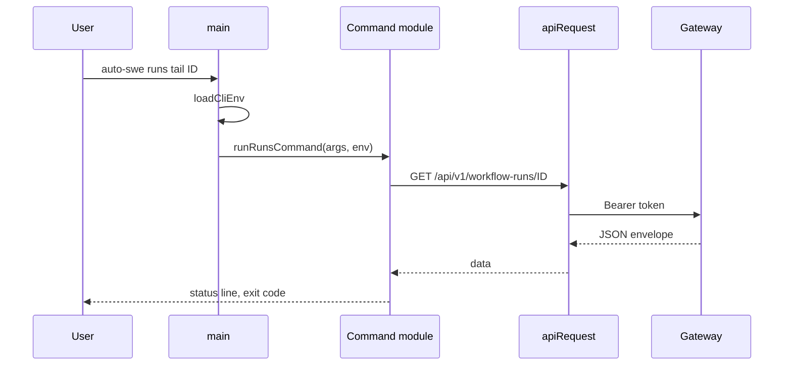

# CLI (auto-swe command)

> Indexed at commit `d0a90fb5` on 2026-10-06 · [view on GitHub](https://github.com/yorch/auto-swe/tree/d0a90fb5)

## Relevant source files

- [packages/cli/src/index.ts](https://github.com/yorch/auto-swe/blob/d0a90fb5/packages/cli/src/index.ts)
- [packages/cli/src/lib/api.ts](https://github.com/yorch/auto-swe/blob/d0a90fb5/packages/cli/src/lib/api.ts)
- [packages/cli/src/lib/env.ts](https://github.com/yorch/auto-swe/blob/d0a90fb5/packages/cli/src/lib/env.ts)
- [packages/cli/src/lib/flags.ts](https://github.com/yorch/auto-swe/blob/d0a90fb5/packages/cli/src/lib/flags.ts)
- [packages/cli/src/lib/format.ts](https://github.com/yorch/auto-swe/blob/d0a90fb5/packages/cli/src/lib/format.ts)
- [packages/cli/src/lib/time.ts](https://github.com/yorch/auto-swe/blob/d0a90fb5/packages/cli/src/lib/time.ts)
- [packages/cli/src/commands/workRequests.ts](https://github.com/yorch/auto-swe/blob/d0a90fb5/packages/cli/src/commands/workRequests.ts)
- [packages/cli/src/commands/agent.ts](https://github.com/yorch/auto-swe/blob/d0a90fb5/packages/cli/src/commands/agent.ts)
- [packages/cli/src/commands/runs.ts](https://github.com/yorch/auto-swe/blob/d0a90fb5/packages/cli/src/commands/runs.ts)
- [packages/cli/src/commands/workflows.ts](https://github.com/yorch/auto-swe/blob/d0a90fb5/packages/cli/src/commands/workflows.ts)
- [packages/cli/src/commands/tokens.ts](https://github.com/yorch/auto-swe/blob/d0a90fb5/packages/cli/src/commands/tokens.ts)
- [packages/cli/src/commands/bundle.ts](https://github.com/yorch/auto-swe/blob/d0a90fb5/packages/cli/src/commands/bundle.ts)
- [packages/cli/src/commands/bundles.ts](https://github.com/yorch/auto-swe/blob/d0a90fb5/packages/cli/src/commands/bundles.ts)
- [packages/cli/src/commands/skills.ts](https://github.com/yorch/auto-swe/blob/d0a90fb5/packages/cli/src/commands/skills.ts)
- [packages/cli/src/commands/evals.ts](https://github.com/yorch/auto-swe/blob/d0a90fb5/packages/cli/src/commands/evals.ts)
- [packages/cli/package.json](https://github.com/yorch/auto-swe/blob/d0a90fb5/packages/cli/package.json)

## Overview

The `auto-swe` command is a thin Node.js client over the gateway's REST API. The package `@auto-swe/cli` declares `dist/index.js` as its `auto-swe` binary and depends only on `@auto-swe/sdk` and `@auto-swe/shared` ([packages/cli/package.json:L1-L25](https://github.com/yorch/auto-swe/blob/d0a90fb5/packages/cli/package.json#L1-L25)). It has no argument-parsing framework: a hand-written dispatcher in `index.ts` routes the first word to a command module, and each module routes its own subcommands.

Authentication is token-only. `loadCliEnv` reads `AUTO_SWE_API_URL` (default `http://localhost:8080`) and `AUTO_SWE_TOKEN`, a personal access token or other bearer the gateway accepts, and does not cache the token on disk ([packages/cli/src/lib/env.ts:L1-L24](https://github.com/yorch/auto-swe/blob/d0a90fb5/packages/cli/src/lib/env.ts#L1-L24)). One command group, `bundle` (singular), runs entirely locally and needs no token.

Sources: [packages/cli/package.json:L1-L25](https://github.com/yorch/auto-swe/blob/d0a90fb5/packages/cli/package.json#L1-L25) [packages/cli/src/lib/env.ts:L1-L24](https://github.com/yorch/auto-swe/blob/d0a90fb5/packages/cli/src/lib/env.ts#L1-L24) [packages/cli/src/index.ts:L97-L141](https://github.com/yorch/auto-swe/blob/d0a90fb5/packages/cli/src/index.ts#L97-L141)

## Architecture

```mermaid
flowchart LR
    main["main (index.ts)"] --> env[loadCliEnv]
    main --> bundle["bundle (local)"]
    env --> run[run]
    env --> agent[agent]
    env --> workflows
    env --> runs
    env --> tokens
    env --> bundles
    env --> skills
    env --> evals
    run --> api["apiRequest / runWithExitCodes"]
    agent --> api
    workflows --> api
    runs --> api
    tokens --> api
    bundles --> api
    skills --> api
    evals --> api
    api --> GW[(Gateway REST API)]
    bundle -.uses.-> SDK[(@auto-swe/sdk)]
```

`main` handles help, dispatches `bundle` before credentials are resolved so it works offline, then calls `loadCliEnv` and hands the `CliEnv` to the remaining command modules. Every gateway-backed module goes through the shared helpers in `lib/api.ts`.

Sources: [packages/cli/src/index.ts:L97-L141](https://github.com/yorch/auto-swe/blob/d0a90fb5/packages/cli/src/index.ts#L97-L141) [packages/cli/src/lib/api.ts:L1-L144](https://github.com/yorch/auto-swe/blob/d0a90fb5/packages/cli/src/lib/api.ts#L1-L144)

## Module Layout

| Module | Path | Responsibility |
| ------ | ---- | -------------- |
| Entry and dispatcher | `packages/cli/src/index.ts` | Help text, top-level routing, entry-point detection |
| HTTP client | `packages/cli/src/lib/api.ts` | Bearer-authenticated fetch, typed errors, exit-code mapping |
| Environment | `packages/cli/src/lib/env.ts` | Resolve gateway URL and token |
| Flag parser | `packages/cli/src/lib/flags.ts` | `--flag=value`, `--flag value`, `-o value` parsing |
| Formatting | `packages/cli/src/lib/format.ts` | Column padding, positive-integer flag parsing |
| `run` | `packages/cli/src/commands/workRequests.ts` | Submit a work request |
| `agent` | `packages/cli/src/commands/agent.ts` | Launch and re-run library agents |
| `workflows` | `packages/cli/src/commands/workflows.ts` | Template CRUD, run, AI generate and explain |
| `runs` | `packages/cli/src/commands/runs.ts` | List, show and tail workflow runs |
| `tokens` | `packages/cli/src/commands/tokens.ts` | Personal access token lifecycle |
| `bundle` | `packages/cli/src/commands/bundle.ts` | Local bundle scaffold, validate, sign |
| `bundles` | `packages/cli/src/commands/bundles.ts` | Gateway bundle list, export, install |
| `skills` | `packages/cli/src/commands/skills.ts` | External skill sources |
| `evals` | `packages/cli/src/commands/evals.ts` | Eval datasets and the regression gate |

Sources: [packages/cli/src/index.ts:L1-L13](https://github.com/yorch/auto-swe/blob/d0a90fb5/packages/cli/src/index.ts#L1-L13) [packages/cli/src/lib/flags.ts:L1-L63](https://github.com/yorch/auto-swe/blob/d0a90fb5/packages/cli/src/lib/flags.ts#L1-L63) [packages/cli/src/lib/format.ts:L1-L43](https://github.com/yorch/auto-swe/blob/d0a90fb5/packages/cli/src/lib/format.ts#L1-L43)

## Key Components

### Dispatcher and entry point

`main(argv)` prints the `HELP` text for no command, `help`, `-h` or `--help`, and returns exit code 1 with the help for an unknown command ([packages/cli/src/index.ts:L97-L141](https://github.com/yorch/auto-swe/blob/d0a90fb5/packages/cli/src/index.ts#L97-L141)). It is exported so tests import it directly. The script only runs when it is the Node entry point; `isEntryPoint` compares `import.meta.url` against the `realpath` of `process.argv[1]`, which keeps the CLI working when invoked through the `node_modules/.bin/auto-swe` symlink ([packages/cli/src/index.ts:L143-L175](https://github.com/yorch/auto-swe/blob/d0a90fb5/packages/cli/src/index.ts#L143-L175)).

Sources: [packages/cli/src/index.ts:L97-L175](https://github.com/yorch/auto-swe/blob/d0a90fb5/packages/cli/src/index.ts#L97-L175)

### API client and exit codes

`apiRequest` adds the `Authorization: Bearer` header, serializes JSON bodies, and returns the response's `data` field, or the whole body when there is none. `apiRequestFull` returns the complete envelope for endpoints with sibling fields such as pagination `meta` ([packages/cli/src/lib/api.ts:L48-L110](https://github.com/yorch/auto-swe/blob/d0a90fb5/packages/cli/src/lib/api.ts#L48-L110)). A non-2xx response becomes a `GatewayError` carrying the gateway's `error.code` and message; a connection failure becomes a `NetworkError` that names the URL and unwraps `cause` ([packages/cli/src/lib/api.ts:L7-L42](https://github.com/yorch/auto-swe/blob/d0a90fb5/packages/cli/src/lib/api.ts#L7-L42)).

`runWithExitCodes` is the single place exit codes are assigned for gateway commands: a `GatewayError` yields 2, any other thrown error yields 1. Subcommand dispatchers return the `UNKNOWN_SUBCOMMAND` sentinel (-1) when no branch matches so the caller prints its own usage ([packages/cli/src/lib/api.ts:L112-L136](https://github.com/yorch/auto-swe/blob/d0a90fb5/packages/cli/src/lib/api.ts#L112-L136)).

Sources: [packages/cli/src/lib/api.ts:L7-L136](https://github.com/yorch/auto-swe/blob/d0a90fb5/packages/cli/src/lib/api.ts#L7-L136)

### Flag parsing

`parseFlags` returns `positional` arguments and a string-valued `flags` map. A flag with no value is stored as the sentinel `FLAG_PRESENT` (`'true'`), and `missingValue` lets a command reject `--name` with nothing after it instead of treating "true" as a name ([packages/cli/src/lib/flags.ts:L15-L63](https://github.com/yorch/auto-swe/blob/d0a90fb5/packages/cli/src/lib/flags.ts#L15-L63)). `parsePositiveInt` and `parseOptionalPositiveInt` return `'invalid'` for non-numeric, non-positive or sentinel input so callers print a usage hint and return 1 ([packages/cli/src/lib/format.ts:L12-L43](https://github.com/yorch/auto-swe/blob/d0a90fb5/packages/cli/src/lib/format.ts#L12-L43)).

Sources: [packages/cli/src/lib/flags.ts:L1-L63](https://github.com/yorch/auto-swe/blob/d0a90fb5/packages/cli/src/lib/flags.ts#L1-L63) [packages/cli/src/lib/format.ts:L1-L43](https://github.com/yorch/auto-swe/blob/d0a90fb5/packages/cli/src/lib/format.ts#L1-L43)

### Work requests and agent runs

`auto-swe run` requires `--ticket`, `--description` and exactly one of `--repo=<org/name>` or `--repo-id=<uuid>`, validates `--budget` against `STANDARD`, `LARGE` and `EPIC`, and POSTs to `/api/v1/work-requests`. It rejects `--workflow` because the endpoint always runs the team default template; `workflows run` is the path for a specific template ([packages/cli/src/commands/workRequests.ts:L84-L198](https://github.com/yorch/auto-swe/blob/d0a90fb5/packages/cli/src/commands/workRequests.ts#L84-L198)). `findRepoByName` pages through `/api/v1/repositories` in pages of 500 until the name matches ([packages/cli/src/commands/workRequests.ts:L40-L72](https://github.com/yorch/auto-swe/blob/d0a90fb5/packages/cli/src/commands/workRequests.ts#L40-L72)).

`agent run <key[@version]> "<prompt>"` posts to `/api/v1/agent-runs` with `deliver` (`none`, `branch` or `draft_pr`), optional `maxSteps` and `maxWallClockSeconds`, and an optional `Idempotency-Key` header. The prompt comes from the second argument, from `--prompt=-` (stdin) or from `--prompt=@file` ([packages/cli/src/commands/agent.ts:L98-L113](https://github.com/yorch/auto-swe/blob/d0a90fb5/packages/cli/src/commands/agent.ts#L98-L113), [packages/cli/src/commands/agent.ts:L147-L223](https://github.com/yorch/auto-swe/blob/d0a90fb5/packages/cli/src/commands/agent.ts#L147-L223)). `agent rerun` posts to `/api/v1/agent-runs/{id}/rerun`. With `--wait`, `waitForRun` first polls for the run row, then polls it to a terminal status and exits 0 only on `SUCCESS`, otherwise 2 ([packages/cli/src/commands/agent.ts:L259-L296](https://github.com/yorch/auto-swe/blob/d0a90fb5/packages/cli/src/commands/agent.ts#L259-L296)).

Sources: [packages/cli/src/commands/workRequests.ts:L84-L198](https://github.com/yorch/auto-swe/blob/d0a90fb5/packages/cli/src/commands/workRequests.ts#L84-L198) [packages/cli/src/commands/agent.ts:L147-L296](https://github.com/yorch/auto-swe/blob/d0a90fb5/packages/cli/src/commands/agent.ts#L147-L296)

### Workflows and runs

`workflows` implements `list`, `show`, `export`, `import`, `run`, `generate` and `explain` ([packages/cli/src/commands/workflows.ts:L32-L67](https://github.com/yorch/auto-swe/blob/d0a90fb5/packages/cli/src/commands/workflows.ts#L32-L67)). Template names are unique per team, so `findTemplateByName` filters by the `--team=<slug>` or `--global` scope and throws when a name matches more than one template rather than picking one silently ([packages/cli/src/commands/workflows.ts:L432-L490](https://github.com/yorch/auto-swe/blob/d0a90fb5/packages/cli/src/commands/workflows.ts#L432-L490)). `workflows run` parses `--payload` as JSON and POSTs to `/api/v1/workflow-templates/{id}/runs` ([packages/cli/src/commands/workflows.ts:L339-L386](https://github.com/yorch/auto-swe/blob/d0a90fb5/packages/cli/src/commands/workflows.ts#L339-L386)). `generate` starts an asynchronous job at `/api/v1/workflow-templates/generate/jobs`, polls every 2 seconds up to a 10-minute ceiling, and reports a created DRAFT template ([packages/cli/src/commands/workflows.ts:L232-L310](https://github.com/yorch/auto-swe/blob/d0a90fb5/packages/cli/src/commands/workflows.ts#L232-L310)).

`runs list` filters by status, template and work request (default limit 20), `runs show` prints the run as JSON, and `runs tail` polls every 5 seconds for up to 180 polls, printing a line only when the status, step count or last step changes. It exits 0 on `SUCCESS`, 2 for any other terminal status, and 1 when it gives up ([packages/cli/src/commands/runs.ts:L57-L158](https://github.com/yorch/auto-swe/blob/d0a90fb5/packages/cli/src/commands/runs.ts#L57-L158)).

Sources: [packages/cli/src/commands/workflows.ts:L32-L490](https://github.com/yorch/auto-swe/blob/d0a90fb5/packages/cli/src/commands/workflows.ts#L32-L490) [packages/cli/src/commands/runs.ts:L22-L158](https://github.com/yorch/auto-swe/blob/d0a90fb5/packages/cli/src/commands/runs.ts#L22-L158)

### Bundles, skills, tokens and evals

`bundle init|validate|sign` is local: it uses `validateBundle` and `signBundle` from `@auto-swe/sdk`, re-validates before signing, and scaffolds a project with `package.json`, `tsconfig.json`, `src/bundle.ts` and a README ([packages/cli/src/commands/bundle.ts:L46-L134](https://github.com/yorch/auto-swe/blob/d0a90fb5/packages/cli/src/commands/bundle.ts#L46-L134)). `bundles list|export|install|install-from-url` needs an admin token and talks to the gateway; `--overwrite-protected` allows replacing a built-in or admin-authored agent ([packages/cli/src/commands/bundles.ts:L13-L25](https://github.com/yorch/auto-swe/blob/d0a90fb5/packages/cli/src/commands/bundles.ts#L13-L25)).

`skills sources` supports `list`, `add`, `check`, `diff` and `accept`. Confirmation prompts go through an injectable `Confirm` function that answers no when stdin is not a terminal, and server-supplied strings have control characters replaced before printing ([packages/cli/src/commands/skills.ts:L79-L138](https://github.com/yorch/auto-swe/blob/d0a90fb5/packages/cli/src/commands/skills.ts#L79-L138)). `tokens` issues, lists and revokes personal access tokens, printing the plaintext token once on stdout ([packages/cli/src/commands/tokens.ts:L6-L58](https://github.com/yorch/auto-swe/blob/d0a90fb5/packages/cli/src/commands/tokens.ts#L6-L58)).

`evals run <slug> --candidate=<ref> --against=<ref>` resolves the dataset slug, starts a run at `/api/v1/platform/evals/runs`, and polls every 15 seconds for up to 4 hours ([packages/cli/src/commands/evals.ts:L107-L175](https://github.com/yorch/auto-swe/blob/d0a90fb5/packages/cli/src/commands/evals.ts#L107-L175)). `evalRunExitCode` maps `SUCCESS` to 0, `REGRESSION` to 1, and everything else, including a partial `SUCCESS`, to 2 so CI never reads an incomplete run as a pass ([packages/cli/src/commands/evals.ts:L186-L201](https://github.com/yorch/auto-swe/blob/d0a90fb5/packages/cli/src/commands/evals.ts#L186-L201)).

Sources: [packages/cli/src/commands/bundle.ts:L22-L134](https://github.com/yorch/auto-swe/blob/d0a90fb5/packages/cli/src/commands/bundle.ts#L22-L134) [packages/cli/src/commands/bundles.ts:L13-L60](https://github.com/yorch/auto-swe/blob/d0a90fb5/packages/cli/src/commands/bundles.ts#L13-L60) [packages/cli/src/commands/skills.ts:L79-L138](https://github.com/yorch/auto-swe/blob/d0a90fb5/packages/cli/src/commands/skills.ts#L79-L138) [packages/cli/src/commands/tokens.ts:L35-L58](https://github.com/yorch/auto-swe/blob/d0a90fb5/packages/cli/src/commands/tokens.ts#L35-L58) [packages/cli/src/commands/evals.ts:L107-L201](https://github.com/yorch/auto-swe/blob/d0a90fb5/packages/cli/src/commands/evals.ts#L107-L201)

## Data Flow

```mermaid
sequenceDiagram
    participant U as User
    participant M as main
    participant C as Command module
    participant A as apiRequest
    participant G as Gateway
    U->>M: auto-swe runs tail ID
    M->>M: loadCliEnv
    M->>C: runRunsCommand(args, env)
    C->>A: GET /api/v1/workflow-runs/ID
    A->>G: Bearer token
    G-->>A: JSON envelope
    A-->>C: data
    C-->>U: status line, exit code
```

Long-running commands (`runs tail`, `agent run --wait`, `workflows generate`, `evals run`) repeat the request inside a polling loop built on the shared `sleep` helper ([packages/cli/src/lib/time.ts:L1-L4](https://github.com/yorch/auto-swe/blob/d0a90fb5/packages/cli/src/lib/time.ts#L1-L4)).

Sources: [packages/cli/src/index.ts:L108-L141](https://github.com/yorch/auto-swe/blob/d0a90fb5/packages/cli/src/index.ts#L108-L141) [packages/cli/src/commands/runs.ts:L114-L151](https://github.com/yorch/auto-swe/blob/d0a90fb5/packages/cli/src/commands/runs.ts#L114-L151)

## Configuration & Extension Points

| Setting | Type | Default | Purpose |
| ------- | ---- | ------- | ------- |
| `AUTO_SWE_API_URL` | env var | `http://localhost:8080` | Gateway base URL; a trailing slash is stripped |
| `AUTO_SWE_TOKEN` | env var | none (required) | Bearer token; absence exits 1 |

Exit codes are 0 for success, 1 for user errors (and regressions in `evals run`), and 2 for remote errors or unsuccessful runs ([packages/cli/src/index.ts:L89-L94](https://github.com/yorch/auto-swe/blob/d0a90fb5/packages/cli/src/index.ts#L89-L94)). A new command group is added by writing a `run<Name>Command(args, env)` function and adding one branch to `main`.

Sources: [packages/cli/src/lib/env.ts:L14-L24](https://github.com/yorch/auto-swe/blob/d0a90fb5/packages/cli/src/lib/env.ts#L14-L24) [packages/cli/src/index.ts:L84-L95](https://github.com/yorch/auto-swe/blob/d0a90fb5/packages/cli/src/index.ts#L84-L95)

## Related Pages

- Bundle authoring SDK: [Bundle SDK](./7-bundle-sdk.md)
- Gateway REST API: [Gateway API](./3-gateway-api.md)
