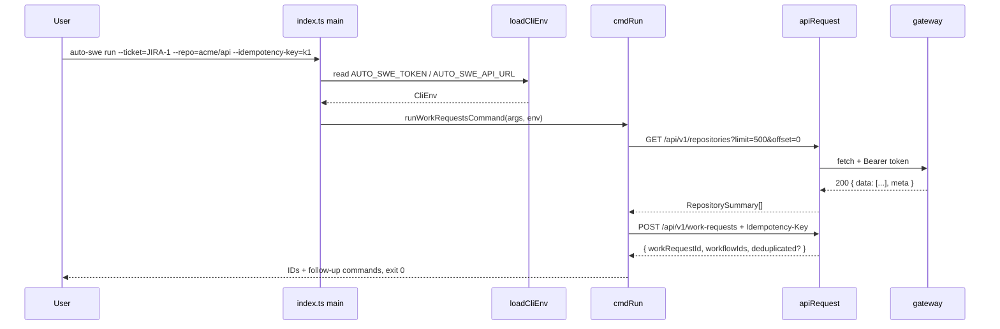

# @auto-swe/cli — Command-Line Client

> Indexed at commit `ae416937` on 2026-10-03 · [view on GitHub](https://github.com/yorch/auto-swe/tree/ae416937)

## Relevant source files

- [packages/cli/package.json](https://github.com/yorch/auto-swe/blob/ae416937/packages/cli/package.json)
- [packages/cli/README.md](https://github.com/yorch/auto-swe/blob/ae416937/packages/cli/README.md)
- [packages/cli/src/index.ts](https://github.com/yorch/auto-swe/blob/ae416937/packages/cli/src/index.ts)
- [packages/cli/src/lib/env.ts](https://github.com/yorch/auto-swe/blob/ae416937/packages/cli/src/lib/env.ts)
- [packages/cli/src/lib/api.ts](https://github.com/yorch/auto-swe/blob/ae416937/packages/cli/src/lib/api.ts)
- [packages/cli/src/lib/flags.ts](https://github.com/yorch/auto-swe/blob/ae416937/packages/cli/src/lib/flags.ts)
- [packages/cli/src/lib/format.ts](https://github.com/yorch/auto-swe/blob/ae416937/packages/cli/src/lib/format.ts)
- [packages/cli/src/lib/time.ts](https://github.com/yorch/auto-swe/blob/ae416937/packages/cli/src/lib/time.ts)
- [packages/cli/src/commands/workRequests.ts](https://github.com/yorch/auto-swe/blob/ae416937/packages/cli/src/commands/workRequests.ts)
- [packages/cli/src/commands/agent.ts](https://github.com/yorch/auto-swe/blob/ae416937/packages/cli/src/commands/agent.ts)
- [packages/cli/src/commands/workflows.ts](https://github.com/yorch/auto-swe/blob/ae416937/packages/cli/src/commands/workflows.ts)
- [packages/cli/src/commands/runs.ts](https://github.com/yorch/auto-swe/blob/ae416937/packages/cli/src/commands/runs.ts)
- [packages/cli/src/commands/tokens.ts](https://github.com/yorch/auto-swe/blob/ae416937/packages/cli/src/commands/tokens.ts)
- [packages/cli/src/commands/bundle.ts](https://github.com/yorch/auto-swe/blob/ae416937/packages/cli/src/commands/bundle.ts)
- [packages/cli/src/commands/bundles.ts](https://github.com/yorch/auto-swe/blob/ae416937/packages/cli/src/commands/bundles.ts)
- [packages/cli/src/commands/evals.ts](https://github.com/yorch/auto-swe/blob/ae416937/packages/cli/src/commands/evals.ts)

## Overview

`@auto-swe/cli` publishes a single `auto-swe` binary — an ESM Node 26+ program that is a thin client over the gateway REST API. It submits work requests, runs a library agent against a repository, manages workflow templates and runs, issues personal access tokens, distributes library bundles, and gates on eval regressions from a terminal or a CI job. Its runtime dependencies are two workspace packages, `@auto-swe/sdk` and `@auto-swe/shared`; there is no argument-parsing, HTTP, or table-rendering library in the tree, so every one of those concerns is a small file under `src/lib/`.

The package declares `bin.auto-swe` pointing at `dist/index.js`, is `"type": "module"`, and builds with plain `tsc` into `dist/` ([packages/cli/package.json#L5-L14](https://github.com/yorch/auto-swe/blob/ae416937/packages/cli/package.json#L5-L14)). Every command group is a `run<Group>Command(args, env)` function exported from `src/commands/`, and `src/index.ts` is the only file that maps a verb to one of them.

Sources: [packages/cli/package.json:L1-L25](https://github.com/yorch/auto-swe/blob/ae416937/packages/cli/package.json#L1-L25) [packages/cli/README.md:L1-L20](https://github.com/yorch/auto-swe/blob/ae416937/packages/cli/README.md#L1-L20)

## Architecture

```mermaid
flowchart LR
    argv[/argv/] --> index[index.ts main]
    index -->|no token needed| bundle[commands/bundle.ts]
    index --> loadCliEnv[lib/env.ts loadCliEnv]
    loadCliEnv --> workRequests[commands/workRequests.ts]
    loadCliEnv --> agent[commands/agent.ts]
    loadCliEnv --> workflows[commands/workflows.ts]
    loadCliEnv --> runs[commands/runs.ts]
    loadCliEnv --> tokens[commands/tokens.ts]
    loadCliEnv --> bundles[commands/bundles.ts]
    loadCliEnv --> evals[commands/evals.ts]

    workflows -.-> api[lib/api.ts apiRequest]
    runs -.-> api
    tokens -.-> api
    bundles -.-> api
    evals -.-> api
    workRequests -.-> api
    agent -.-> api
    agent -.->|findRepoByName| workRequests
    bundle -.-> sdk[(@auto-swe/sdk)]
    api --> gateway[(gateway REST API)]
```

`main` splits the argument vector into a command verb and the rest, then hands the rest to one command module. The `bundle` branch is dispatched *before* credentials are resolved, so local authoring works with no token and no gateway reachable; every other branch runs after `loadCliEnv()` and shares the `lib/api.ts` fetch wrapper. `agent.ts` reuses `findRepoByName` from `workRequests.ts` for `--repo=org/name` resolution.

Sources: [packages/cli/src/index.ts:L90-L131](https://github.com/yorch/auto-swe/blob/ae416937/packages/cli/src/index.ts#L90-L131) [packages/cli/src/lib/api.ts:L48-L96](https://github.com/yorch/auto-swe/blob/ae416937/packages/cli/src/lib/api.ts#L48-L96) [packages/cli/src/commands/agent.ts:L12](https://github.com/yorch/auto-swe/blob/ae416937/packages/cli/src/commands/agent.ts#L12)

## Module Layout

| Module | Path | Responsibility |
| ------ | ---- | -------------- |
| `main` | `src/index.ts` | Help text, verb dispatch, entry-point detection, process exit code |
| `loadCliEnv` | `src/lib/env.ts` | Resolve API base URL and bearer token from the environment |
| `apiRequest` | `src/lib/api.ts` | Bearer-decorated fetch, JSON parse, `GatewayError`, `NetworkError`, exit-code mapping |
| `parseFlags` | `src/lib/flags.ts` | `--flag=value` / `--flag value` / `-o value` parsing |
| `pad` | `src/lib/format.ts` | Fixed-width column padding and positive-integer flag parsing |
| `sleep` | `src/lib/time.ts` | The one sleep every polling command shares |
| `runWorkRequestsCommand` | `src/commands/workRequests.ts` | `auto-swe run` — submit a work request |
| `runAgentCommand` | `src/commands/agent.ts` | `agent run` and `agent rerun` — launch a library agent on a repository |
| `runWorkflowsCommand` | `src/commands/workflows.ts` | Template list, show, export, import, run, generate, explain |
| `runRunsCommand` | `src/commands/runs.ts` | Run list, show, tail |
| `runTokensCommand` | `src/commands/tokens.ts` | Personal access token list, create, revoke |
| `runBundleCommand` | `src/commands/bundle.ts` | Token-free local bundle authoring over `@auto-swe/sdk` |
| `runBundlesCommand` | `src/commands/bundles.ts` | Admin bundle list, export, install |
| `runEvalsCommand` | `src/commands/evals.ts` | Eval datasets, captured signals, regression gate |

Sources: [packages/cli/src/index.ts:L1-L12](https://github.com/yorch/auto-swe/blob/ae416937/packages/cli/src/index.ts#L1-L12) [packages/cli/src/lib/time.ts:L1-L4](https://github.com/yorch/auto-swe/blob/ae416937/packages/cli/src/lib/time.ts#L1-L4)

## Command Surface

Every gateway-backed command reaches a small fixed set of route families. Gateway internals are documented separately in [3. Gateway API](./3-gateway-api.md). The token column is the role the gateway route demands: `none` means the command never contacts the gateway, `user` means the route requires an authenticated caller at ENGINEER role, and `admin` means the route is ADMIN-only.

| Command | Gateway route | Token |
| ------- | ------------- | ----- |
| `run` | `GET /api/v1/repositories` (for `--repo`), `POST /api/v1/work-requests` | user |
| `agent run` | `GET /api/v1/repositories` (for `--repo`), `POST /api/v1/agent-runs`; with `--wait`, `GET /api/v1/workflow-runs?workRequestId=` and `/{id}` | user |
| `agent rerun` | `POST /api/v1/agent-runs/{workRequestId}/rerun`; with `--wait`, the same two `workflow-runs` reads | user |
| `workflows list` / `show` / `export` | `GET /api/v1/workflow-templates`, `/{id}`, `/{id}/versions/{n}` | user |
| `workflows import` | `POST /api/v1/workflow-templates` or `/{id}/versions`; `GET /api/v1/teams` for `--team` | user |
| `workflows run` | `POST /api/v1/workflow-templates/{id}/runs` | user |
| `workflows generate` | `POST /api/v1/workflow-templates/generate/jobs`, polled at `GET .../generate/jobs/{jobId}` | user |
| `workflows explain` | `POST /api/v1/workflow-templates/{id}/explain` | user |
| `runs list` / `show` / `tail` | `GET /api/v1/workflow-runs`, `/{id}` | user |
| `tokens list` / `create` / `revoke` | `GET`/`POST`/`DELETE /api/v1/auth/tokens` | user |
| `bundle init` / `validate` / `sign` | none — local files and `@auto-swe/sdk` | none |
| `bundles list` / `export` / `install` / `install-from-url` | `/api/v1/platform/bundles` and its `export`, `install`, `install-from-url` children | admin |
| `evals list` / `show` / `results` / `run` | `/api/v1/platform/evals`, `/{id}`, `/results`, `/runs`, `/runs/{id}` | admin |

Every mapped path resolves against a registration in the gateway: the route modules are mounted under `/api/v1/agent-runs`, `/api/v1/work-requests`, `/api/v1/workflow-templates`, `/api/v1/workflow-runs`, `/api/v1/auth/tokens`, `/api/v1/teams`, `/api/v1/repositories`, and `/api/v1/platform` (the last carrying bundles and evals). The singular/plural split is deliberate: `bundle` authors a manifest offline, `bundles` moves one through the platform. Cross-reference the authoring helpers in [7. Bundle SDK](./7-bundle-sdk.md).

Sources: [packages/gateway/src/index.ts:L290-L308](https://github.com/yorch/auto-swe/blob/ae416937/packages/gateway/src/index.ts#L290-L308) [packages/gateway/src/index.ts:L344](https://github.com/yorch/auto-swe/blob/ae416937/packages/gateway/src/index.ts#L344) [packages/gateway/src/index.ts:L363](https://github.com/yorch/auto-swe/blob/ae416937/packages/gateway/src/index.ts#L363) [packages/gateway/src/routes/agentRuns.ts:L551-L581](https://github.com/yorch/auto-swe/blob/ae416937/packages/gateway/src/routes/agentRuns.ts#L551-L581) [packages/gateway/src/routes/bundles.ts:L132-L165](https://github.com/yorch/auto-swe/blob/ae416937/packages/gateway/src/routes/bundles.ts#L132-L165) [packages/gateway/src/routes/evals.ts:L180-L183](https://github.com/yorch/auto-swe/blob/ae416937/packages/gateway/src/routes/evals.ts#L180-L183) [packages/cli/src/commands/workflows.ts:L69-L386](https://github.com/yorch/auto-swe/blob/ae416937/packages/cli/src/commands/workflows.ts#L69-L386) [packages/cli/src/commands/bundles.ts:L72-L164](https://github.com/yorch/auto-swe/blob/ae416937/packages/cli/src/commands/bundles.ts#L72-L164) [packages/cli/src/commands/evals.ts:L55-L169](https://github.com/yorch/auto-swe/blob/ae416937/packages/cli/src/commands/evals.ts#L55-L169)

## Key Components

### Entry point and dispatch

`main(argv)` returns a number rather than calling `process.exit`, and is exported so tests can drive it directly ([packages/cli/src/index.ts#L135](https://github.com/yorch/auto-swe/blob/ae416937/packages/cli/src/index.ts#L135)). The script only executes when it is the module Node was asked to run, decided by `isEntryPoint()`: it compares `import.meta.url` against `pathToFileURL(realpathSync(process.argv[1])).href`. The realpath and URL-encoding round trip matters because `process.argv[1]` is whatever the user typed — the `node_modules/.bin/auto-swe` symlink, a relative path, or a path containing spaces — and a naive string compare makes the installed binary silently do nothing.

Sources: [packages/cli/src/index.ts:L90-L165](https://github.com/yorch/auto-swe/blob/ae416937/packages/cli/src/index.ts#L90-L165)

### Authentication

Auth is one environment variable. `loadCliEnv()` reads `AUTO_SWE_TOKEN`, trims it, and returns it alongside `AUTO_SWE_API_URL` with any trailing slash stripped; the base URL defaults to `http://localhost:8080`. A missing or blank token throws, and `main` turns that throw into a one-line message on stderr and exit code 1 ([packages/cli/src/index.ts#L101-L107](https://github.com/yorch/auto-swe/blob/ae416937/packages/cli/src/index.ts#L101-L107)).

Tokens are never cached to disk and are re-read once per process. The accepted value is an `ats_*` personal access token minted at Settings → API tokens in the dashboard or with `auto-swe tokens create`; a short-lived JWT from the session-token bridge also works, because the CLI does nothing with the token but put it in an `Authorization: Bearer` header. Password sign-in is a browser-only better-auth flow and has no CLI path.

Sources: [packages/cli/src/lib/env.ts:L1-L24](https://github.com/yorch/auto-swe/blob/ae416937/packages/cli/src/lib/env.ts#L1-L24) [packages/cli/README.md:L17-L30](https://github.com/yorch/auto-swe/blob/ae416937/packages/cli/README.md#L17-L30)

### The HTTP wrapper and its error handling

`requestEnvelope` is the single fetch call in the package. It sets the bearer header, adds `Content-Type: application/json` only when a body is present, merges any caller-supplied extra headers, reads the response as text, and parses it through `safeParseJson`, which swallows a parse failure and yields `{}` rather than throwing on a non-JSON error page. On a non-2xx status it throws a `GatewayError` carrying the status, the gateway's `error.code` (falling back to `HTTP_ERROR`), and its `error.message` (falling back to `HTTP <status>`). When `fetch` itself rejects — DNS, a refused connection, TLS — it throws a `NetworkError` that names the method and URL and unwraps the `cause`, because Node reports all of those as a bare "fetch failed".

Two public wrappers sit on top. `apiRequest<T>` returns `json.data ?? json`, unwrapping the gateway's `{ data }` envelope, and is the only one that forwards extra headers (`Idempotency-Key`); `apiRequestFull<T>` returns the whole envelope, used where an endpoint puts sibling fields beside `data` — the repository list's `meta.total` and the eval results endpoint's `meta.total`.

`runWithExitCodes(fn)` is where the documented exit codes are defined exactly once: a `GatewayError` prints `code: message` to stderr and returns 2, anything else (a `NetworkError` included) prints the message and returns 1. Every gateway-backed dispatcher wraps its subcommand table in it. Because that table must also report an unmatched subcommand, `UNKNOWN_SUBCOMMAND` is the sentinel `-1` — negative so it can never collide with a real exit code — and each dispatcher checks for it after the wrapper returns ([packages/cli/src/commands/runs.ts#L38-L52](https://github.com/yorch/auto-swe/blob/ae416937/packages/cli/src/commands/runs.ts#L38-L52)).

Sources: [packages/cli/src/lib/api.ts:L7-L144](https://github.com/yorch/auto-swe/blob/ae416937/packages/cli/src/lib/api.ts#L7-L144)

### Argument parsing

`parseFlags` walks the argument list once and accepts three forms: `--flag=value`, `--flag value`, and a single-dash `-o value` restricted to two-character tokens. A flag whose next argument starts with `-`, or that ends the list, is stored as the sentinel `FLAG_PRESENT` — the literal string `'true'`. Everything else accumulates into `positional`.

That sentinel is the source of a whole class of near-bugs, so two helpers exist to catch it. `missingValue(flags, ...keys)` returns the first named key holding the sentinel, letting a command refuse `--name` with nothing after it instead of creating a template literally called `true` ([packages/cli/src/commands/workflows.ts#L176-L180](https://github.com/yorch/auto-swe/blob/ae416937/packages/cli/src/commands/workflows.ts#L176-L180)). `parseOptionalPositiveInt` in `format.ts` rejects both `'true'` and any non-numeric, non-positive, or non-canonical value, returning the string `'invalid'` for callers to turn into a usage hint. `parsePositiveInt` is the same check with a fallback for the absent case. `tokens create` uses the optional form specifically because a truthy check would silently issue a non-expiring token for `--expires-in-days=` ([packages/cli/src/commands/tokens.ts#L89-L96](https://github.com/yorch/auto-swe/blob/ae416937/packages/cli/src/commands/tokens.ts#L89-L96)).

Boolean flags are the other casualty of "the next bare word is the value". `agent run` lifts `--wait` out of the argument list before parsing so `--wait <key>` cannot swallow the agent key, and `bundles install` hands back whatever word `parseFlags` bound to `--overwrite-protected` as the positional path it really is.

Sources: [packages/cli/src/lib/flags.ts:L1-L63](https://github.com/yorch/auto-swe/blob/ae416937/packages/cli/src/lib/flags.ts#L1-L63) [packages/cli/src/lib/format.ts:L1-L43](https://github.com/yorch/auto-swe/blob/ae416937/packages/cli/src/lib/format.ts#L1-L43) [packages/cli/src/commands/agent.ts:L89-L96](https://github.com/yorch/auto-swe/blob/ae416937/packages/cli/src/commands/agent.ts#L89-L96) [packages/cli/src/commands/bundles.ts:L166-L181](https://github.com/yorch/auto-swe/blob/ae416937/packages/cli/src/commands/bundles.ts#L166-L181)

### Output formatting

Listing commands render a fixed-width table by hand. `pad(s, w)` right-fills to the column width, or truncates to `w - 1` characters plus a trailing space when the value is too long, so columns never run together. Each list command writes an uppercase header line then one `pad`-composed line per row — `workflows list` uses 32/16/9/9 columns, `runs list` 38/18/12/6, `tokens list` 38/22/16/26, `bundles list` 28/12/12/18. `evals list` and `evals results` skip `pad` and write double-spaced lines.

Detail commands print JSON instead: `workflows show` and `runs show` emit `JSON.stringify(value, null, 2)` to stdout, which makes them pipeable into `jq`. The stdout/stderr split is deliberate throughout — `tokens create` writes the plaintext token to stdout and its human-readable confirmation to stderr so a CI job can do `auto-swe tokens create ci > token.txt`, and `workflows export` and `bundles export` write the payload to stdout only when no `-o` path was given, sending the "Wrote …" line to stderr either way.

Sources: [packages/cli/src/lib/format.ts:L5-L10](https://github.com/yorch/auto-swe/blob/ae416937/packages/cli/src/lib/format.ts#L5-L10) [packages/cli/src/commands/tokens.ts:L82-L108](https://github.com/yorch/auto-swe/blob/ae416937/packages/cli/src/commands/tokens.ts#L82-L108) [packages/cli/src/commands/workflows.ts:L117-L154](https://github.com/yorch/auto-swe/blob/ae416937/packages/cli/src/commands/workflows.ts#L117-L154)

### `run` — work request submission

`auto-swe run` is the only top-level verb with no subcommand; `runWorkRequestsCommand` treats every argument as a flag. It validates `--ticket` and `--description` as required, requires exactly one of `--repo` and `--repo-id`, and upper-cases `--budget` against `STANDARD`, `LARGE`, `EPIC`. A `--workflow` flag is refused with an explicit message rather than ignored, because the work-request endpoint has no template field and always runs the repository's team default; `workflows run` is the path to a specific template.

Repository resolution takes one of two paths. `--repo-id` is regex-checked as a UUID and used directly. `--repo=org/name` goes through `findRepoByName`, which pages `GET /api/v1/repositories` 500 rows at a time and compares `organizationName` and `repoName` case-insensitively, stopping when a page comes back short or the reported `meta.total` is reached; a miss points at the dashboard's repositories page. The submission is a `POST /api/v1/work-requests` with `externalTicketId`, `description`, `budgetTier` and a single-element `repoIds`.

`--idempotency-key=<key>` is sent as an `Idempotency-Key` header. A retried submission with the same key then returns the run it already started, and the response's `deduplicated` flag switches the first output line to "already submitted … nothing new started". The command refuses a bare or empty key before sending anything, and it prints the work-request and workflow IDs plus a `runs list --work-request-id=` hint to find the run.

Sources: [packages/cli/src/commands/workRequests.ts:L40-L198](https://github.com/yorch/auto-swe/blob/ae416937/packages/cli/src/commands/workRequests.ts#L40-L198) [packages/gateway/src/routes/workRequests.ts:L365-L375](https://github.com/yorch/auto-swe/blob/ae416937/packages/gateway/src/routes/workRequests.ts#L365-L375)

### `agent` — running a library agent

`agent run <key[@version]> "<prompt>"` launches one library agent against one repository in a throwaway workspace, with no workflow template involved; `agent rerun <workRequestId>` launches an earlier agent run again as a new run. The command is a client of the agent-runs gateway route. What the run does — workspace, delivery gating, limits, the runtime that executes the agent — is documented in [4.6 Agent Runs and Implementer Runtimes](./4.6-agent-runs-and-implementer-runtimes.md) and is not repeated here.

`cmdRun` parses its flags in a fixed order: it lifts `--wait`, refuses any value-taking flag left bare, takes the agent key from the first positional and the prompt from the second or from `--prompt=@<file>` / `--prompt=-` (a file or stdin, for a long prompt or one starting with `-`), then validates `--deliver` against `none`, `branch`, `draft_pr`, `--budget` against the three tiers, and `--max-steps` and `--timeout` as positive integers. The repository comes from `--repo` or `--repo-id`; `--repo` additionally accepts a bare UUID. The body is `agent`, `budgetTier`, `deliver`, `prompt`, `repoId`, plus `maxSteps` and `maxWallClockSeconds` only when given, sent to `POST /api/v1/agent-runs`. `--idempotency-key` becomes the `Idempotency-Key` header on both `run` and `rerun`, which the gateway route schemas declare through `IdempotencyHeaderSchema`.

The launch response carries the work-request ID and the limits actually applied (`effective.maxSteps`, `maxWallClockSeconds`, `deliver`). Without `--wait` the command prints them with a `runs list --work-request-id=` hint and exits 0. With `--wait` it first polls `GET /api/v1/workflow-runs?limit=1&workRequestId=` every 3 seconds, up to 100 times, for the run row to appear (the worker writes it after picking the workflow up), then polls the run detail up to 2000 times, printing the status when it changes. On a terminal status it prints the outcome — the agent's text, the branch and short head SHA, the draft PR URL, whether it made no changes, up to 50 changed files with line counts, and for `deliver=none` the agent's own diff labelled unverified — and exits 0 only on `SUCCESS`, 2 for any other terminal status, and 1 if the run never started or the poll budget ran out.

Sources: [packages/cli/src/commands/agent.ts:L14-L45](https://github.com/yorch/auto-swe/blob/ae416937/packages/cli/src/commands/agent.ts#L14-L45) [packages/cli/src/commands/agent.ts:L67-L87](https://github.com/yorch/auto-swe/blob/ae416937/packages/cli/src/commands/agent.ts#L67-L87) [packages/cli/src/commands/agent.ts:L147-L241](https://github.com/yorch/auto-swe/blob/ae416937/packages/cli/src/commands/agent.ts#L147-L241) [packages/cli/src/commands/agent.ts:L243-L337](https://github.com/yorch/auto-swe/blob/ae416937/packages/cli/src/commands/agent.ts#L243-L337) [packages/gateway/src/routes/agentRuns.ts:L551-L581](https://github.com/yorch/auto-swe/blob/ae416937/packages/gateway/src/routes/agentRuns.ts#L551-L581)

### `workflows` — template lifecycle

Templates are addressed by name from the terminal, so `findTemplateByName` lists `/api/v1/workflow-templates` and matches exactly; there is no server-side name lookup, and every name-taking subcommand pays for that list. Names are unique per team rather than globally, so lookup takes a scope: `--team=<slug>`, `--global`, or neither. A name that matches more than one visible template throws a message naming the scopes until one is picked, instead of silently acting on another team's template. `fetchSpec` then branches: an explicit `--version=N` fetches `/{id}/versions/{n}`, while the default fetches `/{id}` and reads `activeVersionSpec`, throwing a specific message when the template has no active version.

`import` is create-or-version by name: it parses the file, derives a name from the file's basename when `--name` is absent (stripping `.json` and replacing characters outside `[A-Za-z0-9_- ]` with a dash), and posts a new version when a scoped template with that name already exists. Otherwise it creates the template, resolving `--team=<slug>` to an ID through `GET /api/v1/teams` and refusing an unknown slug.

`generate` and `explain` are the two AI-backed subcommands. `generate` starts an asynchronous job at `POST /api/v1/workflow-templates/generate/jobs` and polls `generate/jobs/{jobId}` every 2 seconds for up to 10 minutes, because a generation can outlast a proxy in front of the gateway; the job path does not author shell nodes. A `failed` job exits 2 with its `code: message`, a deadline overrun exits 2, and success prints the created DRAFT's ID, the generator's `summary`, and the attempt count when it needed more than one.

Sources: [packages/cli/src/commands/workflows.ts:L158-L225](https://github.com/yorch/auto-swe/blob/ae416937/packages/cli/src/commands/workflows.ts#L158-L225) [packages/cli/src/commands/workflows.ts:L227-L310](https://github.com/yorch/auto-swe/blob/ae416937/packages/cli/src/commands/workflows.ts#L227-L310) [packages/cli/src/commands/workflows.ts:L388-L500](https://github.com/yorch/auto-swe/blob/ae416937/packages/cli/src/commands/workflows.ts#L388-L500)

### `runs tail` — polling to a verdict

`tail` polls `GET /api/v1/workflow-runs/{id}` every `--interval` seconds (default 5) up to `--max` times (default 180). It prints a line only when `stepSignature` changes — a composite of run status, step count, and the last step's node ID and status — so a long run produces one line per observable change rather than one per poll. The command returns 0 when the run reaches `SUCCESS`, 2 for any other terminal status as decided by `isTerminalWorkflowRunStatus` from `@auto-swe/shared`, and 1 with a "gave up" message when the poll budget is exhausted. `runs list` accepts `--status`, `--template-id`, `--work-request-id` and `--limit` (default 20), forwarding the first three as `status`, `templateId` and `workRequestId` query parameters.

Sources: [packages/cli/src/commands/runs.ts:L57-L100](https://github.com/yorch/auto-swe/blob/ae416937/packages/cli/src/commands/runs.ts#L57-L100) [packages/cli/src/commands/runs.ts:L114-L158](https://github.com/yorch/auto-swe/blob/ae416937/packages/cli/src/commands/runs.ts#L114-L158)

### `bundle` — token-free local authoring

`runBundleCommand` takes no `CliEnv` at all and wraps its subcommands in a plain try/catch that returns 1, since no `GatewayError` can arise. `validate` parses a manifest file and calls `validateBundle` from `@auto-swe/sdk`, printing per-error lines on failure or a one-line entity census on success. `sign` re-validates before signing — so a tampered or hash-mismatched manifest is never signed — reads a PEM private key, and calls `signBundle` for a detached ed25519 signature, with an optional `--signed-by` identifier. `init` scaffolds `package.json`, `tsconfig.json`, `src/bundle.ts` and a README through `writeIfAbsent`, which opens with the `wx` flag and reports a skip on `EEXIST` rather than clobbering author work. When no `auto-swe` checkout can be found next to the CLI to link `@auto-swe/sdk` from, `init` says so on stderr and leaves the dependency out of the scaffolded `package.json`.

Sources: [packages/cli/src/commands/bundle.ts:L22-L134](https://github.com/yorch/auto-swe/blob/ae416937/packages/cli/src/commands/bundle.ts#L22-L134) [packages/cli/src/commands/bundle.ts:L171-L180](https://github.com/yorch/auto-swe/blob/ae416937/packages/cli/src/commands/bundle.ts#L171-L180)

### `bundles` and `evals` — admin surfaces

`bundles` posts a parsed manifest to `/api/v1/platform/bundles/install`, or a URL to `install-from-url`, and prints the returned trust state, signer, per-entity counts, and any warnings on stderr. Both install forms take `--overwrite-protected`, which lets a bundle agent replace a built-in or admin-authored GLOBAL agent with the same key; without it the gateway refuses.

`evals run` is the regression gate: it resolves a dataset slug to an ID, starts a run, then polls `/api/v1/platform/evals/runs/{id}` every 15 seconds against a hard-coded four-hour deadline. `evalRunExitCode` maps the terminal status: a complete `SUCCESS` is 0, `REGRESSION` is 1 (also when the verdict is partial, since the cases that ran already regressed), and anything else — including a `SUCCESS` that covers only the cases a budget reached — is 2, so a CI gate never reads a partial pass as a pass. The deadline overrun is also 2.

Sources: [packages/cli/src/commands/bundles.ts:L125-L164](https://github.com/yorch/auto-swe/blob/ae416937/packages/cli/src/commands/bundles.ts#L125-L164) [packages/cli/src/commands/evals.ts:L82-L155](https://github.com/yorch/auto-swe/blob/ae416937/packages/cli/src/commands/evals.ts#L82-L155)

## Data Flow

```mermaid
sequenceDiagram
    participant User
    participant main as index.ts main
    participant env as loadCliEnv
    participant cmd as cmdRun
    participant api as apiRequest
    participant gw as gateway

    User->>main: auto-swe run --ticket=JIRA-1 --repo=acme/api --idempotency-key=k1
    main->>env: read AUTO_SWE_TOKEN / AUTO_SWE_API_URL
    env-->>main: CliEnv
    main->>cmd: runWorkRequestsCommand(args, env)
    cmd->>api: GET /api/v1/repositories?limit=500&offset=0
    api->>gw: fetch + Bearer token
    gw-->>api: 200 { data: [...], meta }
    api-->>cmd: RepositorySummary[]
    cmd->>api: POST /api/v1/work-requests + Idempotency-Key
    api-->>cmd: { workRequestId, workflowIds, deduplicated? }
    cmd-->>User: IDs + follow-up commands, exit 0
```

A non-2xx anywhere in that sequence becomes a `GatewayError` inside `apiRequest`, which `runWithExitCodes` converts into a `code: message` line and exit code 2 without the command handler seeing it. `agent run` follows the same shape with `POST /api/v1/agent-runs` as the submission and, under `--wait`, a polling tail on the resulting run.

Sources: [packages/cli/src/commands/workRequests.ts:L47-L72](https://github.com/yorch/auto-swe/blob/ae416937/packages/cli/src/commands/workRequests.ts#L47-L72) [packages/cli/src/commands/workRequests.ts:L170-L198](https://github.com/yorch/auto-swe/blob/ae416937/packages/cli/src/commands/workRequests.ts#L170-L198) [packages/cli/src/lib/api.ts:L125-L136](https://github.com/yorch/auto-swe/blob/ae416937/packages/cli/src/lib/api.ts#L125-L136)

## Configuration & Extension Points

| Name | Type | Default | Purpose |
| ---- | ---- | ------- | ------- |
| `AUTO_SWE_API_URL` | env var | `http://localhost:8080` | Gateway base URL; a trailing slash is stripped |
| `AUTO_SWE_TOKEN` | env var | — | Bearer credential: an `ats_*` PAT or a JWT |

Exit codes are a fixed three-value contract, documented in the top-level help text and implemented in `runWithExitCodes`.

| Code | Meaning |
| ---- | ------- |
| `0` | Success |
| `1` | User error — missing argument, absent token, unknown subcommand, an unreachable gateway (`NetworkError`); also `evals run` on a regression, and `runs tail` and `agent run --wait` on exhausting their polls |
| `2` | Remote error — any non-2xx from the gateway; also `runs tail` and `agent run --wait` on a non-success terminal status, `workflows generate` on a failed or timed-out job, and `evals run` on a failed run, a partial result, or its four-hour timeout |

Three behaviours exist in code without being fully described by the help text. First, `workflows export` accepts `--version=N`, which neither the top-level nor the subcommand help lists for `export` (only the usage error names it; `show` does list it) ([packages/cli/src/commands/workflows.ts#L126-L130](https://github.com/yorch/auto-swe/blob/ae416937/packages/cli/src/commands/workflows.ts#L126-L130)). Second, `--limit` on `evals results` is the one numeric flag that bypasses `parsePositiveInt`; the help lists it, but it is forwarded to the query string as a raw string with a `'50'` default, so a non-numeric value is left for the gateway to reject ([packages/cli/src/commands/evals.ts#L169](https://github.com/yorch/auto-swe/blob/ae416937/packages/cli/src/commands/evals.ts#L169)). Third, `agent run` accepts `--prompt=@<file>` and `--prompt=-` and `--idempotency-key`, which the top-level help omits while the `agent --help` text lists them ([packages/cli/src/commands/agent.ts#L14-L34](https://github.com/yorch/auto-swe/blob/ae416937/packages/cli/src/commands/agent.ts#L14-L34)). `runs list --work-request-id` is documented in both help texts ([packages/cli/src/commands/runs.ts#L24](https://github.com/yorch/auto-swe/blob/ae416937/packages/cli/src/commands/runs.ts#L24)).

Sources: [packages/cli/src/index.ts:L77-L88](https://github.com/yorch/auto-swe/blob/ae416937/packages/cli/src/index.ts#L77-L88) [packages/cli/src/lib/env.ts:L15-L23](https://github.com/yorch/auto-swe/blob/ae416937/packages/cli/src/lib/env.ts#L15-L23)

## Testing

Every command module has a co-located Vitest file, and the HTTP wrapper has its own. The pattern is uniform: capture and replace `process.stdout.write` and `process.stderr.write` in `beforeEach`, stub `globalThis.fetch` per test, restore both in `afterEach`, and assert on the returned exit code plus the captured output. Because each `run<Group>Command` takes `env` as a parameter, the tests pass a literal `{ apiUrl: 'http://gw', token: 't' }` and never touch the real environment. The agent tests also record each call's method, URL, body and headers so they can assert on the `Idempotency-Key` header. The bundle tests are the exception that needs a filesystem, using `fs.mkdtemp` under the OS temp directory and removing it afterwards.

Sources: [packages/cli/src/commands/workRequests.test.ts:L1-L36](https://github.com/yorch/auto-swe/blob/ae416937/packages/cli/src/commands/workRequests.test.ts#L1-L36) [packages/cli/src/commands/agent.test.ts:L1-L30](https://github.com/yorch/auto-swe/blob/ae416937/packages/cli/src/commands/agent.test.ts#L1-L30) [packages/cli/src/commands/bundle.test.ts:L1-L40](https://github.com/yorch/auto-swe/blob/ae416937/packages/cli/src/commands/bundle.test.ts#L1-L40)

## Related Pages

- Gateway routes every command calls: [3. Gateway API](./3-gateway-api.md)
- What an agent run does once launched: [4.6 Agent Runs and Implementer Runtimes](./4.6-agent-runs-and-implementer-runtimes.md)
- Bundle authoring helpers behind `auto-swe bundle`: [7. Bundle SDK](./7-bundle-sdk.md)
- Shared API DTOs the commands type against: [2. Shared Library](./2-shared-library.md)
- Workflow execution the CLI starts and tails: [4. Temporal Worker](./4-temporal-worker.md)
- The dashboard equivalent of these commands: [5. Web Dashboard](./5-web-dashboard.md)
- Monorepo layout and build: [1. Repository Structure](./1-repository-structure.md)
