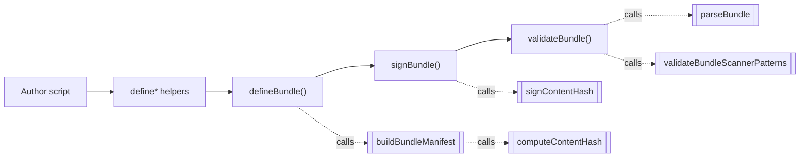

# @auto-swe/sdk — Bundle Authoring SDK

> Indexed at commit `b1d8930` on 2026-09-08 · [view on GitHub](https://github.com/yorch/auto-swe/tree/b1d8930)

## Relevant source files

- [packages/sdk/src/index.ts](https://github.com/yorch/auto-swe/blob/b1d8930/packages/sdk/src/index.ts)
- [packages/sdk/src/index.test.ts](https://github.com/yorch/auto-swe/blob/b1d8930/packages/sdk/src/index.test.ts)
- [packages/sdk/package.json](https://github.com/yorch/auto-swe/blob/b1d8930/packages/sdk/package.json)
- [packages/sdk/tsconfig.json](https://github.com/yorch/auto-swe/blob/b1d8930/packages/sdk/tsconfig.json)
- [packages/shared/src/bundle/index.ts](https://github.com/yorch/auto-swe/blob/b1d8930/packages/shared/src/bundle/index.ts)
- [packages/cli/src/commands/bundle.ts](https://github.com/yorch/auto-swe/blob/b1d8930/packages/cli/src/commands/bundle.ts)
- [packages/gateway/src/lib/bundleService.ts](https://github.com/yorch/auto-swe/blob/b1d8930/packages/gateway/src/lib/bundleService.ts)

## Overview

`@auto-swe/sdk` is the programmatic authoring surface for **distribution bundles** — versioned, portable exports of library content (Agents, Skills, scanner patterns, workflow Templates) that install into any auto-swe deployment. It sits alongside the two other authoring surfaces, the admin dashboard and the REST API, and is the one that works offline: a bundle can be assembled, hashed, signed, and validated from a script or a CI job with no gateway, no database, and no token.

The package is deliberately thin — 135 lines of source [packages/sdk/src/index.ts](https://github.com/yorch/auto-swe/blob/b1d8930/packages/sdk/src/index.ts) over the bundle format defined in `@auto-swe/shared/bundle`. **Every exported function is pure and performs no I/O**: no filesystem access, no network calls, no clock beyond `new Date()` for the `createdAt` stamp. That is a contract, not an accident. The gateway shares the same assembly, hashing, and validation code, so a bundle that passes `validateBundle()` locally passes the identical gates at install time [packages/shared/src/bundle/index.ts#L291-L304](https://github.com/yorch/auto-swe/blob/b1d8930/packages/shared/src/bundle/index.ts#L291-L304).

Sources: [packages/sdk/src/index.ts:L1-L23](https://github.com/yorch/auto-swe/blob/b1d8930/packages/sdk/src/index.ts#L1-L23) [packages/sdk/package.json:L1-L25](https://github.com/yorch/auto-swe/blob/b1d8930/packages/sdk/package.json#L1-L25)

## Architecture



The four solid arrows are the authoring loop; the dashed arrows are the delegations into `@auto-swe/shared/bundle`, which owns the format. The SDK contributes ergonomics — typed entity constructors, an input shape with optional fields, an error-list return type — and contributes no format logic of its own. Assembly and hashing live in shared code so the SDK and the gateway's `exportBundle` cannot drift over what the content hash covers [packages/sdk/src/index.ts#L60-L62](https://github.com/yorch/auto-swe/blob/b1d8930/packages/sdk/src/index.ts#L60-L62).

Sources: [packages/sdk/src/index.ts:L26-L135](https://github.com/yorch/auto-swe/blob/b1d8930/packages/sdk/src/index.ts#L26-L135) [packages/shared/src/bundle/index.ts:L265-L328](https://github.com/yorch/auto-swe/blob/b1d8930/packages/shared/src/bundle/index.ts#L265-L328)

## Module Layout

The package has a single source module. It compiles with `tsc` to `dist/`, declares one runtime dependency (`@auto-swe/shared` at `workspace:*`), and exposes ESM only through the `exports` map.

| Module | Path | Responsibility |
| ------ | ---- | -------------- |
| `index` | `packages/sdk/src/index.ts` | The entire public API: entity helpers, `defineBundle`, `signBundle`, `validateBundle` |
| tests | `packages/sdk/src/index.test.ts` | Vitest suite covering assembly, signing, relabelling attacks, and validation gates |
| build config | `packages/sdk/tsconfig.json` | Extends `tsconfig.base.json`; `rootDir: src`, `outDir: dist`, `types: ["node"]` |

Sources: [packages/sdk/package.json:L1-L25](https://github.com/yorch/auto-swe/blob/b1d8930/packages/sdk/package.json#L1-L25) [packages/sdk/tsconfig.json:L1-L10](https://github.com/yorch/auto-swe/blob/b1d8930/packages/sdk/tsconfig.json#L1-L10)

## Key Components

### Entity helpers

`defineAgent`, `defineSkill`, `defineScannerPattern`, and `defineTemplate` are identity functions that return their argument unchanged. Their sole purpose is to pin the parameter type so an editor offers completion and flags a typo at the definition site rather than deep inside `defineBundle`'s argument list [packages/sdk/src/index.ts#L26-L29](https://github.com/yorch/auto-swe/blob/b1d8930/packages/sdk/src/index.ts#L26-L29). Each type is a `z.infer` of the corresponding Zod schema in shared, so the helper and the wire format cannot disagree.

`defineContainerStep` is the one helper that does work: it takes a `ContainerStepNode` minus its discriminant and stamps `type: 'containerStep'` onto the result [packages/sdk/src/index.ts#L32-L35](https://github.com/yorch/auto-swe/blob/b1d8930/packages/sdk/src/index.ts#L32-L35). Container-step nodes are how a bundle ships a *coded* capability — a connector or mechanism the core lacks — for embedding in a template's workflow spec, without untrusted code ever entering the worker process [packages/shared/src/workflow/spec.ts#L330-L336](https://github.com/yorch/auto-swe/blob/b1d8930/packages/shared/src/workflow/spec.ts#L330-L336).

| Helper | Argument type | Returns |
| ------ | ------------- | ------- |
| `defineAgent` | `BundleAgent` | `BundleAgent` |
| `defineSkill` | `BundleSkill` | `BundleSkill` |
| `defineScannerPattern` | `BundleScannerPattern` | `BundleScannerPattern` |
| `defineTemplate` | `BundleTemplate` | `BundleTemplate` |
| `defineContainerStep` | `Omit<ContainerStepNode, 'type'>` | `ContainerStepNode` |

Sources: [packages/sdk/src/index.ts:L25-L35](https://github.com/yorch/auto-swe/blob/b1d8930/packages/sdk/src/index.ts#L25-L35) [packages/shared/src/bundle/index.ts:L60-L141](https://github.com/yorch/auto-swe/blob/b1d8930/packages/shared/src/bundle/index.ts#L60-L141)

### defineBundle

`defineBundle(input)` assembles a complete `BundleManifest` and computes its content hash [packages/sdk/src/index.ts#L53-L70](https://github.com/yorch/auto-swe/blob/b1d8930/packages/sdk/src/index.ts#L53-L70). It normalizes the four entity arrays to `[]` when omitted, then hands everything to `buildBundleManifest`. Optional metadata fields are forwarded with a conditional spread rather than as explicit `undefined`, because `stableStringify` drops undefined keys and an in-memory manifest must hash identically to its JSON round-trip.

`DefineBundleInput` requires only `name` and `version`; `description`, `source`, `agents`, `skills`, `scannerPatterns`, `templates`, and `dependencies` are all optional [packages/sdk/src/index.ts#L37-L47](https://github.com/yorch/auto-swe/blob/b1d8930/packages/sdk/src/index.ts#L37-L47). `dependencies` declares the *connection types* the bundle's content requires. Connection instances are never exported, because they hold URLs, credentials, and team bindings [packages/shared/src/bundle/index.ts#L20-L30](https://github.com/yorch/auto-swe/blob/b1d8930/packages/shared/src/bundle/index.ts#L20-L30).

| Field | Type | Default | Purpose |
| ----- | ---- | ------- | ------- |
| `name` | `string` | required | Bundle identity; inside the content hash |
| `version` | `string` | required | Bundle version; inside the content hash |
| `description` | `string` | omitted | Free-form summary |
| `source` | `string` | omitted | Provenance tag, e.g. origin or source deployment |
| `agents` | `BundleAgent[]` | `[]` | Exported Agent rows, minus deployment-local bindings |
| `skills` | `BundleSkill[]` | `[]` | Named prompt fragments |
| `scannerPatterns` | `BundleScannerPattern[]` | `[]` | Security scanner regexes |
| `templates` | `BundleTemplate[]` | `[]` | Workflow templates with their active spec |
| `dependencies` | `BundleDependency[]` | `[]` | Connection types the target must provide |

Sources: [packages/sdk/src/index.ts:L37-L70](https://github.com/yorch/auto-swe/blob/b1d8930/packages/sdk/src/index.ts#L37-L70) [packages/shared/src/bundle/index.ts:L143-L186](https://github.com/yorch/auto-swe/blob/b1d8930/packages/shared/src/bundle/index.ts#L143-L186)

### signBundle

`signBundle(manifest, privateKeyPem, signedBy?)` attaches a detached base64 ed25519 signature over the manifest's `contentHash` and returns a new manifest; it never mutates its input [packages/sdk/src/index.ts#L81-L101](https://github.com/yorch/auto-swe/blob/b1d8930/packages/sdk/src/index.ts#L81-L101). The optional `signedBy` label identifies the signing key and is informational — an installing deployment verifies against its own trusted keys regardless of what the label claims.

Before signing, the function re-derives the declared hash and throws if it does not match. Signing a manifest whose `contentHash` disagrees with its own content would produce a signature that can never verify, and it is the exact shape of a relabelling attempt — so the SDK fails loudly at authoring time instead [packages/sdk/src/index.ts#L86-L92](https://github.com/yorch/auto-swe/blob/b1d8930/packages/sdk/src/index.ts#L86-L92). The test suite pins this: mutating `metadata.name` on an assembled bundle and then calling `signBundle` throws `refusing to sign` [packages/sdk/src/index.test.ts#L119-L124](https://github.com/yorch/auto-swe/blob/b1d8930/packages/sdk/src/index.test.ts#L119-L124).

Sources: [packages/sdk/src/index.ts:L72-L101](https://github.com/yorch/auto-swe/blob/b1d8930/packages/sdk/src/index.ts#L72-L101) [packages/shared/src/bundle/index.ts:L421-L435](https://github.com/yorch/auto-swe/blob/b1d8930/packages/shared/src/bundle/index.ts#L421-L435)

### validateBundle

`validateBundle(manifest: unknown)` is the local test harness. It returns a discriminated union — `{ ok: true, bundle }` or `{ ok: false, errors: string[] }` — and never throws [packages/sdk/src/index.ts#L103-L135](https://github.com/yorch/auto-swe/blob/b1d8930/packages/sdk/src/index.ts#L103-L135). It applies three gates in order, short-circuiting on the first failure:

1. **Schema parse** via `parseBundle`, which rejects a non-current `bundleSchemaVersion` with a dedicated `BundleSchemaVersionError` before Zod ever sees the object [packages/shared/src/bundle/index.ts#L335-L345](https://github.com/yorch/auto-swe/blob/b1d8930/packages/shared/src/bundle/index.ts#L335-L345).
2. **Content hash** via `verifyContentHash`, reporting both the declared and the computed digest.
3. **Scanner patterns** via `validateBundleScannerPatterns`, which checks each pattern for compile errors, unsafe flags, and over-long bodies.

Gates 1 and 3 are the same shared functions the gateway calls at install [packages/gateway/src/lib/bundleService.ts#L232-L256](https://github.com/yorch/auto-swe/blob/b1d8930/packages/gateway/src/lib/bundleService.ts#L232-L256), which is the point: an author cannot ship a bundle that install would reject.

Sources: [packages/sdk/src/index.ts:L103-L135](https://github.com/yorch/auto-swe/blob/b1d8930/packages/sdk/src/index.ts#L103-L135) [packages/shared/src/bundle/index.ts:L347-L385](https://github.com/yorch/auto-swe/blob/b1d8930/packages/shared/src/bundle/index.ts#L347-L385)

## The bundle document

A manifest is plain JSON with four top-level keys. `bundleSchemaVersion` is the literal `2`; v1 bundles are rejected rather than reinterpreted, because v1 hashed only entities and dependencies, leaving `name` and `version` outside the signed payload [packages/shared/src/bundle/index.ts#L31-L47](https://github.com/yorch/auto-swe/blob/b1d8930/packages/shared/src/bundle/index.ts#L31-L47). The shape below is what `defineBundle` emits for the skills-only example in the test suite [packages/sdk/src/index.test.ts#L31-L42](https://github.com/yorch/auto-swe/blob/b1d8930/packages/sdk/src/index.test.ts#L31-L42), with a signature added:

```json
{
  "bundleSchemaVersion": 2,
  "dependencies": [],
  "entities": {
    "agents": [],
    "scannerPatterns": [],
    "skills": [
      { "name": "careful-review", "promptText": "review carefully" }
    ],
    "templates": []
  },
  "metadata": {
    "createdAt": "2026-09-08T13:02:27.000Z",
    "name": "swe-starter",
    "source": "swe-starter",
    "version": "1.0.0",
    "contentHash": "9f2c…",
    "signature": "MEUCIQ…",
    "signedBy": "first-party"
  }
}
```

`contentHash` is a sha256 over the canonicalized manifest with exactly three fields removed — `metadata.contentHash`, `metadata.signature`, and `metadata.signedBy` — the three that cannot be inside their own input [packages/shared/src/bundle/index.ts#L253-L277](https://github.com/yorch/auto-swe/blob/b1d8930/packages/shared/src/bundle/index.ts#L253-L277). Canonicalization sorts object keys recursively, drops `undefined`-valued keys, honours `toJSON`, and throws on cycles, so the same manifest always hashes identically regardless of construction order.

Because the hash covers metadata, identity is bound to content. Three tests establish what that buys: an honestly signed bundle verifies; the same bundle relabelled to another name fails both the hash gate and signature verification, and re-hashing after the edit only invalidates the signature; and an old release replayed under a bumped version string fails verification too [packages/sdk/src/index.test.ts#L65-L117](https://github.com/yorch/auto-swe/blob/b1d8930/packages/sdk/src/index.test.ts#L65-L117).

Sources: [packages/shared/src/bundle/index.ts:L153-L186](https://github.com/yorch/auto-swe/blob/b1d8930/packages/shared/src/bundle/index.ts#L153-L186) [packages/sdk/src/index.test.ts:L30-L125](https://github.com/yorch/auto-swe/blob/b1d8930/packages/sdk/src/index.test.ts#L30-L125)

## Usage

The command-line interface is the SDK's primary consumer. `auto-swe bundle init` scaffolds a project whose generated `src/bundle.ts` imports `defineAgent`, `defineBundle`, and `defineSkill`, assembles a manifest, and writes it to stdout [packages/cli/src/commands/bundle.ts#L173-L200](https://github.com/yorch/auto-swe/blob/b1d8930/packages/cli/src/commands/bundle.ts#L173-L200). `auto-swe bundle validate` and `auto-swe bundle sign` are thin wrappers over `validateBundle` and `signBundle` with file reading bolted on [packages/cli/src/commands/bundle.ts#L1-L19](https://github.com/yorch/auto-swe/blob/b1d8930/packages/cli/src/commands/bundle.ts#L1-L19). That split is the I/O boundary: the SDK stays pure, the CLI touches the disk.

The authoring loop is:

```bash
auto-swe bundle init ./my-bundle --name=swe-starter --version=1.0.0
cd my-bundle && tsx src/bundle.ts > bundle.json
auto-swe bundle validate bundle.json
auto-swe bundle sign bundle.json --key=./signing.pem --signed-by=first-party -o signed.json
```

Sources: [packages/cli/src/commands/bundle.ts:L1-L60](https://github.com/yorch/auto-swe/blob/b1d8930/packages/cli/src/commands/bundle.ts#L1-L60) [packages/cli/src/commands/bundle.ts:L160-L200](https://github.com/yorch/auto-swe/blob/b1d8930/packages/cli/src/commands/bundle.ts#L160-L200)

## Limitations

**`validateBundle` makes no claim about regex execution cost.** A scanner pattern that backtracks catastrophically passes validation — `(a+)+$` is an explicit test case that returns `ok: true` [packages/sdk/src/index.test.ts#L163-L178](https://github.com/yorch/auto-swe/blob/b1d8930/packages/sdk/src/index.test.ts#L163-L178). The only sound check for catastrophic backtracking is to execute the pattern under a wall-clock bound, which needs a worker thread. That happens in the runtime scanner executor and, as an early error for admins, in the gateway's write-time probe. Neither can run here without breaking the pure-and-synchronous contract [packages/shared/src/bundle/index.ts#L360-L375](https://github.com/yorch/auto-swe/blob/b1d8930/packages/shared/src/bundle/index.ts#L360-L375).

**`validateBundle` does not run the template graph lint.** `validateBundleTemplates` — which catches unparseable expressions and specs with no reachable `terminate` — exists in shared and is pure, but the SDK's harness does not call it; only the gateway's install path does [packages/gateway/src/lib/bundleService.ts#L267](https://github.com/yorch/auto-swe/blob/b1d8930/packages/gateway/src/lib/bundleService.ts#L267). A bundle carrying a schema-valid but unrunnable template therefore validates locally and is refused at install.

**A template spec may embed deployment-local references.** An `mcp` node's `connectionRef` is a local Connection id that will not resolve on another deployment. Nothing in the SDK detects this; the `dependencies` list is the author's manual declaration of what the installer must re-wire [packages/shared/src/bundle/index.ts#L121-L131](https://github.com/yorch/auto-swe/blob/b1d8930/packages/shared/src/bundle/index.ts#L121-L131).

**`createdAt` defaults to now and is inside the hash**, so two otherwise identical runs of an authoring script produce different content hashes. Reproducible builds require pinning `createdAt`, which `DefineBundleInput` does not currently expose even though `buildBundleManifest` accepts it [packages/shared/src/bundle/index.ts#L279-L289](https://github.com/yorch/auto-swe/blob/b1d8930/packages/shared/src/bundle/index.ts#L279-L289).

**The package is `private: true` and unpublished.** It resolves as `workspace:*` inside this monorepo only; a scaffolded bundle project outside the repo has no registry to install it from [packages/sdk/package.json#L4](https://github.com/yorch/auto-swe/blob/b1d8930/packages/sdk/package.json#L4).

Sources: [packages/sdk/src/index.test.ts:L142-L200](https://github.com/yorch/auto-swe/blob/b1d8930/packages/sdk/src/index.test.ts#L142-L200) [packages/shared/src/bundle/index.ts:L360-L413](https://github.com/yorch/auto-swe/blob/b1d8930/packages/shared/src/bundle/index.ts#L360-L413)

## Related Pages

- Underlying bundle types, schemas, and hashing: [Shared Library](./2-shared-library.md)
- Commands that consume these helpers: [CLI](./6-cli.md)
- Bundle install, export, and signature verification: [Gateway API](./3-gateway-api.md)
- Repository layout and build tooling: [Repository Structure](./1-repository-structure.md)
- Siblings: [Temporal Worker](./4-temporal-worker.md) · [Web Dashboard](./5-web-dashboard.md)
