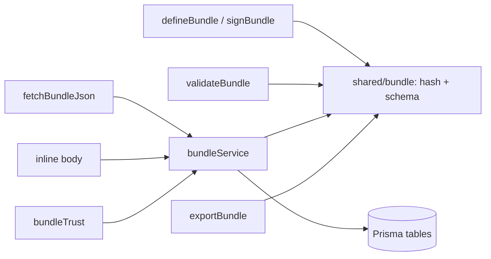
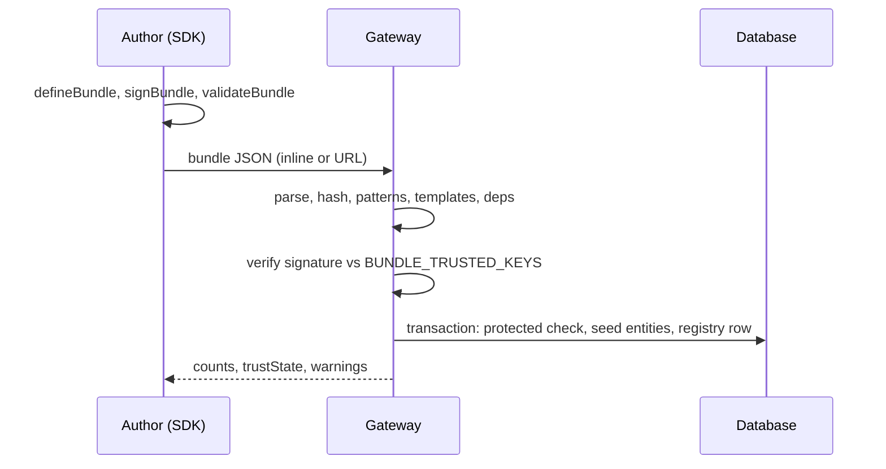

# Bundle SDK and Bundles

> Indexed at commit `d0a90fb5` on 2026-10-06 · [view on GitHub](https://github.com/yorch/auto-swe/tree/d0a90fb5)

## Relevant source files

- [packages/sdk/src/index.ts](https://github.com/yorch/auto-swe/blob/d0a90fb5/packages/sdk/src/index.ts)
- [packages/sdk/package.json](https://github.com/yorch/auto-swe/blob/d0a90fb5/packages/sdk/package.json)
- [packages/shared/src/bundle/index.ts](https://github.com/yorch/auto-swe/blob/d0a90fb5/packages/shared/src/bundle/index.ts)
- [packages/gateway/src/lib/bundleService.ts](https://github.com/yorch/auto-swe/blob/d0a90fb5/packages/gateway/src/lib/bundleService.ts)
- [packages/gateway/src/lib/bundleFetch.ts](https://github.com/yorch/auto-swe/blob/d0a90fb5/packages/gateway/src/lib/bundleFetch.ts)
- [packages/gateway/src/lib/bundleTrust.ts](https://github.com/yorch/auto-swe/blob/d0a90fb5/packages/gateway/src/lib/bundleTrust.ts)
- [packages/gateway/src/lib/bundleLimits.ts](https://github.com/yorch/auto-swe/blob/d0a90fb5/packages/gateway/src/lib/bundleLimits.ts)

## Overview

A bundle is a versioned, secret-free JSON export of library content: agents, skills, scanner patterns and workflow templates. Connection instances never travel in a bundle; it only declares the connection types its content needs through `dependencies` ([packages/shared/src/bundle/index.ts:L18-L24](https://github.com/yorch/auto-swe/blob/d0a90fb5/packages/shared/src/bundle/index.ts#L18-L24)). Deployment-local fields such as ids, team bindings and timestamps are stripped on export and re-established on install.

The subsystem has three layers. `@auto-swe/shared/bundle` owns the manifest schema, content hashing and signature verification. `@auto-swe/sdk` is a pure, I/O-free authoring layer over it. The gateway's `bundleService.ts`, `bundleFetch.ts`, `bundleTrust.ts` and `bundleLimits.ts` implement export, preview and install, URL fetching, trust anchors and size limits.

Sources: [packages/shared/src/bundle/index.ts:L18-L24](https://github.com/yorch/auto-swe/blob/d0a90fb5/packages/shared/src/bundle/index.ts#L18-L24) [packages/sdk/src/index.ts:L1-L8](https://github.com/yorch/auto-swe/blob/d0a90fb5/packages/sdk/src/index.ts#L1-L8)

## Architecture

```mermaid
flowchart LR
  Author[defineBundle / signBundle] --> Shared[shared/bundle: hash + schema]
  SDKV[validateBundle] --> Shared
  Fetch[fetchBundleJson] --> Svc[bundleService]
  Inline[inline body] --> Svc
  Svc --> Shared
  Trust[bundleTrust] --> Svc
  Svc --> DB[(Prisma tables)]
  Export[exportBundle] --> Shared
```

The SDK and the gateway both call into the shared module, so the hash an author computes is the hash the server re-derives. `exportBundle` and the SDK's `defineBundle` both go through `buildBundleManifest`. Install reads bytes either from a URL (`fetchBundleJson`) or from an inline request body, then runs the same validation in `bundleService`.

Sources: [packages/sdk/src/index.ts:L52-L70](https://github.com/yorch/auto-swe/blob/d0a90fb5/packages/sdk/src/index.ts#L52-L70) [packages/gateway/src/lib/bundleService.ts:L543-L548](https://github.com/yorch/auto-swe/blob/d0a90fb5/packages/gateway/src/lib/bundleService.ts#L543-L548)

## Module Layout

| Module | Path | Responsibility |
| --- | --- | --- |
| SDK | `packages/sdk/src/index.ts` | `define*` helpers, `defineBundle`, `signBundle`, `validateBundle` |
| Bundle format | `packages/shared/src/bundle/index.ts` | Zod schemas, content hash, signature, template/pattern/dependency gates |
| Service | `packages/gateway/src/lib/bundleService.ts` | `exportBundle`, `previewBundle`, `installBundle`, `listInstalledBundles` |
| Fetch | `packages/gateway/src/lib/bundleFetch.ts` | SSRF-guarded, size-capped URL fetch |
| Trust | `packages/gateway/src/lib/bundleTrust.ts` | `BUNDLE_TRUSTED_KEYS` and `BUNDLE_ALLOW_UNVERIFIED` resolution |
| Limits | `packages/gateway/src/lib/bundleLimits.ts` | `BUNDLE_MAX_BYTES` cap and Fastify body limit |

The SDK package is private, depends only on `@auto-swe/shared`, and exports a single entry point.

Sources: [packages/sdk/package.json:L1-L22](https://github.com/yorch/auto-swe/blob/d0a90fb5/packages/sdk/package.json#L1-L22) [packages/gateway/src/lib/bundleLimits.ts:L1-L17](https://github.com/yorch/auto-swe/blob/d0a90fb5/packages/gateway/src/lib/bundleLimits.ts#L1-L17)

## Key Components

### Manifest schema and content hash

`BundleManifestSchema` holds `bundleSchemaVersion` (literal `2`), `dependencies`, `entities` and `metadata`. Metadata carries `contentHash`, `createdAt`, `name`, `version`, and optional `description`, `signature`, `signedBy` and `source` ([packages/shared/src/bundle/index.ts:L139-L173](https://github.com/yorch/auto-swe/blob/d0a90fb5/packages/shared/src/bundle/index.ts#L139-L173)). Schema v1 hashed only entities and dependencies, so a signed bundle could be relabelled to another name or version. In v2, `computeContentHash` covers the whole manifest except `contentHash`, `signature` and `signedBy`, using a stable key-order stringify ([packages/shared/src/bundle/index.ts:L241-L272](https://github.com/yorch/auto-swe/blob/d0a90fb5/packages/shared/src/bundle/index.ts#L241-L272)).

`parseBundle` throws `BundleSchemaVersionError` for any non-current version rather than reinterpreting it, and `verifyContentHash` is the single integrity gate shared by server and SDK ([packages/shared/src/bundle/index.ts:L331-L355](https://github.com/yorch/auto-swe/blob/d0a90fb5/packages/shared/src/bundle/index.ts#L331-L355)). `buildBundleManifest` is the one place the v2 ordering is expressed: metadata is built, hashed, then `contentHash` is added ([packages/shared/src/bundle/index.ts:L300-L325](https://github.com/yorch/auto-swe/blob/d0a90fb5/packages/shared/src/bundle/index.ts#L300-L325)).

Sources: [packages/shared/src/bundle/index.ts:L139-L173](https://github.com/yorch/auto-swe/blob/d0a90fb5/packages/shared/src/bundle/index.ts#L139-L173) [packages/shared/src/bundle/index.ts:L241-L355](https://github.com/yorch/auto-swe/blob/d0a90fb5/packages/shared/src/bundle/index.ts#L241-L355)

### Shared validation gates

Three pure, synchronous gates are shared by the SDK and the server. `unsupportedBundleDependencies` rejects connection types outside `['git_repo', 'mcp']` ([packages/shared/src/bundle/index.ts:L361-L368](https://github.com/yorch/auto-swe/blob/d0a90fb5/packages/shared/src/bundle/index.ts#L361-L368)). `validateBundleScannerPatterns` applies `checkRegexSafety` (compile, flags, length) and makes no claim about execution cost ([packages/shared/src/bundle/index.ts:L386-L396](https://github.com/yorch/auto-swe/blob/d0a90fb5/packages/shared/src/bundle/index.ts#L386-L396)). `validateBundleTemplates` refuses the reserved agent-run template name and `system:` origins, parses each spec with `WorkflowSpecSchema`, and reports `validateSpec` errors ([packages/shared/src/bundle/index.ts:L408-L433](https://github.com/yorch/auto-swe/blob/d0a90fb5/packages/shared/src/bundle/index.ts#L408-L433)).

Sources: [packages/shared/src/bundle/index.ts:L361-L433](https://github.com/yorch/auto-swe/blob/d0a90fb5/packages/shared/src/bundle/index.ts#L361-L433)

### Signing and verification

`signContentHash` produces a detached base64 ed25519 signature over the `contentHash` string; the platform itself only verifies. `verifyBundleSignature` re-derives the hash first, then tries each trusted key and returns `{ verified, signedBy }`. Unsigned bundles and malformed keys never throw; they come back unverified ([packages/shared/src/bundle/index.ts:L439-L496](https://github.com/yorch/auto-swe/blob/d0a90fb5/packages/shared/src/bundle/index.ts#L439-L496)).

Trust anchors come from the `BUNDLE_TRUSTED_KEYS` environment variable (JSON `[{ id, publicKeyPem }]`), not the database, so DB write access cannot mark a malicious bundle VERIFIED. Absent or malformed input yields no keys. `BUNDLE_ALLOW_UNVERIFIED=1` is the only switch that permits unverified installs; the default is deny ([packages/gateway/src/lib/bundleTrust.ts:L1-L33](https://github.com/yorch/auto-swe/blob/d0a90fb5/packages/gateway/src/lib/bundleTrust.ts#L1-L33)).

Sources: [packages/shared/src/bundle/index.ts:L439-L496](https://github.com/yorch/auto-swe/blob/d0a90fb5/packages/shared/src/bundle/index.ts#L439-L496) [packages/gateway/src/lib/bundleTrust.ts:L1-L33](https://github.com/yorch/auto-swe/blob/d0a90fb5/packages/gateway/src/lib/bundleTrust.ts#L1-L33)

### SDK authoring surface

`defineAgent`, `defineSkill`, `defineScannerPattern` and `defineTemplate` are identity functions that pin types for editor help. `defineContainerStep` builds a `containerStep` workflow node. `defineBundle` assembles a manifest through `buildBundleManifest`, so the hash matches the gateway's export ([packages/sdk/src/index.ts:L26-L70](https://github.com/yorch/auto-swe/blob/d0a90fb5/packages/sdk/src/index.ts#L26-L70)).

`signBundle` re-derives the hash and refuses to sign a manifest whose declared hash does not match its content, instructing the author to re-run `defineBundle` after any edit ([packages/sdk/src/index.ts:L82-L101](https://github.com/yorch/auto-swe/blob/d0a90fb5/packages/sdk/src/index.ts#L82-L101)). `validateBundle` returns `{ ok, bundle }` or `{ ok: false, errors }` after the schema, hash, scanner-pattern and dependency checks, mirroring install ([packages/sdk/src/index.ts:L103-L144](https://github.com/yorch/auto-swe/blob/d0a90fb5/packages/sdk/src/index.ts#L103-L144)).

Sources: [packages/sdk/src/index.ts:L26-L144](https://github.com/yorch/auto-swe/blob/d0a90fb5/packages/sdk/src/index.ts#L26-L144)

### Install from URL

`fetchBundleJson` loops over hops: each URL passes `assertPublicBundleUrl` (the shared `isSafeProbeUrl` guard), is fetched through `createGuardedFetch` with `redirect: 'manual'` and a 15-second timeout, and each redirect `Location` is re-checked, up to 5 hops ([packages/gateway/src/lib/bundleFetch.ts:L21-L94](https://github.com/yorch/auto-swe/blob/d0a90fb5/packages/gateway/src/lib/bundleFetch.ts#L21-L94)). The size cap is enforced by `Content-Length` and, because chunked responses omit it, again while streaming in `readBodyCapped` ([packages/gateway/src/lib/bundleFetch.ts:L46-L70](https://github.com/yorch/auto-swe/blob/d0a90fb5/packages/gateway/src/lib/bundleFetch.ts#L46-L70)). The cap defaults to 5,000,000 bytes (`BUNDLE_MAX_BYTES`) and is shared with the inline routes, whose body limit adds 64 KiB of envelope headroom ([packages/gateway/src/lib/bundleLimits.ts:L1-L17](https://github.com/yorch/auto-swe/blob/d0a90fb5/packages/gateway/src/lib/bundleLimits.ts#L1-L17)).

Sources: [packages/gateway/src/lib/bundleFetch.ts:L21-L107](https://github.com/yorch/auto-swe/blob/d0a90fb5/packages/gateway/src/lib/bundleFetch.ts#L21-L107) [packages/gateway/src/lib/bundleLimits.ts:L1-L17](https://github.com/yorch/auto-swe/blob/d0a90fb5/packages/gateway/src/lib/bundleLimits.ts#L1-L17)

### Install, preview and export service

`validateBundleForInstall` runs every pre-write check in order: parse (mapping a schema-version error to `BundleIntegrityError`), content hash, scanner patterns, templates, dependency types, signature trust, and a refusal of origins using the reserved `system:` prefix. Install and `previewBundle` share it so a preview cannot approve what install would refuse ([packages/gateway/src/lib/bundleService.ts:L467-L520](https://github.com/yorch/auto-swe/blob/d0a90fb5/packages/gateway/src/lib/bundleService.ts#L467-L520)).

`installBundle` rejects UNVERIFIED bundles unless `allowUnverified`, scans each skill's description and text advisorily, then runs one transaction (120 s timeout). Inside it, `findProtectedConflicts` reads deployment-owned rows; a conflict throws `BundleProtectedContentError` unless `overwriteProtected` is set. Entities seed in order skills, scanner patterns, agents with skill refs, templates, and an `InstalledBundle` registry row is upserted by name ([packages/gateway/src/lib/bundleService.ts:L543-L731](https://github.com/yorch/auto-swe/blob/d0a90fb5/packages/gateway/src/lib/bundleService.ts#L543-L731)). Installed skills always start `isVerified: false`, and a content change cuts a new skill revision ([packages/gateway/src/lib/bundleService.ts:L586-L627](https://github.com/yorch/auto-swe/blob/d0a90fb5/packages/gateway/src/lib/bundleService.ts#L586-L627)).

`installBundleTemplate` creates a template at version 1 or appends a new version, skipping identical re-installs and moving the active pointer only if the template was still on the previous bundle-written version ([packages/gateway/src/lib/bundleService.ts:L192-L246](https://github.com/yorch/auto-swe/blob/d0a90fb5/packages/gateway/src/lib/bundleService.ts#L192-L246)). `previewBundle` reports a `create` or `replace` action per entity without writing ([packages/gateway/src/lib/bundleService.ts:L741-L790](https://github.com/yorch/auto-swe/blob/d0a90fb5/packages/gateway/src/lib/bundleService.ts#L741-L790)). `exportBundle` serializes the active GLOBAL entities, optionally filtered by `origin`, through `buildBundleManifest` ([packages/gateway/src/lib/bundleService.ts:L335-L360](https://github.com/yorch/auto-swe/blob/d0a90fb5/packages/gateway/src/lib/bundleService.ts#L335-L360)).

Sources: [packages/gateway/src/lib/bundleService.ts:L467-L731](https://github.com/yorch/auto-swe/blob/d0a90fb5/packages/gateway/src/lib/bundleService.ts#L467-L731) [packages/gateway/src/lib/bundleService.ts:L741-L790](https://github.com/yorch/auto-swe/blob/d0a90fb5/packages/gateway/src/lib/bundleService.ts#L741-L790)

## Data Flow

```mermaid
sequenceDiagram
  participant A as Author (SDK)
  participant G as Gateway
  participant D as Database
  A->>A: defineBundle, signBundle, validateBundle
  A->>G: bundle JSON (inline or URL)
  G->>G: parse, hash, patterns, templates, deps
  G->>G: verify signature vs BUNDLE_TRUSTED_KEYS
  G->>D: transaction: protected check, seed entities, registry row
  G-->>A: counts, trustState, warnings
```

Validation precedes every write, and the protected-content check runs inside the transaction so it sees the rows the writes act on.

Sources: [packages/gateway/src/lib/bundleService.ts:L543-L580](https://github.com/yorch/auto-swe/blob/d0a90fb5/packages/gateway/src/lib/bundleService.ts#L543-L580) [packages/sdk/src/index.ts:L103-L144](https://github.com/yorch/auto-swe/blob/d0a90fb5/packages/sdk/src/index.ts#L103-L144)

## Trust and Safety Model

Integrity and trust are separate. A bundle passes the hash gate to be installable at all; a matching signature only upgrades `trustState` to VERIFIED. Deployment-owned content (seeded starter rows, `null`-origin rows, `system:` rows) is protected because a bundle that rewrote a built-in `SHELL_COMMAND` pattern or a shared skill would disable a control by shipping content ([packages/gateway/src/lib/bundleService.ts:L59-L117](https://github.com/yorch/auto-swe/blob/d0a90fb5/packages/gateway/src/lib/bundleService.ts#L59-L117)). `bundleFetch.ts` documents one limit: it blocks IP literals and `localhost`, but a hostname resolving to a private address is checked by the guarded dispatcher rather than by the literal check ([packages/gateway/src/lib/bundleFetch.ts:L43-L44](https://github.com/yorch/auto-swe/blob/d0a90fb5/packages/gateway/src/lib/bundleFetch.ts#L43-L44)).

Sources: [packages/gateway/src/lib/bundleService.ts:L59-L117](https://github.com/yorch/auto-swe/blob/d0a90fb5/packages/gateway/src/lib/bundleService.ts#L59-L117) [packages/gateway/src/lib/bundleFetch.ts:L1-L44](https://github.com/yorch/auto-swe/blob/d0a90fb5/packages/gateway/src/lib/bundleFetch.ts#L1-L44)
