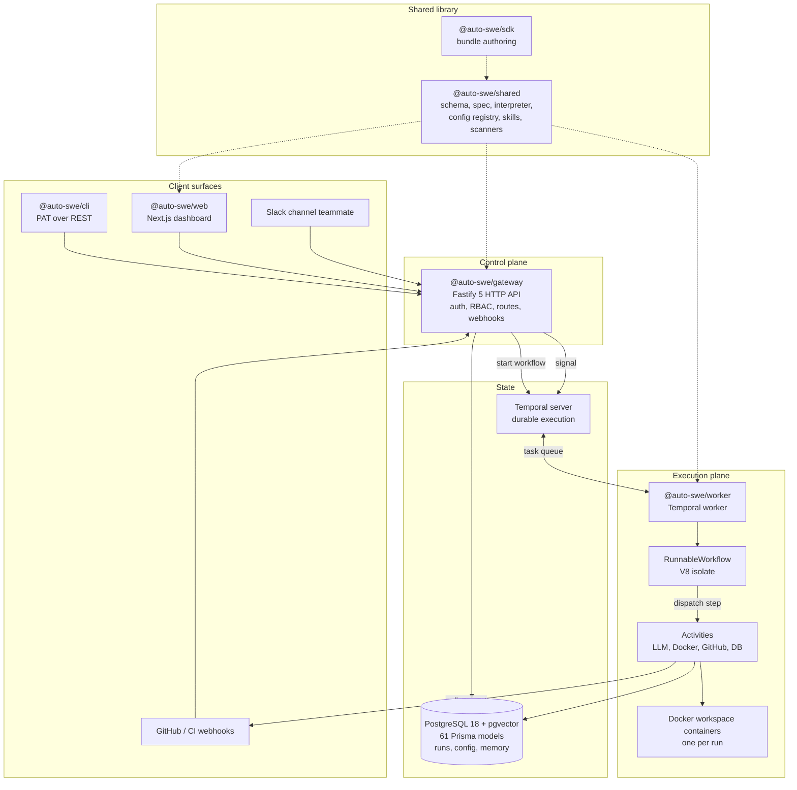

# auto-swe Wiki

> Indexed at commit `b1d8930` on 2026-09-08 · [view on GitHub](https://github.com/yorch/auto-swe/tree/b1d8930)

## Relevant source files

- [README.md](https://github.com/yorch/auto-swe/blob/b1d8930/README.md)
- [package.json](https://github.com/yorch/auto-swe/blob/b1d8930/package.json)
- [tsconfig.base.json](https://github.com/yorch/auto-swe/blob/b1d8930/tsconfig.base.json)
- [vitest.config.ts](https://github.com/yorch/auto-swe/blob/b1d8930/vitest.config.ts)
- [biome.json](https://github.com/yorch/auto-swe/blob/b1d8930/biome.json)
- [docker-compose.infra.yml](https://github.com/yorch/auto-swe/blob/b1d8930/docker-compose.infra.yml)
- [docker-compose.app.yml](https://github.com/yorch/auto-swe/blob/b1d8930/docker-compose.app.yml)
- [docs/architecture.md](https://github.com/yorch/auto-swe/blob/b1d8930/docs/architecture.md)
- [docs/README.md](https://github.com/yorch/auto-swe/blob/b1d8930/docs/README.md)
- [packages/shared/src/prisma/schema.prisma](https://github.com/yorch/auto-swe/blob/b1d8930/packages/shared/src/prisma/schema.prisma)
- [packages/shared/src/workflow/spec.ts](https://github.com/yorch/auto-swe/blob/b1d8930/packages/shared/src/workflow/spec.ts)
- [packages/shared/src/workflow/interpreter.ts](https://github.com/yorch/auto-swe/blob/b1d8930/packages/shared/src/workflow/interpreter.ts)
- [packages/gateway/src/index.ts](https://github.com/yorch/auto-swe/blob/b1d8930/packages/gateway/src/index.ts)
- [packages/worker/src/index.ts](https://github.com/yorch/auto-swe/blob/b1d8930/packages/worker/src/index.ts)

## Overview

auto-swe is a durable, governed multi-agent workflow platform. Workflows are versioned JSON directed acyclic graphs executed on Temporal, and the agents they invoke run inside isolated Docker containers under human approval gates, security scanning, and cost control ([README.md#L5](https://github.com/yorch/auto-swe/blob/b1d8930/README.md#L5)).

Its flagship use case is autonomous software engineering: a ticket goes in and a reviewed, tested draft pull request comes out. That flow ships as an ordinary workflow template assembled from the same node types any team can author, not as privileged runtime code, so it is a starting point rather than a boundary ([README.md#L7](https://github.com/yorch/auto-swe/blob/b1d8930/README.md#L7)). Nothing the system produces merges itself; a human always performs the merge.

Sources: [README.md:L1-L30](https://github.com/yorch/auto-swe/blob/b1d8930/README.md#L1-L30) [docs/README.md:L1-L20](https://github.com/yorch/auto-swe/blob/b1d8930/docs/README.md#L1-L20)

## What is auto-swe?

auto-swe is a private, unversioned Yarn 4 monorepo written in TypeScript under strict mode, requiring Node.js 26 or newer ([package.json#L44](https://github.com/yorch/auto-swe/blob/b1d8930/package.json#L44)). The workspace field declares every package under `packages/*`, and the repository ships six of them ([package.json#L5](https://github.com/yorch/auto-swe/blob/b1d8930/package.json#L5)).

The stack is Fastify 5 for the HTTP API, Temporal for durable orchestration, Mastra plus the Vercel AI SDK for agents, PostgreSQL 18 with pgvector through Prisma 7 for state and semantic memory, and Next.js 16 for the dashboard. Docker-in-Docker provides workspace isolation for agent execution; there is no Kubernetes dependency.

Three counts anchor the scale of the domain model: the Prisma schema defines 61 models, the workflow spec defines 15 node types, and the library ships 35 built-in skills.

Sources: [package.json:L1-L55](https://github.com/yorch/auto-swe/blob/b1d8930/package.json#L1-L55) [tsconfig.base.json:L1-L18](https://github.com/yorch/auto-swe/blob/b1d8930/tsconfig.base.json#L1-L18) [packages/shared/src/prisma/schema.prisma:L1-L60](https://github.com/yorch/auto-swe/blob/b1d8930/packages/shared/src/prisma/schema.prisma#L1-L60) [packages/shared/src/workflow/spec.ts:L95-L446](https://github.com/yorch/auto-swe/blob/b1d8930/packages/shared/src/workflow/spec.ts#L95-L446)

## High-Level Architecture



The gateway is the only writable entry point: every client surface reaches the system through its REST API, and inbound GitHub and continuous-integration webhooks are translated there into Temporal signals that resume suspended runs. Temporal holds the durable execution state, so a run survives crashes, restarts, and provider rate limits. The worker polls the task queue and executes the workflow definition inside a V8 isolate, dispatching each spec node to an activity that performs the non-deterministic work. The shared package is the dependency root: it owns the database schema, the workflow spec and its interpreter, the configuration registry, the skill library, and the security scanner patterns, and all three services import from it.

Sources: [docs/architecture.md:L9-L62](https://github.com/yorch/auto-swe/blob/b1d8930/docs/architecture.md#L9-L62) [packages/gateway/src/index.ts:L1-L120](https://github.com/yorch/auto-swe/blob/b1d8930/packages/gateway/src/index.ts#L1-L120) [packages/worker/src/index.ts:L1-L95](https://github.com/yorch/auto-swe/blob/b1d8930/packages/worker/src/index.ts#L1-L95) [packages/shared/src/workflow/interpreter.ts:L1-L80](https://github.com/yorch/auto-swe/blob/b1d8930/packages/shared/src/workflow/interpreter.ts#L1-L80)

## Repository Layout

```text
auto-swe/
├── packages/
│   ├── shared/     # Prisma schema, workflow spec + interpreter, config registry,
│   │               # built-in skills, scanner patterns, bundle types  (~31.6k LOC)
│   ├── gateway/    # Fastify 5 HTTP API: auth, RBAC, routes, webhooks  (~42.6k LOC)
│   ├── worker/     # Temporal worker: workflows, activities, agents, DinD  (~45.1k LOC)
│   ├── web/        # Next.js 16 App Router dashboard                    (~38.4k LOC)
│   ├── cli/        # `auto-swe` command-line client                      (~2.8k LOC)
│   └── sdk/        # `@auto-swe/sdk` bundle authoring helpers            (~0.3k LOC)
├── docs/           # Living reference docs, rendered by the dashboard at /docs
│   └── history/    # Frozen roadmaps and reviews; not maintained
├── infra/          # Temporal dynamic config and helper scripts
├── scripts/        # CI gates: doc-drift and source-invariant checkers
├── defaults/       # Seeded default content
├── .claude/skills/ # Load-on-demand gotchas for agents editing this repo
└── docker-compose.{infra,app,prod,traefik,watchtower}.yml
```

The layout is a flat Yarn 4 workspace monorepo using the `node-modules` linker rather than Plug'n'Play, chosen for tool compatibility with Prisma, Temporal, and Docker. Dependencies hoist to the root `node_modules`, so an individual package directory may hold no `node_modules` of its own. Every package inherits `tsconfig.base.json`, tests run from a single root Vitest config, and Biome is the sole authority for both linting and formatting.

Sources: [package.json:L1-L10](https://github.com/yorch/auto-swe/blob/b1d8930/package.json#L1-L10) [tsconfig.base.json:L1-L18](https://github.com/yorch/auto-swe/blob/b1d8930/tsconfig.base.json#L1-L18) [vitest.config.ts:L1-L60](https://github.com/yorch/auto-swe/blob/b1d8930/vitest.config.ts#L1-L60) [docs/architecture.md:L63-L182](https://github.com/yorch/auto-swe/blob/b1d8930/docs/architecture.md#L63-L182)

## Key Subsystems

### Repository Structure and Build System

The monorepo's build, test, and quality tooling, including the two custom CI gates this repository runs beyond the usual suite: a doc-drift checker that derives countable claims from source and fails when prose disagrees, and a source-invariant checker for rules the type system cannot state. [details](./1-repository-structure.md)

### @auto-swe/shared

The dependency root. It owns the Prisma schema and singleton database client, the workflow spec and its interpreter, the setting registry and integration config resolvers, the built-in skill library, and the security scanner patterns with their bounded execution machinery. [details](./2-shared-library.md)

### @auto-swe/gateway

The Fastify 5 HTTP API and the system's only writable entry point. It handles authentication and role-based access control, exposes the full REST surface, verifies inbound webhooks and converts them to Temporal signals, and starts workflow runs. [details](./3-gateway-api.md)

### @auto-swe/worker

The Temporal worker and agent runtime. It executes workflow definitions in a V8 isolate, runs the activity catalog that performs every non-deterministic operation, resolves agents to models, prompts, skills, and tools, and manages the Docker-in-Docker workspaces agents write code in. [details](./4-temporal-worker.md)

### @auto-swe/web

The Next.js 16 App Router dashboard. It is the primary human surface for submitting work, watching runs, approving human-in-the-loop gates, authoring workflow templates visually, and administering configuration. [details](./5-web-dashboard.md)

### @auto-swe/cli

The `auto-swe` command-line client, authenticated by a personal access token and implemented as a thin wrapper over the gateway REST API, plus token-free local bundle authoring. [details](./6-cli.md)

### @auto-swe/sdk

A pure, input-output-free authoring SDK for signed, versioned bundles of reusable agents, skills, scanner patterns, and workflow templates. [details](./7-bundle-sdk.md)

## Build & Tooling

Yarn 4.18 drives the monorepo through `yarn workspaces foreach`, with the root script catalog covering build, typecheck, test, lint, database migration and seeding, and Docker Compose lifecycle ([package.json#L8-L43](https://github.com/yorch/auto-swe/blob/b1d8930/package.json#L8-L43)). Vitest 4 is the single test runner, configured once at the root with subpath aliases for the shared package ([vitest.config.ts#L1](https://github.com/yorch/auto-swe/blob/b1d8930/vitest.config.ts#L1)). Biome 2.5 replaces ESLint and Prettier for both linting and formatting ([biome.json#L1](https://github.com/yorch/auto-swe/blob/b1d8930/biome.json#L1)).

Local infrastructure comes up from `docker-compose.infra.yml`, which provisions PostgreSQL for the application, a second PostgreSQL for Temporal, the Temporal server with its admin tools and web UI, and an optional Garage object store ([docker-compose.infra.yml#L1](https://github.com/yorch/auto-swe/blob/b1d8930/docker-compose.infra.yml#L1)). The application services layer on top through `docker-compose.app.yml`, which is an overlay and is not runnable on its own ([docker-compose.app.yml#L1](https://github.com/yorch/auto-swe/blob/b1d8930/docker-compose.app.yml#L1)).

Sources: [package.json:L8-L55](https://github.com/yorch/auto-swe/blob/b1d8930/package.json#L8-L55) [vitest.config.ts:L1-L268](https://github.com/yorch/auto-swe/blob/b1d8930/vitest.config.ts#L1-L268) [biome.json:L1-L128](https://github.com/yorch/auto-swe/blob/b1d8930/biome.json#L1-L128) [docker-compose.infra.yml:L1-L195](https://github.com/yorch/auto-swe/blob/b1d8930/docker-compose.infra.yml#L1-L195) [docker-compose.app.yml:L1-L116](https://github.com/yorch/auto-swe/blob/b1d8930/docker-compose.app.yml#L1-L116)

## Relationship to `docs/`

This wiki is a codebase reference, not a replacement for the repository's own documentation. The `docs/` tree is a living product surface rendered by the dashboard at `/docs`, and it describes the system in present tense from the product and operations angle ([docs/README.md#L1-L20](https://github.com/yorch/auto-swe/blob/b1d8930/docs/README.md#L1-L20)). Where this wiki and `docs/` overlap, `docs/` is maintained by hand and updated with the code, while this wiki is a generated snapshot pinned to one commit.

Read `docs/` to learn what the system does and how to operate it. Read this wiki to find where something lives in the source and how the pieces fit together at the file level.

Sources: [docs/README.md:L1-L111](https://github.com/yorch/auto-swe/blob/b1d8930/docs/README.md#L1-L111) [docs/architecture.md:L1-L62](https://github.com/yorch/auto-swe/blob/b1d8930/docs/architecture.md#L1-L62)

## Child Pages

- [1. Repository Structure](./1-repository-structure.md)
- [2. @auto-swe/shared](./2-shared-library.md)
  - [2.1 Data Model](./2.1-data-model.md)
  - [2.2 Workflow Spec and Interpreter](./2.2-workflow-spec-and-interpreter.md)
  - [2.3 Configuration and Settings](./2.3-configuration-and-settings.md)
  - [2.4 Skills and Security Scanners](./2.4-skills-and-security-scanners.md)
- [3. @auto-swe/gateway](./3-gateway-api.md)
  - [3.1 HTTP Routes](./3.1-http-routes.md)
  - [3.2 Authentication and RBAC](./3.2-authentication-and-rbac.md)
  - [3.3 GitHub and Webhooks](./3.3-github-and-webhooks.md)
- [4. @auto-swe/worker](./4-temporal-worker.md)
  - [4.1 Temporal Workflows](./4.1-temporal-workflows.md)
  - [4.2 Activities](./4.2-activities.md)
  - [4.3 Agent Layer](./4.3-agent-layer.md)
  - [4.4 Docker Workspaces](./4.4-docker-workspaces.md)
  - [4.5 Observability and Cost](./4.5-observability-and-cost.md)
- [5. @auto-swe/web](./5-web-dashboard.md)
  - [5.1 App Routes and Pages](./5.1-app-routes-and-pages.md)
  - [5.2 Components and State](./5.2-components-and-state.md)
- [6. @auto-swe/cli](./6-cli.md)
- [7. @auto-swe/sdk](./7-bundle-sdk.md)
- [Glossary](./glossary.md)

---

_Generated by `repo-wiki-generator` on 2026-09-09 from commit `b1d8930`._
