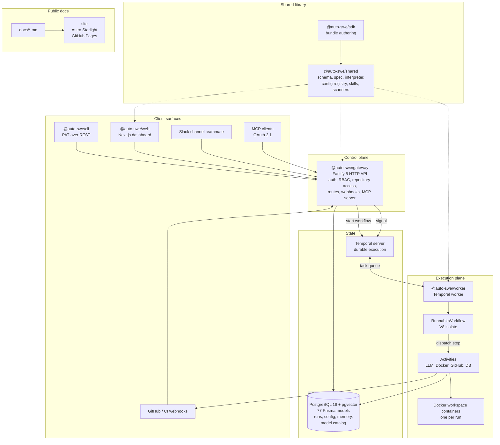

# auto-swe Wiki

> Indexed at commit `d0a90fb5` on 2026-10-06T20:04:52-04:00 · [view on GitHub](https://github.com/yorch/auto-swe/tree/d0a90fb5)

## Relevant source files

- [README.md](https://github.com/yorch/auto-swe/blob/d0a90fb5/README.md)
- [package.json](https://github.com/yorch/auto-swe/blob/d0a90fb5/package.json)
- [tsconfig.base.json](https://github.com/yorch/auto-swe/blob/d0a90fb5/tsconfig.base.json)
- [vitest.config.ts](https://github.com/yorch/auto-swe/blob/d0a90fb5/vitest.config.ts)
- [biome.json](https://github.com/yorch/auto-swe/blob/d0a90fb5/biome.json)
- [docker-compose.infra.yml](https://github.com/yorch/auto-swe/blob/d0a90fb5/docker-compose.infra.yml)
- [docker-compose.app.yml](https://github.com/yorch/auto-swe/blob/d0a90fb5/docker-compose.app.yml)
- [.github/workflows/pages.yml](https://github.com/yorch/auto-swe/blob/d0a90fb5/.github/workflows/pages.yml)
- [docs/README.md](https://github.com/yorch/auto-swe/blob/d0a90fb5/docs/README.md)
- [docs/architecture.md](https://github.com/yorch/auto-swe/blob/d0a90fb5/docs/architecture.md)
- [site/scripts/manifest.mjs](https://github.com/yorch/auto-swe/blob/d0a90fb5/site/scripts/manifest.mjs)
- [packages/shared/src/prisma/schema.prisma](https://github.com/yorch/auto-swe/blob/d0a90fb5/packages/shared/src/prisma/schema.prisma)
- [packages/shared/src/workflow/spec.ts](https://github.com/yorch/auto-swe/blob/d0a90fb5/packages/shared/src/workflow/spec.ts)
- [packages/shared/src/workflow/interpreter.ts](https://github.com/yorch/auto-swe/blob/d0a90fb5/packages/shared/src/workflow/interpreter.ts)
- [packages/gateway/src/index.ts](https://github.com/yorch/auto-swe/blob/d0a90fb5/packages/gateway/src/index.ts)
- [packages/worker/src/index.ts](https://github.com/yorch/auto-swe/blob/d0a90fb5/packages/worker/src/index.ts)

## Overview

auto-swe is a durable, governed multi-agent workflow platform. Workflows are versioned JSON directed acyclic graphs executed on Temporal, and the agents they invoke run inside isolated Docker containers under human approval gates, security scanning, and cost control.

Its flagship use case is autonomous software engineering: a ticket goes in and a reviewed, tested draft pull request comes out. That flow ships as an ordinary workflow template assembled from the same node types any team can author, not as privileged runtime code. A library agent can also be pointed at a repository directly, without a workflow, and external tools can drive the platform through an MCP server. Nothing the system produces merges itself; a human always performs the merge.

Sources: [README.md:L1-L30](https://github.com/yorch/auto-swe/blob/d0a90fb5/README.md#L1-L30) [docs/README.md:L1-L20](https://github.com/yorch/auto-swe/blob/d0a90fb5/docs/README.md#L1-L20)

## Indexed Commit

This wiki is a commit-pinned snapshot of `d0a90fb5` (full SHA `d0a90fb5663ddb99ef065356fa465fbe571865a5`, indexed 2026-10-06T20:04:52-04:00). Every page states that commit in its header, and every citation URL embeds it, so a link always lands on the lines the sentence describes even after the file moves on. **The pages describe the repository as it was at that commit and do not track `main`.**

Because `main` moves daily, the snapshot ages. `yarn wiki:check` (`scripts/check-wiki.mjs`) verifies that every citation resolves at the pinned commit and reports how far `main` has drifted from it; `.github/workflows/wiki.yml` runs integrity plus staleness weekly and on demand, and integrity only on pull requests that touch the wiki. The wiki is refreshed by regenerating it with the repo-wiki-generator skill at the current `main` and updating `_meta.json`, not by editing pages by hand.

`_meta.json` beside this page records the commit, the page plan, the wiki's own statistics, and the counts the pages state (`verified_counts`, as of `d0a90fb5`).

The check and its workflow were added after the pinned commit, so they are described here as repository paths (`scripts/check-wiki.mjs`, `.github/workflows/wiki.yml`) rather than cited at `d0a90fb5`.

## What is auto-swe?

auto-swe is an unpublished (`private: true`), unversioned Yarn 4 monorepo written in TypeScript under strict mode, requiring Node.js 26 or newer. The workspace field declares every package under `packages/*` plus the `site` directory, which makes seven workspaces ([package.json#L5-L8](https://github.com/yorch/auto-swe/blob/d0a90fb5/package.json#L5-L8)).

The stack is Fastify 5 for the HTTP API, Temporal for durable orchestration, Mastra plus the Vercel AI SDK for agents, PostgreSQL 18 with pgvector through Prisma 7 for state and semantic memory, and Next.js 16 for the dashboard. Docker-in-Docker provides workspace isolation for agent execution, with no Kubernetes dependency.

Four counts anchor the scale of the domain model: the Prisma schema defines 77 models, the workflow spec defines 15 node types, the library ships 35 built-in skills, and 26 built-in workflow templates are seeded (counts as of `d0a90fb5`).

Sources: [package.json:L1-L57](https://github.com/yorch/auto-swe/blob/d0a90fb5/package.json#L1-L57) [tsconfig.base.json:L1-L18](https://github.com/yorch/auto-swe/blob/d0a90fb5/tsconfig.base.json#L1-L18) [packages/shared/src/prisma/schema.prisma:L1-L60](https://github.com/yorch/auto-swe/blob/d0a90fb5/packages/shared/src/prisma/schema.prisma#L1-L60) [packages/shared/src/workflow/spec.ts:L90-L460](https://github.com/yorch/auto-swe/blob/d0a90fb5/packages/shared/src/workflow/spec.ts#L90-L460)

## High-Level Architecture


```mermaid
graph TB
    subgraph clients["Client surfaces"]
        CLI["@auto-swe/cli<br/>PAT over REST"]
        WEB["@auto-swe/web<br/>Next.js dashboard"]
        SLACK["Slack channel teammate"]
        MCPC["MCP clients<br/>OAuth 2.1"]
        GH["GitHub / CI webhooks"]
    end

    subgraph control["Control plane"]
        GW["@auto-swe/gateway<br/>Fastify 5 HTTP API<br/>auth, RBAC, repository access,<br/>routes, webhooks, MCP server"]
    end

    subgraph data["State"]
        PG[("PostgreSQL 18 + pgvector<br/>77 Prisma models<br/>runs, config, memory,<br/>model catalog")]
        TMP["Temporal server<br/>durable execution"]
    end

    subgraph exec["Execution plane"]
        WK["@auto-swe/worker<br/>Temporal worker"]
        WF["RunnableWorkflow<br/>V8 isolate"]
        ACT["Activities<br/>LLM, Docker, GitHub, DB"]
        DIND["Docker workspace containers<br/>one per run"]
    end

    subgraph lib["Shared library"]
        SH["@auto-swe/shared<br/>schema, spec, interpreter,<br/>config registry, skills, scanners"]
        SDK["@auto-swe/sdk<br/>bundle authoring"]
    end

    subgraph pub["Public docs"]
        DOCS["docs/*.md"]
        SITE["site<br/>Astro Starlight<br/>GitHub Pages"]
    end

    CLI --> GW
    WEB --> GW
    SLACK --> GW
    MCPC --> GW
    GH --> GW
    GW --> PG
    GW -->|start workflow| TMP
    GW -->|signal| TMP
    TMP <-->|task queue| WK
    WK --> WF
    WF -->|dispatch step| ACT
    ACT --> DIND
    ACT --> PG
    ACT -->|pull request| GH
    SH -.-> GW
    SH -.-> WK
    SH -.-> WEB
    SDK -.-> SH
    DOCS --> SITE
```

The gateway is the writable entry point for client surfaces: every client reaches the system through its REST API or its MCP endpoint, and inbound GitHub and continuous-integration webhooks are translated there into Temporal signals that resume suspended runs. Temporal schedules fire without passing through the gateway; the run's first activity re-authorizes them ([scheduledFireAuthorization.ts:L1-L20](https://github.com/yorch/auto-swe/blob/d0a90fb5/packages/worker/src/activities/scheduledFireAuthorization.ts#L1-L20)). Temporal holds the durable execution state, so a run survives crashes, restarts, and provider rate limits. The worker polls the task queue and executes the workflow definition inside a V8 isolate, dispatching each spec node to an activity that performs the non-deterministic work. The shared package is the dependency root: it owns the database schema, the workflow spec and its interpreter, the configuration registry, the skill library, the model catalog, and the security scanner patterns, and all three services import from it. The docs site sits outside the runtime path entirely, rendering the repository's markdown at build time.

Sources: [docs/architecture.md:L9-L62](https://github.com/yorch/auto-swe/blob/d0a90fb5/docs/architecture.md#L9-L62) [packages/gateway/src/index.ts:L1-L120](https://github.com/yorch/auto-swe/blob/d0a90fb5/packages/gateway/src/index.ts#L1-L120) [packages/worker/src/index.ts:L1-L127](https://github.com/yorch/auto-swe/blob/d0a90fb5/packages/worker/src/index.ts#L1-L127) [packages/shared/src/workflow/interpreter.ts:L1-L80](https://github.com/yorch/auto-swe/blob/d0a90fb5/packages/shared/src/workflow/interpreter.ts#L1-L80) [site/scripts/manifest.mjs:L1-L60](https://github.com/yorch/auto-swe/blob/d0a90fb5/site/scripts/manifest.mjs#L1-L60)

## Repository Layout

```text
auto-swe/
├── packages/
│   ├── shared/     # Prisma schema, workflow spec + interpreter, config registry,
│   │               # built-in skills, scanner patterns, model catalog, bundle types
│   ├── gateway/    # Fastify 5 HTTP API: auth, RBAC, repository access, routes,
│   │               # webhooks, OAuth 2.1 server, MCP endpoint
│   ├── worker/     # Temporal worker: workflows, activities, agents, DinD
│   ├── web/        # Next.js 16 App Router dashboard
│   ├── cli/        # `auto-swe` command-line client
│   └── sdk/        # `@auto-swe/sdk` bundle authoring helpers
├── site/           # Astro Starlight public docs site; renders docs/ at build time
├── docs/           # Living reference docs, rendered by the dashboard and the site
│   └── history/    # Frozen roadmaps and reviews; not maintained
├── infra/          # Temporal dynamic config, Grafana provisioning, helper scripts
├── scripts/        # CI gates: doc-drift and source-invariant checkers
├── defaults/       # Seeded default content
├── .claude/skills/ # Load-on-demand gotchas for agents editing this repo
└── docker-compose.{infra,app,prod,traefik,watchtower}.yml
```

The layout is a flat Yarn 4 workspace monorepo using the `node-modules` linker rather than Plug'n'Play, chosen for tool compatibility with Prisma, Temporal, and Docker. Dependencies hoist to the root `node_modules`, so an individual package directory may hold no `node_modules` of its own. Tests run from a single root Vitest config, and Biome is the sole authority for both linting and formatting.

Sources: [package.json:L1-L12](https://github.com/yorch/auto-swe/blob/d0a90fb5/package.json#L1-L12) [tsconfig.base.json:L1-L18](https://github.com/yorch/auto-swe/blob/d0a90fb5/tsconfig.base.json#L1-L18) [vitest.config.ts:L1-L60](https://github.com/yorch/auto-swe/blob/d0a90fb5/vitest.config.ts#L1-L60) [docs/architecture.md:L63-L182](https://github.com/yorch/auto-swe/blob/d0a90fb5/docs/architecture.md#L63-L182)

## Key Subsystems

### Repository Structure and Build System

The monorepo's build, test, and quality tooling, including the two custom CI gates this repository runs beyond the usual suite: a doc-drift checker that derives countable claims from source and fails when prose disagrees, and a source-invariant checker for rules the type system cannot state. The page also covers the docs-site workspace, its generated pages, and its Pages deploy. [details](./1-repository-structure.md)

### @auto-swe/shared

The dependency root. It owns the Prisma schema and singleton database client, the workflow spec and its interpreter, the setting registry and the remaining integration config resolvers, the built-in skill library, the security scanner patterns with their bounded execution machinery, the model catalog and spec parser, and the repository-membership and credential libraries. [details](./2-shared-library.md)

### @auto-swe/gateway

The Fastify 5 HTTP API, the writable entry point for client surfaces. It handles authentication and role-based access control, decides which users may reach which repositories, exposes the full REST surface, verifies inbound webhooks and converts them to Temporal signals, starts workflow runs, serves the pull-request and work-ticket views, and serves an OAuth 2.1 authorization server and an MCP endpoint for external tools. [details](./3-gateway-api.md)

### @auto-swe/worker

The Temporal worker and agent runtime. It executes workflow definitions in a V8 isolate, runs the activity catalog that performs every non-deterministic operation, resolves agents to models, prompts, skills, and tools, runs agents against a repository without a workflow, prices every model call from the catalog, manages the Docker-in-Docker workspaces agents write code in, and guards the memory that later runs recall. [details](./4-temporal-worker.md)

### @auto-swe/web

The Next.js 16 App Router dashboard. It is the primary human surface for submitting work, watching runs, approving human-in-the-loop gates, authoring workflow templates visually, and administering configuration. [details](./5-web-dashboard.md)

### @auto-swe/cli

The `auto-swe` command-line client, authenticated by a personal access token and implemented as a thin wrapper over the gateway REST API, plus token-free local bundle authoring. [details](./6-cli.md)

### @auto-swe/sdk

A pure, input-output-free authoring SDK for signed, versioned bundles of reusable agents, skills, scanner patterns, and workflow templates. [details](./7-bundle-sdk.md)

## Build & Tooling

Yarn 4.18 drives the monorepo through `yarn workspaces foreach`, with the root script catalog covering build, typecheck, test, lint, database migration and seeding, and Docker Compose lifecycle ([package.json#L9-L45](https://github.com/yorch/auto-swe/blob/d0a90fb5/package.json#L9-L45)). Vitest is the single test runner, configured once at the root with subpath aliases for the shared package. Biome replaces ESLint and Prettier for both linting and formatting ([biome.json#L1](https://github.com/yorch/auto-swe/blob/d0a90fb5/biome.json#L1)).

Local infrastructure comes up from `docker-compose.infra.yml`, which provisions PostgreSQL for the application, a second PostgreSQL for Temporal, the Temporal server with its admin tools and web UI, and an optional Garage object store. The application services layer on top through `docker-compose.app.yml`, which is an overlay and is not runnable on its own ([docker-compose.app.yml#L1](https://github.com/yorch/auto-swe/blob/d0a90fb5/docker-compose.app.yml#L1)). A separate workflow deploys the docs site to GitHub Pages whenever the docs, the published READMEs, or the site itself change ([.github/workflows/pages.yml#L1-L30](https://github.com/yorch/auto-swe/blob/d0a90fb5/.github/workflows/pages.yml#L1-L30)).

Sources: [package.json:L9-L57](https://github.com/yorch/auto-swe/blob/d0a90fb5/package.json#L9-L57) [vitest.config.ts:L1-L364](https://github.com/yorch/auto-swe/blob/d0a90fb5/vitest.config.ts#L1-L364) [biome.json:L1-L162](https://github.com/yorch/auto-swe/blob/d0a90fb5/biome.json#L1-L162) [docker-compose.infra.yml:L1-L195](https://github.com/yorch/auto-swe/blob/d0a90fb5/docker-compose.infra.yml#L1-L195) [docker-compose.app.yml:L1-L153](https://github.com/yorch/auto-swe/blob/d0a90fb5/docker-compose.app.yml#L1-L153) [.github/workflows/pages.yml:L1-L89](https://github.com/yorch/auto-swe/blob/d0a90fb5/.github/workflows/pages.yml#L1-L89)

## Relationship to `docs/` and the public site

This wiki is a codebase reference, not a replacement for the repository's own documentation. The `docs/` tree is a living product surface, rendered by the dashboard at `/docs` and published as a public site, and it describes the system in present tense from the product and operations angle ([docs/README.md#L1-L20](https://github.com/yorch/auto-swe/blob/d0a90fb5/docs/README.md#L1-L20)). Where this wiki and `docs/` overlap, `docs/` is maintained by hand and updated with the code, while this wiki is a generated snapshot.

The public site publishes the top level of `docs/` plus two READMEs, pages generated from the built-in templates, and a generated platform explorer built from the checked-out source ([site/scripts](https://github.com/yorch/auto-swe/tree/d0a90fb5/site/scripts)). This wiki is not part of it. Read `docs/` to learn what the system does and how to operate it, and the explorer to browse its structure interactively. Read this wiki to find where something lives in the source and how the pieces fit together at the file level.

Sources: [docs/README.md:L1-L136](https://github.com/yorch/auto-swe/blob/d0a90fb5/docs/README.md#L1-L136) [site/scripts/manifest.mjs:L1-L146](https://github.com/yorch/auto-swe/blob/d0a90fb5/site/scripts/manifest.mjs#L1-L146)

## Child Pages

- [1. Repository Structure](./1-repository-structure.md) — The Yarn 4 workspace layout, the six packages plus the docs site, build and test tooling, and the two custom CI gates.
- [2. @auto-swe/shared](./2-shared-library.md) — The dependency-root package: database client, encryption, config resolvers, connectors and shared types.
  - [2.1 Data Model](./2.1-data-model.md) — The Prisma schema (77 models, 19 enums), migrations and tenant scoping.
  - [2.2 Workflow Spec and Interpreter](./2.2-workflow-spec-and-interpreter.md) — The JSON workflow graph, its interpreter, the step registry, validators and built-in templates.
  - [2.3 Configuration and Settings](./2.3-configuration-and-settings.md) — The three configuration tiers: environment, integration singletons and the setting registry.
  - [2.4 Skills and Security Scanners](./2.4-skills-and-security-scanners.md) — Skills as prompt fragments and the data-driven runtime security scanners with their bounded regex execution.
- [3. @auto-swe/gateway](./3-gateway-api.md) — The Fastify 5 HTTP API: how it boots, authenticates and starts Temporal workflows.
  - [3.1 HTTP Routes](./3.1-http-routes.md) — The route modules under `routes/` and how they are registered.
  - [3.2 Authentication and RBAC](./3.2-authentication-and-rbac.md) — The four credential types, the single JWT payload and role checks.
  - [3.3 GitHub and Webhooks](./3.3-github-and-webhooks.md) — Inbound GitHub and Jira events, signature verification and the Temporal signals they raise.
  - [3.4 Repository Access and Credentials](./3.4-repository-access-and-credentials.md) — Who may reach a repository, which hosts it may name and which credential is sent there.
  - [3.5 MCP Server and OAuth](./3.5-mcp-server-and-oauth.md) — The inbound MCP server, the OAuth 2.1 authorization server and outbound MCP connections.
  - [3.6 Work Views and Pull-Request Lifecycle](./3.6-work-views-and-pr-lifecycle.md) — The pull-request state model and the dashboard views over open PRs and ticket history.
- [4. @auto-swe/worker](./4-temporal-worker.md) — The Temporal worker process, its boot gate and the isolate boundary between workflows and activities.
  - [4.1 Temporal Workflows](./4.1-temporal-workflows.md) — The 21 workflow functions: the interpreter, orchestration workflows and scheduled workflows.
  - [4.2 Activities](./4.2-activities.md) — The activity modules that perform every non-deterministic side effect.
  - [4.3 Agent Layer](./4.3-agent-layer.md) — How an agent key resolves to a bound Mastra agent with model, prompt, skills and tools.
  - [4.4 Docker Workspaces](./4.4-docker-workspaces.md) — Long-lived agent workspaces and ephemeral container runners.
  - [4.5 Observability and Cost](./4.5-observability-and-cost.md) — Agent traces, spans, cost ledgers and the run reaper.
  - [4.6 Agent Runs and Implementer Runtimes](./4.6-agent-runs-and-implementer-runtimes.md) — Ad-hoc agent runs and the seam that selects an implementer runtime.
  - [4.7 Model Catalog and Pricing](./4.7-model-catalog-and-pricing.md) — The per-model price catalog and how every LLM call is costed.
  - [4.8 Agent Memory](./4.8-agent-memory.md) — Lessons and channel memory stored in `memory_items`, and the injection guard on write and recall.
- [5. @auto-swe/web](./5-web-dashboard.md) — The Next.js 16 App Router dashboard as a front end to the gateway.
  - [5.1 App Routes and Pages](./5.1-app-routes-and-pages.md) — The `page.tsx` tree, layouts and the hand-written navigation table.
  - [5.2 Components and State](./5.2-components-and-state.md) — TanStack Query hooks, Zustand stores and the component layout.
- [6. @auto-swe/cli](./6-cli.md) — The `auto-swe` command: a thin gateway client plus local bundle authoring.
- [7. @auto-swe/sdk](./7-bundle-sdk.md) — Bundles and the pure authoring SDK that builds, signs and validates them.
- [Glossary](./glossary.md) — Domain terms used across the wiki, in alphabetical order.

---

_Generated by repo-wiki-generator on 2026-10-06 from commit d0a90fb5._
